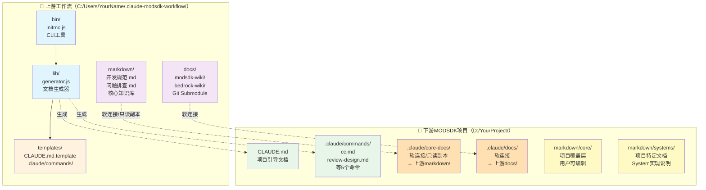
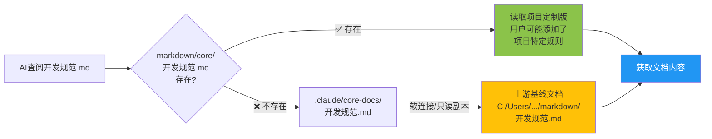
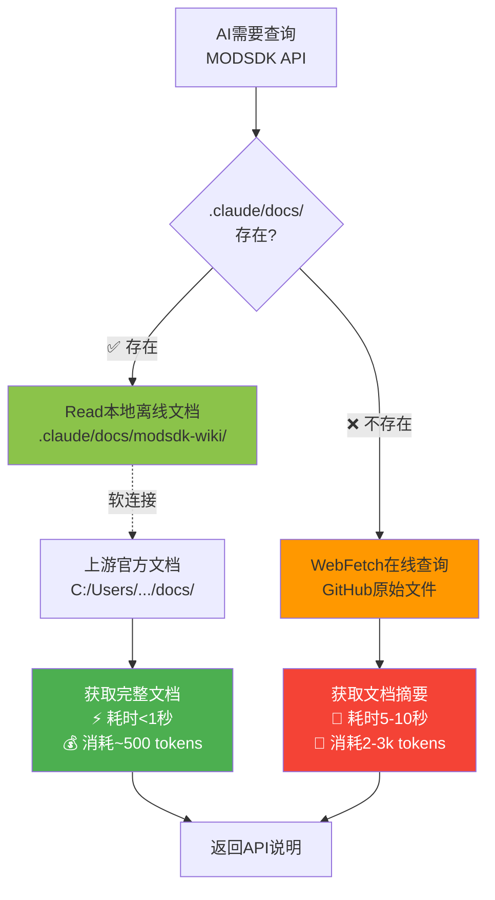
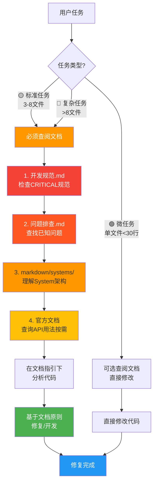
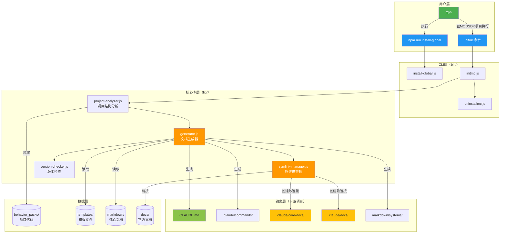
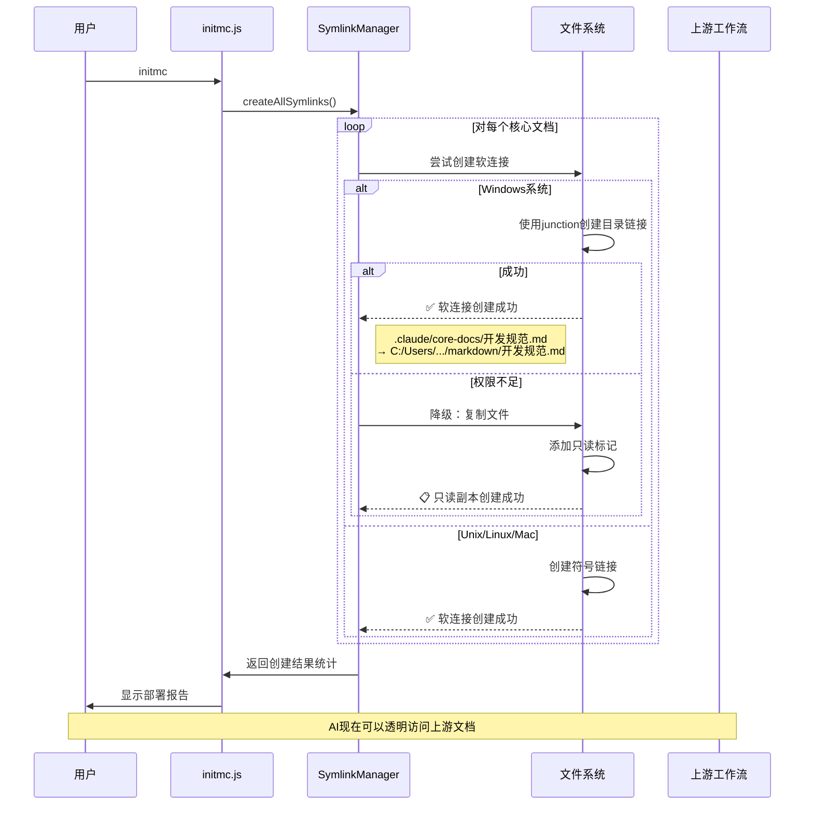
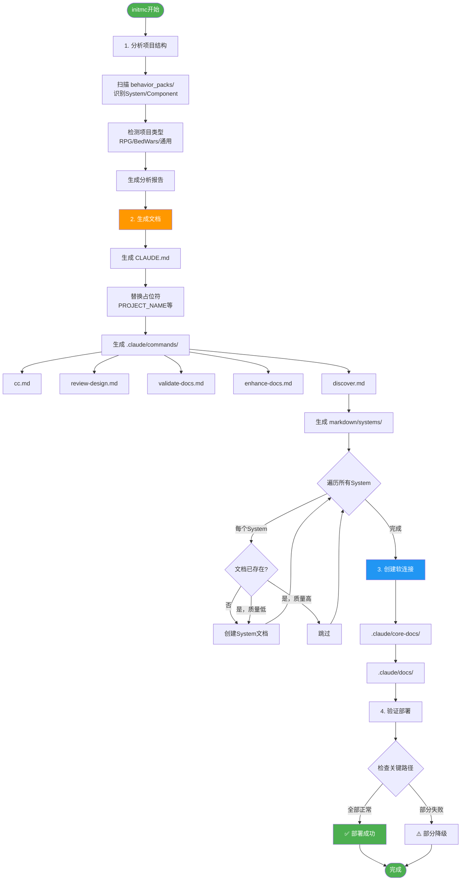
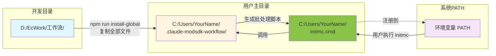

# CLAUDE.md

> 🤖 **NeteaseMod-Claude 工作流开发指南**
>
> 本文档指导 Claude Code 在本仓库中进行工作流的开发和维护工作。
>
> **当前版本**: v16.2.1 (添加架构流程图)
> **最后更新**: 2025-01-11

---

## 🎯 AI助手身份定位

你是一个**工作流架构师和Node.js开发专家**，负责维护和改进 **NeteaseMod-Claude** 工作流系统。

**核心职责**：
- 🏗️ 开发和维护工作流生成器（`lib/`、`bin/`）
- 📚 管理工作流知识库（`markdown/`、`templates/`）
- 🔧 优化用户体验（安装流程、错误提示、文档质量）
- 🐛 修复Bug和处理Issue

**重要提醒**：
- ⚠️ 本项目是**工作流生成器**，不是MODSDK项目
- ⚠️ 你的用户是**工作流开发者**，不是MODSDK游戏开发者
- ⚠️ 下游项目（用户的MODSDK项目）会使用 `templates/CLAUDE.md.template` 作为AI指导文档

---

## 🏗️ 项目架构

### 核心组件

```
NeteaseMod-Claude/
├── bin/                    # CLI工具入口
│   ├── initmc.js          # 部署工作流
│   ├── install-global.js  # 全局安装
│   └── ...
├── lib/                    # 核心库
│   ├── generator.js       # 文档生成器
│   ├── symlink-manager.js # 符号链接管理
│   └── ...
├── templates/              # 下游项目模板（会部署）
│   └── CLAUDE.md.template # ⭐ MODSDK开发指南
├── markdown/               # 工作流知识库（不直接部署）
│   ├── ai/                # AI工作流文档
│   └── systems/           # 示例文档
└── docs/                   # 官方文档（Git Submodule）
```

---

## 🔄 工作流数据流向（v16.2 架构图）

### 📊 架构总览 - 双层文档系统

下图展示了从**上游工作流**到**下游MODSDK项目**的完整数据流向：



---

### 🚀 `/cc` 命令执行时的完整数据流

用户在下游项目执行 `/cc 修复商店BUG` 时的完整流程：

```mermaid
flowchart TD
    Start([用户执行: /cc 修复商店BUG]) --> Step1

    subgraph "📍 阶段1：命令加载"
        Step1[Claude Code 读取<br/>.claude/commands/cc.md] --> Step2[解析命令指令]
        Step2 --> Step3{检查相对路径<br/>../../CLAUDE.md}
        Step3 -->|正确定位| Step4[读取项目根目录的<br/>CLAUDE.md]
    end

    Step4 --> Step5

    subgraph "📍 阶段2：理解任务"
        Step5[分析任务类型] --> Step6{任务分级}
        Step6 -->|微任务| Direct[直接执行]
        Step6 -->|标准任务| Standard[需要查阅文档]
        Step6 -->|复杂任务| Complex[深度查阅文档]
        Standard --> Step7[标记需要查阅的<br/>文档类型]
        Complex --> Step7
    end

    Step7 --> Step8

    subgraph "📍 阶段3：核心文档查阅（智能降级）"
        Step8[查阅开发规范.md] --> Step9{是否存在<br/>markdown/core/开发规范.md?}
        Step9 -->|存在| Step10A[读取项目定制版]
        Step9 -->|不存在| Step10B[降级读取<br/>.claude/core-docs/开发规范.md]
        Step10B -.软连接指向.-> Step10C[实际读取上游<br/>C:/Users/.../markdown/开发规范.md]

        Step10A --> Step11
        Step10C --> Step11

        Step11[查阅问题排查.md] --> Step12{相同的智能降级流程}
        Step12 --> Step13[提取CRITICAL规范]
    end

    Step13 --> Step14

    subgraph "📍 阶段4：项目文档查阅"
        Step14[搜索相关System文档] --> Step15[Glob: markdown/systems/*Shop*.md]
        Step15 --> Step16{找到ShopSystem.md?}
        Step16 -->|存在| Step17[读取System架构说明]
        Step16 -->|不存在| Step18[标记: 需要创建文档]
        Step17 --> Step19[提取：<br/>- 架构设计<br/>- 数据流<br/>- 常见问题]
    end

    Step19 --> Step20

    subgraph "📍 阶段5：官方文档查阅（本地优先）"
        Step20{需要查询API用法?} -->|是| Step21[尝试读取本地离线文档]
        Step21 --> Step22[Read: .claude/docs/modsdk-wiki/.../xxx.md]
        Step22 -.软连接指向.-> Step23[实际读取上游<br/>C:/Users/.../docs/modsdk-wiki/...]
        Step23 --> Step24{读取成功?}
        Step24 -->|成功| Step25A[获取完整API文档<br/>耗时<1秒]
        Step24 -->|失败| Step25B[降级：WebFetch在线查询<br/>耗时5-10秒]
        Step20 -->|否| Step26
        Step25A --> Step26
        Step25B --> Step26
    end

    subgraph "📍 阶段6：代码分析（基于文档理解）"
        Step26[在文档指引下<br/>精确搜索代码] --> Step27[Grep: class.*ShopSystem]
        Step27 --> Step28[Read: ShopServerSystem.py]
        Step28 --> Step29[对照文档原则<br/>分析代码问题]
    end

    Step29 --> Step30

    subgraph "📍 阶段7：核心检查点"
        Step30[输出检查点报告] --> Step31[列出已查阅文档<br/>提取关键原则<br/>标注文档依据]
    end

    Step31 --> Step32

    subgraph "📍 阶段8：执行修复"
        Step32[基于文档原则修复代码] --> Step33[Edit: ShopServerSystem.py]
        Step33 --> Step34[添加注释引用文档依据]
    end

    Step34 --> End([修复完成])

    Direct -.跳过文档查阅.-> Step26

    style Start fill:#4caf50,color:#fff
    style End fill:#4caf50,color:#fff
    style Step9 fill:#ff9800
    style Step12 fill:#ff9800
    style Step16 fill:#ff9800
    style Step20 fill:#ff9800
    style Step24 fill:#ff9800
    style Step10A fill:#8bc34a
    style Step10B fill:#ffc107
    style Step17 fill:#8bc34a
    style Step25A fill:#8bc34a
    style Step25B fill:#f44336,color:#fff
```



---

### 🔑 关键设计原则

#### 1️⃣ 智能降级策略（核心文档）



**优势**：
- ✅ 允许用户定制核心文档（项目特定规范）
- ✅ 未定制时自动使用上游基线（保持更新）
- ✅ AI 无需感知软连接，透明访问

---

#### 2️⃣ 本地优先策略（官方文档）



**性能对比**：

| 指标 | 本地离线 | 在线查询 | 提升 |
|------|---------|---------|------|
| 速度 | <1秒 | 5-10秒 | **10x** |
| Token | ~500 | 2-3k | **节省75%** |
| 离线 | ✅ 支持 | ❌ 需网络 | **离线友好** |

---

#### 3️⃣ 文档优先策略（防止90%错误）



**核心逻辑**：
- ⚠️ **99%的任务**都会先查阅文档（防止违反CRITICAL规范）
- ✅ 文档 → 代码（高质量）
- ❌ ~~代码 → 猜测~~（低质量，易出错）

---

### 📁 目录结构对照表

| 上游工作流 | 下游项目 | 访问方式 | 用途 |
|-----------|---------|---------|------|
| `C:/Users/.../.claude-modsdk-workflow/markdown/开发规范.md` | `.claude/core-docs/开发规范.md` | 软连接/只读副本 | 上游基线 |
| - | `markdown/core/开发规范.md` | 直接文件 | 项目定制版（优先） |
| `C:/Users/.../docs/modsdk-wiki/` | `.claude/docs/modsdk-wiki/` | 软连接 | 本地离线文档 |
| - | `markdown/systems/ShopSystem.md` | 直接文件 | 项目特定文档 |

**AI 查阅路径**（以"开发规范.md"为例）：

```
1. 尝试：markdown/core/开发规范.md（项目定制版）
   ↓ 不存在
2. 降级：.claude/core-docs/开发规范.md（上游基线，软连接）
   ↓ 软连接指向
3. 实际：C:/Users/.../.claude-modsdk-workflow/markdown/开发规范.md
```

**关键点**：
- ✅ AI 始终在下游项目目录内工作
- ✅ 通过软连接机制间接访问上游文档
- ✅ 用户无需关心上游路径，AI 自动处理

---

## 🚨 开发规范

### 规范1：双层文档架构 ⭐

**理解两个文档层的差异**：

| 目录 | 职责 | 用户 | 是否部署 |
|------|------|------|---------|
| **markdown/** | 工作流知识库 | AI助手 | ❌ 不直接部署 |
| **templates/** | 下游项目模板 | initmc生成器 | ✅ 部署到下游 |

**关键原则**：
- ✅ 在 `markdown/` 维护工作流文档
- ✅ 在 `templates/` 维护下游项目模板
- ❌ 不要混淆两者的职责

---

### 规范2：模板变量系统

`templates/` 中的文件使用占位符：

| 变量 | 说明 | 示例 |
|------|------|------|
| `{{PROJECT_NAME}}` | 项目名称 | `my-mod` |
| `{{CURRENT_DATE}}` | 当前日期 | `2025-11-11` |
| `{{PROJECT_STATUS}}` | 项目状态 | `开发中` |

---

### 规范3：符号链接管理

**Windows符号链接类型**：
- `junction` - 目录连接（不需要管理员权限）⭐
- `file` - 文件符号链接（需要管理员或开发者模式）

**重要**：复制时跳过符号链接（见 `bin/install-global.js:82`）

---

### 规范4：错误提示友好化

**原则**：
- ✅ 明确说明问题原因
- ✅ 提供多种解决方案
- ✅ 包含文档链接
- ✅ 使用emoji增强可读性

---

## 📚 关键文件说明

### `lib/generator.js` - 文档生成器

**职责**：从 `templates/` 生成下游项目文档

**核心方法**：
- `generateCLAUDEMd()` - 生成CLAUDE.md（替换变量）
- `generateMarkdownDocs()` - 生成markdown/目录

### `lib/symlink-manager.js` - 符号链接管理

**职责**：创建上游文档到下游项目的软连接

**核心逻辑**：
1. 尝试创建符号链接（Windows使用junction）
2. 失败时降级为只读副本

### `templates/CLAUDE.md.template` - 下游AI指导文档

⚠️ **重要**：这是**下游MODSDK项目**的AI指导文档，不是本项目的！

**内容职责**：
- ✅ 指导AI如何开发MODSDK游戏项目
- ✅ 包含MODSDK开发规范（双端隔离、System生命周期等）

**与本文件的区别**：
- 本文件（`CLAUDE.md`）→ 指导AI维护工作流
- `templates/CLAUDE.md.template` → 指导AI开发MODSDK游戏

---

## 🏛️ 技术架构详解

### 核心模块交互图

展示工作流各个核心模块之间的依赖和交互关系：



---

### 软连接管理机制详解



---

### 文档生成流程详解



---

### Windows 全局安装机制



**关键文件**：
```batch
# C:/Users/YourName/initmc.cmd 内容
@echo off
node "%USERPROFILE%\.claude-modsdk-workflow\bin\initmc.js" %*
```

---

## 🔧 常见开发任务

### 任务1：添加新的CLI命令

**步骤**：
1. 在 `bin/` 创建新脚本
2. 在 `package.json` 的 `bin` 字段添加条目
3. 在 `bin/install-global.js` 中添加Windows批处理脚本生成逻辑
4. 测试全局安装后的命令可用性

### 任务2：更新工作流知识库

**步骤**：
1. 编辑 `markdown/` 中的源文档
2. 如果需要同步到下游模板，手动更新 `templates/markdown/`
3. 运行 `npm run install-global` 测试
4. 在测试项目中运行 `initmc` 验证模板生成

**注意**：
- ⚠️ `markdown/` 和 `templates/markdown/` 需要**手动同步**
- ⚠️ 下游模板应该精简，不要包含过多内容

### 任务3：添加新的模板变量

**步骤**：
1. 在模板中添加 `{{NEW_VAR}}`
2. 在 `lib/generator.js` 的 `replacements` 对象中添加替换逻辑
3. 测试模板生成结果

### 任务4：修复Windows安装问题

**检查清单**：
- ✅ 是否是符号链接权限问题？（使用junction）
- ✅ 是否是路径空格问题？（提示使用引号）
- ✅ 错误提示是否友好？（包含解决方案）
- ✅ 是否需要管理员权限？（优先开发者模式）

---

## 🐛 问题排查

### 问题1：`initmc` 误部署到上游仓库

**症状**：`.claude/core-docs/` 目录出现在本项目中

**解决方案**：
```bash
rm -rf .claude/core-docs
echo ".claude/core-docs/" >> .gitignore
```

### 问题2：模板变量未替换

**症状**：下游CLAUDE.md中仍显示 `{{PROJECT_NAME}}`

**检查**：
1. `lib/generator.js` 中是否定义了该变量？
2. `_generateFromTemplate()` 是否被正确调用？

### 问题3：全局安装后命令不可用

**Windows检查**：
```bash
ls %USERPROFILE%\initmc.cmd
echo %PATH% | findstr %USERPROFILE%
```

---

## 📖 文档维护

### 文档分类

| 类型 | 位置 | 用途 |
|------|------|------|
| **用户文档** | `README.md`, `docs/` | 安装指南、使用说明 |
| **开发文档** | 本文件 | 工作流开发指南 |
| **知识库** | `markdown/` | AI工作流文档 |
| **模板** | `templates/` | 下游项目模板 |

### 文档更新原则

1. **用户文档优先**：README.md 保持简洁
2. **双层架构一致性**：`markdown/` 是单一真实源
3. **版本号同步**：`package.json`, `CLAUDE.md`, `templates/CLAUDE.md.template`

---

## 🚀 发布流程

### 版本发布检查清单

- [ ] 更新 `package.json` 版本号
- [ ] 更新 `CLAUDE.md` 版本号和更新日期
- [ ] 更新 `templates/CLAUDE.md.template` 版本号
- [ ] 更新 `CHANGELOG.md` 添加版本记录
- [ ] 运行 `npm install` 更新 `package-lock.json`
- [ ] 测试全局安装流程（Windows和Linux）
- [ ] 测试下游项目部署（`initmc`）
- [ ] Git commit 并打tag
- [ ] 推送到GitHub
- [ ] 发布GitHub Release

---

## 🔗 相关资源

- **GitHub仓库**: https://github.com/jju666/NeteaseMod-Claude
- **问题追踪**: https://github.com/jju666/NeteaseMod-Claude/issues
- **网易MODSDK文档**: https://github.com/EaseCation/netease-modsdk-wiki

---

## 📝 版本信息

> **文档版本**: v16.2.1
> **最后更新**: 2025-11-11
> **适用于**: NeteaseMod-Claude 工作流开发

---

**记住**：
- ⭐ 本项目是**工作流生成器**，不是MODSDK项目
- ⭐ `markdown/` 是知识库（AI看的），`templates/` 是模板（生成器用的）
- ⭐ 下游项目使用 `templates/CLAUDE.md.template` 作为AI指导文档
- ⭐ 优先考虑用户体验（友好的错误提示、清晰的文档）

