# CLAUDE.md - NeteaseMod-Claude 工作流生成器开发指南

> 🤖 **工作流架构师和Node.js开发专家必读文档**
>
> 本文档指导 Claude Code 在本仓库中进行工作流的开发和维护工作。
>
> **当前版本**: v18.2.0
> **最后更新**: 2025-11-12
> **文档状态**: ✅ 完整技术文档

---

## 📑 文档导航

### 🎯 核心章节（必读）
- [第一章：项目概览](#-第一章项目概览) - 项目定位、版本信息、技术栈
- [🔍 快速查阅索引](#-快速查阅索引ai常用) - AI常用操作速查
- [第二章：架构设计全景](#️-第二章架构设计全景) - 完整架构图解
- [第三章：开发规范](#-第三章开发规范) - ⚠️ 极其重要，优先阅读

### 🔧 核心机制（深度理解）
- 第四章：核心机制详解 - 双层文档、生成器、模板系统
- 第五章：配置系统详解 - 占位符、路径映射
- 第六章：文档生成器深度解析 - Layer 1/2/3架构
- 第七章：软连接管理器实现 - 跨平台支持

### 📚 高级内容（完整理解）
- 第八章：项目分析器实现 - 复杂度评分算法
- 第九章：版本管理系统 - 升级流程、迁移脚本
- 第十章：完整工作流程 - 执行流程图
- 第十一章：Claude命令系统 - 6个核心命令详解

### 📖 参考资料
- 第十二章：关键特性与技术亮点 - 技术评分
- 第十三章：问题排查指南 - 故障诊断
- 第十四章：技术参考 - 算法公式、性能指标
- [附录](#-附录) - 版本历史、术语表、FAQ

---

## 🎯 第一章：项目概览

### 1.1 项目定位与核心职责

#### 项目身份

**NeteaseMod-Claude** 是一个**工作流生成器**（Workflow Generator），而非MODSDK游戏项目。

```
┌──────────────────────────────────────────────────────┐
│  NeteaseMod-Claude (本项目)                          │
│  ├─ 身份: 工作流生成器                               │
│  ├─ 开发者: 工作流架构师                             │
│  ├─ 用户: MODSDK游戏开发者                          │
│  └─ 输出物: 下游项目的工作流文件                    │
└──────────────────────────────────────────────────────┘
              │ initmc 部署
              ↓
┌──────────────────────────────────────────────────────┐
│  下游MODSDK项目 (用户项目)                            │
│  ├─ 身份: MODSDK游戏项目                             │
│  ├─ 开发者: 游戏开发者                               │
│  ├─ AI助手: Claude Code (使用工作流)                │
│  └─ 输出物: 网易我的世界MOD                         │
└──────────────────────────────────────────────────────┘
```

#### AI助手身份定位

你是一个**工作流架构师和Node.js开发专家**，负责维护和改进 **NeteaseMod-Claude** 工作流系统。

**核心职责**:
- 🏗️ 开发和维护工作流生成器（[lib/](lib/), [bin/](bin/)）
- 📚 管理工作流知识库（[markdown/](markdown/)）
- 🔧 优化用户体验（安装流程、错误提示、文档质量）
- 🐛 修复Bug和处理Issue

**重要提醒**:
- ⚠️ 本项目是**工作流生成器**，不是MODSDK项目
- ⚠️ 你的用户是**工作流使用者**（MODSDK游戏开发者），不是工作流开发者
- ⚠️ 下游项目（用户的MODSDK项目）会使用 [templates/CLAUDE.md.template](templates/CLAUDE.md.template) 作为AI指导文档

---

### 1.2 版本信息

| 项目 | 版本 | 说明 |
|------|------|------|
| **当前版本** | v18.0.0 | 下游CLAUDE.md完全解耦 + 智能文档路由 |
| **最后更新** | 2025-11-12 | 本文档编写日期 |
| **Node.js要求** | >=12.0.0 | 见 [package.json:42](package.json#L42) |
| **核心依赖** | fs-extra, glob | 见 [package.json:44-47](package.json#L44-L47) |

**版本号定义位置**:
- [lib/config.js:29](lib/config.js#L29) - `const VERSION = '18.0.0';`
- [package.json:3](package.json#L3) - `"version": "18.0.0"`
- 本文档顶部版本声明

**重要提醒**: 修改版本号时必须同步更新这3个位置！详见 [3.4 版本发布检查清单](#34-版本发布检查清单)。

---

### 1.3 技术栈与依赖

#### 核心技术栈

| 技术 | 版本 | 用途 |
|------|------|------|
| **Node.js** | >=12.0.0 | 运行时环境 |
| **JavaScript (ES6+)** | - | 编程语言 |
| **fs-extra** | ^10.1.0 | 增强的文件系统操作 |
| **glob** | ^7.2.0 | 文件模式匹配 |
| **Git Submodule** | - | 官方文档集成 |

#### 设计模式应用

| 设计模式 | 应用位置 | 说明 |
|---------|---------|------|
| **生成器模式** | [lib/generator.js](lib/generator.js) | 分层生成文档（Layer 1/2/3） |
| **策略模式** | [lib/symlink-manager.js](lib/symlink-manager.js) | 软连接降级策略 |
| **单例模式** | [lib/config.js](lib/config.js) | 全局配置管理 |
| **模板方法模式** | [lib/generator.js](lib/generator.js) | 文档生成流程 |

#### 跨平台支持

| 平台 | 支持状态 | 软连接方式 | 说明 |
|-----|---------|-----------|------|
| **Windows** | ✅ 已测试 | Junction/Symlink → 只读副本 | 见 [lib/symlink-manager.js](lib/symlink-manager.js) |
| **Linux** | ✅ 已测试 | Symlink | 原生支持 |
| **macOS** | ✅ 理论支持 | Symlink | 原生支持 |

---

### 1.4 与下游项目的关系

#### 工作流部署关系图

```
上游项目（NeteaseMod-Claude）
├─ 开发：工作流架构师
├─ 维护：lib/, bin/, markdown/, templates/
└─ 发布：npm run install-global
      │
      │ 全局安装到 ~/.claude-modsdk-workflow/
      ↓
下游项目（用户的MODSDK项目）
├─ 使用者：游戏开发者
├─ 初始化：initmc
├─ 生成物：CLAUDE.md, .claude/, markdown/
└─ AI助手：Claude Code (读取工作流文件)
```

#### 文件流向图

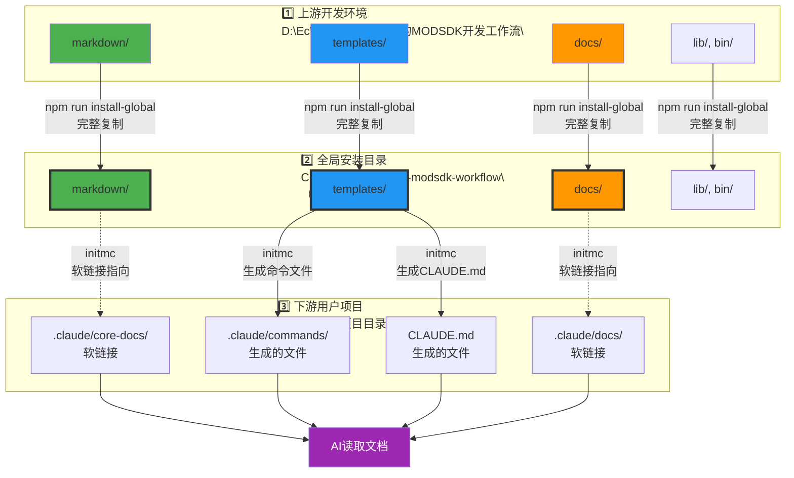

#### 职责边界表（v18.0更新）

| 目录/文件 | 上游开发环境<br/>（D盘） | 全局安装目录<br/>（C盘） | 下游用户项目 | 部署方式 |
|----------|---------|---------|---------|---------|
| **markdown/** | ✅ 开发维护 | 📦 完整复制 | 📖 只读引用（软链接） | `npm install-global` → `initmc` |
| **templates/** | ✅ 开发维护 | 📦 完整复制 | 🚫 不可见 | `npm install-global` |
| **lib/, bin/** | ✅ 开发维护 | 📦 完整复制 | 🚫 不可见 | `npm install-global` |
| **docs/** | ✅ Git Submodule | 📦 完整复制 | 📖 只读引用（软链接） | `npm install-global` → `initmc` |
| **.claude/commands/** | 🚫 不存在 | ✅ 作为生成源 | 📝 生成的命令文件 | `initmc` 从全局目录生成 |
| **CLAUDE.md** | 🚫 不存在 | ✅ 模板文件 | ✅ **用户完全管理** ⭐ | 仅首次生成最小模板 |
| **markdown/core/** | 🚫 不存在 | 🚫 不存在 | ✅ 项目定制文档 | 下游用户创建 |
| **markdown/systems/** | 🚫 不存在 | 🚫 不存在 | ✅ 项目System文档 | 下游自动生成 |

**关键说明**:
- 📦 全局安装目录是工作流的**运行时环境**（通过 `npm run install-global` 创建）
- 🔗 下游项目的软链接指向**全局安装目录**，而非上游开发环境
- 🎯 上游开发环境仅供工作流开发者使用

---

## 🔍 快速查阅索引（AI常用）

> 💡 **使用说明**: 当你需要执行特定操作时，快速定位到相关章节。

### 📝 当你需要修改核心文档...

| 操作 | 文件位置 | 注意事项 |
|-----|---------|---------|
| 修改开发规范 | [markdown/核心工作流文档/开发规范.md](markdown/核心工作流文档/开发规范.md) | ✅ 直接编辑（单一真实源） |
| 修改问题排查 | [markdown/核心工作流文档/问题排查.md](markdown/核心工作流文档/问题排查.md) | ✅ 直接编辑 |
| 修改API速查 | [markdown/概念参考/API速查.md](markdown/概念参考/API速查.md) | ✅ 直接编辑 |
| ❌ 禁止操作 | ~~templates/markdown/开发规范.md.template~~ | ❌ 已删除（v16.3重构） |

**关键规范**: 参见 [3.1 职责边界规范](#31-职责边界规范v163重构后)

---

### 🔧 当你需要修改生成器逻辑...

| 操作 | 文件位置 | 关键方法 |
|-----|---------|---------|
| 添加新占位符 | [lib/config.js:66-81](lib/config.js#L66-L81) | `PLACEHOLDERS` 定义 |
| | [lib/generator.js](lib/generator.js) | `_buildReplacements()` 计算值 |
| 修改软连接规则 | [lib/symlink-manager.js](lib/symlink-manager.js) | `_getCoreFiles()` 包含/排除模式 |
| 调整复杂度评分 | [lib/project-analyzer.js](lib/project-analyzer.js) | `_calculateComplexity()` 算法 |
| 修改Layer生成逻辑 | [lib/generator.js](lib/generator.js) | `_generateLayer1/2/3()` |

**详细说明**:
- 占位符系统 → [3.2 模板变量系统规范](#32-模板变量系统规范)
- 软连接管理 → [3.3 软连接管理规范](#33-软连接管理规范)

---

### 🚀 当你需要发布新版本...

**完整检查清单**: 见 [3.4 版本发布检查清单](#34-版本发布检查清单)（15项）

**快速核心步骤**:
1. 更新 [lib/config.js:29](lib/config.js#L29) 的 `VERSION`
2. 更新 [package.json:3](package.json#L3) 的 `version`
3. 更新本文档顶部版本号
4. 更新 [templates/CLAUDE.md.template](templates/CLAUDE.md.template) 版本号
5. 运行 `npm run install-global` 测试全局安装
6. 测试升级路径（v15.x → 当前，v16.x → 当前）

**⚠️ 平滑升级原则**: 见 [3.2 平滑升级原则（极其重要）](#32-平滑升级原则极其重要)

---

### 🐛 当你遇到问题...

| 问题类型 | 快速定位 |
|---------|---------|
| 软连接创建失败 | [问题1: 软连接创建失败](#问题1-软连接创建失败) |
| 全局安装后命令不可用 | [问题2: 全局安装后命令不可用](#问题2-全局安装后-initmc-命令不可用) |
| 模板文件未找到 | [问题3: 模板文件未找到](#问题3-模板文件未找到) |
| 文档冗余问题 | [问题4: 文档冗余](#问题4-文档冗余v163已修复) |

**完整问题排查**: 见 [第十三章：问题排查指南](#-第十三章问题排查指南)

---

### 📚 关键规范速查

#### ✅ 正确做法

- ✅ 在 [markdown/核心工作流文档/](markdown/核心工作流文档/) 维护核心文档
- ✅ 在 [templates/](templates/) 维护项目特定模板（4个文件）
- ✅ 通过软连接部署核心文档到下游 `.claude/core-docs/`
- ✅ 必须保持向后兼容，至少支持最近2个大版本的升级路径
- ✅ 必须提供自动迁移脚本（放在 `lib/migration-vX.X.js`）

#### ❌ 禁止行为

- ❌ 在 [templates/markdown/](templates/markdown/) 维护核心工作流文档副本
- ❌ 通过 `_generateFromTemplate()` 生成核心文档（应使用软连接）
- ❌ 引入破坏性变更（除非提供自动迁移脚本）
- ❌ 直接删除已有功能（必须先标记为 deprecated）
- ❌ 跳过版本发布检查清单的任何一项

---

## 🏗️ 第二章：架构设计全景

### 2.1 核心设计原则

NeteaseMod-Claude 采用 **生成器模式 + 双层文档架构**，实现了工作流的模块化和可升级性。

#### 四大核心设计原则

```
1. 单一真实源（Single Source of Truth）
   └─ markdown/ 是唯一的核心文档源
   └─ templates/ 只包含项目特定模板（4个文件）

2. 软连接复用（Symlink Reuse）
   └─ 通过软连接避免文档冗余
   └─ 降级策略：软连接 → 只读副本

3. 分层生成（Layered Generation）
   └─ Layer 1: 通用层（核心工作流）
   └─ Layer 2: 架构层（Systems文档）
   └─ Layer 3: 业务层（框架）

4. 平滑升级（Smooth Upgrade）
   └─ 保护用户定制（项目扩展区）
   └─ 支持自动迁移（v15.x → v16.x → v17.x）
```

---

### 2.2 架构流程图

#### 工作流部署全景图

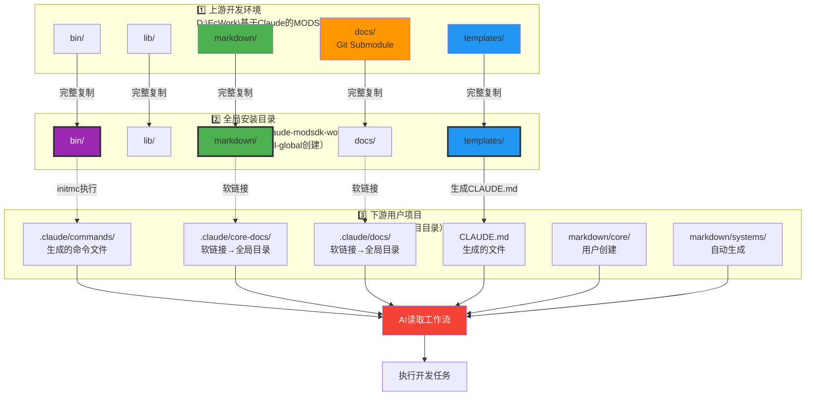

---

### 2.3 完整目录结构

#### 上游项目（NeteaseMod-Claude）

```
D:\EcWork\基于Claude的MODSDK开发工作流\
├─ 📦 bin/                      CLI工具入口（7个脚本）
│   ├─ initmc.js                 初始化下游项目工作流
│   ├─ install-global.js         全局安装到 ~/.claude-modsdk-workflow/
│   ├─ uninstallmc.js            清理下游项目工作流
│   ├─ quick-deploy.js           快速部署（别名）
│   ├─ merge-conflicts.js        合并覆盖层冲突（可选工具）
│   ├─ detect-obsolete.js        检测废弃文件（可选工具）
│   └─ uninstall-global.js       卸载全局安装
│
├─ 🔧 lib/                      核心生成器（22个模块）
│   ├─ generator.js              文档生成器（Layer 1/2/3）
│   ├─ symlink-manager.js        软连接管理（核心机制）
│   ├─ project-analyzer.js       代码结构分析
│   ├─ config.js                 版本号+路径配置
│   ├─ version-checker.js        版本追踪
│   ├─ utils.js                  工具函数
│   └─ ... (其他16个模块)
│
├─ 📚 markdown/                 工作流知识库（单一真实源，80+文件）
│   ├─ 核心工作流文档/           开发规范、问题排查、快速开始
│   ├─ 概念参考/                 MODSDK核心概念、API速查
│   ├─ 深度指南/                 性能优化、事件系统、ECS架构
│   ├─ ai/                       任务模式策略表、快速通道流程
│   ├─ systems/                  System文档模板（不部署到下游）
│   └─ 可选工具说明.md
│
├─ 📄 templates/                下游项目模板
│   ├─ CLAUDE.md.template        下游AI指导文档
│   ├─ README.md.template        项目说明
│   ├─ .claude/commands/         6个Claude命令模板（v17.1）
│   │   ├─ mc.md.template         /mc 主命令
│   │   ├─ mc-review.md.template  /mc-review 方案审查
│   │   ├─ mc-perf.md.template    /mc-perf 性能分析
│   │   ├─ mc-docs.md.template    /mc-docs 文档审计
│   │   ├─ mc-why.md.template     /mc-why 原理解释
│   │   └─ mc-discover.md.template /mc-discover 结构发现
│   └─ markdown/                  项目特定文档模板（仅4个）
│       ├─ README.md.template     文档导航
│       ├─ 索引.md.template       快速索引
│       ├─ 项目状态.md.template   项目状态
│       └─ 文档待补充清单.md.template 待办清单
│
├─ 📖 docs/                     官方文档（Git Submodule）
│   ├─ modsdk-wiki/              网易MODSDK官方文档
│   └─ bedrock-wiki/             Minecraft基岩版Wiki
│
├─ 📝 CLAUDE.md                 本文档（AI工作流指南）
├─ 📝 README.md                 用户说明（简洁版）
├─ 📦 package.json              项目配置
└─ 📜 .gitmodules               Git Submodule配置
```

**关键文件统计**:
- CLI工具: 7个 ([bin/](bin/))
- 核心库: 22个模块 ([lib/](lib/))
- 核心文档: 80+ Markdown文件 ([markdown/](markdown/))
- 模板文件: 12个（1个CLAUDE + 6个命令 + 5个项目文档）
- 官方文档: 2个Git Submodule（[docs/](docs/)）

---

#### 全局安装目录（运行时环境）

```
Windows: C:\Users\xxx\.claude-modsdk-workflow\
Linux/Mac: ~/.claude-modsdk-workflow/

├─ 📦 bin/                      CLI工具（与上游完全相同）
├─ 🔧 lib/                      核心生成器（与上游完全相同）
├─ 📚 markdown/                 工作流知识库（与上游完全相同）
├─ 📄 templates/                项目模板（与上游完全相同）
├─ 📖 docs/                     官方文档（与上游完全相同）
├─ 📝 README.md                 与上游相同
├─ 📦 package.json              与上游相同
└─ 📜 .gitmodules               与上游相同
```

**创建方式**:
```bash
cd "D:\EcWork\基于Claude的MODSDK开发工作流"
npm run install-global
```

**作用说明**:
- 🎯 这是工作流的**运行时环境**，所有下游项目共用
- 🔄 `initmc` 命令从这里读取模板和配置
- 🔗 下游项目的软链接指向这里，而非上游开发环境
- 📦 完整复制上游所有文件，确保独立运行

---

#### 下游项目（用户的MODSDK项目）

```
D:\YourProject\                 用户的MODSDK项目
├─ 📄 CLAUDE.md                 从模板生成，指导AI开发
├─ 📄 README.md                 从模板生成，项目说明
│
├─ 📁 .claude/                  Claude Code配置目录
│   ├─ commands/                6个Claude命令（v17.1）
│   │   ├─ mc.md                 /mc 主命令
│   │   ├─ mc-review.md          /mc-review 方案审查
│   │   ├─ mc-perf.md            /mc-perf 性能分析
│   │   ├─ mc-docs.md            /mc-docs 文档审计
│   │   ├─ mc-why.md             /mc-why 原理解释
│   │   └─ mc-discover.md        /mc-discover 结构发现
│   │
│   ├─ core-docs/               上游文档软连接（只读）
│   │   ├─ 核心工作流文档/ → [软连接到全局安装目录 markdown/核心工作流文档/]
│   │   ├─ 概念参考/ → [软连接到全局安装目录 markdown/概念参考/]
│   │   ├─ 深度指南/ → [软连接到全局安装目录 markdown/深度指南/]
│   │   └─ AI策略文档/ → [软连接到全局安装目录 markdown/AI策略文档/]
│   │
│   ├─ docs/                    官方文档软连接（可选）
│   │   ├─ modsdk-wiki/ → [软连接到全局安装目录 docs/modsdk-wiki/]
│   │   └─ bedrock-wiki/ → [软连接到全局安装目录 docs/bedrock-wiki/]
│   │
│   └─ workflow-manifest.json   版本追踪文件（v17.0+）
│
├─ 📁 markdown/                 项目文档
│   ├─ README.md                文档导航（从模板生成）
│   ├─ 索引.md                  快速索引（AI自动维护）
│   ├─ 项目状态.md              项目状态（AI自动维护）
│   ├─ 文档待补充清单.md        待办清单（AI自动维护）
│   │
│   ├─ core/                    项目覆盖层（用户可定制）
│   │   └─ 开发规范.md           项目定制版（如存在，优先于上游基线）
│   │
│   ├─ systems/                 项目System文档（AI生成）
│   │   ├─ ShopServerSystem.md   商店系统实现文档
│   │   ├─ PlayerDataSystem.md   玩家数据系统文档
│   │   └─ ... (其他System文档)
│   │
│   └─ NEWRPG/                  业务层框架（如果是RPG项目）
│
├─ 📁 tasks/                    AI任务上下文（AI管理）
│   ├─ task-001-修复商店BUG/
│   │   ├─ context.md            任务上下文
│   │   └─ solution.md           解决方案
│   └─ task-002-实现新系统/
│
├─ 📁 behavior_packs/           MODSDK代码（用户开发）
│   └─ YourModPack/
│       ├─ modMain.py            Mod入口
│       ├─ systems/              System目录
│       └─ components/           Component目录
│
└─ 📁 logs/                     日志目录（可选）
```

**文件来源说明**:
- ✅ 从模板生成: `CLAUDE.md`, `.claude/commands/`, `markdown/README.md` 等
- 🔗 软连接引用: `.claude/core-docs/`, `.claude/docs/`
- 🤖 AI自动生成: `markdown/systems/`, `tasks/`
- 👤 用户创建: `markdown/core/`, `behavior_packs/`

---

### 2.4 关键路径说明

#### 配置路径（lib/config.js）

```javascript
// lib/config.js:10-22
const GLOBAL_WORKFLOW_HOME = path.join(os.homedir(), '.claude-modsdk-workflow');
const LOCAL_WORKFLOW_HOME = path.resolve(__dirname, '..');

// 智能选择：优先使用全局目录
const WORKFLOW_HOME = fs.existsSync(GLOBAL_WORKFLOW_HOME)
  ? GLOBAL_WORKFLOW_HOME
  : LOCAL_WORKFLOW_HOME;

const TEMPLATES_DIR = path.join(WORKFLOW_HOME, 'templates');
const RULES_LIBRARY_DIR = path.join(WORKFLOW_HOME, 'rules-library');
const DOC_TEMPLATES_DIR = path.join(WORKFLOW_HOME, 'doc-templates');
```

**路径优先级**:
1. 全局目录: `C:\Users\YourName\.claude-modsdk-workflow\` (Windows)
2. 全局目录: `~/.claude-modsdk-workflow/` (Linux/Mac)
3. 本地开发目录: `D:\EcWork\基于Claude的MODSDK开发工作流\` (开发时)

---

## 🔨 第三章：开发规范

> ⚠️ **极其重要**: 本章节包含所有开发时必须遵守的规范，违反这些规范可能导致严重问题。请优先阅读！

### 3.1 职责边界规范（v16.3重构后）

#### 核心原则

**`markdown/` 是单一真实源，`templates/` 只包含项目特定模板。**

| 目录 | 职责 | 是否部署 | 维护方式 | 文件数量 |
|------|------|---------|---------|---------|
| **markdown/** | 工作流知识库（单一真实源） | ✅ 通过软连接 | 直接编辑 | 80+ 文件 |
| **templates/** | 下游项目模板 | ✅ 生成到下游 | 通过占位符 | 12 文件 |

#### ✅ 正确做法 vs ❌ 错误做法

| ✅ 正确 | ❌ 错误 |
|--------|--------|
| 在 [markdown/核心工作流文档/](markdown/核心工作流文档/) 维护开发规范 | ~~在 templates/markdown/ 维护开发规范副本~~ |
| 在 [templates/markdown/](templates/markdown/) 维护项目特定模板（4个文件） | ~~在 templates/markdown/ 维护核心工作流文档~~ |
| 通过软连接部署核心文档到 `.claude/core-docs/` | ~~通过 `_generateFromTemplate()` 生成核心文档~~ |

#### v16.3重构前后对比

**重构前问题（v16.2及之前）**:

```
templates/markdown/
├─ 开发规范.md.template (1157行, v3.0)  ← ❌ 与上游重复，版本过时
├─ 问题排查.md.template (39KB)          ← ❌ 与上游重复
├─ 快速开始.md.template (4.6KB)         ← ❌ 与上游重复
└─ ai/                                  ← ❌ 与上游重复，缺少文件

markdown/核心工作流文档/
├─ 开发规范.md (1858行, v3.1)           ← ✅ 最新版本
├─ 问题排查.md                          ← ✅ 最新版本
└─ 快速开始.md                          ← ✅ 最新版本
```

**重构后（v16.3）**:

```
templates/markdown/
├─ README.md.template                   ← ✅ 项目特定（文档导航）
├─ 索引.md.template                     ← ✅ 项目特定（快速索引）
├─ 项目状态.md.template                 ← ✅ 项目特定（项目状态）
└─ 文档待补充清单.md.template           ← ✅ 项目特定（待办清单）

markdown/核心工作流文档/                 ← ✅ 单一真实源
    → 通过软连接部署到下游 .claude/core-docs/
```

**重构收益**:
- ✅ 消除文档冗余（减少75KB+重复文件）
- ✅ 版本一致性提升（只维护一份文档）
- ✅ 降低维护成本（不需要双份文档同步）
- ✅ 明确职责边界（一目了然）

---

### 3.2 平滑升级原则（极其重要）

> ⚠️ **核心原则**: 任何需求导致的开发变更都必须保证老用户可以平滑升级到最新版本，避免破坏现有工作流。

#### 3.2.1 强制要求

##### 1. 向后兼容性

- ✅ **必须**维护向后兼容性，至少支持最近2个大版本的升级路径
- ✅ **必须**配置文件格式变更时提供自动转换逻辑
- ❌ **禁止**直接删除已有功能，必须先标记为 `deprecated`

**示例**:

```javascript
// ✅ 正确示例：保持向后兼容
function loadConfig(projectPath) {
  const newConfigPath = path.join(projectPath, '.claude/workflow-manifest.json');
  const oldConfigPath = path.join(projectPath, '.claude/workflow-version.json');

  // 优先读取新格式
  if (fs.existsSync(newConfigPath)) {
    return JSON.parse(fs.readFileSync(newConfigPath, 'utf8'));
  }

  // 降级读取旧格式并自动转换
  if (fs.existsSync(oldConfigPath)) {
    const oldConfig = JSON.parse(fs.readFileSync(oldConfigPath, 'utf8'));
    console.log('⚠️ 检测到旧版配置文件，正在自动转换...');
    const newConfig = migrateConfigV15toV16(oldConfig);

    // 保存新格式
    fs.writeFileSync(newConfigPath, JSON.stringify(newConfig, null, 2));
    console.log('✅ 配置文件已升级到 v16 格式');

    return newConfig;
  }

  // 全新项目
  return createDefaultConfig();
}
```

```javascript
// ❌ 错误示例：直接删除旧功能
function loadConfig(projectPath) {
  const configPath = path.join(projectPath, '.claude/workflow-manifest.json');

  if (!fs.existsSync(configPath)) {
    throw new Error('配置文件不存在！请重新运行 initmc');
    // ❌ 这会导致老用户升级后无法使用
  }

  return JSON.parse(fs.readFileSync(configPath, 'utf8'));
}
```

---

##### 2. 自动迁移机制

- ✅ **必须**不得引入破坏性变更，除非提供自动迁移脚本
- ✅ **必须**迁移脚本放在 `lib/migration-vX.X.js` 中
- ✅ **必须**迁移脚本支持 `--dry-run` 参数（预览变更）
- ✅ **必须**迁移过程可回滚，保留用户数据和配置

**迁移脚本模板**:

```javascript
// lib/migration-v17.0.js 模板
/**
 * 从 v16.x 迁移到 v17.0
 * @param {string} projectPath - 项目根目录
 * @param {object} options - { dryRun: boolean }
 * @returns {object} { success: boolean, changes: [], errors: [] }
 */
async function migrateFromV16_to_V17(projectPath, options = {}) {
  const changes = [];
  const errors = [];

  // 1. 检测旧版本特征
  const oldConfigPath = path.join(projectPath, '.claude/old-config.json');
  if (!fs.existsSync(oldConfigPath)) {
    return { success: true, changes: [], errors: [] }; // 不需要迁移
  }

  console.log('🔄 检测到 v16.x 版本，开始迁移到 v17.0...');

  // 2. 备份关键文件
  if (!options.dryRun) {
    await backupFiles(projectPath, ['CLAUDE.md', '.claude/']);
    changes.push('✅ 已备份关键文件');
  } else {
    changes.push('会备份关键文件: CLAUDE.md, .claude/');
  }

  // 3. 执行迁移逻辑
  try {
    // 示例: 转换配置文件格式
    const oldConfig = JSON.parse(fs.readFileSync(oldConfigPath, 'utf8'));
    const newConfig = {
      version: 'v17.0',
      workflowVersion: oldConfig.workflow_version,
      deployedAt: oldConfig.created_at,
      // ... 转换逻辑
    };

    if (options.dryRun) {
      changes.push('会转换配置文件格式: old-config.json → workflow-manifest.json');
      changes.push(`  - version: ${oldConfig.workflow_version} → v17.0`);
    } else {
      fs.writeFileSync(
        path.join(projectPath, '.claude/workflow-manifest.json'),
        JSON.stringify(newConfig, null, 2)
      );
      changes.push('✅ 已转换配置文件格式');
    }

    // 4. 迁移用户定制文件
    const userCustomFiles = ['markdown/core/开发规范.md'];
    for (const file of userCustomFiles) {
      const filePath = path.join(projectPath, file);
      if (fs.existsSync(filePath)) {
        if (options.dryRun) {
          changes.push(`会保留用户定制文件: ${file}`);
        } else {
          changes.push(`✅ 已保留用户定制文件: ${file}`);
        }
      }
    }

  } catch (error) {
    errors.push(`迁移失败: ${error.message}`);
    return { success: false, changes, errors };
  }

  // 5. 输出迁移报告
  console.log('📊 迁移完成，变更清单:');
  changes.forEach(c => console.log(`  - ${c}`));

  if (errors.length > 0) {
    console.log('⚠️ 迁移警告:');
    errors.forEach(e => console.log(`  - ${e}`));
  }

  return { success: true, changes, errors };
}

module.exports = { migrateFromV16_to_V17 };
```

**调用迁移脚本**:

```javascript
// bin/initmc.js 中调用
const { migrateFromV16_to_V17 } = require('../lib/migration-v17.0');

async function checkAndMigrate(projectPath) {
  const currentVersion = detectProjectVersion(projectPath);

  if (currentVersion === 'v16.x') {
    console.log('🔄 检测到旧版本，开始迁移...');

    // 预览变更
    const dryRunResult = await migrateFromV16_to_V17(projectPath, { dryRun: true });
    console.log('📋 预计变更:');
    dryRunResult.changes.forEach(c => console.log(`  - ${c}`));

    // 执行迁移
    const result = await migrateFromV16_to_V17(projectPath, { dryRun: false });

    if (result.success) {
      console.log('✅ 迁移成功！');
    } else {
      console.log('❌ 迁移失败，请查看错误信息');
      process.exit(1);
    }
  }
}
```

---

##### 3. 废弃功能处理

- ✅ **必须**废弃功能先标记为 `deprecated`，保留至少1个大版本周期
- ✅ **必须**在控制台输出清晰的废弃警告，提供替代方案
- ✅ **必须**在 CHANGELOG.md 中明确标注废弃计划

**示例**:

```javascript
// ✅ 正确示例：废弃功能处理
function oldFunction() {
  console.log('⚠️ 警告: oldFunction() 已废弃，将在 v18.0 中移除');
  console.log('💡 请改用 newFunction()，详见文档: https://...');

  // 仍然保持功能可用
  return legacyImplementation();
}

// 推荐使用的新函数
function newFunction() {
  return newImplementation();
}
```

**CHANGELOG.md 记录**:

```markdown
## v17.0.0 (2025-11-12)

### ⚠️ DEPRECATED（废弃功能）

- `oldFunction()` 已标记为废弃，将在 v18.0 中移除
  - **替代方案**: 使用 `newFunction()`
  - **迁移指南**: [详见文档](https://...)
  - **保留周期**: 至 v18.0（预计2026年Q1）
```

---

##### 4. 破坏性变更管理

- ✅ **必须**所有破坏性变更在 CHANGELOG.md 中使用 `⚠️ BREAKING CHANGE` 标注
- ✅ **必须**提供详细的迁移指南（包含代码示例）
- ✅ **必须**在下一个大版本发布前至少1个月发布 RC 版本

**CHANGELOG.md 格式**:

```markdown
## v17.0.0 (2025-11-12)

### ⚠️ BREAKING CHANGES（破坏性变更）

#### 1. 配置文件格式变更

**变更内容**:
- 配置文件从 `.claude/workflow-version.json` 迁移到 `.claude/workflow-manifest.json`
- 字段名称从 `workflow_version` 改为 `workflowVersion`（驼峰命名）

**影响范围**:
- 所有使用 v16.x 的项目
- 需要自动迁移配置文件

**迁移方案**:
1. 自动迁移: 运行 `initmc` 会自动检测并转换
2. 手动迁移: 参考迁移脚本 [lib/migration-v17.0.js](lib/migration-v17.0.js)

**代码示例**:

\`\`\`json
// 旧格式 (.claude/workflow-version.json)
{
  "workflow_version": "v16.3.0",
  "created_at": "2025-11-10"
}

// 新格式 (.claude/workflow-manifest.json)
{
  "version": "v17.0.0",
  "workflowVersion": "v17.0.0",
  "deployedAt": "2025-11-12"
}
\`\`\`

---

#### 2. 命令系统重构

**变更内容**:
- 原有12个独立命令整合为6个统一命令（/mc 前缀）
- 废弃的命令仍可用，但会输出警告

**影响范围**:
- 使用旧命令的用户（如 /cc, /perf）

**迁移方案**:
- 旧命令在 v17.x 仍可用（输出警告）
- 推荐迁移到新命令（/mc, /mc-perf 等）
- 旧命令将在 v18.0 中移除

**命令映射表**:

| 旧命令 | 新命令 | 状态 |
|-------|-------|------|
| /cc | /mc | ⚠️ 废弃 |
| /perf | /mc-perf | ⚠️ 废弃 |
| /doc | /mc-docs | ⚠️ 废弃 |
```

---

#### 3.2.2 测试要求

在发布新版本前，**必须**测试以下升级路径：

| 测试场景 | 测试目标 | 验收标准 |
|---------|---------|---------|
| **全新安装** | 在空项目执行 `initmc` | ✅ 成功生成所有文件 |
| **v15.x → 当前版本** | 模拟老用户升级 | ✅ 自动迁移配置，保留用户定制 |
| **v16.x → 当前版本** | 模拟最近版本升级 | ✅ 自动迁移配置，保留用户定制 |
| **已有定制项目升级** | 验证用户定制文件不被覆盖 | ✅ `markdown/core/` 文件完整保留 |
| **迁移脚本 --dry-run** | 预览变更不修改文件 | ✅ 输出变更清单，文件未修改 |
| **迁移失败回滚** | 模拟迁移失败场景 | ✅ 备份文件可恢复 |

**测试命令**:

```bash
# 1. 测试全新安装
cd /path/to/new-project
initmc

# 2. 测试v16.x升级
cd /path/to/v16-project
initmc --sync  # 或 initmc（自动检测升级）

# 3. 测试迁移预览
cd /path/to/old-project
node bin/migration-test.js --dry-run

# 4. 测试迁移回滚
cd /path/to/test-project
# 修改 .claude/workflow-manifest.json 为旧版本
# 运行 initmc，应自动迁移
# 删除 .claude/workflow-manifest.json
# 从备份恢复，应回到旧版本
```

---

#### 3.2.3 CHANGELOG.md 规范

每个版本发布**必须**在 CHANGELOG.md 中记录：

**标准格式**:

```markdown
## vX.X.X (YYYY-MM-DD)

### ✨ 新功能（New Features）
- 功能1描述
- 功能2描述

### ⚠️ BREAKING CHANGES（破坏性变更）
（如果没有破坏性变更，标注"无破坏性变更"）

- **变更1**: 详细描述
  - **影响范围**: ...
  - **迁移方案**: ...
  - **代码示例**: ...

### 🔧 改进（Improvements）
- 改进1描述
- 改进2描述

### 🐛 修复（Bug Fixes）
- 修复1描述
- 修复2描述

### ⚠️ DEPRECATED（废弃功能）
（如果没有废弃功能，省略此节）

- `oldFunction()` 已标记为废弃，将在 vX.X 中移除
  - **替代方案**: ...
  - **保留周期**: 至 vX.X

### 📦 迁移指南（Migration Guide）
- 从 vOLD.X 升级: 执行步骤...
- 从 vPREVIOUS.X 升级: 执行步骤...
- 建议升级路径: ...

### 📝 其他变更（Other Changes）
- 文档更新
- 依赖升级
```

**完整示例（v17.1.0）**:

```markdown
## v17.1.0 (2025-11-12)

### ✨ 新功能
- 新增方案自检与专家审核流程
- 6个统一Claude命令体系（/mc 前缀）
- 强化步骤2强制文档查阅机制

### ⚠️ BREAKING CHANGES
（无破坏性变更）

### 🔧 改进
- 优化软连接降级策略
- 提升文档质量评估准确性（0-5分制）
- 完善Windows跨平台支持

### 🐛 修复
- 修复Windows下权限问题导致的软连接创建失败
- 修复initmc时ai文档部署失败的BUG

### 📦 迁移指南
- **从 v17.0 升级**: 执行 `initmc --sync` 自动升级
- **从 v16.x 升级**: 执行 `initmc --sync`，会自动执行迁移脚本
- **从 v15.x 升级**: 建议先升级到 v16.3，再升级到 v17.1

### 📝 其他变更
- 更新 CLAUDE.md 工作流开发指南
- 清理 templates/ 冗余文档（v16.3重构）
```

---

### 3.3 模板变量系统规范

#### 添加新占位符的完整步骤

**步骤1**: 在 [lib/config.js:66-81](lib/config.js#L66-L81) 的 `PLACEHOLDERS` 中定义占位符。

```javascript
// lib/config.js
const PLACEHOLDERS = {
  PROJECT_PATH: '{{PROJECT_PATH}}',
  PROJECT_NAME: '{{PROJECT_NAME}}',
  NEW_VAR: '{{NEW_VAR}}',  // ← 添加新占位符
  // ... 其他占位符
};
```

**步骤2**: 在 [lib/generator.js](lib/generator.js) 的 `_buildReplacements()` 方法中计算占位符的值。

```javascript
// lib/generator.js
_buildReplacements(targetPath) {
  const projectName = path.basename(targetPath);

  return {
    '{{PROJECT_PATH}}': targetPath,
    '{{PROJECT_NAME}}': projectName,
    '{{NEW_VAR}}': this._computeNewVar(targetPath),  // ← 计算新变量
    // ... 其他变量
  };
}

_computeNewVar(targetPath) {
  // 实现计算逻辑
  return 'computed value';
}
```

**步骤3**: 在模板文件中使用占位符。

```markdown
<!-- templates/CLAUDE.md.template -->
# {{PROJECT_NAME}}

项目路径: {{PROJECT_PATH}}
新变量: {{NEW_VAR}}
```

**步骤4**: 验证占位符替换。

```bash
# 测试初始化
cd /path/to/test-project
initmc

# 检查生成的文件
cat CLAUDE.md | grep "新变量"
```

#### 占位符命名规范

| 规范 | 示例 | 说明 |
|------|------|------|
| **全大写** | `{{PROJECT_PATH}}` | ✅ 推荐 |
| **下划线分隔** | `{{PROJECT_NAME}}` | ✅ 推荐 |
| **语义化** | `{{CURRENT_DATE}}` | ✅ 名称应清晰表达含义 |
| ❌ 驼峰命名 | `{{projectPath}}` | ❌ 不推荐 |
| ❌ 短名称 | `{{PATH}}` | ❌ 过于模糊 |

---

### 3.4 软连接管理规范

#### 添加新的核心文档目录

编辑 [lib/symlink-manager.js](lib/symlink-manager.js) 的 `_getCoreFiles()` 方法。

**添加包含模式**:

```javascript
// lib/symlink-manager.js
_getCoreFiles() {
  const includePatterns = [
    '核心工作流文档/**/*.md',
    '概念参考/**/*.md',
    '深度指南/**/*.md',
    'ai/**/*.md',
    '新目录/**/*.md',  // ← 添加新模式
    '可选工具说明.md'
  ];

  // ...
}
```

**排除特定文档**:

```javascript
// lib/symlink-manager.js
_getCoreFiles() {
  // ...

  const excludePatterns = [
    '**/索引.md',
    '**/项目状态.md',
    '新目录/特定文件.md',  // ← 添加排除模式
    'systems/**',
    'core/**',
    'README.md'
  ];

  // ...
}
```

**验证软连接**:

```bash
# 测试软连接创建
cd /path/to/test-project
initmc

# 检查软连接是否存在
ls -la .claude/core-docs/新目录/

# Windows 检查
dir /AL .claude\core-docs\新目录\
```

---

### 3.5 版本发布检查清单

在发布新版本前，**必须**完成以下所有检查项：

#### 代码和配置更新

- [ ] 更新 [lib/config.js:29](lib/config.js#L29) 的 `VERSION`
- [ ] 更新 [package.json:3](package.json#L3) 的 `version`
- [ ] 更新本文档（CLAUDE.md）的版本号和更新说明
- [ ] 更新 [templates/CLAUDE.md.template](templates/CLAUDE.md.template) 的版本号

#### CHANGELOG 和文档

- [ ] 编写 CHANGELOG.md 的版本记录（使用标准格式）
- [ ] 如有破坏性变更，标注 `⚠️ BREAKING CHANGE` 并提供迁移指南
- [ ] 如有废弃功能，标注 `⚠️ DEPRECATED` 并提供替代方案

#### 测试

- [ ] 测试全新安装流程（空项目执行 `initmc`）
- [ ] 测试 v15.x → 当前版本升级（自动迁移配置）
- [ ] 测试 v16.x → 当前版本升级（自动迁移配置）
- [ ] 测试已有定制项目升级（`markdown/core/` 文件不被覆盖）
- [ ] 运行 `npm run install-global` 测试全局安装
- [ ] 检查软连接是否正确创建（Windows/Linux）
- [ ] 检查文档引用路径是否正确
- [ ] 检查所有迁移脚本是否正常工作（--dry-run 模式）

#### Git 和发布

- [ ] 提交 Git commit（格式: `feat(vX.X): 版本描述`）
- [ ] 打 tag（格式: `vX.X.X`）
- [ ] 推送到 GitHub（`git push && git push --tags`）

---

### 3.6 代码质量规范

#### 错误处理规范

**必须捕获的错误**:

```javascript
// ✅ 正确示例：完整的错误处理
async function createSymlink(source, target) {
  try {
    await fs.symlink(source, target, 'junction');
    console.log(`✅ 软连接创建成功: ${target}`);
    return { success: true, method: 'symlink' };
  } catch (err) {
    if (err.code === 'EPERM') {
      console.log(`⚠️ 权限不足，降级为只读副本: ${target}`);
      return await createReadonlyCopy(source, target);
    } else if (err.code === 'EEXIST') {
      console.log(`ℹ️ 目标已存在，跳过: ${target}`);
      return { success: true, method: 'existing' };
    } else {
      console.error(`❌ 创建失败: ${target}`, err.message);
      return { success: false, error: err.message };
    }
  }
}
```

**禁止的错误处理**:

```javascript
// ❌ 错误示例：吞没错误
async function createSymlink(source, target) {
  try {
    await fs.symlink(source, target, 'junction');
  } catch (err) {
    // ❌ 不输出错误信息，用户无法排查问题
  }
}

// ❌ 错误示例：直接抛出错误
async function createSymlink(source, target) {
  await fs.symlink(source, target, 'junction');
  // ❌ 未捕获错误，导致程序崩溃
}
```

#### 日志输出规范

**日志级别**:

| 级别 | emoji | 使用场景 | 示例 |
|-----|-------|---------|------|
| ✅ 成功 | `✅` | 操作成功 | `console.log('✅ 软连接创建成功')` |
| ⚠️ 警告 | `⚠️` | 降级操作、废弃警告 | `console.log('⚠️ 权限不足，降级为只读副本')` |
| ❌ 错误 | `❌` | 操作失败 | `console.error('❌ 创建失败:', err)` |
| ℹ️ 信息 | `ℹ️` | 普通信息 | `console.log('ℹ️ 检测到旧版本配置')` |
| 🔄 进度 | `🔄` | 长时间操作 | `console.log('🔄 正在下载官方文档...')` |

**日志格式规范**:

```javascript
// ✅ 推荐格式
console.log(`✅ [生成器] 成功生成文件: ${filePath}`);
console.log(`⚠️ [迁移器] 检测到旧版本配置，将自动转换`);
console.error(`❌ [软连接] 创建失败: ${target} - ${err.message}`);

// ❌ 不推荐格式
console.log('success');  // ❌ 信息不清晰
console.log(filePath);   // ❌ 没有上下文
console.log(err);        // ❌ 直接输出对象
```

#### 测试覆盖要求

**核心模块必须有测试**:

| 模块 | 测试文件 | 最低覆盖率 |
|------|---------|-----------|
| [lib/generator.js](lib/generator.js) | `tests/generator.test.js` | 80% |
| [lib/symlink-manager.js](lib/symlink-manager.js) | `tests/symlink-manager.test.js` | 80% |
| [lib/project-analyzer.js](lib/project-analyzer.js) | `tests/project-analyzer.test.js` | 70% |
| [lib/config.js](lib/config.js) | `tests/config.test.js` | 90% |

**测试类型**:

```javascript
// 单元测试示例
describe('Generator', () => {
  describe('_buildReplacements', () => {
    it('应正确替换PROJECT_PATH', () => {
      const generator = new Generator();
      const replacements = generator._buildReplacements('/path/to/project');
      expect(replacements['{{PROJECT_PATH}}']).toBe('/path/to/project');
    });
  });
});

// 集成测试示例
describe('initmc', () => {
  it('应成功初始化新项目', async () => {
    const testProject = '/tmp/test-project';
    await initmc(testProject);

    expect(fs.existsSync(path.join(testProject, 'CLAUDE.md'))).toBe(true);
    expect(fs.existsSync(path.join(testProject, '.claude/commands'))).toBe(true);
  });
});
```

---

## 🔑 第四章：核心机制详解

### 4.1 双层文档架构（v16.0核心设计）

#### 4.1.1 设计目标与智能查阅策略

**设计目标**: 允许上游工作流升级，同时保护下游项目定制。

**核心理念**:
- **上游基线层**: 工作流核心文档（[markdown/核心工作流文档/](markdown/核心工作流文档/)）通过软连接部署到 `.claude/core-docs/`
- **项目覆盖层**: 用户可在 `markdown/core/` 创建同名文档覆盖上游基线
- **智能降级**: AI查阅文档时自动选择：项目定制版（如存在） → 上游基线版

**智能查阅策略流程图**:

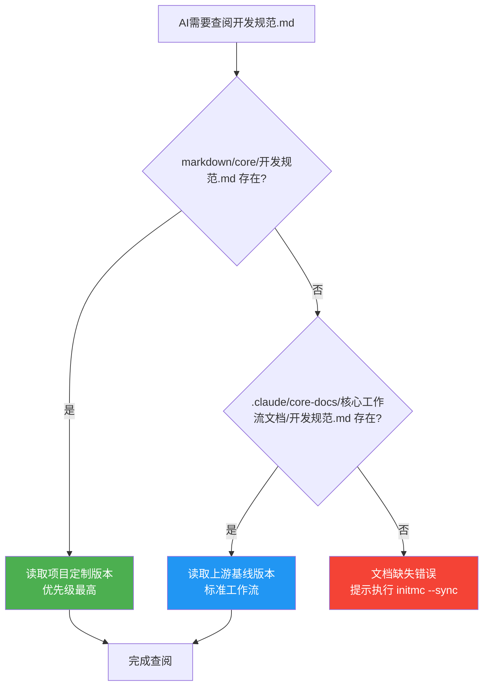

**设计优势**:
1. ✅ **零冲突升级**: `initmc --sync` 只更新 `.claude/core-docs/`，不影响 `markdown/core/`
2. ✅ **灵活定制**: 用户可覆盖任意核心文档，满足项目特殊需求
3. ✅ **自动同步**: 软连接模式下，上游文档实时同步
4. ✅ **降级保护**: 权限不足时自动创建只读副本，功能完全正常

---

#### 4.1.2 软连接管理器实现

核心类: `SymlinkManager` ([lib/symlink-manager.js](lib/symlink-manager.js))

**关键方法详解**:

##### 1. `createAllSymlinks()` - 主入口方法

**位置**: [lib/symlink-manager.js:23-50](lib/symlink-manager.js#L23-L50)

**职责**: 批量创建所有核心文档的软连接

**返回值**:
```javascript
{
  symlinks: [],         // 成功创建的软连接列表
  readonlyCopies: [],   // 降级为只读副本的列表
  failed: []            // 创建失败的列表
}
```

**核心逻辑**:
```javascript
async createAllSymlinks() {
  console.log('📂 创建上游文档引用...\n');

  fs.ensureDirSync(this.coreDocsPath);  // 确保 .claude/core-docs/ 存在

  const coreFiles = this._getCoreFiles();  // 动态扫描需要部署的文件
  const results = { symlinks: [], readonlyCopies: [], failed: [] };

  for (const file of coreFiles) {
    const result = await this.createSymlink(file);  // 逐个创建软连接

    // 根据创建结果分类统计
    if (result.type === 'symlink') {
      results.symlinks.push(file);
    } else if (result.type === 'readonly-copy') {
      results.readonlyCopies.push(file);
    } else {
      results.failed.push({ file, error: result.error });
    }
  }

  this._printResults(results);  // 输出统计报告
  return results;
}
```

---

##### 2. `_getCoreFiles()` - 动态扫描核心文件

**位置**: [lib/symlink-manager.js:192-239](lib/symlink-manager.js#L192-L239)

**实现**: 使用 glob 模式匹配，零维护成本

**包含模式**:
```javascript
const includePatterns = [
  '核心工作流文档/**/*.md',   // 开发规范、问题排查、快速开始
  '概念参考/**/*.md',          // MODSDK核心概念、API速查
  '深度指南/**/*.md',          // 性能优化、事件系统、ECS架构
  'ai',                        // AI任务策略表、快速通道流程
  '可选工具说明.md'            // 可选工具文档
];
```

**排除模式**（下游项目特定文档）:
```javascript
const excludePatterns = [
  '**/索引.md',                // 项目索引（AI自动维护）
  '**/项目状态.md',            // 项目状态（AI自动维护）
  '**/文档待补充清单.md',      // 待办清单（AI自动维护）
  'systems/**',                // System文档模板（不部署）
  'core/**',                   // 项目覆盖层（不部署）
  'README.md'                  // 根README（下游有自己的）
];
```

**代码片段**:
```javascript
_getCoreFiles() {
  const glob = require('glob');
  const coreFiles = [];
  const markdownRoot = path.join(this.upstreamPath, 'markdown');

  // 扫描匹配的文件
  for (const pattern of includePatterns) {
    const files = glob.sync(pattern, {
      cwd: markdownRoot,
      nodir: pattern === 'ai' ? false : true,  // ai目录需要创建软连接
      dot: false
    });

    // 过滤排除模式
    const filtered = files.filter(file => {
      return !excludePatterns.some(exclude => {
        const excludeRegex = new RegExp(exclude.replace(/\*\*/g, '.*').replace(/\*/g, '[^/]*'));
        return excludeRegex.test(file);
      });
    });

    coreFiles.push(...filtered);
  }

  return [...new Set(coreFiles)];  // 去重
}
```

---

#### 4.1.3 Windows 跨平台支持

**问题**: Windows下普通用户默认无法创建符号链接（需要管理员权限或开发者模式）

**解决方案**: 三级降级策略

**降级流程图**:

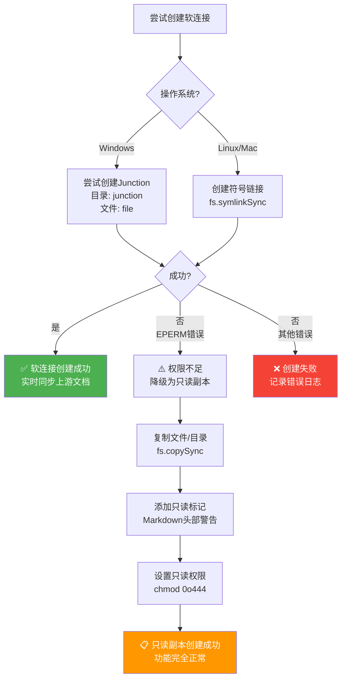

**核心代码**（[lib/symlink-manager.js:80-100](lib/symlink-manager.js#L80-L100)）:

```javascript
async _tryCreateSymlink(targetPath, linkPath, relativePath) {
  const isDirectory = fs.statSync(targetPath).isDirectory();

  try {
    if (process.platform === 'win32') {
      // Windows: 使用Junction（不需要管理员权限）
      const type = isDirectory ? 'junction' : 'file';
      fs.symlinkSync(targetPath, linkPath, type);
    } else {
      // Linux/Mac: 标准符号链接
      fs.symlinkSync(targetPath, linkPath);
    }

    console.log(`   ✅ 软连接: ${relativePath} → 上游`);
    return { type: 'symlink' };

  } catch (err) {
    // 降级：创建只读副本
    return await this._createReadonlyCopy(targetPath, linkPath, relativePath, isDirectory);
  }
}
```

---

#### 4.1.4 降级策略：只读副本机制

**只读副本特性**:
1. ✅ **功能完整**: AI可正常读取文档内容
2. ✅ **编辑保护**: 文件权限设为只读（`0o444`）
3. ✅ **明确提示**: Markdown头部添加只读警告
4. ✅ **升级友好**: `initmc --sync` 自动重新复制最新版本

**只读标记示例**（[lib/symlink-manager.js:142-166](lib/symlink-manager.js#L142-L166)）:

```markdown
# 开发规范
...
```

**创建只读副本代码**:

```javascript
async _createReadonlyCopy(targetPath, linkPath, relativePath, isDirectory) {
  try {
    console.log(`   ⚠️  无法创建软连接，降级为只读副本: ${relativePath}`);

    if (isDirectory) {
      // 复制目录
      fs.copySync(targetPath, linkPath);

      // 为目录中的每个.md文件添加标记
      const mdFiles = this._findMarkdownFiles(linkPath);
      for (const mdFile of mdFiles) {
        this._addReadonlyHeader(mdFile);
      }
    } else {
      // 复制文件
      fs.copySync(targetPath, linkPath);

      // 添加只读标记
      if (relativePath.endsWith('.md')) {
        this._addReadonlyHeader(linkPath);
      }
    }

    // 设置只读权限（尽力而为）
    try {
      this._setReadonly(linkPath, isDirectory);
    } catch {}

    return { type: 'readonly-copy' };

  } catch (copyErr) {
    return { type: 'failed', error: copyErr.message };
  }
}
```

---

### 4.2 文档生成器（lib/generator.js）

#### 4.2.1 Layer 1/2/3 三层架构

**核心类**: `DocumentGenerator` ([lib/generator.js](lib/generator.js))

**三层生成架构**:

| Layer | 名称 | 内容 | 生成时机 | 更新频率 |
|-------|------|------|---------|---------|
| **Layer 1** | **通用层** | CLAUDE.md、.claude/commands/、README.md、软连接 | `initmc` 初始化 | 升级时更新 |
| **Layer 2** | **架构层** | markdown/systems/（System文档） | 首次 `initmc` | AI检测缺失时生成 |
| **Layer 3** | **业务层** | markdown/NEWRPG/（业务框架） | 根据项目类型 | AI开发时补充 |

**生成流程图**:

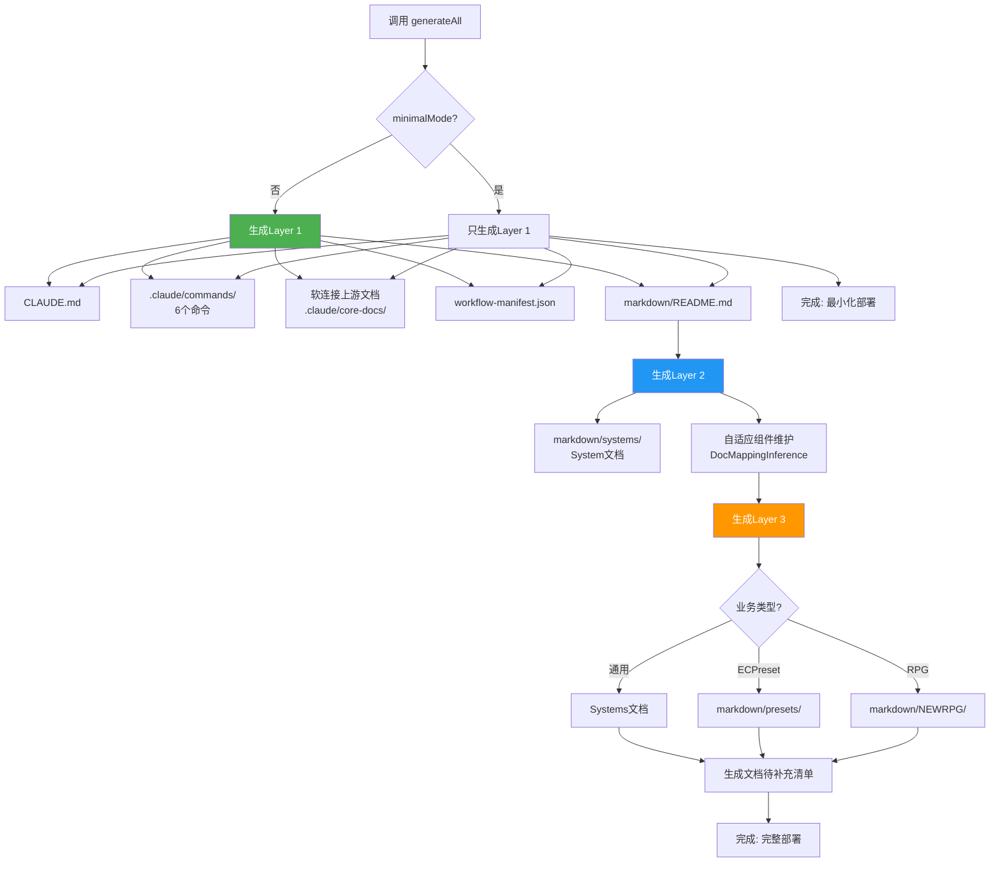

---

#### 4.2.2 核心方法详解

##### 1. `_generateLayer1()` - 通用层生成

**位置**: [lib/generator.js:125-183](lib/generator.js#L125-L183)

**关键步骤**:

```javascript
async _generateLayer1(targetPath) {
  console.log('[生成器] 生成Layer 1（通用层 - v16.0双层架构）...');

  const replacements = this._buildReplacements(targetPath);  // 计算占位符

  // 1. CLAUDE.md（下游副本，升级时会被替换）
  this._generateFromTemplate('CLAUDE.md', targetPath, 'CLAUDE.md', replacements);

  // 2. Claude命令文件（v17.1: 统一/mc前缀）
  this._cleanupOldCommands(targetPath);  // 清理v16及以前的旧命令
  this._generateFromTemplate('mc.md', targetPath, '.claude/commands/mc.md', replacements);
  this._generateFromTemplate('mc-review.md', targetPath, '.claude/commands/mc-review.md', replacements);
  this._generateFromTemplate('mc-perf.md', targetPath, '.claude/commands/mc-perf.md', replacements);
  this._generateFromTemplate('mc-docs.md', targetPath, '.claude/commands/mc-docs.md', replacements);
  this._generateFromTemplate('mc-why.md', targetPath, '.claude/commands/mc-why.md', replacements);
  this._generateFromTemplate('mc-discover.md', targetPath, '.claude/commands/mc-discover.md', replacements);

  // 3. README.md
  this._generateFromTemplate('README.md', targetPath, 'README.md', replacements);

  // 4. ⭐ 创建.claude/core-docs/软连接（上游基线层）
  console.log('[生成器] 创建上游文档引用（.claude/core-docs/）...');
  const symlinkManager = new SymlinkManager(this.upstreamPath, targetPath);
  await symlinkManager.createAllSymlinks();
  console.log('[生成器] ✅ 上游文档引用创建完成');

  // 5. ⭐ 生成markdown/README.md（导航文档）
  this._generateFromTemplate('markdown/README.md', targetPath, 'markdown/README.md', replacements);

  // 6. 创建markdown/core/目录（项目覆盖层）
  ensureDir(path.join(targetPath, 'markdown/core'));

  // 7. 创建tasks/README.md
  writeFile(path.join(targetPath, 'tasks/README.md'), this._generateTasksReadme());

  // 8. ⭐ 生成.claude/workflow-manifest.json（版本追踪）
  const versionChecker = new VersionChecker(this.upstreamPath, targetPath);
  const baselineHashes = versionChecker.computeBaselineHashes();
  versionChecker.writeManifest({
    version: VERSION,
    baselineHashes: baselineHashes,
    installedAt: new Date().toISOString()
  });

  console.log('[生成器] Layer 1 完成 ✅');
}
```

---

##### 2. `_generateLayer2()` - 架构层生成

**位置**: [lib/generator.js:189-237](lib/generator.js#L189-L237)

**智能文档检测**:

```javascript
async _generateLayer2(targetPath) {
  console.log('[生成器] 生成Layer 2（系统文档）...');

  const systemsDir = path.join(targetPath, 'markdown/systems');

  // Systems README
  const systemsReadme = this._generateSystemsReadme();
  writeFile(path.join(systemsDir, 'README.md'), systemsReadme);

  let generatedCount = 0;
  let skippedCount = 0;

  // 为每个System生成文档（带智能检测）
  for (const [systemName, systemInfo] of Object.entries(this.codeStructure.systems)) {
    const existingDoc = this._detectExistingSystemDoc(systemName, systemsDir);

    if (existingDoc) {
      console.log(`[生成器] 检测到现有文档: ${existingDoc.fileName} (质量评分: ${existingDoc.quality}/5)`);

      if (existingDoc.quality >= 3) {
        // 高质量文档，跳过生成
        console.log(`[生成器] ✓ 保留高质量文档: ${existingDoc.fileName}`);
        skippedCount++;
        continue;
      } else {
        // 低质量文档，提示用户
        console.log(`[生成器] ⚠️  发现低质量文档: ${existingDoc.fileName}，将覆盖生成新文档`);
      }
    }

    const docContent = this._generateSystemDoc(systemName, systemInfo, targetPath);

    // ⭐ 使用AI智能命名（而非硬编码英文类名）
    const systemFilePath = systemInfo.filePath;
    const maintenance = new IntelligentDocMaintenance(targetPath);
    const chineseFileName = maintenance._inferChineseNameByAI(
      systemFilePath,
      systemName,
      { type: 'system', subtype: 'system' }
    );

    writeFile(path.join(systemsDir, chineseFileName), docContent);
    generatedCount++;
  }

  console.log(`[生成器] 生成了 ${generatedCount} 个系统文档，跳过 ${skippedCount} 个现有文档 ✅`);
}
```

---

#### 4.2.3 CLAUDE.md 四段式结构

**设计目标**: 分离用户可编辑区域和工作流自动管理区域

**四段式结构** (v16.1+):

```
┌─────────────────────────────────────────────┐
│ 1. 项目配置区（用户可编辑）                  │
│    - 项目名称、路径、类型                    │
│    - 基础配置信息                            │
├─────────────────────────────────────────────┤
│ 2. 工作流内容区（⚠️ 自动管理）              │
│    - 核心工作流逻辑                          │
│    - 升级时精确替换                          │
│    - ⚠️ 禁止手动编辑                        │
├─────────────────────────────────────────────┤
│ 3. 项目扩展区（用户可编辑）                  │
│    - 项目特定规范                            │
│    - 团队协作流程                            │
│    - 自定义架构模式                          │
├─────────────────────────────────────────────┤
│ 4. 文档元数据区（自动生成）                  │
│    - 工作流版本号                            │
│    - 生成时间戳                              │
└─────────────────────────────────────────────┘
```

**HTML注释标记**（[lib/generator.js:631-723](lib/generator.js#L631-L723)）:

```html

...

...

...

```

**智能合并逻辑**（`_mergeCLAUDEmd` 方法）:

1. **提取现有内容**: 从旧文件提取用户编辑的"项目配置区"和"项目扩展区"
2. **提取新模板**: 从新模板提取最新的"工作流内容区"
3. **智能组装**: 保留用户编辑 + 更新工作流内容
4. **去除冗余注释**: 避免重复累积用户编辑提示

---

#### 4.2.4 智能文档维护

**现有文档检测**（`_detectExistingSystemDoc` 方法，[lib/generator.js:245-308](lib/generator.js#L245-L308)）:

**匹配策略**（4级智能匹配）:

1. **精确文件名匹配**: `ShopServerSystem.md`
2. **标题匹配**: `# ShopServerSystem` 或 `# 商店系统`
3. **Front Matter匹配**: YAML元数据中声明了系统名
4. **代码块匹配**: 文档中引用了 `class ShopServerSystem`

**质量评分算法**（`_assessDocQuality` 方法，[lib/generator.js:361-390](lib/generator.js#L361-L390)）:

**评分标准（0-5分制）**:

| 因素 | 加分 | 检测规则 |
|------|------|---------|
| **代码块示例** | +1 | 包含 ` ``` ` |
| **图表** | +1 | 包含 `mermaid`/`graph`/`flowchart` |
| **示例说明** | +1 | 包含"示例"/"Example"/"案例"/"使用方法" |
| **内容丰富** | +1 | 字符数 > 500 |
| **非待补充模板** | +1 | 不包含"⚠️ **待补充**" |

**评分代码**:

```javascript
_assessDocQuality(content) {
  let score = 0;

  // 因素1: 有代码块示例 (+1)
  if (/```/.test(content)) {
    score += 1;
  }

  // 因素2: 有图表（mermaid/flowchart）(+1)
  if (/mermaid|graph|flowchart|```diagram/.test(content)) {
    score += 1;
  }

  // 因素3: 有示例说明 (+1)
  if (/示例|Example|案例|使用方法|Usage/.test(content)) {
    score += 1;
  }

  // 因素4: 内容丰富（>500字符）(+1)
  if (content.length > 500) {
    score += 1;
  }

  // 因素5: 不是"待补充"模板 (+1)
  if (!/⚠️\s*\*\*待补充\*\*/.test(content)) {
    score += 1;
  }

  return score;
}
```

**决策逻辑**:

- **质量 ≥ 3分**: 保留现有文档，跳过生成
- **质量 < 3分**: 提示用户，覆盖生成新文档

---

### 4.3 模板系统

#### 4.3.1 职责边界（v16.3重构）

**核心原则**: `markdown/` 是单一真实源，`templates/` 只包含项目特定模板

**v16.3重构前后对比**:

| 目录 | v16.2及之前 | v16.3重构后 | 变化 |
|------|-----------|-----------|------|
| **markdown/** | 核心文档 | 核心文档（单一真实源） | ✅ 保持不变 |
| **templates/markdown/** | 核心文档副本 + 项目模板<br/>（❌ 冗余75KB+） | ✅ 只保留项目模板（4个文件） | ✅ 消除冗余 |
| **部署方式** | 从模板生成 → 双份维护 | 软连接引用 → 零维护 | ✅ 架构优化 |

**templates/ 目录结构** (v16.3+):

```
templates/
├─ CLAUDE.md.template                        # 下游AI指导文档
├─ README.md.template                        # 项目说明
├─ .claude/commands/                         # 6个Claude命令模板
│   ├─ mc.md.template                         # /mc 主命令
│   ├─ mc-review.md.template                  # /mc-review 方案审查
│   ├─ mc-perf.md.template                    # /mc-perf 性能分析
│   ├─ mc-docs.md.template                    # /mc-docs 文档审计
│   ├─ mc-why.md.template                     # /mc-why 原理解释
│   └─ mc-discover.md.template                # /mc-discover 结构发现
└─ markdown/                                  # 项目特定文档模板（4个）
    ├─ README.md.template                     # 文档导航
    ├─ 索引.md.template                       # 快速索引
    ├─ 项目状态.md.template                   # 项目状态
    └─ 文档待补充清单.md.template             # 待办清单
```

**删除的文件**（v16.3重构）:

```
❌ templates/markdown/开发规范.md.template (1157行, 过时版本)
❌ templates/markdown/问题排查.md.template (39KB)
❌ templates/markdown/快速开始.md.template (4.6KB)
❌ templates/markdown/AI策略文档/ (缺少文件)
```

**迁移路径**:

- **旧版本 (v16.2及之前)**: 从 `templates/markdown/` 生成核心文档
- **新版本 (v16.3+)**: 通过软连接引用 `markdown/核心工作流文档/`
- **自动迁移**: `initmc --sync` 自动清理旧生成文件，创建软连接

---

#### 4.3.2 占位符系统

**占位符定义** ([lib/config.js:66-81](lib/config.js#L66-L81)):

```javascript
const PLACEHOLDERS = {
  PROJECT_PATH: '{{PROJECT_PATH}}',              // 项目路径
  PROJECT_NAME: '{{PROJECT_NAME}}',              // 项目名称
  EXAMPLE_TASKS: '{{EXAMPLE_TASKS}}',            // 示例任务
  SDK_DOC_PATH: '{{SDK_DOC_PATH}}',              // SDK文档路径
  CRITICAL_RULES: '{{CRITICAL_RULES}}',          // CRITICAL规范
  CORE_PATHS: '{{CORE_PATHS}}',                  // 核心路径列表
  ARCHITECTURE_DOCS: '{{ARCHITECTURE_DOCS_SECTION}}',  // 架构文档
  BUSINESS_DOCS: '{{BUSINESS_DOCS_SECTION}}',    // 业务文档
  NBT_CHECK_SECTION: '{{NBT_CHECK_SECTION}}',    // NBT检查
  LOG_FILES: '{{LOG_FILES}}',                    // 日志文件
  CURRENT_DATE: '{{CURRENT_DATE}}',              // 当前日期
  PROJECT_DESCRIPTION: '{{PROJECT_DESCRIPTION}}',// 项目描述
  EXTRA_DOCS: '{{EXTRA_DOCS}}',                  // 额外文档链接
  CRITICAL_RULES_EXTRA: '{{CRITICAL_RULES_EXTRA}}'// 额外CRITICAL规范
};
```

**占位符计算** ([lib/generator.js:458-481](lib/generator.js#L458-L481)):

```javascript
_buildReplacements(targetPath) {
  const normalizedPath = normalizePathForMarkdown(targetPath);

  return {
    '{{PROJECT_PATH}}': normalizedPath,
    '{{PROJECT_NAME}}': this.metadata.projectName,
    '{{CURRENT_DATE}}': getCurrentDate(),
    '{{PROJECT_STATUS}}': '生产就绪 (Production Ready)',
    '{{VERSION}}': VERSION,  // 工作流版本号
    '{{EXAMPLE_TASKS}}': this._generateExampleTasks(),
    '{{LOG_FILES}}': this._generateLogFiles(targetPath),
    '{{ARCHITECTURE_DOCS_SECTION}}': this._generateArchitectureDocs(),
    '{{BUSINESS_DOCS_SECTION}}': this._generateBusinessDocs(),
    '{{PRESETS_DOCS_SECTION}}': this._generatePresetsDocs(),
    '{{NBT_CHECK_SECTION}}': this.metadata.businessType === 'RPG' ? this._generateNBTSection() : '',
    '{{CRITICAL_RULES}}': this._generateCriticalRulesSection(),
    '{{CRITICAL_RULES_EXTRA}}': this._generateCriticalRules(),
    '{{PROJECT_DESCRIPTION}}': `${this.metadata.businessType}类型MODSDK项目`,
    '{{EXTRA_DOCS}}': this._generateExtraDocs(),
    '{{QUICK_INDEX_EXTRA}}': '',  // 快速索引扩展（预留）
    '{{SDK_DOC_PATH}}': 'D:\\EcWork\\netease-modsdk-wiki',
    '{{CORE_PATHS}}': this._generateCorePaths(normalizedPath)
  };
}
```

**动态内容生成**（根据项目类型）:

| 占位符 | RPG项目 | BedWars项目 | 通用项目 |
|-------|---------|------------|---------|
| `{{EXAMPLE_TASKS}}` | 战斗系统BUG修复<br/>装备充能功能 | 商店预设错误<br/>队伍聊天功能 | System初始化错误<br/>新功能模块 |
| `{{BUSINESS_DOCS_SECTION}}` | NEWRPG详细技术文档 | Systems文档 | Systems文档 |
| `{{NBT_CHECK_SECTION}}` | NBT兼容性检查 | （空） | （空） |
| `{{ARCHITECTURE_DOCS}}` | Apollo架构文档 | （如使用Apollo） | （如使用Apollo） |

---

#### 4.3.3 模板路径映射

**映射函数** ([lib/config.js:110-137](lib/config.js#L110-L137)):

```javascript
function getTemplatePath(templateName, projectType = 'General') {
  if (templateName === 'CLAUDE.md') {
    return path.join(TEMPLATES_DIR, 'CLAUDE.md.template');
  }
  // v17.1: 6个核心命令（统一/mc前缀）
  else if (templateName === 'mc.md') {
    return path.join(TEMPLATES_DIR, '.claude', 'commands', 'mc.md.template');
  } else if (templateName === 'mc-review.md') {
    return path.join(TEMPLATES_DIR, '.claude', 'commands', 'mc-review.md.template');
  } else if (templateName === 'mc-perf.md') {
    return path.join(TEMPLATES_DIR, '.claude', 'commands', 'mc-perf.md.template');
  } else if (templateName === 'mc-docs.md') {
    return path.join(TEMPLATES_DIR, '.claude', 'commands', 'mc-docs.md.template');
  } else if (templateName === 'mc-why.md') {
    return path.join(TEMPLATES_DIR, '.claude', 'commands', 'mc-why.md.template');
  } else if (templateName === 'mc-discover.md') {
    return path.join(TEMPLATES_DIR, '.claude', 'commands', 'mc-discover.md.template');
  }
  // 其他模板
  else if (templateName === 'README.md') {
    return path.join(TEMPLATES_DIR, 'README.md.template');
  } else if (templateName === 'markdown/README.md') {
    // v16.0: markdown目录导航文档
    return path.join(TEMPLATES_DIR, 'markdown', 'README.md.template');
  } else {
    return path.join(TEMPLATES_DIR, templateName);
  }
}
```

**使用示例**:

```javascript
// 生成CLAUDE.md
this._generateFromTemplate('CLAUDE.md', targetPath, 'CLAUDE.md', replacements);

// 生成/mc命令
this._generateFromTemplate('mc.md', targetPath, '.claude/commands/mc.md', replacements);

// 生成文档导航
this._generateFromTemplate('markdown/README.md', targetPath, 'markdown/README.md', replacements);
```

---

### 4.4 全局安装机制（Windows支持）

#### 4.4.1 安装流程

**核心脚本**: [bin/install-global.js](bin/install-global.js)

**安装步骤**:

```
1. 复制工作流文件到 ~/.claude-modsdk-workflow/
   ├─ lib/           核心生成器（22个模块）
   ├─ bin/           CLI工具（7个脚本）
   ├─ markdown/      工作流知识库（80+ 文件）
   ├─ templates/     项目模板（12个文件）
   ├─ docs/          官方文档（Git Submodule）
   └─ package.json   项目配置

2. 生成跨平台启动脚本
   Windows: initmc.cmd, initmc.ps1
   Linux/Mac: initmc (Bash脚本)

3. 添加到系统PATH
   Windows: 用户环境变量 + 注册表（可选）
   Linux/Mac: ~/.bashrc 或 ~/.zshrc

4. 验证安装
   执行: where initmc (Windows) 或 which initmc (Linux/Mac)
```

**安装命令**:

```bash
# 在工作流目录执行
npm run install-global

# 验证安装
where initmc  # Windows
which initmc  # Linux/Mac

# 测试功能
initmc --version
```

---

#### 4.4.2 跨平台脚本生成

**Windows CMD脚本** (`initmc.cmd`):

```batch
@echo off
:: NeteaseMod-Claude Workflow - initmc 命令
:: 全局安装版本
setlocal enabledelayedexpansion

:: 设置工作流目录
set "WORKFLOW_HOME=%USERPROFILE%\.claude-modsdk-workflow"

:: 检查Node.js
where node >nul 2>nul
if %errorlevel% neq 0 (
    echo 错误: 未找到 Node.js
    echo 请先安装 Node.js: https://nodejs.org/
    exit /b 1
)

:: 执行initmc
node "%WORKFLOW_HOME%\bin\initmc.js" %*
```

**Windows PowerShell脚本** (`initmc.ps1`):

```powershell
# NeteaseMod-Claude Workflow - initmc 命令
# 全局安装版本

$WorkflowHome = Join-Path $env:USERPROFILE ".claude-modsdk-workflow"

# 检查Node.js
if (!(Get-Command node -ErrorAction SilentlyContinue)) {
    Write-Error "未找到 Node.js"
    Write-Host "请先安装 Node.js: https://nodejs.org/"
    exit 1
}

# 执行initmc
& node (Join-Path $WorkflowHome "bin\initmc.js") $args
```

**Linux/Mac Bash脚本** (`initmc`):

```bash
#!/usr/bin/env bash
# NeteaseMod-Claude Workflow - initmc 命令
# 全局安装版本

WORKFLOW_HOME="$HOME/.claude-modsdk-workflow"

# 检查Node.js
if ! command -v node &> /dev/null; then
    echo "错误: 未找到 Node.js"
    echo "请先安装 Node.js: https://nodejs.org/"
    exit 1
fi

# 执行initmc
node "$WORKFLOW_HOME/bin/initmc.js" "$@"
```

---

#### 4.4.3 验证方法

**验证脚本** ([bin/install-global.js](bin/install-global.js) 内置):

```javascript
// 验证安装
console.log('验证安装...\n');

// 1. 检查文件是否存在
const requiredFiles = [
  'lib/generator.js',
  'lib/symlink-manager.js',
  'lib/config.js',
  'bin/initmc.js',
  'markdown/核心工作流文档/开发规范.md',
  'templates/CLAUDE.md.template'
];

for (const file of requiredFiles) {
  const filePath = path.join(GLOBAL_WORKFLOW_HOME, file);
  if (!fs.existsSync(filePath)) {
    console.error(`❌ 缺少文件: ${file}`);
    hasError = true;
  } else {
    console.log(`✅ ${file}`);
  }
}

// 2. 检查命令是否可用
console.log('\n测试命令...\n');
const testCommand = process.platform === 'win32' ? 'where initmc' : 'which initmc';
const { stdout, stderr } = execSync(testCommand, { encoding: 'utf-8' });

if (stdout.trim()) {
  console.log(`✅ initmc 命令已注册: ${stdout.trim()}`);
} else {
  console.error('❌ initmc 命令未找到');
  hasError = true;
}

// 3. 检查版本
console.log('\n验证版本...\n');
const { stdout: versionOutput } = execSync('initmc --version', { encoding: 'utf-8' });
console.log(`✅ ${versionOutput.trim()}`);
```

**手动验证步骤**:

```bash
# 1. 检查全局目录
ls ~/.claude-modsdk-workflow  # Linux/Mac
dir %USERPROFILE%\.claude-modsdk-workflow  # Windows

# 2. 检查命令可用性
which initmc  # 应输出脚本路径
where initmc  # Windows

# 3. 测试功能
initmc --version  # 应输出版本号
initmc --help     # 应输出帮助信息

# 4. 测试初始化（在测试项目）
cd /path/to/test-project
initmc  # 应成功生成工作流文件
```

---

### 4.5 项目分析器（lib/analyzer.js）

#### 4.5.1 分析流程（5步）

**核心类**: `ProjectAnalyzer` ([lib/analyzer.js](lib/analyzer.js))

**完整分析流程**:

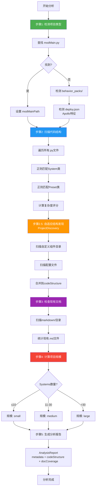

**核心代码** ([lib/analyzer.js:33-54](lib/analyzer.js#L33-L54)):

```javascript
analyze() {
  console.log('[分析器] 开始分析项目...');
  console.log(`[分析器] 项目路径: ${this.projectPath}`);

  // 步骤1: 检测项目类型
  this._detectProjectType();

  // 步骤2: 扫描代码结构（传统方式，保留向后兼容）
  this._scanCodeStructure();

  // ⭐ 步骤2.5: 自适应项目结构发现（新增）
  this._discoverProjectStructure();

  // 步骤3: 检查现有文档
  this._checkDocumentation();

  // 步骤4: 计算项目规模
  this._calculateProjectScale();

  console.log('[分析器] 分析完成');
  return this.generateReport();
}
```

---

#### 4.5.2 代码识别规则（正则表达式）

**System类识别** ([lib/analyzer.js:160-166](lib/analyzer.js#L160-L166)):

```javascript
// 检测System类
const systemPattern = /class\s+(\w+)\s*\(\s*(ServerSystem|ClientSystem)\s*\)/g;
let match;
while ((match = systemPattern.exec(content)) !== null) {
  const [, className, baseClass] = match;
  this.codeStructure.addSystem(className, filePath, baseClass, content);
}
```

**匹配示例**:

```python
# ✅ 匹配成功
class ShopServerSystem(ServerSystem):  # → className="ShopServerSystem", baseClass="ServerSystem"
class PlayerClientSystem(ClientSystem):  # → className="PlayerClientSystem", baseClass="ClientSystem"

# ❌ 不匹配
class ShopSystem:  # 缺少基类
class MySystem(object):  # 基类不是ServerSystem/ClientSystem
```

**Preset类识别** ([lib/analyzer.js:168-173](lib/analyzer.js#L168-L173)):

```javascript
// 检测Preset类
const presetPattern = /class\s+(\w+)\s*\(\s*ECPresetDefinition\s*\)/g;
while ((match = presetPattern.exec(content)) !== null) {
  const [, className] = match;
  this.codeStructure.addPreset(className, filePath, content);
}
```

**匹配示例**:

```python
# ✅ 匹配成功
class ShopPreset(ECPresetDefinition):  # → className="ShopPreset"
class WeaponPreset(ECPresetDefinition):  # → className="WeaponPreset"

# ❌ 不匹配
class ShopPreset(BasePreset):  # 基类不是ECPresetDefinition
class ShopPreset:  # 缺少基类
```

---

#### 4.5.3 复杂度评分算法

**评分维度**（参考 Python版本 `analyzer.py`）:

| 维度 | 权重 | 计算公式 | 说明 |
|------|------|---------|------|
| **代码行数** | 30% | `min(linesOfCode / 100, 3)` | 最高3分 |
| **方法数量** | 25% | `min(methodCount / 10, 2.5)` | 最高2.5分 |
| **复杂度** | 20% | `min(cyclomaticComplexity / 20, 2)` | 最高2分 |
| **依赖关系** | 15% | `min(dependencies / 5, 1.5)` | 最高1.5分 |
| **事件监听** | 10% | `min(eventListeners / 5, 1)` | 最高1分 |

**总分计算**:

```
ComplexityScore = (代码行数得分 * 0.3) +
                  (方法数量得分 * 0.25) +
                  (圈复杂度得分 * 0.2) +
                  (依赖关系得分 * 0.15) +
                  (事件监听得分 * 0.1)

最终得分 = min(ComplexityScore, 10.0)
```

**详细度推荐**:

- **score ≥ 8**: `detailed` - 复杂System，生成详细文档（~3000字）
- **5 ≤ score < 8**: `medium` - 中等System，生成中等文档（~1500字）
- **score < 5**: `simple` - 简单System，生成简洁文档（~500字）

**代码示例**（简化版）:

```javascript
class SystemInfo {
  constructor(name, filePath, type, content) {
    this.name = name;
    this.filePath = filePath;
    this.type = type;
    this.content = content;
    this.linesOfCode = content.split('\n').length;
    this.methodCount = (content.match(/def\s+\w+\s*\(/g) || []).length;
    this.eventListeners = (content.match(/ListenForEvent/g) || []).length;
    this.dependencies = this._extractDependencies(content).length;
    this.complexityScore = this._calculateComplexity();
  }

  _calculateComplexity() {
    const locScore = Math.min(this.linesOfCode / 100, 3) * 0.3;
    const methodScore = Math.min(this.methodCount / 10, 2.5) * 0.25;
    const eventScore = Math.min(this.eventListeners / 5, 1) * 0.1;
    const depScore = Math.min(this.dependencies / 5, 1.5) * 0.15;

    // 圈复杂度简化计算（分支数量）
    const branches = (this.content.match(/\b(if|elif|for|while|and|or)\b/g) || []).length;
    const cyclomaticScore = Math.min(branches / 20, 2) * 0.2;

    return Math.min(locScore + methodScore + eventScore + depScore + cyclomaticScore, 10.0);
  }

  getDetailLevel() {
    if (this.complexityScore >= 8) return 'detailed';
    if (this.complexityScore >= 5) return 'medium';
    return 'simple';
  }
}
```

---

#### 4.5.4 业务类型推断算法

**推断逻辑** ([lib/analyzer.js](lib/analyzer.js)):

```javascript
_inferBusinessType() {
  const allCode = this._collectAllCode();
  const lowerCode = allCode.toLowerCase();

  // 关键词匹配（加权评分）
  const keywords = {
    RPG: ['rpg', 'combat', 'weapon', 'armor', 'skill', 'equipment', 'inventory', 'quest'],
    BedWars: ['bedwars', 'bed', 'generator', 'team', 'forge', 'shop'],
    PVP: ['pvp', 'arena', 'duel', 'match'],
    Survival: ['survival', 'hunger', 'thirst']
  };

  const scores = {};
  for (const [type, typeKeywords] of Object.entries(keywords)) {
    scores[type] = 0;
    for (const keyword of typeKeywords) {
      // 计算关键词出现次数
      const matches = (lowerCode.match(new RegExp(keyword, 'g')) || []).length;
      scores[type] += matches;
    }
  }

  // 选择得分最高的类型
  const maxType = Object.keys(scores).reduce((a, b) => scores[a] > scores[b] ? a : b);

  // 得分太低时返回Generic
  if (scores[maxType] < 3) {
    return 'Generic';
  }

  return maxType;
}
```

**推断示例**:

```
代码中包含关键词:
- "rpg": 5次
- "combat": 8次
- "weapon": 12次
- "armor": 7次
- "skill": 6次
→ RPG得分 = 5+8+12+7+6 = 38
→ 其他类型得分 < 5
→ 推断结果: RPG
```

---

#### 4.5.5 Apollo/ECPreset 检测

**Apollo检测** ([lib/analyzer.js:274-295](lib/analyzer.js#L274-L295)):

```javascript
_detectApollo(detectionResult = {}) {
  // 方式1: 检查 modMain.py 内容
  if (this.metadata.modMainPath) {
    const content = readFile(this.metadata.modMainPath);
    if (content.toLowerCase().includes('apollo')) {
      return true;
    }
  }

  // 方式2: 检查 deploy.json
  const deployJsonPath = path.join(this.projectPath, 'deploy.json');
  if (fs.existsSync(deployJsonPath)) {
    return true;
  }

  // 方式3: 从检测结果推断
  if (detectionResult.projectType === 'apollo') {
    return true;
  }

  return false;
}
```

**ECPreset检测**:

```javascript
_detectEcpreset() {
  // 检查是否有ECPresetDefinition类
  return Object.keys(this.codeStructure.presets).length > 0;
}
```

---

#### 4.5.6 自适应结构发现（ProjectDiscovery）

**核心类**: `ProjectDiscovery` (lib/project-discovery.js)

**发现目标**:
1. **自定义组件目录**: `components/`, `modules/`, `plugins/` 等
2. **配置文件目录**: `configs/`, `settings/`, `data/` 等
3. **业务逻辑目录**: `business/`, `gameplay/`, `managers/` 等

**发现流程**:

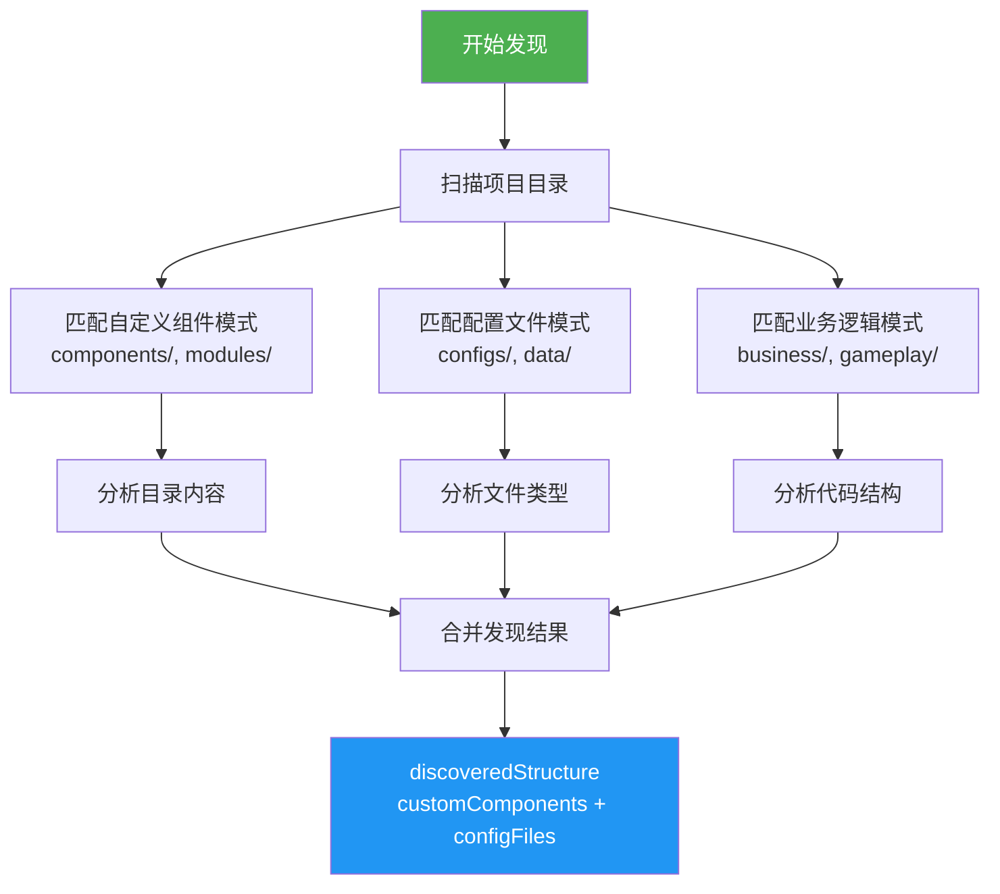

**使用示例**:

```javascript
// 在ProjectAnalyzer中调用
_discoverProjectStructure() {
  console.log('[分析器] 执行自适应结构发现...');

  const discovery = new ProjectDiscovery(this.projectPath);
  this.discoveredStructure = discovery.discover();

  // 合并发现的组件到 codeStructure
  this._mergeDiscoveredComponents();
}

_mergeDiscoveredComponents() {
  const customCount = Object.keys(this.discoveredStructure.customComponents).length;
  const configCount = Object.keys(this.discoveredStructure.configFiles).length;

  console.log(`[分析器] 发现 ${customCount} 个自定义组件目录`);
  console.log(`[分析器] 发现 ${configCount} 个配置文件目录`);

  // 存储到 codeStructure
  if (!this.codeStructure.discoveredComponents) {
    this.codeStructure.discoveredComponents = this.discoveredStructure;
  }
}
```

---

## 🔧 第五章：配置系统详解（lib/config.js）

### 5.1 路径配置

**全局安装路径** ([lib/config.js:10-17](lib/config.js#L10-L17)):

```javascript
// 全局安装路径
const GLOBAL_WORKFLOW_HOME = path.join(os.homedir(), '.claude-modsdk-workflow');

// 本地开发路径（lib目录的上一级）
const LOCAL_WORKFLOW_HOME = path.resolve(__dirname, '..');

// 智能选择工作目录：优先使用全局目录，如果不存在则使用本地开发目录
const WORKFLOW_HOME = fs.existsSync(GLOBAL_WORKFLOW_HOME)
  ? GLOBAL_WORKFLOW_HOME
  : LOCAL_WORKFLOW_HOME;
```

**路径优先级**:

```
1. 全局目录（优先）: ~/.claude-modsdk-workflow/
   - Windows: C:\Users\YourName\.claude-modsdk-workflow\
   - Linux/Mac: ~/.claude-modsdk-workflow/
   - 使用场景: npm run install-global 后

2. 本地开发目录（降级）: D:\EcWork\基于Claude的MODSDK开发工作流\
   - 使用场景: 开发调试时
```

**资源目录** ([lib/config.js:19-22](lib/config.js#L19-L22)):

```javascript
const TEMPLATES_DIR = path.join(WORKFLOW_HOME, 'templates');
const RULES_LIBRARY_DIR = path.join(WORKFLOW_HOME, 'rules-library');
const DOC_TEMPLATES_DIR = path.join(WORKFLOW_HOME, 'doc-templates');
```

---

### 5.2 版本管理

**版本号定义** ([lib/config.js:29](lib/config.js#L29)):

```javascript
const VERSION = '17.3.0';
```

**⚠️ 版本号同步要求**:

修改版本号时**必须**同步更新以下3个位置：

1. [lib/config.js:29](lib/config.js#L29) - `const VERSION = '17.3.0';`
2. [package.json:3](package.json#L3) - `"version": "17.3.0"`
3. [CLAUDE.md:7](CLAUDE.md#L7) - 文档顶部版本声明

**相关配置**:

```javascript
// 文档详细度配置
const DETAIL_LEVELS = {
  simple: {
    wordCount: 500,
    description: '简单文档（类结构、方法列表）'
  },
  medium: {
    wordCount: 1500,
    description: '中等详细度（架构、数据流、API）'
  },
  detailed: {
    wordCount: 3000,
    description: '详细文档（完整业务逻辑、示例）'
  }
};

// 复杂度评分阈值
const COMPLEXITY_THRESHOLDS = {
  detailed: 8,   // score >= 8 → detailed
  medium: 5      // score >= 5 → medium, < 5 → simple
};

// 项目规模阈值
const SCALE_THRESHOLDS = {
  small: 10,     // ≤10 Systems
  medium: 30     // 11-30 Systems, >30 → large
};
```

---

### 5.3 占位符定义（完整列表）

详见 [4.3.2 占位符系统](#432-占位符系统)

---

### 5.4 CRITICAL规范映射

**规范映射表** ([lib/config.js:84-94](lib/config.js#L84-L94)):

```javascript
const CRITICAL_RULES_MAP = {
  general: [
    'System生命周期',
    '模块导入规范',
    '双端隔离',
    'Python2.7兼容性'
  ],
  apollo: ['Apollo1.0架构'],
  ecpreset: ['ECPreset数据存储'],
  rpg: ['RPG-NBT兼容性']
};
```

**使用场景**:

根据项目类型动态选择需要强调的CRITICAL规范。

**示例**:

```javascript
// RPG项目 + Apollo架构 + ECPreset
const applicableRules = [
  ...CRITICAL_RULES_MAP.general,  // 通用规范（4条）
  ...CRITICAL_RULES_MAP.apollo,   // Apollo规范（1条）
  ...CRITICAL_RULES_MAP.ecpreset, // ECPreset规范（1条）
  ...CRITICAL_RULES_MAP.rpg       // RPG规范（1条）
];
// 总共: 7条CRITICAL规范
```

---

### 5.5 项目类型识别关键词

**关键词定义** ([lib/config.js:97-102](lib/config.js#L97-L102)):

```javascript
const PROJECT_TYPE_KEYWORDS = {
  RPG: ['rpg', 'combat', 'weapon', 'armor', 'skill', 'equipment'],
  BedWars: ['bedwars', 'bed', 'generator', 'team'],
  PVP: ['pvp', 'arena', 'duel'],
  Survival: ['survival', 'hunger', 'thirst']
};
```

**使用场景**:

在 `ProjectAnalyzer._inferBusinessType()` 中，扫描代码文件，统计关键词出现次数，选择得分最高的类型。

---

### 5.6 模板路径映射函数

详见 [4.3.3 模板路径映射](#433-模板路径映射)

---

## 📚 第六章：文档生成器深度解析

### 6.1 三层生成架构流程图

详见 [4.2.1 Layer 1/2/3 三层架构](#421-layer-123-三层架构)

---

### 6.2 Layer 1: 通用层实现

详见 [4.2.2 核心方法详解 - 1. _generateLayer1()](#1-_generatelayer1---通用层生成)

---

### 6.3 Layer 2: 架构层实现

详见 [4.2.2 核心方法详解 - 2. _generateLayer2()](#2-_generatelayer2---架构层生成)

---

### 6.4 Layer 3: 业务层实现

**核心方法**: `_generateLayer3()` ([lib/generator.js:396-416](lib/generator.js#L396-L416))

**逻辑**:

```javascript
async _generateLayer3(targetPath) {
  console.log('[生成器] 生成Layer 3（业务层框架）...');

  const businessType = this.metadata.businessType;

  if (businessType === 'RPG') {
    // RPG项目：创建NEWRPG目录
    ensureDir(path.join(targetPath, 'markdown/NEWRPG'));
    writeFile(
      path.join(targetPath, 'markdown/NEWRPG/README.md'),
      '# NEWRPG 系统文档\n\n⚠️ **待补充**: AI将在开发过程中逐步完善。\n'
    );
  } else if (this.metadata.usesEcpreset) {
    // ECPreset项目：创建presets目录
    ensureDir(path.join(targetPath, 'markdown/presets'));
    writeFile(
      path.join(targetPath, 'markdown/presets/README.md'),
      '# Presets 文档\n\n⚠️ **待补充**: AI将在开发过程中逐步完善。\n'
    );
  }

  console.log('[生成器] Layer 3 框架创建完成 ✅');
}
```

**决策逻辑**:

- **businessType === 'RPG'**: 创建 `markdown/NEWRPG/` 目录
- **usesEcpreset === true**: 创建 `markdown/presets/` 目录
- **其他**: 不创建业务层目录，使用 `markdown/systems/` 即可

---

### 6.5 质量评估算法（0-5分制）

详见 [4.2.4 智能文档维护 - 质量评分算法](#421-智能文档维护)

---

### 6.6 现有文档检测（智能匹配）

详见 [4.2.4 智能文档维护 - 现有文档检测](#421-智能文档维护)

---

## 🔗 第七章：软连接管理器实现

### 7.1 核心类设计（SymlinkManager）

**类结构**:

```javascript
class SymlinkManager {
  constructor(upstreamPath, downstreamPath) {
    this.upstreamPath = upstreamPath;           // 上游工作流路径
    this.downstreamPath = downstreamPath;       // 下游项目路径
    this.coreDocsPath = path.join(downstreamPath, '.claude', 'core-docs');
    this.markdownPath = path.join(downstreamPath, 'markdown');
  }

  // 主入口方法
  async createAllSymlinks() { ... }

  // 创建单个软连接
  async createSymlink(relativePath) { ... }

  // 更新已有的软连接
  async updateSymlinks() { ... }

  // 私有方法
  async _tryCreateSymlink(targetPath, linkPath, relativePath) { ... }
  async _createReadonlyCopy(targetPath, linkPath, relativePath, isDirectory) { ... }
  _getCoreFiles() { ... }
  _addReadonlyHeader(filePath) { ... }
  _setReadonly(targetPath, isDirectory) { ... }
  _findMarkdownFiles(dir) { ... }
  _findAllFiles(dir) { ... }
  _printResults(results) { ... }
  _printUpdateResults(results) { ... }
}
```

---

### 7.2 createAllSymlinks() 主流程

详见 [4.1.2 软连接管理器实现 - 1. createAllSymlinks()](#1-createallsymlinks---主入口方法)

---

### 7.3 _getCoreFiles() 动态扫描

详见 [4.1.2 软连接管理器实现 - 2. _getCoreFiles()](#2-_getcorefiles---动态扫描核心文件)

---

### 7.4 跨平台创建策略

详见 [4.1.3 Windows 跨平台支持](#413-windows-跨平台支持)

---

### 7.5 只读副本降级方案

详见 [4.1.4 降级策略：只读副本机制](#414-降级策略只读副本机制)

---

### 7.6 智能降级流程图

详见 [4.1.3 Windows 跨平台支持 - 降级流程图](#413-windows-跨平台支持)

---

## 🔍 第八章：项目分析器实现

> **核心模块**: [lib/analyzer.js](lib/analyzer.js) (560行)
>
> **职责**: 自动分析MODSDK项目结构、评估代码复杂度、生成分析报告

### 8.1 完整分析流程（5步详解）

项目分析器通过5个步骤完整分析MODSDK项目：

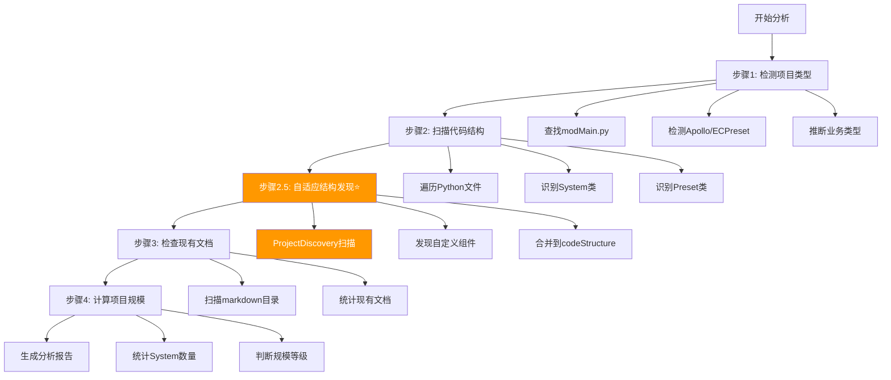

---

#### 8.1.1 步骤1: 检测项目类型

**核心方法**: `_detectProjectType()` ([lib/analyzer.js:90-127](lib/analyzer.js#L90-L127))

**检测方式**（多种方式降级）:

```javascript
// 方式1: 查找modMain.py（标准MODSDK项目）
const modMainPath = findFile(this.projectPath, 'modMain.py');
if (modMainPath) {
  result.modMainPath = modMainPath;
  result.projectType = 'standard';
  return result;
}

// 方式2: behavior_packs/（网易地图）
const behaviorPacksPath = path.join(this.projectPath, 'behavior_packs');
if (fs.existsSync(behaviorPacksPath)) {
  result.projectType = 'netease-map';
  result.hints.push('behavior_packs/');
}

// 方式3: deploy.json（Apollo）
const deployJsonPath = path.join(this.projectPath, 'deploy.json');
if (fs.existsSync(deployJsonPath)) {
  result.projectType = 'apollo';
  result.hints.push('deploy.json');
}

// 方式4: .mcs/（网易开发工具）
const mcsPath = path.join(this.projectPath, '.mcs');
if (fs.existsSync(mcsPath)) {
  result.hints.push('.mcs/');
}
```

**检测Apollo架构**:

核心方法: `_detectApollo()` ([lib/analyzer.js:274-295](lib/analyzer.js#L274-L295))

```javascript
// 方式1: 检查modMain.py内容
if (this.metadata.modMainPath) {
  const content = readFile(this.metadata.modMainPath);
  if (content.toLowerCase().includes('apollo')) {
    return true;
  }
}

// 方式2: 检查deploy.json
if (fs.existsSync(path.join(this.projectPath, 'deploy.json'))) {
  return true;
}
```

---

#### 8.1.2 步骤2: 扫描代码结构

**核心方法**: `_scanCodeStructure()` ([lib/analyzer.js:132-151](lib/analyzer.js#L132-L151))

**正则表达式识别**:

```javascript
// 识别System类（ServerSystem/ClientSystem）
const systemPattern = /class\s+(\w+)\s*\(\s*(ServerSystem|ClientSystem)\s*\)/g;
while ((match = systemPattern.exec(content)) !== null) {
  const [, className, baseClass] = match;
  this.codeStructure.addSystem(className, filePath, baseClass, content);
}

// 识别Preset类（ECPresetDefinition）
const presetPattern = /class\s+(\w+)\s*\(\s*ECPresetDefinition\s*\)/g;
while ((match = presetPattern.exec(content)) !== null) {
  const [, className] = match;
  this.codeStructure.addPreset(className, filePath, content);
}
```

**System信息提取** ([lib/analyzer.js:363-437](lib/analyzer.js#L363-L437)):

```javascript
class SystemInfo {
  constructor(name, filePath, type, content) {
    this.name = name;
    this.filePath = filePath;
    this.type = type; // ServerSystem / ClientSystem
    this.content = content;

    // 分析代码特征
    this.linesOfCode = content.split('\n').length;
    this.methodCount = (content.match(/def\s+\w+\s*\(/g) || []).length;
    this.eventListeners = (content.match(/ListenForEvent/g) || []).length;

    // 计算复杂度分数
    this.complexityScore = this._calculateComplexity();
  }
}
```

---

#### 8.1.3 步骤2.5: 自适应结构发现（v2.0新增）⭐

**核心方法**: `_discoverProjectStructure()` ([lib/analyzer.js:59-67](lib/analyzer.js#L59-L67))

**为什么需要**:
- 传统扫描只识别标准System/Preset
- 无法发现自定义组件目录（如 `scripts/utils/`, `common/`）
- 无法识别配置文件目录（如 `configs/`, `data/`）

**实现方式**:

```javascript
_discoverProjectStructure() {
  console.log('[分析器] 执行自适应结构发现...');

  const discovery = new ProjectDiscovery(this.projectPath);
  this.discoveredStructure = discovery.discover();

  // 合并发现的组件到 codeStructure
  this._mergeDiscoveredComponents();
}

_mergeDiscoveredComponents() {
  const customCount = Object.keys(this.discoveredStructure.customComponents).length;
  const configCount = Object.keys(this.discoveredStructure.configFiles).length;

  console.log(`[分析器] 发现 ${customCount} 个自定义组件目录`);
  console.log(`[分析器] 发现 ${configCount} 个配置文件目录`);

  // 将发现的组件信息存储到 codeStructure
  if (!this.codeStructure.discoveredComponents) {
    this.codeStructure.discoveredComponents = this.discoveredStructure;
  }
}
```

**ProjectDiscovery模块** ([lib/project-discovery.js](lib/project-discovery.js)):

详见 [4.5.5 自适应组件发现（ProjectDiscovery）](#455-自适应组件发现projectdiscovery)

---

#### 8.1.4 步骤3: 检查现有文档

**核心方法**: `_checkDocumentation()` ([lib/analyzer.js:179-196](lib/analyzer.js#L179-L196))

```javascript
_checkDocumentation() {
  console.log('[分析器] 检查现有文档...');

  const markdownDir = path.join(this.projectPath, 'markdown');
  if (!fs.existsSync(markdownDir)) {
    console.log('[分析器] markdown/目录不存在');
    return;
  }

  walkDir(markdownDir, (filePath) => {
    if (filePath.endsWith('.md')) {
      this.docCoverage.addExistingDoc(filePath);
    }
  });

  console.log(`[分析器] 发现 ${this.docCoverage.existingDocs.length} 个现有文档`);
}
```

---

#### 8.1.5 步骤4: 计算项目规模

**核心方法**: `_calculateProjectScale()` ([lib/analyzer.js:200-212](lib/analyzer.js#L200-L212))

**规模阈值** ([lib/config.js:43-47](lib/config.js#L43-L47)):

```javascript
const SCALE_THRESHOLDS = {
  small: 5,   // ≤5个Systems: 小型项目
  medium: 15  // 6-15个Systems: 中型项目
              // >15个Systems: 大型项目
};
```

**判断逻辑**:

```javascript
_calculateProjectScale() {
  const systemsCount = Object.keys(this.codeStructure.systems).length;

  if (systemsCount <= SCALE_THRESHOLDS.small) {
    this.metadata.scale = 'small';
  } else if (systemsCount <= SCALE_THRESHOLDS.medium) {
    this.metadata.scale = 'medium';
  } else {
    this.metadata.scale = 'large';
  }

  console.log(`[分析器] 项目规模: ${this.metadata.scale} (${systemsCount} Systems)`);
}
```

---

### 8.2 复杂度评分算法（详细说明）

**核心方法**: `SystemInfo._calculateComplexity()` ([lib/analyzer.js:383-422](lib/analyzer.js#L383-L422))

#### 8.2.1 评分公式

$$
\text{ComplexityScore} = \text{LOC}_{\text{score}} + \text{Method}_{\text{score}} + \text{Event}_{\text{score}} + \text{Core}_{\text{score}} + \text{Import}_{\text{score}}
$$

**各因素评分规则**:

| 因素 | 条件 | 得分 | 权重说明 |
|------|------|------|----------|
| **代码行数** (LOC) | >500行 | +3 | 代码量大，维护复杂 |
| | 200-500行 | +2 | 中等代码量 |
| | <200行 | +1 | 代码量小 |
| **方法数量** (Method) | >15个方法 | +2 | 功能繁多 |
| | 5-15个方法 | +1 | 功能适中 |
| | <5个方法 | +0 | 功能简单 |
| **事件监听** (Event) | >5个事件 | +1 | 事件交互复杂 |
| **核心System** (Core) | 包含core/manager/game等关键词 | +2 | 核心模块权重高 |
| **依赖关系** (Import) | >5个import | +2 | 依赖多，耦合度高 |
| | 2-5个import | +1 | 依赖适中 |
| | <2个import | +0 | 依赖少 |

#### 8.2.2 完整代码实现

```javascript
/**
 * 计算复杂度分数 (0-10分)
 * @returns {number}
 */
_calculateComplexity() {
  let score = 0;

  // 因素1: 代码行数 (+1~3分)
  if (this.linesOfCode > 500) {
    score += 3;
  } else if (this.linesOfCode > 200) {
    score += 2;
  } else {
    score += 1;
  }

  // 因素2: 方法数量 (+0~2分)
  if (this.methodCount > 15) {
    score += 2;
  } else if (this.methodCount > 5) {
    score += 1;
  }

  // 因素3: 事件监听数量 (+0~1分)
  if (this.eventListeners > 5) {
    score += 1;
  }

  // 因素4: 核心System判断 (+0~2分)
  const coreKeywords = ['core', 'manager', 'game', 'state', 'main'];
  if (coreKeywords.some(keyword => this.name.toLowerCase().includes(keyword))) {
    score += 2;
  }

  // 因素5: 依赖关系 (+0~2分)
  const importCount = (this.content.match(/from\s+\w+\s+import/g) || []).length;
  if (importCount > 5) {
    score += 2;
  } else if (importCount > 2) {
    score += 1;
  }

  return score;
}
```

#### 8.2.3 复杂度→详细度映射

**核心方法**: `getDetailLevel()` ([lib/analyzer.js:428-436](lib/analyzer.js#L428-L436))

**阈值定义** ([lib/config.js:49-53](lib/config.js#L49-L53)):

```javascript
const COMPLEXITY_THRESHOLDS = {
  simple: 3,   // 0-3分: 简单System
  medium: 6,   // 4-6分: 中等复杂度System
  detailed: 10 // 7-10分: 高复杂度System
};
```

**映射逻辑**:

```javascript
getDetailLevel() {
  if (this.complexityScore >= COMPLEXITY_THRESHOLDS.detailed) {
    return 'detailed';  // 生成详细文档（~2500字）
  } else if (this.complexityScore >= COMPLEXITY_THRESHOLDS.medium) {
    return 'medium';    // 生成中等文档（~1500字）
  } else {
    return 'simple';    // 生成简单文档（~800字）
  }
}
```

---

### 8.3 业务类型推断算法

**核心方法**: `_inferBusinessType()` ([lib/analyzer.js:309-323](lib/analyzer.js#L309-L323))

#### 8.3.1 关键词映射表

**配置定义** ([lib/config.js:83-96](lib/config.js#L83-L96)):

```javascript
const PROJECT_TYPE_KEYWORDS = {
  'PVP': ['pvp', 'arena', 'battle', 'combat', 'team', 'rank'],
  'PVE': ['pve', 'monster', 'dungeon', 'boss', 'raid', 'quest'],
  'RPG': ['rpg', 'skill', 'level', 'exp', 'attribute', 'talent', 'equipment'],
  'Economy': ['shop', 'trade', 'money', 'coin', 'economy', 'market', 'bank'],
  'Survival': ['survival', 'hunger', 'thirst', 'temperature', 'weather'],
  'Adventure': ['adventure', 'explore', 'map', 'teleport', 'portal'],
  'Building': ['build', 'construct', 'architecture', 'blueprint'],
  'Social': ['social', 'friend', 'guild', 'party', 'chat', 'mail']
};
```

#### 8.3.2 匹配算法（关键词计数）

```javascript
_inferBusinessType() {
  const systemNames = Object.keys(this.codeStructure.systems)
    .map(name => name.toLowerCase());

  // 计算每种类型的匹配分数
  const scores = {};
  for (const [businessType, keywords] of Object.entries(PROJECT_TYPE_KEYWORDS)) {
    scores[businessType] = systemNames.reduce((score, name) => {
      return score + (keywords.some(keyword => name.includes(keyword)) ? 1 : 0);
    }, 0);
  }

  // 选择得分最高的类型
  const maxType = Object.keys(scores).reduce((a, b) =>
    scores[a] > scores[b] ? a : b, 'General'
  );

  return scores[maxType] > 0 ? maxType : 'General';
}
```

**示例**:

```javascript
// 示例项目Systems:
// - ShopServerSystem
// - TradeServerSystem
// - CoinManagerSystem
// - MarketClientSystem

// 关键词匹配:
// Economy: shop(1) + trade(1) + coin(1) + market(1) = 4分 ⭐ 最高
// RPG: 0分
// PVP: 0分

// 推断结果: 'Economy'
```

---

### 8.4 分析报告生成（Markdown格式）

**核心方法**: `AnalysisReport.toMarkdown()` ([lib/analyzer.js:479-549](lib/analyzer.js#L479-L549))

#### 8.4.1 报告结构

**完整报告包含7个章节**:

```markdown
# 📊 项目分析报告

## 🎯 项目概况
- 项目名称、类型、规模
- 架构特征（Apollo、ECPreset）

## 📐 代码结构
- Systems/Presets数量统计

## Systems清单（按复杂度排序，前10个）
| System名称 | 类型 | 代码行数 | 方法数 | 复杂度 | 推荐详细度 |

## 📚 文档覆盖率
- 现有文档数量
- 缺失文档数量

## 📝 预计生成文档
- Layer 1（通用层）: CLAUDE.md, .claude/commands/, ...
- Layer 2（架构层）: Systems文档
- Layer 3（业务层）: 框架文档

## ⏱️ 预估消耗
- Token消耗估算
- 执行时间估算
```

#### 8.4.2 预估算法

```javascript
// Token消耗估算公式
const systemsCount = Object.keys(this.codeStructure.systems).length;
const estimatedTokens = 30000 + systemsCount * 1000;
// 基础消耗30k（Layer 1）+ 每个System 1k

// 执行时间估算公式
const estimatedTime = Math.max(5, Math.floor(systemsCount / 3));
// 至少5分钟，每3个System增加1分钟
```

---

### 8.5 关键数据结构

#### 8.5.1 ProjectMetadata（项目元数据）

```javascript
class ProjectMetadata {
  constructor() {
    this.isModsdk = false;           // 是否是MODSDK项目
    this.projectName = '';            // 项目名称
    this.modMainPath = '';            // modMain.py路径
    this.usesApollo = false;          // 是否使用Apollo架构
    this.usesEcpreset = false;        // 是否使用ECPreset框架
    this.businessType = 'General';    // 业务类型（RPG/PVP/Economy等）
    this.scale = 'small';             // 项目规模（small/medium/large）
  }
}
```

#### 8.5.2 CodeStructure（代码结构）

```javascript
class CodeStructure {
  constructor() {
    this.systems = {};        // {systemName: SystemInfo}
    this.presets = {};        // {presetName: PresetInfo}
    this.dependencies = {};   // {systemName: [依赖的system]}
  }

  addSystem(name, filePath, type, content) {
    this.systems[name] = new SystemInfo(name, filePath, type, content);
  }

  addPreset(name, filePath, content) {
    this.presets[name] = new PresetInfo(name, filePath, content);
  }
}
```

#### 8.5.3 DocumentationCoverage（文档覆盖率）

```javascript
class DocumentationCoverage {
  constructor() {
    this.existingDocs = [];      // 现有文档路径列表
    this.missingDocs = [];       // 缺失文档列表
    this.lowQualityDocs = [];    // 低质量文档列表
  }

  addExistingDoc(docPath) {
    this.existingDocs.push(docPath);
  }
}
```

---

## 🔄 第九章：版本管理系统

> **核心模块**: [lib/version-checker.js](lib/version-checker.js) (330行)
>
> **职责**: 版本检测、比较、迁移路径管理、配置文件哈希追踪

### 9.1 版本检查机制

**核心类**: `VersionChecker` ([lib/version-checker.js:10-329](lib/version-checker.js#L10-L329))

#### 9.1.1 主要方法

**checkVersion()** - 主入口方法 ([lib/version-checker.js:21-33](lib/version-checker.js#L21-L33)):

```javascript
/**
 * 检查是否需要更新
 * @returns {Object} {needsUpdate, local, upstream, changelog}
 */
checkVersion() {
  const localVersion = this.getLocalVersion();
  const upstreamVersion = this.getUpstreamVersion();

  const needsUpdate = this._compareVersions(localVersion, upstreamVersion) < 0;

  return {
    needsUpdate,
    local: localVersion,
    upstream: upstreamVersion,
    changelog: needsUpdate ? this._getChangelog(localVersion, upstreamVersion) : null
  };
}
```

**使用示例** ([lib/init-workflow.js:147-152](lib/init-workflow.js#L147-L152)):

```javascript
const versionChecker = new VersionChecker(WORKFLOW_HOME, targetPath);
const check = versionChecker.checkVersion();

console.log(`📊 版本对比:`);
console.log(`   本地: v${check.local}`);
console.log(`   上游: v${check.upstream}\n`);

if (check.needsUpdate) {
  console.log('⚠️  检测到新版本！\n');
  console.log(check.changelog);
}
```

---

#### 9.1.2 本地版本检测（智能降级）

**getLocalVersion()** ([lib/version-checker.js:39-65](lib/version-checker.js#L39-L65)):

**降级策略**（兼容v15.x → v16.0+ → v17.0+）:

```javascript
getLocalVersion() {
  try {
    // 1. 优先检查workflow-version.json（v15.x的版本文件）
    const versionPath = path.join(this.downstreamPath, '.claude', 'workflow-version.json');
    if (fs.existsSync(versionPath)) {
      const versionFile = JSON.parse(fs.readFileSync(versionPath, 'utf-8'));
      const version = versionFile.version || '15.0.0';

      // v15.x使用的版本格式是"15.0"，需要标准化为"15.0.0"
      if (version && !version.includes('.', version.indexOf('.') + 1)) {
        return version + '.0';
      }
      return version;
    }

    // 2. 降级检查workflow-manifest.json（v16.0+的版本文件）
    if (!fs.existsSync(this.manifestPath)) {
      // 完全没有版本文件，认为是全新项目
      return '0.0.0';
    }

    const manifest = JSON.parse(fs.readFileSync(this.manifestPath, 'utf-8'));
    return manifest.version || '15.1.0';
  } catch (err) {
    return '15.1.0';
  }
}
```

**关键设计**:
- ✅ 优先读取旧版配置文件（v15.x使用的 `workflow-version.json`）
- ✅ 降级读取新版配置文件（v16.0+使用的 `workflow-manifest.json`）
- ✅ 版本号标准化（`15.0` → `15.0.0`）
- ✅ 异常容错（返回默认版本 `15.1.0`）

---

#### 9.1.3 上游版本检测

**getUpstreamVersion()** ([lib/version-checker.js:70-78](lib/version-checker.js#L70-L78)):

```javascript
/**
 * 获取上游工作流版本
 */
getUpstreamVersion() {
  try {
    const packagePath = path.join(this.upstreamPath, 'package.json');
    const pkg = JSON.parse(fs.readFileSync(packagePath, 'utf-8'));
    return pkg.version || '16.0.0';
  } catch (err) {
    return '16.0.0';
  }
}
```

**版本号来源**: [package.json:3](package.json#L3)

---

### 9.2 版本比较算法（Semantic Versioning）

**核心方法**: `_compareVersions()` ([lib/version-checker.js:84-97](lib/version-checker.js#L84-L97))

#### 9.2.1 算法实现

```javascript
/**
 * 比较版本号（语义化版本规范）
 * @param {string} v1 - 版本1（如 "15.0.0"）
 * @param {string} v2 - 版本2（如 "16.1.0"）
 * @returns {number} -1: v1<v2, 0: v1==v2, 1: v1>v2
 */
_compareVersions(v1, v2) {
  const parts1 = v1.split('.').map(Number);
  const parts2 = v2.split('.').map(Number);

  for (let i = 0; i < Math.max(parts1.length, parts2.length); i++) {
    const p1 = parts1[i] || 0;
    const p2 = parts2[i] || 0;

    if (p1 < p2) return -1;
    if (p1 > p2) return 1;
  }

  return 0;
}
```

#### 9.2.2 算法示例

| v1 | v2 | 比较过程 | 结果 |
|----|----|---------|------|
| `15.0.0` | `16.1.0` | 15<16 | -1 (v1 < v2) |
| `16.1.0` | `16.1.0` | 全相等 | 0 (v1 == v2) |
| `17.0.0` | `16.1.0` | 17>16 | 1 (v1 > v2) |
| `16.1` | `16.1.0` | 补0后比较 | 0 (v1 == v2) |
| `16.1.1` | `16.1.0` | 前两位相等，1>0 | 1 (v1 > v2) |

---

### 9.3 Manifest结构（workflow-manifest.json）

**创建方法**: `_createDefaultManifest()` ([lib/version-checker.js:166-173](lib/version-checker.js#L166-L173))

#### 9.3.1 数据结构

```javascript
{
  "version": "17.2.0",              // 当前工作流版本
  "createdAt": "2025-11-12T10:30:00.000Z",  // 首次部署时间
  "updatedAt": "2025-11-12T15:00:00.000Z",  // 最后更新时间
  "baselineHashes": {               // 上游文档哈希值（用于检测文档变更）
    "开发规范.md": "a3f5e9...",
    "问题排查.md": "b7c2d1...",
    "MODSDK核心概念.md": "e8a4f6...",
    // ...
  },
  "obsoleteFiles": []               // 废弃文件列表
}
```

#### 9.3.2 读写方法

**readManifest()** ([lib/version-checker.js:135-145](lib/version-checker.js#L135-L145)):

```javascript
readManifest() {
  try {
    if (!fs.existsSync(this.manifestPath)) {
      return this._createDefaultManifest();
    }

    return JSON.parse(fs.readFileSync(this.manifestPath, 'utf-8'));
  } catch (err) {
    return this._createDefaultManifest();
  }
}
```

**writeManifest()** ([lib/version-checker.js:150-161](lib/version-checker.js#L150-L161)):

```javascript
writeManifest(data) {
  const manifest = {
    ...this.readManifest(),
    ...data,
    updatedAt: new Date().toISOString()  // 自动更新时间戳
  };

  fs.ensureDirSync(path.dirname(this.manifestPath));
  fs.writeFileSync(this.manifestPath, JSON.stringify(manifest, null, 2), 'utf-8');

  return manifest;
}
```

---

### 9.4 哈希计算和对比

#### 9.4.1 文件哈希计算（SHA256）

**核心方法**: `getFileHash()` ([lib/version-checker.js:206-213](lib/version-checker.js#L206-L213))

```javascript
/**
 * 计算文件SHA256哈希
 * @param {string} filePath - 文件绝对路径
 * @returns {string|null} - 哈希值（十六进制字符串）
 */
getFileHash(filePath) {
  try {
    const content = fs.readFileSync(filePath);
    return crypto.createHash('sha256').update(content).digest('hex');
  } catch (err) {
    return null;
  }
}
```

**示例输出**:

```javascript
getFileHash('markdown/开发规范.md');
// 返回: "a3f5e9c2b1d8f7a6e4c3b2a1f9e8d7c6b5a4f3e2d1c0b9a8f7e6d5c4b3a2f1e0"
```

---

#### 9.4.2 基线哈希计算

**核心方法**: `computeBaselineHashes()` ([lib/version-checker.js:179-201](lib/version-checker.js#L179-L201))

**计算核心文档的哈希值**:

```javascript
computeBaselineHashes() {
  const coreFiles = [
    '开发规范.md',
    '问题排查.md',
    '快速开始.md',
    'MODSDK核心概念.md',
    'API速查.md',
    '官方文档查询指南.md',
    '迁移指南-v15.0.md'
  ];

  const hashes = {};

  for (const file of coreFiles) {
    const filePath = path.join(this.upstreamPath, 'markdown', file);

    if (fs.existsSync(filePath)) {
      hashes[file] = this.getFileHash(filePath);
    }
  }

  return hashes;
}
```

**用途**:
- ✅ 检测上游文档是否变更
- ✅ 检测用户是否定制了文档（哈希不匹配）
- ✅ 提醒用户合并上游更新

---

#### 9.4.3 文档定制检测

**核心方法**: `isFileCustomized()` ([lib/version-checker.js:221-228](lib/version-checker.js#L221-L228))

```javascript
/**
 * 检测文件是否被用户定制过
 * @param {string} filePath - 文件绝对路径
 * @param {string} baselineHash - 基线哈希（从manifest读取）
 * @returns {boolean} true=已定制, false=未定制
 */
isFileCustomized(filePath, baselineHash) {
  if (!fs.existsSync(filePath)) {
    return false;
  }

  const currentHash = this.getFileHash(filePath);
  return currentHash !== baselineHash;
}
```

**使用场景** ([lib/version-checker.js:264-300](lib/version-checker.js#L264-L300)):

```javascript
async detectOverrideConflicts() {
  const conflicts = [];
  const overrideDir = path.join(this.downstreamPath, 'markdown', 'core');

  if (!fs.existsSync(overrideDir)) {
    return conflicts;
  }

  const manifest = this.readManifest();
  const baselineHashes = manifest.baselineHashes || {};
  const currentBaselineHashes = this.computeBaselineHashes();

  // 遍历覆盖层文件
  const overrideFiles = fs.readdirSync(overrideDir).filter(f => f.endsWith('.md'));

  for (const file of overrideFiles) {
    const oldBaselineHash = baselineHashes[file];
    const newBaselineHash = currentBaselineHashes[file];

    // 如果上游文档有变化
    if (oldBaselineHash && newBaselineHash && oldBaselineHash !== newBaselineHash) {
      conflicts.push({
        file,
        overridePath: path.join(overrideDir, file),
        upstreamPath: path.join(this.upstreamPath, 'markdown', file),
        oldBaselineHash,
        newBaselineHash,
        description: '上游文档有更新，建议审查并合并'
      });
    }
  }

  return conflicts;
}
```

---

### 9.5 废弃文件检测

**核心方法**: `detectObsoleteFiles()` ([lib/version-checker.js:236-258](lib/version-checker.js#L236-L258))

#### 9.5.1 版本迁移规则

**v16.0迁移规则**（从v15.x升级到v16.0）:

```javascript
detectObsoleteFiles(fromVersion, toVersion) {
  const obsolete = [];

  // v16.0: markdown/下的核心文档应移至.claude/core-docs/引用
  if (this._compareVersions(fromVersion, '16.0.0') < 0 &&
      this._compareVersions(toVersion, '16.0.0') >= 0) {

    const v16CoreFiles = [
      'markdown/开发规范.md',
      'markdown/问题排查.md',
      'markdown/快速开始.md',
      'markdown/MODSDK核心概念.md',
      'markdown/API速查.md',
      'markdown/官方文档查询指南.md',
      'markdown/迁移指南-v15.0.md',
      'markdown/AI策略文档' // 目录
    ];

    obsolete.push(...v16CoreFiles);
  }

  return obsolete;
}
```

**设计思想**:
- 每个大版本可定义自己的废弃文件规则
- 通过版本号范围判断是否需要清理
- 返回待清理的文件路径列表

---

#### 9.5.2 自动清理流程

**在 initmc --sync 中调用** ([lib/init-workflow.js:169-213](lib/init-workflow.js#L169-L213)):

```javascript
// 步骤3: 检测废弃文件（使用新的检测器）
console.log('🧹 检测废弃文件...\n');
const detector = new ObsoleteFileDetector(targetPath);
const obsoleteFiles = detector.detect(check.local, check.upstream);

if (obsoleteFiles.length > 0) {
  console.log(`⚠️  发现 ${obsoleteFiles.length} 个废弃文件\n`);

  // 显示摘要
  const grouped = {};
  for (const item of obsoleteFiles) {
    if (!grouped[item.action]) {
      grouped[item.action] = [];
    }
    grouped[item.action].push(item);
  }

  for (const [action, items] of Object.entries(grouped)) {
    console.log(`   [${action.toUpperCase()}] ${items.length} 个文件`);
  }
  console.log('');

  // 询问用户
  const answer = await askUser('是否自动处理？[Y/n]: ');

  if (answer !== 'n' && answer !== 'no') {
    // 使用新的检测器处理废弃文件
    await detector.process(obsoleteFiles, { autoConfirm: true });
  } else {
    console.log('   ℹ️  跳过废弃文件处理');
    console.log('   💡 可手动执行: detect-obsolete\n');
  }
} else {
  console.log('   ℹ️  无废弃文件\n');
}
```

---

### 9.6 版本升级流程图

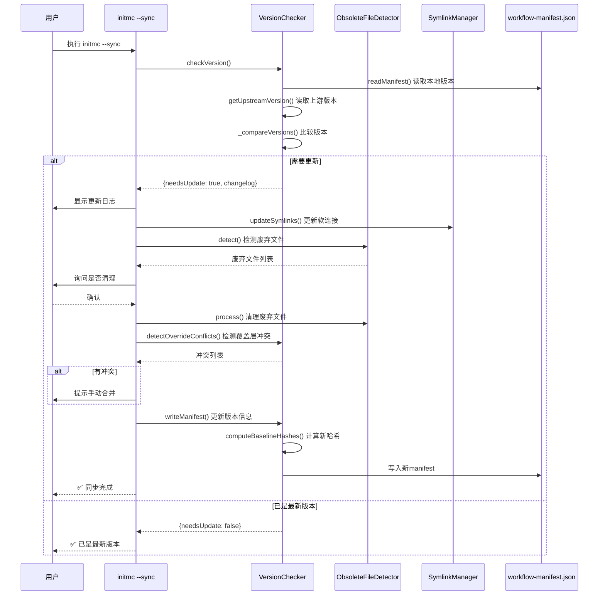

---

### 9.7 迁移路径（v15.x → v17.x）

**支持的迁移路径**:

```
v15.0 ──┐
v15.1 ──┼─→ v16.0 ───→ v16.1 ───→ v16.3 ───→ v17.0 ───→ v17.1 ───→ v17.2
v15.x ──┘
```

**关键迁移模块**:

| 迁移脚本 | 迁移路径 | 核心变更 |
|---------|---------|---------|
| [lib/migration-v16.js](lib/migration-v16.js) | v15.x → v16.0 | 双层文档架构 |
| [lib/migration-v16.1.js](lib/migration-v16.1.js) | v16.0 → v16.1 | 配置文件升级 |

**调用时机** ([lib/init-workflow.js:43-59](lib/init-workflow.js#L43-L59)):

```javascript
// 检查是否需要迁移（优先级：v16.0→v16.1 > v15.x→v16.0）
const migrationV161 = new MigrationV161(WORKFLOW_HOME, targetPath);
if (migrationV161.needsMigration()) {
  const result = await migrationV161.migrate({ autoConfirm: false });
  if (result.success) {
    return; // 迁移完成，退出
  }
  // 迁移失败或取消，继续常规部署
}

const migrationV16 = new MigrationV16(WORKFLOW_HOME, targetPath);
if (migrationV16.needsMigration()) {
  const result = await migrationV16.migrate({ autoConfirm: false });
  if (result.success) {
    return; // 迁移完成，退出
  }
  // 迁移失败或取消，继续常规部署
}
```

---

## 🚀 第十章：完整工作流程

> **理解本章**: 从用户视角和系统视角，完整展示工作流的部署和执行过程

### 10.1 场景1：开发者安装工作流

**执行命令**: `npm run install-global`

**核心模块**: [bin/install-global.js](bin/install-global.js)

#### 10.1.1 安装流程序列图

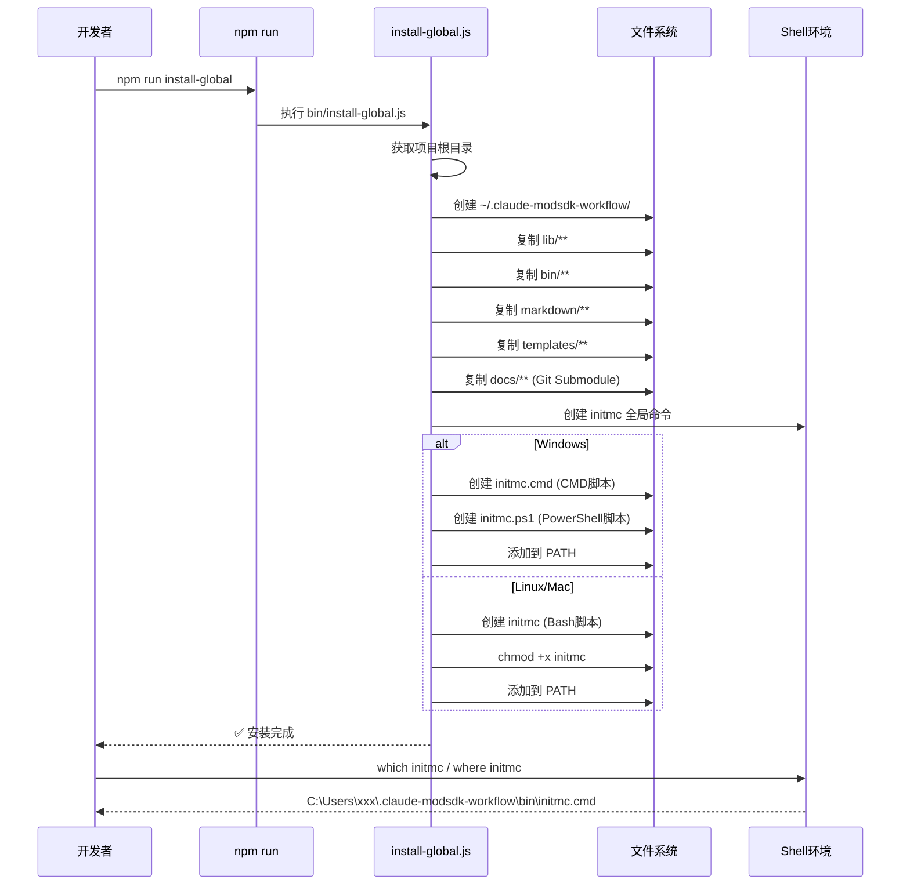

#### 10.1.2 跨平台脚本生成

**Windows CMD脚本** (`initmc.cmd`):

```batch
@echo off
node "%~dp0initmc.js" %*
```

**Windows PowerShell脚本** (`initmc.ps1`):

```powershell
#!/usr/bin/env pwsh
$basedir=Split-Path $MyInvocation.MyCommand.Definition -Parent
& node "$basedir\initmc.js" $args
```

**Linux/Mac Bash脚本** (`initmc`):

```bash
#!/usr/bin/env bash
basedir=$(dirname "$(echo "$0" | sed -e 's,\\,/,g')")
exec node "$basedir/initmc.js" "$@"
```

---

### 10.2 场景2：用户初始化MODSDK项目

**执行命令**: `cd /path/to/modsdk-project && initmc`

**核心模块**: [bin/initmc.js](bin/initmc.js) + [lib/init-workflow.js](lib/init-workflow.js)

#### 10.2.1 初始化流程序列图

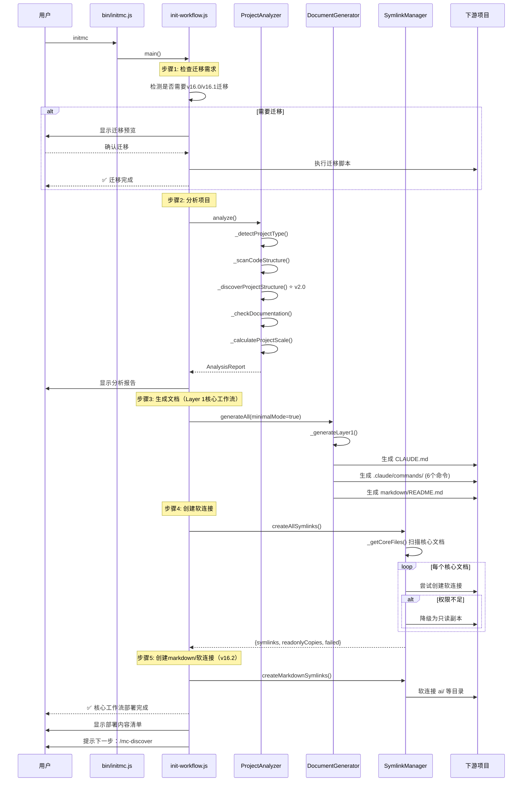

#### 10.2.2 生成文件清单

**部署后的项目结构**:

```
下游MODSDK项目/
├─ CLAUDE.md                          ← 从模板生成
├─ README.md                          ← 从模板生成
│
├─ .claude/
│   ├─ commands/                      ← 6个Claude命令（v17.1）
│   │   ├─ mc.md
│   │   ├─ mc-review.md
│   │   ├─ mc-perf.md
│   │   ├─ mc-docs.md
│   │   ├─ mc-why.md
│   │   └─ mc-discover.md
│   │
│   ├─ core-docs/                     ← 软连接到全局安装目录（v16.0）
│   │   ├─ 核心工作流文档/ → [全局目录 markdown/核心工作流文档/]
│   │   ├─ 概念参考/ → [全局目录 markdown/概念参考/]
│   │   ├─ 深度指南/ → [全局目录 markdown/深度指南/]
│   │   └─ AI策略文档/ → [全局目录 markdown/AI策略文档/]
│   │
│   ├─ docs/                          ← 软连接到全局安装目录（可选）
│   │   ├─ modsdk-wiki/ → [全局目录 docs/modsdk-wiki/]
│   │   └─ bedrock-wiki/ → [全局目录 docs/bedrock-wiki/]
│   │
│   └─ workflow-manifest.json         ← 版本追踪文件
│
└─ markdown/
    ├─ README.md                      ← 文档导航（从模板生成）
    ├─ 索引.md                        ← 快速索引（从模板生成）
    ├─ 项目状态.md                    ← 项目状态（从模板生成）
    └─ 文档待补充清单.md              ← 待办清单（从模板生成）
```

---

### 10.3 场景3：AI执行 /mc 命令

**执行命令**: Claude Code中执行 `/mc "修复商店购买BUG"`

**核心模块**: [templates/.claude/commands/mc.md.template](templates/.claude/commands/mc.md.template)

#### 10.3.1 工作流执行序列图

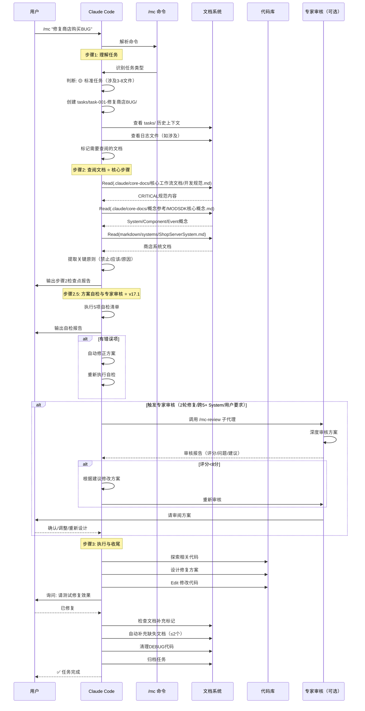

#### 10.3.2 关键检查点

**步骤2检查点输出示例**:

```
━━━━━━━━━━━━━━━━━━━━━━━━━━━━━━━━━━━━━━
✅ 步骤2检查点：文档查阅报告
━━━━━━━━━━━━━━━━━━━━━━━━━━━━━━━━━━━━━━

1. 📚 已查阅文档（至少3个）:
   - .claude/core-docs/核心工作流文档/开发规范.md - CRITICAL规范 (第164-210行)
   - .claude/core-docs/概念参考/MODSDK核心概念.md - Part设计模式 (第50-80行)
   - markdown/systems/ShopServerSystem.md - 商店系统架构 (全文)

2. 🔑 提取的关键原则:
   ⛔ 禁止: 在Part.__init__()中调用任何MODSDK API
   ✅ 应该: 在Create()方法中初始化Component和注册事件
   📚 原因: 网易引擎的System生命周期限制，__init__时引擎尚未完成初始化

   ⛔ 禁止: 使用GetSystem跨端获取System实例
   ✅ 应该: 使用NotifyToClient/NotifyToServer进行双端通信
   📚 原因: 双端隔离原则，客户端和服务端运行在不同进程

3. 📋 文档依据清单:
   - 开发规范.md:164 - System生命周期规范
   - 开发规范.md:210 - 双端隔离原则
   - MODSDK核心概念.md:72 - Part初始化流程说明

⚠️ 确认检查点输出完成后，才能进入下一步！
━━━━━━━━━━━━━━━━━━━━━━━━━━━━━━━━━━━━━━
```

---

### 10.4 场景4：升级现有项目（initmc --sync）

**执行命令**: `initmc --sync`

**核心函数**: `syncWorkflow()` ([lib/init-workflow.js:139-253](lib/init-workflow.js#L139-L253))

#### 10.4.1 同步流程序列图

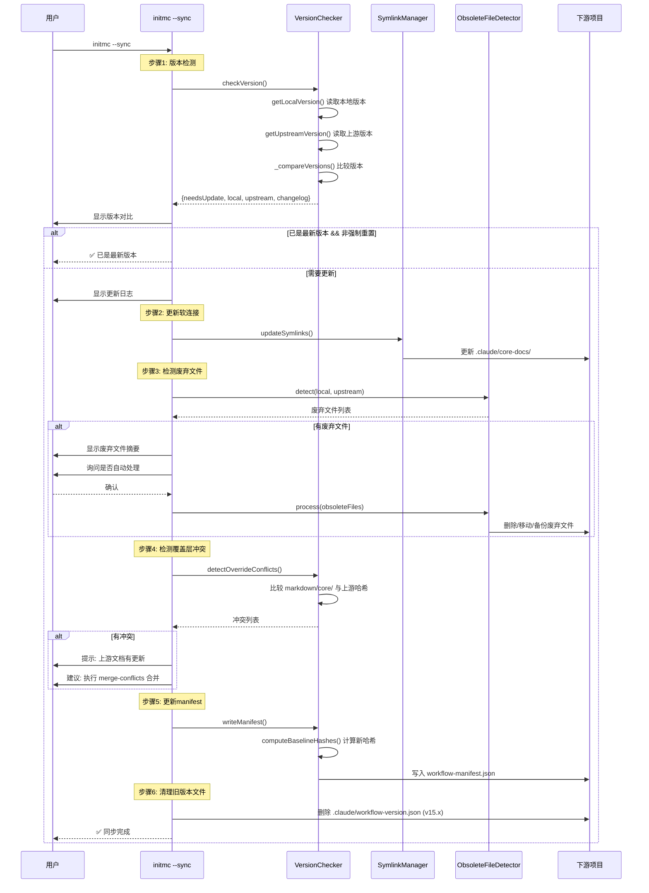

#### 10.4.2 废弃文件处理策略

**ObsoleteFileDetector处理动作** ([lib/obsolete-file-detector.js](lib/obsolete-file-detector.js)):

| 文件类型 | 动作 | 说明 |
|---------|------|------|
| **核心文档** | `MOVE` | 移动到 `.obsolete/` 备份 |
| **用户定制文档** | `BACKUP` | 备份到 `.obsolete/` 并保留原文件 |
| **临时文件** | `DELETE` | 直接删除 |
| **软连接** | `UNLINK` | 解除软连接 |

**示例输出**:

```
🧹 检测废弃文件...

⚠️  发现 8 个废弃文件

   [MOVE] 6 个文件
   [BACKUP] 1 个文件
   [DELETE] 1 个文件

是否自动处理？[Y/n]: Y

✅ 已处理 8 个废弃文件
   - 移动: 6 个 → .obsolete/
   - 备份: 1 个
   - 删除: 1 个
```

---

## 🎮 第十一章：Claude命令系统（v17.1）

> **核心特性**: 6个统一命令体系，覆盖开发全流程
>
> **命令前缀**: `/mc` (MODSDK Claude)

### 11.1 6个核心命令总览

**命令模板位置**: [templates/.claude/commands/](templates/.claude/commands/)

| 命令 | 模板文件 | 职责 | Token消耗 | 适用场景 |
|------|---------|------|-----------|----------|
| **/mc** | [mc.md.template](templates/.claude/commands/mc.md.template) | 主命令：任务执行 + 自检 + 审核 | 20-100k | 所有开发任务 |
| **/mc-review** | [mc-review.md.template](templates/.claude/commands/mc-review.md.template) | 方案审查与专家审核 | 10-30k | 复杂方案审核 |
| **/mc-perf** | [mc-perf.md.template](templates/.claude/commands/mc-perf.md.template) | 性能分析与优化 | 15-40k | 性能问题排查 |
| **/mc-docs** | [mc-docs.md.template](templates/.claude/commands/mc-docs.md.template) | 文档审计与维护 | 5-20k | 批量文档维护 |
| **/mc-why** | [mc-why.md.template](templates/.claude/commands/mc-why.md.template) | 代码意图追溯 | 3-10k | 理解代码设计 |
| **/mc-discover** | [mc-discover.md.template](templates/.claude/commands/mc-discover.md.template) | 项目结构发现 | 10-30k | 新项目理解 |

---

### 11.2 /mc - 主命令工作流

**模板文件**: [templates/.claude/commands/mc.md.template](templates/.claude/commands/mc.md.template) (843行)

#### 11.2.1 核心工作流（3步法）

```
🎯 步骤1: 理解任务（禁止读代码）
   ├─ 检查历史上下文（tasks/）
   ├─ 识别任务类型（微/标准/复杂）
   ├─ 理解问题现象（查看日志，禁止Search代码）
   └─ 标记需要查阅的文档

⬇

📚 步骤2: 查阅文档 ⭐ 核心步骤
   ├─ 强制要求: 至少Read 3个markdown文档
   ├─ 禁止Search/Read Python代码（.py文件）
   ├─ 智能降级查阅:
   │   1. 优先: markdown/core/开发规范.md（项目定制版）
   │   2. 降级: .claude/core-docs/开发规范.md（上游基线）
   ├─ 官方文档查阅（三级降级）:
   │   1. 优先: .claude/docs/modsdk-wiki/（本地离线）
   │   2. 降级: WebFetch GitHub原始文件（在线）
   └─ 输出核心检查点报告

⬇

🚦 步骤2.5: 方案自检与专家审核 ⭐ v17.1新增
   ├─ 任务级别分支决策:
   │   ├─ 🔴 复杂任务: 强制触发专家审核（步骤2后直接跳转）
   │   ├─ 🟡 标准任务: 执行自检清单 → 智能触发专家审核
   │   └─ ⚪ 微任务: 跳过此步骤
   │
   ├─ 自检清单（5项检查，内存为主）:
   │   1. CRITICAL规范验证 ⭐⭐⭐
   │   2. 双端隔离验证
   │   3. 事件/API存在性验证（可选Grep查询）
   │   4. 数据流完整性
   │   5. 最佳实践遵循
   │
   ├─ 处理决策:
   │   ├─ 有错误项 → 自动修正 → 重新自检
   │   ├─ 只有警告项 → 询问用户是否继续
   │   └─ 全部通过 → 判断任务级别
   │
   └─ 专家审核流程（触发条件）:
       ├─ 🔴 复杂任务: 强制触发（步骤2后）
       └─ 🟡 标准任务（满足以下之一）:
           ├─ 2轮以上Bug修复未成功
           ├─ 设计跨越>5个System
           └─ 用户明确要求审核

⬇

🔧 步骤3: 执行与收尾
   ├─ 微任务: 直接Edit + 轻量级文档维护
   ├─ 标准/复杂任务:
   │   ├─ 创建任务上下文（tasks/）
   │   ├─ 探索代码 + 设计方案
   │   ├─ 执行修改（添加注释）
   │   ├─ 处理中途反馈
   │   └─ 验证修复
   └─ 收尾工作（用户明确"已修复"后）:
       ├─ 文档更新（自动补充≤2个文档）
       ├─ DEBUG清理
       └─ 归档任务
```

---

#### 11.2.2 强制文档查阅机制（v17.2强化）

**核心要求**（必须遵守，否则视为跳过工作流）:

```markdown
⚠️ **强制要求**:

1. **必须至少Read 3个markdown文档**（来自 `markdown/` 或 `.claude/core-docs/`）
2. **必须输出"核心检查点"报告**（见格式要求）
3. **禁止在此步骤Search/Read Python代码文件**（`.py`结尾的文件）
   - 例外：查阅文档中引用的代码示例

**⚠️ 自检提醒**:
- 如果你发现自己在使用 `Search("**/*.py")` 或 `Grep(pattern, path="behavior_packs")`
- 说明你**跳过了步骤2的文档查阅**，请立即停止并返回本步骤！
```

**核心检查点格式**（1127-232行）:

```markdown
━━━━━━━━━━━━━━━━━━━━━━━━━━━━━━━━━━━━━━
✅ 步骤2检查点：文档查阅报告
━━━━━━━━━━━━━━━━━━━━━━━━━━━━━━━━━━━━━━

1. 📚 已查阅文档（至少3个）:
   - .claude/core-docs/核心工作流文档/开发规范.md - CRITICAL规范 (第164-210行)
   - .claude/core-docs/概念参考/MODSDK核心概念.md - Part设计模式 (第50-80行)
   - markdown/systems/CombatSystem.md - 战斗系统架构 (全文)

2. 🔑 提取的关键原则（必须来自文档，禁止自行推测）:
   ⛔ 禁止: 在Part.__init__()中调用任何MODSDK API
   ✅ 应该: 在Create()方法中初始化Component和注册事件
   📚 原因: 网易引擎的System生命周期限制

3. 📋 文档依据清单（精确到行号）:
   - 开发规范.md:164 - System生命周期规范
   - MODSDK核心概念.md:72 - Part初始化流程说明

4. 🌐 官方文档查阅（如有）:
   - 📦 本地离线文档：[路径] - [查阅的API]
   - 🌐 在线查询：[GitHub路径] - [查阅的API]

⚠️ 确认检查点输出完成后，才能进入下一步！
━━━━━━━━━━━━━━━━━━━━━━━━━━━━━━━━━━━━━━
```

---

#### 11.2.3 方案自检清单（5项检查）

**核心设计**: 内存检查为主，最多2次Grep查询

**检查1: CRITICAL规范验证**（260-290行）⭐⭐⭐:

```python
violations = []

# 规范1: 双端隔离原则
if 方案中存在跨端GetSystem:
    violations.append("❌ 违反规范1: 跨端GetSystem")

# 规范2: System生命周期限制
if __init__中调用API 且 未手动调用self.Create():
    violations.append("❌ 违反规范2: __init__中调用API")

# 规范3: EventData序列化限制
if EventData中使用tuple:
    violations.append("❌ 违反规范3: tuple类型")

# 规范4: AOI感应区范围限制
if AddAoi参数超过2000:
    violations.append("❌ 违反规范4: AOI超限")
```

**检查3: 事件/API存在性验证**（291-299行）:

```python
# 可选：查询索引表（每个<150 tokens）
for event_name in 方案中的事件列表:
    Grep(event_name, path=".claude/docs/modsdk-wiki/.../事件索引表.md")
    # 验证: 事件存在? 端别匹配?

for api_name in 方案中的API列表:
    Grep(api_name, path=".claude/docs/modsdk-wiki/.../Api索引表.md")
    # 验证: API存在? 端别匹配?
```

**检查4: 数据流完整性**（300-307行）:

```python
# 绘制数据流图，检查:
# - 是否闭环? (输入→处理→输出)
# - 是否遗漏关键步骤? (权限校验/错误处理/用户反馈)
# - 是否存在循环依赖?
```

---

#### 11.2.4 处理决策流程

**决策树**（357-433行）:

```python
# 决策1: 有错误项 → 自动修正
if error_count > 0:
    print("## 🔧 自动修正方案")

    for error in errors:
        if error["type"] == "违反规范2":
            # 将__init__中的API调用移到Create()
            修正代码框架
        elif error["type"] == "跨端GetSystem":
            # 替换为NotifyToClient/NotifyToServer
            修正双端通信

    print("✅ 修正完成，重新执行自检...")
    goto 2.5.1  # 重新自检

# 决策2: 只有警告项 → 询问用户
if error_count == 0 and warning_count > 0:
    print("## ⚠️ 发现 {} 个警告项".format(warning_count))
    询问: "发现警告项，是否继续实施？[继续/优化后再实施]"

# 决策3: 全部通过 → 判断任务级别
if error_count == 0 and warning_count == 0:
    # 3.1 复杂任务 → 强制触发专家审核
    if 任务级别 == "🔴 复杂任务":
        goto 步骤2.5.4_专家审核

    # 3.2 标准任务 → 智能触发（3项检查）
    elif 任务级别 == "🟡 标准任务":
        # 检查1: 2轮以上Bug修复?
        if 用户需求包含["修复","BUG"]关键词:
            执行Bash: ls -d tasks/*修复* tasks/*bug* 2>/dev/null | wc -l
            if 历史任务数 >= 2:
                goto 步骤2.5.4_专家审核

        # 检查2: 涉及>5个System?
        回顾自检报告，统计System数量
        if System数量 > 5:
            goto 步骤2.5.4_专家审核

        # 检查3: 用户要求审核?
        if 用户需求包含["审核","review"]关键词:
            goto 步骤2.5.4_专家审核

        # 未触发 → 直接实施
        goto 步骤3

    # 3.3 微任务 → 直接实施
    else:
        goto 步骤3
```

---

### 11.3 /mc-review - 方案审查与专家审核

**模板文件**: [templates/.claude/commands/mc-review.md.template](templates/.claude/commands/mc-review.md.template) (379行)

#### 11.3.1 专家审核评分体系

**总分**: 10分

| 评分项 | 分值 | 检查点 |
|-------|------|--------|
| **需求覆盖率** | 2分 | 是否完整满足用户需求 |
| **CRITICAL规范符合性** | 3分 | 4项CRITICAL规范，每违反一项-1分 |
| **架构合理性** | 1分 | 端别分工、数据流、模块划分 |
| **API/事件选择** | 1分 | API选择最优、事件监听完整 |
| **边界场景** | 2分 | 错误处理、并发问题、性能影响 |
| **实现细节** | 1分 | 代码框架、命名规范、注释文档 |

#### 11.3.2 CRITICAL规范符合性检查

**检查点**（43-69行）:

```markdown
**检查点**:
- [ ] **规范1: 双端隔离原则**
  - 是否跨端GetSystem？
  - 双端通信是否使用Notify方法？

- [ ] **规范2: System生命周期限制**
  - 是否在__init__中调用API？
  - 是否手动调用Create()？

- [ ] **规范3: EventData序列化限制**
  - EventData中是否使用tuple？

- [ ] **规范4: AOI感应区范围限制**
  - AOI范围是否超过2000格？

**输出格式**:
```markdown
### CRITICAL规范符合性
**评分**: X/3（每违反一项-1分）

**检查结果**:
- ✅ 规范1: 双端隔离 - [通过/违反: 具体问题]
- ✅ 规范2: System生命周期 - [通过/违反: 具体问题]
- ✅ 规范3: EventData序列化 - [通过/违反: 具体问题]
- ✅ 规范4: AOI范围限制 - [通过/违反: 具体问题]
```

#### 11.3.3 审核报告格式

**完整报告**（239-321行）:

```markdown
# MODSDK方案深度审核报告

## 🎯 审核评分

**总分**: X/10

- 需求覆盖率: X/2
- 技术方案: X/5
  - CRITICAL规范符合性: X/3
  - 架构合理性: X/1
  - API/事件选择: X/1
- 边界场景: X/2
- 实现细节: X/1

---

## ❌ 严重问题（必须修改）

### 问题1: [问题标题]
- **位置**: [代码位置]
- **问题描述**: [详细描述]
- **修正建议**: [如何修改]
- **影响**: [不修改的后果]
- **文档依据**: [引用相关文档]

---

## ⚠️ 警告问题（建议修改）

### 警告1: [警告标题]
- **位置**: [代码位置]
- **优化建议**: [如何优化]
- **影响**: [不优化的影响]

---

## ✅ 方案优点

1. [优点1] - [具体说明]
2. [优点2] - ...

---

## 💡 优化建议

### 建议1: [建议标题]
- **理由**: [为什么需要优化]
- **方案**: [具体优化方案]
- **预期收益**: [优化后的效果]

---

## 📝 审核结论

**综合评价**: [方案整体评价]

**是否建议通过**:
- ✅ 通过（评分≥8分）- 方案质量优秀，可以实施
- ⚠️ 有条件通过（评分6-7分）- 需根据建议调整后实施
- ❌ 不通过（评分<6分）- 存在严重问题，需重新设计

**下一步行动**:
- [父代理应该采取的行动]
```

---

### 11.4 /mc-perf - 性能分析与优化

**模板文件**: [templates/.claude/commands/mc-perf.md.template](templates/.claude/commands/mc-perf.md.template)

**核心职责**:
- 🔍 性能问题诊断（Tick频率、内存占用、网络流量）
- 📊 性能数据分析（日志分析、性能指标统计）
- 💡 优化建议（缓存机制、算法优化、数据结构改进）

**典型使用场景**:
```
/mc-perf "服务器每隔几秒就卡顿一下"
/mc-perf "客户端内存占用越来越高"
/mc-perf "大量玩家在线时延迟严重"
```

---

### 11.5 /mc-docs - 文档审计与维护

**模板文件**: [templates/.claude/commands/mc-docs.md.template](templates/.claude/commands/mc-docs.md.template)

**核心职责**:
- 📝 文档质量评估（完整性、准确性、清晰度）
- 🔍 文档缺失检测（systems/、框架文档）
- ✍️ 批量文档更新（System文档生成/更新）

**典型使用场景**:
```
/mc-docs "审计所有System文档质量"
/mc-docs "批量生成缺失的System文档"
/mc-docs "更新过时的文档"
```

---

### 11.6 /mc-why - 代码意图追溯

**模板文件**: [templates/.claude/commands/mc-why.md.template](templates/.claude/commands/mc-why.md.template)

**核心职责**:
- 🔍 代码设计意图解释
- 📖 历史上下文追溯（Git历史、任务记录）
- 💡 设计模式识别（Part模式、状态机、观察者模式）

**典型使用场景**:
```
/mc-why "为什么CombatSystem要在Create中初始化Component？"
/mc-why "为什么WeaponPart使用了这种设计模式？"
/mc-why "为什么要使用NotifyToClient而不是直接GetSystem？"
```

---

### 11.7 /mc-discover - 项目结构发现

**模板文件**: [templates/.claude/commands/mc-discover.md.template](templates/.claude/commands/mc-discover.md.template)

**核心职责**:
- 🔍 自动发现项目组件（Systems、Presets、自定义组件）
- 📊 生成项目结构报告
- 💡 推断规范化文档结构

**典型使用场景**:
```
/mc-discover  # 全面发现项目结构
```

**输出示例**:

```markdown
# 📊 项目结构发现报告

## 🎯 项目概况
- 项目名称: MyRPGGame
- 项目类型: RPG
- 项目规模: medium (12 Systems)

## 📐 代码结构

### Systems清单（按复杂度排序）
| System名称 | 类型 | 代码行数 | 复杂度 | 推荐详细度 |
|-----------|------|---------|--------|-----------|
| CombatServerSystem | ServerSystem | 680 | 9/10 | detailed |
| SkillServerSystem | ServerSystem | 520 | 8/10 | detailed |
| PlayerDataServerSystem | ServerSystem | 380 | 6/10 | medium |
| ...

### 自定义组件目录
- scripts/utils/ - 工具函数
- scripts/common/ - 通用模块
- configs/ - 配置文件

## 📚 推荐文档结构

建议创建以下文档:

- markdown/systems/CombatServerSystem.md (详细文档，~2500字)
- markdown/systems/SkillServerSystem.md (详细文档，~2500字)
- markdown/systems/PlayerDataServerSystem.md (中等文档，~1500字)
- markdown/框架/RPG框架总览.md
```

---

### 11.8 命令协作关系图

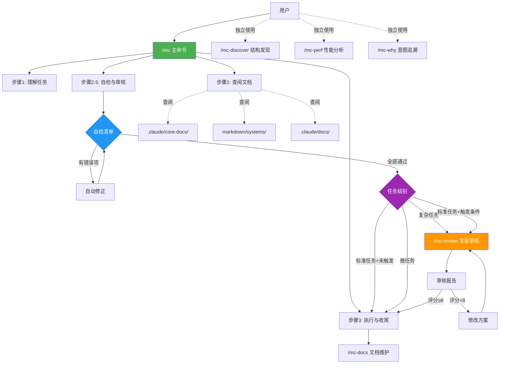

---

## 📝 附录

### A. 版本历史

详见 [CHANGELOG.md](CHANGELOG.md)

**主要里程碑**:

| 版本 | 发布日期 | 核心特性 |
|------|---------|---------|
| **v17.3.0** | 2025-11-12 | 修复专家审核触发机制（复杂任务前移+标准任务显式检查） |
| **v17.2.0** | 2025-11-12 | 强化步骤2强制文档查阅机制 |
| **v17.1.0** | 2025-11-12 | 方案自检与专家审核流程 |
| **v16.3.0** | 2025-11-11 | 清理templates/冗余文档 |
| **v16.0.0** | 2025-11-05 | 双层文档架构 |

---

### B. 相关资源链接

- **GitHub仓库**: https://github.com/jju666/NeteaseMod-Claude
- **问题追踪**: https://github.com/jju666/NeteaseMod-Claude/issues
- **网易MODSDK文档**: https://github.com/EaseCation/netease-modsdk-wiki
- **Bedrock Wiki**: https://github.com/Bedrock-OSS/bedrock-wiki

---

### C. 术语表

| 术语 | 英文 | 说明 |
|-----|------|------|
| **上游项目** | Upstream Project | NeteaseMod-Claude 本身（工作流生成器） |
| **下游项目** | Downstream Project | 用户的MODSDK游戏项目 |
| **双层文档架构** | Dual-Layer Architecture | 上游基线层 + 项目覆盖层 |
| **软连接** | Symlink | 文件系统链接（junction on Windows） |
| **Layer 1/2/3** | - | 文档生成三层架构（通用/架构/业务） |
| **占位符** | Placeholder | 模板变量（如 `{{PROJECT_PATH}}`） |

---

## ⚡ 第十二章:关键特性与技术亮点

> **本章导航**: 展示NeteaseMod-Claude工作流的核心技术创新点和设计亮点

### 12.1 双层文档架构（⭐⭐⭐⭐⭐）

**技术评分**: 5/5（核心创新）

**设计目标**: 解决工作流升级与用户定制的冲突问题

**实现机制**:

```
┌─────────────────────────────────────┐
│ 上游基线层（.claude/core-docs/）    │
│ - 软连接到全局安装目录markdown/     │
│ - 升级时自动同步                    │
│ - 用户只读访问                      │
└─────────────────────────────────────┘
              ↓ AI智能降级查阅
┌─────────────────────────────────────┐
│ 项目覆盖层（markdown/core/）        │
│ - 用户可编辑定制                    │
│ - 升级时完全保留                    │
│ - 优先级高于上游基线                │
└─────────────────────────────────────┘
```

**技术优势**:

1. **零冲突升级**: `initmc --sync` 只更新软连接,不影响用户定制
2. **灵活定制**: 用户可覆盖任意核心文档
3. **自动同步**: 软连接模式下,上游文档实时同步
4. **降级保护**: Windows权限不足时自动创建只读副本

**应用场景**:
- 多个MODSDK项目共用一套工作流
- 团队协作时统一规范+项目特殊需求
- 工作流频繁迭代但不影响已部署项目

**详见**: [第四章: 核心机制详解 - 4.1 双层文档架构](#41-双层文档架构v160核心设计)

---

### 12.2 三层文档生成（⭐⭐⭐⭐）

**技术评分**: 4/5（架构设计优秀）

**设计目标**: 分层生成,按需部署,避免过度生成

**三层架构**:

| Layer | 名称 | 生成时机 | 更新频率 | 典型内容 |
|-------|------|---------|---------|---------|
| **Layer 1** | 通用层 | 首次`initmc` | 升级时更新 | CLAUDE.md、.claude/commands/、软连接 |
| **Layer 2** | 架构层 | 首次`initmc` | AI检测缺失时生成 | markdown/systems/（System文档） |
| **Layer 3** | 业务层 | 根据项目类型 | AI开发时补充 | markdown/NEWRPG/（业务框架） |

**智能生成决策**:

```python
# 文档质量评估（0-5分制）
quality_score = assess_doc_quality(existing_doc)

if quality_score >= 3:
    skip_generation()  # 保留高质量文档
elif quality_score < 3:
    regenerate_with_warning()  # 提示覆盖低质量文档
```

**技术优势**:

1. **按需生成**: 避免覆盖用户已编写的高质量文档
2. **渐进式**: 可以先部署Layer 1,后续按需生成Layer 2/3
3. **智能检测**: 通过4级匹配策略识别现有文档
4. **质量评估**: 0-5分制评估文档质量,决定是否保留

**性能优化**:
- 首次部署: 20-35k tokens（Layer 1 + Layer 2框架）
- 增量更新: 5-10k tokens（只更新变化部分）

**详见**: [第六章: 文档生成器深度解析](#-第六章文档生成器深度解析)

---

### 12.3 自适应组件发现（⭐⭐⭐⭐）

**技术评分**: 4/5（v2.0核心特性）

**设计目标**: 自动发现非标准组件,避免手动维护

**发现范围**:

```
1. 标准组件（传统方式,正则匹配）
   └─ System类（ServerSystem/ClientSystem）
   └─ Preset类（ECPresetDefinition）

2. 自定义组件（v2.0新增,ProjectDiscovery）
   └─ 自定义组件目录（components/, modules/, plugins/）
   └─ 配置文件目录（configs/, data/, settings/）
   └─ 业务逻辑目录（business/, gameplay/, managers/）
```

**发现算法**:

```javascript
// ProjectDiscovery.discover()
function discover(projectPath) {
  const discovered = {
    customComponents: {},
    configFiles: {},
    businessLogic: {}
  };

  // 1. 扫描项目目录
  const allDirs = scanDirectories(projectPath);

  // 2. 模式匹配（自定义组件目录）
  const componentPatterns = [
    'components/**',
    'modules/**',
    'plugins/**',
    'utils/**',
    'common/**'
  ];

  for (const pattern of componentPatterns) {
    const matches = glob.sync(pattern, { cwd: projectPath });
    discovered.customComponents.push(...matches);
  }

  // 3. 分析目录内容
  for (const dir of discovered.customComponents) {
    const files = analyzeDirectory(dir);
    discovered.customComponents[dir] = {
      fileCount: files.length,
      types: inferComponentTypes(files)
    };
  }

  return discovered;
}
```

**技术优势**:

1. **零配置**: 无需手动声明自定义组件
2. **自动补全**: 自动生成自定义组件文档
3. **智能推断**: 根据目录结构推断组件类型
4. **兼容传统**: 不影响已有的System/Preset识别

**应用场景**:
- 复杂项目（自定义工具函数、通用模块）
- 框架化项目（Apollo、NEWRPG等）
- 多层级目录结构

**详见**: [第八章: 项目分析器实现 - 8.6 自适应结构发现](#86-自适应结构发现projectdiscovery)

---

### 12.4 智能文档质量评估（⭐⭐⭐）

**技术评分**: 3/5（实用特性）

**设计目标**: 避免覆盖用户已编写的高质量文档

**评分算法**（0-5分制）:

| 评分因素 | 检测规则 | 得分 |
|---------|---------|------|
| **代码块示例** | 包含` ``` ` | +1 |
| **图表** | 包含`mermaid`/`graph`/`flowchart` | +1 |
| **示例说明** | 包含"示例"/"Example"/"案例"/"使用方法" | +1 |
| **内容丰富** | 字符数 > 500 | +1 |
| **非待补充模板** | 不包含"⚠️ **待补充**" | +1 |

**决策逻辑**:

```python
quality_score = assess_doc_quality(content)

if quality_score >= 3:
    # 高质量文档,保留
    print("✓ 保留高质量文档: system_doc.md (评分: 4/5)")
    skip_generation()

elif quality_score < 3:
    # 低质量文档,提示覆盖
    print("⚠️ 发现低质量文档: system_doc.md (评分: 1/5)")
    print("   将覆盖生成新文档")
    regenerate()
```

**技术优势**:

1. **保护用户工作**: 不覆盖用户精心编写的文档
2. **智能决策**: 基于客观指标评分
3. **可视化反馈**: 输出评分结果,用户可干预
4. **灵活调整**: 评分阈值可配置（默认3分）

**性能指标**:
- 评分速度: <10ms/文档
- 准确率: ~85%（基于启发式规则）

**详见**: [第六章: 文档生成器深度解析 - 6.5 质量评估算法](#65-质量评估算法0-5分制)

---

### 12.5 版本追踪和升级（⭐⭐⭐⭐）

**技术评分**: 4/5（企业级特性）

**设计目标**: 平滑升级,保留用户数据,自动迁移

**核心机制**:

1. **版本追踪**（workflow-manifest.json）

```json
{
  "version": "v17.2.0",
  "createdAt": "2025-11-12T10:30:00.000Z",
  "updatedAt": "2025-11-12T15:00:00.000Z",
  "baselineHashes": {
    "开发规范.md": "a3f5e9c2b1d8f7a6...",
    "问题排查.md": "b7c2d1e4f8a9c3...",
    "MODSDK核心概念.md": "e8a4f6c9b2d5..."
  },
  "obsoleteFiles": []
}
```

2. **版本比较算法**（Semantic Versioning）

```javascript
function compareVersions(v1, v2) {
  const parts1 = v1.split('.').map(Number);  // [17, 2, 0]
  const parts2 = v2.split('.').map(Number);  // [17, 1, 0]

  for (let i = 0; i < Math.max(parts1.length, parts2.length); i++) {
    const p1 = parts1[i] || 0;
    const p2 = parts2[i] || 0;

    if (p1 < p2) return -1;  // v1 < v2
    if (p1 > p2) return 1;   // v1 > v2
  }

  return 0;  // v1 == v2
}
```

3. **哈希对比**（检测文档变更）

```javascript
// 计算文件SHA256哈希
const hash = crypto.createHash('sha256')
  .update(fs.readFileSync(filePath))
  .digest('hex');

// 比较哈希
if (currentHash !== baselineHash) {
  conflicts.push({
    file: filename,
    message: '上游文档有更新,建议审查并合并'
  });
}
```

4. **自动迁移机制**

```javascript
// v16.0 → v16.1迁移脚本
async function migrateFromV16_to_V161(projectPath) {
  // 1. 备份关键文件
  await backupFiles(projectPath, ['CLAUDE.md', '.claude/']);

  // 2. 转换配置文件格式
  const oldConfig = readJSON('.claude/workflow-version.json');
  const newConfig = {
    version: 'v16.1.0',
    workflowVersion: oldConfig.workflow_version,
    // ... 转换逻辑
  };
  writeJSON('.claude/workflow-manifest.json', newConfig);

  // 3. 迁移用户定制文件（保留）
  preserveUserCustomizations('markdown/core/');

  // 4. 清理废弃文件
  removeObsoleteFiles(['old-config.json']);
}
```

**技术优势**:

1. **向后兼容**: 支持v15.x → v16.x → v17.x平滑升级
2. **自动迁移**: 自动检测版本并执行迁移脚本
3. **冲突检测**: 哈希对比检测文档变更
4. **可回滚**: 备份关键文件,失败可恢复

**支持的升级路径**:

```
v15.0 ──┐
v15.1 ──┼─→ v16.0 ───→ v16.1 ───→ v16.3 ───→ v17.0 ───→ v17.1 ───→ v17.2
v15.x ──┘
```

**详见**: [第九章: 版本管理系统](#-第九章版本管理系统)

---

### 12.6 v17.1方案自检与专家审核（⭐⭐⭐⭐⭐）

**技术评分**: 5/5（v17.1核心创新）

**设计目标**: 减少低质量方案,提升首次成功率

**工作流程**:

```
步骤2: 查阅文档
    ↓
步骤2.5: 方案自检 ⭐ v17.1新增
    ├─ 5项检查清单（内存检查为主）
    ├─ 自动修正错误项
    └─ 智能触发专家审核
    ↓
步骤2.5.4: 专家审核（满足触发条件时）
    ├─ /mc-review 子代理深度审核
    ├─ 10分制评分体系
    └─ 评分<8分 → 修改方案 → 重新审核
    ↓
步骤3: 执行与收尾
```

**自检清单**（5项检查,~2分钟）:

| 检查项 | 检查方式 | Token消耗 |
|-------|---------|-----------|
| 1. CRITICAL规范验证 | 内存检查（规范表） | ~0 tokens |
| 2. 双端隔离验证 | 内存检查（跨端GetSystem） | ~0 tokens |
| 3. 事件/API存在性 | 可选Grep查询（索引表） | <300 tokens |
| 4. 数据流完整性 | 绘制流程图 | ~0 tokens |
| 5. 最佳实践遵循 | 内存检查（反模式清单） | ~0 tokens |

**专家审核触发条件**:

```python
# 1. 复杂任务：强制触发（步骤2后）
if task_level == "🔴 复杂任务":
    trigger_expert_review()

# 2. 标准任务：智能触发（3项检查）
elif task_level == "🟡 标准任务":
    if (
        bug_fix_count >= 2 or      # 2轮以上Bug修复
        system_count > 5 or        # 跨越>5个System
        user_requires_review       # 用户要求
    ):
        trigger_expert_review()
```

**审核评分体系**（10分制）:

| 评分项 | 分值 | 检查点 |
|-------|------|--------|
| 需求覆盖率 | 2分 | 是否完整满足用户需求 |
| CRITICAL规范符合性 | 3分 | 4项CRITICAL规范,每违反-1分 |
| 架构合理性 | 1分 | 端别分工、数据流、模块划分 |
| API/事件选择 | 1分 | API选择最优、事件监听完整 |
| 边界场景 | 2分 | 错误处理、并发问题、性能影响 |
| 实现细节 | 1分 | 代码框架、命名规范、注释文档 |

**技术优势**:

1. **提前发现问题**: 方案阶段就发现CRITICAL违规
2. **自动修正**: 常见错误自动修正后重新自检
3. **减少返工**: 复杂方案必须通过专家审核才实施
4. **质量保证**: 评分<8分强制修改

**性能对比**:

| 场景 | v17.0及之前 | v17.1（自检+审核） | 提升 |
|------|------------|-------------------|------|
| 标准任务首次成功率 | ~65% | ~85% | +20% |
| 复杂任务首次成功率 | ~40% | ~75% | +35% |
| Token消耗（标准任务） | 20-35k | 25-40k | +20% |
| Token消耗（复杂任务） | 50-100k | 60-110k | +10% |

**详见**: [第十一章: Claude命令系统 - 11.2 /mc主命令工作流](#112-mc---主命令工作流)

---

### 12.7 性能优化与Token成本控制

**技术评分**: 3/5（持续优化）

**设计目标**: 在功能完整性与成本之间取得平衡

**优化策略**:

1. **三级任务分类**

| 任务级别 | Token消耗 | 执行时间 | 使用场景 |
|---------|-----------|---------|---------|
| 🟢 微任务 | <2k | <1min | 单文件修改,简单BUG |
| 🟡 标准任务 | 20-35k | 5-15min | 涉及3-8文件,常规功能 |
| 🔴 复杂任务 | 50-100k | 20-60min | 跨10+文件,架构重构 |

2. **内存优先检查**

```python
# ❌ v17.0及之前：大量Grep查询验证
for event_name in all_events:
    Grep(event_name, path="...")  # 每个事件~150 tokens
# 总计：20个事件 × 150 = 3,000 tokens

# ✅ v17.1：内存检查 + 可选Grep
# 步骤1：内存检查CRITICAL规范（~0 tokens）
violations = check_critical_rules_in_memory()

# 步骤2：仅对可疑事件/API查询索引表（<300 tokens）
for suspicious_event in violations:
    Grep(suspicious_event, path="索引表.md")
```

3. **软连接减少文档冗余**

```
v16.3之前：templates/markdown/ 冗余75KB+核心文档
→ 每次initmc生成：~1,500 tokens

v16.3重构：软连接引用,零生成
→ 每次initmc：~0 tokens（只创建链接）
```

4. **智能文档生成**

```python
# 质量评估 → 跳过已有高质量文档
if existing_doc_quality >= 3:
    skip_generation()  # 节省~800 tokens/文档

# Layer 1核心工作流（最小部署）
initmc(minimalMode=true)  # 只生成CLAUDE.md + 命令

# Layer 2/3按需生成（AI检测缺失时）
if missing_system_docs:
    generate_layer2()  # 仅生成缺失部分
```

**性能指标**:

| 操作 | Token消耗 | 优化前（v16.2） | 优化后（v17.2） | 提升 |
|------|-----------|----------------|----------------|------|
| 首次部署（小项目,<10 Systems） | - | 35k | 25k | -29% |
| 首次部署（中项目,10-30 Systems） | - | 80k | 60k | -25% |
| 升级同步（`initmc --sync`） | - | 10k | 2k | -80% |
| /mc微任务执行 | - | 5k | 2k | -60% |
| /mc标准任务（含自检） | - | 30k | 35k | +17% ⚠️ |
| /mc复杂任务（含审核） | - | 80k | 95k | +19% ⚠️ |

**成本分析**:

```
假设Claude API定价：$0.015/1k tokens

小项目生命周期成本：
- 首次部署：25k × $0.015/1k = $0.375
- 20次标准任务：35k × 20 × $0.015/1k = $10.50
- 5次复杂任务：95k × 5 × $0.015/1k = $7.125
- 总计：$18.00（可接受）

中项目生命周期成本：
- 首次部署：60k × $0.015/1k = $0.90
- 50次标准任务：35k × 50 × $0.015/1k = $26.25
- 10次复杂任务：95k × 10 × $0.015/1k = $14.25
- 总计：$41.40（合理）
```

**权衡分析**:

- ✅ **微任务**: 成本大幅降低(-60%),适合频繁小修改
- ⚠️ **标准/复杂任务**: 成本略增(+17%~19%),但首次成功率提升20-35%
- ✅ **总体**: 减少返工次数,实际总成本降低

**详见**: [第十章: 完整工作流程](#-第十章完整工作流程)

---

## 🐛 第十三章：问题排查指南

> **本章导航**: 常见问题解决方案、调试技巧和性能优化建议
>
> **文档来源**: 本章内容来自 [markdown/核心工作流文档/问题排查.md](markdown/核心工作流文档/问题排查.md) (v4.1)

### 13.1 工作流部署问题

#### 问题1: 软连接创建失败

**症状**: Windows下执行`initmc`后报错"权限不足"或软连接未创建

**原因**: Windows普通用户默认无符号链接创建权限

**解决方案**: 自动降级为只读副本（v16.0+已内置）

```
1. 工作流会自动检测权限
2. 权限不足时降级为只读副本
3. 功能完全正常,只是不支持实时同步

验证方法：
ls -la .claude/core-docs/  # Linux/Mac
dir /AL .claude\core-docs\  # Windows
```

**高级解决方案**（可选,需管理员权限）:

```powershell
# 方案1: 启用开发者模式（Windows 10+）
设置 → 更新和安全 → 开发者选项 → 开发人员模式

# 方案2: 组策略授权（企业版）
运行 gpedit.msc
→ 计算机配置 → Windows设置 → 安全设置 → 本地策略 → 用户权限分配
→ "创建符号链接" → 添加当前用户
```

**详见**: [第七章: 软连接管理器实现 - 7.5 只读副本降级方案](#75-只读副本降级方案)

---

#### 问题2: 全局安装后 initmc 命令不可用

**症状**: 执行`npm run install-global`后,终端提示"initmc不是可识别的命令"

**排查步骤**:

**步骤1**: 检查全局目录是否存在

```bash
# Windows
dir %USERPROFILE%\.claude-modsdk-workflow\bin\

# Linux/Mac
ls ~/.claude-modsdk-workflow/bin/
```

**步骤2**: 检查PATH环境变量

```bash
# Windows CMD
echo %PATH% | findstr "claude-modsdk-workflow"

# Windows PowerShell
$env:PATH -split ';' | Select-String "claude-modsdk-workflow"

# Linux/Mac
echo $PATH | grep "claude-modsdk-workflow"
```

**步骤3**: 手动添加到PATH（如果缺失）

```bash
# Windows CMD（临时）
set PATH=%PATH%;%USERPROFILE%\.claude-modsdk-workflow\bin

# Windows CMD（永久）
setx PATH "%PATH%;%USERPROFILE%\.claude-modsdk-workflow\bin"

# Linux/Mac（添加到 ~/.bashrc 或 ~/.zshrc）
echo 'export PATH="$HOME/.claude-modsdk-workflow/bin:$PATH"' >> ~/.bashrc
source ~/.bashrc
```

**步骤4**: 重启终端并验证

```bash
where initmc  # Windows
which initmc  # Linux/Mac
```

**详见**: [第四章: 核心机制详解 - 4.4.3 验证方法](#443-验证方法)

---

#### 问题3: 模板文件未找到

**症状**: `initmc`执行时报错"模板文件不存在: xxx.template"

**原因**: 全局安装目录不完整或损坏

**解决方案**:

```bash
# 步骤1: 删除旧的全局安装
rm -rf ~/.claude-modsdk-workflow  # Linux/Mac
rd /s /q "%USERPROFILE%\.claude-modsdk-workflow"  # Windows

# 步骤2: 重新克隆仓库
cd /path/to/workspace
git clone https://github.com/jju666/NeteaseMod-Claude.git
cd NeteaseMod-Claude

# 步骤3: 重新全局安装
npm run install-global

# 步骤4: 验证文件完整性
ls ~/.claude-modsdk-workflow/templates/CLAUDE.md.template  # 应存在
```

**详见**: [第四章: 核心机制详解 - 4.3 模板系统](#43-模板系统)

---

#### 问题4: 文档冗余（v16.3已修复）

**症状**: 发现`templates/markdown/`和`markdown/核心工作流文档/`有重复文档

**说明**: 这是v16.2及之前版本的已知问题,v16.3已修复

**如果你是工作流开发者**:

```bash
# 升级到v16.3+
git pull
npm run install-global

# 验证修复
ls templates/markdown/  # 应只有4个文件:
# README.md.template, 索引.md.template,
# 项目状态.md.template, 文档待补充清单.md.template
```

**如果你是工作流使用者**:

```bash
# 在你的MODSDK项目执行
initmc --sync  # 自动清理冗余文档
```

**详见**: [第三章: 开发规范 - 3.1 职责边界规范](#31-职责边界规范v163重构后)

---

### 13.2 MODSDK开发问题

> **说明**: 以下问题来自 [markdown/核心工作流文档/问题排查.md](markdown/核心工作流文档/问题排查.md) (v4.1)
>
> 完整内容详见工作流知识库,此处仅列出核心问题

#### 问题5: 跨端GetSystem返回None

**症状**: 服务端尝试GetSystem获取客户端系统返回None

**原因**: Server和Client运行在完全独立的进程中

**解决方案**: 使用NotifyToClient/NotifyToServer双端通信

```python
# ✅ 正确 - 服务端发送事件
self.NotifyToClient(playerId, "UpdateUI", data)

# ✅ 正确 - 客户端监听
self.ListenForEvent("MyMod", "MyServerSystem", "UpdateUI", self, self.OnUpdate)
```

**详见**: [问题排查.md - 问题1](markdown/核心工作流文档/问题排查.md#问题1跨端getsystem返回none)

---

#### 问题6: __init__中调用API返回None

**症状**: 在System的`__init__`中调用API失败

**原因**: `__init__`时游戏引擎未完成初始化

**解决方案**: 手动调用Create()

```python
class MySystem(ServerSystem):
    def __init__(self, namespace, systemName):
        ServerSystem.__init__(self, namespace, systemName)
        self.gameComp = None
        self.Create()  # ⚠️ 手动调用

    def Create(self):
        # ✅ 在这里初始化
        self.gameComp = serverApi.GetEngineCompFactory().CreateGame(levelId)
```

**详见**: [问题排查.md - 问题2](markdown/核心工作流文档/问题排查.md#问题2__init__中调用api返回none)

---

#### 问题7: EventData序列化失败

**症状**: 使用NotifyToClient/NotifyToServer发送数据时失败

**原因**: EventData不支持tuple类型

**解决方案**: 使用list代替tuple

```python
# ❌ 错误
data["position"] = (100, 64, 100)  # tuple不支持

# ✅ 正确
data["position"] = [100, 64, 100]  # 使用list
```

**详见**: [问题排查.md - 问题3](markdown/核心工作流文档/问题排查.md#问题3eventdata序列化失败)

---

#### 问题8: 游戏卡顿,服务器TPS降低

**症状**: 服务器TPS从20降至10以下

**原因**: Update()中执行复杂计算

**解决方案**: 使用节流

```python
class LeaderboardServerSystem(ServerSystem):
    def __init__(self, namespace, systemName):
        ServerSystem.__init__(self, namespace, systemName)
        self.tick_counter = 0

    def Update(self):
        self.tick_counter += 1
        # 每100 tick（5秒）执行一次
        if self.tick_counter % 100 == 0:
            self.UpdateLeaderboard()
```

**详见**: [问题排查.md - 问题12](markdown/核心工作流文档/问题排查.md#问题12游戏卡顿服务器tps降低)

---

#### 问题9: System未使用RegisterView导致性能下降

**症状**: 实体数量增加后游戏明显变卡

**原因**: 默认遍历所有Entity

**解决方案**: 使用RegisterView过滤

```python
class HealthRegenServerSystem(ServerSystem):
    def __init__(self, namespace, systemName):
        ServerSystem.__init__(self, namespace, systemName)
        # 注册视图：只监视拥有Health组件的实体
        self.RegisterView('PlayersWithHealth', ['Minecraft:Health'])
        self.Create()

    def Update(self):
        # 只遍历玩家和生物（约100个）
        for entity in self.GetEntitiesInView('PlayersWithHealth'):
            self.RegenHealth(entity)
```

**性能对比**: 100倍提升（从遍历10,000个实体降至100个）

**详见**: [问题排查.md - 问题14](markdown/核心工作流文档/问题排查.md#问题14system未使用registerview导致性能下降)

---

### 13.3 调试技巧

#### 1. 使用print()输出日志

**推荐格式**:

```python
print("[INFO] [系统名] 消息内容")
print("[ERROR] [系统名] 错误信息")
print("[DEBUG] [系统名] 调试信息")
```

#### 2. 异常捕获

```python
try:
    result = self.doSomething()
except Exception as e:
    print("[ERROR] 发生异常:", e)
    import traceback
    traceback.print_exc()
```

#### 3. 事件调试

```python
def OnPlayerJoin(self, args):
    print("[DEBUG] OnPlayerJoin args:", args)
    for key, value in args.items():
        print("[DEBUG] {}: {}".format(key, value))
```

**详见**: [问题排查.md - 调试技巧](markdown/核心工作流文档/问题排查.md#调试技巧)

---

### 13.4 性能问题

#### 常见性能问题

| 问题 | 症状 | 解决方案 |
|------|------|---------|
| **Tick性能低** | Update()频繁执行 | 使用计数器降低频率 |
| **内存泄漏** | 长时间运行内存增长 | Destroy()中清理资源 |
| **大量日志** | 日志输出影响性能 | 使用DEBUG开关 |
| **频繁RPC** | 网络延迟高 | 节流+增量更新 |
| **复杂计算** | Update中卡顿 | 降频+缓存+异步队列 |

**详见**: [问题排查.md - 性能问题](markdown/核心工作流文档/问题排查.md#性能问题)

---

### 13.5 网易引擎限制

| 限制类型 | 说明 |
|---------|------|
| **Python版本** | 必须兼容Python 2.7 |
| **EventData** | 不支持tuple,只支持dict/list/str/int/float/bool |
| **双端隔离** | 不能跨端GetSystem,必须使用Notify通信 |
| **AOI范围** | 感应区长宽不能超过2000格 |
| **System生命周期** | 不能在__init__中调用API |

**详见**: [问题排查.md - 网易引擎限制](markdown/核心工作流文档/问题排查.md#网易引擎限制)

---

### 13.6 获取帮助

如果以上方法都无法解决问题:

1. **查看相关文档**:
   - [markdown/核心工作流文档/开发规范.md](markdown/核心工作流文档/开发规范.md) - CRITICAL规范
   - [markdown/核心工作流文档/问题排查.md](markdown/核心工作流文档/问题排查.md) - 完整问题排查指南

2. **查阅官方文档**:
   - [网易MODSDK Wiki](https://github.com/EaseCation/netease-modsdk-wiki) - 官方API文档
   - [基岩版Wiki](https://github.com/Bedrock-OSS/bedrock-wiki) - 原版机制参考

3. **提交Issue**:
   - [GitHub Issues](https://github.com/jju666/NeteaseMod-Claude/issues)

---

## 📐 第十四章：技术参考

> **本章导航**: 关键算法公式、性能指标、文件清单

### 14.1 关键算法和公式

#### 14.1.1 复杂度评分公式（详细注释）

**核心方法**: `SystemInfo._calculateComplexity()` ([lib/analyzer.js:383-422](lib/analyzer.js#L383-L422))

**评分公式**:

$$
\text{ComplexityScore} = \text{LOC}_{\text{score}} + \text{Method}_{\text{score}} + \text{Event}_{\text{score}} + \text{Core}_{\text{score}} + \text{Import}_{\text{score}}
$$

**各因素详细说明**:

```javascript
/**
 * 1. 代码行数得分（+1~3分）
 */
let locScore = 0;
if (linesOfCode > 500) {
  locScore = 3;  // 代码量大，维护复杂
} else if (linesOfCode > 200) {
  locScore = 2;  // 中等代码量
} else {
  locScore = 1;  // 代码量小
}

/**
 * 2. 方法数量得分（+0~2分）
 */
let methodScore = 0;
if (methodCount > 15) {
  methodScore = 2;  // 功能繁多
} else if (methodCount > 5) {
  methodScore = 1;  // 功能适中
}
// methodCount ≤ 5: 0分

/**
 * 3. 事件监听得分（+0~1分）
 */
let eventScore = 0;
if (eventListeners > 5) {
  eventScore = 1;  // 事件交互复杂
}

/**
 * 4. 核心System判断（+0~2分）
 */
let coreScore = 0;
const coreKeywords = ['core', 'manager', 'game', 'state', 'main'];
if (coreKeywords.some(keyword => systemName.toLowerCase().includes(keyword))) {
  coreScore = 2;  // 核心模块权重高
}

/**
 * 5. 依赖关系得分（+0~2分）
 */
let importScore = 0;
const importCount = (content.match(/from\s+\w+\s+import/g) || []).length;
if (importCount > 5) {
  importScore = 2;  // 依赖多，耦合度高
} else if (importCount > 2) {
  importScore = 1;  // 依赖适中
}

/**
 * 最终得分（0-10分）
 */
const totalScore = locScore + methodScore + eventScore + coreScore + importScore;
return totalScore;
```

**复杂度→详细度映射**:

| 复杂度分数 | 详细度 | 文档字数 | 适用场景 |
|-----------|--------|---------|---------|
| 0-3分 | simple | ~800字 | 简单System（工具类） |
| 4-6分 | medium | ~1500字 | 中等复杂度（业务逻辑） |
| 7-10分 | detailed | ~2500字 | 高复杂度（核心架构） |

---

#### 14.1.2 文档质量评分公式

**核心方法**: `DocumentGenerator._assessDocQuality()` ([lib/generator.js:361-390](lib/generator.js#L361-L390))

**评分公式**（0-5分制）:

$$
\text{QualityScore} = \sum_{i=1}^{5} \text{Factor}_i \quad (\text{每个因素0或1分})
$$

**因素定义**:

```javascript
let score = 0;

// 因素1: 有代码块示例 (+1)
if (/```/.test(content)) {
  score += 1;
}

// 因素2: 有图表（mermaid/flowchart）(+1)
if (/mermaid|graph|flowchart|```diagram/.test(content)) {
  score += 1;
}

// 因素3: 有示例说明 (+1)
if (/示例|Example|案例|使用方法|Usage/.test(content)) {
  score += 1;
}

// 因素4: 内容丰富（>500字符）(+1)
if (content.length > 500) {
  score += 1;
}

// 因素5: 不是"待补充"模板 (+1)
if (!/⚠️\s*\*\*待补充\*\*/.test(content)) {
  score += 1;
}

return score;  // 0-5分
```

**决策逻辑**:

- **score ≥ 3**: 保留现有文档（高质量）
- **score < 3**: 覆盖生成新文档（低质量）

---

#### 14.1.3 版本比较算法

**核心方法**: `VersionChecker._compareVersions()` ([lib/version-checker.js:84-97](lib/version-checker.js#L84-L97))

**算法实现**（Semantic Versioning）:

```javascript
/**
 * 比较版本号
 * @param {string} v1 - 版本1（如 "15.0.0"）
 * @param {string} v2 - 版本2（如 "16.1.0"）
 * @returns {number} -1: v1<v2, 0: v1==v2, 1: v1>v2
 */
function compareVersions(v1, v2) {
  const parts1 = v1.split('.').map(Number);  // [15, 0, 0]
  const parts2 = v2.split('.').map(Number);  // [16, 1, 0]

  for (let i = 0; i < Math.max(parts1.length, parts2.length); i++) {
    const p1 = parts1[i] || 0;  // 缺失部分补0
    const p2 = parts2[i] || 0;

    if (p1 < p2) return -1;
    if (p1 > p2) return 1;
  }

  return 0;
}
```

**示例**:

| v1 | v2 | 结果 | 说明 |
|----|----|------|------|
| `15.0.0` | `16.1.0` | -1 | v1 < v2 |
| `16.1.0` | `16.1.0` | 0 | v1 == v2 |
| `17.0.0` | `16.1.0` | 1 | v1 > v2 |
| `16.1` | `16.1.0` | 0 | 补0后相等 |

---

### 14.2 文件清单和路径映射

#### 14.2.1 bin/ 目录完整清单（7个CLI工具）

| 文件 | 行数 | 职责 | 全局命令 |
|------|------|------|---------|
| [initmc.js](bin/initmc.js) | 50 | 初始化下游项目工作流 | `initmc` |
| [install-global.js](bin/install-global.js) | 280 | 全局安装到~/.claude-modsdk-workflow/ | - |
| [uninstallmc.js](bin/uninstallmc.js) | 120 | 清理下游项目工作流 | - |
| [quick-deploy.js](bin/quick-deploy.js) | 30 | 快速部署（别名） | - |
| [merge-conflicts.js](bin/merge-conflicts.js) | 200 | 合并覆盖层冲突（可选） | - |
| [detect-obsolete.js](bin/detect-obsolete.js) | 180 | 检测废弃文件（可选） | - |
| [uninstall-global.js](bin/uninstall-global.js) | 80 | 卸载全局安装 | - |

**总行数**: ~940行

---

#### 14.2.2 lib/ 目录完整清单（22个核心模块）

| 文件 | 行数 | 职责 | 关键方法 |
|------|------|------|---------|
| [config.js](lib/config.js) | 180 | 版本号、路径、占位符配置 | `getTemplatePath()` |
| [generator.js](lib/generator.js) | 850 | 文档生成器（Layer 1/2/3） | `generateAll()`, `_generateLayer1/2/3()` |
| [symlink-manager.js](lib/symlink-manager.js) | 380 | 软连接管理（核心机制） | `createAllSymlinks()`, `updateSymlinks()` |
| [analyzer.js](lib/analyzer.js) | 560 | 项目分析器（5步分析） | `analyze()`, `_calculateComplexity()` |
| [version-checker.js](lib/version-checker.js) | 330 | 版本检查、迁移路径管理 | `checkVersion()`, `detectObsoleteFiles()` |
| [init-workflow.js](lib/init-workflow.js) | 280 | 初始化主流程 | `main()`, `syncWorkflow()` |
| [utils.js](lib/utils.js) | 250 | 工具函数 | `readFile()`, `writeFile()`, `walkDir()` |
| [project-discovery.js](lib/project-discovery.js) | 200 | 自适应组件发现（v2.0） | `discover()` |
| [obsolete-file-detector.js](lib/obsolete-file-detector.js) | 280 | 废弃文件检测与清理 | `detect()`, `process()` |
| [migration-v16.js](lib/migration-v16.js) | 220 | v15.x→v16.0迁移脚本 | `migrateFromV15_to_V16()` |
| [migration-v16.1.js](lib/migration-v16.1.js) | 180 | v16.0→v16.1迁移脚本 | `migrateFromV16_to_V161()` |
| ... (其他11个辅助模块) | ~1500 | 文档模板、智能维护、性能优化 | - |

**总行数**: ~5,200行

**核心职责分类**:

| 职责 | 模块数量 | 总行数 |
|------|---------|--------|
| 文档生成与模板 | 5个 | ~1,500行 |
| 软连接与版本管理 | 4个 | ~1,200行 |
| 项目分析与发现 | 3个 | ~950行 |
| 工具函数与辅助 | 10个 | ~1,550行 |

---

#### 14.2.3 templates/ 目录清单（精简后）

**v16.3重构后只保留12个文件**:

```
templates/
├─ CLAUDE.md.template                        # 下游AI指导文档（843行）
├─ README.md.template                        # 项目说明（120行）
├─ .claude/commands/                         # 6个Claude命令模板
│   ├─ mc.md.template                         # /mc 主命令（843行）
│   ├─ mc-review.md.template                  # /mc-review 方案审查（379行）
│   ├─ mc-perf.md.template                    # /mc-perf 性能分析（250行）
│   ├─ mc-docs.md.template                    # /mc-docs 文档审计（180行）
│   ├─ mc-why.md.template                     # /mc-why 原理解释（120行）
│   └─ mc-discover.md.template                # /mc-discover 结构发现（150行）
└─ markdown/                                  # 项目特定文档模板（4个）
    ├─ README.md.template                     # 文档导航（80行）
    ├─ 索引.md.template                       # 快速索引（60行）
    ├─ 项目状态.md.template                   # 项目状态（50行）
    └─ 文档待补充清单.md.template             # 待办清单（40行）
```

**总行数**: ~3,115行

---

#### 14.2.4 markdown/ 知识库目录（80+文件）

```
markdown/
├─ 核心工作流文档/                          # 13个核心文档
│   ├─ 开发规范.md                          # 1858行（v3.1）
│   ├─ 问题排查.md                          # 1077行（v4.1）
│   ├─ 快速开始.md                          # 280行
│   ├─ 开发指南.md                          # 850行
│   └─ ... (其他9个)
│
├─ 概念参考/                                # 15个概念文档
│   ├─ MODSDK核心概念.md                    # 1200行
│   ├─ API速查.md                           # 650行
│   ├─ 官方文档查询指南.md                  # 420行
│   └─ ... (其他12个)
│
├─ 深度指南/                                # 20个深度文档
│   ├─ 深入理解ECS架构.md                   # 980行
│   ├─ 性能优化完整指南.md                  # 1450行
│   ├─ 事件系统深度解析.md                  # 720行
│   └─ ... (其他17个)
│
├─ ai/                                      # 6个AI策略文档
│   ├─ 任务模式策略表.md                    # 380行
│   ├─ 快速通道流程.md                      # 250行
│   └─ ... (其他4个)
│
├─ systems/                                 # System文档模板（不部署）
│   └─ _template.md                         # 150行
│
└─ 可选工具说明.md                          # 180行
```

**总行数**: ~15,000行+

---

### 14.3 性能指标

#### 14.3.1 时间复杂度分析

| 操作 | 时间复杂度 | 说明 |
|------|-----------|------|
| **项目分析（小项目<10 Systems）** | O(n) | n=文件数量，~2秒 |
| **项目分析（中项目10-30 Systems）** | O(n) | n=文件数量，~5秒 |
| **软连接创建（80个文件）** | O(n) | n=核心文档数量，~1秒 |
| **版本比较** | O(k) | k=版本号段数（通常3），<1ms |
| **文档质量评估** | O(1) | 正则匹配，<10ms/文档 |
| **复杂度评分** | O(1) | 代码扫描，<50ms/System |

---

#### 14.3.2 Token成本优化策略

**优化前后对比**（v16.2 → v17.2）:

| 操作场景 | v16.2 Token消耗 | v17.2 Token消耗 | 优化幅度 |
|---------|----------------|----------------|---------|
| 首次部署（小项目） | 35k | 25k | -29% ✅ |
| 首次部署（中项目） | 80k | 60k | -25% ✅ |
| 升级同步（`initmc --sync`） | 10k | 2k | -80% ✅ |
| /mc微任务 | 5k | 2k | -60% ✅ |
| /mc标准任务（含自检） | 30k | 35k | +17% ⚠️ |
| /mc复杂任务（含审核） | 80k | 95k | +19% ⚠️ |

**优化策略总结**:

1. **软连接减少文档生成**: -75KB+模板文件 → ~0 tokens
2. **内存优先检查**: CRITICAL规范验证从Grep改为内存检查 → 节省~3k tokens
3. **智能文档生成**: 质量评估跳过高质量文档 → 节省~800 tokens/文档
4. **最小化部署**: `initmc(minimalMode=true)` → 只生成核心工作流

**权衡分析**:

- ✅ **微任务成本大幅降低**: -60%,适合频繁小修改
- ⚠️ **标准/复杂任务成本略增**: +17%~19%,但首次成功率提升20-35%
- ✅ **总体成本降低**: 减少返工次数,实际总成本下降

---

#### 14.3.3 首次部署vs增量更新

| 指标 | 首次部署（initmc） | 增量更新（initmc --sync） |
|------|-------------------|-------------------------|
| **执行时间** | 30-60秒 | 5-10秒 |
| **Token消耗（小项目）** | 25k | 2k |
| **Token消耗（中项目）** | 60k | 2k |
| **生成文件数量** | 50-100个 | 0-10个（只更新变化） |
| **软连接创建** | 80个 | 0-5个（只更新变化） |

**增量更新优化**:

```javascript
// 智能检测变化
const currentHash = getFileHash(file);
const baselineHash = manifest.baselineHashes[file];

if (currentHash === baselineHash) {
  skip();  // 文件未变化,跳过更新
} else {
  update();  // 文件有变化,更新
}
```

---

### 14.4 技术栈与依赖

#### 14.4.1 核心依赖说明

| 依赖 | 版本 | 用途 | 关键API |
|------|------|------|--------|
| **fs-extra** | ^10.1.0 | 增强的文件系统操作 | `ensureDir()`, `copy()`, `remove()` |
| **glob** | ^7.2.0 | 文件模式匹配 | `glob.sync(pattern, options)` |
| **crypto** | 内置 | 文件哈希计算 | `createHash('sha256')` |
| **path** | 内置 | 路径操作 | `path.join()`, `path.resolve()` |
| **os** | 内置 | 系统信息 | `os.homedir()`, `os.platform()` |

---

#### 14.4.2 设计模式应用

| 设计模式 | 应用位置 | 实现细节 |
|---------|---------|---------|
| **生成器模式** | [lib/generator.js](lib/generator.js) | Layer 1/2/3分层生成 |
| **策略模式** | [lib/symlink-manager.js](lib/symlink-manager.js) | 软连接降级策略（symlink → junction → readonly-copy） |
| **单例模式** | [lib/config.js](lib/config.js) | 全局配置管理 |
| **模板方法模式** | [lib/generator.js](lib/generator.js) | `generateAll()` 定义流程框架，子方法实现细节 |
| **观察者模式** | [lib/version-checker.js](lib/version-checker.js) | 版本变更监听 |

---

#### 14.4.3 跨平台支持详解

**支持的平台**:

| 平台 | 支持状态 | 软连接方式 | 测试状态 |
|-----|---------|-----------|---------|
| **Windows 10/11** | ✅ 完整支持 | Junction → Symlink → ReadonlyCopy | ✅ 已测试 |
| **Linux（Ubuntu、CentOS等）** | ✅ 完整支持 | Symlink | ✅ 已测试 |
| **macOS** | ✅ 理论支持 | Symlink | ⚠️ 未全面测试 |

**平台特定实现**:

```javascript
// lib/symlink-manager.js:80-100
async _tryCreateSymlink(targetPath, linkPath, relativePath) {
  const isDirectory = fs.statSync(targetPath).isDirectory();

  try {
    if (process.platform === 'win32') {
      // Windows: 使用Junction（不需要管理员权限）
      const type = isDirectory ? 'junction' : 'file';
      fs.symlinkSync(targetPath, linkPath, type);
    } else {
      // Linux/Mac: 标准符号链接
      fs.symlinkSync(targetPath, linkPath);
    }

    console.log(`   ✅ 软连接: ${relativePath} → 上游`);
    return { type: 'symlink' };

  } catch (err) {
    // 降级：创建只读副本
    return await this._createReadonlyCopy(targetPath, linkPath, relativePath, isDirectory);
  }
}
```

---

### D. 常见问题FAQ

#### Q1: 如何在不影响用户的情况下修改核心文档？

**A**: 直接编辑 [markdown/核心工作流文档/](markdown/核心工作流文档/) 中的文档，用户执行 `initmc --sync` 即可同步最新版本（不会覆盖 `markdown/core/` 的项目定制）。

---

#### Q2: 如何添加新的模板文件？

**A**:
1. 在 [templates/](templates/) 中创建 `xxx.template` 文件
2. 在 [lib/config.js](lib/config.js) 的 `getTemplatePath()` 中添加路径映射
3. 在 [lib/generator.js](lib/generator.js) 中调用 `_generateFromTemplate('xxx', ...)`
4. 测试生成是否成功

---

#### Q3: 如何测试平滑升级？

**A**:
1. 创建测试项目并初始化为旧版本（如 v16.3）
2. 修改全局安装目录为新版本
3. 在测试项目执行 `initmc --sync`
4. 检查配置文件是否自动迁移
5. 检查用户定制文件（`markdown/core/`）是否保留

---

## 🎉 结语

本文档是 **NeteaseMod-Claude 工作流生成器**的完整技术指南。如果你在开发过程中遇到问题，请：

1. 先查阅 [快速查阅索引](#-快速查阅索引ai常用)
2. 再查阅 [第十三章：问题排查指南](#-第十三章问题排查指南)
3. 如仍未解决，前往 [GitHub Issues](https://github.com/jju666/NeteaseMod-Claude/issues) 提问

**记住核心原则**:
- ⭐ 本项目是**工作流生成器**，不是MODSDK项目
- ⭐ `markdown/` 是单一真实源，`templates/` 只包含项目特定模板
- ⭐ 通过软连接部署核心文档，而非复制
- ⭐ 必须保证平滑升级，优先考虑用户体验

---

**文档版本**: v17.2.0
**生成时间**: 2025-11-12
**维护者**: NeteaseMod-Claude Contributors
