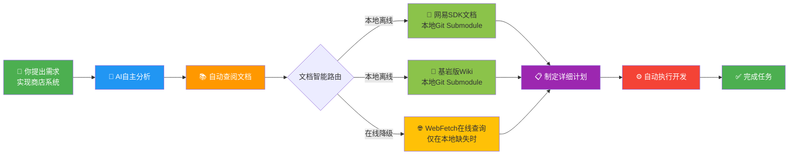
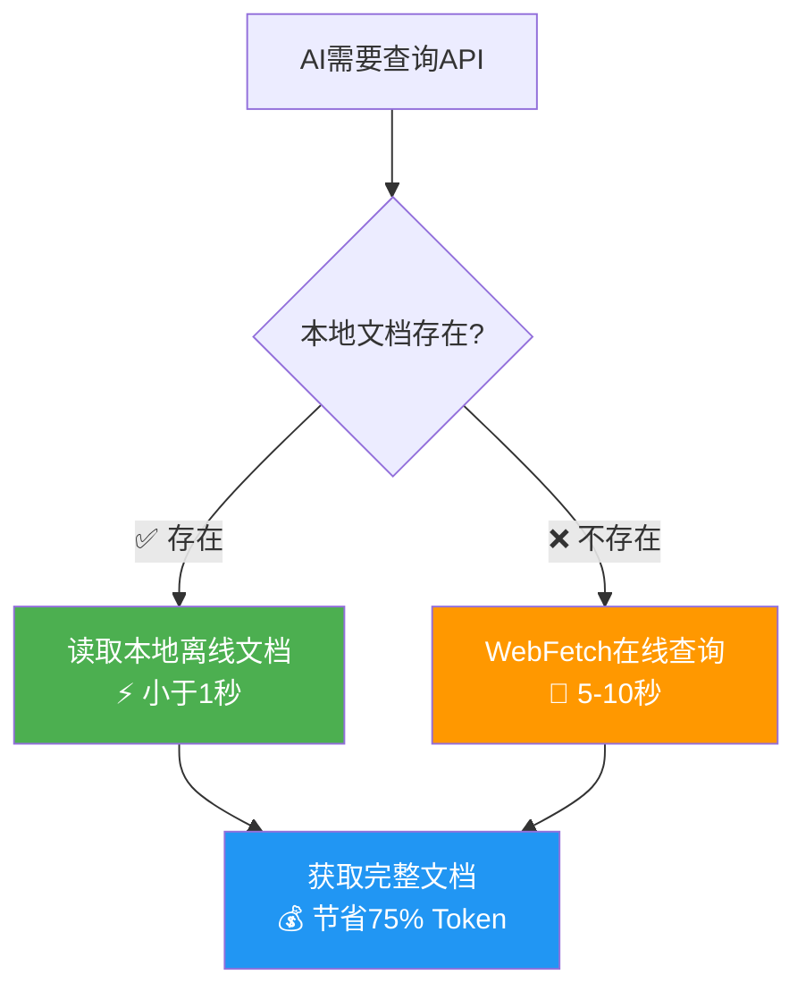
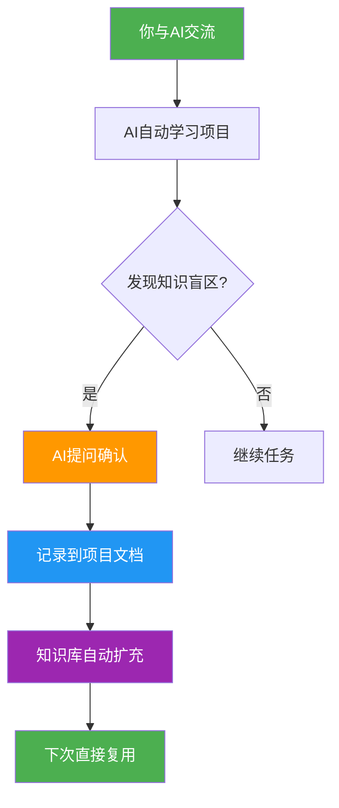

# NeteaseMod-Claude 🤖⚡

<div align="center">

**AI驱动的网易我的世界MODSDK开发工作流**

[](https://github.com/jju666/NeteaseMod-Claude)
[](./LICENSE)
[](https://claude.ai/code)
[](https://nodejs.org)

*让Claude AI成为你的MODSDK开发专家*

[快速开始](#-快速开始) • [核心特性](#-核心特性) • [完整文档](#-完整文档)

</div>

---

## 🌟 **为什么选择 NeteaseMod-Claude?**

<div align="center">

### 🚀 **AI全流程自主开发 - 从需求到实现，完全自动化**

</div>



<div align="center">

| 🎯 核心能力 | 📊 效果 |
|-----------|-------|
| **🔍 自主需求分析** | AI自动拆解任务、识别技术难点 |
| **📚 智能文档查阅** | 自动查阅网易SDK、基岩版Wiki、项目规范 |
| **⚡ 本地离线优先** | 95%场景离线可用，速度提升10倍 |
| **🧠 自学习能力** | 交流越多，AI对你的项目理解越深 |
| **📝 零文档维护** | AI自动更新项目文档，无需手动编写 |

</div>

---

### 💡 **两大核心优势**

<table>
<tr>
<td width="50%">

#### 🚀 **1. 全自动文档查阅 - 本地离线优先**



**性能对比**：
- 🚀 速度：本地 <1秒 vs 在线 5-10秒 (**10倍提升**)
- 💰 成本：本地 ~500 tokens vs 在线 2-3k tokens (**节省75%**)
- 🔌 离线：本地 ✅ 支持 vs 在线 ❌ 需网络

</td>
<td width="50%">

#### 📚 **2. 零维护自学习系统**



**核心机制**：
- 📝 AI自动维护 `markdown/systems/` 文档
- 🧠 每次交流都在积累项目知识
- 🔄 知识复用，越用越智能

</td>
</tr>
</table>

---

### 🎨 **实际开发体验**

<div align="center">

**传统开发流程 vs NeteaseMod-Claude**

</div>

<table>
<tr>
<th width="50%">❌ 传统开发</th>
<th width="50%">✅ NeteaseMod-Claude</th>
</tr>
<tr>
<td>

```
1. 手动搜索API文档 (5-10分钟)
   └─ 打开浏览器 → 搜索 → 查找页面 → 复制代码

2. 编写代码 (20分钟)
   └─ 可能违反规范(双端隔离等)

3. 遇到错误 (30分钟)
   └─ 调试 → 查文档 → 再调试

4. 手动更新文档 (15分钟)
   └─ 整理实现细节 → 记录到文档

总耗时：~70分钟
文档维护负担：重
```

</td>
<td>

```
你："实现商店系统"

AI：
✅ 已查阅：网易SDK文档、基岩版Wiki
✅ 已制定：5步实现计划
✅ 开始执行...
  1. 创建ShopServerSystem ✓
  2. 创建ShopClientSystem ✓
  3. 实现UI交互 ✓
  4. 测试双端通信 ✓
  5. 更新项目文档 ✓

✅ 完成！已自动更新 markdown/systems/ShopSystem.md

总耗时：~15分钟
文档维护负担：零
```

</td>
</tr>
</table>

---

## 🎯 项目简介

**NeteaseMod-Claude** 是一套专为网易我的世界MODSDK设计的**AI辅助开发工作流**。通过与Claude Code深度集成，让AI助手：
- ✅ **精通MODSDK开发规范**，自动避免90%常见错误
- ✅ **智能查阅官方文档**，无需手动搜索API
- ✅ **自动化任务管理**，从规划到实施全程追踪
- ✅ **双层文档架构**，项目定制与上游更新互不干扰

**一句话概括**：让Claude Code像一个**拥有3年MODSDK开发经验的专家**一样辅助你的项目开发。

---

## 🚀 快速开始

### 1. 安装工作流

```bash
# 克隆仓库（包含子模块）
git clone --recursive https://github.com/jju666/NeteaseMod-Claude.git
cd NeteaseMod-Claude

# 全局安装命令行工具
npm install
npm run install-global

# 验证安装
initmc --version
```

**⚠️ Windows用户特别注意**：

由于需要创建符号链接，Windows系统需要**管理员权限**：

```powershell
# 1. 以管理员身份打开PowerShell
#    右键点击 "Windows PowerShell" → "以管理员身份运行"

# 2. 切换到项目目录（注意使用引号）
cd "D:\EcWork\基于Claude的MODSDK开发工作流"

# 3. 运行安装命令
npm install
npm run install-global
```

**📝 注意事项**：
- 安装过程会自动下载官方文档（Git Submodule）
- 可能需要 1-3 分钟，取决于网络速度
- 请耐心等待，**不要关闭终端**

如遇到 `EPERM: operation not permitted` 错误，请参考：[Windows权限问题解决方案](./docs/INSTALLATION.md#问题3windows软连接权限不足)

### 2. 初始化你的MODSDK项目

```bash
# 进入你的MODSDK项目目录
cd /path/to/your/modsdk-project

# 一键初始化工作流（自动检测项目结构）
initmc
```

### 3. 开始使用Claude Code开发

在你的项目中，直接与Claude Code对话：

```
你：修复商店系统点击无响应的问题

Claude：
✅ 已查阅文档: 开发规范.md (📝项目定制版), 问题排查.md (📦上游基线)
🎯 提取原则: ⛔禁止在服务端GetSystem获取客户端系统
🔍 定位问题: ShopServerSystem:78 错误使用 GetSystem("ShopClientSystem")
✅ 修复方案: 使用 NotifyToClient 发送事件到客户端
```

### 4. 详细指南

- 📖 **[安装指南](./docs/INSTALLATION.md)** - 详细安装步骤和环境配置
- 💡 **[使用示例](./docs/EXAMPLES.md)** - 实际开发案例
- 🐛 **[故障排查](./docs/TROUBLESHOOTING.md)** - 常见问题解决方案

---

## ✨ 核心特性

### 1. 🧠 AI智能规范遵守

Claude Code会**自动查阅并遵守**MODSDK开发规范，避免90%的常见错误：

| 规范类型 | 自动检测能力 | 错误示例 |
|---------|------------|---------|
| **双端隔离原则** | ✅ 阻止跨端GetSystem | `ShopServerSystem`中调用`GetSystem("ShopClientSystem")` |
| **System生命周期** | ✅ 强制在`Create()`中初始化 | `__init__`中调用`GetComponent` |
| **模块导入规范** | ✅ 检查相对路径 | 子目录使用`from ..presets import X` |

---

### 2. 📚 双层文档架构（v16.0核心创新）

```
项目根目录/
├── .claude/
│   ├── core-docs/        ← 📦 上游基线层（只读，软连接）
│   │   ├── 开发规范.md
│   │   ├── 问题排查.md
│   │   └── ...
│   └── docs/            ← 官方文档（Git Submodule）
│       └── netease-modsdk-wiki/
│
└── markdown/
    ├── core/            ← 📝 项目覆盖层（可编辑）
    │   └── 开发规范.md  ← 项目定制版（覆盖上游）
    ├── systems/         ← 项目System文档
    └── 文档待补充清单.md
```

**智能文档路由**：AI自动选择项目定制版或上游基线版本。

**优势对比**：

| 特性 | v16.0双层架构 | v15.0单层架构 |
|-----|-------------|-------------|
| **职责隔离** | ✅ 100%（多项目互不影响） | ❌ 混杂在一起 |
| **上游更新** | ✅ 一键同步（`initmc --sync`） | ❌ 手动复制 |
| **项目定制** | ✅ 按需覆盖（自动创建） | ❌ 直接修改原文件 |
| **文档数量** | ✅ 3-5个（只存差异） | ❌ 10+个（全量复制） |

---

### 3. 🔄 三步核心工作流

Claude Code按照**标准化流程**执行每个任务：

```
步骤1: 理解任务与分级（2分钟）
   ├─ 🟢 微任务 (<30行)  → 快速通道（直接Edit）
   ├─ 🟡 标准任务 (3-8文件) → 5章模板
   └─ 🔴 复杂任务 (>8文件)  → 9章模板

步骤2: 查阅文档（智能路由）
   ├─ 层级1: 项目覆盖层（markdown/core/）
   ├─ 层级2: 上游基线（.claude/core-docs/）
   ├─ 层级3: 项目文档（markdown/systems/）
   ├─ 层级4: 官方文档（.claude/docs/，npm自动拉取）
   └─ 层级5: 在线查阅（WebFetch降级策略）

步骤3: 执行与收尾
   ├─ 实施修改（Edit/Write）
   ├─ 验证测试
   ├─ 更新文档
   └─ Git commit（附带任务历史）
```

---

### 4. 🌐 离线能力（95%场景）

**三级文档查阅策略**：

```
优先级1: 本地Git Submodule（离线可用）
   ├─ .claude/docs/netease-modsdk-wiki/  ← npm install自动拉取
   └─ 优势: 离线访问、速度快

优先级2: 本地软连接（上游基线）
   ├─ .claude/core-docs/  ← 工作流核心文档
   └─ 优势: 项目定制支持

优先级3: 在线查阅（降级策略）
   ├─ WebFetch查询GitHub Raw URL
   └─ 优势: 获取最新文档
```

**离线模式（默认）**：
- `npm install` 自动初始化 Git Submodule（官方文档）
- Claude优先使用本地文档（`.claude/docs/`）
- WebFetch仅作为降级策略（本地缺失时）

---

### 5. 🛠️ 可选优化工具

v16.0新增两个可选工具，提升开发体验：

| 工具 | 功能 | 使用场景 |
|-----|------|---------|
| **merge-conflicts** | 检测项目覆盖层与上游的冲突 | 上游更新后执行 |
| **detect-obsolete** | 检测并清理废弃文件（带备份） | 版本升级后执行 |

详见：[可选工具说明.md](./markdown/可选工具说明.md)

---

## 📚 完整文档

### 核心文档（必读）

| 文档 | 说明 | 读者 |
|-----|------|------|
| [CLAUDE.md](./CLAUDE.md) | AI工作流总入口 | 🤖 Claude必读 |
| [快速参考.md](./快速参考.md) | 工作流快速查询手册 | 👨‍💻 开发者必读 |
| [Claude指令参考.md](./Claude指令参考.md) | Slash Command使用说明 | 👨‍💻 开发者参考 |

### 用户指南

| 文档 | 说明 |
|-----|------|
| [安装指南](./docs/INSTALLATION.md) | 详细安装步骤和环境配置 |
| [使用示例](./docs/EXAMPLES.md) | 实际开发案例 |
| [故障排查](./docs/TROUBLESHOOTING.md) | 常见问题解决方案 |

### 开发规范

| 文档 | 说明 |
|-----|------|
| [开发规范.md](./markdown/开发规范.md) | CRITICAL规范，防止90%错误 |
| [问题排查.md](./markdown/问题排查.md) | 已知问题和调试技巧 |
| [MODSDK核心概念.md](./markdown/MODSDK核心概念.md) | System、Component、Event全解析 |
| [API速查.md](./markdown/API速查.md) | 常用API速查表 |

### 工作流文档

| 文档 | 说明 |
|-----|------|
| [快速开始.md](./markdown/快速开始.md) | 5分钟上手指南 |
| [任务类型决策表.md](./markdown/ai/任务类型决策表.md) | 任务分级指南 |
| [快速通道流程.md](./markdown/ai/快速通道流程.md) | 微任务执行流程 |

### 版本迁移

| 文档 | 说明 |
|-----|------|
| [迁移指南-v16.1.md](./markdown/迁移指南-v16.1.md) | v16.0 → v16.1升级 |
| [迁移指南-v16.0.md](./markdown/迁移指南-v16.0.md) | v15.x → v16.0升级 |
| [可选工具说明.md](./markdown/可选工具说明.md) | 覆盖层冲突合并、废弃文件检测 |

### 版本历史

| 文档 | 说明 |
|-----|------|
| [CHANGELOG.md](./CHANGELOG.md) | 完整版本变更记录 |
| [RELEASE_CHECKLIST.md](./RELEASE_CHECKLIST.md) | 发布前检查清单 |

---

## 🌟 技术亮点

### 自动化程度：95%

| 操作 | 自动化程度 | 说明 |
|-----|----------|------|
| 项目初始化 | ✅ 100% | `initmc` 一键部署 |
| 文档路由 | ✅ 100% | AI自动选择项目定制版/上游基线 |
| 上游同步 | ✅ 95% | `initmc --sync` 自动更新（冲突需手动合并） |
| 规范遵守 | ✅ 90% | AI自动查阅规范，阻止常见错误 |
| 任务追踪 | ✅ 100% | 自动创建tasks历史 |

### 职责隔离：100%

多个项目可以共用上游仓库，互不影响：

```
上游仓库: NeteaseMod-Claude/
└── markdown/core/        # 核心文档基线

项目A: my-pvp-mod/
├── .claude/core-docs/ → [软连接到上游]
└── markdown/core/        # 项目A的定制（覆盖上游）

项目B: my-rpg-mod/
├── .claude/core-docs/ → [软连接到上游]
└── markdown/core/        # 项目B的定制（覆盖上游）
```

### 兼容性：全平台

| 平台 | 软连接方式 | 支持状态 |
|-----|-----------|---------|
| Windows | Junction/Symlink | ✅ 已测试 |
| Linux | Symlink | ✅ 已测试 |
| macOS | Symlink | ✅ 理论支持 |

---

## 📊 版本历史

### v16.1 (2025-11-11) - 双重定制架构

**核心升级**：
- ✨ CLAUDE.md项目扩展区支持（`{{PRESETS_DOCS_SECTION}}`变量）
- ✨ `/uninstallmc` Slash Command（一键卸载工作流）
- 🔧 智能合并逻辑（自动检测项目定制内容）

详见：[CHANGELOG.md](./CHANGELOG.md)

### v16.0 (2025-11-10) - 双层文档架构

**核心创新**：
- ✨ 双层文档架构（上游基线层 + 项目覆盖层）
- ✨ 软连接管理（`.claude/core-docs/` 自动软连接到上游）
- 🔧 可选优化工具（`merge-conflicts`、`detect-obsolete`）

---

## 🤝 贡献指南

欢迎提交Issue和Pull Request！

| 类型 | 说明 | 标签 |
|-----|------|------|
| 🐛 Bug修复 | 修复工作流错误 | `bug` |
| ✨ 新功能 | 添加新工具或优化 | `enhancement` |
| 📚 文档改进 | 完善核心文档 | `documentation` |

---

## 📜 许可证

本项目采用 [MIT License](./LICENSE)。

**附加条款**：
- 本项目专为**网易我的世界（中国版）MODSDK**设计
- 使用时需遵守[网易MODSDK开发协议](https://mc.163.com/dev/)

---

## 🔗 相关链接

- **GitHub仓库**：https://github.com/jju666/NeteaseMod-Claude
- **问题反馈**：https://github.com/jju666/NeteaseMod-Claude/issues
- **Claude Code官网**：https://claude.ai/code
- **网易MODSDK文档**：https://github.com/EaseCation/netease-modsdk-wiki
- **基岩版Wiki**：https://github.com/Bedrock-OSS/bedrock-wiki

---

<div align="center">

**让AI成为你的MODSDK开发专家** 🤖⚡

Made with ❤️ by NeteaseMod-Claude Contributors

*Powered by [Claude Code](https://claude.ai/code)*

</div>
