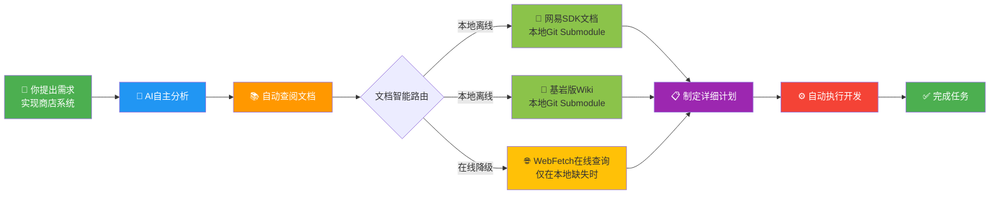
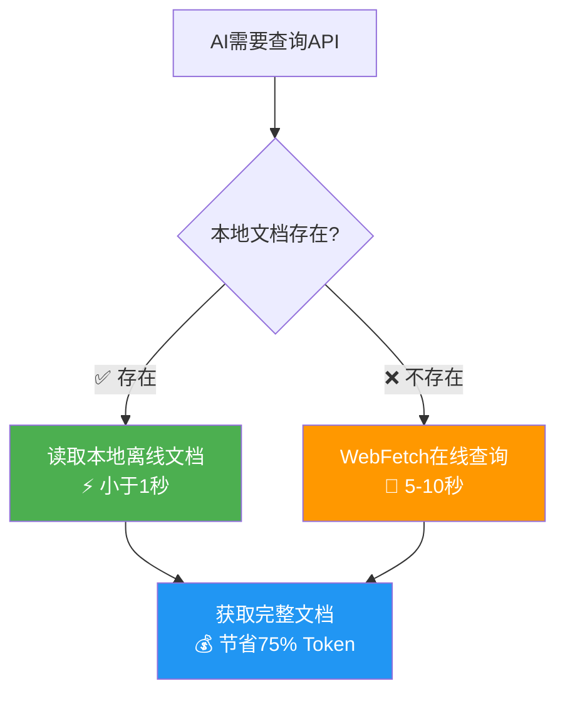
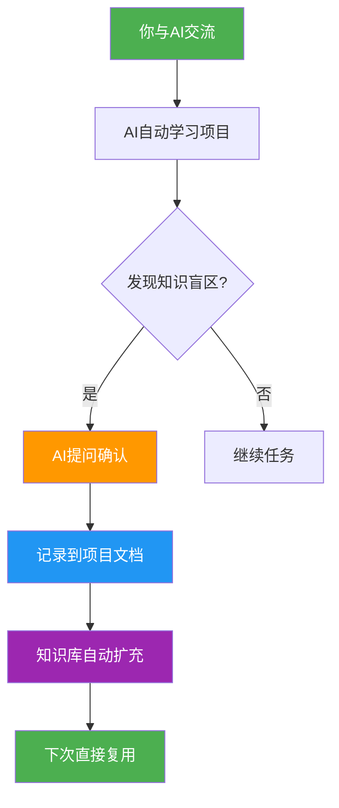

# NeteaseMod-Claude 🤖⚡

<div align="center">

**AI驱动的网易我的世界MODSDK开发工作流**

[](https://github.com/jju666/NeteaseMod-Claude)
[](./LICENSE)
[](https://claude.ai/code)
[](https://nodejs.org)

*让Claude AI成为你的MODSDK开发专家*

[快速开始](#-快速开始) • [核心特性](#-核心特性) • [完整文档](#-完整文档)

</div>

---

## 🌟 **为什么选择 NeteaseMod-Claude?**

<div align="center">

### 🚀 **AI全流程自主开发 - 从需求到实现，完全自动化**

</div>



<div align="center">

| 🎯 核心能力 | 📊 效果 |
|-----------|-------|
| **🔍 自主需求分析** | AI自动拆解任务、识别技术难点 |
| **📚 智能文档查阅** | 自动查阅网易SDK、基岩版Wiki、项目规范 |
| **⚡ 本地离线优先** | 95%场景离线可用，速度提升10倍 |
| **🧠 自学习能力** | 交流越多，AI对你的项目理解越深 |
| **📝 零文档维护** | AI自动更新项目文档，无需手动编写 |

</div>

---

### 💡 **两大核心优势**

<table>
<tr>
<td width="50%">

#### 🚀 **1. 全自动文档查阅 - 本地离线优先**



**性能对比**：
- 🚀 速度：本地 <1秒 vs 在线 5-10秒 (**10倍提升**)
- 💰 成本：本地 ~500 tokens vs 在线 2-3k tokens (**节省75%**)
- 🔌 离线：本地 ✅ 支持 vs 在线 ❌ 需网络

</td>
<td width="50%">

#### 📚 **2. 零维护自学习系统**



**核心机制**：
- 📝 AI自动维护 `markdown/systems/` 文档
- 🧠 每次交流都在积累项目知识
- 🔄 知识复用，越用越智能

</td>
</tr>
</table>

---

### 🎨 **实际开发体验**

<div align="center">

**传统开发流程 vs NeteaseMod-Claude**

</div>

<table>
<tr>
<th width="50%">❌ 传统开发</th>
<th width="50%">✅ NeteaseMod-Claude</th>
</tr>
<tr>
<td>

```
1. 手动搜索API文档 (5-10分钟)
   └─ 打开浏览器 → 搜索 → 查找页面 → 复制代码

2. 编写代码 (20分钟)
   └─ 可能违反规范(双端隔离等)

3. 遇到错误 (30分钟)
   └─ 调试 → 查文档 → 再调试

4. 手动更新文档 (15分钟)
   └─ 整理实现细节 → 记录到文档

总耗时：~70分钟
文档维护负担：重
```

</td>
<td>

```
你："实现商店系统"

AI：
✅ 已查阅：网易SDK文档、基岩版Wiki
✅ 已制定：5步实现计划
✅ 开始执行...
  1. 创建ShopServerSystem ✓
  2. 创建ShopClientSystem ✓
  3. 实现UI交互 ✓
  4. 测试双端通信 ✓
  5. 更新项目文档 ✓

✅ 完成！已自动更新 markdown/systems/ShopSystem.md

总耗时：~2分钟
文档维护负担：零
```

</td>
</tr>
</table>

---

## ✨ 核心特性

### 🎯 零配置，自适应
- **自动项目分析**: 智能识别 Systems、Presets、自定义组件
- **自适应文档生成**: 根据代码复杂度自动生成合适详细度的文档
- **零维护成本**: 通过软连接实现文档自动同步

### 🔗 双层文档架构
- **上游基线 + 项目定制**: 允许升级的同时保护用户定制
- **智能降级**: 软连接 → 只读副本，无权限问题
- **多项目隔离**: 多个项目共用一套工作流，互不干扰

### ⚡ AI 性能优化
- **三级任务分类**: 微任务(<2k tokens) / 标准任务(20-35k) / 复杂任务(50-100k)
- **方案自检机制**: 5项自动检查，减少人工干预
- **专家审核流程**: 2轮修复机制，保证代码质量

### 🎮 6个统一命令体系（v17.1）
- `/mc` - 主命令（任务执行 + 自检 + 审核）
- `/mc-review` - 方案审查与优化建议
- `/mc-perf` - 性能分析与优化
- `/mc-docs` - 文档审计与维护
- `/mc-why` - 代码意图追溯
- `/mc-discover` - 项目结构发现

---

## 🚀 快速开始

### 安装（3步）

1. **克隆仓库**
   ```bash
   git clone --recursive https://github.com/jju666/NeteaseMod-Claude.git
   cd NeteaseMod-Claude
   ```

2. **全局安装**
   ```bash
   npm install
   npm run install-global
   ```

3. **验证安装**
   ```bash
   where initmc  # Windows
   # 或
   which initmc  # Linux/Mac
   ```

**⚠️ Windows用户**: 需要管理员权限或开启开发者模式（用于创建软连接）

---

### 使用（1步）

在您的 MODSDK 项目根目录执行：

```bash
cd /path/to/your/modsdk-project
initmc
```

完成！🎉 现在可以使用 `/mc` 命令开始开发了。

---

## 📚 完整文档

### 核心文档
- **[CLAUDE.md](./CLAUDE.md)** - 完整技术文档（AI助手必读）
- **[快速参考.md](./快速参考.md)** - 工作流快速查询手册
- **[Claude指令参考.md](./Claude指令参考.md)** - Slash Command使用说明

### 用户指南
- [安装指南](./docs/INSTALLATION.md) - 详细安装步骤
- [使用示例](./docs/EXAMPLES.md) - 实际开发案例
- [故障排查](./docs/TROUBLESHOOTING.md) - 常见问题解决

### 开发规范
- [开发规范.md](./markdown/核心工作流文档/开发规范.md) - CRITICAL规范
- [问题排查.md](./markdown/核心工作流文档/问题排查.md) - 已知问题和调试技巧
- [API速查.md](./markdown/概念参考/API速查.md) - 常用API速查表

---

## 🌟 技术亮点

### 性能对比

| 指标 | 本地离线 | 在线查询 | 提升 |
|-----|---------|---------|------|
| **速度** | <1秒 | 5-10秒 | **10倍** |
| **Token成本** | ~500 | 2-3k | **节省75%** |
| **离线可用** | ✅ 支持 | ❌ 需网络 | - |

### 自动化程度：95%

| 操作 | 自动化程度 |
|-----|----------|
| 项目初始化 | ✅ 100% |
| 文档路由 | ✅ 100% |
| 上游同步 | ✅ 95% |
| 规范遵守 | ✅ 90% |

---

## 📊 版本历史

### v17.2.0 (2025-11-12)
- 强化步骤2强制文档查阅机制

### v17.1.0 (2025-11-12)
- 新增方案自检与专家审核流程
- 6个统一Claude命令体系

### v16.3.0 (2025-11-11)
- 清理templates/冗余文档，实现单一真实源

### v16.0.0 (2025-11-05)
- 双层文档架构（上游基线层 + 项目覆盖层）

详见：[CHANGELOG.md](./CHANGELOG.md)

---

## 🤝 贡献指南

欢迎提交Issue和Pull Request！

| 类型 | 说明 | 标签 |
|-----|------|------|
| 🐛 Bug修复 | 修复工作流错误 | `bug` |
| ✨ 新功能 | 添加新工具或优化 | `enhancement` |
| 📚 文档改进 | 完善核心文档 | `documentation` |

---

## 📜 开源协议

本项目采用 [MIT License](./LICENSE)。

**附加条款**：
- 本项目专为**网易我的世界（中国版）MODSDK**设计
- 使用时需遵守[网易MODSDK开发协议](https://mc.163.com/dev/)

---

## 🔗 相关链接

- **GitHub仓库**：https://github.com/jju666/NeteaseMod-Claude
- **问题反馈**：https://github.com/jju666/NeteaseMod-Claude/issues
- **Claude Code官网**：https://claude.ai/code
- **网易MODSDK文档**：https://github.com/EaseCation/netease-modsdk-wiki
- **基岩版Wiki**：https://github.com/Bedrock-OSS/bedrock-wiki

---

<div align="center">

**让AI成为你的MODSDK开发专家** 🤖⚡

Made with ❤️ by NeteaseMod-Claude Contributors

*Powered by [Claude Code](https://claude.ai/code)*

</div>
