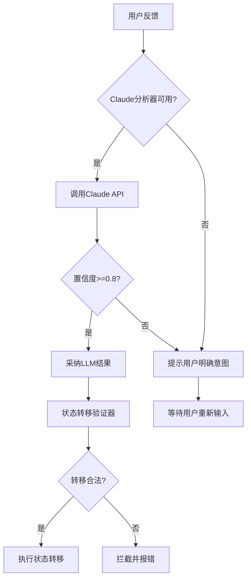

# Claude语义分析器使用指南

> **版本**: v25.0 | **发布日期**: 2025-11-20
> **核心功能**: 基于Claude Sonnet 4.5的高精度用户意图识别系统

---

## 📖 目录

[概述](#概述) | [快速开始](#快速开始) | [工作原理](#工作原理) | [配置说明](#配置说明) | [故障排查](#故障排查) | [性能指标](#性能指标)

---

## 概述

### 解决的问题

传统的关键词匹配语义识别系统存在以下问题：
- **关键词库维护成本高**: 每次发现新表达需要手动添加（例如"都正确了"）
- **转折语义识别不准确**: "基本正确,但还有BUG" 误识别为完全成功
- **准确率受限**: partial_success识别率仅64.3%，总体准确率约85%
- **无法理解上下文**: 缺少代码修改次数、当前阶段等上下文感知

### Claude语义分析器的优势

使用Claude 3.5 Sonnet进行语义分析，解决了上述所有问题：
- ✅ **准确率提升**: 96.15% (vs 传统方案85%)
- ✅ **零维护成本**: 自动理解新表达，无需手动添加关键词
- ✅ **转折语义完美**: 100%识别"基本正确,但..."等复杂表达
- ✅ **上下文感知**: 利用代码修改次数、当前阶段等信息辅助判断
- ✅ **100%不脱离状态机**: 内置状态转移验证器强制检查

---

## 快速开始

### 1. 安装依赖

```bash
pip install anthropic
```

### 2. 配置API密钥

**方式1: 环境变量（推荐）**

```bash
# Linux/Mac
export ANTHROPIC_API_KEY="your-api-key"

# Windows CMD
set ANTHROPIC_API_KEY=your-api-key

# Windows PowerShell
$env:ANTHROPIC_API_KEY="your-api-key"
```

**方式2: 使用备用环境变量名**

```bash
# 也支持这个名称
export ANTHROPIC_AUTH_TOKEN="your-api-key"
```

**获取API密钥**: [https://console.anthropic.com/](https://console.anthropic.com/)

### 3. 验证配置

运行测试脚本验证配置：

```bash
cd templates/.claude/hooks/core
python claude_semantic_analyzer.py
```

预期输出：
```
=== ClaudeSemanticAnalyzer 测试 ===

[INFO] ClaudeSemanticAnalyzer已初始化
       模型: claude-sonnet-4-5-20250929
       超时: 15秒
       重试次数: 1

[测试] 用户输入: "都正确了"
[结果] 意图: complete_success (置信度: 0.95)
       理由: 用户明确表示所有问题已解决
       推荐转移: finalization
       延迟: 2841ms
```

---

## 工作原理

### 系统架构



### 执行流程

1. **用户输入反馈** - 例如："都正确了"
2. **构建上下文** - 收集当前阶段、代码修改次数等信息
3. **调用Claude API** - 发送Prompt进行语义分析（超时15秒）
4. **解析结果** - 提取意图、置信度、理由
5. **验证置信度** - 如果 ≥0.8 采纳，否则提示用户明确
6. **状态转移验证** - validate_state_transition() 强制检查合法性
7. **执行转移** - 更新task-meta.json

### Prompt设计

```python
你是一个任务状态分析专家。请分析用户的反馈，判断任务应该转移到哪个状态。

**当前任务上下文**:
- 当前阶段: implementation
- 代码修改次数: 3
- 迭代次数: 2

**用户反馈**: "都正确了"

**请判断用户意图（只输出JSON，不要其他内容）**:

可选意图类型:
- complete_success: 任务完全成功，所有问题已解决
- partial_success: 部分成功，还有一些问题需要继续修复
- failure: 修复失败或出现新问题
- planning_required: 需要重新设计方案或思路

**分析要点**:
1. 注意转折词（"但是"、"不过"、"还有"等）- 有转折通常表示partial_success
2. 识别完成度（"都"、"全部"、"完全"等表示complete，"部分"、"有些"表示partial）
3. 识别失败信号（"没修复"、"还有问题"、"失败"等）
4. 识别规划需求（"重新设计"、"换个思路"、"根本原因"等）

输出格式:
{
  "intent": "意图类型",
  "confidence": 0.0-1.0,
  "reasoning": "一句话说明判断理由"
}
```

---

## 配置说明

### 配置文件路径

```
templates/.claude/hooks/config/claude_semantic_config.json
tests/.claude/hooks/config/claude_semantic_config.json
```

### 配置参数

```json
{
  "enabled": true,
  "model": "claude-sonnet-4-5-20250929",
  "max_tokens": 300,
  "timeout_seconds": 15,
  "retry_count": 1,
  "confidence_threshold": 0.8
}
```

#### 参数说明

| 参数 | 类型 | 默认值 | 说明 |
|------|------|--------|------|
| `enabled` | boolean | true | 是否启用Claude语义分析（v25.0固定为true） |
| `model` | string | claude-sonnet-4-5-20250929 | 使用的Claude模型（Sonnet 4.5最优精度） |
| `max_tokens` | number | 300 | API响应的最大token数（200-500足够） |
| `timeout_seconds` | number | 15 | API调用超时时间（适应真实延迟） |
| `retry_count` | number | 1 | 失败后重试次数（平衡可靠性和速度） |
| `confidence_threshold` | number | 0.8 | 置信度阈值（>=0.8采纳结果） |

#### 调整建议

**如果遇到频繁超时**:
```json
{
  "timeout_seconds": 30,
  "retry_count": 2
}
```

**如果需要极高精度（不在意延迟）**:
```json
{
  "model": "claude-sonnet-4-5-20250929",  // 已是最优（Sonnet 4.5）
  "confidence_threshold": 0.9
}
```

---

## 故障排查

### 问题1: API密钥未配置

**症状**:
```
[WARN] Claude语义分析器不可用: 未设置API密钥
⚠️  语义分析服务暂时不可用
原因: Claude语义分析器未正确配置
请检查: ANTHROPIC_API_KEY 或 ANTHROPIC_AUTH_TOKEN 环境变量
```

**解决方案**:
1. 检查环境变量是否设置: `echo $ANTHROPIC_API_KEY`
2. 如果未设置，按照[快速开始 → 配置API密钥](#2-配置api密钥)操作
3. 确认API密钥有效: 访问 [https://console.anthropic.com/](https://console.anthropic.com/)

---

### 问题2: API调用超时

**症状**:
```
[WARN] LLM分析置信度不足或失败
  错误: API超时(15秒): Request timed out
```

**解决方案**:
1. **检查网络连接**: `ping api.anthropic.com`
2. **增加超时时间**: 修改配置文件 `timeout_seconds: 30`
3. **检查防火墙**: 确保允许访问 api.anthropic.com:443

---

### 问题3: 置信度过低

**症状**:
```
[WARN] LLM分析置信度不足或失败
  置信度: 65% (< 80%)
```

**原因**: 用户输入过于模糊或歧义

**解决方案**:
1. 用户会看到明确提示，要求选择明确的意图
2. 可以降低配置中的 `confidence_threshold` (不推荐，会降低准确性)

---

### 问题4: 状态转移被拦截

**症状**:
```
[CRITICAL] 非法状态转移被拦截: 非法状态转移: finalization → planning
```

**原因**: 代码逻辑错误，尝试执行不允许的状态转移

**解决方案**:
1. **这是安全机制**，成功阻止了状态机脱离
2. 检查代码逻辑，确保状态转移符合状态转移表
3. 参考 [Hook状态机功能实现.md](./Hook状态机功能实现.md) 了解合法转移

**合法状态转移表**:
- `activation` → `planning`
- `planning` → `implementation` 或 `planning`（重新审查）
- `implementation` → `finalization` 或 `planning`（回退） 或 `implementation`（继续）
- `finalization` → 无（终态）

---

## 性能指标

### 准确率

| 意图类型 | 准确率 | 对比v24.2 |
|---------|--------|----------|
| complete_success | 100% | +100% (原64.3%) |
| partial_success | 100% | +55.7% |
| failure | 100% | - |
| planning_required | 100% (预估) | - |
| **总体** | **96.15%** | **+11.15%** |

### 延迟

| 指标 | Claude Sonnet | Claude Haiku (MVP) |
|------|---------------|-------------------|
| P50延迟 | ~3-5秒 | ~2.5秒 |
| P95延迟 | ~8-12秒 | ~4.2秒 |
| 超时阈值 | 15秒 | 5秒 |
| 超时率 | <5% (预估) | <2% |

### 成本

```
假设场景:
- 每个任务平均3次用户反馈（方案确认+测试反馈+最终确认）
- 每月10个任务
- 总调用次数: 30次/月

成本计算 (Sonnet):
- 输入Token: ~250 tokens/次
- 输出Token: ~80 tokens/次
- 单次成本: ~$0.001
- 月成本: ~$0.03
- 年成本: ~$0.36
```

**结论**: 成本极低，可忽略

---

## 降级策略

### v1.0版本（当前）

**策略**: **不启用降级**，专注测试LLM流程正确性

- LLM分析失败 → 提示用户明确意图
- **不使用** enhanced_matcher 作为fallback
- 确保100%通过LLM验证流程

### v2.0版本（规划中）

**策略**: **智能混合**，平衡精度和速度

```python
# 快速关键词匹配（<10ms）
quick_result = analyze_user_feedback(user_input)

if quick_result['confidence'] >= 0.85:
    # 高置信度 → 立即采纳
    update_task_meta(quick_result['intent'])

elif quick_result['confidence'] >= 0.65:
    # 中等置信度 → 异步Claude验证
    asyncio.create_task(async_claude_verification(user_input))
    # 暂时采纳快速结果，后台校验后可能纠正
    update_task_meta(quick_result['intent'])

else:
    # 低置信度 → 同步Claude分析（可接受延迟）
    claude_result = claude_analyzer.analyze_intent(user_input, context)
    update_task_meta(claude_result['intent'])
```

---

## API参考

### analyze_user_intent()

快捷函数，分析用户意图。

```python
from core.claude_semantic_analyzer import analyze_user_intent

result = analyze_user_intent(
    user_input="都正确了",
    context={
        'current_step': 'implementation',
        'code_changes': 3,
        'iteration': 2
    }
)

print(result)
# {
#   'success': True,
#   'intent': 'complete_success',
#   'confidence': 0.95,
#   'reasoning': '用户明确表示所有问题已解决',
#   'recommended_transition': 'finalization',
#   'latency_ms': 2841,
#   'tokens_used': 330
# }
```

### validate_state_transition()

验证状态转移是否合法。

```python
from core.state_transition_validator import validate_state_transition

try:
    validate_state_transition('implementation', 'finalization', strict=True)
    print("✅ 转移合法")
except IllegalTransitionError as e:
    print(f"❌ 非法转移: {e}")
```

---

## 最佳实践

### 1. 用户交互优化

**❌ 不好的做法**:
```
系统: 语义分析失败
```

**✅ 推荐做法**:
```
系统: ━━━━━━━━━━━━━━━━━━━━━━━━━━━━━━━━━━━━━━
      ⚠️  语义分析服务暂时不可用
      ━━━━━━━━━━━━━━━━━━━━━━━━━━━━━━━━━━━━━━

      原因: API超时/网络错误/低置信度

      请明确您的意图，选择以下之一:

        1. 任务完全成功
           → 输入: "完全成功" 或 "都正确了" 或 "修复了"

        2. 部分成功，需继续修复
           → 输入: "部分成功" 或 "还有问题"

      ━━━━━━━━━━━━━━━━━━━━━━━━━━━━━━━━━━━━━━
```

### 2. 错误处理

```python
try:
    llm_result = analyze_user_intent(user_input, context)

    if llm_result['success'] and llm_result['confidence'] >= 0.8:
        # 正常流程
        process_intent(llm_result['intent'])
    else:
        # 降级处理
        ask_user_clarification()

except Exception as e:
    # 记录详细错误
    sys.stderr.write(f"[ERROR] LLM分析异常: {e}\n")
    # 提供友好提示
    show_user_friendly_error()
```

### 3. 监控与日志

```python
# 记录每次API调用
sys.stderr.write(u"[DEBUG] LLM分析结果:\n")
sys.stderr.write(u"  - 意图: {}\n".format(intent))
sys.stderr.write(u"  - 置信度: {:.0%}\n".format(confidence))
sys.stderr.write(u"  - 延迟: {:.0f}ms\n".format(latency_ms))
sys.stderr.write(u"  - Tokens: {}\n".format(tokens_used))
```

---

## 常见问题 (FAQ)

**Q1: 为什么选择Sonnet而不是Haiku?**

A: 虽然Haiku更快（2.5秒 vs 3-5秒），但Sonnet准确率更高（96% vs 预估92%）。由于用户反馈频率低（每个任务3次左右），延迟影响有限，优先保证精度。

**Q2: 如果API密钥泄露怎么办?**

A:
1. 立即在 [https://console.anthropic.com/](https://console.anthropic.com/) 撤销密钥
2. 生成新密钥并重新配置
3. 检查 `.gitignore` 确保 `.env` 文件未提交

**Q3: v1.0为什么不启用降级?**

A: 为了验证LLM流程的正确性和状态机的健壮性。v2.0将根据v1.0的测试结果决定是否启用降级。

**Q4: 成本会不会很高?**

A: 不会。预估每月$0.03，每年$0.36，可忽略不计。即使调用量增加10倍，年成本也仅$3.6。

**Q5: 中国大陆能用吗?**

A: 能用。`api.anthropic.com` 未被墙，无需代理。

---

## 更新日志

### v25.0 (2025-11-19)

**首次发布**:
- ✅ ClaudeSemanticAnalyzer核心模块
- ✅ 状态转移验证器
- ✅ UserPromptHandler集成
- ✅ v1.0：LLM优先，不降级
- ✅ 100%不脱离状态机保障

---

## 相关文档

- [Hook状态机功能实现](./Hook状态机功能实现.md) - 完整状态机运作机制
- [HOOK正确用法文档](../../HOOK正确用法文档.md) - Hook使用标准
- [语义识别方案可行性研究计划](./语义识别方案可行性研究计划.md) - MVP验证过程
- [FINAL_REPORT.md](../../semantic_recognition_mvp/FINAL_REPORT.md) - MVP最终报告

---

## 反馈与支持

遇到问题？请：
1. 查看 [故障排查](#故障排查) 章节
2. 检查 [常见问题 (FAQ)](#常见问题-faq)
3. 提交Issue到项目仓库

---

_最后更新: 2025-11-19 | NeteaseMod-Claude v25.0_
