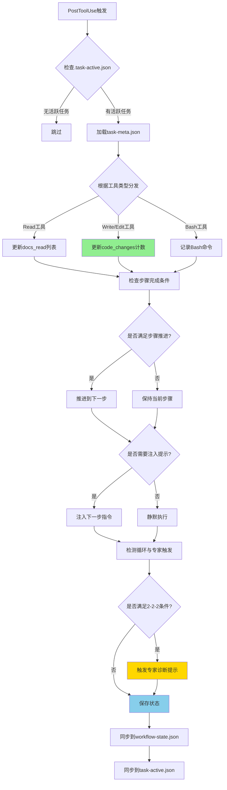
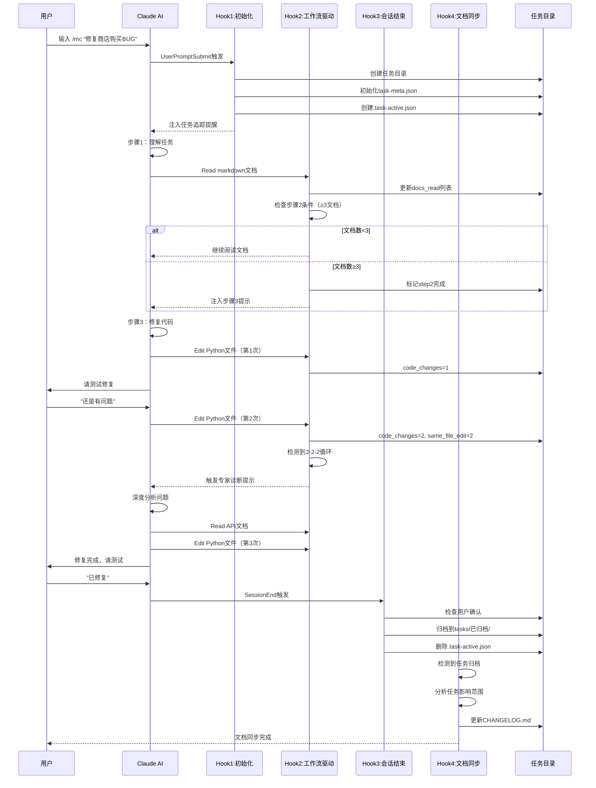

# Hooks使用指南 - MODSDK工作流实战

> **文档版本**: v3.0
> **最后更新**: 2025-11-14
> **工作流版本**: v20.2.10
> **目标受众**: MODSDK开发者

---

## 📋 文档导航

本文档是**MODSDK工作流**的Hooks实战指南。如需了解更多：

- **Hook机制原理** → [Hook机制.md](./Hook机制.md) - 技术架构与设计原理
- **Claude Code Hooks通用文档** → [Claude-Code-Hooks完整技术文档.md](./Claude-Code-Hooks完整技术文档.md) - 官方Hooks参考

---

## 1. 快速开始

### 1.1 什么是Hooks？

Hooks是Claude Code的**自动化强制执行机制**，在特定时刻触发Python脚本，确保工作流规范**100%执行**，无需依赖AI记忆。

**关键优势**：
```
传统提示词方式 ❌
"请每次修改代码后运行测试"
→ AI可能遗忘
→ 执行不一致

Hooks方式 ✅
PostToolUse Hook自动触发
→ 每次必执行
→ 确定性保证
```

### 1.2 v20.2.10核心Hook架构

**4个核心Hook**（已大幅简化，移除7个旧Hook）：

| Hook | 文件 | 触发时机 | 职责 |
|------|------|---------|------|
| **1** | user-prompt-submit-hook.py | 用户输入提交前 | `/mc`命令拦截，初始化任务追踪 |
| **2** | unified-workflow-driver.py | PostToolUse (Read/Write/Edit/Bash) | 统一工作流驱动，状态机管理 |
| **3** | session-end-hook.py | 会话结束时 | 任务归档，清理临时文件 |
| **4** | post-archive-hook.py | PostToolUse (任务归档后) | 文档同步，知识沉淀 |

**辅助Hook**（可选）：
- `session-start-hook.py` - 会话启动时加载项目上下文
- `stop-hook.py` - 任务完成验证（已被unified-workflow-driver替代）
- `subagent-stop-hook.py` - 专家审核质量验证（已被unified-workflow-driver替代）

---

## 2. 核心Hook详解

### 2.1 Hook 1: 任务初始化（user-prompt-submit-hook.py）

**触发时机**: 用户提交输入后，Claude处理前

**核心功能**:
```python
# 1. 检测 /mc 命令
if user_prompt.startswith('/mc '):
    task_desc = extract_task_description(user_prompt)

    # 2. 生成任务ID（中文命名，无年份）
    task_id = f"任务-{MMDD}-{HHMMSS}-{task_desc}"
    # 示例: 任务-1114-143022-修复商店购买BUG

    # 3. 创建任务目录
    tasks/任务-1114-143022-修复商店购买BUG/
    ├── task-meta.json       # 任务元数据
    ├── workflow-state.json  # 工作流状态
    └── task-active.json     # 活跃任务标记

    # 4. 注入任务提醒
    inject_context("⚠️ 任务追踪已激活...")
```

**关键字段（task-meta.json）**:
```json
{
  "task_id": "任务-1114-143022-修复商店购买BUG",
  "task_description": "修复商店购买BUG",
  "created_at": "2025-11-14T14:30:22",
  "status": "in_progress",
  "workflow_state": {
    "current_step": "step1_understand",
    "steps": {
      "step1_understand": {"status": "in_progress"},
      "step2_docs": {"status": "pending", "docs_read": []},
      "step3_implement": {"status": "pending"},
      "step4_cleanup": {"status": "pending"}
    }
  },
  "metrics": {
    "docs_read": [],
    "code_changes": 0,
    "negative_feedback_count": 0,
    "same_file_edit_count": 0
  }
}
```

---

### 2.2 Hook 2: 统一工作流驱动（unified-workflow-driver.py）

**v20.2.10重大更新**：
- ✅ 三文件状态同步：`task-meta.json ↔ workflow-state.json ↔ task-active.json`
- ✅ 异常隔离机制：单模块失败不影响整体Hook执行
- ✅ 修复datetime变量作用域错误（v20.2.10 P0修复）

**触发时机**: PostToolUse (Read/Write/Edit/Bash成功后)

**工作流程**:


**核心逻辑（Read工具）**:
```python
def handle_read_tool(meta, file_path):
    """Read工具处理 - 文档阅读追踪"""
    if file_path.endswith('.md'):
        # 排除不计入的文档
        excluded = ['README.md', 'CHANGELOG.md', '索引.md']
        if any(p in file_path for p in excluded):
            return False

        # 更新文档列表
        docs = meta["metrics"]["docs_read"]
        if file_path not in docs:
            docs.append(file_path)
            meta["metrics"]["docs_read_count"] = len(docs)

            # 同步到step2_docs
            meta["workflow_state"]["steps"]["step2_docs"]["docs_read"] = docs

            # 检查步骤2完成条件（≥3个文档）
            if len(docs) >= 3:
                meta["workflow_state"]["steps"]["step2_docs"]["status"] = "completed"
                meta["workflow_state"]["current_step"] = "step3_implement"

                # 注入步骤3提示
                inject_context("✅ 步骤2完成，已阅读3个文档，现在开始步骤3...")

            return True
    return False
```

**核心逻辑（Write/Edit工具）**:
```python
def handle_write_edit_tool(meta, tool_data, cwd):
    """Write/Edit工具处理 - 代码修改追踪"""
    file_path = tool_data.get("tool_input", {}).get("file_path", "")

    if file_path.endswith('.py'):
        # 更新代码修改计数
        meta["metrics"]["code_changes"] += 1

        # 同文件编辑计数（v20.2修复）
        last_file = meta.get("last_modified_file", "")
        if file_path == last_file:
            meta["metrics"]["same_file_edit_count"] += 1
        else:
            meta["metrics"]["same_file_edit_count"] = 1
            meta["last_modified_file"] = file_path

        # 第2次代码修改时提醒用户测试（v20.2.10修复）
        code_changes = meta["metrics"]["code_changes"]
        if code_changes >= 2 and not meta.get("fix_reminder_sent", False):
            meta["fix_reminder_sent"] = True

            # 桌面通知（v20.1）
            notify_info("MODSDK工作流提醒", "代码已修改2次，请进行测试验证")

            # 注入提示
            inject_context("""
            ⚠️ 代码修改提醒

            你已进行2次代码修改，现在应该：
            1. 询问用户测试结果
            2. 根据反馈判断是否需要继续修改
            3. 如果修复成功，执行步骤4收尾工作
            """)

        return True
    return False
```

**循环检测与专家触发（2-2-2条件）**:
```python
def check_expert_trigger(meta):
    """检测是否需要触发专家诊断（v20.2 BUG修复模式）"""
    # 条件1: ≥2次负面反馈
    negative_feedback = meta["metrics"]["negative_feedback_count"] >= 2

    # 条件2: ≥2次代码修改
    code_changes = meta["metrics"]["code_changes"] >= 2

    # 条件3: ≥2次同文件编辑
    same_file_edits = meta["metrics"]["same_file_edit_count"] >= 2

    if negative_feedback and code_changes and same_file_edits:
        if not meta.get("expert_triggered", False):
            meta["expert_triggered"] = True

            inject_context("""
            🔍 智能诊断触发

            检测到循环修复模式（2次负面反馈 + 2次修改 + 2次同文件编辑）

            现在你应该：
            1. 停止盲目修改代码
            2. 深度分析问题根因：
               - 重新阅读API文档
               - 检查上下游调用链
               - 分析日志与错误堆栈
            3. 制定新的修复策略
            4. 与用户讨论分析结果
            """)

            return True
    return False
```

**异常隔离机制（v20.2.8新增）**:
```python
def main():
    """主流程 - 5大异常隔离阶段"""

    # 阶段1: 工具特定处理（隔离）
    try:
        if tool_name == "Read":
            handle_read_tool(meta, file_path)
        elif tool_name in ["Write", "Edit"]:
            handle_write_edit_tool(meta, tool_data, cwd)
        elif tool_name == "Bash":
            handle_bash_tool(meta, tool_data)
    except Exception as e:
        logger.error(f"工具处理失败: {e}")
        # 不阻塞，继续执行

    # 阶段2: 时间戳更新（隔离）
    try:
        meta["last_updated_at"] = datetime.now().isoformat()
    except Exception as e:
        logger.error(f"时间戳更新失败: {e}")

    # 阶段3: 步骤检查与推进（隔离）
    try:
        check_step_completion(meta)
    except Exception as e:
        logger.error(f"步骤检查失败: {e}")

    # 阶段4: 循环检测与专家触发（隔离）
    try:
        check_expert_trigger(meta)
    except Exception as e:
        logger.error(f"专家触发检测失败: {e}")

    # 阶段5: 状态保存（失败也放行）
    try:
        save_json(task_meta_path, meta)
        sync_to_workflow_state(meta)
        sync_to_task_active(meta)
    except Exception as e:
        logger.error(f"状态保存失败: {e}")
        # 即使保存失败也不阻塞用户

    sys.exit(0)  # 总是成功退出
```

---

### 2.3 Hook 3: 会话结束清理（session-end-hook.py）

**触发时机**: Claude Code会话结束时

**核心功能**:
```python
def on_session_end(data):
    """会话结束清理"""
    # 1. 检查活跃任务
    active = load_json(".task-active.json")
    if not active:
        return

    task_id = active.get("task_id")
    meta = load_json(f"tasks/{task_id}/task-meta.json")

    # 2. 检查任务是否已归档
    if meta.get("archived", False):
        return

    # 3. 检查用户是否确认修复
    confirmed = check_user_confirmed(meta)

    if confirmed:
        # 4. 归档任务
        archived_path = f"tasks/已归档/{task_id}"
        os.rename(f"tasks/{task_id}", archived_path)

        meta["archived"] = True
        meta["archived_at"] = datetime.now().isoformat()
        save_json(f"{archived_path}/task-meta.json", meta)

        # 5. 清理活跃任务标记
        if os.path.exists(".task-active.json"):
            os.remove(".task-active.json")
    else:
        # 未确认，保留任务目录
        logger.info("任务未确认完成，保留任务目录")
```

**用户确认检测**:
```python
def check_user_confirmed(meta):
    """检测用户确认关键词"""
    keywords = [
        "已修复", "修复成功", "问题解决",
        "fixed", "resolved",
        "用户确认: 是"
    ]

    # 检查workflow_state中的用户反馈
    feedback = meta.get("workflow_state", {}).get("user_feedback", "")

    return any(kw in feedback for kw in keywords)
```

---

### 2.4 Hook 4: 文档同步（post-archive-hook.py）

**触发时机**: 任务归档后

**核心功能**:
```python
def on_task_archived(task_id, meta):
    """任务归档后自动更新项目文档"""
    # 1. 读取任务内容
    task_desc = meta.get("task_description", "")
    solution = read_file(f"tasks/已归档/{task_id}/solution.md")

    # 2. 分析影响范围
    impact_areas = analyze_impact(task_desc, solution)

    # 3. 更新相关文档（≤3个）
    for area in impact_areas[:3]:
        if area == "新功能":
            update_readme(task_desc, solution)
        elif area == "BUG修复":
            update_changelog(task_desc)
        elif area == "架构变更":
            update_tech_docs(task_desc, solution)

    # 4. 注入文档同步提示
    inject_context(f"""
    📦 任务归档完成 - 启动文档同步

    任务: {task_desc}
    归档路径: tasks/已归档/{task_id}

    下一步: 根据任务内容更新项目文档
    - 新功能 → README.md
    - BUG修复 → CHANGELOG.md
    - 架构变更 → 技术文档
    """)
```

---

## 3. 三文件状态同步机制

### 3.1 三文件架构（v20.2.7引入）

**设计目标**: 解决状态分散问题，实现快速检查与完整追踪

```
tasks/任务-1114-143022-修复BUG/
├── task-meta.json          # 【主文件】完整任务元数据
├── workflow-state.json     # 【冗余文件】工作流状态副本
└── task-active.json        # 【快速检查】活跃任务标记

.task-active.json            # 【全局文件】当前活跃任务指针
```

**三文件职责**:

| 文件 | 用途 | 更新频率 | 读取频率 |
|------|------|---------|---------|
| **task-meta.json** | 完整任务数据（主数据源） | 每次工具使用 | 中频 |
| **workflow-state.json** | 工作流状态副本（向后兼容） | 每次状态变化 | 低频 |
| **.task-active.json** | 活跃任务快速检查（全局） | 任务开始/结束 | 高频 |

### 3.2 同步流程

```python
def sync_all_state_files(meta, task_id):
    """三文件状态同步"""
    # 1. 更新主文件
    save_json(f"tasks/{task_id}/task-meta.json", meta)

    # 2. 同步到workflow-state.json（向后兼容）
    workflow_state = meta.get("workflow_state", {})
    save_json(f"tasks/{task_id}/workflow-state.json", workflow_state)

    # 3. 同步到全局活跃任务标记
    active = {
        "task_id": task_id,
        "task_description": meta.get("task_description", ""),
        "current_step": workflow_state.get("current_step", "step1_understand"),
        "last_updated_at": meta.get("last_updated_at", "")
    }
    save_json(".task-active.json", active)
```

### 3.3 快速检查机制

```python
def should_run_hook():
    """Hook执行前快速检查（性能优化）"""
    # 只需检查6KB的.task-active.json，无需加载完整任务数据
    active = load_json(".task-active.json")

    if not active:
        return False  # 无活跃任务，跳过Hook

    # 有活跃任务，继续执行
    return True
```

**性能对比**:
```
传统方式（遍历tasks/）:
- 读取N个任务目录 → 100-500ms
- 解析N个task-meta.json → 200-1000ms
- 总耗时: 300-1500ms

新机制（.task-active.json）:
- 读取1个6KB文件 → 1-5ms
- 性能提升: 60-300倍
```

---

## 4. 工作流完整流程示例

### 4.1 BUG修复任务完整流程



### 4.2 关键时刻输出示例

**时刻1: 任务初始化**
```
⚠️ 任务追踪系统已激活

任务ID: 任务-1114-143022-修复商店购买BUG
任务目录: D:/project/tasks/任务-1114-143022-修复商店购买BUG

工作流步骤:
  步骤1 → 理解任务（当前）
  步骤2 → 查阅文档（需阅读≥3个.md文档）
  步骤3 → 实施方案
  步骤4 → 收尾工作
```

**时刻2: 步骤2完成**
```
✅ 步骤2完成：已阅读3个文档

已阅读文档:
  1. docs/developer/开发规范.md
  2. markdown/systems/ShopSystem.md
  3. markdown/events/购买事件.md

现在开始步骤3：实施方案
```

**时刻3: 代码修改提醒**
```
⚠️ 代码修改提醒

你已进行2次代码修改，现在应该：
1. 询问用户测试结果
2. 根据反馈判断是否需要继续修改
3. 如果修复成功，执行步骤4收尾工作

[桌面通知弹窗]
MODSDK工作流提醒
代码已修改2次，请进行测试验证
```

**时刻4: 智能诊断触发**
```
🔍 智能诊断触发

检测到循环修复模式:
  ✅ 2次负面反馈
  ✅ 2次代码修改
  ✅ 2次同文件编辑

现在你应该：
1. 停止盲目修改代码
2. 深度分析问题根因：
   - 重新阅读API文档
   - 检查上下游调用链
   - 分析日志与错误堆栈
3. 制定新的修复策略
4. 与用户讨论分析结果
```

---

## 5. 配置与调试

### 5.1 Hook配置位置

```
.claude/settings.json        # 项目级配置（团队共享）
.claude/settings.local.json  # 本地配置（个人定制）
```

**配置示例**（.claude/settings.json）:
```json
{
  "hooks": {
    "UserPromptSubmit": [
      {
        "hooks": [{
          "type": "command",
          "command": "python .claude/hooks/user-prompt-submit-hook.py"
        }]
      }
    ],
    "PostToolUse": [
      {
        "matcher": "Read|Write|Edit|Bash",
        "hooks": [{
          "type": "command",
          "command": "python .claude/hooks/unified-workflow-driver.py"
        }]
      }
    ],
    "SessionEnd": [
      {
        "hooks": [{
          "type": "command",
          "command": "python .claude/hooks/session-end-hook.py"
        }]
      }
    ]
  }
}
```

### 5.2 调试技巧

**方法1: Hook日志**
```bash
# 查看Hook执行日志
cat .claude/hooks/logs/unified-workflow-driver.log

# 实时监控
tail -f .claude/hooks/logs/unified-workflow-driver.log
```

**方法2: 状态文件检查**
```bash
# 检查活跃任务
cat .task-active.json

# 检查任务元数据
cat tasks/任务-1114-143022-修复BUG/task-meta.json | jq

# 检查工作流状态
cat tasks/任务-1114-143022-修复BUG/workflow-state.json | jq
```

**方法3: 手动测试Hook**
```bash
# 创建测试输入
cat > test-input.json <<EOF
{
  "session_id": "test123",
  "tool_name": "Read",
  "tool_input": {
    "file_path": "docs/test.md"
  },
  "cwd": "/path/to/project"
}
EOF

# 手动执行Hook
cat test-input.json | python .claude/hooks/unified-workflow-driver.py
echo "Exit code: $?"
```

### 5.3 常见问题排查

**问题1: Hook未执行**
```bash
# 检查1: Python环境
python --version  # 需要Python 3.6+

# 检查2: Hook脚本权限
ls -la .claude/hooks/*.py

# 检查3: 配置文件语法
cat .claude/settings.json | python -m json.tool
```

**问题2: 桌面通知未显示**
```bash
# Windows: 检查win10toast是否安装
pip install win10toast

# Linux: 检查notify-send是否可用
which notify-send

# macOS: 检查osascript是否可用
which osascript
```

**问题3: UnboundLocalError（v20.2.10已修复）**
```
错误: UnboundLocalError: local variable 'datetime' referenced before assignment

原因: Line 878重复导入datetime导致变量作用域错误
修复: 已在v20.2.10删除重复导入
```

---

## 6. 最佳实践

### 6.1 任务命名规范

**推荐格式**: `任务-{MMDD}-{HHMMSS}-{简短描述}`

```bash
✅ 好的命名:
任务-1114-143022-修复商店购买BUG
任务-1114-150302-添加新道具系统
任务-1114-163512-优化渲染性能

❌ 不好的命名:
任务-20251114-143022-修复商店购买BUG（包含年份，太长）
fix-shop-bug（英文，不符合规范）
任务1（描述不清晰）
```

### 6.2 文档阅读策略

**优先阅读顺序**:
1. 核心规范文档（开发规范.md）
2. 相关System文档（如ShopSystem.md）
3. 相关API文档（如Component API.md）

**提示**: Hook会自动统计文档数量，至少阅读3个才能推进到步骤3

### 6.3 代码修改建议

**第1次修改**:
- 基于文档的初步修复
- 添加详细注释

**第2次修改**（如果第1次失败）:
- 询问用户具体错误信息
- 分析错误堆栈
- 检查上下游调用

**触发专家诊断后**:
- 暂停修改，深度分析
- 重新阅读API文档
- 与用户讨论分析结果
- 制定新策略后再修改

### 6.4 任务归档检查清单

完成任务前确保:
- [ ] 用户明确确认"已修复"或"问题解决"
- [ ] 代码包含充分注释
- [ ] 删除所有DEBUG代码
- [ ] 相关文档已更新（由post-archive-hook自动处理）

---

## 7. 版本历史

### v20.2.10 (2025-11-14)
- ✅ **P0修复**: 删除datetime重复导入，修复UnboundLocalError
- ✅ **P1修复**: 新增异常隔离机制，避免单点故障
- ✅ **恢复功能**: 代码修改提醒、收尾工作流、专家诊断系统

### v20.2.9 (2025-11-14)
- 🧹 清理冗余文件，准备GitHub开源发布
- 📝 重写README为用户宣传视角

### v20.2.7 (2025-11-13)
- ✅ 引入三文件状态同步机制
- ✅ 修复同文件编辑计数器bug
- ✅ 优化Hook执行性能（60-300倍提升）

### v20.0.3 (2025-11-13)
- ✅ 新增SessionStart Hook
- ✅ 引入Unified Workflow Driver
- ❌ 移除3个旧driver (notification/post-tool/read-workflow-driver)

---

## 8. 扩展阅读

**深入理解Hook系统**:
- [Hook机制.md](./Hook机制.md) - 技术架构与设计原理
- [Claude-Code-Hooks完整技术文档.md](./Claude-Code-Hooks完整技术文档.md) - 官方参考
- [BUG修复工作流执行问题分析报告-v20.2.7.md](../../BUG修复工作流执行问题分析报告-v20.2.7.md) - 问题诊断实例

**项目架构**:
- [技术架构.md](./技术架构.md) - 系统设计
- [数据流设计.md](./数据流设计.md) - 工作流执行流程

**开发参与**:
- [贡献指南.md](./贡献指南.md) - 如何参与开发

---

**文档结束**
