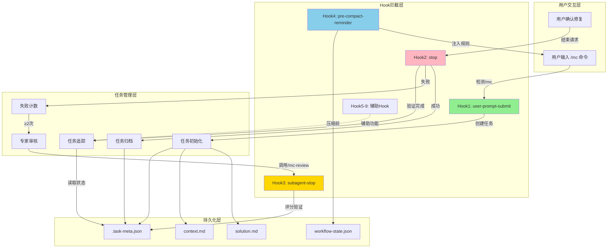
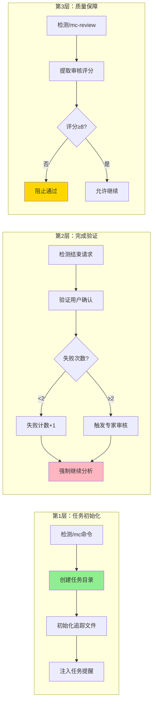
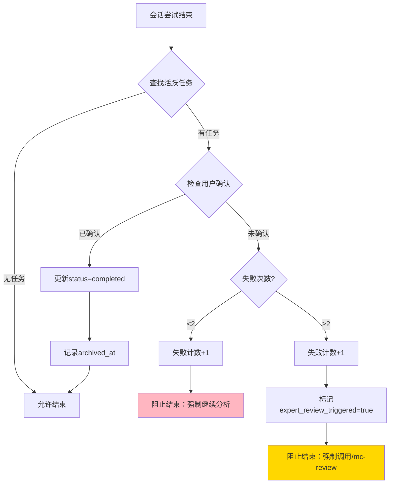
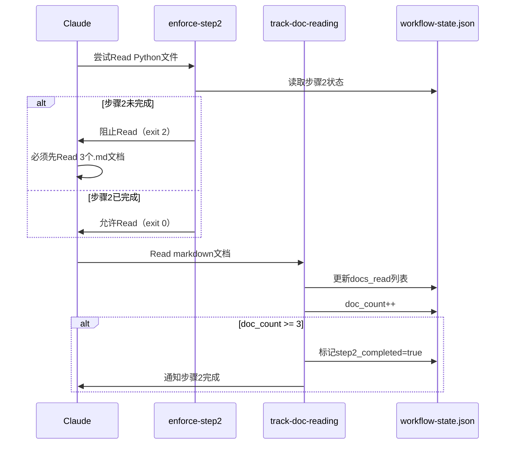
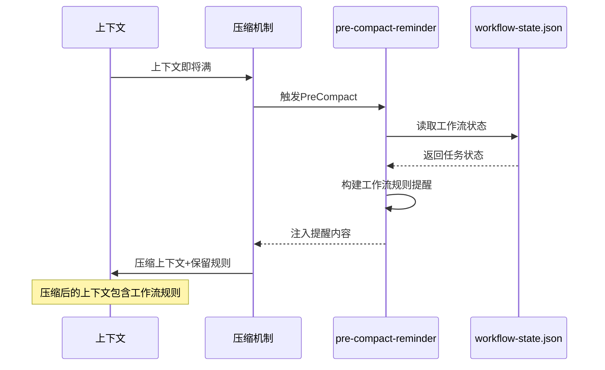
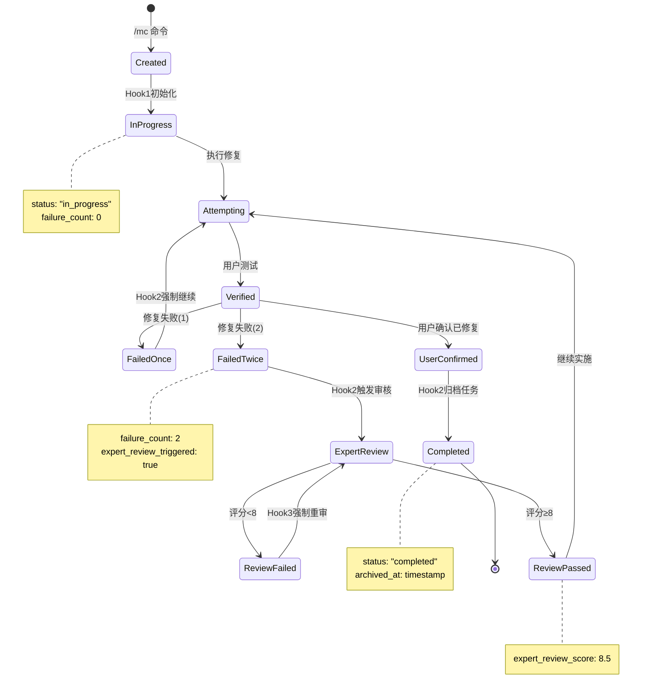
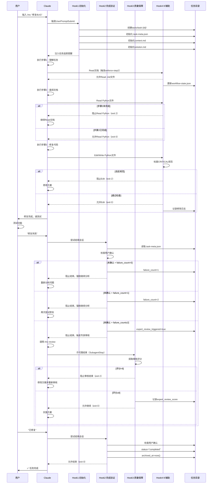
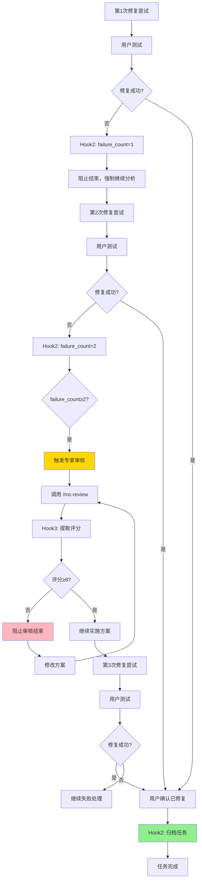
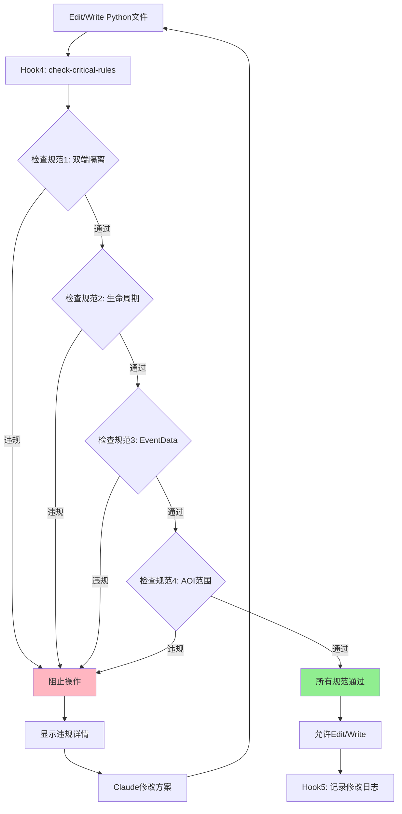

# Hook机制完整技术文档

> **文档版本**: v1.0
> **最后更新**: 2025-11-13
> **工作流版本**: v18.4.0
> **作者**: NeteaseMod-Claude Workflow Team

---

## 📋 目录

1. [Hook系统概述](#1-hook系统概述)
2. [多层Hook执行力系统架构](#2-多层hook执行力系统架构)
3. [Hook脚本详解](#3-hook脚本详解)
4. [任务隔离机制](#4-任务隔离机制)
5. [上下文恢复机制](#5-上下文恢复机制)
6. [Hook执行流程](#6-hook执行流程)
7. [配置方法](#7-配置方法)
8. [故障排查](#8-故障排查)

---

## 1. Hook系统概述

### 1.1 什么是Hook系统？

Hook系统是MODSDK工作流的**核心强制执行机制**，通过在Claude Code生命周期的特定时刻自动触发Python脚本，实现：

- **100%工作流强制执行**：不依赖AI记忆，确保规范始终生效
- **任务全生命周期追踪**：从初始化到完成的完整记录
- **质量保障系统**：多重验证确保方案质量≥8分
- **任务隔离与恢复**：上下文压缩后自动恢复工作状态

### 1.2 核心设计原则

| 原则 | 说明 | 实现方式 |
|------|------|---------|
| **确定性执行** | 不依赖AI判断，规则必须执行 | Python脚本 + exit code强制 |
| **任务隔离** | 每个任务独立目录，互不干扰 | `tasks/task-{timestamp}/` 结构 |
| **状态持久化** | 任务状态保存在JSON文件 | `.task-meta.json` 机器可读 |
| **失败重试机制** | 失败后强制继续分析 | 失败计数器 + 阻塞机制 |
| **质量门槛** | 专家审核<8分不允许通过 | SubagentStop Hook验证 |

### 1.3 Hook系统架构图



---

## 2. 多层Hook执行力系统架构

### 2.1 三层核心Hook



### 2.2 六层辅助Hook

| Hook | 文件 | 触发时机 | 职责 |
|------|------|---------|------|
| **Hook 4** | `check-critical-rules.py` | PreToolUse (Edit/Write) | 检测4项CRITICAL规范违规 |
| **Hook 5** | `log-changes.py` | PostToolUse (Edit/Write) | 自动记录修改日志 |
| **Hook 6** | `enforce-step2.py` | PreToolUse (Read) | 强制步骤2文档查阅 |
| **Hook 7** | `track-doc-reading.py` | PostToolUse (Read) | 追踪文档阅读进度 |
| **Hook 8** | `enforce-cleanup.py` | Stop | 强制收尾工作验证 |
| **Hook 9** | `pre-compact-reminder.py` | PreCompact | 上下文压缩前注入规则 |

### 2.3 Hook执行优先级

```
1. PreToolUse Hooks（最高优先级）
   ├─ check-critical-rules.py (CRITICAL规范检查)
   ├─ enforce-step2.py (步骤2强制执行)
   └─ user-prompt-submit-hook.py (/mc命令检测)

2. PostToolUse Hooks
   ├─ track-doc-reading.py (文档阅读追踪)
   └─ log-changes.py (修改日志记录)

3. Stop Hooks
   ├─ stop-hook.py (任务完成验证)
   └─ enforce-cleanup.py (收尾工作验证)

4. SubagentStop Hooks
   └─ subagent-stop-hook.py (专家审核质量验证)

5. PreCompact Hooks（最低优先级）
   └─ pre-compact-reminder.py (上下文恢复)
```

---

## 3. Hook脚本详解

### 3.1 Hook 1: 任务初始化拦截器

**文件**: `user-prompt-submit-hook.py`

**触发时机**: 用户提交提示词后，Claude处理前

**核心职责**:

```python
# 1. 检测 /mc 命令
if user_prompt.startswith('/mc '):
    task_desc = extract_task_description(user_prompt)
    task_id = generate_task_id()  # 任务-1113-143022-修复商店购买BUG

    # 2. 创建任务目录结构（中文命名，无年份）
    tasks/
    └── 任务-1113-143022-修复商店购买BUG/
        ├── .task-meta.json      # 机器可读元数据
        ├── context.md           # 任务上下文（人类可读）
        └── solution.md          # 解决方案记录

    # 3. 初始化元数据
    {
        "task_id": "任务-1113-143022-修复商店购买BUG",
        "task_description": "修复商店购买BUG",
        "created_at": "2025-11-13T14:30:22",
        "status": "in_progress",
        "failure_count": 0,
        "failure_history": [],
        "expert_review_triggered": false,
        "expert_review_score": null,
        "user_confirmed_fixed": false,
        "archived_at": null
    }

    # 4. 注入任务追踪提醒（显示给Claude）
    inject_context("""
    ⚠️ 任务追踪系统已激活
    任务ID: 任务-1113-143022-修复商店购买BUG
    必须在 tasks/任务-1113-143022-修复商店购买BUG/context.md 中记录工作
    """)
```

**实现细节**:

- **命令检测**: 精确匹配 `/mc ` 前缀（注意空格）
- **任务ID生成**: `任务-{MMDD-HHMMSS}-{任务描述}` 格式（中文命名，无年份），更简洁易读
- **模板初始化**: 预填充工作流步骤模板（步骤1→2→2.5→3）
- **上下文注入**: 通过 `injectedContext` 字段发送给Claude

**关键代码片段**:

```python
# 检测 /mc 命令
if not user_prompt.strip().startswith('/mc '):
    sys.exit(0)  # 非 /mc 命令，放行

# 生成任务ID
task_id = "task-{}".format(datetime.now().strftime('%Y%m%d-%H%M%S'))

# 创建任务目录
task_dir = os.path.join(cwd, 'tasks', task_id)
ensure_dir(task_dir)

# 输出控制JSON（注入提醒）
output = {
    "continue": True,
    "injectedContext": reminder_message
}
print(json.dumps(output, ensure_ascii=False))
```

---

### 3.2 Hook 2: 完成验证与重试强制

**文件**: `stop-hook.py`

**触发时机**: 会话结束前（Claude完成响应时）

**核心职责**:

```python
# 1. 查找最新活跃任务
task = find_active_task()  # status == "in_progress"

# 2. 检查用户确认关键词
confirmed = check_user_confirmed(task.context_md)
# 关键词: "已修复", "修复成功", "问题解决", "fixed", "resolved", "用户确认: 是"

# 3. 未确认 → 阻止结束
if not confirmed:
    failure_count += 1

    if failure_count >= 2:
        # 触发专家审核
        expert_review_triggered = True
        block_with_message("必须调用 /mc-review 专家审核")
    else:
        # 强制继续分析
        block_with_message("必须重新分析问题")

    exit(2)  # 阻止会话结束

# 4. 已确认 → 归档任务
else:
    task.status = "completed"
    task.archived_at = now()
    exit(0)  # 允许会话结束
```

**失败处理流程图**:



**关键代码片段**:

```python
# 检查用户确认
keywords = [u'已修复', u'修复成功', u'问题解决', 'fixed', 'resolved', u'用户确认: 是']
for keyword in keywords:
    if keyword in context_content:
        return True

# 失败处理
if failure_count >= 2 and not meta.get('expert_review_triggered', False):
    meta['expert_review_triggered'] = True
    message = """
    ❌ 已失败2次，触发专家审核流程！
    你必须立即调用 /mc-review 命令审查当前方案
    """
    output = {"continue": False, "stopReason": "task_incomplete", "injectedContext": message}
    print(json.dumps(output, ensure_ascii=False))
    sys.exit(2)  # 阻止结束
```

---

### 3.3 Hook 3: 专家审核质量保障

**文件**: `subagent-stop-hook.py`

**触发时机**: 子代理（如 `/mc-review`）结束时

**核心职责**:

```python
# 1. 拦截 /mc-review 审核结果
if '/mc-review' not in subagent_task:
    sys.exit(0)

# 2. 提取审核评分（正则匹配）
patterns = [
    r'\*\*总分\*\*[:\s]*(\d+(?:\.\d+)?)\s*/\s*10',
    r'总分[:\s]*(\d+(?:\.\d+)?)\s*/\s*10',
    r'Score[:\s]*(\d+(?:\.\d+)?)\s*/\s*10'
]
score = extract_score(subagent_output, patterns)

# 3. 评分 < 8分 → 阻止审核结束
if score < 8.0:
    update_metadata(expert_review_score=score)
    block_with_message(f"""
    ❌ 专家审核评分过低: {score}/10
    评分<8分，方案质量不合格！

    你必须:
    1. 仔细阅读审核报告中的"严重问题"和"优化建议"
    2. 根据建议修改方案
    3. 重新执行 /mc-review 审查修改后的方案
    4. 直到评分≥8分才能继续实施
    """)
    exit(2)

# 4. 评分 ≥ 8分 → 允许继续
else:
    update_metadata(expert_review_score=score)
    exit(0)
```

**评分提取示例**:

| 格式 | 正则表达式 | 示例 |
|------|-----------|------|
| `**总分**: X/10` | `\*\*总分\*\*[:\s]*(\d+(?:\.\d+)?)\s*/\s*10` | `**总分**: 8.5/10` |
| `总分: X/10` | `总分[:\s]*(\d+(?:\.\d+)?)\s*/\s*10` | `总分: 7.2/10` |
| `Score: X/10` | `Score[:\s]*(\d+(?:\.\d+)?)\s*/\s*10` | `Score: 9/10` |

**质量门槛机制**:

```mermaid
graph TD
    A[/mc-review 审核结束] --> B[提取审核评分]
    B --> C{评分提取成功?}
    C -->|否| D[放行 + 警告]
    C -->|是| E{评分≥8?}

    E -->|否| F[更新元数据: score={x}]
    F --> G[阻止结束: exit 2]
    G --> H[强制修改方案]
    H --> I[重新调用/mc-review]
    I --> A

    E -->|是| J[更新元数据: score={x}]
    J --> K[允许继续: exit 0]
    K --> L[实施方案]

    style G fill:#FFD700
    style K fill:#90EE90
```

---

### 3.4 Hook 4: CRITICAL规范检查

**文件**: `check-critical-rules.py`

**触发时机**: PreToolUse（Edit/Write之前）

**核心职责**:

检查4项CRITICAL规范，发现违规时阻止操作：

1. **双端隔离原则**: 禁止跨端GetSystem
   ```python
   # 检测逻辑
   if re.search(r'class\s+\w+\s*\(\s*ServerSystem\s*\)', code):
       if re.search(r'GetSystem\s*\(\s*["\'].*Client.*System["\']', code):
           violations.append("规范1: 服务端尝试获取客户端System（禁止）")
   ```

2. **System生命周期限制**: 禁止在`__init__`中调用MODSDK API
   ```python
   init_match = re.search(r'def\s+__init__\s*\([^)]*\):(.{0,1000})', code)
   if init_match:
       api_calls = re.findall(r'(CreateComponent|ListenForEvent)', init_match.group(1))
       if api_calls and not re.search(r'self\.Create\s*\(\s*\)', init_match.group(1)):
           violations.append("规范2: __init__中调用API但未调用self.Create()")
   ```

3. **EventData序列化限制**: 禁止使用tuple类型
   ```python
   notify_matches = re.finditer(r'(NotifyToClient|NotifyToServer)\s*\([^)]+\)', code)
   for match in notify_matches:
       if re.search(r'\(\s*\d+\s*,\s*\d+\s*\)', match.group(0)):
           violations.append("规范3: NotifyTo参数可能包含tuple（应使用list）")
   ```

4. **AOI范围限制**: 禁止AOI范围超过2000格
   ```python
   aoi_matches = re.finditer(r'(AddAoi|CreateAoi)\s*\(([^)]+)\)', code)
   for match in aoi_matches:
       numbers = re.findall(r'\b(\d{4,})\b', match.group(2))
       for num in numbers:
           if int(num) > 2000:
               violations.append(f"规范4: AOI范围超过2000格: {num}")
   ```

**阻断输出示例**:

```json
{
  "continue": false,
  "decision": "block",
  "reason": "❌ 检测到CRITICAL规范违规，操作已阻断\n[1] 规范1: 双端隔离原则 - 服务端尝试获取客户端System\n[2] 规范4: AOI范围超过2000格: 3000\n\n📚 请查阅: .claude/core-docs/核心工作流文档/开发规范.md"
}
```

---

### 3.5 Hook 5: 修改日志自动记录

**文件**: `log-changes.py`

**触发时机**: PostToolUse（Edit/Write成功后）

**核心职责**:

自动记录所有文件修改到 `tasks/{task_id}/change-log.md`

```python
# 记录修改
log_entry = f"""
## [{timestamp}] {change_type}

**文件**: `{file_path}`
**操作**: {tool_name}
**变更**: +{added} 字符, -{removed} 字符

---
"""

# 追加到日志文件
with open(f"{task_dir}/change-log.md", "a") as f:
    f.write(log_entry)
```

**日志示例**:

```markdown
# 任务修改日志

> 本文件由 `log-changes.py` Hook 自动生成

## [2025-11-13 14:32:15] 修改

**文件**: `/path/to/file.py`
**操作**: Edit
**变更**: +120 字符, -45 字符

---

## [2025-11-13 14:35:22] 创建/覆盖

**文件**: `/path/to/new_file.py`
**操作**: Write
**变更**: +350 字符, -0 字符

---
```

---

### 3.6 Hook 6-7: 步骤2强制执行

**文件**: `enforce-step2.py` + `track-doc-reading.py`

**核心机制**: 两个Hook协同工作



**enforce-step2.py核心逻辑**:

```python
# 1. 只拦截Read工具
if tool_name != 'Read':
    sys.exit(0)

# 2. 如果不是Python文件，允许读取
if not file_path.endswith('.py'):
    sys.exit(0)

# 3. 检查步骤2完成状态
state = load_workflow_state()
if state['steps_completed']['step2_doc_reading'] and state['steps_completed']['step2_doc_count'] >= 3:
    sys.exit(0)  # 允许Read Python

# 4. 步骤2未完成，拒绝Read Python
denial_message = """
⚠️ 步骤2未完成，禁止Read Python代码

已Read文档数量: {doc_count} / 3 (最低要求)

你必须先完成步骤2:
1. 强制要求: 至少Read 3个markdown文档
2. 禁止行为: 在此步骤Search/Read Python代码文件
"""
output = {"permissionDecision": "deny", "reason": denial_message}
print(json.dumps(output), file=sys.stderr)
sys.exit(2)  # 阻止Read
```

**track-doc-reading.py核心逻辑**:

```python
# 1. 只追踪Read工具
if tool_name != 'Read':
    sys.exit(0)

# 2. 只追踪.md文件
if not file_path.endswith('.md'):
    sys.exit(0)

# 3. 排除不应计入的文档
excluded = ['README.md', '索引.md', 'CHANGELOG.md']
if any(pattern in file_path for pattern in excluded):
    sys.exit(0)

# 4. 更新docs_read列表（去重）
state = load_workflow_state()
if file_path not in state['docs_read']:
    state['docs_read'].append(file_path)

# 5. 更新文档计数
doc_count = len(state['docs_read'])
state['steps_completed']['step2_doc_count'] = doc_count

# 6. 如果文档数≥3，自动标记步骤2完成
if doc_count >= 3 and not state['steps_completed']['step2_doc_reading']:
    state['steps_completed']['step2_doc_reading'] = True
    state['current_step'] = 3
    print(f"✅ 步骤2完成：已阅读{doc_count}个文档")

save_workflow_state(state)
```

---

### 3.7 Hook 8: 收尾工作强制验证

**文件**: `enforce-cleanup.py`

**触发时机**: Stop（会话结束前）

**核心职责**:

```python
# 检查收尾工作完成状态
state = load_workflow_state()
cleanup_completed = state['steps_completed']['cleanup_completed']

if not cleanup_completed:
    # 阻止停止
    denial_message = """
    ⚠️ 任务未完成，请完成收尾工作

    📋 收尾清单 (用户明确"已修复"后才执行):

    1. 📝 文档更新（自动补充≤2个文档）
    2. 🧹 DEBUG清理（搜索并删除所有DEBUG代码）
    3. 📦 任务归档（移动到tasks/completed/）

    完成所有收尾工作后，执行以下命令标记完成:
    state['steps_completed']['cleanup_completed'] = True
    """
    output = {"decision": "block", "reason": denial_message}
    print(json.dumps(output), file=sys.stderr)
    sys.exit(2)

# 允许停止
sys.exit(0)
```

---

### 3.8 Hook 9: 上下文恢复机制

**文件**: `pre-compact-reminder.py`

**触发时机**: PreCompact（上下文压缩前）

**核心职责**:

在上下文压缩前，注入工作流规则和任务状态，确保压缩后AI仍记得工作流要求。

```python
# 1. 读取工作流状态
state = load_workflow_state()

# 2. 构建工作流规则提醒
reminder = f"""
━━━━━━━━━━━━━━━━━━━━━━━━━━━━━━━━━━━━━━
⚠️ 上下文压缩警告: 工作流状态恢复
━━━━━━━━━━━━━━━━━━━━━━━━━━━━━━━━━━━━━━

**当前任务**: {task_desc}
**当前步骤**: 步骤{current_step}

**步骤完成状态**:
- 步骤2（文档查阅）: {"✅ 已完成" if step2_completed else f"❌ 未完成 ({doc_count}/3 文档)"}
- 收尾工作: {"✅ 已完成" if cleanup_completed else "❌ 未完成"}

**已读取的文档** ({doc_count}个):
{chr(10).join([f"  - {doc}" for doc in docs_read[:5]])}

━━━━━━━━━━━━━━━━━━━━━━━━━━━━━━━━━━━━━━
**核心规则** (无论上下文如何压缩，必须遵守):
━━━━━━━━━━━━━━━━━━━━━━━━━━━━━━━━━━━━━━

1. **步骤2必须完成**: Read ≥3个.md文档 (Hook会强制检查)
2. **禁止跳过步骤2**: Hook会阻止在步骤2完成前Read Python代码
3. **收尾工作必须完成**: 文档更新、DEBUG清理、任务归档
4. **CRITICAL规范检查** (4项强制规范)

━━━━━━━━━━━━━━━━━━━━━━━━━━━━━━━━━━━━━━
⚠️ **重要提醒**: 上述规则由Hook强制执行，违反规则会被阻止！
━━━━━━━━━━━━━━━━━━━━━━━━━━━━━━━━━━━━━━
"""

# 3. 输出提醒内容（注入到上下文）
print(reminder)
sys.exit(0)
```

**上下文恢复流程**:



---

## 4. 任务隔离机制

### 4.1 任务目录结构

每个 `/mc` 任务都拥有独立的任务目录，确保任务间互不干扰：

```
tasks/
├── 任务-1113-143022-修复商店购买BUG/  # 任务1（中文命名，无年份）
│   ├── .task-meta.json                # 机器可读元数据
│   ├── context.md                     # 任务上下文（人类可读）
│   ├── solution.md                    # 解决方案记录
│   └── change-log.md                  # 修改日志（自动生成）
│
├── 任务-1113-151045-添加新功能/       # 任务2（中文命名，无年份）
│   ├── .task-meta.json
│   ├── context.md
│   ├── solution.md
│   └── change-log.md
│
└── 任务-1113-163512-性能优化/         # 任务3（中文命名，无年份）
    ├── .task-meta.json
    ├── context.md
    ├── solution.md
    └── change-log.md
```

### 4.2 任务元数据结构

**文件**: `tasks/{task_id}/.task-meta.json`

```json
{
  "task_id": "任务-1113-143022-修复商店购买BUG",
  "task_description": "修复商店购买BUG",
  "created_at": "2025-11-13T14:30:22",
  "status": "in_progress",
  "failure_count": 2,
  "failure_history": [
    {
      "attempt": 1,
      "timestamp": "2025-11-13T15:10:33",
      "stop_reason": "end_turn"
    },
    {
      "attempt": 2,
      "timestamp": "2025-11-13T15:45:12",
      "stop_reason": "end_turn"
    }
  ],
  "expert_review_triggered": true,
  "expert_review_score": 8.5,
  "user_confirmed_fixed": true,
  "archived_at": "2025-11-13T16:20:45"
}
```

**字段说明**:

| 字段 | 类型 | 说明 |
|------|------|------|
| `task_id` | string | 任务唯一标识符 |
| `task_description` | string | 任务描述（从/mc命令提取） |
| `created_at` | ISO8601 | 任务创建时间 |
| `status` | enum | 任务状态: `in_progress` \| `completed` |
| `failure_count` | int | 失败次数计数器 |
| `failure_history` | array | 失败历史记录 |
| `expert_review_triggered` | boolean | 是否触发专家审核 |
| `expert_review_score` | float \| null | 专家审核评分 |
| `user_confirmed_fixed` | boolean | 用户是否确认修复 |
| `archived_at` | ISO8601 \| null | 任务归档时间 |

### 4.3 任务生命周期状态图



### 4.4 任务上下文文件

**文件**: `tasks/{task_id}/context.md`

```markdown
# 修复商店购买BUG

**任务ID**: 任务-1113-143022-修复商店购买BUG
**创建时间**: 2025-11-13 14:30:22
**任务类型**: /mc 命令任务

---

## 📋 步骤1：理解任务

### 任务描述
修复商店购买BUG

### 历史上下文
查看 tasks/ 目录中的相关任务：
- task-20251110-101234: 商店系统重构
- task-20251112-153045: 购买流程优化

### 问题现象
- 用户购买商品后未收到物品
- 服务端日志显示购买事件未触发
- 客户端购买请求发送正常

### 需要查阅的文档
- .claude/core-docs/核心工作流文档/开发规范.md
- markdown/systems/ShopSystem.md
- markdown/events/购买事件.md

---

## 📚 步骤2：查阅文档

### 已查阅文档清单
1. .claude/core-docs/核心工作流文档/开发规范.md
2. markdown/systems/ShopSystem.md
3. markdown/events/购买事件.md

### 提取的关键原则
- ⛔ 禁止: 在__init__中调用CreateComponent
- ✅ 应该: 在Create方法中初始化组件
- 📚 原因: System生命周期限制（CRITICAL规范2）

---

## 🚦 步骤2.5：方案自检

### 自检清单结果
1. ✅ 双端隔离原则：无跨端GetSystem
2. ✅ System生命周期：未在__init__调用API
3. ✅ EventData序列化：使用list而非tuple
4. ✅ AOI范围：未超过2000格
5. ✅ 注释规范：已添加详细注释

### 专家审核（失败≥2次时触发）
- 审核评分: 8.5/10
- 严重问题: 无
- 优化建议: 添加异常处理

---

## 🔧 步骤3：执行与收尾

### 修改方案
在ShopSystem的Create方法中注册购买事件监听

### 执行结果
- 修改文件: scripts/shop/ShopSystem.py
- 添加注释: ✅

### 用户反馈
用户确认: 是
已修复，购买功能正常

---

## 📊 任务状态追踪

**当前状态**: 已完成
**失败次数**: 2
**专家审核**: 已触发，评分8.5/10
**用户确认**: 已确认
```

---

## 5. 上下文恢复机制

### 5.1 上下文压缩挑战

Claude Code的上下文窗口有限，长时间会话会触发**上下文压缩（Compact）**，导致：

- ❌ 工作流规则被遗忘
- ❌ 任务状态丢失
- ❌ 步骤2检查失效
- ❌ CRITICAL规范被忽略

### 5.2 解决方案：PreCompact Hook

通过 `pre-compact-reminder.py` 在压缩前注入关键信息：


### 5.3 注入内容结构

```python
reminder = f"""
━━━━━━━━━━━━━━━━━━━━━━━━━━━━━━━━━━━━━━
⚠️ 上下文压缩警告: 工作流状态恢复
━━━━━━━━━━━━━━━━━━━━━━━━━━━━━━━━━━━━━━

【第1部分：任务状态】
- 当前任务: {task_desc}
- 当前步骤: 步骤{current_step}
- 步骤2完成状态: {step2_completed}
- 文档阅读数量: {doc_count}/3
- 已读文档列表: {docs_read}

【第2部分：核心规则】
1. 步骤2必须完成（Hook强制检查）
2. 禁止跳过步骤2（Hook阻止）
3. 收尾工作必须完成
4. CRITICAL规范检查（4项）

【第3部分：下一步行动】
- 如果步骤2未完成 → 至少Read 3个.md文档
- 如果步骤2已完成 → 执行修复并等待用户确认
- 如果用户确认 → 执行收尾工作

━━━━━━━━━━━━━━━━━━━━━━━━━━━━━━━━━━━━━━
"""
```

### 5.4 状态持久化文件

**文件**: `.claude/workflow-state.json`

```json
{
  "task_description": "修复商店购买BUG",
  "current_step": 2,
  "steps_completed": {
    "step2_doc_reading": false,
    "step2_doc_count": 1,
    "cleanup_completed": false
  },
  "docs_read": [
    ".claude/core-docs/核心工作流文档/开发规范.md"
  ],
  "last_updated": "2025-11-13T14:32:15"
}
```

### 5.5 恢复流程对比

| 场景 | 无上下文恢复 | 有上下文恢复 |
|------|-------------|-------------|
| **步骤2检查** | ❌ 失效，AI忘记规则 | ✅ 生效，Hook继续强制 |
| **CRITICAL规范** | ❌ 被遗忘 | ✅ 被重新注入 |
| **任务状态** | ❌ 丢失，重新开始 | ✅ 保留，继续任务 |
| **文档列表** | ❌ 遗忘已读文档 | ✅ 记录在状态文件 |
| **失败计数** | ❌ 重置为0 | ✅ 保留在元数据 |

---

## 6. Hook执行流程

### 6.1 完整任务生命周期流程



### 6.2 失败重试流程



### 6.3 CRITICAL规范检查流程



---

## 7. 配置方法

### 7.1 自动配置（推荐）

当执行 `initmc` 初始化工作流时，Hook系统会自动配置：

```bash
# 初始化工作流（自动配置Hook）
cd your-project/
initmc

# 系统会自动执行以下操作：
# 1. 复制Hook脚本到 .claude/hooks/
# 2. 生成 .claude/settings.json 配置文件
# 3. 设置Hook执行权限
```

**生成的配置文件**: `.claude/settings.json`

```json
{
  "hooks": {
    "userPromptSubmit": "python .claude/hooks/user-prompt-submit-hook.py",
    "stop": "python .claude/hooks/stop-hook.py",
    "subagentStop": "python .claude/hooks/subagent-stop-hook.py",
    "PreToolUse": [
      {
        "matcher": "Edit|Write",
        "hooks": [
          {
            "type": "command",
            "comment": "CRITICAL规范检查",
            "command": "python .claude/hooks/check-critical-rules.py"
          }
        ]
      },
      {
        "matcher": "Read",
        "hooks": [
          {
            "type": "command",
            "comment": "强制步骤2执行",
            "command": "python .claude/hooks/enforce-step2.py"
          }
        ]
      }
    ],
    "PostToolUse": [
      {
        "matcher": "Edit|Write",
        "hooks": [
          {
            "type": "command",
            "comment": "记录修改日志",
            "command": "python .claude/hooks/log-changes.py"
          }
        ]
      },
      {
        "matcher": "Read",
        "hooks": [
          {
            "type": "command",
            "comment": "追踪文档阅读",
            "command": "python .claude/hooks/track-doc-reading.py"
          }
        ]
      }
    ],
    "Stop": [
      {
        "hooks": [
          {
            "type": "command",
            "comment": "强制收尾工作",
            "command": "python .claude/hooks/enforce-cleanup.py"
          }
        ]
      }
    ],
    "PreCompact": [
      {
        "hooks": [
          {
            "type": "command",
            "comment": "上下文压缩前注入规则",
            "command": "python .claude/hooks/pre-compact-reminder.py"
          }
        ]
      }
    ]
  }
}
```

### 7.2 手动配置

如果需要手动配置或修改Hook：

**步骤1：编辑配置文件**

```bash
# 编辑项目配置（团队共享，提交到Git）
vim .claude/settings.json

# 或编辑本地配置（个人定制，不提交到Git）
vim .claude/settings.local.json
```

**步骤2：审查Hook更改**

⚠️ **重要**: 手动编辑配置后，必须运行 `/hooks` 命令审查更改，修改才会生效。

```bash
# 在Claude Code中运行
/hooks

# 系统会显示所有Hook配置，要求审查
# 审查通过后，配置才会在当前会话生效
```

### 7.3 Hook配置优先级

Claude Code支持三个层级的配置文件（优先级从高到低）：

```
1. 本地项目配置（优先级最高，不提交到Git）
   .claude/settings.local.json

2. 项目配置（提交到Git，团队共享）
   .claude/settings.json

3. 用户配置（应用到所有项目）
   ~/.claude/settings.json
```

**配置合并规则**：

- 低优先级配置会被高优先级覆盖
- 同一Hook事件的多个配置会**合并执行**（而非覆盖）

### 7.4 禁用Hook（临时）

如果需要临时禁用Hook（例如调试）：

```bash
# 方法1：启动时禁用所有Hook
claude --no-hooks

# 方法2：注释配置文件中的Hook
# 编辑 .claude/settings.local.json，注释不需要的Hook
{
  "hooks": {
    // "userPromptSubmit": "python .claude/hooks/user-prompt-submit-hook.py",
    "stop": "python .claude/hooks/stop-hook.py"
  }
}
```

⚠️ **警告**: 禁用核心Hook（1-3）会导致工作流失效！

### 7.5 卸载Hook系统

如果需要完全移除Hook系统：

```bash
# 执行卸载命令
/uninstallmc

# 系统会自动执行以下操作：
# 1. 删除 .claude/hooks/ 目录
# 2. 删除 .claude/settings.json 配置
# 3. 清理工作流相关文件
```

---

## 8. 故障排查

### 8.1 常见问题

#### 问题1：Hook未执行

**症状**: `/mc` 命令后未创建 `tasks/` 目录

**排查步骤**:

1. **检查配置文件**

```bash
# 验证JSON语法
cat .claude/settings.json | python -m json.tool

# 检查Hook配置是否存在
jq '.hooks.userPromptSubmit' .claude/settings.json
```

2. **检查Python环境**

```bash
# 验证Python版本（需要2.7或3.x）
python --version

# 测试Hook脚本是否可执行
python .claude/hooks/user-prompt-submit-hook.py < test-input.json
```

3. **检查Hook脚本权限**

```bash
# Linux/Mac: 添加执行权限
chmod +x .claude/hooks/*.py

# Windows: 确保Python在PATH中
where python
```

4. **查看Hook执行日志**

```bash
# 启用调试模式
CLAUDE_DEBUG=1 claude

# 查看stderr输出（Hook错误会输出到stderr）
```

---

#### 问题2：Hook阻止了正常操作

**症状**: 会话无法结束，即使任务已完成

**原因**: Hook2未检测到用户确认关键词

**解决方案**:

在 `tasks/{task_id}/context.md` 的"用户反馈"部分添加确认：

```markdown
### 用户反馈
用户确认: 是
已修复，功能正常
```

或使用以下关键词之一：
- `已修复`
- `修复成功`
- `问题解决`
- `fixed`
- `resolved`

---

#### 问题3：审核评分无法提取

**症状**: Hook3输出"无法提取审核评分"

**原因**: `/mc-review` 输出格式不匹配

**解决方案**:

确保审核报告包含以下格式之一：

```markdown
**总分**: 8.5/10
```

或

```markdown
总分: 8.5/10
```

或

```markdown
Score: 8.5/10
```

---

#### 问题4：Python兼容性问题

**症状**: Hook执行时报错 `SyntaxError` 或编码错误

**原因**: Python 2/3兼容性问题

**解决方案**:

Hook脚本已兼容Python 2.7和3.x，如仍有问题：

1. **检查Python版本**

```bash
python --version
```

2. **尝试显式使用Python 3**

修改 `.claude/settings.json`:

```json
{
  "hooks": {
    "userPromptSubmit": "python3 .claude/hooks/user-prompt-submit-hook.py",
    "stop": "python3 .claude/hooks/stop-hook.py",
    "subagentStop": "python3 .claude/hooks/subagent-stop-hook.py"
  }
}
```

---

#### 问题5：步骤2检查失效

**症状**: 可以在步骤2未完成时Read Python文件

**原因**: `workflow-state.json` 未正确创建或损坏

**解决方案**:

1. **手动创建状态文件**

```bash
# 创建 .claude/workflow-state.json
cat > .claude/workflow-state.json <<EOF
{
  "task_description": "当前任务描述",
  "current_step": 1,
  "steps_completed": {
    "step2_doc_reading": false,
    "step2_doc_count": 0,
    "cleanup_completed": false
  },
  "docs_read": [],
  "last_updated": "$(date -Iseconds)"
}
EOF
```

2. **重新初始化工作流**

```bash
# 删除损坏的状态文件
rm .claude/workflow-state.json

# 重新运行 /mc 命令
# Hook会自动创建新的状态文件
```

---

### 8.2 调试技巧

#### 8.2.1 启用详细日志

```bash
# 启动Claude Code时启用调试
CLAUDE_DEBUG=1 claude

# 或使用verbose模式
claude --verbose
```

#### 8.2.2 手动测试Hook脚本

```bash
# 创建测试输入
cat > test-input.json <<EOF
{
  "session_id": "test123",
  "tool_name": "Bash",
  "tool_input": {
    "command": "ls -la"
  }
}
EOF

# 手动执行Hook
cat test-input.json | python .claude/hooks/user-prompt-submit-hook.py
echo "Exit code: $?"
```

#### 8.2.3 查看Hook输出

```bash
# Hook的stderr输出会显示给用户
# Hook的stdout输出（JSON）会发送给Claude

# 测试并查看两者
cat test-input.json | python .claude/hooks/stop-hook.py 2>stderr.log 1>stdout.log
cat stderr.log  # 用户看到的内容
cat stdout.log  # Claude收到的内容
```

---

### 8.3 获取帮助

如果问题仍未解决：

1. **查阅官方文档**
   - Hooks参考：`D:/EcWork/基于Claude的MODSDK开发工作流/Claude-Code-Hooks完整技术文档.md`
   - 工作流主文档：`.claude/commands/mc.md`

2. **检查项目文档**
   - Hook系统README：`templates/.claude/hooks/README.md`
   - 工作流文档：`.claude/core-docs/核心工作流文档/`

3. **提交Issue**
   - 项目仓库：https://github.com/your-project/modsdk-workflow

---

## 附录：快速参考

### A. Hook清单速查表

| Hook | 文件 | 触发时机 | 职责 | 可阻塞 |
|------|------|---------|------|-------|
| **1** | user-prompt-submit-hook.py | 用户提交提示后 | 检测/mc，初始化任务追踪 | ✅ |
| **2** | stop-hook.py | 会话结束前 | 验证任务完成，失败时阻止结束 | ✅ |
| **3** | subagent-stop-hook.py | 子代理结束时 | 验证专家审核评分，<8分阻止 | ✅ |
| **4** | check-critical-rules.py | Edit/Write前 | 检查4项CRITICAL规范 | ✅ |
| **5** | log-changes.py | Edit/Write后 | 自动记录修改日志 | ❌ |
| **6** | enforce-step2.py | Read前 | 阻止步骤2完成前Read Python | ✅ |
| **7** | track-doc-reading.py | Read后 | 追踪文档阅读进度 | ❌ |
| **8** | enforce-cleanup.py | Stop前 | 验证收尾工作完成 | ✅ |
| **9** | pre-compact-reminder.py | 上下文压缩前 | 注入工作流规则 | ❌ |

### B. 退出码速查表

| Exit Code | 行为 | stderr → Claude | 典型用途 |
|-----------|------|----------------|---------|
| **0** | 成功，继续 | ❌ | 正常执行 |
| **2** | 阻塞操作 | ✅ | 阻止危险操作 |
| **1** | 非阻塞错误 | ❌ | 警告但不阻止 |

### C. 任务元数据字段速查

| 字段 | 类型 | 说明 |
|------|------|------|
| `task_id` | string | 任务唯一标识 |
| `status` | enum | `in_progress` \| `completed` |
| `failure_count` | int | 失败次数计数器 |
| `expert_review_triggered` | boolean | 是否触发专家审核 |
| `expert_review_score` | float | 专家审核评分 |
| `user_confirmed_fixed` | boolean | 用户是否确认修复 |

### D. 用户确认关键词

在 `context.md` 的"用户反馈"部分使用以下关键词之一：

- `已修复`
- `修复成功`
- `问题解决`
- `fixed`
- `resolved`
- `用户确认: 是`

### E. CRITICAL规范清单

1. **双端隔离原则**: 禁止跨端GetSystem
2. **System生命周期限制**: 禁止在`__init__`中调用MODSDK API
3. **EventData序列化限制**: 禁止使用tuple类型
4. **AOI感应区范围限制**: 禁止AOI范围超过2000格

---

## 总结

Hook系统是MODSDK工作流的**核心强制执行机制**，通过9个精心设计的Hook脚本，实现：

✅ **100%工作流强制执行**：不依赖AI记忆
✅ **任务全生命周期追踪**：从初始化到完成
✅ **质量保障系统**：专家审核≥8分才通过
✅ **任务隔离与恢复**：上下文压缩后自动恢复
✅ **CRITICAL规范检查**：4项规范强制生效

**最佳实践**：

- 使用 `initmc` 自动配置Hook系统
- 不要随意禁用核心Hook（1-3）
- 在 `context.md` 中明确记录用户确认
- 遇到问题时查看Hook执行日志

**参考资源**：

- Hook系统README：`templates/.claude/hooks/README.md`
- Claude Code Hooks技术文档：`Claude-Code-Hooks完整技术文档.md`
- 工作流主文档：`.claude/commands/mc.md`

---

**文档结束**
