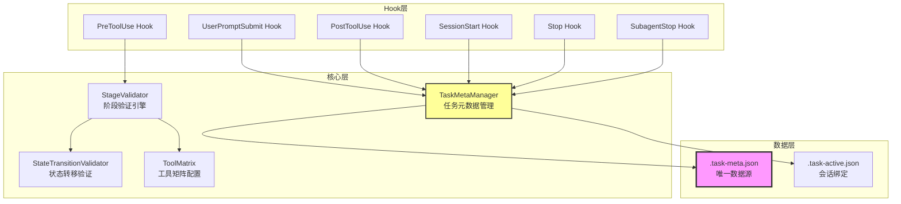
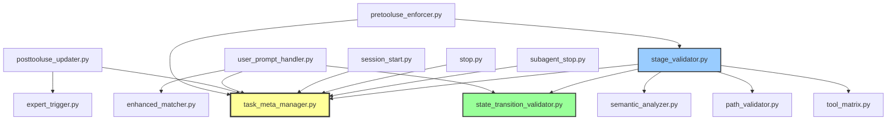
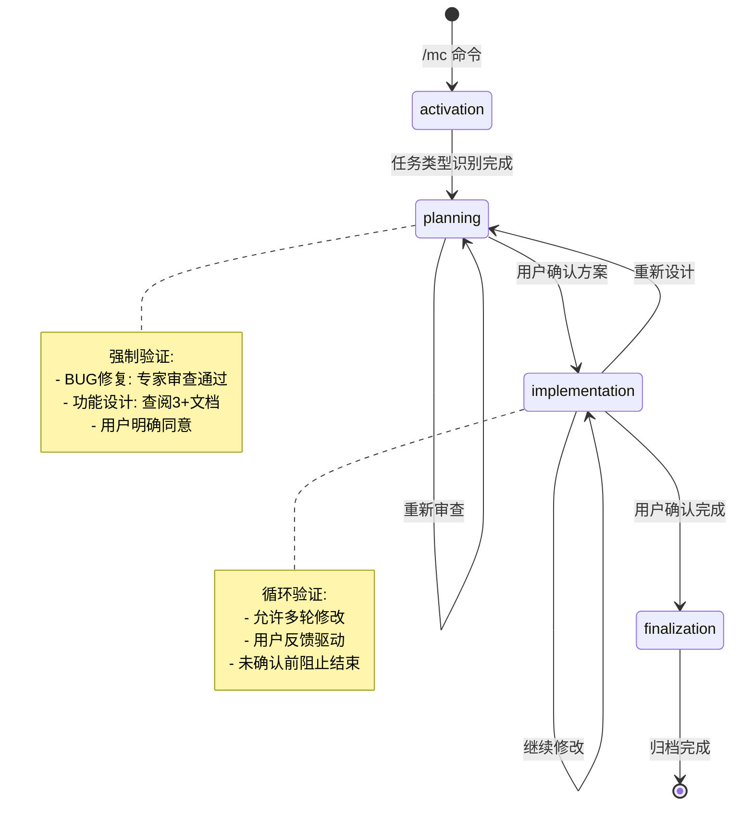
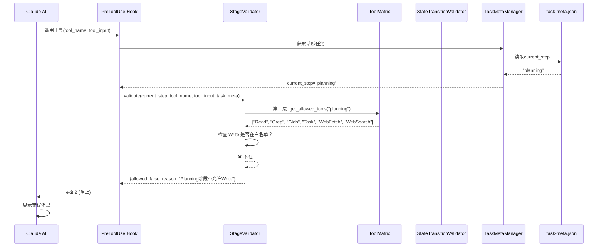
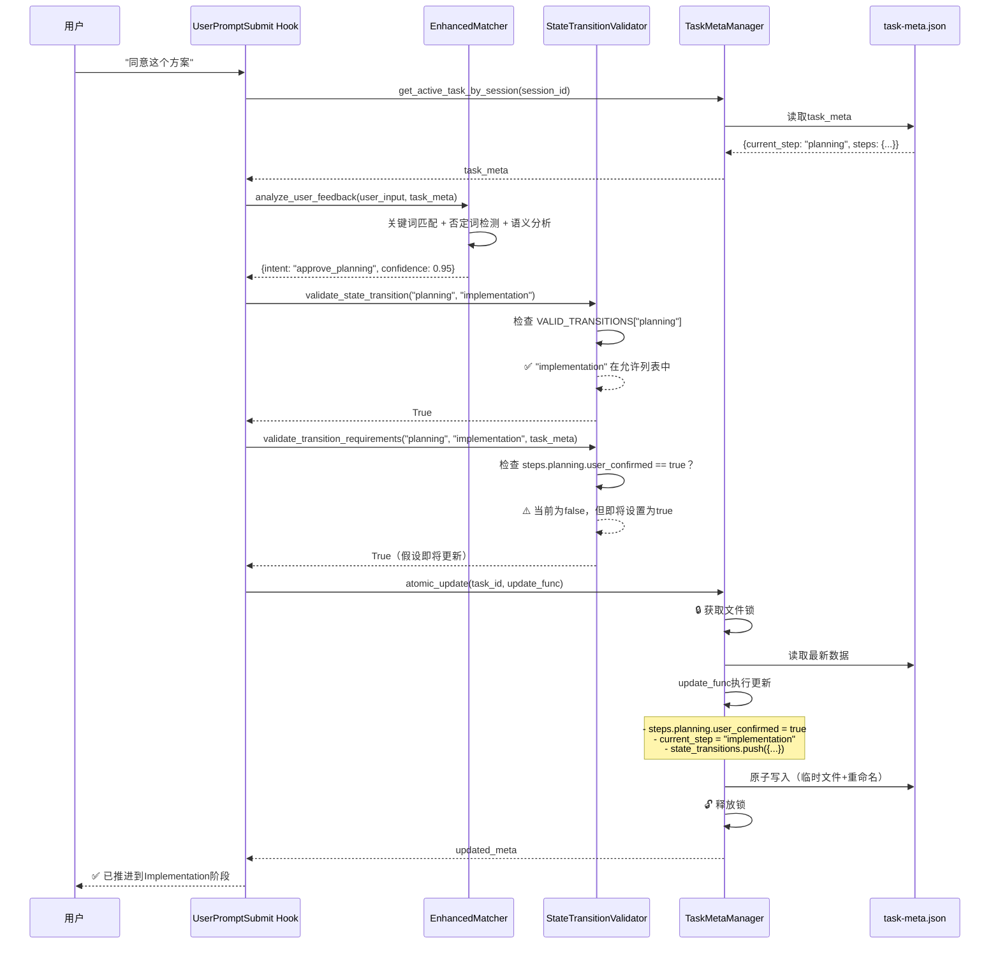
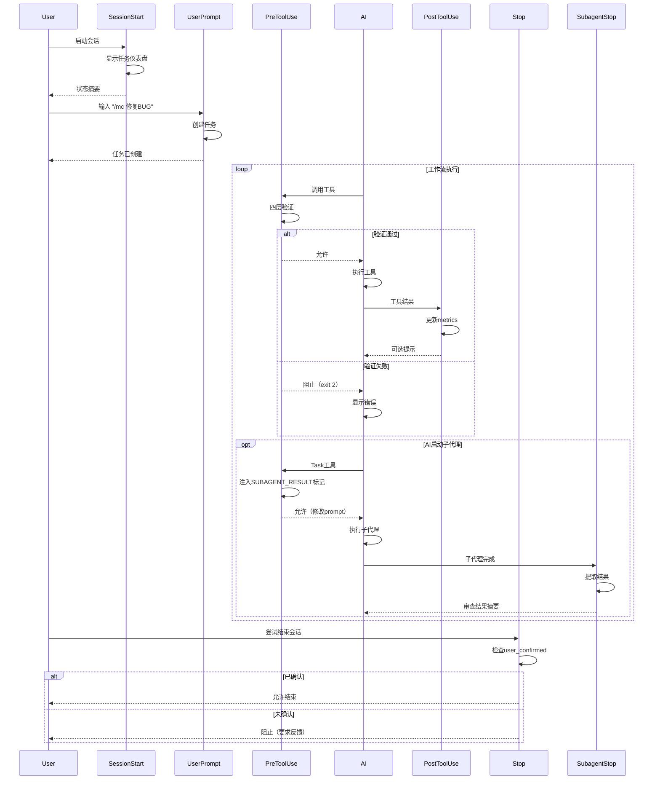

# Hook状态机系统 - 实现分析

> **基于代码逆向分析生成** | 版本: v25.0 | 分析时间: 2025-11-20
> **代码路径**: `templates/.claude/hooks` | **文件数**: 30 | **代码行数**: ~10,925

---

## 🗺️ 快速导航

[概览](#概览) | [架构](#架构) | [数据结构](#数据结构) | [执行流程](#执行流程) | [API索引](#api索引) | [运维](#运维)

---

## 📋 概览 (3分钟速读)

### 核心功能
**基于Claude Code Hooks的AI任务工作流状态机**，通过PreToolUse/PostToolUse/UserPrompt/Session/Stop等Hook拦截AI行为，强制执行 **Activation → Planning → Implementation → Finalization** 四阶段工作流，确保任务严格按状态机推进。

### 架构总览


### 关键指标
| 指标 | 值 | 说明 |
|------|---|------|
| 模块数 | 7 | core(9), orchestrator(4), lifecycle(5), utils(3), validators(2), archiver(2), config(1) |
| 核心文件 | task_meta_manager.py | 被所有Hook依赖，781行 |
| 主要语言 | Python 3 | 100% |
| 设计模式 | 状态机 + 责任链 + 观察者 | 四层验证架构 |
| Hook数量 | 6 | UserPrompt, PreToolUse, PostToolUse, SessionStart, Stop, SubagentStop |

---

## 🏗️ 架构详解

### 目录结构
```
templates/.claude/hooks/
├── archiver/               # 任务归档
│   ├── post_archive.py
│   └── __init__.py
├── config/                 # 配置文件
│   └── claude_semantic_config.json
├── core/                   # 核心引擎
│   ├── claude_semantic_analyzer.py
│   ├── enhanced_matcher.py
│   ├── expert_trigger.py
│   ├── path_validator.py
│   ├── semantic_analyzer.py
│   ├── stage_validator.py          # ⭐ 四层验证引擎
│   ├── state_transition_validator.py  # ⭐ 状态转移验证
│   ├── task_meta_manager.py        # ⭐ 核心管理器
│   ├── tool_matrix.py              # ⭐ 工具矩阵
│   └── __init__.py
├── lifecycle/              # 生命周期Hook
│   ├── pre_compact.py
│   ├── session_end.py
│   ├── session_start.py            # ⭐ 会话启动
│   ├── stop.py                     # ⭐ 会话停止
│   ├── subagent_stop.py            # ⭐ 子代理停止
│   └── __init__.py
├── orchestrator/           # 编排器Hook
│   ├── posttooluse_updater.py      # ⭐ 状态更新
│   ├── pretooluse_enforcer.py      # ⭐ 工具拦截
│   ├── task_cancellation_handler.py
│   ├── user_prompt_handler.py      # ⭐ 用户输入处理
│   └── __init__.py
├── utils/                  # 工具模块
│   ├── config_loader.py
│   ├── notify.py
│   └── __init__.py
└── validators/             # 验证器
    ├── pre_compact_reminder.py
    └── __init__.py
```

### 模块职责表
| 模块 | 核心文件 | 职责 | 关键函数 | 被依赖数 |
|------|---------|------|---------|---------|
| **core** | [task_meta_manager.py](../templates/.claude/hooks/core/task_meta_manager.py) | 任务元数据管理、会话绑定、文件锁 | `atomic_update()`, `load_task_meta()`, `save_task_meta()`, `bind_task_to_session()` | 6 |
| **core** | [state_transition_validator.py](../templates/.claude/hooks/core/state_transition_validator.py) | 状态转移合法性验证 | `validate_state_transition()`, `validate_transition_requirements()` | 2 |
| **core** | [tool_matrix.py](../templates/.claude/hooks/core/tool_matrix.py) | 阶段-工具-路径-语义四维规则 | `get_stage_config()`, `get_allowed_tools()` | 3 |
| **core** | [stage_validator.py](../templates/.claude/hooks/core/stage_validator.py) | 四层验证引擎整合 | `validate()` (第一层→第四层) | 1 |
| **orchestrator** | [pretooluse_enforcer.py](../templates/.claude/hooks/orchestrator/pretooluse_enforcer.py) | 拦截所有工具调用前验证 | `main()` (调用StageValidator) | 0 |
| **orchestrator** | [posttooluse_updater.py](../templates/.claude/hooks/orchestrator/posttooluse_updater.py) | 工具执行后状态更新 | `update_metrics()`, `update_bug_fix_tracking()` | 0 |
| **orchestrator** | [user_prompt_handler.py](../templates/.claude/hooks/orchestrator/user_prompt_handler.py:1-500) | 用户输入解析、状态转移触发 | `match_keyword_safely()`, `_log_state_transition()` | 0 |
| **lifecycle** | [session_start.py](../templates/.claude/hooks/lifecycle/session_start.py) | 显示任务仪表盘、恢复任务 | `generate_status_dashboard()` | 0 |
| **lifecycle** | [stop.py](../templates/.claude/hooks/lifecycle/stop.py) | 阻止未完成任务结束 | `check_user_confirmation()`, `wait_for_posttooluse_completion()` | 0 |
| **lifecycle** | [subagent_stop.py](../templates/.claude/hooks/lifecycle/subagent_stop.py) | 解析子代理结果（专家审查） | `extract_subagent_result()`, `generate_user_message()` | 0 |

### 模块依赖图


---

## 📊 数据结构速查

### 核心数据对象

#### task-meta.json（唯一数据源）
```typescript
interface TaskMeta {
  // 基本信息
  task_id: string;                    // 任务ID: "任务-1120-011712-修复玩家死亡复活"
  task_description: string;           // 任务描述
  task_type: "bug_fix" | "feature_implementation" | "general";

  // 当前状态
  current_step: "activation" | "planning" | "implementation" | "finalization";
  status: "in_progress" | "completed" | "failed";

  // 步骤状态（v3.0 Final语义化）
  steps: {
    activation: { status: "completed"; completed_at: string };
    planning: {
      status: "in_progress" | "completed";
      required_doc_count: number;         // 功能设计：3，BUG修复：0
      expert_review_required: boolean;    // BUG修复：true
      expert_review_completed: boolean;
      expert_review_result: "pass" | "需要调整";
      user_confirmed: boolean;            // 用户确认方案
      solution_summary?: string;
    };
    implementation: {
      status: "in_progress" | "completed";
      user_confirmed: boolean;            // 用户确认修复完成
      test_feedback_history: Array<{
        feedback: string;
        timestamp: string;
      }>;
      iterations: Array<Iteration>;       // 历史快照
    };
    finalization: {
      status: "in_progress" | "completed";
      documents_generated: string[];      // ["context.md", "solution.md"]
    };
  };

  // 度量指标（PostToolUse维护）
  metrics: {
    tools_used: Array<{ tool: string; timestamp: string; success: boolean }>;
    code_changes: Array<{ file: string; tool: string; timestamp: string }>;
    docs_read: Array<{ file: string; timestamp: string }>;  // Planning阶段文档阅读
    failed_operations: Array<{ tool: string; input: any; timestamp: string }>;
  };

  // 状态转移历史（v23.0新增）
  state_transitions: Array<{
    from_step: string;
    to_step: string;
    trigger: "user_agreed" | "explicit_success" | "explicit_failure";
    timestamp: string;
    details: any;
  }>;

  // 时间戳
  created_at: string;
  updated_at: string;
  session_started_at: string;
  architecture_version: "v3.0 Final";
}
```

#### .task-active.json（会话绑定，v3.1）
```typescript
interface TaskActive {
  version: "v3.1";
  active_tasks: {
    [session_id: string]: {
      task_id: string;
      task_dir: string;
      current_step: string;
      bound_at: string;
      session_history: string[];  // 压缩恢复链
    };
  };
}
```

### 配置项速查
| 配置键 | 位置 | 类型 | 默认值 | 说明 |
|--------|------|------|--------|------|
| `VALID_STATES` | [state_transition_validator.py:70-75](../templates/.claude/hooks/core/state_transition_validator.py#L70-L75) | Set[str] | `{'activation', 'planning', 'implementation', 'finalization'}` | 四个合法状态 |
| `VALID_TRANSITIONS` | [state_transition_validator.py:78-94](../templates/.claude/hooks/core/state_transition_validator.py#L78-L94) | Dict | 见代码 | 状态转移表 |
| `STAGE_TOOL_MATRIX` | [tool_matrix.py:8-314](../templates/.claude/hooks/core/tool_matrix.py#L8-L314) | Dict | 见代码 | 阶段-工具-路径-语义四维规则 |
| `STEP_ORDER` | [tool_matrix.py:354-359](../templates/.claude/hooks/core/tool_matrix.py#L354-L359) | List | `["activation", "planning", "implementation", "finalization"]` | 步骤顺序 |
| `MAX_RETRIES` | [task_meta_manager.py:42](../templates/.claude/hooks/core/task_meta_manager.py#L42) | int | 3 | 文件操作重试次数 |
| `RETRY_DELAY` | [task_meta_manager.py:43](../templates/.claude/hooks/core/task_meta_manager.py#L43) | float | 0.1 | 重试延迟（秒） |

### 数据流向表
| 数据源 | 数据目标 | 触发条件 | 数据格式 | 维护者 |
|--------|---------|---------|---------|--------|
| 用户输入 | `task-meta.json` → `task_description` | `/mc` 命令 | 字符串 | UserPromptSubmit Hook |
| 工具调用 | `task-meta.json` → `metrics.tools_used[]` | 任何工具执行后 | `{tool, timestamp, success}` | PostToolUse Hook |
| Read工具（.md文件） | `task-meta.json` → `metrics.docs_read[]` | Read执行后 | `{file, timestamp}` | PostToolUse Hook |
| Write/Edit工具 | `task-meta.json` → `metrics.code_changes[]` | Write/Edit执行后 | `{file, tool, timestamp}` | PostToolUse Hook |
| 用户确认（"同意"） | `task-meta.json` → `steps.planning.user_confirmed` | 关键词匹配 | boolean | UserPromptSubmit Hook |
| 用户反馈（"修复了"） | `task-meta.json` → `steps.implementation.user_confirmed` | 关键词匹配 | boolean | UserPromptSubmit Hook |
| 专家审查子代理 | `task-meta.json` → `steps.planning.expert_review` | 子代理停止时 | `{approved, issues, suggestions}` | SubagentStop Hook |
| 状态转移 | `task-meta.json` → `state_transitions[]` | 任何状态变化 | `{from_step, to_step, trigger, timestamp}` | UserPromptSubmit Hook |

---

## 🔄 执行流程

### 状态机总览


### 主流程图：工具调用拦截


### 主流程图：状态转移


### 关键路径表
| 场景 | 入口函数 | 执行步骤 | 输出结果 |
|------|---------|---------|---------|
| **任务初始化** | `user_prompt_handler.py:main()` | 1. 检测 `/mc` 命令<br>2. 创建任务目录<br>3. 生成 task-meta.json<br>4. 绑定到 session_id<br>5. 设置 current_step="activation" | task_id, task-meta.json, .task-active.json |
| **Planning→Implementation** | `user_prompt_handler.py:main()` | 1. 检测用户"同意"<br>2. 验证 expert_review_completed（BUG修复）<br>3. 验证 docs_read >= 3（功能设计）<br>4. 状态转移验证<br>5. 原子更新 task-meta.json | current_step="implementation" |
| **工具拦截（Planning阶段Write）** | `pretooluse_enforcer.py:main()` | 1. 读取 current_step<br>2. StageValidator.validate()<br>3. 第一层: 检查工具白名单<br>4. Write不在 Planning 白名单中<br>5. 返回 exit 2 阻止 | 阻止工具调用，显示错误消息 |
| **状态更新（PostToolUse）** | `posttooluse_updater.py:main()` | 1. 检测工具名（Read/Write/Edit）<br>2. 原子更新 metrics<br>3. 记录 code_changes/docs_read<br>4. 检测循环触发专家审查<br>5. 可选用户提示 | metrics.tools_used++, metrics.code_changes++ |
| **专家审查结果解析** | `subagent_stop.py:main()` | 1. 从 transcript_path 读取 JSONL<br>2. 提取 `<!-- SUBAGENT_RESULT {...} -->`<br>3. 解析 JSON<br>4. 原子更新 steps.planning.expert_review<br>5. 生成用户消息 | expert_review_completed=true, 用户可见摘要 |

### 状态转移表
| 当前状态 | 触发条件 | 下一状态 | 执行动作 | 验证器 |
|---------|---------|---------|---------|--------|
| activation | 任务类型识别完成 | planning | 设置 required_doc_count, expert_review_required | StateTransitionValidator |
| planning | 专家审查通过 + 用户确认 (BUG修复) | implementation | user_confirmed=true, 创建快照 | validate_transition_requirements() |
| planning | 查阅3+文档 + 用户确认 (功能设计) | implementation | 同上 | 同上 |
| planning | 重新审查 | planning | expert_review_count++ | validate_state_transition() |
| implementation | 用户确认修复完成（"修复了"） | finalization | user_confirmed=true, 创建快照 | StateTransitionValidator |
| implementation | 用户要求重新设计（"根本原因没找到"） | planning | 回滚，清除 user_confirmed | 允许回退 |
| implementation | 继续修改（用户反馈问题） | implementation | test_feedback_history.push() | 自由循环 |
| finalization | 文档生成完成 + 归档 | [终态] | archived=true | 不允许转移 |

---

## 🔍 API 索引

### 核心函数速查
| 函数名 | 位置 | 用途 | 关键参数 | 返回值 |
|--------|------|------|---------|--------|
| `TaskMetaManager.atomic_update()` | [task_meta_manager.py:118-208](../templates/.claude/hooks/core/task_meta_manager.py#L118-L208) | 原子更新任务元数据（读-改-写） | `task_id`, `update_func: Callable` | `Optional[Dict]` (更新后的task_meta) |
| `TaskMetaManager.bind_task_to_session()` | [task_meta_manager.py:288-347](../templates/.claude/hooks/core/task_meta_manager.py#L288-L347) | 绑定任务到会话（v3.1核心方法） | `task_id`, `session_id` | `bool` |
| `TaskMetaManager.get_active_task_by_session()` | [task_meta_manager.py:232-286](../templates/.claude/hooks/core/task_meta_manager.py#L232-L286) | 根据session_id获取绑定任务 | `session_id` | `Optional[Dict]` |
| `validate_state_transition()` | [state_transition_validator.py:132-180](../templates/.claude/hooks/core/state_transition_validator.py#L132-L180) | 验证状态转移是否合法 | `from_step`, `to_step`, `strict=True` | `bool` (或抛出异常) |
| `validate_transition_requirements()` | [state_transition_validator.py:183-225](../templates/.claude/hooks/core/state_transition_validator.py#L183-L225) | 验证转移条件是否满足 | `from_step`, `to_step`, `meta_data`, `strict=True` | `bool` |
| `StageValidator.validate()` | [stage_validator.py:46-118](../templates/.claude/hooks/core/stage_validator.py#L46-L118) | 四层验证主入口 | `current_step`, `tool_name`, `tool_input`, `task_meta` | `{allowed: bool, reason: str}` |
| `get_stage_config()` | [tool_matrix.py:319-329](../templates/.claude/hooks/core/tool_matrix.py#L319-L329) | 获取阶段配置 | `stage_name` | `dict` |
| `extract_subagent_result()` | [subagent_stop.py:76-175](../templates/.claude/hooks/lifecycle/subagent_stop.py#L76-L175) | 从transcript提取子代理结果 | `transcript_path` | `Optional[Dict]` |
| `match_keyword_safely()` | [user_prompt_handler.py:357-403](../templates/.claude/hooks/orchestrator/user_prompt_handler.py#L357-L403) | 安全关键词匹配（否定词+转折词） | `text`, `keywords` | `bool` |
| `update_metrics()` | [posttooluse_updater.py:72-254](../templates/.claude/hooks/orchestrator/posttooluse_updater.py#L72-L254) | 更新任务度量指标 | `task_meta`, `tool_name`, `tool_input`, `is_error` | `None` (原地修改) |

### 核心类速查
| 类名 | 位置 | 职责 | 关键方法 |
|------|------|------|---------|
| `TaskMetaManager` | [task_meta_manager.py:38-781](../templates/.claude/hooks/core/task_meta_manager.py#L38-L781) | 任务元数据管理、文件锁、会话绑定 | `atomic_update()`, `bind_task_to_session()`, `load_task_meta()`, `save_task_meta()` |
| `StageValidator` | [stage_validator.py:30-389](../templates/.claude/hooks/core/stage_validator.py#L30-L389) | 四层验证引擎 | `validate()`, `_validate_layer1_tool_type()`, `_validate_layer4_semantic()` |
| `IllegalTransitionError` | [state_transition_validator.py:44-53](../templates/.claude/hooks/core/state_transition_validator.py#L44-L53) | 非法状态转移异常 | `__init__(from_step, to_step, reason)` |
| `MissingCriticalFieldError` | [state_transition_validator.py:56-64](../templates/.claude/hooks/core/state_transition_validator.py#L56-L64) | 缺少关键字段异常 | `__init__(field, transition)` |

---

## 🛠️ 运维速查

### 调试清单
| 场景 | 日志位置 | 关键字 | 诊断命令 |
|------|---------|--------|---------|
| PreToolUse拦截失败 | `pretooluse-debug.log` | `[PreToolUse]`, `[Layer1]` | `tail -f pretooluse-debug.log` |
| PostToolUse状态更新失败 | `posttooluse-debug.log` | `[PostToolUse]`, `atomic_update` | `grep "❌" posttooluse-debug.log` |
| 专家审查标记丢失 | `subagent-stop-debug.log` | `SUBAGENT_RESULT`, `transcript` | `grep "SUBAGENT_RESULT" subagent-stop-debug.log` |
| 状态转移被拒绝 | stderr（Hook输出） | `IllegalTransitionError`, `阻止` | 查看Claude Code终端输出 |
| 文件锁冲突 | stderr | `🔒 锁冲突`, `portalocker` | `grep "锁冲突" *.log` |

### 修改场景表
| 需求 | 修改文件 | 修改位置 | 注意事项 |
|------|---------|---------|---------|
| 新增阶段 | [tool_matrix.py](../templates/.claude/hooks/core/tool_matrix.py), [state_transition_validator.py](../templates/.claude/hooks/core/state_transition_validator.py) | `STAGE_TOOL_MATRIX`, `VALID_STATES`, `VALID_TRANSITIONS` | 同步修改所有引用 current_step 的Hook |
| 修改Planning白名单工具 | [tool_matrix.py:42-49](../templates/.claude/hooks/core/tool_matrix.py#L42-L49) | `STAGE_TOOL_MATRIX["planning"]["allowed_tools"]` | 确保工具名与Claude Code一致 |
| 调整文档要求数量 | [tool_matrix.py:80-82](../templates/.claude/hooks/core/tool_matrix.py#L80-L82) | `semantic_rules.Read.min_reads` | 功能设计默认3个，BUG修复0个 |
| 禁用专家审查 | [user_prompt_handler.py](../templates/.claude/hooks/orchestrator/user_prompt_handler.py) | 搜索 `expert_review_required`，设置为 `False` | 会降低BUG修复质量 |
| 修改状态转移规则 | [state_transition_validator.py:78-94](../templates/.claude/hooks/core/state_transition_validator.py#L78-L94) | `VALID_TRANSITIONS` | ⚠️ 修改后运行测试代码验证 |
| 增加文件锁重试次数 | [task_meta_manager.py:42](../templates/.claude/hooks/core/task_meta_manager.py#L42) | `MAX_RETRIES` | 高并发场景可调至10 |

### 常见问题排查

#### 1. Planning阶段无法修改代码
**现象**: PreToolUse Hook拦截Write/Edit工具
**原因**: Planning阶段白名单不包含代码修改工具
**解决**:
1. 确认用户已输入"同意"
2. 检查 `steps.planning.user_confirmed == true`
3. 检查 `current_step == "implementation"`
4. 如需强制放行，临时修改 [tool_matrix.py:42](../templates/.claude/hooks/core/tool_matrix.py#L42) 添加 `"Write"` 到白名单

#### 2. 专家审查结果丢失
**现象**: SubagentStop Hook无法提取审查结果
**原因**: 子代理输出缺少 `<!-- SUBAGENT_RESULT {...} -->` 标记
**排查**:
1. 检查 `pretooluse-debug.log`，确认标记注入成功
2. 检查 `subagent-stop-debug.log`，查看 transcript 解析日志
3. 手动打开 `agent-{agentId}.jsonl` 验证标记存在
4. 如标记注入失败，检查 [pretooluse_enforcer.py:176-311](../templates/.claude/hooks/orchestrator/pretooluse_enforcer.py#L176-L311)

#### 3. 状态机卡在某个阶段
**现象**: 无法推进到下一阶段
**原因**: 转移条件未满足
**排查**:
1. 读取 `.task-meta.json`，检查 `current_step`
2. 查看 `steps.{current_step}` 的字段（如 `user_confirmed`）
3. 检查 [state_transition_validator.py:97-127](../templates/.claude/hooks/core/state_transition_validator.py#L97-L127) 的 `TRANSITION_REQUIREMENTS`
4. 手动修改 `task-meta.json` 满足条件（临时解决）

---

## 📝 附录

### 完整文件清单

**核心模块 (core/)**
- [`claude_semantic_analyzer.py`](../templates/.claude/hooks/core/claude_semantic_analyzer.py) - v25.0 Claude语义分析器（LLM驱动）
- [`enhanced_matcher.py`](../templates/.claude/hooks/core/enhanced_matcher.py) - v24.2 增强型关键词匹配器
- [`expert_trigger.py`](../templates/.claude/hooks/core/expert_trigger.py) - 专家审查触发器
- [`path_validator.py`](../templates/.claude/hooks/core/path_validator.py) - 文件路径验证器（白名单/黑名单）
- [`semantic_analyzer.py`](../templates/.claude/hooks/core/semantic_analyzer.py) - 操作语义分析器
- [`stage_validator.py`](../templates/.claude/hooks/core/stage_validator.py) - 四层验证引擎（核心）
- [`state_transition_validator.py`](../templates/.claude/hooks/core/state_transition_validator.py) - 状态转移验证器（核心）
- [`task_meta_manager.py`](../templates/.claude/hooks/core/task_meta_manager.py) - 任务元数据管理器（核心）
- [`tool_matrix.py`](../templates/.claude/hooks/core/tool_matrix.py) - 工具矩阵配置（核心）

**编排器 (orchestrator/)**
- [`posttooluse_updater.py`](../templates/.claude/hooks/orchestrator/posttooluse_updater.py) - PostToolUse Hook（状态更新）
- [`pretooluse_enforcer.py`](../templates/.claude/hooks/orchestrator/pretooluse_enforcer.py) - PreToolUse Hook（工具拦截）
- [`task_cancellation_handler.py`](../templates/.claude/hooks/orchestrator/task_cancellation_handler.py) - 任务取消处理器
- [`user_prompt_handler.py`](../templates/.claude/hooks/orchestrator/user_prompt_handler.py) - UserPromptSubmit Hook（状态转移）

**生命周期 (lifecycle/)**
- [`pre_compact.py`](../templates/.claude/hooks/lifecycle/pre_compact.py) - 压缩前提醒
- [`session_end.py`](../templates/.claude/hooks/lifecycle/session_end.py) - 会话结束
- [`session_start.py`](../templates/.claude/hooks/lifecycle/session_start.py) - SessionStart Hook（仪表盘）
- [`stop.py`](../templates/.claude/hooks/lifecycle/stop.py) - Stop Hook（阻止未完成任务）
- [`subagent_stop.py`](../templates/.claude/hooks/lifecycle/subagent_stop.py) - SubagentStop Hook（专家审查结果）

**工具模块 (utils/)**
- [`config_loader.py`](../templates/.claude/hooks/utils/config_loader.py) - 配置加载器
- [`notify.py`](../templates/.claude/hooks/utils/notify.py) - 桌面通知（跨平台）

**验证器 (validators/)**
- [`pre_compact_reminder.py`](../templates/.claude/hooks/validators/pre_compact_reminder.py) - 压缩前提醒验证器

**归档器 (archiver/)**
- [`post_archive.py`](../templates/.claude/hooks/archiver/post_archive.py) - 任务归档后处理

**配置文件 (config/)**
- [`claude_semantic_config.json`](../templates/.claude/hooks/config/claude_semantic_config.json) - Claude语义分析器配置

### Hook触发顺序（完整生命周期）


### 版本演进
| 版本 | 日期 | 核心变更 |
|------|------|---------|
| v20.x | 2024-11 | 初始版本，workflow-state.json + task-meta.json 双文件架构 |
| v21.x | 2024-11 | 引入专家审查子代理，BUG修复强制验证 |
| v22.0 | 2025-01 | Phase 3用户体验增强，语义化4步命名（activation/planning/implementation/finalization） |
| v23.0 | 2025-01 | Finalization倒计时机制，强制启动Task子代理 |
| v24.0 | 2025-01 | Planning阶段user_confirmed强制检查，防止未确认修改代码 |
| v25.0 | 2025-01 | Windows编码完整容错，Claude语义分析器，状态转移验证器 |
| **v3.0 Final** | 2025-01 | **架构重构: 删除workflow-state.json，task-meta.json唯一数据源** |
| v3.1 | 2025-01 | 会话绑定管理（.task-active.json），支持多任务并行 |

---

**文档元信息**
- **生成时间**: 2025-11-20 01:45:00
- **分析深度**: 完整代码级别
- **可信度**: 高（基于实际代码实现）
- **生成工具**: /code-to-docs 命令
- **维护方式**: 代码变更后重新生成
- **分析文件数**: 30个源文件
- **代码行数**: ~10,925行
- **图表数**: 5个
- **表格数**: 12个

---

*本文档通过深度代码分析自动生成，不依赖注释和设计文档，是当前代码实现的真实反映。*
