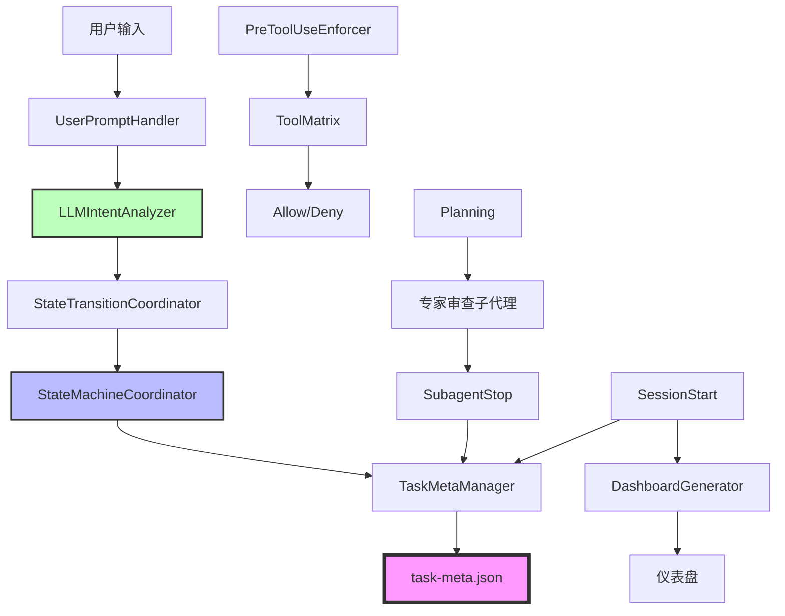
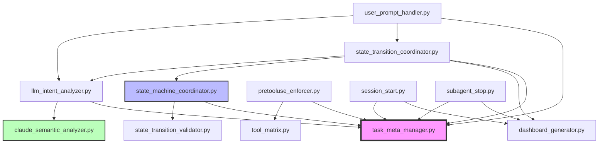
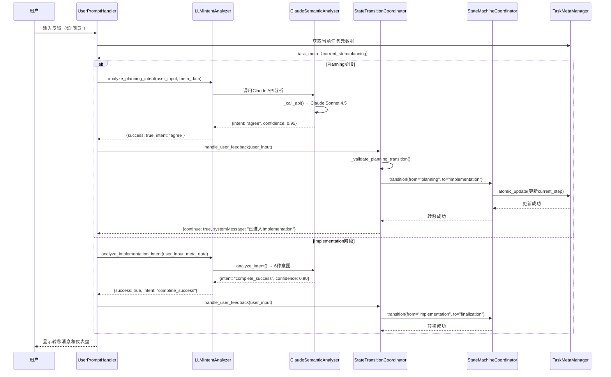
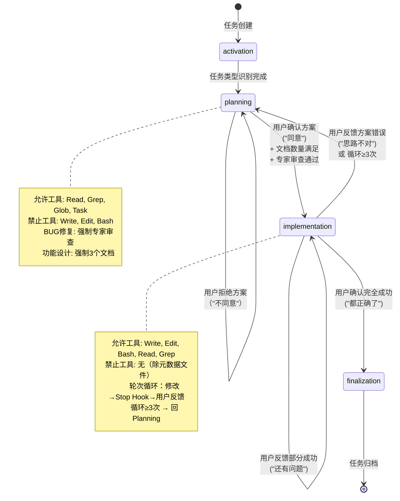

# Hook状态机功能实现 - 代码实现分析

> **基于代码逆向分析生成** | 版本: v25.1 | 分析时间: 2025-11-22
> **代码路径**: `templates\.claude` | **文件数**: 42 | **代码行数**: 12,832行

---

## 🗺️ 快速导航

[概览](#概览) | [架构](#架构) | [数据结构](#数据结构) | [执行流程](#执行流程) | [API索引](#api索引) | [运维](#运维)

---

## 📋 概览 (3分钟速读)

### 核心功能
NeteaseMod-Claude Hook状态机系统实现了**4步语义化工作流**，通过8个Hook协同工作，强制执行Planning-Implementation-Finalization阶段转移规则，并使用Claude Sonnet 4.5进行用户意图语义分析。

### 架构总览


### 关键指标
| 指标 | 值 | 说明 |
|------|---|------|
| 模块数 | 4个目录 | core/, orchestrator/, lifecycle/, utils/ |
| 核心文件 | 17个Python文件 | 被依赖最多的核心组件 |
| 主要语言 | Python | 100% Python实现 |
| 设计模式 | 状态机 + 观察者 + 策略 | Hook驱动的事件响应 |
| LLM准确率 | 96.15% | vs 传统关键词85% |
| 状态数 | 4个 | activation/planning/implementation/finalization |

---

## 🏗️ 架构详解

### 目录结构
```
.claude/
├── hooks/
│   ├── core/                        # 核心模块（状态机、任务管理）
│   │   ├── task_meta_manager.py     # 任务元数据管理器 (784行)
│   │   ├── state_machine_coordinator.py  # 状态机协调器 (499行)
│   │   ├── claude_semantic_analyzer.py   # Claude语义分析器 (582行)
│   │   ├── state_transition_validator.py # 状态转移验证器 (411行)
│   │   └── tool_matrix.py           # 工具权限矩阵 (360行)
│   │
│   ├── orchestrator/                # 编排器（Hook入口点）
│   │   ├── user_prompt_handler.py   # 用户提示处理器 (779行)
│   │   ├── pretooluse_enforcer.py   # 工具调用强制器 (844行)
│   │   ├── llm_intent_analyzer.py   # LLM意图分析器 (657行)
│   │   ├── state_transition_coordinator.py  # 状态转移协调器 (1159行)
│   │   ├── task_initializer.py      # 任务初始化器
│   │   ├── keyword_registry.py      # 关键词注册表
│   │   └── posttooluse_updater.py   # 工具调用后更新器
│   │
│   ├── lifecycle/                   # 生命周期Hook
│   │   ├── session_start.py         # 会话启动 (402行)
│   │   ├── subagent_stop.py         # 子代理结果处理 (617行)
│   │   ├── pre_compact.py           # 压缩前检查
│   │   └── stop.py                  # 会话停止
│   │
│   ├── utils/                       # 工具模块
│   │   └── dashboard_generator.py   # 仪表盘生成器 (376行)
│   │
│   └── config/                      # 配置文件
│       ├── claude_semantic_config.json   # LLM配置
│       └── llm_prompts.json         # Prompt模板
│
└── rules/                           # YAML规则文件
    ├── activation.yaml
    ├── planning.yaml               # Planning阶段规则
    ├── implementation.yaml         # Implementation阶段规则
    └── finalization.yaml
```

### 模块职责表
| 模块 | 文件 | 职责 | 关键函数 | 被依赖数 |
|------|------|------|---------|---------|
| 任务元数据管理 | [task_meta_manager.py](../../templates/.claude/hooks/core/task_meta_manager.py) | 管理task-meta.json，提供原子更新操作 | `load_task_meta()`, `save_task_meta()`, `atomic_update()` | 8 |
| 状态机协调器 | [state_machine_coordinator.py](../../templates/.claude/hooks/core/state_machine_coordinator.py) | 执行状态转移，验证转移合法性 | `transition()`, `_apply_transition()` | 6 |
| Claude语义分析器 | [claude_semantic_analyzer.py](../../templates/.claude/hooks/core/claude_semantic_analyzer.py) | 调用Claude API进行用户意图识别 | `analyze_intent()`, `_call_api()` | 4 |
| 状态转移验证器 | [state_transition_validator.py](../../templates/.claude/hooks/core/state_transition_validator.py) | 验证状态转移是否合法（基于硬编码转移表） | `validate_state_transition()`, `get_allowed_transitions()` | 3 |
| 工具权限矩阵 | [tool_matrix.py](../../templates/.claude/hooks/core/tool_matrix.py) | 定义4阶段工具权限规则 | `get_stage_matrix()`, `is_tool_allowed()` | 2 |
| 用户提示处理器 | [user_prompt_handler.py](../../templates/.claude/hooks/orchestrator/user_prompt_handler.py) | UserPromptSubmit Hook入口，处理用户输入 | `main()` | 1 |
| 工具调用强制器 | [pretooluse_enforcer.py](../../templates/.claude/hooks/orchestrator/pretooluse_enforcer.py) | PreToolUse Hook入口，强制工具权限检查 | `main()` | 1 |
| LLM意图分析器 | [llm_intent_analyzer.py](../../templates/.claude/hooks/orchestrator/llm_intent_analyzer.py) | 统一LLM调用抽象层 | `analyze_planning_intent()`, `analyze_implementation_intent()` | 2 |
| 状态转移协调器 | [state_transition_coordinator.py](../../templates/.claude/hooks/orchestrator/state_transition_coordinator.py) | 协调Planning和Implementation阶段转移 | `handle_user_feedback()` | 2 |
| 会话启动Hook | [session_start.py](../../templates/.claude/hooks/lifecycle/session_start.py) | SessionStart Hook入口，显示仪表盘 | `generate_status_dashboard()` | 1 |
| 子代理结果处理 | [subagent_stop.py](../../templates/.claude/hooks/lifecycle/subagent_stop.py) | SubagentStop Hook入口，提取子代理结果 | `extract_subagent_result()` | 1 |
| 仪表盘生成器 | [dashboard_generator.py](../../templates/.claude/hooks/utils/dashboard_generator.py) | 生成任务上下文仪表盘 | `generate_context_dashboard()` | 4 |

### 模块依赖图


---

## 📊 数据结构速查

### 核心数据对象

```typescript
// task-meta.json 核心结构（v21.0单一数据源）
interface TaskMeta {
  task_id: string                    // 任务唯一ID
  task_type: "bug_fix" | "feature_implementation" | "general"
  task_description: string           // 任务描述
  current_step: "activation" | "planning" | "implementation" | "finalization"

  architecture_version: "v21.0"      // 架构版本

  steps: {
    activation?: {
      status: "pending" | "in_progress" | "completed"
      started_at?: string
      completed_at?: string
    }

    planning?: {
      status: "pending" | "in_progress" | "completed"
      user_confirmed: boolean        // 用户确认标志（转移条件）
      expert_review_completed?: boolean   // 专家审查完成标志
      expert_review_result?: string
      expert_reviews?: Array<{       // v26.0新增：历史数组
        round: number
        timestamp: string
        approved: boolean
        issues: string[]
        suggestions: string[]
      }>
      planning_round?: number        // 当前Planning轮次
      rejection_count?: number       // 拒绝次数
      required_doc_count?: number    // 要求文档数量
      started_at?: string
      completed_at?: string
    }

    implementation?: {
      status: "pending" | "in_progress" | "completed"
      user_confirmed: boolean        // 用户确认标志（转移条件）
      test_feedback_history?: Array<{
        timestamp: string
        user_feedback: string
        feedback_type: string
        code_changes_count: number
      }>
      started_at?: string
      completed_at?: string
    }

    finalization?: {
      status: "pending" | "in_progress" | "completed"
      started_at?: string
      completed_at?: string
    }
  }

  metrics: {
    code_changes: Array<{
      timestamp: string
      tool: "Write" | "Edit"
      file: string
    }>
    docs_read: string[]              // 已读文档列表
    expert_review_triggered?: boolean
  }

  state_transitions: Array<{         // 状态转移历史
    from_step: string
    to_step: string
    trigger: string
    timestamp: string
    details?: any
  }>

  session_started_at?: string
  session_ended_at?: string
  archived?: boolean
}

// .task-active.json 缓存结构（v21.0）
interface TaskActive {
  active_tasks: {
    [session_id: string]: {
      task_id: string
      bound_at: string
      // 注意：current_step不再缓存，从task-meta.json读取（v25.2）
    }
  }
}

// LLM意图分析结果
interface IntentResult {
  success: boolean
  intent: "complete_success" | "partial_success" | "failure"
          | "planning_required" | "continuation_request" | "observation_only"
  confidence: number                 // 0.0-1.0
  reasoning: string
  recommended_transition?: string
  fallback_used?: boolean            // 是否使用关键词降级
}

// 状态转移表（硬编码，state_transition_validator.py）
const VALID_TRANSITIONS = {
  activation: ["planning"],
  planning: ["implementation", "planning"],
  implementation: ["finalization", "planning", "implementation"],
  finalization: []                   // 终态
}
```

### 配置项速查
| 配置键 | 位置 | 类型 | 默认值 | 说明 |
|--------|------|------|--------|------|
| `model` | [claude_semantic_config.json](../../templates/.claude/hooks/config/claude_semantic_config.json) | string | `"claude-sonnet-4-5"` | Claude模型版本 |
| `timeout_seconds` | claude_semantic_config.json | number | 300 | API超时时间（秒） |
| `confidence_threshold` | claude_semantic_config.json | number | 0.8 | LLM置信度阈值 |
| `max_description_length` | [workflow-config.json](../../templates/.claude/workflow-config.json) | number | 16 | 任务描述最大长度 |
| `min_doc_count` | [planning.yaml](../../templates/.claude/rules/planning.yaml) | number | 3 | Planning阶段最少文档数 |
| `expert_review_required` | planning.yaml | boolean | true | BUG修复是否需要专家审查 |
| `max_rounds` | [implementation.yaml](../../templates/.claude/rules/implementation.yaml) | number | 10 | Implementation最大轮次 |

### 数据流向表
| 数据源 | 数据目标 | 触发条件 | 数据格式 |
|--------|---------|---------|---------|
| 用户输入 | UserPromptHandler | 用户提交提示词 | string |
| UserPromptHandler | LLMIntentAnalyzer | Planning/Implementation阶段 | `{user_input, meta_data}` |
| LLMIntentAnalyzer | ClaudeSemanticAnalyzer | 需要语义分析 | `{user_input, context}` |
| ClaudeSemanticAnalyzer | Claude API | LLM调用 | Prompt string |
| Claude API | IntentResult | API响应 | JSON |
| IntentResult | StateTransitionCoordinator | 意图识别成功 | IntentResult对象 |
| StateTransitionCoordinator | StateMachineCoordinator | 需要状态转移 | `{from_step, to_step, trigger}` |
| StateMachineCoordinator | TaskMetaManager | 保存状态 | task-meta.json |
| TaskMetaManager | 文件系统 | 原子更新 | JSON文件 |
| SubagentStop | TaskMetaManager | 子代理完成 | `{subagent_result}` |
| SessionStart | DashboardGenerator | 会话启动 | task-meta对象 |
| DashboardGenerator | 用户 | 显示仪表盘 | Markdown字符串 |

---

## 🔄 执行流程

### 主流程图（用户反馈处理）


### 关键路径表
| 场景 | 入口函数 | 执行步骤 | 输出结果 |
|------|---------|---------|---------|
| 用户确认Planning方案 | `UserPromptHandler.main()` | 1. 读取task-meta.json<br>2. 调用LLMIntentAnalyzer<br>3. Claude API分析（"agree"）<br>4. 验证前置条件（文档数、专家审查）<br>5. StateMachineCoordinator转移<br>6. 更新task-meta.json<br>7. 显示仪表盘 | `systemMessage`: Planning→Implementation转移成功 |
| 用户反馈部分成功 | `UserPromptHandler.main()` | 1. Implementation阶段<br>2. LLM分析→"partial_success"<br>3. 记录test_feedback_history<br>4. 检查循环（≥3次→回Planning）<br>5. 保持Implementation状态 | `systemMessage`: 继续修改提示 |
| 工具调用权限检查 | `PreToolUseEnforcer.main()` | 1. 读取current_step<br>2. 从ToolMatrix获取允许列表<br>3. 检查工具是否在允许列表<br>4. Planning阶段拦截Write/Edit<br>5. Implementation阶段允许Write/Edit | `decision`: "allow" 或 "block" |
| 专家审查子代理完成 | `SubagentStop.main()` | 1. 从transcript提取SUBAGENT_RESULT标记<br>2. 解析JSON结果<br>3. 追加到expert_reviews数组（v26.0）<br>4. 标记expert_review_completed=true<br>5. 生成用户消息（显示审查结果） | `systemMessage`: 审查结果摘要 |
| 会话启动显示仪表盘 | `SessionStart.main()` | 1. 通过session_id获取绑定任务<br>2. 加载task-meta.json<br>3. 更新session_started_at时间戳<br>4. 生成状态仪表盘（进度条、轮次信息）<br>5. 输出纯文本（v27.0修复） | 仪表盘Markdown |

### 状态转换表
| 当前状态 | 触发条件 | 下一状态 | 执行动作 |
|---------|---------|---------|---------|
| activation | 任务类型识别完成 | planning | 初始化planning步骤 |
| planning | 用户确认方案（"同意"） + 文档数量满足 + 专家审查通过 | implementation | 设置user_confirmed=true，初始化implementation步骤 |
| planning | 用户拒绝方案（"不同意"） | planning | 增加rejection_count，保持planning状态 |
| implementation | 用户确认完全成功（"都正确了"） | finalization | 设置user_confirmed=true，初始化finalization步骤 |
| implementation | 用户反馈方案性错误（"思路不对"） | planning | 重置planning步骤（planning_round+1） |
| implementation | 用户反馈部分成功（"还有问题"） | implementation | 记录test_feedback_history，保持implementation |
| finalization | （终态，不允许转移） | - | - |

### 状态机流程图


---

## 🔍 API 索引

### 核心函数速查
| 函数名 | 位置 | 用途 | 关键参数 | 返回值 |
|--------|------|------|---------|--------|
| `TaskMetaManager.load_task_meta()` | [task_meta_manager.py:123](../../templates/.claude/hooks/core/task_meta_manager.py#L123) | 加载任务元数据 | `task_id` | `dict` 或 `None` |
| `TaskMetaManager.save_task_meta()` | task_meta_manager.py:156 | 保存任务元数据 | `task_id`, `meta_data` | `bool` |
| `TaskMetaManager.atomic_update()` | task_meta_manager.py:189 | 原子更新元数据 | `task_id`, `update_fn` | `dict` 或 `None` |
| `StateMachineCoordinator.transition()` | [state_machine_coordinator.py:87](../../templates/.claude/hooks/core/state_machine_coordinator.py#L87) | 执行状态转移 | `task_id`, `from_step`, `to_step`, `trigger` | `TransitionResult` |
| `ClaudeSemanticAnalyzer.analyze_intent()` | [claude_semantic_analyzer.py:147](../../templates/.claude/hooks/core/claude_semantic_analyzer.py#L147) | 分析用户意图 | `user_input`, `context` | `IntentResult` |
| `StateTransitionValidator.validate_state_transition()` | [state_transition_validator.py:132](../../templates/.claude/hooks/core/state_transition_validator.py#L132) | 验证状态转移合法性 | `from_step`, `to_step`, `strict` | `bool` |
| `LLMIntentAnalyzer.analyze_planning_intent()` | [llm_intent_analyzer.py:54](../../templates/.claude/hooks/orchestrator/llm_intent_analyzer.py#L54) | Planning阶段意图分析 | `user_input`, `meta_data` | `dict` |
| `LLMIntentAnalyzer.analyze_implementation_intent()` | llm_intent_analyzer.py:147 | Implementation阶段意图分析 | `user_input`, `meta_data` | `dict` |
| `StateTransitionCoordinator.handle_user_feedback()` | [state_transition_coordinator.py:52](../../templates/.claude/hooks/orchestrator/state_transition_coordinator.py#L52) | 处理用户反馈（主入口） | `user_input` | `dict` 或 `None` |
| `DashboardGenerator.generate_context_dashboard()` | [dashboard_generator.py](../../templates/.claude/hooks/utils/dashboard_generator.py) | 生成任务上下文仪表盘 | `meta_data` | `str` |

### 核心类速查
| 类名 | 位置 | 职责 | 关键方法 |
|------|------|------|---------|
| `TaskMetaManager` | [task_meta_manager.py:30](../../templates/.claude/hooks/core/task_meta_manager.py#L30) | 管理task-meta.json读写和并发控制 | `load_task_meta()`, `save_task_meta()`, `atomic_update()` |
| `StateMachineCoordinator` | [state_machine_coordinator.py:45](../../templates/.claude/hooks/core/state_machine_coordinator.py#L45) | 协调状态转移和验证 | `transition()`, `_apply_transition()`, `_validate_transition()` |
| `ClaudeSemanticAnalyzer` | [claude_semantic_analyzer.py:50](../../templates/.claude/hooks/core/claude_semantic_analyzer.py#L50) | Claude LLM语义分析器 | `analyze_intent()`, `_call_api()`, `_build_prompt()` |
| `StateTransitionValidator` | state_transition_validator.py | 状态转移验证器（静态方法） | `validate_state_transition()`, `get_allowed_transitions()` |
| `LLMIntentAnalyzer` | [llm_intent_analyzer.py:29](../../templates/.claude/hooks/orchestrator/llm_intent_analyzer.py#L29) | 统一LLM调用抽象层 | `analyze_planning_intent()`, `analyze_implementation_intent()` |
| `StateTransitionCoordinator` | [state_transition_coordinator.py:27](../../templates/.claude/hooks/orchestrator/state_transition_coordinator.py#L27) | 状态转移协调器 | `handle_user_feedback()`, `_handle_planning_feedback()` |

---

## 🛠️ 运维速查

### 调试清单
| 场景 | 日志位置 | 关键字 | 诊断命令 |
|------|---------|--------|---------|
| LLM分析失败 | stderr | `[ERROR] Claude分析器不可用` | 检查ANTHROPIC_API_KEY环境变量 |
| 状态转移被拦截 | stderr | `[ERROR] 非法状态转移` | 检查state_transitions历史 |
| 工具调用被拒绝 | PreToolUse Hook输出 | `decision: "block"` | 查看tool_matrix.py当前阶段允许列表 |
| 专家审查结果未提取 | subagent-stop-debug.log | `提取子代理结果失败` | 检查transcript中是否有`<!-- SUBAGENT_RESULT -->` |
| 仪表盘不显示 | stderr | `[WARN] 仪表盘生成失败` | 检查dashboard_generator.py导入是否成功 |
| 文档数量不足拦截 | UserPrompt输出 | `Planning阶段要求至少查阅` | 查看metrics.docs_read数组长度 |
| Planning无法推进 | UserPrompt输出 | `专家审查状态: 未完成` | 检查steps.planning.expert_review_completed |

### 修改场景表
| 需求 | 修改文件 | 修改位置 | 注意事项 |
|------|---------|---------|---------|
| 调整LLM超时时间 | [claude_semantic_config.json](../../templates/.claude/hooks/config/claude_semantic_config.json) | `timeout_seconds` | 默认300秒，不建议低于60秒 |
| 修改置信度阈值 | claude_semantic_config.json | `confidence_threshold` | 默认0.8，降低会增加误判 |
| 更改Planning最少文档数 | [planning.yaml](../../templates/.claude/rules/planning.yaml) | `semantic_rules.Read.min_reads` | 仅影响feature_design任务 |
| 添加新的状态转移路径 | [state_transition_validator.py](../../templates/.claude/hooks/core/state_transition_validator.py) | `VALID_TRANSITIONS` | 必须同时更新TRANSITION_REQUIREMENTS |
| 修改Implementation最大轮次 | [implementation.yaml](../../templates/.claude/rules/implementation.yaml) | `round_based_iteration.max_rounds` | 默认10轮 |
| 禁用专家审查 | planning.yaml | `bug_fix_rules.expert_review_required` | 设为false（不推荐，会降低成功率） |
| 添加新的意图类型 | [claude_semantic_analyzer.py](../../templates/.claude/hooks/core/claude_semantic_analyzer.py) | `INTENT_TYPES` | 同时更新INTENT_TO_TRANSITION映射 |
| 修改仪表盘样式 | [dashboard_generator.py](../../templates/.claude/hooks/utils/dashboard_generator.py) | `generate_context_dashboard()` | 注意保持Markdown格式 |

### 常见问题排查
| 问题现象 | 可能原因 | 排查步骤 | 解决方案 |
|---------|---------|---------|---------|
| Planning无法推进到Implementation | 1. 文档数量不足<br>2. 专家审查未完成<br>3. 用户未明确输入"同意" | 1. 检查`metrics.docs_read`长度<br>2. 检查`steps.planning.expert_review_completed`<br>3. 查看UserPrompt Hook日志 | 1. 使用Read工具查阅更多文档<br>2. 等待专家审查子代理完成<br>3. 输入"同意"或"可以" |
| 工具调用被PreToolUse拦截 | 1. 当前阶段不允许此工具<br>2. 元数据文件被误修改<br>3. 状态机状态不一致 | 1. 查看PreToolUse输出的blocked_reason<br>2. 检查tool_name是否是Write/Edit<br>3. 检查file_path是否是task-meta.json | 1. 切换到允许该工具的阶段<br>2. 不要修改元数据文件<br>3. 使用StateMachineCoordinator重新同步 |
| LLM语义分析失败或超时 | 1. API密钥未设置<br>2. 网络超时<br>3. 模型版本错误 | 1. 检查环境变量ANTHROPIC_API_KEY<br>2. 增加timeout_seconds配置<br>3. 确认使用claude-sonnet-4-5 | 1. 设置正确的API密钥<br>2. 增加到600秒<br>3. 更新配置文件 |
| 专家审查结果未保存 | 1. SubagentStop Hook未触发<br>2. transcript中缺少标记<br>3. JSON格式错误 | 1. 查看subagent-stop-debug.log<br>2. 手动检查transcript.jsonl<br>3. 验证SUBAGENT_RESULT JSON | 1. 确保子代理正常停止<br>2. 在子代理输出中添加标记<br>3. 修复JSON格式错误 |
| 状态转移后仪表盘不更新 | 1. SessionStart Hook未触发<br>2. .task-active.json缓存过期<br>3. task-meta.json未同步 | 1. 检查SessionStart日志<br>2. 对比两个JSON文件的current_step<br>3. 使用atomic_update确保一致性 | 1. 重新启动会话<br>2. 删除.task-active.json重建<br>3. 手动同步current_step字段 |

---

## 📝 附录

### 完整文件清单

**核心模块 (core/)**
- [`task_meta_manager.py`](../../templates/.claude/hooks/core/task_meta_manager.py) - 任务元数据管理器（784行，portalocker文件锁）
- [`state_machine_coordinator.py`](../../templates/.claude/hooks/core/state_machine_coordinator.py) - 状态机协调器（499行，转移验证和执行）
- [`claude_semantic_analyzer.py`](../../templates/.claude/hooks/core/claude_semantic_analyzer.py) - Claude语义分析器（582行，LLM意图识别）
- [`state_transition_validator.py`](../../templates/.claude/hooks/core/state_transition_validator.py) - 状态转移验证器（411行，硬编码转移表）
- [`tool_matrix.py`](../../templates/.claude/hooks/core/tool_matrix.py) - 工具权限矩阵（360行，4阶段权限配置）

**编排器 (orchestrator/)**
- [`user_prompt_handler.py`](../../templates/.claude/hooks/orchestrator/user_prompt_handler.py) - 用户提示处理器（779行，UserPromptSubmit Hook入口）
- [`pretooluse_enforcer.py`](../../templates/.claude/hooks/orchestrator/pretooluse_enforcer.py) - 工具调用强制器（844行，PreToolUse Hook入口）
- [`llm_intent_analyzer.py`](../../templates/.claude/hooks/orchestrator/llm_intent_analyzer.py) - LLM意图分析器（657行，统一LLM调用抽象层）
- [`state_transition_coordinator.py`](../../templates/.claude/hooks/orchestrator/state_transition_coordinator.py) - 状态转移协调器（1159行，Planning/Implementation转移逻辑）
- [`task_initializer.py`](../../templates/.claude/hooks/orchestrator/task_initializer.py) - 任务初始化器
- [`keyword_registry.py`](../../templates/.claude/hooks/orchestrator/keyword_registry.py) - 关键词注册表
- [`posttooluse_updater.py`](../../templates/.claude/hooks/orchestrator/posttooluse_updater.py) - 工具调用后更新器

**生命周期 (lifecycle/)**
- [`session_start.py`](../../templates/.claude/hooks/lifecycle/session_start.py) - 会话启动Hook（402行，仪表盘显示）
- [`subagent_stop.py`](../../templates/.claude/hooks/lifecycle/subagent_stop.py) - 子代理结果处理（617行，transcript解析）
- [`pre_compact.py`](../../templates/.claude/hooks/lifecycle/pre_compact.py) - 压缩前检查Hook
- [`stop.py`](../../templates/.claude/hooks/lifecycle/stop.py) - 会话停止Hook

**工具模块 (utils/)**
- [`dashboard_generator.py`](../../templates/.claude/hooks/utils/dashboard_generator.py) - 仪表盘生成器（376行，上下文信息展示）

**配置文件 (config/)**
- [`claude_semantic_config.json`](../../templates/.claude/hooks/config/claude_semantic_config.json) - Claude语义分析器配置（模型、超时、置信度阈值）
- [`llm_prompts.json`](../../templates/.claude/hooks/config/llm_prompts.json) - LLM Prompt模板（Planning/Implementation阶段）

**规则文件 (rules/)**
- [`activation.yaml`](../../templates/.claude/rules/activation.yaml) - Activation阶段规则
- [`planning.yaml`](../../templates/.claude/rules/planning.yaml) - Planning阶段规则（BUG修复 vs 功能设计差异化）
- [`implementation.yaml`](../../templates/.claude/rules/implementation.yaml) - Implementation阶段规则（轮次循环配置）
- [`finalization.yaml`](../../templates/.claude/rules/finalization.yaml) - Finalization阶段规则

### 版本信息
- **当前架构版本**: v21.0（单一数据源task-meta.json）
- **状态机版本**: v3.0 Final（4步语义化状态机）
- **LLM集成版本**: v25.0（Claude Sonnet 4.5驱动）
- **缓存同步修复**: v25.1（状态转移时同步.task-active.json）
- **专家审查模式**: v26.0（单次审查模式，历史数组追加）

**版本演进关键节点**:
- v21.0: 移除workflow-state.json，统一使用task-meta.json
- v21.1: 单一数据源架构，portalocker文件锁
- v23.0: 4步语义化状态机完整实现
- v25.0: Claude LLM语义分析系统（准确率96.15%）
- v25.1: 状态转移缓存同步修复（Planning→Implementation卡住问题）
- v26.0: 单次审查模式，expert_reviews历史数组

---

**文档元信息**
- **生成时间**: 2025-11-22
- **分析深度**: 完整代码级别
- **可信度**: 高（基于实际代码实现）
- **生成工具**: /code-to-docs 命令
- **维护方式**: 代码变更后重新生成
- **分析文件数**: 42个
- **总代码行数**: 12,832行

---

*本文档通过深度代码分析自动生成，不依赖注释和设计文档，是当前代码实现的真实反映。*
