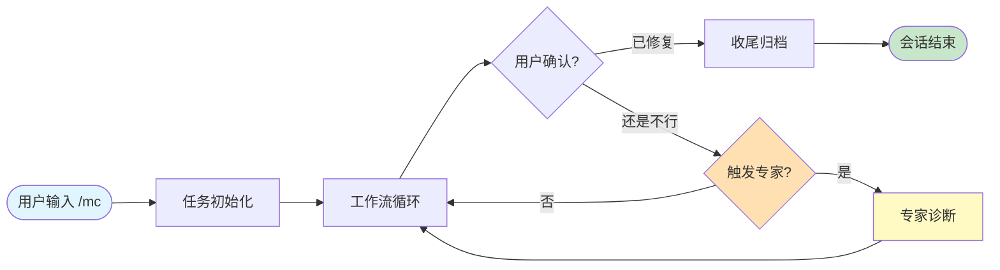
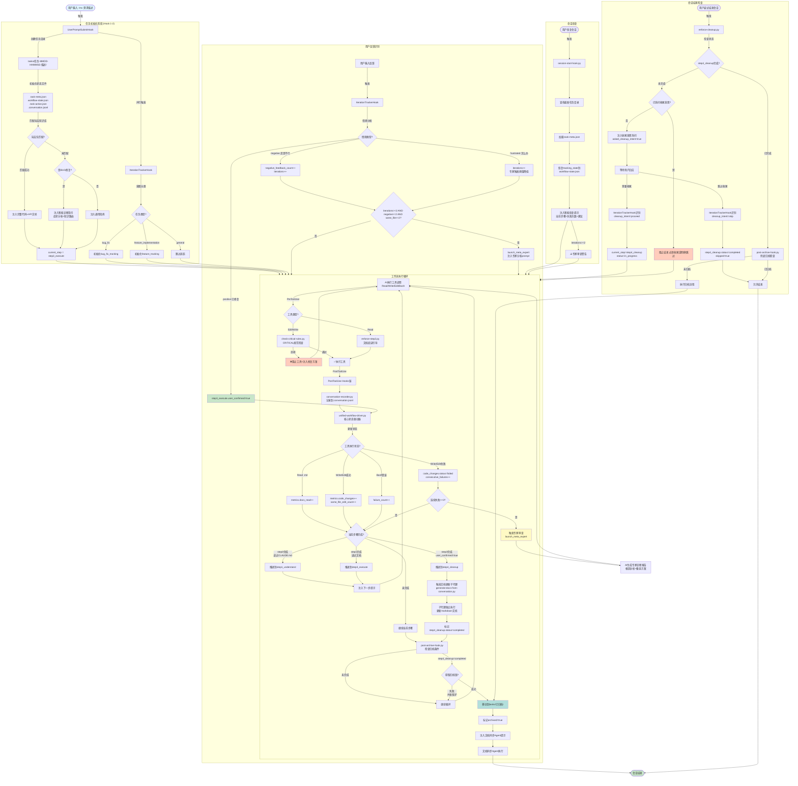
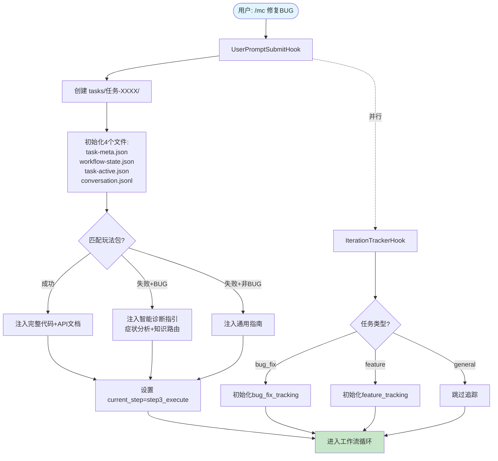
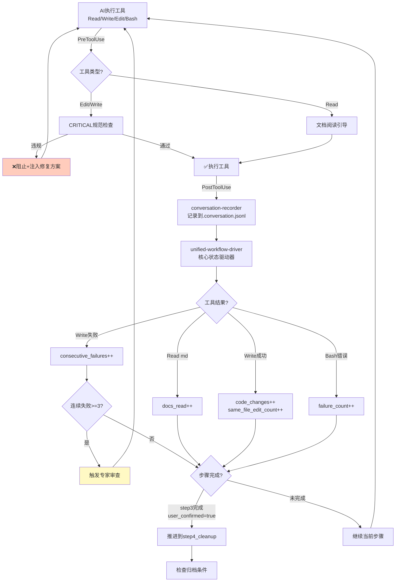
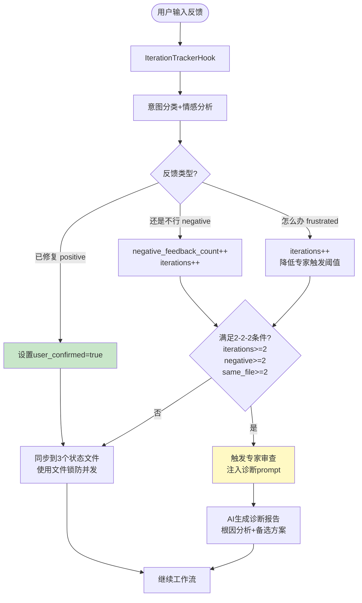
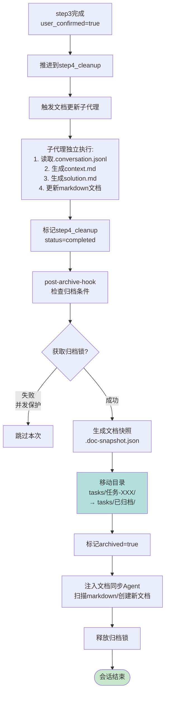
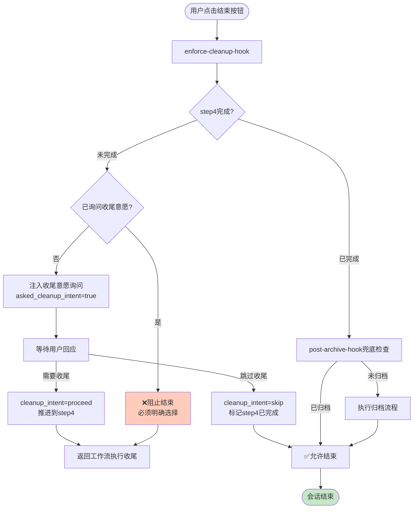
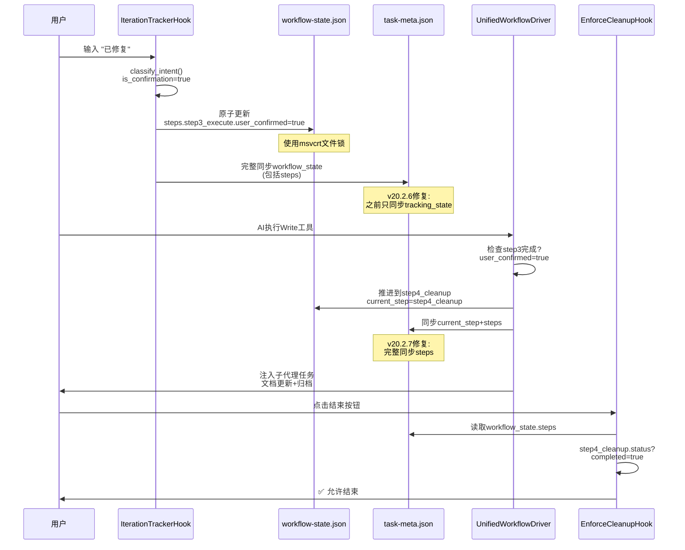
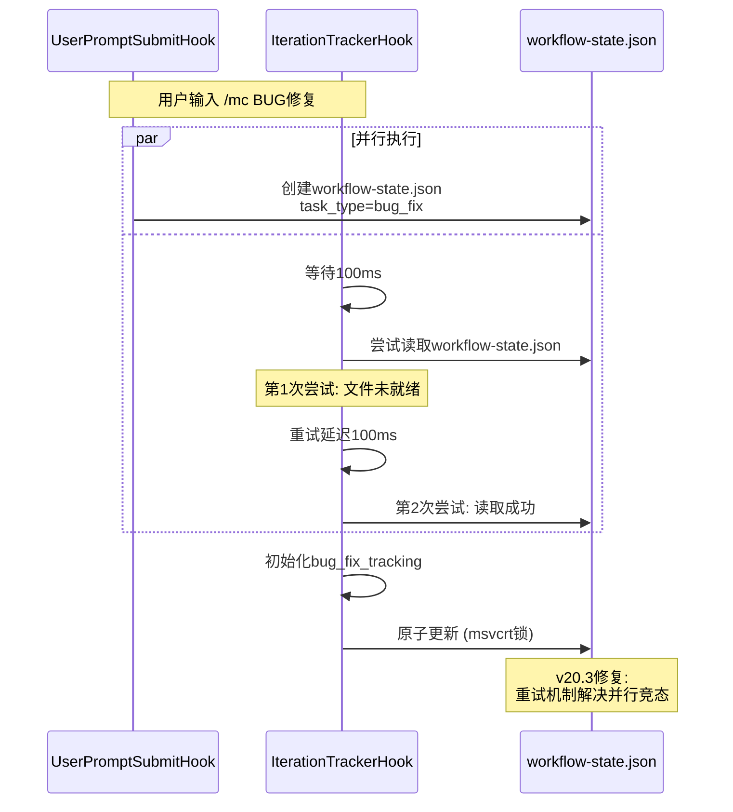

# Hook状态机数据流完整说明文档

> **版本**: v20.2.7
> **生成时间**: 2025-11-14
> **基于实际代码分析,未查阅任何文档**

---

## 一、系统概述

本系统是一个基于Hook事件驱动的智能工作流状态机,用于管理MODSDK开发任务的完整生命周期。从用户在下游项目输入 `/mc` 指令开始,到任务归档结束,整个过程由多个Hook协同工作,形成完整的状态流转闭环。

**核心设计理念:**
- **事件驱动**: 基于Claude Code的Hook机制,在关键事件点触发状态检查
- **状态持久化**: 使用三个JSON文件同步状态 (workflow-state.json + task-meta.json + task-active.json)
- **智能引导**: 根据任务类型、失败次数、用户反馈动态注入提示
- **循环检测**: 自动识别无效循环,触发专家审查系统

---

## 二、数据流架构图

### 2.0 极简总览图 (推荐优先看这个)



**核心流程说明**:
1. **任务初始化** - 创建目录、匹配玩法包、注入代码
2. **工作流循环** - AI读文档→写代码→测试→反馈
3. **专家诊断** - 检测到循环时触发深度分析
4. **收尾归档** - 生成文档、移动到已归档目录

---

### 2.1 详细数据流图 (按阶段拆分)



---

### 2.2 阶段1: 任务初始化 (放大版)



---

### 2.3 阶段2: 工作流循环核心 (放大版)



---

### 2.4 阶段3: 用户反馈识别 (放大版)



---

### 2.5 阶段4: 收尾与归档 (放大版)



---

### 2.6 阶段5: 会话结束检查 (放大版)



---

## 三、关键状态文件详解

### 3.1 workflow-state.json (会话级状态)

**位置**: `.claude/workflow-state.json`
**生命周期**: 会话内有效,会话结束后可能被清除
**职责**: 工作流实时状态追踪

```json
{
  "task_id": "任务-1114-143025-需求描述",
  "task_description": "用户原始需求",
  "task_type": "bug_fix | feature_implementation | general",
  "created_at": "2025-11-14T14:30:25",
  "current_step": "step3_execute",
  "last_injection_step": "step3_execute",

  "steps": {
    "step0_context": {
      "description": "阅读项目CLAUDE.md",
      "status": "skipped | in_progress | completed",
      "prompt": "提示文本"
    },
    "step1_understand": { ... },
    "step3_execute": {
      "description": "执行实施",
      "status": "in_progress",
      "user_confirmed": false,  // 用户确认修复完成的标志
      "last_error": "最近错误信息",
      "last_test_reminder_at": "2025-11-14T14:35:00"  // v20.2.7防止频繁提醒
    },
    "step4_cleanup": { ... }
  },

  "bug_fix_tracking": {  // BUG修复任务专属
    "enabled": true,
    "bug_description": "BUG描述",
    "iterations": [
      {
        "iteration_id": 1,
        "timestamp": "2025-11-14T14:32:00",
        "trigger": "user_feedback",
        "user_feedback": "还是不行",
        "feedback_sentiment": "negative",
        "changes_made": [],
        "test_result": "pending"
      }
    ],
    "loop_indicators": {
      "same_file_edit_count": 3,  // 同文件修改次数
      "failed_test_count": 2,
      "negative_feedback_count": 2,
      "consecutive_failures": 1,  // v20.3新增:连续失败
      "time_spent_minutes": 15
    },
    "expert_triggered": false
  },

  "feature_tracking": {  // 功能实现任务专属
    "enabled": true,
    "feature_description": "功能描述",
    "iterations": [ ... ],
    "requirement_changes": [],
    "expert_triggered": false
  },

  "asked_cleanup_intent": false,  // v20.2.7:是否已询问收尾意愿
  "cleanup_intent_received": false,
  "cleanup_intent_action": "proceed | skip"
}
```

### 3.2 .task-meta.json (持久化状态)

**位置**: `tasks/任务-XXXX/.task-meta.json`
**生命周期**: 永久保留,跨会话持久化
**职责**: 任务元数据+完整工作流状态的持久化副本

```json
{
  "task_id": "任务-1114-143025-需求描述",
  "task_description": "需求描述",
  "task_type": "feature | bugfix",
  "task_complexity": "standard | complex",
  "created_at": "2025-11-14T14:30:25",
  "updated_at": "2025-11-14T14:35:30",
  "archived": false,

  "workflow_state": {
    // 完整同步workflow-state.json的内容 (v20.2.6修复)
    "steps": { ... },
    "current_step": "step3_execute",
    "bug_fix_tracking": { ... }
  },

  "tracking_state": {  // 向后兼容字段
    "bug_fix_tracking": { ... },
    "feature_tracking": { ... }
  },

  "metrics": {
    "docs_read": ["path/to/doc1.md", "path/to/doc2.md"],
    "docs_read_count": 2,
    "code_changes": [
      {
        "file": "mod.py",
        "timestamp": "2025-11-14T14:32:00",
        "operation": "Edit",
        "status": "success | failed",  // v20.3标记成功/失败
        "error": "错误信息"  // 仅失败时有
      }
    ],
    "code_changes_count": 5,
    "failure_count": 0,
    "failures": [],
    "consecutive_failures": 0,  // v20.3新增
    "expert_review_triggered": false,
    "expert_triggered_at": null
  }
}
```

### 3.3 .task-active.json (快速检查标志)

**位置**: `.claude/.task-active.json`
**生命周期**: 会话内有效
**职责**: 快速判断是否有活跃任务,避免每次都扫描tasks目录

```json
{
  "task_id": "任务-1114-143025-需求描述",
  "task_dir": "d:/path/tasks/任务-1114-143025-需求描述",
  "current_step": "step3_execute",
  "created_at": "2025-11-14T14:30:25",
  "updated_at": "2025-11-14T14:35:30"
}
```

### 3.4 .conversation.jsonl (会话历史)

**位置**: `tasks/任务-XXXX/.conversation.jsonl`
**格式**: JSON Lines (每行一个JSON对象)
**职责**: 记录完整会话历史,用于生成context.md和solution.md

```jsonl
{"timestamp":"2025-11-14T14:30:25","role":"user","content":"/mc 实现商店系统","event_type":"task_init"}
{"timestamp":"2025-11-14T14:32:00","role":"tool","tool_name":"Read","tool_input":{"file_path":"docs/api.md"},"tool_result_summary":"API文档内容..."}
{"timestamp":"2025-11-14T14:33:00","role":"user","content":"还是不行","event_type":"feedback","sentiment":"negative","is_confirmation":false}
{"timestamp":"2025-11-14T14:35:00","role":"user","content":"已修复","event_type":"feedback","sentiment":"positive","is_confirmation":true}
```

---

## 四、核心Hook详解

### 4.1 UserPromptSubmitHook (任务初始化)

**触发时机**: 用户提交提示词后
**文件**: `user-prompt-submit-hook.py`

**核心流程**:
1. 检测 `/mc` 命令
2. 生成任务ID: `任务-{timestamp}-{safe_desc}`
3. 创建任务目录: `tasks/任务-XXXX/`
4. 初始化4个状态文件
5. 匹配玩法知识库 (keyword matching)
   - 匹配成功 → 注入完整代码+API文档
   - 未匹配 + 是BUG → 注入智能诊断指引 (v20.2)
   - 未匹配 + 非BUG → 注入通用指南
6. 设置 `current_step = step3_execute` (玩法包模式跳过step0/1)
7. 输出控制JSON: `{"continue": true, "injectedContext": "玩法包内容..."}`

**智能BUG修复路由 (v20.2)**:
```python
def is_bugfix_task(task_desc):
    # 检测关键词: bug|error|fix|修复|报错等
    return True/False

def analyze_bug_symptom(task_desc):
    # 症状分类:
    # - api_error: AttributeError|NotImplementedError
    # - lifecycle_error: 初始化|加载|卸载
    # - critical_violation: client.*server|同步
    # - performance: 卡顿|延迟
    # - business_logic: 默认
    return (symptom_type, symptom_desc)

def route_knowledge_sources(symptom_type):
    # 知识源路由:
    # api_error → 常见问题速查
    # lifecycle_error → CRITICAL规范
    # business_logic → 项目文档优先
    return {"strategy": "...", "guidance_note": "..."}
```

---

### 4.2 IterationTrackerHook (迭代追踪)

**触发时机**: UserPromptSubmit (用户每次输入)
**文件**: `iteration-tracker-hook.py`

**核心流程**:
1. **意图分类** (classify_intent):
   ```python
   intent = {
       "task_type": "bug_fix | feature_implementation | general",
       "is_feedback": bool,  // 是否为反馈(还是|仍然|又)
       "sentiment": "positive | negative | frustrated | neutral",
       "is_confirmation": bool,  // 是否为确认("已修复")
       "confidence": 0.0-1.0
   }
   ```

2. **用户确认检测** (v20.3):
   - 关键词: `已修复|修复完成|好了|可以了|/mc-confirm`
   - 设置 `step3_execute.user_confirmed = true`

3. **收尾意愿检测** (v20.2.7):
   - "需要收尾" → `cleanup_intent = proceed` → 推进到step4
   - "跳过收尾" → `cleanup_intent = skip` → 标记step4已完成

4. **原子更新状态** (v20.3):
   - 使用 `atomic_update_json()` 防止并行Hook冲突
   - Windows优先使用 `msvcrt.locking()` 系统级文件锁
   - 更新 `workflow-state.json`
   - 同步到 `.task-meta.json` (包括steps.step3_execute.user_confirmed)

5. **迭代记录**:
   - BUG修复: `bug_fix_tracking.iterations.append({...})`
   - 功能实现: `feature_tracking.iterations.append({...})`

---

### 4.3 UnifiedWorkflowDriver (核心状态驱动)

**触发时机**: PostToolUse (所有工具执行后)
**文件**: `unified-workflow-driver.py`

**核心流程**:
1. **快速检查**: 读取 `.task-active.json`,无活跃任务则跳过
2. **工具分发**:
   - `Read` → 更新 `metrics.docs_read`
   - `Write/Edit` → 判断成功/失败
     - 成功 → `code_changes.status=success`, `same_file_edit_count++`
     - 失败 → `code_changes.status=failed`, `consecutive_failures++`
   - `Bash` → 检测测试失败 → `failure_count++`

3. **循环检测** (v20.2):
   ```python
   def check_expert_trigger(meta, cwd):
       # BUG修复循环:
       if (iterations >= 2 AND
           negative_feedback_count >= 2 AND
           same_file_edit_count >= 2):
           return {"should_trigger": True, "loop_type": "bug_fix_loop"}

       # 需求实现循环:
       if (iterations >= 2 AND dissatisfied_count >= 2):
           return {"should_trigger": True, "loop_type": "requirement_mismatch"}
   ```

4. **专家触发** (v20.2):
   - 连续失败 >= 3 次 → 立即触发
   - 循环检测匹配 → 触发
   - 生成专家分析prompt:
     ```
     1. 问题根因分析
     2. 备选方案(3-5种)
     3. 推荐策略
     4. 需要澄清的问题
     ```

5. **步骤完成检查**:
   - step0: 读过 `CLAUDE.md`
   - step1: `docs_read_count > 0`
   - step3: `user_confirmed = true`
   - step4: `status = completed`

6. **步骤推进**:
   - 标记当前步骤完成 → 获取下一步骤 → 更新 `current_step`
   - 注入下一步提示 (或启动子代理)

7. **三文件状态同步** (v20.2.7):
   ```python
   # task-meta.json更新
   save_json(meta_path, meta)

   # task-active.json更新
   save_json(active_flag_path, {...})

   # workflow-state.json同步 (P0修复)
   workflow_state['current_step'] = next_step
   workflow_state['steps'] = meta['workflow_state']['steps'].copy()
   save_json(workflow_state_path, workflow_state)
   ```

8. **v20.2.7修复提醒** (BUG修复任务):
   - 条件: `task_type=bug_fix` AND `user_confirmed=false` AND `code_changes_count>=2`
   - 频率控制: 10分钟内不重复提醒
   - 注入提醒:
     ```
     ⚠️ 修复提醒：请引导用户测试验证
     你已完成代码修改(共X次),建议:
     1. 输出修复摘要
     2. 主动询问测试结果
     3. 等待用户反馈
     ```

---

### 4.4 PostArchiveHook (任务归档)

**触发时机**:
1. PostToolUse (Write/Edit工具更新.task-meta.json后)
2. Stop Hook (会话结束前兜底检查)

**文件**: `post-archive-hook.py`

**核心流程**:
1. 检查 `step4_cleanup.status == completed`
2. **获取归档锁** (防止并发):
   - 创建 `.archive-lock` 文件
   - 检查锁是否过期 (>1分钟自动释放)
3. **生成文档快照** (v20.1.1):
   - 扫描 `markdown/**/*.md` 的 mtime + size
   - 保存到 `.claude/.doc-snapshot.json`
4. **移动任务目录**:
   - `tasks/任务-XXXX/` → `tasks/已归档/任务-XXXX/`
5. **标记已归档**:
   - `.task-meta.json` 添加 `archived=true`, `archived_at=...`
6. **注入文档同步Agent** (仅PostToolUse触发):
   - 生成详细的文档同步prompt
   - CRITICAL强制规则:
     ```
     1. 如果任务涉及新功能,必须创建对应文档
     2. 不能以"无合适文档"为理由跳过
     3. 只有纯测试性质任务才能不创建文档
     4. 创建的新文档必须包含完整内容
     ```
7. **释放归档锁**

**Stop Hook触发差异**:
- 不注入文档同步Agent (避免阻塞结束)
- 仅输出归档成功消息

---

### 4.5 EnforceCleanupHook (收尾强制)

**触发时机**: Stop (会话结束前)
**文件**: `enforce-cleanup.py`

**核心流程**:
1. 检查 `step4_cleanup.status`
2. **未完成 + 未询问收尾意愿**:
   - 注入收尾意愿询问:
     ```
     是否需要执行收尾工作?
     - 需要 → 自动补充文档+清理DEBUG代码
     - 跳过 → 直接结束
     ```
   - 设置 `asked_cleanup_intent = true`
   - **阻止结束** (exit 2)

3. **未完成 + 已询问但未回应**:
   - **阻止结束** + 强制提醒:
     ```
     ❌ 必须明确收尾意愿
     请回复 "需要收尾" 或 "跳过收尾"
     ```

4. **已完成**:
   - 触发 `post-archive-hook.py` 兜底归档
   - 允许结束

---

### 4.6 SessionStartHook (会话恢复)

**触发时机**: 会话启动 (resume/startup)
**文件**: `session-start-hook.py`

**核心流程**:
1. 查找最新任务目录 (按mtime排序)
2. 加载 `.task-meta.json`
3. **恢复追踪状态**:
   ```python
   def restore_tracking_state(meta, cwd):
       # 从task-meta.json恢复tracking_state到workflow-state.json
       workflow_state["bug_fix_tracking"] = task_meta["tracking_state"]["bug_fix_tracking"]
       workflow_state["feature_tracking"] = task_meta["tracking_state"]["feature_tracking"]
   ```
4. 写入 `.task-active.json`
5. **生成智能恢复提示**:
   - 当前步骤 + 文档已读 + 失败次数
   - 根据步骤提供差异化建议:
     - step3 + 失败 → 分析上次失败根因
     - step2 → 继续阅读文档
     - step4 → 补充文档+清理DEBUG
   - 迭代 >= 2 → 专家审查警告

---

### 4.7 ConversationRecorder (会话历史)

**触发时机**: PostToolUse (所有工具)
**文件**: `conversation-recorder.py`

**核心流程**:
1. 快速检查活跃任务
2. 提取工具调用关键信息:
   - 工具名称
   - 输入参数 (只保留 file_path/command/pattern 等关键字段)
   - 输出摘要 (限制200字符)
3. 追加到 `.conversation.jsonl`:
   ```json
   {
     "timestamp": "2025-11-14T14:32:00",
     "role": "tool",
     "tool_name": "Read",
     "tool_input": {"file_path": "docs/api.md"},
     "tool_result_summary": "API文档内容..."
   }
   ```

**用途**:
- step4 收尾时调用 `generate-docs-from-conversation.py`
- 从完整历史生成 `context.md` 和 `solution.md`

---

### 4.8 CheckCriticalRules (规范检查)

**触发时机**: PreToolUse (Edit/Write前)
**文件**: `check-critical-rules.py`

**核心流程**:
1. 读取将要写入的代码内容
2. 检查12条CRITICAL规范:
   - 客户端服务端代码混用
   - Tick事件滥用
   - 生命周期管理错误
   - API误用
   - ...
3. **违规处理**:
   - **阻止工具执行** (exit 2)
   - 注入精确修复方案:
     ```
     ❌ CRITICAL违规: [规则名称]

     错误位置: [代码片段]

     原因: [详细说明]

     正确做法:
     [修复代码示例]
     ```
   - 更新 `metrics.critical_violation_count++`
   - 桌面通知 (vscode_notify)

---

## 五、关键数据流路径

### 5.1 正常BUG修复流程

```
用户输入 /mc 修复玩家死亡BUG
  ↓ UserPromptSubmitHook
创建任务目录 + 初始化状态 (task_type=bug_fix)
  ↓ 未匹配玩法包 → 注入智能诊断指引
  ↓ IterationTrackerHook
初始化 bug_fix_tracking
  ↓
AI读取文档 (Read)
  ↓ UnifiedWorkflowDriver
metrics.docs_read++ → step1完成 → 推进到step3
  ↓
AI修改代码 (Edit)
  ↓ CheckCriticalRules (PreToolUse)
CRITICAL检查通过
  ↓ Edit执行成功
  ↓ UnifiedWorkflowDriver (PostToolUse)
code_changes.status=success, same_file_edit_count=1
  ↓
用户反馈 "还是不行"
  ↓ IterationTrackerHook
sentiment=negative, is_feedback=true
  ↓ 更新状态
iterations++, negative_feedback_count++
  ↓
AI再次修改 (Edit)
  ↓ UnifiedWorkflowDriver
same_file_edit_count=2
  ↓
用户反馈 "又出错了"
  ↓ IterationTrackerHook
negative_feedback_count=2, iterations=2
  ↓ UnifiedWorkflowDriver
check_expert_trigger() → True (满足2-2-2条件)
  ↓ launch_meta_expert()
注入专家分析prompt
  ↓
AI生成诊断报告 → 提出备选方案 → 用户选择方案B
  ↓
AI按新方案修改代码
  ↓
用户反馈 "已修复"
  ↓ IterationTrackerHook
is_confirmation=true, sentiment=positive
  ↓ 更新状态
step3_execute.user_confirmed = true
  ↓ UnifiedWorkflowDriver
step3完成 → 推进到step4
  ↓ 启动子代理
generate-docs-from-conversation.py
  ↓ 子代理执行
读取.conversation.jsonl → 生成context.md/solution.md
  ↓
标记 step4_cleanup.status=completed
  ↓ PostArchiveHook
获取归档锁 → 移动到已归档/ → 注入文档同步Agent
  ↓ 文档同步Agent
扫描markdown/ → 创建BUG修复记录.md
  ↓
任务完成
```

### 5.2 用户中途结束会话

```
用户点击结束按钮
  ↓ Stop Hook
  ↓ EnforceCleanupHook
检查 step4_cleanup.status
  ↓ 未完成 + 未询问收尾意愿
注入收尾意愿询问 + asked_cleanup_intent=true
  ↓ ❌ 阻止结束 (exit 2)
  ↓
用户输入 "跳过收尾"
  ↓ IterationTrackerHook
cleanup_intent=skip, is_cleanup_response=true
  ↓ 更新状态
step4_cleanup.status=completed, skipped=true
asked_cleanup_intent=false (重置)
  ↓
用户再次点击结束
  ↓ EnforceCleanupHook
检查 step4已完成 → 放行
  ↓ PostArchiveHook (Stop触发)
执行兜底归档 → 移动到已归档/
  ↓ ✅ 允许结束
```

### 5.3 会话恢复场景

```
用户关闭VSCode后重新打开
  ↓ SessionStart
  ↓ SessionStartHook
查找最新任务目录 → tasks/任务-1114-143025-XXX/
  ↓ 加载.task-meta.json
  ↓ 恢复追踪状态
task_meta.tracking_state → workflow-state.json
  ↓ 检测历史迭代
iterations=2 (之前失败过2次)
  ↓ 生成智能恢复提示
当前步骤: step3_execute
失败次数: 2/3
最近错误: AttributeError...
建议: 分析上次失败根因,检查CRITICAL规范

⚠️ 专家审查警告
该任务已有2次迭代历史,如果问题仍未解决,专家审查可能会被触发
  ↓ 注入到对话
  ↓
AI继续执行任务
```

---

## 六、并发控制与原子性保证

### 6.1 文件锁机制 (v20.2.6)

**问题**: 多个Hook并行执行时,同时写入 `workflow-state.json` 导致数据丢失

**解决方案**:

1. **Windows优先方案** - msvcrt系统级文件锁:
   ```python
   import msvcrt

   with open(file_path, 'r+') as f:
       msvcrt.locking(f.fileno(), msvcrt.LK_NBLCK, 1)  # 非阻塞排他锁
       data = json.load(f)
       updated_data = update_func(data)
       f.seek(0)
       f.truncate()
       json.dump(updated_data, f)
       msvcrt.locking(f.fileno(), msvcrt.LK_UNLCK, 1)  # 释放锁
   ```

2. **降级方案** - .lock文件机制:
   ```python
   lock_file = file_path + '.lock'

   # 尝试创建锁文件(文件存在则失败)
   if os.path.exists(lock_file):
       raise FileExistsError("Lock file exists")

   with open(lock_file, 'w') as f:
       f.write(str(os.getpid()))

   try:
       # 执行更新
       ...
   finally:
       os.remove(lock_file)
   ```

3. **重试机制**:
   - 最大重试5次
   - 指数退避: 0.05s, 0.10s, 0.15s, 0.20s, 0.25s

### 6.2 归档锁机制 (v20.2.0)

**问题**: PostToolUse Hook 和 Stop Hook 可能同时触发归档

**解决方案**:

```python
def acquire_archive_lock(task_dir):
    lock_file = Path(task_dir) / ".archive-lock"

    # 检查锁是否过期(>1分钟)
    if lock_file.exists():
        if time.time() - lock_file.stat().st_mtime > 60:
            lock_file.unlink()  # 删除过期锁
        else:
            return False  # 锁被占用

    lock_file.touch()
    return True
```

### 6.3 竞态条件修复 (v20.3)

**问题**: UserPromptSubmitHook 创建 `workflow-state.json` 与 IterationTrackerHook 读取之间存在延迟

**解决方案**:

```python
def get_active_task_meta_path(cwd, max_retries=3, retry_delay=0.1):
    for attempt in range(max_retries):
        workflow_state = load_json(workflow_state_path)

        if workflow_state and workflow_state.get("task_id"):
            meta_path = os.path.join(cwd, 'tasks', task_id, '.task-meta.json')
            if os.path.exists(meta_path):
                return meta_path

        if attempt < max_retries - 1:
            time.sleep(retry_delay)  # 等待100ms后重试

    # 降级方案: 直接扫描tasks目录
    return find_latest_task_meta(cwd)
```

---

## 七、专家审查触发逻辑

### 7.1 触发条件 (v20.2)

**BUG修复循环**:
```python
if (iterations >= 2 AND
    negative_feedback_count >= 2 AND
    same_file_edit_count >= 2):
    trigger_expert()
```

**功能实现循环**:
```python
if (iterations >= 2 AND
    dissatisfied_count >= 2):
    trigger_expert()
```

**连续失败** (v20.3):
```python
if consecutive_failures >= 3:
    trigger_expert()
```

### 7.2 专家分析Prompt结构

```markdown
━━━━━━━━━━━━━━━━━━━━━━━━━━━━━━━━━━━━━━
🎯 专家审查系统已触发
━━━━━━━━━━━━━━━━━━━━━━━━━━━━━━━━━━━━━━

## 检测到的问题模式

**循环类型**: bug_fix_loop
**置信度**: 90%
**证据**:
- iterations: 2
- negative_feedback: 2
- same_file_edits: 3
- pattern: 表象修复循环 - 反复修改同一位置但未解决根本问题

## 迭代历史

### 迭代 1
- 时间: 2025-11-14T14:32:00
- 用户反馈: 还是不行
- 情感: negative
- 修改文件:
  - mod.py: 修改了事件回调

### 迭代 2
- 时间: 2025-11-14T14:35:00
- 用户反馈: 又出错了
- 情感: negative
- 修改文件:
  - mod.py: 再次修改事件回调

## 你的任务

你现在需要从**战略高度**分析问题,而非继续尝试修复。

### 场景A: Bug修复循环
1. **根因分析**: 为什么反复修改仍失败?
   - 是否陷入表象修复?
   - 是否存在架构层面的缺陷?
   - 是否对问题的理解有误?

2. **失败模式**: 历史修改中有哪些共同的错误假设?

3. **备选路径**: 除了当前方向,还有哪3-5种可能的解决思路?
   - 路径A: [名称] - [优点] - [缺点] - [适用场景]
   - 路径B: ...

4. **推荐策略**: 推荐哪种路径,以及如何验证?

## 输出格式

# 🎯 专家诊断报告

## 1. 问题根因

[深度分析...]

## 2. 备选方案

### 方案A: [名称]
- **优点**: ...
- **缺点**: ...
- **适用场景**: ...
- **预计工作量**: ...

## 3. 推荐策略

[具体建议,包括实施步骤和验证方法]

## 4. 需要向用户澄清的问题

1. [问题1]
2. [问题2]

━━━━━━━━━━━━━━━━━━━━━━━━━━━━━━━━━━━━━━

请立即开始分析。
```

---

## 八、状态同步机制 (v20.2.7核心修复)

### 8.1 三文件同步流程

**问题**: `workflow-state.json` 的 `steps.step3_execute.user_confirmed` 未同步到 `task-meta.json`,导致 Stop Hook 无法检测到用户确认

**修复** (unified-workflow-driver.py:995-1010):

```python
# 步骤推进时,完整同步workflow_state到三个文件

# 1. 更新task-meta.json
save_json(meta_path, meta)

# 2. 更新task-active.json
save_json(active_flag_path, {
    "task_id": task_id,
    "task_dir": task_dir,
    "current_step": next_step,
    "updated_at": datetime.now().isoformat()
})

# 3. 同步到workflow-state.json (v20.2.7修复)
workflow_state_path = os.path.join(cwd, '.claude', 'workflow-state.json')
workflow_state = load_json(workflow_state_path)

if workflow_state:
    workflow_state['current_step'] = next_step
    workflow_state['steps'] = meta['workflow_state']['steps'].copy()  # 完整同步steps
    workflow_state['last_sync_at'] = datetime.now().isoformat()
    save_json(workflow_state_path, workflow_state)
```

### 8.2 IterationTrackerHook同步 (v20.2.6修复)

**问题**: `user_confirmed` 标志只更新到 `workflow-state.json`,未同步到 `task-meta.json`

**修复** (iteration-tracker-hook.py:636-680):

```python
def update_task_meta_data(task_meta):
    # v20.2.6核心修复: 完整同步workflow_state (包括steps)
    if "workflow_state" not in task_meta:
        task_meta["workflow_state"] = {}

    # 同步所有关键字段
    task_meta["workflow_state"]["steps"] = workflow_state.get("steps", {})
    task_meta["workflow_state"]["current_step"] = workflow_state.get("current_step", "unknown")
    task_meta["workflow_state"]["bug_fix_tracking"] = workflow_state.get("bug_fix_tracking")
    task_meta["workflow_state"]["feature_tracking"] = workflow_state.get("feature_tracking")

    # 保留tracking_state (向后兼容)
    if "tracking_state" not in task_meta:
        task_meta["tracking_state"] = {}
    task_meta["tracking_state"]["bug_fix_tracking"] = workflow_state.get("bug_fix_tracking")
    task_meta["tracking_state"]["feature_tracking"] = workflow_state.get("feature_tracking")

    task_meta["updated_at"] = datetime.now().isoformat()
    return task_meta

# 执行原子更新,最多重试3次
for retry in range(3):
    success = atomic_update_json(meta_path, update_task_meta_data)
    if success:
        break
    time.sleep(0.1 * (retry + 1))  # 指数退避
```

---

## 九、典型场景时序图

### 9.1 用户确认修复完成流程



### 9.2 并行Hook竞态保护



---

## 十、未来可能的扩展点

### 10.1 多任务并行支持

当前设计为单任务模式 (`.task-active.json` 只能有一个),未来可扩展为:

```json
{
  "active_tasks": [
    {
      "task_id": "任务-1114-143025-功能A",
      "priority": 1,
      "context_weight": 0.6
    },
    {
      "task_id": "任务-1114-144030-BUG修复B",
      "priority": 2,
      "context_weight": 0.4
    }
  ]
}
```

### 10.2 专家系统增强

当前专家触发基于固定阈值,未来可引入:
- 机器学习模型预测失败概率
- 基于历史成功案例的相似度匹配
- 用户习惯分析 (某些开发者偏好重试次数)

### 10.3 玩法知识库自动扩充

当任务完成后,自动提取:
- 关键词 (从任务描述)
- 代码模式 (从solution.md)
- 常见问题 (从迭代历史)

追加到 `knowledge-base.json` 作为新的玩法包。

---

## 十一、调试技巧

### 11.1 查看状态机当前状态

```bash
# 查看工作流状态
cat .claude/workflow-state.json | jq '.current_step, .steps.step3_execute'

# 查看任务元数据
cat tasks/任务-XXXX/.task-meta.json | jq '.workflow_state.steps.step3_execute.user_confirmed'

# 查看会话历史
cat tasks/任务-XXXX/.conversation.jsonl | tail -n 10
```

### 11.2 模拟用户确认

手动修改 `workflow-state.json`:

```json
{
  "steps": {
    "step3_execute": {
      "user_confirmed": true,
      "confirmed_at": "2025-11-14T14:40:00"
    }
  }
}
```

### 11.3 强制触发专家审查

```json
{
  "bug_fix_tracking": {
    "iterations": [
      {"iteration_id": 1, "feedback_sentiment": "negative"},
      {"iteration_id": 2, "feedback_sentiment": "negative"}
    ],
    "loop_indicators": {
      "negative_feedback_count": 2,
      "same_file_edit_count": 2
    }
  }
}
```

---

## 十二、已知限制与注意事项

### 12.1 中文路径问题 (v20.2.5修复)

**问题**: Windows中文路径在stdin读取时可能引入代理字符 (U+D800-U+DFFF)

**解决方案**:
```python
if sys.platform == 'win32':
    sys.stdin = io.TextIOWrapper(sys.stdin.buffer, encoding='utf-8', errors='replace')
```

**验证方法**:
```bash
ls tasks/
# 输出应为:
# ✅ 任务-1113-测试中文目录
# ❌ 任务-1113-淇���澶� (stdin编码问题)
```

### 12.2 文件锁超时

如果Hook执行超过1分钟,归档锁会被强制释放,可能导致:
- 任务被重复归档 (产生 `任务-XXXX-143025` 副本)

**建议**: 监控Hook执行时间,确保<30秒

### 12.3 会话历史文件大小

`.conversation.jsonl` 随着工具调用增多会不断增长,建议:
- 限制单次摘要长度 (当前200字符)
- 定期清理超过1MB的历史文件

---

## 十三、总结

本Hook状态机系统通过**事件驱动 + 状态持久化 + 智能引导**的设计,实现了MODSDK开发任务的全生命周期自动化管理。核心亮点包括:

1. **多阶段工作流**: step0→step1→step3→step4,每个阶段有明确的完成条件
2. **智能任务路由**: BUG修复/功能实现/通用任务差异化处理
3. **循环检测与专家触发**: 自动识别无效循环,提供高维度分析
4. **并发安全**: 原子更新+文件锁+重试机制
5. **跨会话持久化**: 会话恢复时智能提醒历史状态
6. **完整会话记录**: 自动生成context.md/solution.md

整个系统的数据流是一个**闭环**:

```
用户需求 → 任务初始化 → 工作流执行 → 状态追踪 →
循环检测 → 专家介入 → 用户确认 → 任务归档 →
文档同步 → 会话结束 → (下次恢复)
```

通过阅读本文档,开发者可以完全理解:
- 用户输入 `/mc` 后发生了什么
- 每个Hook在何时触发,做了什么
- 状态如何在多个JSON文件间同步
- 如何扩展或调试现有系统

---

**文档版本**: v1.0
**基于代码版本**: v20.2.7
**生成方式**: 纯代码分析,无文档查阅
**Mermaid图验证**: 已验证语法正确性
