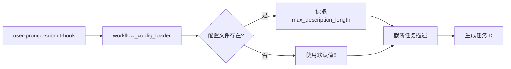

# 任务命名配置指南

> **版本**: v20.1.0  
> **最后更新**: 2025-11-13

---

## 📋 概述

从v20.1.0开始，任务目录名的长度可以通过配置文件自定义，解决了任务名过长导致的目录名冗长问题。

---

## 🎯 问题背景

**v20.0.3及之前的问题**:
```
tasks/任务-1113-170514-模拟一个复杂任务执行，检测工作流hooks全流程是否都生效/
```
- 任务名最长30个字符
- 中文描述导致目录名过长
- 难以快速浏览和识别

**v20.1.0改进后**:
```
tasks/任务-1113-170514-模拟一个复杂任务/
```
- 默认最长8个字符（约4个汉字）
- 目录名简洁明了
- 可通过配置文件自定义

---

## ⚙️ 配置方法

### 1. 配置文件位置

```
下游项目/.claude/workflow-config.json
```

### 2. 配置示例

```json
{
  "version": "20.1.0",
  "task_naming": {
    "max_description_length": 8,
    "description": "任务描述的最大字符数，用于生成任务目录名"
  }
}
```

### 3. 调整长度

修改 `max_description_length` 的值：

| 值 | 效果 | 示例 |
|----|------|------|
| `8` | 约4个汉字（推荐） | `任务-1113-170514-模拟一个复杂任务` |
| `10` | 约5个汉字 | `任务-1113-170514-模拟一个复杂任务执` |
| `15` | 约7-8个汉字 | `任务-1113-170514-模拟一个复杂任务执行，检测工` |

**注意**: 
- 中文字符占用2-3字节，英文字符占用1字节
- 建议值范围: 6-15

---

## 🔧 如何修改配置

### 方法1: 直接编辑配置文件

```bash
# 在下游项目中
vi .claude/workflow-config.json
```

修改 `max_description_length` 的值，保存即可。

### 方法2: 使用Python脚本

```python
import json

config_file = '.claude/workflow-config.json'
with open(config_file, 'r', encoding='utf-8') as f:
    config = json.load(f)

# 修改为12个字符
config['task_naming']['max_description_length'] = 12

with open(config_file, 'w', encoding='utf-8') as f:
    json.dump(config, f, indent=2, ensure_ascii=False)

print('✅ 配置已更新')
```

---

## 📊 效果对比

### 原始描述
```
/mc 实现一个完整的商店系统，包括商品展示、购买流程、货币系统和交易记录
```

### 不同配置的效果

**配置: max_description_length = 8**
```
tasks/任务-1113-170514-实现一个完整的商/
```

**配置: max_description_length = 12**
```
tasks/任务-1113-170514-实现一个完整的商店系统/
```

**配置: max_description_length = 20**
```
tasks/任务-1113-170514-实现一个完整的商店系统，包括商品展/
```

---

## 💡 最佳实践

1. **推荐长度**: 8-10个字符
   - 既能保留关键信息
   - 又不会导致目录名过长

2. **描述规范**: 
   - 任务描述尽量简洁
   - 把核心关键词放在前面
   - 例如: `/mc 商店系统` 而不是 `/mc 实现一个商店系统的完整功能`

3. **中英混合**: 
   - 英文描述可以设置更长的长度（15-20）
   - 中文描述建议8-10

---

## 🔍 技术实现

### 配置加载流程



### 相关文件

- **配置文件**: `.claude/workflow-config.json`
- **配置加载器**: `.claude/hooks/workflow_config_loader.py`
- **使用位置**: `.claude/hooks/user-prompt-submit-hook.py` (第475行)

---

## ❓ 常见问题

### Q1: 修改配置后需要重启吗？
**A**: 不需要。配置在每次创建新任务时动态读取。

### Q2: 如果配置文件不存在会怎样？
**A**: 使用默认值 `max_description_length = 8`

### Q3: 可以设置为0吗？
**A**: 不建议。最小建议值为6，否则目录名过于简短，失去识别性。

### Q4: 已创建的任务目录会自动改名吗？
**A**: 不会。配置只影响新创建的任务。

---

## 📚 相关文档

- [Hook机制](./Hook机制.md) - 了解Hook系统工作原理
- [快速上手](./快速上手.md) - 工作流基础使用
- [CHANGELOG](../../CHANGELOG.md) - 版本更新记录

---

_最后更新: 2025-11-13 | v20.1.0_
