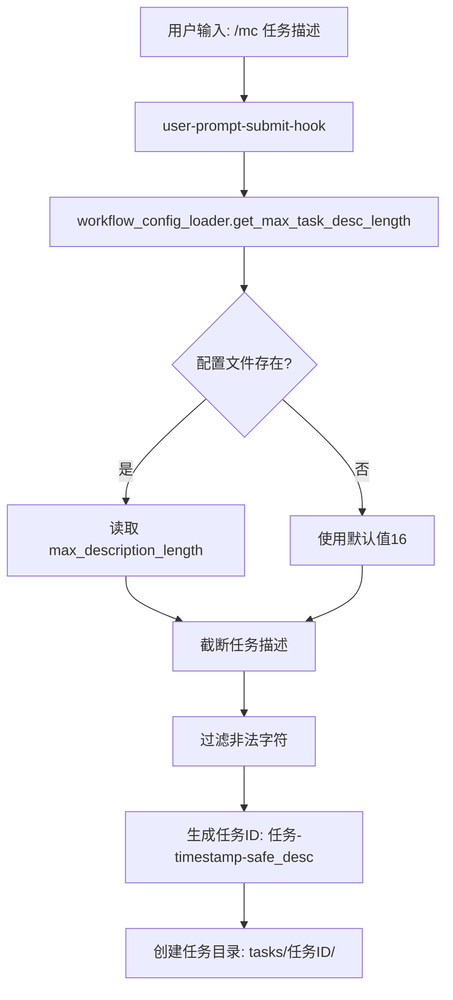

# 任务命名配置指南

> **版本**: v20.2.7+
> **最后更新**: 2025-11-15

> ⚠️ **v21.0架构变更提示**:
> - `user-prompt-submit-hook.py` → `orchestrator/user_prompt_handler.py`
> - `workflow_config_loader.py` → `utils/config_loader.py`
> - 功能逻辑保持不变，仅路径调整

---

## 📋 概述

从v20.1.0开始，任务目录名的长度可以通过配置文件自定义。v20.2.7将默认值从8字符提升到16字符，提供更好的任务可读性。

---

## 🎯 问题背景与演进

**v20.0.3及之前的问题**:
```
tasks/任务-1113-170514-模拟一个复杂任务执行，检测工作流hooks全流程是否都生效/
```
- 任务名最长30个字符
- 中文描述导致目录名过长
- 难以快速浏览和识别

**v20.1.0 - v20.2.6 (默认8字符)**:
```
tasks/任务-1113-170514-模拟一个复杂任务/
```
- 默认最长8个字符（约4个汉字）
- 目录名简洁但信息量不足

**v20.2.7+ (默认16字符，推荐)**:
```
tasks/任务-1114-023644-修复玩家死亡时背包物品未掉/
```
- 默认最长16个字符（约8个汉字）
- 兼顾可读性与简洁性
- 可通过配置文件自定义

---

## ⚙️ 配置方法

### 1. 配置文件位置

在下游项目初始化后，配置文件位于：
```
<下游项目>/.claude/workflow-config.json
```

**注意**：
- 配置文件在首次运行 `initmc` 时自动创建
- 模板源文件：`templates/.claude/workflow-config.json`

### 2. 默认配置 (v20.2.7+)

```json
{
  "version": "20.2.7",
  "task_naming": {
    "max_description_length": 16,
    "description": "任务描述的最大字符数，用于生成任务目录名（中文约16字符）",
    "examples": {
      "16": "修复玩家死亡时背包物品未掉落的BUG → 任务-1114-023644-修复玩家死亡时背包物品未掉",
      "10": "修复玩家死亡时背包物品未掉落的BUG → 任务-1114-023644-修复玩家死亡时背",
      "8": "修复玩家死亡时背包物品未掉落的BUG → 任务-1114-023644-修复玩家死亡"
    }
  }
}
```

### 3. 调整长度

修改 `max_description_length` 的值：

| 值 | 效果 | 示例 |
|----|------|------|
| `16` | 约8个汉字（v20.2.7+推荐） | `任务-1114-023644-修复玩家死亡时背包物品未掉` |
| `12` | 约6个汉字 | `任务-1114-023644-修复玩家死亡时背包` |
| `8` | 约4个汉字（v20.1.0默认） | `任务-1114-023644-修复玩家死亡` |

**注意**:
- 1个汉字 ≈ 2字符，1个英文字母 = 1字符
- 建议值范围: 8-20
- 过短会失去识别性，过长会导致目录名冗长

---

## 🔧 如何修改配置

### 方法1: 直接编辑配置文件（推荐）

```bash
# 在下游项目中编辑
vi .claude/workflow-config.json

# 或使用任意文本编辑器
code .claude/workflow-config.json
```

修改 `task_naming.max_description_length` 的值，保存即可。

**示例**：
```json
{
  "version": "20.2.7",
  "task_naming": {
    "max_description_length": 20  // 从16改为20
  }
}
```

### 方法2: 使用Python脚本批量修改

```python
import json
import os

# 定位到下游项目根目录
config_file = '.claude/workflow-config.json'

if not os.path.exists(config_file):
    print('❌ 配置文件不存在，请先运行 initmc')
    exit(1)

with open(config_file, 'r', encoding='utf-8') as f:
    config = json.load(f)

# 修改为12个字符
config['task_naming']['max_description_length'] = 12

with open(config_file, 'w', encoding='utf-8') as f:
    json.dump(config, f, indent=2, ensure_ascii=False)

print('✅ 配置已更新: max_description_length = 12')
```

### 配置生效时机

**重要**：
- 配置修改后**立即生效**，无需重启Claude或VSCode
- 每次创建新任务（`/mc`命令）时，Hook会动态读取最新配置
- 已创建的任务目录名**不会**自动更新

---

## 📊 效果对比

### 原始描述
```
/mc 实现一个完整的商店系统，包括商品展示、购买流程、货币系统和交易记录
```

### 不同配置的效果

**配置: max_description_length = 8 (v20.1.0-v20.2.6默认)**
```
tasks/任务-1113-170514-实现一个完整的商/
```
- 过于简短，难以识别任务内容

**配置: max_description_length = 16 (v20.2.7+默认，推荐)**
```
tasks/任务-1113-170514-实现一个完整的商店系统，包括商/
```
- 兼顾可读性与简洁性
- 适合大多数场景

**配置: max_description_length = 24 (自定义)**
```
tasks/任务-1113-170514-实现一个完整的商店系统，包括商品展示、购买流程、/
```
- 信息充足，但目录名较长
- 适合详细描述的需求

---

## 💡 最佳实践

1. **推荐长度**：16字符（v20.2.7+默认值）
   - 兼顾可读性与简洁性
   - 适合大多数场景
   - 如需更详细描述，可调整为20-24

2. **描述规范**：
   - 任务描述尽量简洁精炼
   - 把核心关键词放在前面
   - 优先级：`核心功能 > 细节描述 > 修饰词`
   - 示例对比：
     - ✅ 好：`/mc 修复背包物品未掉落BUG` → `任务-1114-023644-修复背包物品未掉落BU`
     - ❌ 差：`/mc 修复玩家在死亡时背包物品未掉落的问题` → `任务-1114-023644-修复玩家在死亡时背包物品`

3. **中英混合**：
   - 纯英文描述可以设置更长（20-30字符）
   - 纯中文描述建议16字符（约8个汉字）
   - 中英混合建议16-20字符

4. **特殊字符处理**：
   - 系统自动过滤非法字符：`/ \ : * ? " < > |`
   - 非法字符会被替换为 `-`
   - 建议避免使用特殊符号

---

## 🔍 技术实现

### 任务ID生成逻辑

**位置** (v21.0): `templates/.claude/hooks/orchestrator/user_prompt_handler.py`

```python
# 生成任务ID - v20.2.5: 尝试保留中文，依赖stdin编码修复
timestamp = datetime.now().strftime('%m%d-%H%M%S')
max_desc_length = get_max_task_desc_length(cwd)  # 从配置加载
safe_desc = task_desc[:max_desc_length]          # 截断描述
for char in ['/', '\\', ':', '*', '?', '"', '<', '>', '|']:
    safe_desc = safe_desc.replace(char, '-')     # 过滤非法字符
task_id = u"任务-{}-{}".format(timestamp, safe_desc)
```

**格式说明**：
```
任务-{timestamp}-{safe_desc}
```
- `timestamp`: `%m%d-%H%M%S` 格式（月日-时分秒）
- `safe_desc`: 截断并过滤后的任务描述

### 配置加载流程

**位置** (v21.0): `templates/.claude/hooks/utils/config_loader.py`

```python
def get_max_task_desc_length(project_path=None):
    """快速获取任务描述最大长度"""
    config = load_config(project_path)
    return config['task_naming']['max_description_length']

def load_config(project_path=None):
    """加载工作流配置，支持默认值降级"""
    config_file = os.path.join(project_path, '.claude', 'workflow-config.json')

    if os.path.exists(config_file):
        with open(config_file, 'r', encoding='utf-8') as f:
            config = json.load(f)
            return merge_config(DEFAULT_CONFIG, config)  # 合并默认配置
    else:
        return DEFAULT_CONFIG.copy()  # 使用默认值16
```

**默认值定义**（Line 11-14）：
```python
DEFAULT_CONFIG = {
    "task_naming": {
        "max_description_length": 16  # v20.2.7: 从8提升到16字符
    }
}
```

### 执行流程图



### 相关文件

| 文件 | 作用 |
|------|------|
| `templates/.claude/workflow-config.json` | 配置模板（默认值：16） |
| `templates/.claude/hooks/utils/config_loader.py` (v21.0) | 配置加载器模块 |
| `templates/.claude/hooks/orchestrator/user_prompt_handler.py` (v21.0) | Hook入口（任务初始化调用配置） |
| `<下游项目>/.claude/workflow-config.json` | 下游项目配置（可自定义） |

---

## ❓ 常见问题

### Q1: 修改配置后需要重启吗？
**A**: 不需要。配置在每次创建新任务时动态读取，修改后立即生效。

### Q2: 如果配置文件不存在会怎样？
**A**: 使用默认值 `max_description_length = 16` (v20.2.7+)，系统自动降级，不会报错。

### Q3: 可以设置为0或负数吗？
**A**: 技术上可以，但不建议：
- 设置为0会导致任务目录名只有时间戳，完全失去识别性
- 最小建议值为8（约4个汉字）
- 负数会导致异常，请避免

### Q4: 已创建的任务目录会自动改名吗？
**A**: 不会。配置只影响**新创建**的任务，已存在的任务目录名不会变化。

### Q5: 配置文件损坏或格式错误怎么办？
**A**: 系统会自动降级到默认值（16字符），并在stderr输出警告信息，不会阻塞任务创建。

### Q6: 为什么v20.2.7将默认值从8改为16？
**A**: 基于实际使用反馈：
- 8字符过短，约4个汉字，难以识别任务内容
- 16字符兼顾可读性与简洁性，约8个汉字
- 实际案例：`修复玩家死亡时背包物品未掉` 比 `修复玩家死亡` 更清晰

### Q7: 中文路径会导致乱码吗？
**A**: v20.2.5已修复Windows中文路径问题：
- Hook启动时强制使用UTF-8编码（Line 28-31）
- 系统完全支持中文任务目录名
- 如遇乱码，请升级至v20.2.5+

---

## 📚 相关文档

- [Hook机制](./Hook机制.md) - 了解Hook系统工作原理
- [快速上手](./快速上手.md) - 工作流基础使用
- [技术架构](./技术架构.md) - 系统架构与模块划分
- [CHANGELOG](../../CHANGELOG.md) - 版本更新记录

---

## 📝 更新历史

| 版本 | 日期 | 变更内容 |
|------|------|----------|
| v20.2.10 | 2025-11-14 | 文档全面更新，补充实际实现细节与代码示例 |
| v20.2.7 | 2025-11-13 | 默认值从8字符提升到16字符 |
| v20.1.0 | 2025-11-13 | 首次引入可配置的任务命名长度 |

---

_最后更新: 2025-11-14 | v20.2.10_
