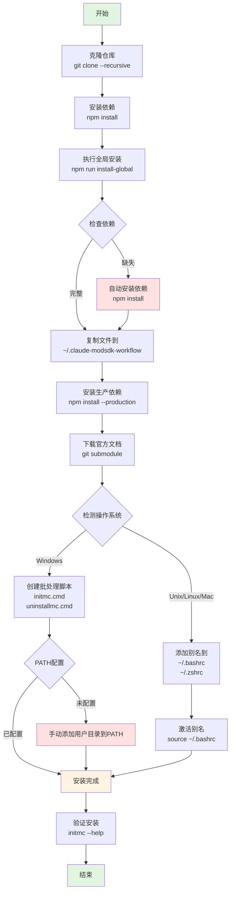
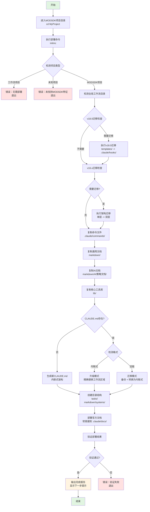
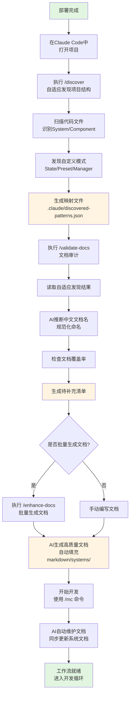

# NeteaseMod-Claude 工作流生成器 - 安装指南

> **版本**: v18.4.0
> **最后更新**: 2025-11-13
> **适用对象**: 工作流开发者和MODSDK开发者

---

## 📋 目录

- [环境要求](#环境要求)
- [安装步骤](#安装步骤)
- [验证安装](#验证安装)
- [首次部署流程](#首次部署流程)
- [常见安装问题排查](#常见安装问题排查)
- [安装流程图](#安装流程图)
- [卸载指南](#卸载指南)

---

## 🔧 环境要求

### 必需环境

| 组件 | 版本要求 | 用途 |
|------|---------|------|
| **Node.js** | ≥ 12.0.0 | 运行工作流生成器 |
| **npm** | ≥ 6.0.0 | 管理依赖包 |
| **Git** | ≥ 2.0 | 下载子模块（官方文档） |
| **Claude Code CLI** | 最新版 | AI辅助开发环境 |

### 推荐环境

- **操作系统**: Windows 10+, macOS 10.14+, Linux (Ubuntu 18.04+)
- **终端**: Windows Terminal, PowerShell 7+, Bash, Zsh
- **磁盘空间**: 至少 500MB（包含官方文档）
- **网络**: 稳定的网络连接（首次安装需下载依赖和文档）

### 环境检查命令

```bash
# 检查 Node.js 版本
node --version
# 预期输出: v12.0.0 或更高

# 检查 npm 版本
npm --version
# 预期输出: 6.0.0 或更高

# 检查 Git 版本
git --version
# 预期输出: git version 2.x.x

# 检查 Claude Code CLI
claude --version
# 预期输出: Claude Code CLI 版本信息
```

---

## 📦 安装步骤

### 方式一: 从源码安装（推荐）

#### 步骤1: 克隆仓库

```bash
# 克隆项目到本地（包含子模块）
git clone --recursive https://github.com/jju666/NeteaseMod-Claude.git

# 如果忘记使用 --recursive，可以手动初始化子模块
cd NeteaseMod-Claude
git submodule update --init --recursive
```

**注意**: 官方文档作为Git Submodule托管在 `docs/` 目录，首次克隆可能需要1-3分钟。

#### 步骤2: 安装依赖

```bash
# 进入项目目录
cd NeteaseMod-Claude

# 安装npm依赖
npm install
```

**依赖列表**:
- `fs-extra`: 文件系统增强库
- `glob`: 文件模式匹配

#### 步骤3: 全局安装

```bash
# 执行全局安装脚本
npm run install-global
```

**此步骤执行以下操作**:

1. **依赖检查**: 验证 `fs-extra` 等依赖是否已安装
2. **文件复制**: 复制工作流文件到 `~/.claude-modsdk-workflow/`
3. **依赖安装**: 在全局目录安装生产环境依赖（`npm install --production`）
4. **官方文档下载**: 通过Git Submodule下载MODSDK和Bedrock Wiki文档
5. **命令注册**:
   - **Windows**: 创建 `initmc.cmd` 和 `uninstallmc.cmd` 批处理脚本到用户目录
   - **Unix/Linux/Mac**: 添加别名到 `~/.bashrc` 和 `~/.zshrc`

#### 步骤4: 配置环境（Windows特定）

**Windows用户**需要手动添加用户目录到PATH（如果未自动配置）:

1. 打开"此电脑" → 右键"属性" → "高级系统设置"
2. 点击"环境变量"
3. 在"用户变量"中找到"Path"，点击"编辑"
4. 添加新路径: `C:\Users\你的用户名`
5. 点击"确定"保存
6. **重启终端**使更改生效

**Unix/Linux/Mac用户**需要激活别名:

```bash
# 激活别名（仅首次需要）
source ~/.bashrc

# Mac用户（如果使用Zsh）
source ~/.zshrc
```

---

### 方式二: 从npm安装（未发布）

```bash
# 未来支持：全局安装npm包
npm install -g netease-mod-claude

# 安装后可直接使用命令
initmc
```

**注意**: 当前版本未发布到npm，请使用方式一安装。

---

## ✅ 验证安装

### 验证全局命令

```bash
# 测试 initmc 命令
initmc --help
# 预期输出: 工作流部署说明或版本信息

# 测试 uninstallmc 命令
uninstallmc --help
# 预期输出: 工作流卸载说明
```

### 验证全局目录结构

```bash
# Windows
dir %USERPROFILE%\.claude-modsdk-workflow

# Unix/Linux/Mac
ls -la ~/.claude-modsdk-workflow
```

**预期包含以下目录和文件**:

```
.claude-modsdk-workflow/
├── bin/                    # 可执行脚本
│   ├── initmc.js
│   ├── uninstallmc.js
│   ├── merge-conflicts.js
│   └── detect-obsolete.js
├── lib/                    # 核心库
│   ├── init-workflow.js
│   ├── generator.js
│   ├── analyzer.js
│   └── config.js
├── templates/              # 模板文件
│   ├── .claude/
│   └── CLAUDE.md.template
├── markdown/               # 通用文档
│   ├── 开发规范.md
│   ├── 问题排查.md
│   └── 开发指南.md
├── docs/                   # 官方文档（Git Submodule）
│   ├── modsdk-wiki/
│   └── bedrock-wiki/
├── package.json
└── README.md
```

### 验证官方文档下载

```bash
# 检查MODSDK Wiki
ls ~/.claude-modsdk-workflow/docs/modsdk-wiki/

# 检查Bedrock Wiki
ls ~/.claude-modsdk-workflow/docs/bedrock-wiki/
```

**如果官方文档为空**，手动下载:

```bash
cd ~/.claude-modsdk-workflow
git submodule update --init --recursive
```

---

## 🚀 首次部署流程

安装完成后，在MODSDK项目中首次部署工作流：

### 步骤1: 进入MODSDK项目

```bash
# 进入你的MODSDK项目根目录
cd D:/MyProjects/MyMODSDK

# 验证项目特征（以下文件至少存在一个）
# - modMain.py
# - behavior_packs/xxx/manifest.json
# - world_behavior_packs.json
```

### 步骤2: 执行部署命令

```bash
# 部署工作流到当前项目
initmc
```

**部署过程说明**:

```
━━━━━━━━━━━━━━━━━━━━━━━━━━━━━━━━━━━━━━
  MODSDK 工作流部署工具 v2.0
━━━━━━━━━━━━━━━━━━━━━━━━━━━━━━━━━━━━━━

ℹ️  当前目录: D:/MyProjects/MyMODSDK

✅ 检测到 MODSDK 项目
   检测依据: modMain.py

🔍 检测全局工作流目录...
✅ 找到全局工作流目录: C:\Users\你的用户名\.claude-modsdk-workflow

📋 复制命令文件...
  ✅ mc.md - 25.3 KB (定制化)
  ✅ discover.md - 8.2 KB
  ✅ enhance-docs.md - 7.5 KB
  ✅ validate-docs.md - 9.1 KB
  ✅ review-design.md - 10.4 KB

📚 复制通用文档...
  ✅ 开发规范.md - 15.2 KB
  ✅ 问题排查.md - 8.3 KB
  ✅ 快速开始.md - 5.1 KB
  ✅ 开发指南.md - 12.4 KB
  ✅ API速查.md - 6.7 KB
  ✅ MODSDK核心概念.md - 4.2 KB

🤖 复制 AI 辅助文档...
  ✅ 任务类型决策表.md - 3.5 KB
  ✅ 快速通道流程.md - 2.8 KB
  ✅ 上下文管理规范.md - 3.1 KB

🔧 复制核心工具库...
  ✅ adaptive-doc-discovery.js - 8.2 KB
  ✅ utils.js - 1.5 KB
  ✅ config.js - 0.9 KB
  ✅ metadata-schema.js - 2.1 KB
  ✅ indexer.js - 4.3 KB
  ✅ search-engine.js - 5.6 KB

⚙️  生成定制化配置...
  ✅ CLAUDE.md - 35.2 KB (全新创建)

📁 创建目录结构...
  ✅ tasks/
  ✅ markdown/systems/

📚 部署官方文档...
✅ 已部署官方文档到 .claude/docs/（软链接）
📁 包含文档：
  - MODSDK Wiki (modsdk-wiki/)
  - Bedrock Wiki (bedrock-wiki/)
ℹ️  ⚡ /mc 指令将优先查询本地文档（速度提升10x）

🔍 验证部署结果...
  ✅ .claude/commands/mc.md - 25.3 KB
  ✅ .claude/commands/discover.md - 8.2 KB
  ✅ .claude/commands/enhance-docs.md - 7.5 KB
  ✅ .claude/commands/validate-docs.md - 9.1 KB
  ✅ .claude/commands/review-design.md - 10.4 KB
  ✅ CLAUDE.md - 35.2 KB
  ✅ lib/adaptive-doc-discovery.js - 8.2 KB

━━━━━━━━━━━━━━━━━━━━━━━━━━━━━━━━━━━━━━
  ✅ 核心工作流部署完成！
━━━━━━━━━━━━━━━━━━━━━━━━━━━━━━━━━━━━━━

📊 部署内容:
  ✅ 命令文件: 5 个 (/mc, /mc-discover, /mc-docs, /mc-review, /mc-perf)
  ✅ 通用文档: 6 个 (开发规范.md, 问题排查.md等)
  ✅ AI 文档: 3 个
  ✅ 核心工具: 6 个 (lib/目录)
  ✅ 配置文件: 1 个 (CLAUDE.md)

💡 备份保护:
  - 已自动备份现有的 CLAUDE.md 和命令文件（如有）
  - 备份文件格式: 文件名.backup.YYYY-MM-DD
  - 通用文档不备份（可随时覆盖）

━━━━━━━━━━━━━━━━━━━━━━━━━━━━━━━━━━━━━━

🎯 下一步（重要！）⭐

请在 Claude Code 中按顺序执行以下命令：

步骤1: /discover
  功能: 自适应发现项目结构（5-10秒，零Token）
  - 识别MODSDK官方概念（System、Component）
  - 发现项目自定义模式（State、Preset、Manager等）
  - 生成 .claude/discovered-patterns.json 映射文件

步骤2: /validate-docs
  功能: 文档审计与规范化（依赖步骤1的结果）
  - 读取自适应发现结果
  - AI智能推断规范化的中文文档名
  - 检查文档覆盖率
  - 生成文档待补充清单

━━━━━━━━━━━━━━━━━━━━━━━━━━━━━━━━━━━━━━

📚 完整工作流（四段式）:
  1. /discover - 自适应发现项目结构（零配置）
  2. /validate-docs - 发现组件并规范化文档结构
  3. /enhance-docs - 批量生成高质量文档内容
  4. /mc "任务描述" - 开发时自动维护文档

🎉 开始体验文档驱动的开发工作流吧！
```

### 步骤3: 在Claude Code中执行工作流初始化

```bash
# 在Claude Code CLI中执行
/discover
```

等待自适应发现完成后：

```bash
/validate-docs
```

---

## 🔍 常见安装问题排查

### 问题1: 命令 `initmc` 未找到

**症状**:
```
'initmc' 不是内部或外部命令，也不是可运行的程序或批处理文件。
```

**原因**:
- Windows: 用户目录未添加到PATH
- Unix/Linux/Mac: 未激活别名或终端未重启

**解决方案**:

**Windows**:
1. 检查 `initmc.cmd` 是否存在:
   ```cmd
   dir %USERPROFILE%\initmc.cmd
   ```
2. 手动添加用户目录到PATH（参见[步骤4](#步骤4-配置环境windows特定)）
3. 重启终端

**Unix/Linux/Mac**:
```bash
# 激活别名
source ~/.bashrc  # 或 source ~/.zshrc

# 验证别名
alias | grep initmc

# 如果别名不存在，手动添加
echo "alias initmc='node ~/.claude-modsdk-workflow/bin/initmc.js'" >> ~/.bashrc
source ~/.bashrc
```

---

### 问题2: 依赖安装失败

**症状**:
```
npm ERR! code EACCES
npm ERR! syscall access
npm ERR! path /usr/local/lib/node_modules
```

**原因**:
- npm权限不足
- npm全局安装目录配置问题

**解决方案**:

**方案1: 配置npm使用用户目录（推荐）**
```bash
# 创建全局包目录
mkdir ~/.npm-global

# 配置npm使用该目录
npm config set prefix '~/.npm-global'

# 添加到PATH（Linux/Mac）
echo 'export PATH=~/.npm-global/bin:$PATH' >> ~/.bashrc
source ~/.bashrc

# 重新安装
npm install
```

**方案2: 使用sudo（不推荐）**
```bash
sudo npm install
```

---

### 问题3: Windows软连接权限不足

**症状**:
```
❌ 安装失败：权限不足

⚠️  Windows需要管理员权限来创建符号链接
```

**原因**:
Windows默认需要管理员权限创建符号链接

**解决方案**:

**方案1: 以管理员身份运行（推荐）**
1. 关闭当前终端
2. 右键点击"Windows PowerShell" → "以管理员身份运行"
3. 切换到项目目录:
   ```powershell
   cd "D:\EcWork\基于Claude的MODSDK开发工作流"
   ```
4. 重新运行:
   ```powershell
   npm run install-global
   ```

**方案2: 启用开发者模式（Windows 10+）**
1. 打开"设置" → "更新和安全" → "开发者选项"
2. 打开"开发人员模式"
3. 重启终端后重试

---

### 问题4: Git Submodule下载失败

**症状**:
```
⚠️  文档下载失败，将使用在线查询
```

**原因**:
- 网络不稳定
- Git未安装或版本过低
- 防火墙阻止Git连接

**解决方案**:

**方案1: 手动下载子模块**
```bash
cd ~/.claude-modsdk-workflow
git submodule update --init --recursive

# 如果网络慢，可以单独下载
git submodule update --init docs/modsdk-wiki
git submodule update --init docs/bedrock-wiki
```

**方案2: 使用国内镜像（仅限GitHub）**
```bash
# 配置Git使用国内镜像（临时）
git config --global url."https://ghproxy.com/https://github.com".insteadOf "https://github.com"

# 重新下载
git submodule update --init --recursive

# 恢复默认配置
git config --global --unset url."https://ghproxy.com/https://github.com".insteadOf
```

**方案3: 跳过文档下载（使用在线查询）**
- 工作流会自动降级为在线查询（WebFetch）
- 查询速度稍慢，但不影响功能

---

### 问题5: 检测不到MODSDK项目

**症状**:
```
❌ 未找到 MODSDK 项目

支持的项目类型:
  • 包含 modMain.py 的 MODSDK 项目
  • 包含 behavior pack (manifest.json) 的基岩版项目
  • 包含 world_behavior_packs.json 的网易地图项目
```

**原因**:
- 当前目录不是MODSDK项目
- 项目结构不符合检测规则

**解决方案**:

**检查项目特征文件**:
```bash
# 检查是否存在特征文件（至少一个）
ls modMain.py
ls behavior_packs/*/manifest.json
ls world_behavior_packs.json
```

**如果是子目录项目**，尝试在父目录执行:
```bash
# 工作流会递归搜索子目录（最多10层）
cd ..
initmc
```

**手动指定项目路径**（暂不支持）:
```bash
# 未来版本支持
initmc /path/to/modsdk-project
```

---

### 问题6: 升级后工作流版本不匹配

**症状**:
```
⚠️  检测到旧版格式，已自动迁移
```

**原因**:
- 项目使用旧版工作流（v15.x或更早）
- 需要迁移到新版内联式架构

**解决方案**:

**自动迁移（推荐）**:
```bash
# 重新执行部署，工作流会自动迁移
initmc
```

**手动迁移**:
1. 备份旧版 `CLAUDE.md`:
   ```bash
   cp CLAUDE.md CLAUDE.md.backup
   ```
2. 查看迁移指南:
   ```bash
   cat markdown/迁移指南-v15.0.md
   ```
3. 从备份中提取自定义内容，粘贴到新版"项目扩展区"

**验证迁移结果**:
```bash
# 检查版本追踪文件
cat .claude/workflow-version.json
```

---

## 📊 安装流程图

### 全局安装流程



### 项目部署流程



### 工作流初始化流程（部署后）



---

## 🗑️ 卸载指南

### 从MODSDK项目卸载工作流

```bash
# 在MODSDK项目目录执行
uninstallmc
```

**卸载内容**:
- `.claude/` 目录（命令文件、配置文件）
- `markdown/` 目录（通用文档、AI文档）
- `lib/` 目录（核心工具库）
- `tasks/` 目录（任务文件）
- `CLAUDE.md` 文件

**保留内容**:
- 用户自定义的 `markdown/systems/` 文档（可选保留）
- 项目源代码（behavior_packs/、modMain.py等）

### 卸载全局工作流

```bash
# 删除全局目录
rm -rf ~/.claude-modsdk-workflow

# Windows
rmdir /s /q "%USERPROFILE%\.claude-modsdk-workflow"
```

**手动清理**（如需彻底卸载）:

**Windows**:
1. 删除批处理脚本:
   ```cmd
   del "%USERPROFILE%\initmc.cmd"
   del "%USERPROFILE%\uninstallmc.cmd"
   ```
2. 从PATH中移除用户目录（如果添加过）

**Unix/Linux/Mac**:
1. 编辑 `~/.bashrc` 或 `~/.zshrc`
2. 删除以下行:
   ```bash
   # MODSDK Workflow Generator
   alias initmc="node ~/.claude-modsdk-workflow/bin/initmc.js"
   alias uninstallmc="node ~/.claude-modsdk-workflow/bin/uninstallmc.js"
   ```
3. 重新加载配置:
   ```bash
   source ~/.bashrc
   ```

---

## 📚 附录

### A. 全局目录结构详解

```
~/.claude-modsdk-workflow/
├── bin/                           # 可执行脚本
│   ├── initmc.js                  # 部署命令入口
│   ├── uninstallmc.js             # 卸载命令入口
│   ├── quick-deploy.js            # 快速部署（未使用）
│   ├── merge-conflicts.js         # 合并冲突工具
│   ├── detect-obsolete.js         # 过时文件检测
│   └── install-global.js          # 全局安装脚本
│
├── lib/                           # 核心库
│   ├── init-workflow.js           # 工作流初始化
│   ├── generator.js               # 文档生成器
│   ├── analyzer.js                # 项目分析器
│   ├── config.js                  # 配置管理
│   ├── version-checker.js         # 版本检查
│   ├── symlink-manager.js         # 软链接管理
│   ├── migration-v16.js           # v16.0迁移
│   ├── migration-v16.1.js         # v16.1迁移
│   ├── migration-v18.js           # v18.0迁移
│   ├── obsolete-file-detector.js  # 过时文件检测器
│   ├── adaptive-doc-discovery.js  # 自适应文档发现
│   ├── utils.js                   # 工具函数
│   ├── metadata-schema.js         # 元数据模式
│   ├── indexer.js                 # 文档索引器
│   └── search-engine.js           # 搜索引擎
│
├── templates/                     # 模板文件
│   ├── .claude/                   # Claude Code配置模板
│   │   ├── commands/              # 命令模板
│   │   │   ├── mc.md.template
│   │   │   ├── discover.md
│   │   │   ├── enhance-docs.md
│   │   │   ├── validate-docs.md
│   │   │   └── review-design.md
│   │   ├── hooks/                 # Hooks脚本模板
│   │   │   ├── user-prompt-submit-hook.py
│   │   │   ├── stop-hook.py
│   │   │   ├── enforce-step2.py
│   │   │   ├── enforce-cleanup.py
│   │   │   ├── check-critical-rules.py
│   │   │   ├── log-changes.py
│   │   │   ├── track-doc-reading.py
│   │   │   ├── pre-compact-reminder.py
│   │   │   └── subagent-stop-hook.py
│   │   └── settings.json.template
│   └── CLAUDE.md.template         # CLAUDE.md模板
│
├── markdown/                      # 通用文档
│   ├── 开发规范.md
│   ├── 问题排查.md
│   ├── 快速开始.md
│   ├── 开发指南.md
│   ├── API速查.md
│   ├── MODSDK核心概念.md
│   ├── README.md
│   └── AI策略文档/
│       ├── 任务类型决策表.md
│       ├── 快速通道流程.md
│       └── 上下文管理规范.md
│
├── docs/                          # 官方文档（Git Submodule）
│   ├── modsdk-wiki/               # MODSDK Wiki
│   │   ├── API/
│   │   ├── Components/
│   │   ├── Events/
│   │   └── ...
│   └── bedrock-wiki/              # Bedrock Wiki
│       ├── docs/
│       ├── concepts/
│       └── ...
│
├── scripts/                       # 辅助脚本
│   ├── initmc.js                  # 旧版部署脚本（保留）
│   └── compact-claude.py          # 文档压缩工具
│
├── package.json                   # 项目配置
├── package-lock.json
├── README.md                      # 工作流说明
├── CHANGELOG.md                   # 更新日志
└── .gitignore
```

### B. 项目部署后的目录结构

```
MyMODSDKProject/
├── .claude/                       # Claude Code配置
│   ├── commands/                  # 命令文件
│   │   ├── mc.md                  # 主命令（定制化）
│   │   ├── mc-discover.md         # 结构发现
│   │   ├── mc-docs.md             # 文档验证
│   │   ├── mc-review.md           # 方案审查
│   │   ├── mc-perf.md             # 性能分析
│   │   └── mc-why.md              # 原理解释
│   ├── hooks/                     # Hooks脚本（v18.0+）
│   │   ├── user-prompt-submit-hook.py
│   │   ├── stop-hook.py
│   │   └── ...
│   ├── docs/                      # 官方文档（软链接）
│   │   ├── modsdk-wiki/
│   │   └── bedrock-wiki/
│   ├── core-docs/                 # 核心文档（软链接，v16.0+）
│   ├── discovered-patterns.json   # 自适应发现结果
│   ├── workflow-version.json      # 版本追踪
│   ├── workflow-manifest.json     # 工作流清单（v18.0+）
│   └── settings.json              # Claude Code设置
│
├── lib/                           # 核心工具库
│   ├── adaptive-doc-discovery.js
│   ├── utils.js
│   ├── config.js
│   ├── metadata-schema.js
│   ├── indexer.js
│   └── search-engine.js
│
├── markdown/                      # 文档目录
│   ├── 开发规范.md
│   ├── 问题排查.md
│   ├── 快速开始.md
│   ├── 开发指南.md
│   ├── API速查.md
│   ├── MODSDK核心概念.md
│   ├── README.md                  # 文档导航
│   ├── AI策略文档/
│   │   ├── 任务类型决策表.md
│   │   ├── 快速通道流程.md
│   │   └── 上下文管理规范.md
│   └── systems/                   # 系统实现文档
│       ├── ShopServerSystem.md    # 示例：商店系统文档
│       └── ...
│
├── tasks/                         # 任务文件
│   └── .gitkeep
│
├── behavior_packs/                # MODSDK代码
│   └── MyBehaviorPack/
│       ├── modMain.py
│       ├── manifest.json
│       └── ...
│
└── CLAUDE.md                      # 工作流配置（内联式）
```

### C. 环境变量配置

| 环境变量 | 说明 | 默认值 |
|---------|------|--------|
| `NETEASE_CLAUDE_HOME` | 全局工作流目录 | `~/.claude-modsdk-workflow` |
| `CLAUDE_WORKFLOW_ROOT` | 工作流根目录（备用） | 未设置 |
| `CLAUDE_AUTO_MIGRATE` | 自动迁移选项（1-4） | 未设置 |

**设置示例**:

```bash
# Windows
set NETEASE_CLAUDE_HOME=D:\MyWorkflow
set CLAUDE_AUTO_MIGRATE=1

# Unix/Linux/Mac
export NETEASE_CLAUDE_HOME=~/my-workflow
export CLAUDE_AUTO_MIGRATE=1
```

### D. 常用命令速查

| 命令 | 说明 | 使用场景 |
|------|------|---------|
| `npm run install-global` | 全局安装工作流 | 首次安装或更新工作流 |
| `initmc` | 部署工作流到当前项目 | 在MODSDK项目中首次部署 |
| `initmc --sync` | 同步更新工作流 | 更新现有项目的工作流 |
| `initmc --force` 或 `--reset` | 强制重置工作流（清除缓存） | 解决同步问题，两个参数功能相同 |
| `uninstallmc` | 卸载工作流 | 从项目中移除工作流 |
| `merge-conflicts` | 合并冲突工具 | 解决文件冲突 |
| `detect-obsolete` | 检测过时文件 | 清理旧版文件 |

### E. 技术支持

| 资源 | 链接 |
|------|------|
| **GitHub仓库** | https://github.com/jju666/NeteaseMod-Claude |
| **问题反馈** | https://github.com/jju666/NeteaseMod-Claude/issues |
| **MODSDK Wiki** | https://github.com/EaseCation/netease-modsdk-wiki |
| **Bedrock Wiki** | https://github.com/Bedrock-OSS/bedrock-wiki |
| **Claude Code CLI** | https://claude.ai/download |

---

## 📝 更新日志

### v18.4.0 (2025-11-13)
- 完善安装指南文档
- 添加详细的流程图（Mermaid）
- 优化问题排查章节

### v18.0.0
- Hook方案3：任务隔离与知识验证机制
- 从 `templates/` 迁移Hooks到 `.claude/hooks/`
- 新增 `workflow-manifest.json` 清单文件

### v16.0.0
- 双层文档架构（核心 + 项目）
- 软链接管理（`.claude/core-docs/`）
- 自适应文档发现（`/discover`）

### v15.0.0
- 内联式 CLAUDE.md 架构
- 精确替换工作流区域
- 版本追踪（`workflow-version.json`）

---

**文档版本**: v1.0
**最后更新**: 2025-11-13
**维护者**: NeteaseMod-Claude Contributors
