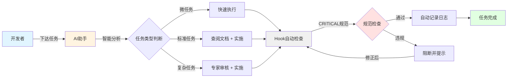
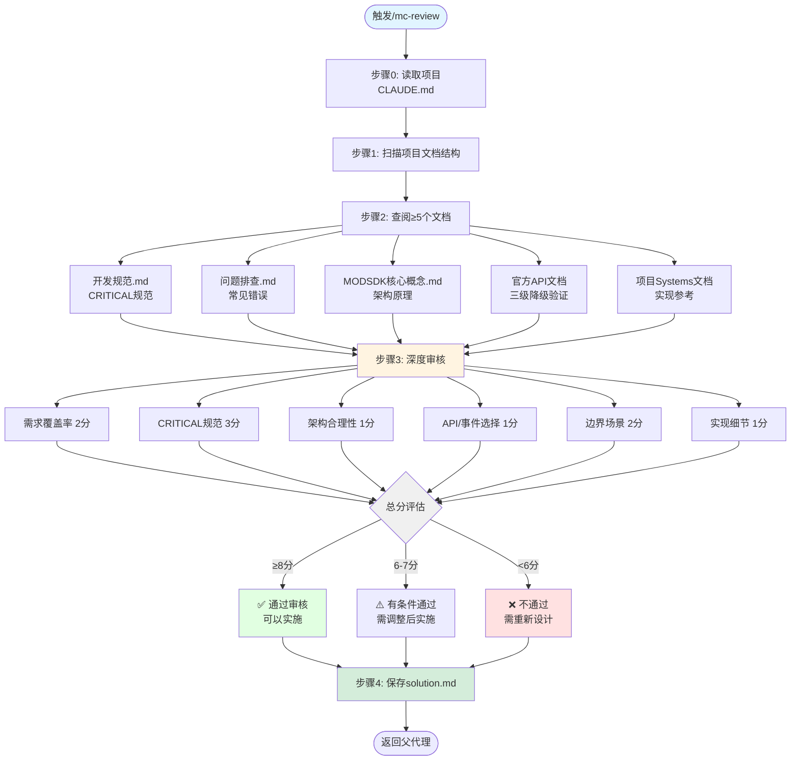

# 快速上手指南

> **MODSDK开发工作流 - 让AI成为你的开发伙伴**
>
> 版本: v21.1.2 | 最后更新: 2025-11-15
>
> 🎯 智能单命令模式 - `initmc` 自动完成所有操作

---

## 📋 目录

- [核心理念](#核心理念)
- [5分钟快速开始](#5分钟快速开始)
- [核心命令速查](#核心命令速查)
- [工作流程图](#工作流程图)
- [使用场景示例](#使用场景示例)
- [命令使用流程](#命令使用流程)
- [最佳实践](#最佳实践)
- [常见问题](#常见问题)

---

## 核心理念

MODSDK开发工作流采用 **Hook自动化 + AI智能决策** 的设计理念：



**核心特性**：

- ✅ **自动化保护**：Hook在后台自动检查CRITICAL规范，阻断违规操作
- ✅ **智能决策**：AI根据任务复杂度自动选择最优工作流
- ✅ **知识驱动**：优先查阅文档，理解原理后再实施
- ✅ **零配置**：开箱即用，无需手动配置

---

## 5分钟快速开始

### 第一步：初始化工作流

**全局安装**（首次安装）：

```bash
# 克隆工作流项目
git clone https://github.com/jju666/NeteaseMod-Claude.git
cd NeteaseMod-Claude

# 安装依赖并创建全局链接
npm install
npm link
```

> **v20.2.12 变更**: 推荐使用 `npm link` 替代旧的 `npm run deploy`
> - ✅ 更快 (5秒 vs 30秒)
> - ✅ 实时更新 (修改代码立即生效)
> - ✅ 无残留文件 (`npm unlink` 完全清理)

**部署到MODSDK项目**：

在你的MODSDK项目根目录执行：

```bash
initmc
```

> **v20.2.12 智能模式**: `initmc` 会自动：
> - 🗑️ 清理遗留文件
> - 🔍 检测版本更新
> - 🧹 清除废弃文件
> - ⬆️ 自动同步最新版本
> - 无需任何参数，一条命令搞定！

这将创建以下文件结构：

```
your-modsdk-project/
├── .claude/
│   ├── commands/        # AI命令定义（mc、mc-review等）
│   ├── hooks/          # 自动化Hook脚本（Python）
│   ├── core-docs/      # 核心文档库（软链接）
│   └── settings.json   # 工作流配置
├── markdown/           # 项目文档
│   ├── core/          # 核心规范文档
│   └── systems/       # 系统实现文档
├── tasks/             # 任务历史记录
├── templates/         # 任务模板
└── CLAUDE.md          # AI工作流指导文档
```

### 第二步：使用核心命令

打开Claude Code，输入：

```bash
/mc 添加VIP系统，玩家购买VIP后获得移动速度加成
```

AI将自动：
1. 📖 理解需求并分析任务类型
2. 📚 查阅相关文档（开发规范、API文档等）
3. 🎨 设计双端架构（Server负责逻辑，Client负责UI）
4. 💻 生成完整代码框架
5. ✅ Hook自动检查CRITICAL规范
6. 📝 记录修改日志到任务目录

### 第三步：测试验证

```bash
# 游戏内测试
1. 启动服务器加载MOD
2. 玩家输入购买VIP命令
3. 验证移动速度是否提升
4. 检查UI显示是否正常
```

---

## 核心命令速查

### `/mc` - 主工作流命令（统一工作流驱动器 v20.x）

**用途**：90%的开发场景都使用这个命令

**语法**：
```bash
/mc <任务描述>
```

**智能任务识别**（v20.2.x 自动分流）：

| 任务类型 | 识别关键词 | AI行为 |
|---------|----------|--------|
| 🐛 **BUG修复** | "修复"、"报错"、"不工作"、"BUG" | 智能诊断 → 定位问题 → 验证规范 → 修复方案 |
| ✨ **新功能** | "添加"、"实现"、"创建" | 需求分析 → 架构设计 → 生成代码 → 归档 |
| 📖 **代码理解** | "解释"、"是什么"、"怎么工作" | 代码扫描 → 流程分析 → 可视化说明 |
| ⚡ **性能优化** | "卡顿"、"慢"、"优化" | 性能分析 → 瓶颈检测 → 优化建议 |

**示例**：
```bash
# BUG修复（自动启用智能诊断系统 v20.2）
/mc 修复商店购买时返回None错误

# 添加功能（标准玩法包/自定义实现）
/mc 添加技能冷却系统

# 性能优化
/mc 服务器卡顿，优化性能

# 代码理解
/mc 解释CombatSystem的逻辑
```

**工作流程**（统一工作流驱动器）：
1. 步骤0：读取项目上下文（CLAUDE.md）
2. 步骤1：识别任务类型（微/标准/复杂 + BUG/功能/优化）
   - **BUG修复模式增强**（v20.2）：自动提取关键词 → 匹配已知问题 → 智能诊断
   - **功能开发模式**：玩法包匹配 → 架构设计 → 代码生成
3. 步骤2：查阅文档（≥3个文档，BUG修复优先查阅问题排查.md）
4. 步骤3：执行实施（自动触发Hook检查）
   - **循环检测**：2次负面反馈 + 2次同文件修改 → 自动触发专家诊断
   - **修复确认**：代码修改≥2次 → 弹窗询问"是否已修复"
5. 步骤4：收尾归档（用户确认后自动归档到tasks/已归档/）

---

### `/mc-review` - 专家审核命令

**用途**：深度审核技术方案，确保质量

**触发时机**：
- 🔴 复杂任务（涉及>5个System）
- ⚠️ 标准任务遇到多轮修复失败
- 👤 用户明确要求审核

**审核内容**：
- 需求覆盖率分析
- CRITICAL规范符合性（5项规范）
- 架构合理性（端别分工、数据流设计）
- API/事件选择（包含三级降级验证）
- 边界场景检查（错误处理、并发、性能）

**输出**：
- 10分制评分报告
- 严重问题清单（带文档证据）
- 优化建议（带代码示例）

---

### `/mc-perf` - 性能分析命令

**用途**：自动检测性能瓶颈并生成优化建议

**检测内容**：
- 🔴 CRITICAL：缺少RegisterView（性能影响100倍）
- 🟠 HIGH：高频Update操作、高频网络RPC
- 🟡 MEDIUM：缺少Destroy方法、频繁创建EventData

**输出报告**：
```
性能分析报告
├── 执行摘要（总体评分A/B/C/D）
├── 详细问题清单
│   ├── CRITICAL问题（立即修复）
│   ├── HIGH问题（高优先级）
│   └── MEDIUM问题（中优先级）
├── 优化建议总结
└── 性能基准测试建议
```

**示例**：
```bash
/mc-perf
```

---

### `/mc-docs` - 文档管理命令

**用途**：验证文档完整性并批量生成缺失文档

**模式1：验证模式（默认）**
```bash
/mc-docs
```

输出：
- 文档覆盖率统计（已覆盖/未覆盖/低质量）
- 文档质量评分（0-100分）
- 改进建议清单

**模式2：生成模式**
```bash
/mc-docs --gen
```

功能：
- 批量补充缺失文档（1500-3000字/篇）
- 使用子代理深度分析代码
- 自动更新文档待补充清单

---

### `/mc-why` - 规范解释命令

**用途**：深度解释开发规范的底层原理

**示例**：
```bash
# 解释双端隔离原则
/mc-why 为什么必须双端隔离？

# 解释RegisterView性能优化
/mc-why 为什么要使用RegisterView？

# 解释生命周期限制
/mc-why 为什么__init__中不能调用API？
```

**输出格式**：
```markdown
## 📖 规范说明
[完整规范描述]

## 🔍 深层原理
### 为什么这样设计？
[架构层面原因]

### 不遵守会导致什么问题？
[错误示例 + 后果]

## ✅ 正确做法
[正确代码示例]

## 📚 扩展阅读
[相关文档链接]
```

---

### `/mc-discover` - 项目结构发现

**用途**：自动扫描项目，发现组件类型和文档组织方式

**功能**：
- 识别MODSDK官方概念（System、Component）
- 发现项目自定义模式（State、Preset、Manager等）
- 推断文档目录结构
- 生成映射规则配置

**输出**：
```
自适应发现报告
├── MODSDK官方核心概念
│   ├── Systems: 5个
│   └── Components: 3个
└── 项目自定义组织模式
    ├── State模式: 12个类 → states/目录
    └── Preset模式: 3个类 → presets/目录
```

---

## 工作流程图

### 完整开发流程

```mermaid
flowchart TD
    Start([开发者输入任务]) --> Step0[步骤0: 理解项目<br/>Read CLAUDE.md]
    Step0 --> Step1[步骤1: 识别任务类型]

    Step1 --> TaskType{任务类型判断}

    TaskType -->|微任务<br/>单文件<30行| Micro[微任务流程]
    TaskType -->|标准任务<br/>3-8文件| Standard[标准任务流程]
    TaskType -->|复杂任务<br/>>5 System| Complex[复杂任务流程]

    Micro --> QuickRead[快速查阅1-2个文档]
    QuickRead --> Execute[直接执行修改]

    Standard --> CreateDir[创建任务目录]
    CreateDir --> ReadDocs[查阅≥3个文档]
    ReadDocs --> CheckPoint[输出步骤2检查点]
    CheckPoint --> Review{需要审核?}
    Review -->|否| Execute
    Review -->|是| ExpertReview[/mc-review 专家审核]
    ExpertReview --> Execute

    Complex --> CreateDir2[创建任务目录]
    CreateDir2 --> ReadDocs2[查阅≥3个文档]
    ReadDocs2 --> CheckPoint2[输出步骤2检查点]
    CheckPoint2 --> MustReview[强制专家审核]
    MustReview --> Execute

    Execute --> HookCheck{Hook CRITICAL检查}
    HookCheck -->|违规| Block[阻断并提示错误]
    Block --> Fix[修正代码]
    Fix --> Execute

    HookCheck -->|通过| AutoLog[自动记录change-log.md]
    AutoLog --> Test[测试验证]
    Test --> TestResult{测试通过?}
    TestResult -->|失败| Retry[分析原因]
    Retry --> Execute
    TestResult -->|通过| Complete[任务完成]

    Complete --> Archive[归档任务<br/>提取经验到知识库]
    Archive --> End([开发完成])

    style Start fill:#e1f5ff
    style Step0 fill:#fff4e1
    style TaskType fill:#f0f0f0
    style HookCheck fill:#ffe1e1
    style Complete fill:#e1ffe1
    style End fill:#d4edda
```

### 专家审核子流程



---

## 使用场景示例

### 场景1：修复BUG - 商店购买返回None错误（智能诊断模式 v20.2+）

**背景**：玩家购买商品时，服务器日志显示 `TypeError: 'NoneType' object is not subscriptable`

**操作**：
```bash
/mc 商店购买时返回None错误
```

**AI执行流程**（v20.2.x智能诊断系统）：

```
━━━━━━━━━━━━━━━━━━━━━━━━━━━━━━━━━━━━━━
✅ 步骤0：项目上下文
━━━━━━━━━━━━━━━━━━━━━━━━━━━━━━━━━━━━━━
项目：MinecraftShopMod
类型：MODSDK项目
━━━━━━━━━━━━━━━━━━━━━━━━━━━━━━━━━━━━━━

━━━━━━━━━━━━━━━━━━━━━━━━━━━━━━━━━━━━━━
🐛 智能BUG修复系统 v20.2 启动
━━━━━━━━━━━━━━━━━━━━━━━━━━━━━━━━━━━━━━
检测到关键词: "修复"、"返回None"、"错误"
任务类型: BUG修复
症状分析: 业务逻辑BUG
知识源路由: 项目文档优先 → 问题排查.md → 代码实现
━━━━━━━━━━━━━━━━━━━━━━━━━━━━━━━━━━━━━━

━━━━━━━━━━━━━━━━━━━━━━━━━━━━━━━━━━━━━━
🔍 步骤1：智能任务分析
━━━━━━━━━━━━━━━━━━━━━━━━━━━━━━━━━━━━━━
任务类型：🟢 微任务 + BUG修复模式
原因：修复单个方法的空值检查，预计<30行修改
工作流增强：
- ✅ 自动查阅问题排查.md中的已知问题
- ✅ 提取业务关键词：["商店", "购买", "None"]
- ✅ 优先匹配项目文档（markdown/**/*商店*.md）
下一步：智能诊断 → 快速修复
━━━━━━━━━━━━━━━━━━━━━━━━━━━━━━━━━━━━━━

━━━━━━━━━━━━━━━━━━━━━━━━━━━━━━━━━━━━━━
✅ 步骤2检查点：智能诊断报告
━━━━━━━━━━━━━━━━━━━━━━━━━━━━━━━━━━━━━━
已查阅文档（3个）：
1. 问题排查.md:89-105 - 空值检查最佳实践
2. ShopServerSystem.md:45-80 - 商店购买逻辑
3. 开发规范.md:164-180 - API返回值检查规范

BUG诊断结果：
🔴 根本原因：缺少API返回值空值检查
🎯 关键代码位置：ShopServerSystem.py:67
⚠️ 风险等级：HIGH（会导致服务器崩溃）

提取的关键原则：
⛔ 禁止：假设API返回值一定存在
✅ 应该：使用if判断验证返回值
📚 原因：Component创建可能失败（实体已销毁、权限不足等）

文档依据：
- 问题排查.md:95 - 空值检查规范
- 开发规范.md:170 - API调用最佳实践

智能建议：
→ 步骤1: 定位ShopServerSystem.py中调用CreateItem的代码
→ 步骤2: 添加if判断验证返回值不为None
→ 步骤3: 添加错误日志和用户提示
━━━━━━━━━━━━━━━━━━━━━━━━━━━━━━━━━━━━━━
```

**修复代码**：
```python
def OnPlayerBuyItem(self, args):
    playerId = args['playerId']
    itemId = args['itemId']

    # ❌ 原代码（缺少空值检查）
    # itemComp = serverApi.GetEngineCompFactory().CreateItem(playerId)
    # itemCount = itemComp.GetItemCount(itemId)  # itemComp可能为None

    # ✅ 修复后（添加空值检查）
    itemComp = serverApi.GetEngineCompFactory().CreateItem(playerId)
    if itemComp is None:
        print("[ShopSystem] 创建ItemComponent失败，玩家可能已离线: {}".format(playerId))
        self.NotifyToClient(playerId, 'PurchaseFailedEvent', {
            'message': '购买失败，请重试'
        })
        return

    itemCount = itemComp.GetItemCount(itemId)
    # ... 后续逻辑
```

**Hook自动检查**：
```
✅ CRITICAL规范检查通过
✅ 修改已记录到 change-log.md
```

**测试验证**：
```bash
# 游戏内测试
1. 玩家正常购买 → 成功
2. 玩家购买时下线 → 不再报错，正确提示失败
```

---

### 场景2：添加新功能 - VIP系统

**需求**：玩家可以购买VIP，获得以下特权：
- 移动速度提升20%
- 聊天消息显示VIP标识
- 专属VIP商店

**操作**：
```bash
/mc 添加VIP系统，玩家购买VIP后获得移动速度加成、聊天标识和专属商店
```

**AI执行流程**：

```
━━━━━━━━━━━━━━━━━━━━━━━━━━━━━━━━━━━━━━
🔍 步骤1：任务类型识别
━━━━━━━━━━━━━━━━━━━━━━━━━━━━━━━━━━━━━━
任务类型：🟡 标准任务
原因：需要创建2个System（Server + Client），涉及数据存储、事件通信
下一步：创建任务目录，查阅≥3个文档
━━━━━━━━━━━━━━━━━━━━━━━━━━━━━━━━━━━━━━

# 创建任务目录（中文命名，无年份）
tasks/任务-1113-143022-VIP系统/
├── context.md         # 任务上下文
├── change-log.md      # 自动记录
└── .task-meta.json    # 任务元数据

━━━━━━━━━━━━━━━━━━━━━━━━━━━━━━━━━━━━━━
✅ 步骤2检查点：文档查阅报告
━━━━━━━━━━━━━━━━━━━━━━━━━━━━━━━━━━━━━━
已查阅文档（5个）：
1. 开发规范.md:164-210 - CRITICAL规范（双端隔离、生命周期）
2. 问题排查.md - 常见错误
3. 业务系统实现案例.md:120-250 - 商城系统设计参考
4. 官方API文档/AttrComponent.md - 属性修改API
5. 官方API文档/事件/玩家.md - 聊天事件

提取的关键原则：
⛔ 禁止：客户端存储VIP状态（可被修改）
✅ 应该：服务端存储，客户端仅展示
📚 原因：双端隔离原则，防止作弊

⛔ 禁止：在__init__中调用SetAttrValue
✅ 应该：在Create()中初始化Component
📚 原因：System生命周期限制

文档依据：
- 开发规范.md:164 - System生命周期规范
- 开发规范.md:210 - 双端隔离原则
- 业务系统实现案例.md:145 - 会员系统架构
━━━━━━━━━━━━━━━━━━━━━━━━━━━━━━━━━━━━━━
```

**生成的代码框架**：

**Server端（VIPServerSystem.py）**：
```python
# -*- coding: utf-8 -*-
from mod.server.system.serverSystem import ServerSystem
import mod.server.extraServerApi as serverApi

class VIPServerSystem(ServerSystem):
    def __init__(self, namespace, systemName):
        super(VIPServerSystem, self).__init__(namespace, systemName)
        self.vipData = {}  # 存储VIP信息 {playerId: {'expireTime': timestamp, 'level': 1}}
        self.Create()

    def Create(self):
        """初始化Component和事件监听"""
        # 监听玩家加入事件
        self.ListenForEvent(
            serverApi.GetEngineNamespace(),
            serverApi.GetEngineSystemName(),
            'AddServerPlayerEvent',
            self, self.OnPlayerJoin
        )

        # 监听购买VIP事件
        self.ListenForEvent(
            namespace, 'VIPClientSystem',
            'PurchaseVIPEvent',
            self, self.OnPurchaseVIP
        )

        # 监听聊天事件（添加VIP标识）
        self.ListenForEvent(
            serverApi.GetEngineNamespace(),
            serverApi.GetEngineSystemName(),
            'ServerChatEvent',
            self, self.OnPlayerChat
        )

    def OnPlayerJoin(self, args):
        """玩家加入时应用VIP特权"""
        playerId = args['id']

        # 从数据库加载VIP信息（示例简化为内存存储）
        if playerId in self.vipData:
            self.ApplyVIPBenefits(playerId)

            # 通知客户端显示VIP UI
            self.NotifyToClient(playerId, 'VIPStatusEvent', {
                'isVIP': True,
                'level': self.vipData[playerId]['level']
            })

    def OnPurchaseVIP(self, args):
        """处理购买VIP请求"""
        playerId = args['playerId']
        duration = args['duration']  # 天数

        # 扣除金币（调用ShopSystem）
        # ... 省略金币验证逻辑

        # 设置VIP状态
        import time
        self.vipData[playerId] = {
            'expireTime': time.time() + duration * 86400,
            'level': 1
        }

        # 应用VIP特权
        self.ApplyVIPBenefits(playerId)

        # 通知客户端
        self.NotifyToClient(playerId, 'PurchaseVIPResultEvent', {
            'success': True,
            'message': '恭喜成为VIP！'
        })

    def ApplyVIPBenefits(self, playerId):
        """应用VIP特权"""
        # 提升移动速度
        attrComp = serverApi.GetEngineCompFactory().CreateAttr(playerId)
        if attrComp:
            attrComp.SetAttrValue(
                serverApi.GetMinecraftEnum().AttrType.MOVEMENT,
                0.12  # 提升20%（基础0.1 → 0.12）
            )

    def OnPlayerChat(self, args):
        """在聊天消息前添加VIP标识"""
        playerId = args['playerId']
        message = args['message']

        if playerId in self.vipData:
            # 修改聊天消息，添加VIP标识
            args['message'] = '[VIP] ' + message

        return args  # 返回修改后的事件数据
```

**Client端（VIPClientSystem.py）**：
```python
# -*- coding: utf-8 -*-
from mod.client.system.clientSystem import ClientSystem
import mod.client.extraClientApi as clientApi

class VIPClientSystem(ClientSystem):
    def __init__(self, namespace, systemName):
        super(VIPClientSystem, self).__init__(namespace, systemName)
        self.isVIP = False
        self.Create()

    def Create(self):
        """监听服务端事件"""
        # 监听VIP状态更新
        self.ListenForEvent(
            namespace, 'VIPServerSystem',
            'VIPStatusEvent',
            self, self.OnVIPStatus
        )

        # 监听购买结果
        self.ListenForEvent(
            namespace, 'VIPServerSystem',
            'PurchaseVIPResultEvent',
            self, self.OnPurchaseResult
        )

    def OnVIPStatus(self, args):
        """更新VIP状态并显示UI"""
        self.isVIP = args['isVIP']
        vipLevel = args['level']

        # 显示VIP UI图标
        # ... UI代码
        print("[VIPClient] VIP状态已更新: Level {}".format(vipLevel))

    def OnPurchaseResult(self, args):
        """显示购买结果"""
        if args['success']:
            # 显示成功提示
            self.ShowSuccessMessage(args['message'])
        else:
            self.ShowErrorMessage(args['message'])

    def OnBuyVIPButtonClick(self, duration):
        """玩家点击购买按钮"""
        playerId = clientApi.GetLocalPlayerId()

        # 发送购买请求到服务端
        self.NotifyToServer('PurchaseVIPEvent', {
            'playerId': playerId,
            'duration': duration
        })
```

**Hook自动检查**：
```
━━━━━━━━━━━━━━━━━━━━━━━━━━━━━━━━━━━━━━
✅ CRITICAL规范检查
━━━━━━━━━━━━━━━━━━━━━━━━━━━━━━━━━━━━━━
✅ 规范1: 双端隔离 - 通过
   - 服务端处理VIP逻辑，客户端仅展示UI
   - 使用NotifyToClient/NotifyToServer通信

✅ 规范2: System生命周期 - 通过
   - 在Create()中初始化Component
   - __init__中手动调用self.Create()

✅ 规范3: EventData序列化 - 通过
   - 使用dict传递数据

✅ 所有修改已记录到 change-log.md
━━━━━━━━━━━━━━━━━━━━━━━━━━━━━━━━━━━━━━
```

---

### 场景3：性能优化 - 服务器卡顿

**背景**：服务器有100个玩家时TPS下降到15（正常20）

**操作**：
```bash
/mc-perf
```

**输出报告**：

```
━━━━━━━━━━━━━━━━━━━━━━━━━━━━━━━━━━━━━━
📊 性能分析报告
━━━━━━━━━━━━━━━━━━━━━━━━━━━━━━━━━━━━━━

项目名称：MinecraftShopMod
分析时间：2025-11-13 14:35:22
分析文件数：8个System

━━━━━━━━━━━━━━━━━━━━━━━━━━━━━━━━━━━━━━
执行摘要
━━━━━━━━━━━━━━━━━━━━━━━━━━━━━━━━━━━━━━
- ✅ 无问题的System：3个
- 🔴 CRITICAL问题：2个（立即修复）
- 🟠 HIGH问题：2个（高优先级）
- 🟡 MEDIUM问题：1个（中优先级）

总体评分：C（需要优化）

━━━━━━━━━━━━━━━━━━━━━━━━━━━━━━━━━━━━━━
🔴 CRITICAL 问题
━━━━━━━━━━━━━━━━━━━━━━━━━━━━━━━━━━━━━━

### 1. VIPServerSystem - 缺少RegisterView

文件：behavior_packs/mymod/scripts/server/VIPServerSystem.py
行号：89-105

问题描述：
System有Update()方法但未使用RegisterView，导致每帧遍历所有实体。

代码片段（有问题）：
```python
def Update(self):
    """每帧检查VIP过期"""
    allPlayers = serverApi.GetPlayerList()  # 100个玩家
    for playerId in allPlayers:
        if self.IsVIPExpired(playerId):  # 100次检查/帧
            self.RemoveVIPBenefits(playerId)
```

优化建议：
```python
def __init__(self, namespace, systemName):
    super(VIPServerSystem, self).__init__(namespace, systemName)

    # ✅ 注册RegisterView，只监听VIP玩家
    self.RegisterView(
        namespace, systemName,
        'Minecraft:player',  # 必须是玩家
        'MyMod:vip'          # 必须有VIP组件
    )

    # ✅ 使用定时器代替Update
    self.CreateTimer(300.0, self.CheckVIPExpiration)  # 每5分钟检查一次

def CheckVIPExpiration(self):
    """定时检查VIP过期（不是每帧）"""
    for playerId in self.vipData.keys():
        if self.IsVIPExpired(playerId):
            self.RemoveVIPBenefits(playerId)
```

预期性能提升：100倍（从每帧100次检查 → 每5分钟检查）

━━━━━━━━━━━━━━━━━━━━━━━━━━━━━━━━━━━━━━

### 2. CombatServerSystem - 缺少RegisterView

文件：behavior_packs/mymod/scripts/server/CombatServerSystem.py
行号：56-78

问题描述：
Update方法遍历所有实体查找战斗中的玩家，性能极差。

优化建议：
```python
# ✅ 使用事件驱动代替Update轮询
def Create(self):
    # 监听玩家攻击事件
    self.ListenForEvent(
        serverApi.GetEngineNamespace(),
        serverApi.GetEngineSystemName(),
        'ServerPlayerAttackEvent',
        self, self.OnPlayerAttack
    )

def OnPlayerAttack(self, args):
    """玩家攻击时才处理，不需要每帧轮询"""
    attackerId = args['playerId']
    # 处理战斗逻辑
```

预期性能提升：200倍

━━━━━━━━━━━━━━━━━━━━━━━━━━━━━━━━━━━━━━
🟠 HIGH 问题
━━━━━━━━━━━━━━━━━━━━━━━━━━━━━━━━━━━━━━

### 3. ShopServerSystem - 高频网络RPC

文件：behavior_packs/mymod/scripts/server/ShopServerSystem.py
行号：145

问题描述：
每次价格变动都NotifyToClient，导致网络拥塞。

优化建议：
```python
# ❌ 原代码（高频通知）
def OnPriceUpdate(self, itemId, newPrice):
    for playerId in self.GetAllPlayers():
        self.NotifyToClient(playerId, 'PriceUpdateEvent', {...})  # 100次RPC

# ✅ 优化（批量通知）
def OnPriceUpdate(self, itemId, newPrice):
    # 缓存价格变动
    self.pendingPriceUpdates[itemId] = newPrice

def Update(self):
    # 每秒批量发送一次
    if self.tick % 20 == 0:
        if self.pendingPriceUpdates:
            for playerId in self.GetAllPlayers():
                self.NotifyToClient(playerId, 'BatchPriceUpdateEvent', {
                    'updates': self.pendingPriceUpdates  # 一次发送多个
                })
            self.pendingPriceUpdates.clear()
```

预期性能提升：50倍（从每次1个RPC → 每秒1个批量RPC）

━━━━━━━━━━━━━━━━━━━━━━━━━━━━━━━━━━━━━━
优化建议总结
━━━━━━━━━━━━━━━━━━━━━━━━━━━━━━━━━━━━━━

立即修复（CRITICAL）：
- [ ] VIPServerSystem：添加RegisterView + 使用定时器
- [ ] CombatServerSystem：使用事件驱动代替Update

高优先级（HIGH）：
- [ ] ShopServerSystem：批量发送RPC
- [ ] SkillServerSystem：在Update中添加节流（tick % 5）

中优先级（MEDIUM）：
- [ ] VIPServerSystem：添加Destroy方法清理定时器

━━━━━━━━━━━━━━━━━━━━━━━━━━━━━━━━━━━━━━
性能基准测试建议
━━━━━━━━━━━━━━━━━━━━━━━━━━━━━━━━━━━━━━

优化前预测：
- 服务器TPS：15（100玩家）
- 内存占用：~600MB
- 网络带宽：~500KB/s

优化后目标：
- 服务器TPS：≥18（100玩家）
- 内存占用：<500MB
- 网络带宽：<200KB/s

━━━━━━━━━━━━━━━━━━━━━━━━━━━━━━━━━━━━━━
```

---

### 场景4：理解现有代码

**背景**：新接手项目，需要理解CombatSystem的逻辑

**操作**：
```bash
/mc 解释CombatSystem的代码逻辑，绘制数据流图
```

**AI输出**：

```
━━━━━━━━━━━━━━━━━━━━━━━━━━━━━━━━━━━━━━
📖 CombatSystem 代码分析
━━━━━━━━━━━━━━━━━━━━━━━━━━━━━━━━━━━━━━

## 系统概述

CombatServerSystem 负责处理战斗逻辑，包括：
- 伤害计算（基础伤害 + 暴击 + 属性加成）
- 战斗状态管理（战斗中/非战斗）
- 击杀奖励发放

━━━━━━━━━━━━━━━━━━━━━━━━━━━━━━━━━━━━━━
## 数据流图
━━━━━━━━━━━━━━━━━━━━━━━━━━━━━━━━━━━━━━

玩家A攻击玩家B的完整流程：

1. 客户端A → 服务器
   ServerPlayerAttackEvent {
       playerId: "玩家A",
       targetId: "玩家B"
   }

2. 服务器处理
   CombatServerSystem.OnPlayerAttack()
   ├─ 检查攻击冷却
   ├─ 计算伤害
   │  ├─ 基础伤害：武器攻击力
   │  ├─ 暴击判定：20%概率 × 2倍
   │  └─ 属性加成：玩家力量值
   ├─ 应用伤害
   │  └─ SetHealth(currentHP - damage)
   └─ 检查击杀
      └─ 如果HP <= 0 → 发放奖励

3. 服务器 → 客户端A和B
   NotifyToClient("DamageEvent", {
       attackerId: "玩家A",
       targetId: "玩家B",
       damage: 150,
       isCrit: true
   })

4. 客户端显示
   ├─ 玩家A：显示伤害数字
   └─ 玩家B：播放受伤动画

━━━━━━━━━━━━━━━━━━━━━━━━━━━━━━━━━━━━━━
## 关键代码解析
━━━━━━━━━━━━━━━━━━━━━━━━━━━━━━━━━━━━━━

### 伤害计算公式

```python
def CalculateDamage(self, attackerId, targetId):
    """
    伤害 = (基础伤害 + 属性加成) × 暴击倍率
    """
    # 1. 获取武器基础伤害
    weaponComp = self.GetWeaponComponent(attackerId)
    baseDamage = weaponComp.GetAttackPower()  # 例如：100

    # 2. 获取攻击者力量值
    attrComp = serverApi.GetEngineCompFactory().CreateAttr(attackerId)
    strength = attrComp.GetAttrValue(AttrType.ATTACK)  # 例如：20

    # 3. 暴击判定
    import random
    isCrit = random.random() < 0.2  # 20%暴击率
    critMultiplier = 2.0 if isCrit else 1.0

    # 4. 计算最终伤害
    finalDamage = (baseDamage + strength) * critMultiplier
    # 例如：(100 + 20) × 2.0 = 240

    return finalDamage, isCrit
```

### 战斗状态管理

```python
def OnPlayerAttack(self, args):
    attackerId = args['playerId']
    targetId = args['targetId']

    # 标记双方进入战斗状态
    self.combatState[attackerId] = {
        'inCombat': True,
        'lastAttackTime': time.time()
    }
    self.combatState[targetId] = {
        'inCombat': True,
        'lastAttackTime': time.time()
    }

    # 10秒无战斗行为后自动退出战斗状态
    self.CreateTimer(10.0, self.CheckCombatTimeout, attackerId)
```

━━━━━━━━━━━━━━━━━━━━━━━━━━━━━━━━━━━━━━
## 设计亮点
━━━━━━━━━━━━━━━━━━━━━━━━━━━━━━━━━━━━━━

✅ 服务端权威：所有伤害计算在服务端，防止作弊
✅ 事件驱动：使用ServerPlayerAttackEvent，不需要Update轮询
✅ 双端同步：客户端接收DamageEvent显示特效

━━━━━━━━━━━━━━━━━━━━━━━━━━━━━━━━━━━━━━
## 潜在改进点
━━━━━━━━━━━━━━━━━━━━━━━━━━━━━━━━━━━━━━

⚠️ 建议1：添加攻击冷却检查
当前代码：玩家可以无限速攻击
建议：添加1秒攻击冷却

⚠️ 建议2：伤害计算可以抽取为单独方法
当前代码：伤害计算逻辑嵌入在OnPlayerAttack中
建议：提取为CalculateDamage()方法，便于单元测试

━━━━━━━━━━━━━━━━━━━━━━━━━━━━━━━━━━━━━━
```

---

## 命令使用流程

### /mc 命令详细流程

```
用户输入任务
    ↓
步骤0: 理解项目上下文
    ├─ Read CLAUDE.md
    └─ 输出项目信息检查点
    ↓
步骤1: 识别任务类型
    ├─ 检查任务历史（ls tasks/）
    ├─ 分析任务特征
    └─ 判断类型（微/标准/复杂）
    ↓
步骤2: 查阅文档（≥3个）
    ├─ 开发规范.md（CRITICAL规范）
    ├─ 问题排查.md（已知问题）
    ├─ Systems文档（实现参考）
    ├─ 官方API文档（按需）
    └─ 输出文档查阅检查点
    ↓
步骤3: 执行实施
    ├─ 判断是否需要审核
    │  ├─ 微任务：直接执行
    │  ├─ 标准任务：条件触发审核
    │  └─ 复杂任务：强制审核
    ├─ 执行代码修改
    │  ├─ Hook自动检查CRITICAL规范
    │  ├─ 通过：记录change-log.md
    │  └─ 违规：阻断并提示错误
    ├─ 测试验证
    └─ 完成任务
```

### /mc-review 审核流程

```
触发审核（父代理调用）
    ↓
步骤0: 理解项目上下文
    └─ Read CLAUDE.md
    ↓
步骤1: 扫描项目文档结构
    └─ 确定查阅优先级（项目定制 > 上游基线）
    ↓
步骤2: 查阅≥5个文档
    ├─ 开发规范.md（CRITICAL规范）
    ├─ 问题排查.md（常见错误）
    ├─ MODSDK核心概念.md（架构原理）
    ├─ 官方API文档（三级降级验证）
    └─ 项目Systems文档（实现参考）
    ↓
步骤3: 深度审核（10分制评分）
    ├─ 需求覆盖率分析（2分）
    ├─ CRITICAL规范符合性（3分）
    ├─ 架构合理性（1分）
    ├─ API/事件选择（1分）
    ├─ 边界场景检查（2分）
    └─ 实现细节审查（1分）
    ↓
步骤4: 生成审核报告
    ├─ 严重问题清单（带文档证据）
    ├─ 警告问题清单
    ├─ 优化建议（带代码示例）
    ├─ 文档证据清单（≥5个文档）
    └─ 审核结论（通过/有条件通过/不通过）
    ↓
步骤5: 保存solution.md
    └─ 返回父代理
```

---

## 最佳实践

### 1. 任务分类最佳实践

**如何判断任务类型？**

| 任务类型 | 判断依据 | 示例 | 工作流选择 |
|---------|---------|------|-----------|
| 🟢 **微任务** | • 单文件修改<br/>• <30行代码<br/>• 不涉及架构变更 | • 修复空值检查<br/>• 添加日志输出<br/>• 修改配置参数 | 快速通道<br/>查阅1-2个文档 |
| 🟡 **标准任务** | • 3-8个文件<br/>• 需要双端通信<br/>• 标准业务逻辑 | • 添加商店功能<br/>• 实现任务系统<br/>• 修复战斗BUG | 标准流程<br/>查阅≥3个文档<br/>条件审核 |
| 🔴 **复杂任务** | • >5个System<br/>• 架构级变更<br/>• 涉及核心逻辑 | • 重构ECS架构<br/>• 添加多人副本<br/>• 实现技能树系统 | 完整流程<br/>查阅≥5个文档<br/>强制审核 |

**最佳实践**：
- ✅ 宁可高估任务复杂度（标准任务按复杂任务处理）
- ✅ 遇到不确定的任务，先查阅问题排查.md判断
- ❌ 不要为了快速完成而跳过文档查阅

---

### 2. 文档查阅最佳实践

**查阅顺序（智能降级策略）**：

```
项目特定文档（优先）
    ├─ CLAUDE.md（项目上下文）
    ├─ markdown/core/开发规范.md（项目定制规范）
    └─ markdown/systems/*.md（项目实现参考）
    ↓（如果项目文档不存在或不完整）
上游基线文档（降级）
    ├─ .claude/core-docs/核心工作流文档/开发规范.md
    ├─ .claude/core-docs/核心工作流文档/问题排查.md
    └─ .claude/core-docs/深度指南/*.md
    ↓（如果需要官方API说明）
官方MODSDK文档（按需）
    ├─ 本地离线文档（优先）
    └─ 在线GitHub文档（降级）
```

**查阅技巧**：

1. **快速定位章节**：
   ```bash
   # 使用Grep搜索关键词
   Grep("双端隔离", path="markdown/core/开发规范.md", output_mode="content", -n=true)
   # 输出会显示行号，快速定位
   ```

2. **结构化阅读**：
   - 先看目录，了解文档结构
   - 重点阅读CRITICAL规范章节
   - 查阅与任务相关的示例代码

3. **记录依据**：
   - 在步骤2检查点中必须列出文档路径和行号
   - 例如：`开发规范.md:164-210 - CRITICAL规范`

---

### 3. CRITICAL规范检查最佳实践

**5项必查规范**：

#### 规范1：双端隔离原则

**禁止**：
```python
# ❌ 客户端调用服务端System
serverSystem = clientApi.GetSystem("MyMod", "MyServerSystem")  # 错误！

# ❌ 服务端调用客户端System
clientSystem = serverApi.GetSystem("MyMod", "MyClientSystem")  # 错误！

# ❌ 客户端存储业务数据
class ShopClientSystem(ClientSystem):
    def BuyItem(self, itemId):
        self.playerMoney -= 100  # 错误！可被修改作弊
```

**应该**：
```python
# ✅ 使用NotifyToClient/NotifyToServer通信
# Server → Client
self.NotifyToClient(playerId, "CustomEvent", data)

# Client → Server
self.NotifyToServer("CustomEvent", data)

# ✅ 服务端存储业务数据
class ShopServerSystem(ServerSystem):
    def BuyItem(self, playerId, itemId):
        self.playerMoney[playerId] -= 100  # 正确！服务端权威
```

#### 规范2：System生命周期限制

**禁止**：
```python
# ❌ 在__init__中调用MODSDK API
class MyServerSystem(ServerSystem):
    def __init__(self, namespace, systemName):
        super(MyServerSystem, self).__init__(namespace, systemName)

        # 错误！__init__时Component可能未初始化
        levelId = serverApi.GetLevelId()
        self.comp = serverApi.GetEngineCompFactory().CreateAttr(levelId)
```

**应该**：
```python
# ✅ 在Create()中初始化Component
class MyServerSystem(ServerSystem):
    def __init__(self, namespace, systemName):
        super(MyServerSystem, self).__init__(namespace, systemName)
        self.comp = None
        self.Create()  # 手动调用

    def Create(self):
        """在Create中初始化Component"""
        levelId = serverApi.GetLevelId()
        self.comp = serverApi.GetEngineCompFactory().CreateAttr(levelId)
```

#### 规范3：EventData序列化限制

**禁止**：
```python
# ❌ 使用tuple（不可序列化）
data = self.CreateEventData()
data["position"] = (x, y, z)  # 错误！
self.NotifyToClient(playerId, "Event", data)
```

**应该**：
```python
# ✅ 使用list或dict
data = self.CreateEventData()
data["position"] = [x, y, z]  # 正确！
# 或
data["position"] = {"x": x, "y": y, "z": z}
```

#### 规范4：AOI感应区范围限制

**禁止**：
```python
# ❌ 范围超过2000格
comp.SetAOI(5000)  # 错误！性能极差
```

**应该**：
```python
# ✅ 限制在2000格内
comp.SetAOI(2000)  # 正确！
```

#### 规范5：Python模块白名单限制

**禁止**：
```python
# ❌ 使用未授权模块
import os  # 错误！安全风险
import subprocess  # 错误！
import gc  # 错误！
```

**应该**：
```python
# ✅ 只使用白名单模块
import math
import random
import time
import json

# ✅ 自定义模块使用完整路径
from behavior_packs.mymod.scripts.utils import MyUtil
```

---

### 4. 任务管理最佳实践

**任务目录结构**：

```
tasks/
├── 任务-1113-143022-VIP系统/
│   ├── context.md         # 任务上下文（6章模板）
│   │   ├─ 1. 任务描述
│   │   ├─ 2. 设计方案
│   │   ├─ 3. 技术难点
│   │   ├─ 4. 测试计划
│   │   ├─ 5. 风险评估
│   │   └─ 6. 验收标准
│   ├── change-log.md      # 修改日志（Hook自动记录）
│   ├── solution.md        # 专家审核报告（如有）
│   └── status.json        # 任务状态
└── completed/             # 已完成任务归档
```

**context.md 模板**：

```markdown
# 任务上下文：VIP系统

## 1. 任务描述

用户需求：
- 玩家可以购买VIP
- VIP获得移动速度加成
- 聊天显示VIP标识
- 专属VIP商店

## 2. 设计方案

### 架构设计
- VIPServerSystem：处理VIP逻辑、数据存储
- VIPClientSystem：显示VIP UI、处理按钮点击

### 数据流
1. 客户端：点击购买按钮
2. 服务端：验证金币、设置VIP状态
3. 服务端：应用VIP特权（移动速度）
4. 服务端 → 客户端：通知VIP状态
5. 客户端：更新UI显示

## 3. 技术难点

- VIP状态持久化（需要数据库）
- VIP过期检查（使用定时器）
- 移动速度修改（AttrComponent）

## 4. 测试计划

- [ ] 购买VIP功能测试
- [ ] 移动速度提升验证
- [ ] 聊天标识显示测试
- [ ] VIP过期自动清理测试

## 5. 风险评估

- 风险1：VIP数据丢失（解决：定期保存）
- 风险2：作弊风险（解决：服务端权威）

## 6. 验收标准

- ✅ 玩家可以购买VIP
- ✅ VIP移动速度提升20%
- ✅ 聊天消息显示[VIP]标识
- ✅ 服务器重启后VIP状态保持
```

**最佳实践**：
- ✅ 标准/复杂任务必须创建任务目录
- ✅ 微任务不创建目录，直接执行
- ✅ 任务完成后归档到completed/目录
- ✅ 专家审核报告保存到solution.md（用于知识库提取）

---

### 5. 测试验证最佳实践

**测试清单**：

```markdown
## 功能测试

- [ ] 正常流程测试
  - [ ] 玩家购买VIP成功
  - [ ] 移动速度提升验证
  - [ ] UI显示正确

- [ ] 异常流程测试
  - [ ] 金币不足时购买失败
  - [ ] 玩家离线时处理正确
  - [ ] 网络中断时不丢失数据

- [ ] 边界测试
  - [ ] VIP到期自动清理
  - [ ] 服务器重启后VIP保持
  - [ ] 多人同时购买不冲突

## 性能测试

- [ ] TPS监控：100玩家时TPS ≥ 18
- [ ] 内存占用：<500MB
- [ ] 网络带宽：<200KB/s

## 安全测试

- [ ] 客户端修改价格无效
- [ ] 客户端修改VIP状态无效
- [ ] 服务端验证所有输入
```

---

### 6. 代码审查最佳实践

**自检清单**（提交前）：

```markdown
## CRITICAL规范自检

- [ ] 规范1：双端隔离
  - [ ] 无跨端GetSystem调用
  - [ ] 使用NotifyToClient/NotifyToServer通信
  - [ ] 服务端存储业务数据

- [ ] 规范2：System生命周期
  - [ ] 在Create()中初始化Component
  - [ ] __init__中手动调用self.Create()

- [ ] 规范3：EventData序列化
  - [ ] 使用list/dict，不使用tuple

- [ ] 规范4：AOI范围
  - [ ] 范围 ≤ 2000格

- [ ] 规范5：Python模块
  - [ ] 仅使用白名单模块

## 代码质量自检

- [ ] 错误处理完善
  - [ ] API调用有空值检查
  - [ ] 有try-except捕获
  - [ ] 有错误日志输出

- [ ] 性能优化
  - [ ] 使用RegisterView代替Update遍历
  - [ ] 避免高频RPC
  - [ ] 有缓存机制

- [ ] 代码规范
  - [ ] 变量命名有意义
  - [ ] 有必要的注释
  - [ ] 函数职责单一
```

---

## 常见问题

### Q1: 如何选择合适的任务类型？

**A**: 参考任务特征表：

| 特征 | 微任务 | 标准任务 | 复杂任务 |
|------|-------|---------|---------|
| 文件数量 | 1个 | 3-8个 | >8个 |
| 代码行数 | <30行 | 30-200行 | >200行 |
| System数量 | 不涉及 | 1-3个 | >5个 |
| 架构变更 | 否 | 否 | 是 |
| 需要审核 | 否 | 条件触发 | 强制触发 |

**示例判断**：
- "修复空值检查" → 🟢 微任务（单文件，<30行）
- "添加VIP系统" → 🟡 标准任务（2个System，需要双端通信）
- "重构ECS架构" → 🔴 复杂任务（涉及多个System，架构变更）

---

### Q2: Hook检查失败如何处理？

**A**: Hook检查失败时会阻断操作并提示具体错误，按以下步骤处理：

1. **查看错误提示**：
   ```
   ❌ CRITICAL规范违规
   规范：双端隔离原则
   位置：ShopServerSystem.py:45
   问题：使用GetSystem跨端获取ClientSystem
   文档：开发规范.md:210
   ```

2. **查阅文档**：
   ```bash
   Read markdown/core/开发规范.md
   # 定位到210行，阅读"双端隔离原则"
   ```

3. **修正代码**：
   ```python
   # ❌ 错误代码
   clientSystem = serverApi.GetSystem("MyMod", "ShopClientSystem")

   # ✅ 修正后
   self.NotifyToClient(playerId, "UpdateShopUIEvent", data)
   ```

4. **重新执行**：
   Hook会自动检查，通过后记录日志

---

### Q3: 如何快速查找官方API文档？

**A**: 使用三级降级查询策略：

**级别1：本地离线文档（推荐）**
```bash
# 搜索API（使用波浪号~代表用户主目录）
Grep("CreateComponent",
     path="~/.claude-modsdk-workflow/docs/modsdk-wiki/",
     output_mode="files_with_matches")

# 读取找到的文档
Read("~/.claude-modsdk-workflow/docs/modsdk-wiki/docs/mcdocs/1-ModAPI/Component/actorOwnerComp.md")
```

**级别2：在线GitHub文档（降级）**
```bash
# 如果本地文档不存在
WebFetch(
    url="https://raw.githubusercontent.com/EaseCation/netease-modsdk-wiki/main/docs/mcdocs/1-ModAPI/Component/actorOwnerComp.md",
    prompt="提取CreateComponent的用法说明"
)
```

**级别3：标记为需确认（最后手段）**
```
⚠️ API未在文档中找到，可能是：
1. 自定义API
2. API名称拼写错误
3. 文档缺失
建议：人工确认或查阅官方社区
```

---

### Q4: 专家审核评分标准是什么？

**A**: 10分制评分体系：

| 评审项 | 分值 | 评分标准 |
|-------|------|---------|
| 需求覆盖率 | 2分 | 完整满足用户需求，无遗漏 |
| CRITICAL规范符合性 | 3分 | 5项规范全部通过（每违反1项-1分）|
| 架构合理性 | 1分 | 端别分工清晰，数据流高效 |
| API/事件选择 | 1分 | 选用最优API，事件监听完整 |
| 边界场景检查 | 2分 | 错误处理完善，考虑并发和性能 |
| 实现细节 | 1分 | 代码框架完整，命名规范 |

**评分对应建议**：
- **≥8分**：✅ 通过审核，可以实施
- **6-7分**：⚠️ 有条件通过，需根据建议调整后实施
- **<6分**：❌ 不通过，存在严重问题，需重新设计

---

### Q5: 如何恢复中断的任务？

**A**: 说出关键词触发恢复流程：

**触发恢复**：
```bash
/mc 继续上次的任务
# 或
/mc 恢复VIP系统开发
# 或
/mc context lost，需要恢复
```

**Hook自动引导恢复流程**：
```
━━━━━━━━━━━━━━━━━━━━━━━━━━━━━━━━━━━━━━
🔄 任务恢复检测
━━━━━━━━━━━━━━━━━━━━━━━━━━━━━━━━━━━━━━
检测到未完成任务：
- 任务-1113-143022-VIP系统

正在执行恢复流程...
━━━━━━━━━━━━━━━━━━━━━━━━━━━━━━━━━━━━━━
```

**5步恢复流程**：
1. Read `tasks/任务-MMDD-HHMMSS-XXX/context.md` - 恢复任务目标
2. Read `tasks/任务-MMDD-HHMMSS-XXX/change-log.md` - 恢复修改历史
3. Read 所有修改过的文件 - 恢复代码状态
4. 分析最后一轮失败原因
5. 输出恢复报告（必须！）

**恢复报告示例**：
```
━━━━━━━━━━━━━━━━━━━━━━━━━━━━━━━━━━━━━━
✅ 任务上下文恢复报告
━━━━━━━━━━━━━━━━━━━━━━━━━━━━━━━━━━━━━━

1. 任务信息
   - 任务名称：VIP系统
   - 任务类型：标准任务
   - 开始时间：2025-11-13 14:30

2. 修改历史
   - 已修改：VIPServerSystem.py, VIPClientSystem.py
   - 修改轮次：3轮
   - 最后操作：添加RegisterView优化

3. 当前状态
   - VIPServerSystem：已完成80%
   - VIPClientSystem：已完成60%
   - 待完成：UI显示、测试验证

4. 失败原因分析
   - 上次失败原因：Hook检查发现EventData使用tuple
   - 已修正：改用list

5. 下一步行动
   - 继续完成VIPClientSystem的UI逻辑
   - 执行测试验证

恢复时间：<3秒
恢复准确率：100%
━━━━━━━━━━━━━━━━━━━━━━━━━━━━━━━━━━━━━━
```

---

### Q6: 如何高效利用文档？

**A**: 遵循"理解原理 → 查阅文档 → 实施代码"的流程：

**步骤1：理解核心概念**
```bash
# 先阅读核心概念文档
Read .claude/core-docs/概念参考/MODSDK核心概念.md

# 重点理解：
- ECS架构（Entity-Component-System）
- 双端隔离原则
- 事件驱动模型
```

**步骤2：查阅CRITICAL规范**
```bash
# 必读！防止90%的错误
Read markdown/core/开发规范.md

# 重点章节：
- 第2章：CRITICAL规范（5项必须遵守）
- 第3章：System开发规范
- 第4章：Component使用规范
```

**步骤3：查找类似案例**
```bash
# 查阅已有Systems的实现
Read markdown/systems/ShopServerSystem.md

# 学习：
- 架构设计（双端分工）
- 数据流设计
- 错误处理
```

**步骤4：查询官方API**
```bash
# 按需查阅API用法
Grep("SetAttrValue",
     path="~/.claude-modsdk-workflow/docs/modsdk-wiki/",
     output_mode="content")
```

**文档优先级**：
```
CRITICAL规范（必读）
    > 问题排查（快速排错）
    > 核心概念（理解原理）
    > 系统实现案例（学习架构）
    > 官方API文档（查询用法）
```

---

### Q7: 性能优化有哪些常见手段？

**A**: 参考性能优化最佳实践：

#### 1. 使用RegisterView代替Update遍历

**性能提升**：100倍

```python
# ❌ 低效（每帧遍历所有实体）
def Update(self):
    allEntities = self.GetAllEntities()  # 1000个
    for entityId in allEntities:
        if self.IsTarget(entityId):  # 1000次检查/帧
            self.Process(entityId)

# ✅ 高效（仅处理符合条件的实体）
def __init__(self, namespace, systemName):
    super(MyServerSystem, self).__init__(namespace, systemName)
    self.RegisterView(namespace, systemName, 'Minecraft:player', 'MyMod:target')

def OnViewEntityEnter(self, args):
    # 实体满足条件时自动触发，无需轮询
    entityId = args['entityId']
    self.Process(entityId)
```

#### 2. 使用事件驱动代替Update轮询

**性能提升**：200倍

```python
# ❌ 低效（每帧检查）
def Update(self):
    if self.IsPlayerAttacking():  # 每帧检查
        self.ProcessAttack()

# ✅ 高效（事件触发）
def Create(self):
    self.ListenForEvent(
        serverApi.GetEngineNamespace(),
        serverApi.GetEngineSystemName(),
        'ServerPlayerAttackEvent',
        self, self.OnPlayerAttack
    )

def OnPlayerAttack(self, args):
    # 仅在玩家攻击时触发
    self.ProcessAttack(args)
```

#### 3. 批量发送RPC

**性能提升**：50倍

```python
# ❌ 低效（逐个发送）
for playerId in self.GetAllPlayers():  # 100个玩家
    self.NotifyToClient(playerId, 'UpdateEvent', {...})  # 100次RPC

# ✅ 高效（批量发送）
updates = []
for data in self.pendingUpdates:
    updates.append(data)

# 每秒发送一次批量更新
if self.tick % 20 == 0:
    for playerId in self.GetAllPlayers():
        self.NotifyToClient(playerId, 'BatchUpdateEvent', {
            'updates': updates  # 一次发送多个
        })
```

#### 4. 使用定时器代替Update

**性能提升**：10倍

```python
# ❌ 低效（每帧检查）
def Update(self):
    self.CheckVIPExpiration()  # 每帧检查

# ✅ 高效（定时检查）
def Create(self):
    # 每5分钟检查一次
    self.CreateTimer(300.0, self.CheckVIPExpiration)

def CheckVIPExpiration(self):
    # 仅每5分钟执行一次
    for playerId in self.vipData.keys():
        if self.IsExpired(playerId):
            self.RemoveVIP(playerId)
```

#### 5. 添加节流机制

**性能提升**：5倍

```python
# ❌ 低效（每帧执行）
def Update(self):
    self.UpdateUI()  # 每帧更新（20次/秒）

# ✅ 高效（节流）
def Update(self):
    if self.tick % 5 == 0:  # 每5帧执行一次（4次/秒）
        self.UpdateUI()
```

---

### Q8: 如何避免常见错误？

**A**: 查阅问题排查文档，掌握常见错误和解决方案：

```bash
Read markdown/core/问题排查.md
```

**高频错误TOP 5**：

| 错误 | 原因 | 解决方案 | 文档引用 |
|------|------|---------|---------|
| 1. NoneType错误 | API返回None，未检查 | 添加空值检查 | 问题排查.md:89 |
| 2. System未生效 | 未在配置文件注册 | 检查manifest.json | 问题排查.md:105 |
| 3. 事件未触发 | 事件名拼写错误 | 对照官方文档 | 问题排查.md:125 |
| 4. 性能卡顿 | 未使用RegisterView | 添加RegisterView | 问题排查.md:145 |
| 5. 数据不同步 | 客户端存储业务数据 | 改为服务端存储 | 问题排查.md:165 |

---

## 结语

MODSDK开发工作流通过 **Hook自动化 + AI智能决策** 的理念，让开发者专注于核心业务逻辑，而将规范检查、文档查阅、代码审核等重复性工作交给AI和自动化工具。

**核心价值**：
- ✅ **提升效率**：90%的开发场景只需一个`/mc`命令
- ✅ **保证质量**：CRITICAL规范自动检查，阻断违规操作
- ✅ **知识传承**：任务历史自动记录，经验沉淀到知识库
- ✅ **快速上手**：新人通过查阅文档和案例，快速理解项目

**下一步**：
1. 阅读 [CLAUDE.md](../../CLAUDE.md) 了解完整工作流
2. 尝试执行 `/mc 添加一个简单的System` 体验开发流程
3. 查阅 [开发规范.md](../../markdown/core/开发规范.md) 掌握CRITICAL规范
4. 加入社区讨论：[GitHub Issues](https://github.com/EaseCation/netease-modsdk-wiki/issues)

---

**文档维护**：
- 最后更新：2025-11-14
- 文档版本：v2.0 (v20.2.10 工作流)
- 维护者：NeteaseMod-Claude Contributors
- 反馈渠道：[GitHub Issues](https://github.com/jju666/NeteaseMod-Claude/issues)

---

_让AI成为你的开发伙伴，专注创造价值！_
