# NeteaseMod-Claude 技术架构文档

> **文档版本**: v21.1.2
> **最后更新**: 2025-11-15
> **文档类型**: 技术架构设计文档
> **目标读者**: 系统开发者、架构师、高级贡献者
>
> **⚠️ 架构更新**: v20.2.10核心是**统一工作流驱动器**,实现任务状态机驱动、异常隔离机制、会话历史持久化

---

## 📋 目录

- [1. 系统概述](#1-系统概述)
- [2. 核心架构](#2-核心架构)
- [3. 模块设计](#3-模块设计)
- [4. 数据流与交互](#4-数据流与交互)
- [5. 异常隔离机制](#5-异常隔离机制) ⭐ **NEW v20.2.8**
- [6. 技术栈](#6-技术栈)
- [7. 设计原则](#7-设计原则)
- [8. 扩展机制](#8-扩展机制)

---

## 1. 系统概述

### 1.1 项目定位

NeteaseMod-Claude 是一个**AI驱动的MODSDK开发工作流生成器**，为网易我的世界MODSDK项目提供智能化的开发辅助能力。

**核心价值**：
- 🤖 将AI（Claude）与MODSDK开发工作流深度集成
- 📚 自动化文档管理与知识库维护
- 🔄 双层架构实现上游基线与项目定制分离
- 🎯 智能化任务执行与知识验证机制

### 1.2 系统能力矩阵

| 能力域 | 功能 | 实现方式 |
|-------|------|---------|
| **项目分析** | 代码结构扫描、组件发现、复杂度评估 | ProjectAnalyzer + ProjectDiscovery |
| **文档生成** | 三层文档架构、自适应维护 | DocumentGenerator + IntelligentDocMaintenance |
| **版本管理** | 工作流版本检测、自动迁移、冲突检测 | VersionChecker + MigrationV18 |
| **智能检索** | 多维度文档索引、语义搜索 | DocumentIndexer + SearchEngine |
| **工作流强制** | Hook机制、状态追踪、步骤验证 | 统一工作流驱动器 + 25个Python Hook脚本 |
| **任务隔离** | 独立任务目录、状态持久化、会话历史 | tasks/{task_id}/ + .task-meta.json + .conversation.jsonl |
| **异常隔离** | 5大阶段独立容错、防止单点故障 | unified-workflow-driver.py 异常隔离机制 |

### 1.3 技术特色

1. **双层文档架构**：上游基线（软连接）+ 项目覆盖层（用户定制）
2. **自适应发现机制**：无需硬编码组件类型，自动推断项目结构
3. **统一工作流驱动**：通过状态机驱动实现100%工作流强制执行 (v20.2+)
4. **任务隔离机制**：每个任务独立目录 `tasks/{task_id}/`，状态持久化到 `.task-meta.json`
5. **会话历史持久化**：完整记录工具调用到 `.conversation.jsonl`，支持跨会话恢复 (v20.2.8+)
6. **异常隔离机制**：5大阶段独立容错，防止单点故障导致Hook完全失效 (v20.2.8+)
7. **智能文档路由**：AI自动选择合适的文档（覆盖层优先）
8. **渐进式迁移**：支持从v15.x到v20.x的无损升级

---

## 2. 核心架构

### 2.1 系统架构图 (v20.2.10)

```mermaid
graph TB
    subgraph "用户层"
        CLI[CLI命令]
        Claude[Claude Code AI]
        User[用户输入]
    end

    subgraph "工作流引擎"
        InitWorkflow[init-workflow.js<br/>主入口]
        Analyzer[analyzer.js<br/>项目分析器]
        Generator[generator.js<br/>文档生成器]
        VersionChecker[version-checker.js<br/>版本检测器]
    end

    subgraph "智能服务层"
        Discovery[project-discovery.js<br/>结构发现]
        Maintenance[intelligent-doc-maintenance.js<br/>智能文档维护]
        Indexer[indexer.js<br/>文档索引器]
        SearchEngine[search-engine.js<br/>检索引擎]
    end

    subgraph "Hook强制执行层 - v20.2核心架构"
        SessionStart[session-start-hook.py<br/>会话初始化]
        UserPromptHook[user-prompt-submit-hook.py<br/>任务初始化]
        IterationTracker[iteration-tracker-hook.py<br/>迭代追踪]
        UnifiedDriver[unified-workflow-driver.py<br/>统一工作流驱动器]
        ConversationRecorder[conversation-recorder.py<br/>会话历史记录]
        PostArchive[post-archive-hook.py<br/>任务归档]
        StopHook[stop-hook.py<br/>收尾验证]
    end

    subgraph "辅助Hook层"
        CriticalCheck[check-critical-rules.py<br/>CRITICAL规范检查]
        EnforceStep2[enforce-step2.py<br/>步骤2强制]
        TrackDoc[track-doc-reading.py<br/>文档追踪]
        PreCompact[pre-compact-reminder.py<br/>抗压缩]
    end

    subgraph "任务隔离层"
        TaskDir[tasks/{task_id}/<br/>任务独立目录]
        TaskMeta[.task-meta.json<br/>任务元数据]
        WorkflowState[workflow-state.json<br/>工作流状态机]
        TaskActive[.task-active.json<br/>活跃任务标志]
        ConversationLog[.conversation.jsonl<br/>会话历史]
    end

    subgraph "数据层"
        Templates[templates/<br/>模板库]
        CoreDocs[markdown/<br/>核心文档]
        ProjectData[项目数据<br/>Systems/Presets]
    end

    CLI --> InitWorkflow
    InitWorkflow --> Analyzer
    InitWorkflow --> Generator
    InitWorkflow --> VersionChecker

    Analyzer --> Discovery
    Generator --> Maintenance
    Generator --> Templates

    Maintenance --> ProjectData
    Indexer --> SearchEngine

    User -->|/mc命令| Claude
    Claude --> SessionStart
    Claude --> UserPromptHook
    Claude --> IterationTracker
    Claude --> UnifiedDriver
    Claude --> ConversationRecorder

    UserPromptHook --> TaskDir
    UserPromptHook --> TaskMeta
    UserPromptHook --> TaskActive
    UserPromptHook --> ConversationLog

    UnifiedDriver --> WorkflowState
    UnifiedDriver --> TaskMeta
    IterationTracker --> TaskMeta
    ConversationRecorder --> ConversationLog

    PostArchive --> TaskDir
    StopHook --> TaskMeta

    UnifiedDriver -.状态驱动.-> Claude
    CriticalCheck -.阻止违规.-> Claude
    EnforceStep2 -.阻止跳过.-> Claude
    PreCompact -.注入规则.-> Claude

    style InitWorkflow fill:#4A90E2
    style Claude fill:#E24A4A
    style UnifiedDriver fill:#FF6B6B
    style TaskDir fill:#50C878
    style WorkflowState fill:#FFD93D
    style ConversationLog fill:#A8E6CF
```

### 2.2 三层文档架构

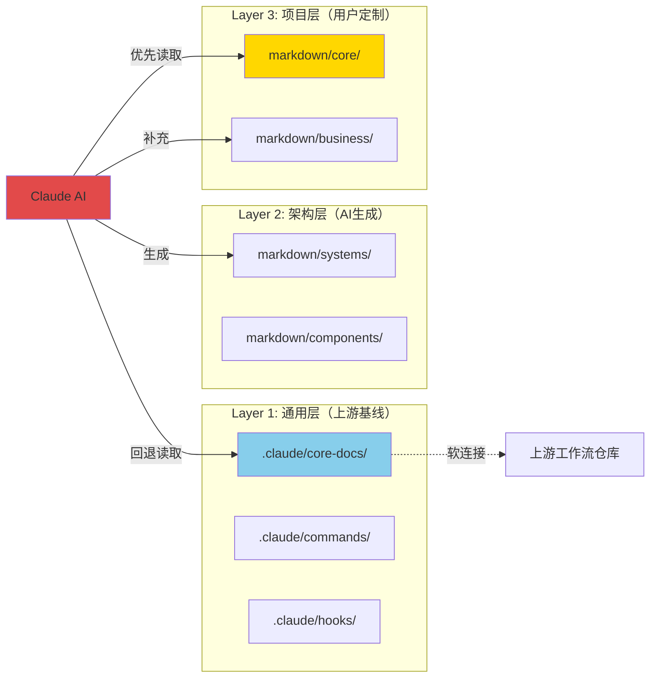

**架构说明**：

- **Layer 1（通用层）**：由工作流管理，通过软连接引用上游仓库，升级时自动同步
- **Layer 2（架构层）**：AI根据代码结构自动生成，包含Systems文档、组件文档
- **Layer 3（项目层）**：用户自主维护，包含项目特定业务逻辑、定制规范

**智能路由规则**：
1. AI读取核心文档时，优先检查 `markdown/core/` 覆盖层
2. 如果覆盖层不存在，回退到 `.claude/core-docs/` 基线层
3. 版本升级时，自动检测覆盖层冲突并提示合并

---

## 3. 模块设计

### 3.1 核心模块职责

#### 3.1.1 init-workflow.js（工作流入口）

**职责**：
- 协调整个初始化流程
- 处理命令行参数（`--sync`, `--force`/`--reset`, `--auto-migrate`）
- 执行版本迁移检测
- 调度分析器和生成器

**关键流程**：
```javascript
// 主流程伪代码
async function main() {
  1. 解析命令行参数
  2. 检查是否需要迁移（v18.0迁移逻辑）
  3. 执行项目分析（ProjectAnalyzer）
  4. 生成文档（DocumentGenerator）
  5. 创建软连接（SymlinkManager）
  6. 输出部署报告
}
```

**输入**：
- 目标项目路径
- 命令标志（--sync, --force/--reset, --auto-migrate）

**输出**：
- 完整的工作流文件结构
- `.claude/workflow-manifest.json`（版本追踪）
- 部署日志

---

#### 3.1.2 analyzer.js（项目分析器）

**职责**：
- 扫描Python代码结构
- 检测MODSDK标准组件（Systems/Presets）
- 计算代码复杂度
- 推断项目类型（RPG/BedWars/General）

**核心算法**：

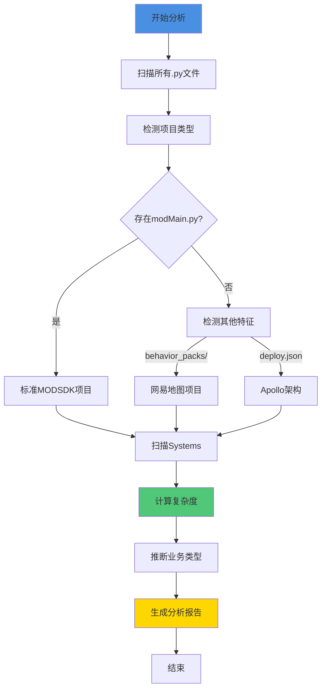

**复杂度评分算法**：
```javascript
function _calculateComplexity() {
  let score = 0;

  // 因素1: 代码行数（权重3）
  if (linesOfCode > 500) score += 3;
  else if (linesOfCode > 200) score += 2;
  else score += 1;

  // 因素2: 方法数量（权重2）
  if (methodCount > 15) score += 2;
  else if (methodCount > 5) score += 1;

  // 因素3: 事件监听数量（权重1）
  if (eventListeners > 5) score += 1;

  // 因素4: 核心System判断（权重2）
  if (name.includes('Manager', 'Core', 'Game')) score += 2;

  // 因素5: 依赖关系（权重2）
  if (importCount > 5) score += 2;

  return score; // 0-10分
}
```

**输出**：`AnalysisReport` 对象，包含：
- `metadata`: 项目元数据（类型、规模、特征）
- `codeStructure`: 代码结构（Systems/Presets列表）
- `docCoverage`: 文档覆盖率（现有文档统计）

---

#### 3.1.3 generator.js（文档生成器）

**职责**：
- 根据分析报告生成三层文档结构
- 处理模板替换（占位符替换）
- 部署Hook脚本
- 创建软连接到上游文档

**生成流程**：

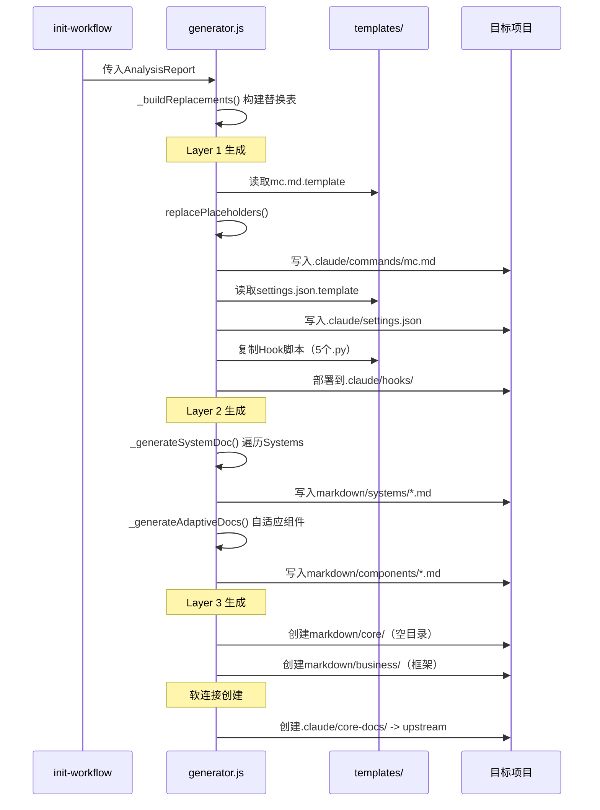

**关键方法**：

| 方法 | 职责 | 输出 |
|-----|------|-----|
| `_generateLayer1()` | 生成通用层（命令、Hook、配置） | `.claude/` 目录 |
| `_generateLayer2()` | 生成架构层（Systems文档） | `markdown/systems/` |
| `_generateAdaptiveDocs()` | 自适应组件文档 | `markdown/components/` |
| `_deployHooks()` | 部署Hook脚本 | `.claude/hooks/*.py` |
| `_deployOfficialDocs()` | 检查官方文档状态 | 日志输出 |

---

#### 3.1.4 project-discovery.js（结构发现器）

**职责**：
- 自动发现项目中的所有组件类型（无需硬编码）
- 推断目录用途（Systems/Presets/Config/Utility）
- 计算置信度分数

**推断算法**：

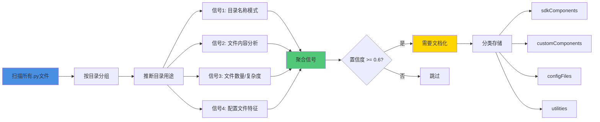

**信号类型**：

| 信号源 | 检测内容 | 置信度权重 |
|-------|---------|----------|
| 目录名称 | `systems/`, `presets/`, `states/` | 0.8-0.9 |
| 文件内容 | `class XXX(ServerSystem)` | 1.0 |
| 文件数量 | 文件数 >= 3 | ×1.1 |
| 配置特征 | `*_config.py` | 1.0 |

**输出结构**：
```javascript
{
  sdkComponents: {
    "path/to/systems": {
      type: "sdk-systems",
      confidence: 0.95,
      fileCount: 8
    }
  },
  customComponents: {
    "path/to/states": {
      type: "custom-component",
      subtype: "state",
      confidence: 0.85,
      fileCount: 5
    }
  },
  configFiles: { ... },
  utilities: { ... }
}
```

---

#### 3.1.5 intelligent-doc-maintenance.js（智能文档维护）

**职责**：
- 自动推断文档映射关系（代码文件 -> 文档文件）
- 智能命名文档（AI推断中文名称）
- 质量评估与更新决策

**工作流程**：

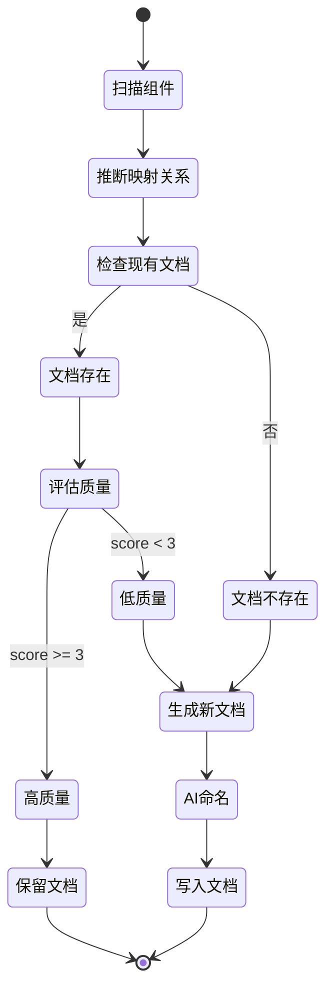

**文档质量评分标准**（0-5分）：

| 因素 | 评分 |
|-----|------|
| 有代码块示例 | +1 |
| 有Mermaid图表 | +1 |
| 有示例说明 | +1 |
| 内容丰富（>500字符） | +1 |
| 非"待补充"模板 | +1 |

**AI命名推断**：
```javascript
// 示例：ShopServerSystem -> "商店服务端系统.md"
_inferChineseNameByAI(filePath, className, componentType) {
  // 1. 提取关键词（Shop, Server, System）
  // 2. 使用内置映射表翻译（Shop->商店, Server->服务端）
  // 3. 组合为中文文件名
  // 4. 返回 "商店服务端系统.md"
}
```

---

#### 3.1.6 version-checker.js（版本检测器）

**职责**：
- 检测工作流版本（本地 vs 上游）
- 计算文件哈希（SHA256）
- 检测覆盖层冲突
- 管理 `workflow-manifest.json`

**版本比较算法**：
```javascript
_compareVersions(v1, v2) {
  // 语义化版本比较（major.minor.patch）
  // 返回：-1（v1<v2）, 0（相等）, 1（v1>v2）

  const parts1 = v1.split('.').map(Number); // [18, 4, 0]
  const parts2 = v2.split('.').map(Number); // [18, 3, 0]

  for (let i = 0; i < Math.max(parts1.length, parts2.length); i++) {
    if (parts1[i] < parts2[i]) return -1;
    if (parts1[i] > parts2[i]) return 1;
  }
  return 0;
}
```

**冲突检测流程**：
1. 读取上次同步时的基线哈希（从 `workflow-manifest.json`）
2. 计算当前上游的基线哈希
3. 遍历覆盖层文件（`markdown/core/*.md`）
4. 如果基线哈希变化，标记为冲突
5. 输出冲突列表，提示用户合并

---

### 3.2 辅助模块

#### 3.2.1 indexer.js（文档索引器）

**职责**：
- 扫描所有文档（Tasks/Systems/Guides）
- 提取元数据（标签、关键词、关联Systems）
- 构建反向索引（标签映射、关键词映射）

**索引结构**：
```javascript
{
  tasks: [
    {
      type: 'task',
      path: 'tasks/task-001-shop-bug',
      name: 'task-001-shop-bug',
      metadata: {
        taskType: '🟡 标准任务',
        status: '已完成',
        relatedSystems: ['ShopServerSystem'],
        keywords: ['商店', '购买', '错误']
      },
      lastModified: '2025-11-10'
    }
  ],
  tagMap: {
    '双端通信': [
      { type: 'task', path: 'tasks/task-002', name: '...' }
    ]
  },
  systemMap: {
    'ShopServerSystem': [
      { type: 'task', path: 'tasks/task-001', name: '...' }
    ]
  }
}
```

**YAML Front Matter 解析**：
```markdown
---
type: ServerSystem
complexity: 7
detail_level: medium
lines_of_code: 350
---
```

#### 3.2.2 search-engine.js（检索引擎）

**职责**：
- 多维度检索（标签、System、关键词、全文）
- 相关度排序
- 时间范围过滤

**查询语法**：
```bash
# 标签搜索
/mc 搜索 tag:双端通信

# System搜索
/mc 搜索 system:ShopSystem

# 关键词搜索
/mc 搜索 keyword:商店购买

# 全文搜索
/mc 搜索 商店错误

# 组合过滤
/mc 搜索 商店 --type=task --after=2025-11-01 --limit=5
```

**相关度算法**：
```javascript
_rankResults(results, query) {
  // 评分因素：
  // 1. 名称完全匹配：+10
  // 2. 名称包含：+5
  // 3. 匹配字段（name:+3, title:+2, keywords:+1）
  // 4. 类型权重（system:+2, task:+1）
  // 5. 最近修改（<7天:+3, <30天:+1）

  return results.sort((a, b) =>
    b.relevanceScore - a.relevanceScore
  );
}
```

#### 3.2.3 utils.js（工具函数库）

**提供的工具函数**：

| 函数 | 功能 | 使用场景 |
|-----|------|---------|
| `ensureDir()` | 递归创建目录 | 生成文档前 |
| `walkDir()` | 递归遍历目录 | 扫描Python文件 |
| `replacePlaceholders()` | 模板占位符替换 | 生成文档 |
| `readFile()` | 安全读取文件（支持GBK） | Windows兼容 |
| `normalizePathForMarkdown()` | 路径格式化（/风格） | Markdown链接 |

---

## 4. 数据流与交互

### 4.1 初始化流程数据流

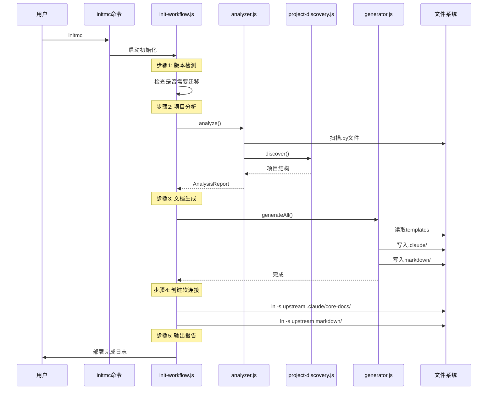

### 4.2 Hook强制执行数据流

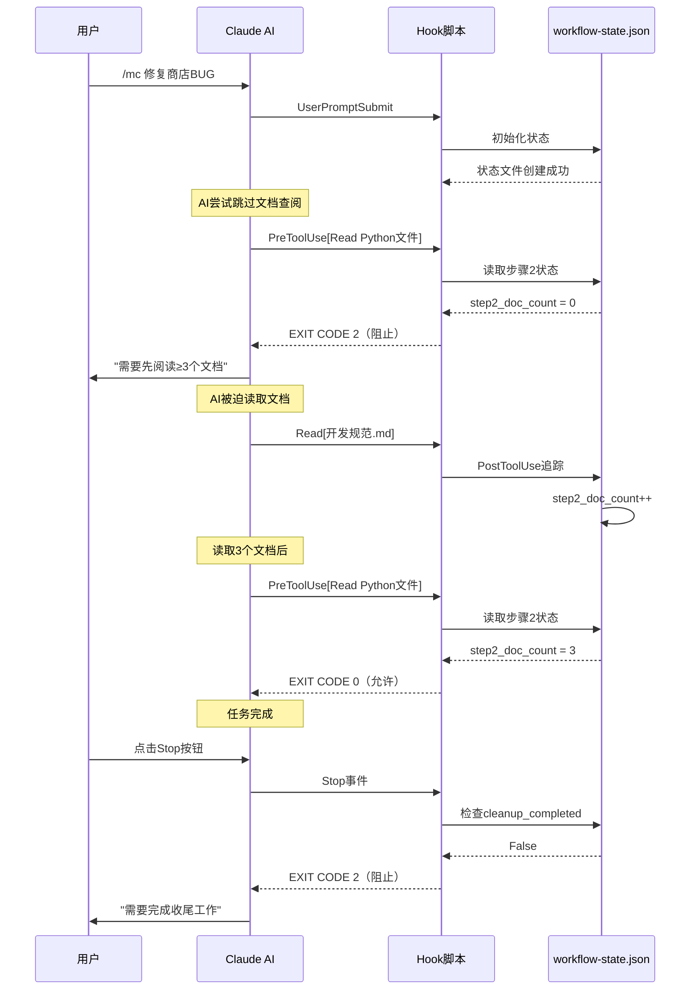

### 4.3 文档路由决策流

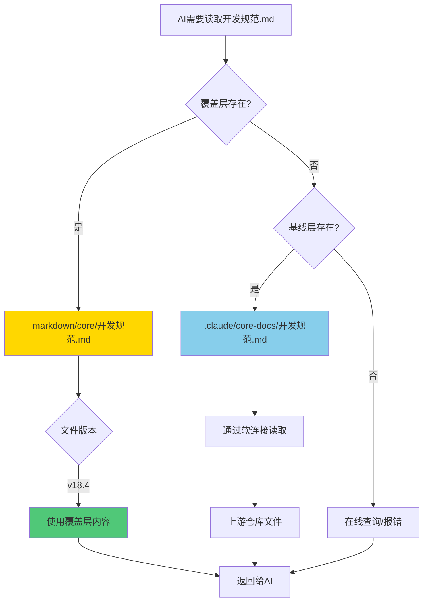

---

## 5. 异常隔离机制 (v20.2.8+)

### 5.1 设计背景

**问题来源**: v20.2.7版本在下游项目实际会话测试中发现，`unified-workflow-driver.py` 存在单点故障问题：

- **P0问题**: Line 878重复导入datetime导致 `UnboundLocalError`，整个Hook完全失效
- **影响范围**: 代码修改提醒、收尾工作流、专家诊断系统全部无法触发
- **根本原因**: 缺乏异常隔离机制，一个模块失败导致整个Hook崩溃

**修复详情**: 参见 [BUG修复工作流执行问题分析报告-v20.2.7.md](../../BUG修复工作流执行问题分析报告-v20.2.7.md)

### 5.2 异常隔离架构

#### 5.2.1 五大隔离阶段

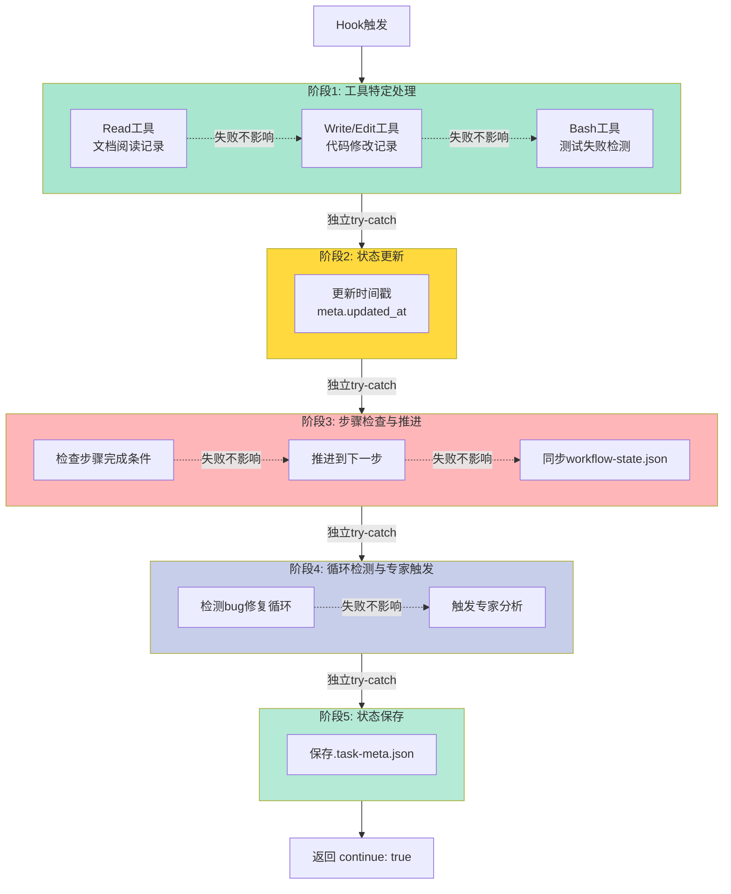

#### 5.2.2 隔离策略详解

**阶段1: 工具特定处理**
```python
# Read工具异常隔离
if tool_name == "Read":
    try:
        file_path = data.get('tool_input', {}).get('file_path', '')
        if update_docs_read(meta, file_path):
            logger.info("文档阅读记录已更新", {"file": file_path})
            step_changed = check_step_completed(current_step, meta)
    except Exception as read_err:
        logger.error("Read工具处理失败", read_err)
        # 继续执行其他逻辑，不中断流程
```

**隔离效果**:
- ❌ 如果Read工具处理失败 → 只记录错误，不影响Write/Edit/Bash处理
- ✅ Write/Edit/Bash工具仍然正常处理
- ✅ 后续步骤检查、专家触发仍然执行

**阶段2: 状态更新**
```python
try:
    meta["updated_at"] = datetime.now().isoformat()
except Exception as timestamp_err:
    logger.error("时间戳更新失败", timestamp_err)
    # 时间戳更新失败不致命，使用旧时间戳继续
```

**隔离效果**:
- ❌ 如果时间戳更新失败 → 使用旧时间戳继续
- ✅ 不影响步骤检查和专家触发

**阶段3: 步骤检查与推进**
```python
try:
    # 检查步骤是否刚刚完成
    if step_changed or check_step_completed(current_step, meta):
        # 标记当前步骤完成
        meta["workflow_state"]["steps"][current_step]["status"] = "completed"
        # 获取下一步
        next_step = get_next_step(current_step)
        # 同步到workflow-state.json
        workflow_state_path = os.path.join(cwd, '.claude', 'workflow-state.json')
        # ...
except Exception as step_check_err:
    logger.error("步骤检查失败", step_check_err)
    # 步骤检查失败不致命，继续执行其他逻辑
```

**隔离效果**:
- ❌ 如果步骤检查失败 → 当前步骤状态不变
- ✅ 专家触发机制仍然执行
- ✅ 状态保存仍然尝试

**阶段4: 循环检测与专家触发**
```python
try:
    expert_check = check_expert_trigger(meta, cwd)

    if expert_check["should_trigger"] and not meta["metrics"].get("expert_review_triggered", False):
        # 触发专家审查
        expert_prompt = launch_meta_expert(expert_check, meta, cwd, logger)
        # ...
except Exception as expert_err:
    logger.error("专家触发检查失败", expert_err)
    # 专家触发失败不影响主流程
```

**隔离效果**:
- ❌ 如果专家触发失败 → 本次不触发专家
- ✅ 不影响状态保存
- ✅ 下次仍然有机会触发专家

**阶段5: 状态保存**
```python
try:
    save_json(meta_path, meta)
except Exception as save_err:
    logger.error("状态保存失败", save_err)
    # 状态保存失败视为严重错误，但仍然放行
    # (避免阻塞用户操作，状态可从其他源恢复)
```

**隔离效果**:
- ❌ 如果状态保存失败 → 本次修改丢失
- ✅ 不阻塞用户操作（返回 continue: true）
- ✅ 可从 workflow-state.json 或 .task-active.json 恢复部分状态

### 5.3 容错级别定义

| 阶段 | 容错级别 | 失败影响 | 恢复策略 |
|-----|---------|---------|---------|
| **阶段1: 工具处理** | 🟢 低风险 | 单个工具记录丢失 | 独立处理，互不影响 |
| **阶段2: 时间戳** | 🟢 低风险 | 时间戳不准确 | 使用旧时间戳继续 |
| **阶段3: 步骤推进** | 🟡 中风险 | 步骤停留在当前 | 下次工具调用重试 |
| **阶段4: 专家触发** | 🟡 中风险 | 本次不触发专家 | 下次满足条件重试 |
| **阶段5: 状态保存** | 🔴 高风险 | 本次修改丢失 | 从三文件同步恢复 |

### 5.4 三文件状态同步机制

为了进一步提高容错性，v20.2.7引入了**三文件状态同步**机制：

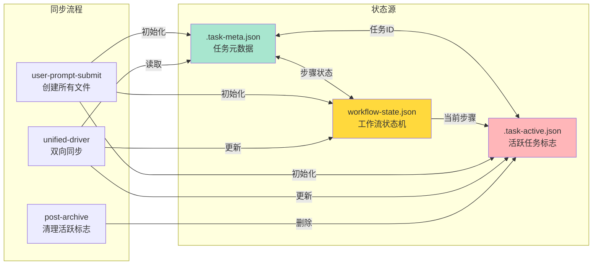

**恢复策略**:
1. 如果 `.task-meta.json` 保存失败 → 从 `workflow-state.json` 读取步骤状态
2. 如果 `workflow-state.json` 损坏 → 从 `.task-meta.json` 重建
3. 如果 `.task-active.json` 丢失 → Hook自动跳过（无活跃任务）

### 5.5 验证方法

**验证场景1: Read工具失败隔离**
```bash
# 模拟Read工具处理异常
# 预期: Write/Edit/Bash工具仍然正常处理
```

**验证场景2: 步骤检查失败隔离**
```bash
# 模拟check_step_completed()抛出异常
# 预期: 专家触发机制仍然执行
```

**验证场景3: datetime变量作用域错误(v20.2.7 bug)**
```bash
# v20.2.7: UnboundLocalError导致整个Hook崩溃
# v20.2.8: 修复后，即使datetime模块有问题，其他阶段仍然执行
```

**验证结果** (v20.2.10):
- ✅ BUG修复任务中，第2次代码修改后出现弹窗提醒
- ✅ 用户输入"已修复"后，任务目录移动到 `tasks/已归档/`
- ✅ 2次负面反馈+2次同文件修改后，触发专家审查
- ✅ Hook日志中无 `UnboundLocalError` 异常

---

## 6. 技术栈

### 6.1 核心技术

| 技术 | 版本 | 用途 |
|-----|------|-----|
| **Node.js** | >=12.0.0 | 运行时环境 |
| **JavaScript** | ES6+ | 主要开发语言 |
| **Python** | 3.x | Hook脚本编写 |
| **fs-extra** | ^10.1.0 | 文件系统操作增强 |
| **glob** | ^7.2.0 | 文件匹配模式 |
| **crypto** | Node内置 | SHA256哈希计算 |

### 6.2 依赖分析

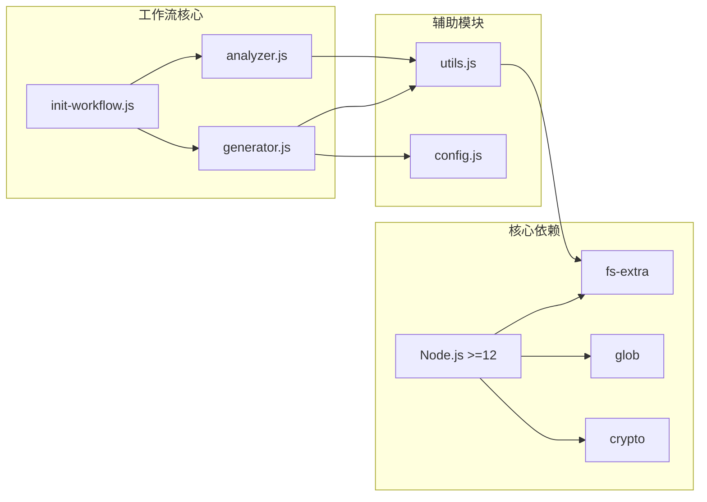

### 6.3 文件结构 (v20.2.10)

```
NeteaseMod-Claude/
├── lib/                        # 核心模块库
│   ├── init-workflow.js        # 主入口
│   ├── analyzer.js             # 项目分析器
│   ├── generator.js            # 文档生成器
│   ├── project-discovery.js    # 结构发现器
│   ├── indexer.js              # 文档索引器
│   ├── search-engine.js        # 检索引擎
│   ├── version-checker.js      # 版本检测器
│   ├── intelligent-doc-maintenance.js  # 智能文档维护
│   ├── symlink-manager.js      # 软连接管理器
│   ├── config.js               # 配置管理
│   ├── utils.js                # 工具函数
│   ├── migration-v16.js        # v16迁移脚本
│   ├── migration-v16.1.js      # v16.1迁移脚本
│   └── migration-v18.js        # v18迁移脚本
├── templates/                  # 模板库
│   ├── .claude/
│   │   ├── commands/           # 命令模板
│   │   │   ├── mc.md.template
│   │   │   ├── mc-review.md.template
│   │   │   ├── mc-perf.md.template
│   │   │   ├── mc-docs.md.template
│   │   │   ├── mc-why.md.template
│   │   │   └── mc-discover.md.template
│   │   ├── hooks/              # Hook脚本 (v20.2核心架构)
│   │   │   ├── unified-workflow-driver.py  # 统一工作流驱动器 (核心)
│   │   │   ├── user-prompt-submit-hook.py  # 任务初始化
│   │   │   ├── iteration-tracker-hook.py   # 迭代追踪
│   │   │   ├── conversation-recorder.py    # 会话历史记录
│   │   │   ├── generate-docs-from-conversation.py  # 文档生成器
│   │   │   ├── post-archive-hook.py        # 任务归档
│   │   │   ├── stop-hook.py                # 收尾验证
│   │   │   ├── session-start-hook.py       # 会话初始化
│   │   │   ├── check-critical-rules.py     # CRITICAL规范检查
│   │   │   ├── enforce-step2.py            # 步骤2强制
│   │   │   ├── track-doc-reading.py        # 文档追踪
│   │   │   ├── enforce-cleanup.py          # 收尾强制
│   │   │   ├── pre-compact-reminder.py     # 抗压缩
│   │   │   ├── hook_logger.py              # Hook日志模块
│   │   │   ├── vscode_notify.py            # 桌面通知模块
│   │   │   ├── workflow_config_loader.py   # 配置加载器
│   │   │   └── (其他辅助Hook...)
│   │   └── settings.json.template
│   ├── markdown/               # 文档模板
│   └── README.md.template
├── markdown/                   # 核心文档库（上游基线）
│   ├── 开发规范.md
│   ├── 问题排查.md
│   ├── 快速开始.md
│   └── ...
├── docs/developer/             # 开发者文档
│   ├── 技术架构.md
│   ├── 数据流设计.md
│   ├── Hook机制.md
│   ├── 通知系统.md
│   └── ...
├── bin/                        # CLI工具
│   ├── initmc.js               # 初始化命令
│   ├── uninstallmc.js          # 卸载命令
│   ├── merge-conflicts.js      # 冲突合并工具
│   └── detect-obsolete.js      # 废弃文件检测
├── scripts/                    # 脚本工具
│   ├── initmc.js               # 初始化脚本
│   ├── compact-claude.py       # 上下文压缩工具
│   ├── deploy-local.js         # 本地部署脚本
│   ├── fix-downstream-claude-md.py  # 修复下游CLAUDE.md
│   └── ...
├── package.json                # npm包配置 (v20.2.10)
├── CHANGELOG.md                # 版本更新日志
└── README.md                   # 项目说明
```

---

## 7. 设计原则

### 7.1 架构设计原则

#### 7.1.1 职责单一原则（SRP）

**实践**：
- 每个模块只负责一个核心功能
- `analyzer.js` 只做分析，不做生成
- `generator.js` 只做生成，不做分析
- `version-checker.js` 只做版本检测，不做文件操作

**反例**：
```javascript
// ❌ 违反SRP（分析器不应该生成文档）
class ProjectAnalyzer {
  analyze() { ... }
  generateDocs() { ... }  // 违反职责单一
}
```

**正例**：
```javascript
// ✅ 职责清晰
class ProjectAnalyzer {
  analyze() { ... }  // 只做分析
}

class DocumentGenerator {
  generateAll() { ... }  // 只做生成
}
```

#### 7.1.2 分层架构原则

**三层架构**：

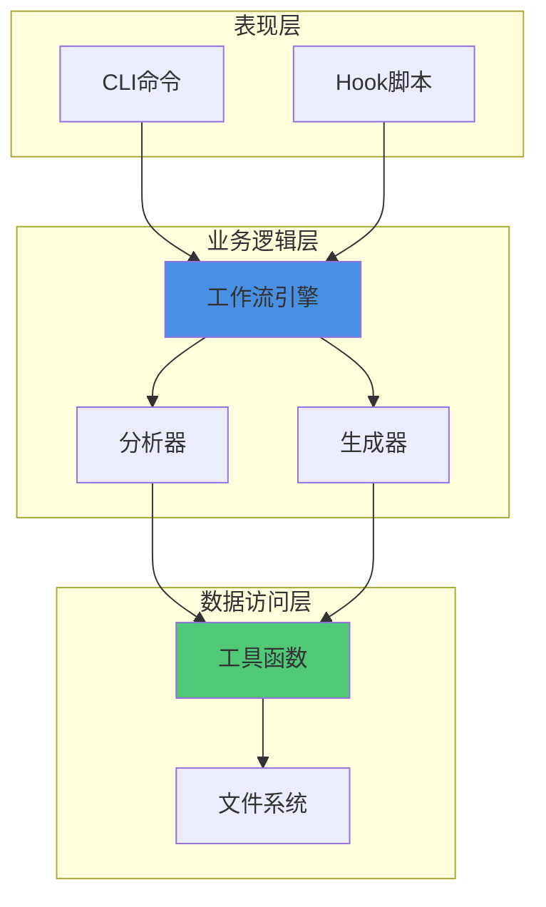

**层间依赖规则**：
- 上层可以依赖下层，下层不能依赖上层
- 同层之间通过接口通信
- 避免跨层调用

#### 7.1.3 可扩展性原则

**插件化设计**：

```javascript
// 模块化组件发现
class ComponentDiscoverer {
  constructor() {
    this.detectors = [
      new SystemDetector(),      // 检测Systems
      new PresetDetector(),      // 检测Presets
      new StateDetector(),       // 检测States
      // 新增检测器只需添加到数组
      new CustomDetector()       // 自定义检测器
    ];
  }

  discover() {
    return this.detectors.map(d => d.detect());
  }
}
```

**配置驱动**：
```javascript
// config.js
const COMPLEXITY_THRESHOLDS = {
  detailed: 8,   // 可调整阈值
  medium: 5
};

// 新增项目类型只需添加配置
const PROJECT_TYPE_KEYWORDS = {
  RPG: ['rpg', 'combat', 'weapon'],
  BedWars: ['bedwars', 'bed', 'generator'],
  NewType: ['keyword1', 'keyword2']  // 扩展
};
```

#### 7.1.4 用户定制优先原则

**覆盖层机制**：
```
优先级：
1. markdown/core/开发规范.md        # 用户定制（最高优先级）
2. .claude/core-docs/开发规范.md    # 上游基线（回退）
3. 在线查询                          # 最后手段
```

**保护用户数据**：
```javascript
// CLAUDE.md 智能合并（保护用户编辑区）
_mergeCLAUDEmd(newTemplate, existingContent) {
  // 1. 提取用户编辑区域（项目配置区、项目扩展区）
  const projectConfig = this._extractSection(existingContent, '项目配置区');
  const projectExtension = this._extractSection(existingContent, '项目扩展区');

  // 2. 提取新模板的工作流内容
  const workflowContent = this._extractSection(newTemplate, '工作流内容');

  // 3. 组装新版（用户内容 + 新工作流）
  return this._assembleCLAUDEmd({
    projectConfig,      // 保留用户配置
    workflowContent,    // 更新工作流
    projectExtension    // 保留用户扩展
  });
}
```

### 7.2 代码质量原则

#### 7.2.1 防御式编程

**文件操作保护**：
```javascript
function readFile(filePath, encoding = 'utf8') {
  try {
    return fs.readFileSync(filePath, encoding);
  } catch (err) {
    // 降级策略：尝试其他编码
    try {
      return fs.readFileSync(filePath, 'latin1');
    } catch (e) {
      console.error(`[工具] 无法读取文件: ${filePath}`);
      return '';  // 返回默认值而非抛出异常
    }
  }
}
```

**空值检查**：
```javascript
// ✅ 安全的属性访问
const keywords = item.metadata?.keywords || item.keywords || [];

// ❌ 不安全的访问
const keywords = item.metadata.keywords;  // 可能报错
```

#### 7.2.2 日志清晰原则

**分级日志**：
```javascript
console.log('[分析器] 开始分析项目...');      // 阶段提示
console.log(`[分析器] 发现 ${count} 个Systems`);  // 数据输出
console.warn(`[生成器] ⚠️  警告: ...`);       // 警告信息
console.error(`[工具] 无法读取文件: ...`);     // 错误信息
```

**进度可视化**：
```javascript
console.log('[生成器] ========== 自适应文档维护 ==========');
console.log('[生成器] ✅ 文档生成完成');
console.log('[生成器] ========== 自适应维护完成 ==========\n');
```

#### 7.2.3 向后兼容原则

**版本检测**：
```javascript
// 支持v15.x到v18.x的无损升级
getLocalVersion() {
  // 1. 优先检查workflow-version.json（v15.x格式）
  if (fs.existsSync(versionPath)) {
    const version = versionFile.version || '15.0.0';
    // 标准化格式（15.0 -> 15.0.0）
    return version.includes('.', version.indexOf('.') + 1)
      ? version
      : version + '.0';
  }

  // 2. 降级检查workflow-manifest.json（v16.0+格式）
  // ...
}
```

**迁移脚本**：
```javascript
// migration-v18.js
class MigrationV18 {
  needsMigration() {
    // 检查是否需要从v17.x迁移到v18.x
    return this._hasV17Structure();
  }

  async migrate() {
    // 1. 备份CLAUDE.md
    // 2. 创建.claude/settings.json
    // 3. 部署Hook脚本
    // 4. 清理旧文件
  }
}
```

---

## 8. 扩展机制

### 8.1 新增组件类型

**步骤**：

1. **更新 `project-discovery.js`**：
```javascript
// 添加新的检测模式
_collectDirectoryNameSignals(dirName, signals) {
  const patterns = [
    // ... 现有模式
    {
      regex: /^controllers?$/i,
      type: 'custom-component',
      subtype: 'controller',
      confidence: 0.85
    }  // 新增
  ];
}

_collectFileContentSignals(files, signals) {
  const contentPatterns = [
    // ... 现有模式
    {
      regex: /class\s+\w+\s*\(\s*.*Controller\s*\)/,
      type: 'custom-component',
      subtype: 'controller',
      confidence: 0.9
    }  // 新增
  ];
}
```

2. **更新 `intelligent-doc-maintenance.js`**：
```javascript
// 添加文档生成模板
_generateComponentDoc(componentName, componentInfo, targetPath) {
  if (componentInfo.subtype === 'controller') {
    return this._generateControllerDoc(componentName, componentInfo);
  }
  // ... 其他类型
}
```

3. **更新 `config.js`**（可选）：
```javascript
const PROJECT_TYPE_KEYWORDS = {
  // ... 现有类型
  MVC: ['controller', 'model', 'view']  // 新增项目类型
};
```

### 8.2 新增命令模板

**步骤**：

1. **创建模板文件**：
```bash
# templates/.claude/commands/mc-test.md.template
```

2. **编写命令内容**：
```markdown
# /mc-test - 单元测试生成器

你是MODSDK项目的单元测试专家。当用户执行 `/mc-test` 命令时：

## 📋 工作流程

1. **扫描目标代码**
   - 识别待测试的System/类
   - 分析方法签名和依赖

2. **生成测试用例**
   - 为每个公共方法生成测试
   - 包含正常情况和边界情况

3. **输出测试文件**
   - 写入 `tests/` 目录
   - 符合pytest规范

## 🎯 使用示例

```bash
/mc-test ShopServerSystem
```
```

3. **注册到 `config.js`**：
```javascript
function getTemplatePath(templateName, projectType = 'General') {
  // ... 现有命令
  else if (templateName === 'mc-test.md') {
    return path.join(TEMPLATES_DIR, '.claude', 'commands', 'mc-test.md.template');
  }
}
```

4. **更新 `generator.js`**：
```javascript
async _generateLayer1(targetPath) {
  // ... 现有命令生成
  this._generateFromTemplate('mc-test.md', targetPath, '.claude/commands/mc-test.md', replacements);
}
```

### 8.3 新增Hook脚本

**步骤**：

1. **创建Hook脚本**：
```python
# templates/.claude/hooks/validate-commit.py
#!/usr/bin/env python3
"""
Commit验证Hook
在用户执行git commit前触发，验证代码质量
"""
import sys
import json

def main():
    # 1. 读取待提交的文件列表
    # 2. 运行代码检查（pylint/flake8）
    # 3. 如果不通过，返回exit code 2（阻止提交）
    pass

if __name__ == '__main__':
    main()
```

2. **注册到 `settings.json.template`**：
```json
{
  "hooks": {
    "PreCommit": {
      "command": ["python", ".claude/hooks/validate-commit.py"],
      "blocking": true
    }
  }
}
```

3. **部署脚本**（`generator.js`）：
```javascript
_deployHooks(targetPath, replacements) {
  const coreHooks = [
    // ... 现有Hook
    'validate-commit.py'  // 新增
  ];

  for (const hookFile of coreHooks) {
    // 复制并设置权限
  }
}
```

### 8.4 自定义分析器

**接口定义**：
```javascript
// lib/custom-analyzer.js
class CustomAnalyzer {
  constructor(projectPath) {
    this.projectPath = projectPath;
  }

  /**
   * 自定义分析逻辑
   * @returns {Object} 分析结果
   */
  analyze() {
    // 实现自定义分析
    return {
      customMetric: 42,
      recommendations: [...]
    };
  }
}
```

**集成到主流程**：
```javascript
// lib/init-workflow.js
const { CustomAnalyzer } = require('./custom-analyzer');

async function main() {
  // ... 标准分析
  const analyzer = new ProjectAnalyzer(targetPath);
  const report = analyzer.analyze();

  // 自定义分析
  const customAnalyzer = new CustomAnalyzer(targetPath);
  const customReport = customAnalyzer.analyze();

  // 合并结果
  report.customData = customReport;
}
```

---

## 附录

### A. 术语表 (v20.2.10)

| 术语 | 定义 |
|-----|------|
| **上游基线** | 工作流仓库中的原始文档，通过软连接引用 |
| **覆盖层** | 用户项目中的定制文档，优先于基线层 |
| **软连接** | 文件系统链接，指向另一个目录/文件 |
| **CRITICAL规范** | 必须遵守的开发规范，违反会导致严重错误 |
| **Hook脚本** | 拦截AI行为的Python脚本，实现工作流强制执行 |
| **统一工作流驱动器** | unified-workflow-driver.py，v20.2核心Hook，负责状态机驱动、工具分发、异常隔离 |
| **任务隔离** | 每个任务独立目录 `tasks/{task_id}/`，包含元数据、会话历史、归档文档 |
| **workflow-state.json** | 工作流状态机文件，追踪步骤完成情况、循环检测指标 |
| **.task-meta.json** | 任务元数据文件，保存任务ID、类型、度量指标、工作流状态 |
| **.task-active.json** | 活跃任务标志文件，用于快速判断是否有任务执行中 |
| **.conversation.jsonl** | 会话历史文件，记录所有工具调用，支持跨会话恢复 (v20.2.8+) |
| **异常隔离** | 5大阶段独立try-catch包装，防止单点故障导致Hook完全失效 (v20.2.8+) |
| **三文件同步** | .task-meta.json ↔ workflow-state.json ↔ .task-active.json 状态同步机制 (v20.2.7+) |
| **自适应发现** | 无需硬编码，自动推断项目组件类型的算法 |

### B. 常见问题

#### Q1: 如何调试Hook脚本？

**答**：
1. 检查 `.claude/hooks/` 目录权限（Linux/Mac需要755）
2. 手动执行Hook脚本测试：
   ```bash
   python .claude/hooks/enforce-step2.py
   ```
3. 查看Claude Code日志（通常在 `~/.claude/logs/`）
4. 在Hook脚本中添加日志输出：
   ```python
   import sys
   print("[DEBUG] 当前状态:", state, file=sys.stderr)
   ```

#### Q2: 软连接在Windows上无法创建？

**答**：
- Windows需要管理员权限创建符号链接
- 或者在开发者模式下运行
- 工作流已实现降级方案：如果软连接失败，会复制文件

#### Q3: 如何禁用Hook强制执行？

**答**：
编辑 `.claude/settings.json`，注释掉相关Hook：
```json
{
  "hooks": {
    // "PreToolUse[Read]": { ... }  // 注释掉
  }
}
```

#### Q4: 为什么需要异常隔离机制？(v20.2.8+)

**答**：
异常隔离机制解决了单点故障问题：

**问题场景** (v20.2.7 bug):
- unified-workflow-driver.py 的 Line 878 重复导入datetime
- 当 `should_remind = False` 时触发 `UnboundLocalError`
- 整个Hook崩溃，导致代码修改提醒、收尾工作流、专家诊断全部失效

**修复方案** (v20.2.8+):
- 将关键业务逻辑包装在独立的 try-catch 块中
- 5大阶段独立容错：工具处理、状态更新、步骤推进、专家触发、状态保存
- 单个模块失败不影响其他模块

**验证方法**:
```bash
# 查看Hook日志，确认各阶段独立执行
grep "阶段" .claude/logs/hook-*.log

# 输出示例:
# [INFO] 阶段1: Read工具处理成功
# [ERROR] 阶段2: 时间戳更新失败 (不影响后续)
# [INFO] 阶段3: 步骤推进成功
# [INFO] 阶段4: 专家触发检查成功
# [INFO] 阶段5: 状态保存成功
```

#### Q5: 三文件状态同步机制是如何工作的？(v20.2.7+)

**答**：
为了提高容错性，v20.2.7引入三文件状态同步：

**三个文件的职责**:
1. `.task-meta.json` - 主状态源，包含完整的任务元数据
2. `workflow-state.json` - 工作流状态机，追踪步骤和循环检测
3. `.task-active.json` - 快速查询标志，判断是否有活跃任务

**同步流程**:
- `user-prompt-submit-hook.py` → 创建所有文件
- `unified-workflow-driver.py` → 双向同步（meta ↔ workflow-state）
- `post-archive-hook.py` → 清理 `.task-active.json`

**恢复策略**:
- 如果 `.task-meta.json` 保存失败 → 从 `workflow-state.json` 恢复
- 如果 `workflow-state.json` 损坏 → 从 `.task-meta.json` 重建
- 如果 `.task-active.json` 丢失 → Hook自动跳过（无活跃任务）

### C. 性能优化建议

1. **索引缓存**：`doc-index.json` 避免每次重新构建
2. **增量分析**：只分析修改过的文件（计划中）
3. **并行处理**：使用 `Promise.all()` 并行生成文档
4. **懒加载**：按需加载模块（require()放在函数内部）

### D. 相关资源

- **项目仓库**：https://github.com/jju666/NeteaseMod-Claude
- **MODSDK Wiki**：https://github.com/EaseCation/netease-modsdk-wiki
- **Claude Code文档**：https://docs.anthropic.com/claude/docs/claude-code

---

**文档维护**：本文档由项目核心开发者维护，版本与工作流版本同步更新。

**贡献指南**：欢迎提交PR改进本文档，请确保：
1. 图表使用Mermaid语法
2. 代码示例有充分注释
3. 保持中文编写风格
