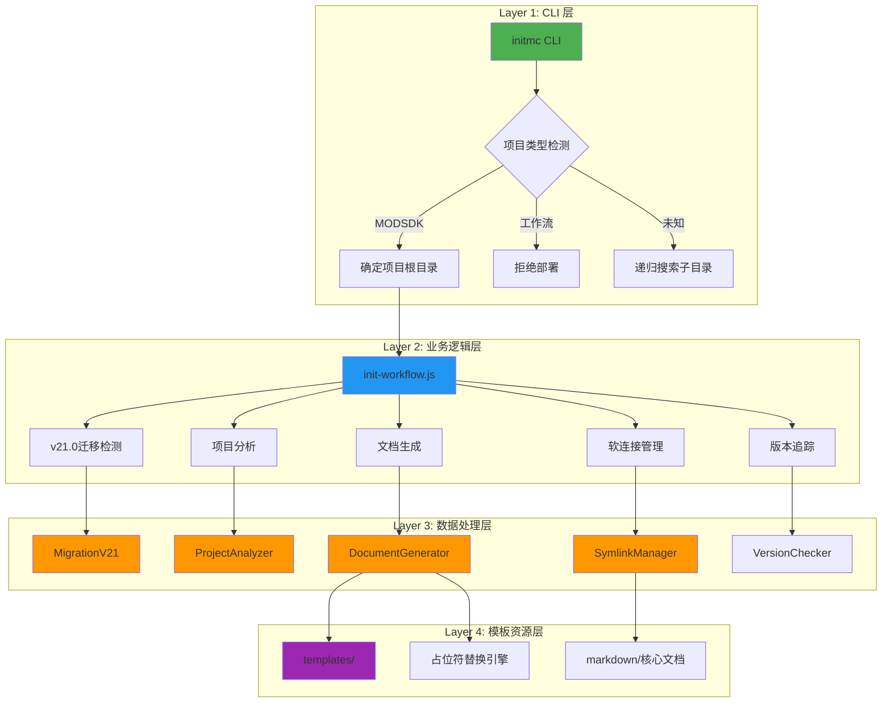
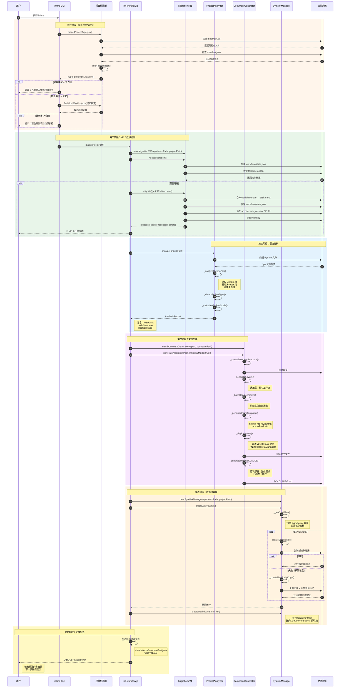
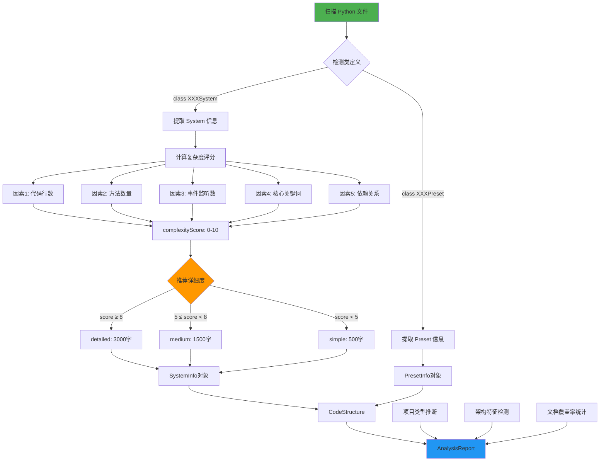
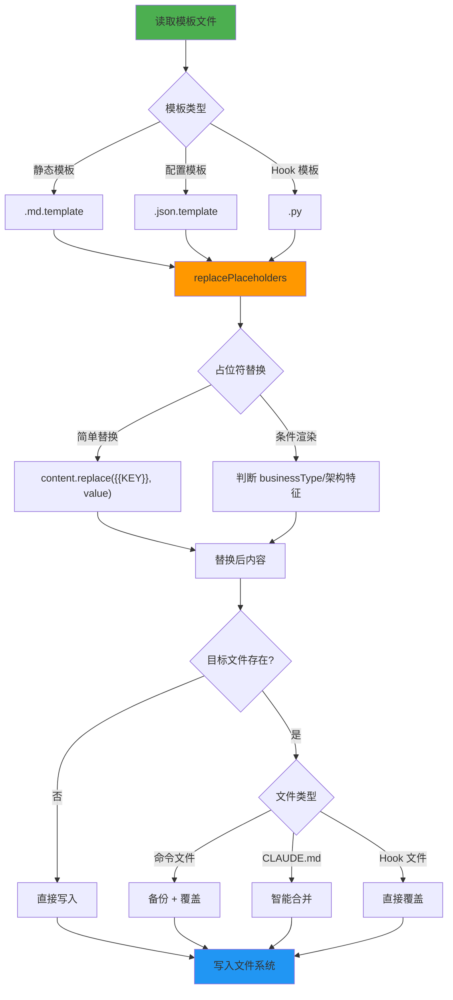
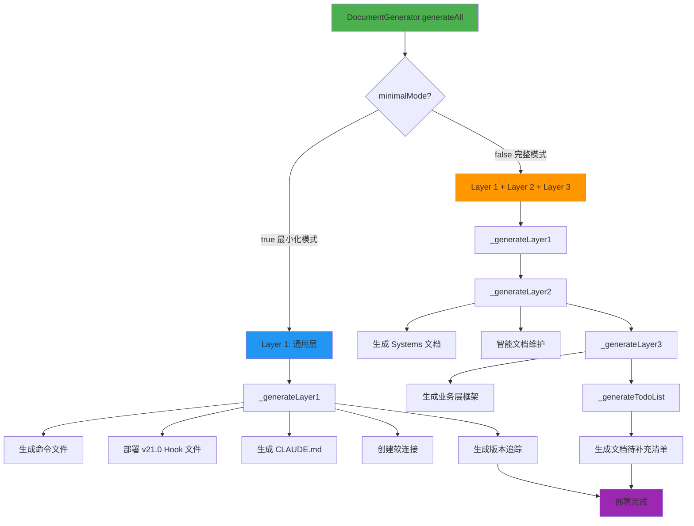
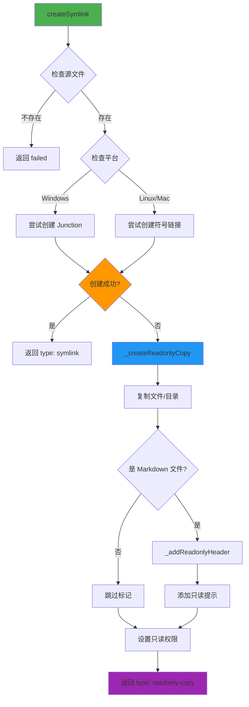
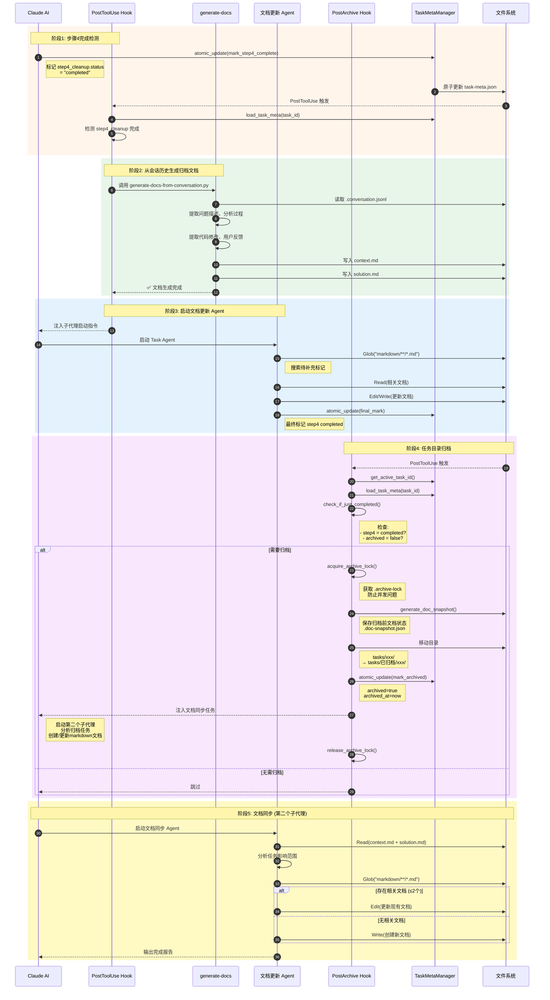

# MODSDK 工作流数据流设计文档

> **文档版本**: v4.0
> **创建日期**: 2025-11-13
> **最后更新**: 2025-11-15
> **适用版本**: v21.1.2+

---

## 📋 目录

1. [概述](#概述)
2. [架构变更(v21.0)](#架构变更v210)
3. [核心架构](#核心架构)
4. [initmc 命令执行流程](#initmc-命令执行流程)
5. [任务执行数据流](#任务执行数据流)
6. [二文件状态架构](#二文件状态架构) ⭐ **v21.0重构**
7. [会话历史持久化](#会话历史持久化)
8. [数据转换流程](#数据转换流程)
9. [模板处理机制](#模板处理机制)
10. [文档生成流程](#文档生成流程)
11. [软连接管理机制](#软连接管理机制)
12. [归档流程](#归档流程)
13. [数据模型定义](#数据模型定义)

---

## 概述

### 设计目标

MODSDK 工作流采用**模板驱动 + 数据转换**的架构模式，实现：

1. **零配置部署**: 用户执行 `initmc` 即可完成工作流部署
2. **智能分析**: 自动分析项目结构，推断项目类型和架构特征
3. **模板复用**: 通过占位符替换机制实现模板定制化
4. **双层文档架构**: 上游基线文档 + 项目覆盖层，支持零风险升级
5. **软连接管理**: 跨平台软连接机制，优雅降级为只读副本
6. **单一数据源**: v21.0使用task-meta.json为唯一数据源，消除数据不一致

### 核心组件

| 组件 | 文件路径 | 职责 |
|-----|---------|-----|
| **入口脚本** | `scripts/initmc.js` | CLI 命令入口，项目检测与部署流程编排 |
| **工作流初始化器** | `lib/init-workflow.js` | 核心业务逻辑，协调各模块执行工作流初始化 |
| **项目分析器** | `lib/analyzer.js` | 扫描代码结构，推断项目类型和复杂度 |
| **文档生成器** | `lib/generator.js` | 基于分析报告和模板生成定制化文档 |
| **软连接管理器** | `lib/symlink-manager.js` | 创建和管理上游文档到下游项目的引用 |
| **迁移管理器** | `lib/migration-v21.js` | v21迁移脚本，支持旧版本任务迁移 |
| **配置管理器** | `lib/config.js` | 全局配置、常量定义、路径解析 |

---

## 架构变更(v21.0)

### v21.0 核心变更

```
┌──────────────────────────────────────────────────────────┐
│              早期架构（已废弃）                            │
├──────────────────────────────────────────────────────────┤
│  数据源：                                                 │
│    1. workflow-state.json (主数据源, AI可编辑)           │
│    2. task-meta.json (完整副本)                          │
│    3. .task-active.json (活跃标记)                       │
│                                                          │
│  状态管理器：StateManager                                 │
│    - 三文件同步逻辑                                       │
│    - 手动同步API                                          │
│    - 无文件锁机制                                         │
│                                                          │
│  ❌ 问题：数据不一致风险                                  │
│  ❌ 问题：AI修改workflow-state后Hook无法感知              │
└──────────────────────────────────────────────────────────┘

                        ↓ 重构

┌──────────────────────────────────────────────────────────┐
│              v21.0 架构（当前版本）                        │
├──────────────────────────────────────────────────────────┤
│  数据源：                                                 │
│    1. task-meta.json (唯一数据源) ✨                     │
│    2. .task-active.json (活跃标记指针)                   │
│                                                          │
│  状态管理器：TaskMetaManager                              │
│    - portalocker文件锁                                   │
│    - atomic_update()原子更新                             │
│    - 3次重试+100ms延迟                                   │
│    - 无需手动同步                                         │
│                                                          │
│  ✅ 优势：单一数据源，无数据不一致                         │
│  ✅ 优势：文件锁保证并发安全                               │
│  ✅ 优势：简化Hook逻辑                                     │
└──────────────────────────────────────────────────────────┘
```

### 迁移路径

v21.0提供自动迁移机制：

```bash
# 运行initmc时自动检测并迁移
npm run mc:deploy
# 或
/initmc
```

**迁移脚本**: `lib/migration-v21.js`

**迁移内容**:
1. 检测 `.claude/workflow-state.json` 并合并到 `task-meta.json`
2. 删除 `workflow-state.json`
3. 为所有 `task-meta.json` 添加 `architecture_version: "21.0"`
4. 删除冗余字段: `workflow_state`, `workflow_state_ref`, `archived_snapshot`

---

## 核心架构

### 三层架构模式



---

## initmc 命令执行流程

### 完整执行序列图（v21.0）



---

## 任务执行数据流

### 完整执行序列图 (v21.0)

```mermaid
sequenceDiagram
    autonumber

    participant User as 用户
    participant CLI as Claude Code CLI
    participant Hook1 as UserPromptSubmit Hook
    participant AI as Claude AI
    participant Hook2 as PostToolUse Hook
    participant Hook3 as PostArchive Hook
    participant TMM as TaskMetaManager
    participant FS as 文件系统

    rect rgb(255, 245, 235)
        Note over User,Hook1: 第一阶段：任务初始化 (/mc 命令)
        User->>CLI: 输入 "/mc 修复商店购买功能"
        CLI->>Hook1: UserPromptSubmit 触发

        Hook1->>Hook1: 检测 /mc 命令
        Hook1->>Hook1: 生成 task_id (20251115-143520-修复商店购买功能)
        Hook1->>FS: 创建 tasks/20251115-143520-修复商店购买功能/

        Hook1->>TMM: new TaskMetaManager(cwd)
        Hook1->>TMM: 初始化 task-meta.json
        Note right of Hook1: architecture_version: "21.0"<br/>current_step: "step3_execute"<br/>steps, metrics, bug_fix_tracking

        TMM->>FS: atomic_update() 写入 task-meta.json
        Note right of TMM: portalocker文件锁<br/>原子性写入

        Hook1->>FS: 初始化 .conversation.jsonl
        Note right of Hook1: 会话历史持久化

        Hook1->>TMM: set_active_task(task_id)
        TMM->>FS: 写入 .claude/.task-active.json
        Note right of TMM: {"task_id": "xxx",<br/>"created_at": "..."}

        Hook1->>Hook1: 匹配玩法知识库
        Note right of Hook1: 查找 knowledge-base.json<br/>或生成BUG修复指引

        Hook1-->>AI: 注入玩法包/BUG修复指引
        Note right of AI: 包含完整实现代码<br/>或智能诊断路径
    end

    rect rgb(232, 245, 233)
        Note over AI,Hook2: 第二阶段：任务执行 (Read/Write/Edit/Bash)

        loop 工具调用循环
            AI->>FS: Read(文档) / Edit(代码) / Bash(测试)
            FS-->>AI: 工具执行结果

            AI->>Hook2: PostToolUse 触发

            Hook2->>TMM: get_active_task_id()
            TMM->>FS: 读取 .task-active.json
            FS-->>TMM: 返回 task_id

            alt 无活跃任务
                Hook2-->>AI: 跳过，继续执行
            else 有活跃任务
                Hook2->>TMM: load_task_meta(task_id)
                TMM->>FS: 加载 task-meta.json（带文件锁）
                FS-->>TMM: 返回 task_meta

                Hook2->>Hook2: 工具分发处理
                Note right of Hook2: Read → 更新docs_read<br/>Write/Edit → 更新code_changes<br/>Bash → 检测失败

                Hook2->>Hook2: 检查步骤完成条件
                Note right of Hook2: step0: CLAUDE.md已读<br/>step1: 文档已阅读<br/>step3: 用户确认<br/>step4: cleanup完成

                alt 步骤完成
                    Hook2->>Hook2: 准备更新函数
                    Note right of Hook2: def update_func(meta):<br/>  meta['current_step'] = next_step<br/>  meta['steps'][next_step]['status'] = 'in_progress'<br/>  return meta

                    Hook2->>TMM: atomic_update(task_id, update_func)
                    TMM->>FS: 加载当前状态（带锁）
                    TMM->>TMM: 执行更新函数
                    TMM->>FS: 保存（同一锁内）
                    FS-->>TMM: ✅ 原子更新成功

                    Hook2-->>AI: 注入下一步指令
                    Note right of AI: 步骤4特殊处理：<br/>生成context.md/solution.md<br/>启动子代理
                else 步骤未完成
                    Hook2->>Hook2: 检查循环模式
                    Note right of Hook2: 检测Bug修复循环<br/>2次迭代+2次负面反馈<br/>+2次同文件修改

                    alt 触发专家诊断
                        Hook2-->>AI: 注入专家分析prompt
                        Note right of AI: Meta-Expert系统<br/>战略高度分析<br/>备选方案推荐
                    else 继续执行
                        Hook2-->>AI: 继续当前步骤
                    end
                end
            end
        end
    end

    rect rgb(227, 242, 253)
        Note over User,AI: 第三阶段：用户确认与收尾
        User->>AI: "已修复" 或 "功能已完成"
        AI->>AI: 解析用户反馈
        Note right of AI: 检测确认关键词<br/>标记user_confirmed=true

        AI->>Hook2: PostToolUse触发（用户消息后）
        Hook2->>Hook2: 检测 step3_execute 完成条件
        Hook2->>Hook2: 准备推进到 step4_cleanup

        Hook2->>TMM: atomic_update(task_id, update_func)
        Note right of Hook2: 标记step3完成<br/>推进到step4

        Hook2->>FS: 调用 generate-docs-from-conversation.py
        Note right of Hook2: 从会话历史生成<br/>context.md + solution.md

        Hook2-->>AI: 注入子代理启动指令
        Note right of AI: 文档更新Agent<br/>自动补充markdown文档

        AI->>AI: 启动 Task Agent
        Note right of AI: 独立子代理<br/>不消耗主会话上下文

        AI->>FS: 搜索待补充文档 (Glob)
        AI->>FS: 更新相关文档 (Edit/Write)

        AI->>TMM: atomic_update(task_id, mark_step4_complete)
        Note right of AI: 标记 step4_cleanup completed
    end

    rect rgb(248, 231, 253)
        Note over Hook3,FS: 第四阶段：任务归档
        FS-->>Hook3: PostToolUse触发
        Hook3->>TMM: get_active_task_id()
        Hook3->>TMM: load_task_meta(task_id)
        TMM->>FS: 加载 task-meta.json（带锁）
        FS-->>TMM: 返回 task_meta

        Hook3->>Hook3: 检测 step4_cleanup 是否完成

        alt step4 已完成且未归档
            Hook3->>Hook3: 获取归档锁
            Note right of Hook3: .archive-lock<br/>防止并发问题

            Hook3->>FS: 移动任务目录
            Note right of Hook3: tasks/xxx/<br/>→ tasks/已归档/xxx/

            Hook3->>TMM: atomic_update(task_id, mark_archived)
            Note right of Hook3: archived=true<br/>archived_at=now

            Hook3->>FS: 生成文档快照
            Note right of Hook3: .claude/.doc-snapshot.json<br/>记录归档前状态

            Hook3-->>AI: 注入文档同步任务
            Note right of AI: 启动第二个子代理<br/>分析归档任务<br/>创建/更新markdown文档

            Hook3->>Hook3: 释放归档锁
        else step4 未完成或已归档
            Hook3-->>AI: 跳过归档
        end
    end

    rect rgb(255, 249, 196)
        Note over User,AI: 第五阶段：完成报告
        AI-->>User: 任务完成总结
        Note right of User: - 代码修改摘要<br/>- 文档更新列表<br/>- 测试验证结果<br/>- 归档路径
    end
```



### 数据流关键路径

#### 路径1: 任务初始化 (/mc → UserPromptSubmit Hook) - v21.0

```
用户输入 "/mc 任务描述"
  ↓
UserPromptSubmit Hook 检测
  ↓
生成 task_id (时间戳-简短描述)
  ↓
创建目录结构:
  tasks/20251115-xxx-任务描述/
    ├─ .task-meta.json         # 任务完整状态（唯一数据源）✨
    ├─ .conversation.jsonl      # 会话历史
    ├─ context.md (待生成)      # 问题上下文
    └─ solution.md (待生成)     # 解决方案
  ↓
初始化任务元数据（v21.0）:
  TaskMetaManager.atomic_update(task_id, init_func)

  .task-meta.json 内容:
    - architecture_version: "21.0" ✨
    - task_id, task_description
    - current_step: "step3_execute"
    - steps: {step0, step1, step3, step4}
    - metrics: {docs_read, code_changes, failures}
    - bug_fix_tracking: {iterations, loop_indicators}
  ↓
设置活跃任务:
  TaskMetaManager.set_active_task(task_id)

  .claude/.task-active.json 内容:
    - task_id
    - created_at
  ↓
匹配玩法知识库或生成BUG修复指引
  ↓
注入到AI对话上下文
```

#### 路径2: 工具调用处理 (Read/Write/Edit → PostToolUse Hook) - v21.0

```
AI 调用工具 (Read/Write/Edit/Bash)
  ↓
工具执行完成
  ↓
PostToolUse Hook 触发
  ↓
快速检查活跃任务:
  task_id = TaskMetaManager.get_active_task_id()
  ├─ None → 跳过 (无活跃任务)
  └─ 存在 → 继续处理
  ↓
加载任务元数据（v21.0）:
  task_meta = TaskMetaManager.load_task_meta(task_id)
  # 自动使用portalocker文件锁
  ↓
工具类型分发:
  ├─ Read  → update_docs_read()
  │          └─ metrics.docs_read.append(file_path)
  │
  ├─ Write/Edit → update_code_changes()
  │               └─ metrics.code_changes.append(change_record)
  │               └─ 统计 same_file_edit_count
  │               └─ 更新 bug_fix_tracking
  │
  └─ Bash → check_test_failure()
            └─ metrics.failure_count += 1
            └─ 检查是否触发专家诊断
  ↓
检查步骤完成条件:
  ├─ step0_context: "CLAUDE.md" in docs_read
  ├─ step1_understand: docs_read_count > 0
  ├─ step3_execute: user_confirmed = true
  └─ step4_cleanup: status = "completed"
  ↓
步骤完成 → 推进状态机（v21.0原子更新）:
  def update_func(meta):
      # 1. 标记当前步骤完成
      meta['steps'][current_step]['status'] = 'completed'
      meta['steps'][current_step]['completed_at'] = now()

      # 2. 推进到下一步
      meta['current_step'] = next_step
      meta['steps'][next_step]['status'] = 'in_progress'
      meta['steps'][next_step]['started_at'] = now()

      return meta

  TaskMetaManager.atomic_update(task_id, update_func)
  # ✨ v21.0: 无需手动同步其他文件！
  ↓
注入下一步指令
```

#### 路径3: 步骤4收尾 (step4_cleanup → 文档生成 → 归档) - v21.0

```
AI 标记 step4 完成:
  TaskMetaManager.atomic_update(task_id, lambda meta: {
      **meta,
      "steps": {
          **meta["steps"],
          "step4_cleanup": {
              **meta["steps"]["step4_cleanup"],
              "status": "completed",
              "completed_at": datetime.now().isoformat()
          }
      }
  })
  ↓
PostToolUse Hook 检测到 step4 完成
  ↓
调用 generate-docs-from-conversation.py
  ├─ 读取 .conversation.jsonl
  ├─ 提取问题描述、分析过程、代码修改
  ├─ 生成 context.md
  └─ 生成 solution.md
  ↓
注入子代理启动指令
  ↓
AI 启动 Task Agent (子代理)
  ├─ 搜索 markdown/**/*.md (待补充标记)
  ├─ 更新相关文档 (Edit/Write)
  └─ TaskMetaManager.atomic_update() 最终标记完成
  ↓
PostArchive Hook 检测到归档条件
  ↓
归档流程（v21.0）:
  task_meta = TaskMetaManager.load_task_meta(task_id)

  if task_meta['steps']['step4_cleanup']['status'] == 'completed' and not task_meta.get('archived'):
      # 1. 获取归档锁
      lock = acquire_archive_lock(task_dir)

      # 2. 移动任务目录
      shutil.move(task_dir, archived_task_dir)

      # 3. 标记归档（原子更新）
      TaskMetaManager.atomic_update(task_id, lambda meta: {
          **meta,
          "archived": True,
          "archived_at": datetime.now().isoformat()
      })

      # 4. 生成文档快照
      generate_doc_snapshot()

      # 5. 释放归档锁
      release_archive_lock()
  ↓
AI 启动文档同步 Agent
  ├─ 读取 context.md + solution.md
  ├─ 分析任务影响范围
  ├─ 创建/更新 markdown 文档
  └─ 输出完成报告
  ↓
任务完成
```

---

## 二文件状态架构

### 设计动机 (v21.0)

**早期版本问题背景**:
- ❌ 三文件同步逻辑复杂（workflow-state.json + task-meta.json + .task-active.json）
- ❌ 数据不一致风险：AI修改workflow-state后，Hook无法感知变化
- ❌ 步骤推进逻辑失效（如 step4 完成后无法触发归档）
- ❌ 手动同步API易出错

**v21.0解决方案**:
- ✅ **单一数据源**：task-meta.json为唯一权威数据源
- ✅ **文件锁机制**：portalocker保证并发安全
- ✅ **原子更新**：atomic_update()闭包模式
- ✅ **自动重试**：3次重试+100ms延迟
- ✅ **简化Hook**：无需手动同步逻辑

### 二文件职责划分（v21.0）

| 文件路径 | 职责 | 生命周期 | 更新时机 | 读取者 |
|---------|------|---------|---------|--------|
| **tasks/{task_id}/.task-meta.json** | 任务完整状态（唯一数据源）✨ | 任务级 | 每次工具调用后<br/>原子更新 | pretooluse_enforcer.py<br/>posttooluse_updater.py<br/>post_archive.py |
| **.claude/.task-active.json** | 活跃任务标志（快速查找指针） | 会话级 | 任务初始化<br/>任务归档删除 | pretooluse_enforcer.py<br/>posttooluse_updater.py<br/>post_archive.py |

**架构对比**:

| 特性 | 早期版本 | v21.0 |
|-----|-------|-------|
| 数据源数量 | 3个（workflow-state + task-meta + task-active） | 2个（task-meta + task-active） |
| 权威数据源 | workflow-state.json（AI可编辑）| task-meta.json |
| 同步机制 | 手动三文件同步 | 无需同步 |
| 并发安全 | 无锁机制 | portalocker文件锁 |
| 更新方式 | 直接写入 | atomic_update()闭包 |
| 数据一致性 | 风险高 | 保证一致 |

### 数据流向图（v21.0）

```
┌──────────────────────────────────────────────────────────┐
│                  .task-active.json                       │
│  {                                                       │
│    "task_id": "20251115-123456-修复玩家死亡BUG",        │
│    "created_at": "2025-11-15T12:34:56.789Z"             │
│  }                                                       │
└──────────────────────────────────────────────────────────┘
                         ↓ 指向
┌──────────────────────────────────────────────────────────┐
│       tasks/{task_id}/.task-meta.json                    │
│  {                                                       │
│    "architecture_version": "21.0",        ✨ v21.0标记   │
│    "task_id": "...",                                     │
│    "task_description": "...",                            │
│    "current_step": "step3_execute",                      │
│    "steps": {                                            │
│      "step0_context": {...},                             │
│      "step1_understand": {...},                          │
│      "step3_execute": {...},                             │
│      "step4_cleanup": {...}                              │
│    },                                                    │
│    "metrics": {                                          │
│      "docs_read": [...],                                 │
│      "code_changes": [...],                              │
│      "failures": [...]                                   │
│    },                                                    │
│    "bug_fix_tracking": {                                 │
│      "iterations": [...],                                │
│      "loop_indicators": {...}                            │
│    }                                                     │
│  }                                                       │
└──────────────────────────────────────────────────────────┘
                         ↑
              所有Hook直接读取此文件
              使用 TaskMetaManager.load_task_meta()
              使用 TaskMetaManager.atomic_update()
```

### 原子更新流程图（v21.0核心机制）

```mermaid
flowchart TD
    A[Hook调用 atomic_update] --> B[定义更新函数]

    B --> C["def update_func(meta):<br/>  meta['current_step'] = 'step3'<br/>  return meta"]

    C --> D[TaskMetaManager.atomic_update<br/>(task_id, update_func)]

    D --> E[尝试次数 attempt = 0]

    E --> F{attempt < max_retries?}
    F -->|否| G[❌ 抛出异常]
    F -->|是| H[portalocker.Lock 获取锁]

    H --> I{锁获取成功?}
    I -->|否| J[等待 retry_delay]
    I -->|是| K[读取文件内容]

    J --> L[attempt += 1]
    L --> F

    K --> M[执行 update_func]
    M --> N[写回文件 seek(0) + truncate]
    N --> O[释放锁]

    O --> P[✅ 返回更新后的meta]

    style A fill:#4CAF50
    style D fill:#FF9800
    style H fill:#2196F3
    style I fill:#FFC107
    style P fill:#4CAF50
    style G fill:#F44336
```

### 原子更新代码示例（v21.0）

```python
from core.task_meta_manager import TaskMetaManager

# 初始化管理器
mgr = TaskMetaManager(cwd)

# 方式1: 简单更新（推荐）
def update_func(meta: Dict) -> Dict:
    # 1. 读取当前值
    current_step = meta.get('current_step')

    # 2. 执行更新逻辑
    meta['current_step'] = 'step3_execute'
    meta['steps']['step3_execute']['status'] = 'in_progress'
    meta['steps']['step3_execute']['started_at'] = datetime.now().isoformat()

    # 3. 更新metrics
    if 'metrics' not in meta:
        meta['metrics'] = {}
    meta['metrics']['tool_calls'] = meta['metrics'].get('tool_calls', [])
    meta['metrics']['tool_calls'].append({
        "tool": "Edit",
        "timestamp": datetime.now().isoformat()
    })

    # 4. 返回更新后的meta
    return meta

# 执行原子更新
updated_meta = mgr.atomic_update(task_id, update_func)

# 方式2: Lambda表达式（简洁）
updated_meta = mgr.atomic_update(
    task_id,
    lambda meta: {
        **meta,
        "current_step": "step4_cleanup",
        "steps": {
            **meta["steps"],
            "step4_cleanup": {
                **meta["steps"]["step4_cleanup"],
                "status": "completed",
                "completed_at": datetime.now().isoformat()
            }
        }
    }
)
```

### 并发安全保证（v21.0）

**文件锁实现**:

```python
import portalocker

def atomic_update(self, task_id, update_func, max_retries=3, retry_delay=0.1):
    """原子更新任务元数据（文件锁+重试机制）"""
    meta_path = self.get_task_dir(task_id) / '.task-meta.json'

    for attempt in range(max_retries):
        try:
            # 使用portalocker获取独占锁
            with portalocker.Lock(meta_path, 'r+', timeout=5) as f:
                # 1. 读取当前状态（在锁保护下）
                meta = json.load(f)

                # 2. 执行更新函数
                updated_meta = update_func(meta)

                # 3. 写回文件（在同一个锁内）
                f.seek(0)
                f.truncate()
                json.dump(updated_meta, f, ensure_ascii=False, indent=2)

            # 成功返回
            return updated_meta

        except portalocker.exceptions.LockException:
            # 锁获取失败，重试
            if attempt < max_retries - 1:
                time.sleep(retry_delay)
                continue
            else:
                raise
```

**关键特性**:
1. **独占锁**: `portalocker.Lock` 确保同时只有一个进程可以修改文件
2. **原子性**: 在同一个锁内完成 读取→更新→写入
3. **重试机制**: 锁获取失败时自动重试（最多3次，100ms间隔）
4. **超时保护**: 锁超时时间5秒，防止死锁

---

## 会话历史持久化

### 设计动机

**核心问题**:
- ❌ Claude Code 会话历史未持久化，压缩会话/跨会话后信息丢失
- ❌ `.task-meta.json` 仅保存元数据，缺少上下文细节
- ❌ AI 依赖记忆生成归档文档，质量无法保证
- ❌ 子代理无法访问主会话上下文

**解决方案**:
- ✅ 持久化完整会话历史到 `.conversation.jsonl` (JSON Lines 格式)
- ✅ 支持跨会话补充归档（从历史数据重建）
- ✅ 自动生成高质量归档文档（context.md + solution.md）

### 会话历史文件格式

#### .conversation.jsonl 结构

```jsonlines
{"timestamp": "2025-11-15T14:35:20.123Z", "role": "user", "content": "/mc 修复商店购买功能", "event_type": "task_init"}
{"timestamp": "2025-11-15T14:35:25.456Z", "role": "assistant", "content": "我将帮你修复商店购买功能。让我先查阅相关文档...", "event_type": "response"}
{"timestamp": "2025-11-15T14:35:30.789Z", "role": "tool", "tool_name": "Read", "tool_input": {"file_path": "markdown/systems/商店系统.md"}, "event_type": "tool_call"}
{"timestamp": "2025-11-15T14:35:32.012Z", "role": "tool", "tool_name": "Read", "tool_result_summary": "成功读取 150 行", "event_type": "tool_result"}
{"timestamp": "2025-11-15T14:36:10.345Z", "role": "tool", "tool_name": "Edit", "tool_input": {"file_path": "scripts/ShopServerSystem.py"}, "event_type": "tool_call"}
{"timestamp": "2025-11-15T14:36:15.678Z", "role": "user", "content": "报错了：AttributeError", "event_type": "feedback", "sentiment": "negative"}
{"timestamp": "2025-11-15T14:36:20.901Z", "role": "assistant", "content": "我看到错误了，问题在于商品数据未正确加载...", "event_type": "response"}
```

---

## 数据转换流程

### 项目特征 → 分析报告



---

## 模板处理机制

### 模板引擎工作流程



---

## 文档生成流程

### 三层文档架构



---

## 软连接管理机制

### 跨平台软连接策略



---

## 归档流程

### 完整归档序列图 (v21.0)



---

## 数据模型定义

### TaskMeta 完整数据结构 (v21.0)

```javascript
// tasks/{task_id}/.task-meta.json
{
  // ===== v21.0核心字段 =====
  "architecture_version": "21.0",  // ✨ v21.0版本标记

  "task_id": "20251115-143520-修复商店购买功能",
  "task_description": "修复商店购买功能",
  "task_type": "bug_fix",  // "feature" | "bug_fix" | "refactor" | "general"
  "task_complexity": "standard",  // "simple" | "standard" | "complex"
  "created_at": "2025-11-15T14:35:20.123Z",
  "updated_at": "2025-11-15T14:45:30.456Z",

  // ===== 归档状态 =====
  "archived": false,  // true after moved to 已归档/
  "archived_at": null,  // ISO timestamp when archived

  // ===== 工作流状态（v21.0：直接在顶层，删除workflow_state嵌套）=====
  "current_step": "step3_execute",
  "last_injection_step": "step3_execute",

  "steps": {
    "step0_context": {
      "description": "阅读项目CLAUDE.md",
      "status": "skipped",  // "pending" | "in_progress" | "completed" | "skipped"
      "prompt": "（玩法包模式：已跳过）"
    },
    "step1_understand": {
      "description": "理解任务需求",
      "status": "skipped"
    },
    "step3_execute": {
      "description": "执行实施",
      "status": "in_progress",
      "started_at": "2025-11-15T14:35:20.123Z",
      "user_confirmed": false,
      "last_error": null,
      "last_error_time": null,
      "last_test_reminder_at": null,
      "prompt": "基于玩法包代码实现功能，测试验证，直到用户确认修复完成。"
    },
    "step4_cleanup": {
      "description": "收尾归档",
      "status": "pending",
      "prompt": "清理DEBUG代码，更新文档，归档任务。"
    }
  },

  // ===== BUG修复追踪 =====
  "bug_fix_tracking": {
    "enabled": true,
    "bug_description": "修复商店购买功能",
    "iterations": [
      {
        "iteration_id": 1,
        "timestamp": "2025-11-15T14:36:10.123Z",
        "user_feedback": "报错了：AttributeError",
        "feedback_sentiment": "negative",
        "changes_made": [
          {
            "file": "scripts/ShopServerSystem.py",
            "change_summary": "添加空值检查"
          }
        ]
      }
    ],
    "loop_indicators": {
      "same_file_edit_count": 3,
      "failed_test_count": 0,
      "negative_feedback_count": 1,
      "consecutive_failures": 0,
      "time_spent_minutes": 10
    },
    "expert_triggered": false
  },

  // ===== 玩法包匹配 =====
  "gameplay_pack_matched": null,
  "gameplay_pack_name": null,

  // ===== 任务度量指标 =====
  "metrics": {
    "docs_read": [
      ".claude/core-docs/核心工作流文档/开发规范.md",
      "markdown/systems/商店系统.md"
    ],
    "docs_read_count": 2,

    "code_changes": [
      {
        "file": "scripts/ShopServerSystem.py",
        "timestamp": "2025-11-15T14:36:10.123Z",
        "operation": "Edit",
        "status": "success"
      }
    ],
    "code_changes_count": 1,
    "consecutive_failures": 0,

    "failure_count": 0,
    "failures": [],

    "expert_review_triggered": false,
    "expert_triggered_at": null,

    "critical_violation_count": 0
  },

  // ===== 技术决策记录 =====
  "technical_decisions": [
    {
      "decision": "添加空值检查",
      "reason": "防止商品数据为None时崩溃",
      "reference": "CRITICAL规范-异常处理",
      "timestamp": "2025-11-15T14:36:10.123Z"
    }
  ]
}
```

### TaskActive 活跃标志 (v21.0)

```javascript
// .claude/.task-active.json
{
  "task_id": "20251115-143520-修复商店购买功能",
  "created_at": "2025-11-15T14:35:20.123Z"
}
```

**架构变更**:
- ❌ 删除: `task_dir` (改用 TaskMetaManager.get_task_dir(task_id))
- ❌ 删除: `current_step` (从 task-meta.json 读取)
- ❌ 删除: `updated_at` (从 task-meta.json 读取)

### ConversationHistory 会话历史

```jsonlines
// tasks/{task_id}/.conversation.jsonl (JSON Lines 格式)
{"timestamp": "2025-11-15T14:35:20.123Z", "role": "user", "content": "/mc 修复商店购买功能", "event_type": "task_init"}
{"timestamp": "2025-11-15T14:35:30.789Z", "role": "tool", "tool_name": "Read", "tool_input": {"file_path": "markdown/systems/商店系统.md"}, "event_type": "tool_call"}
{"timestamp": "2025-11-15T14:36:15.678Z", "role": "user", "content": "报错了：AttributeError", "event_type": "feedback", "sentiment": "negative"}
```

---

## 版本历史

| 版本 | 日期 | 变更说明 |
|-----|------|---------|
| **v4.0** | **2025-11-15** | **v21.0重大更新：单一数据源架构** |
| | | - 删除 workflow-state.json 相关所有内容 |
| | | - 更新为二文件架构（task-meta.json + task-active.json） |
| | | - 新增 TaskMetaManager 原子更新机制 |
| | | - 新增文件锁并发安全保证 |
| | | - 更新所有数据流图反映v21.0架构 |
| | | - 适用版本：v21.0.0+ |
| v3.0 | 2025-11-14 | 重大更新：新增任务执行数据流、三文件同步机制、会话历史持久化、归档流程 |
| v2.0 | 2025-11-13 | 新增 SessionStart Hook 数据流，任务状态机升级为 v2.0.3 格式 |
| v4.0 | 2025-11-15 | v21.1.2架构文档 |

---

## 相关文档

- [Hook状态机机制](./Hook状态机机制.md) - Hook 系统详细设计（v21.0）
- [task-meta.json文件结构](./task-meta.json文件结构.md) - 任务元数据文件完整说明（v21.0）
- [技术架构](./技术架构.md) - 系统整体架构
- [快速上手](./快速上手.md) - 使用指南
- [CHANGELOG.md](../../CHANGELOG.md) - 版本更新记录

---

**文档维护者**: Claude Code Development Team
**最后审核**: 2025-11-15
**适用版本**: v21.0.0+
