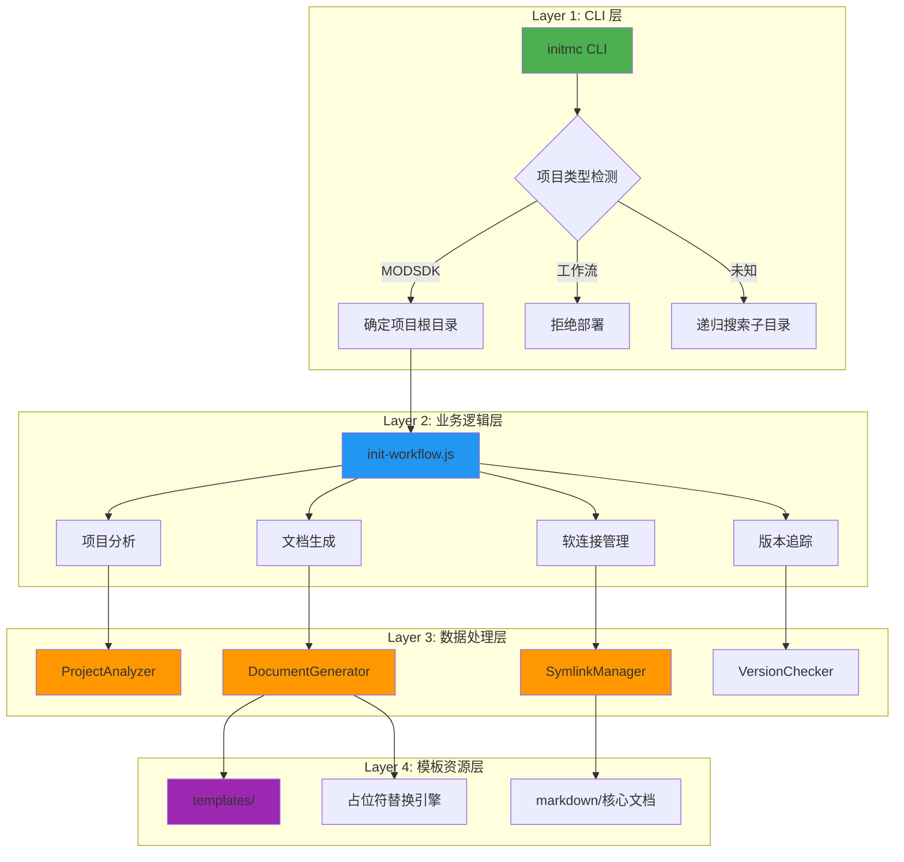
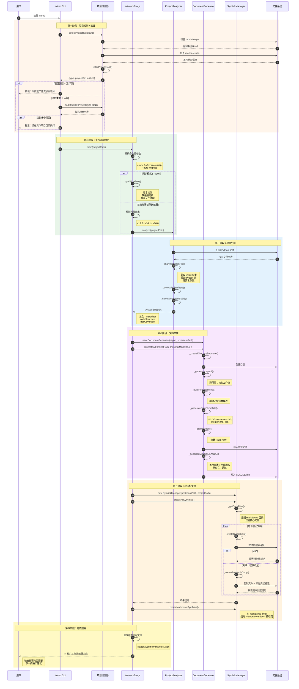
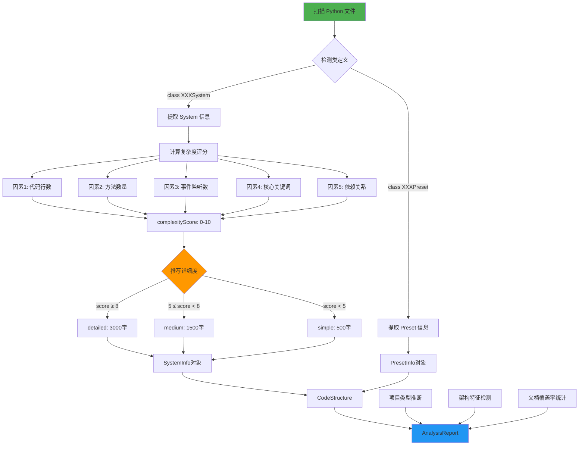
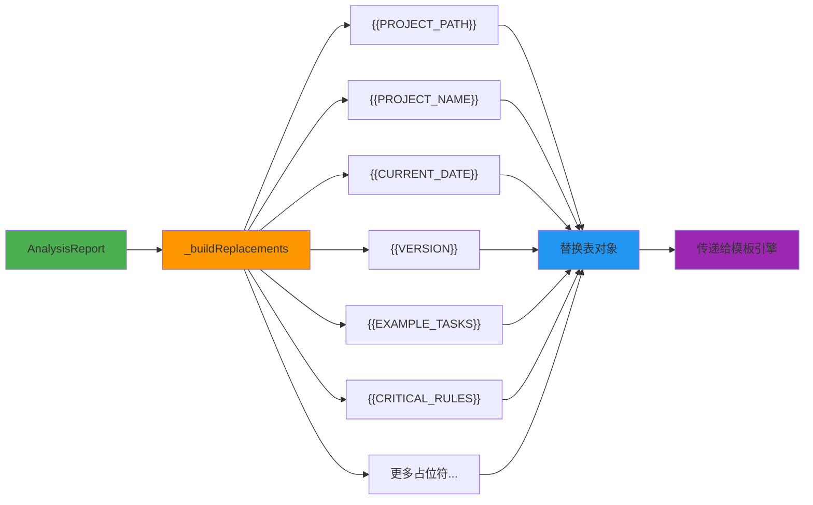
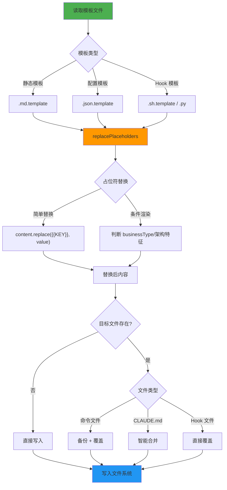
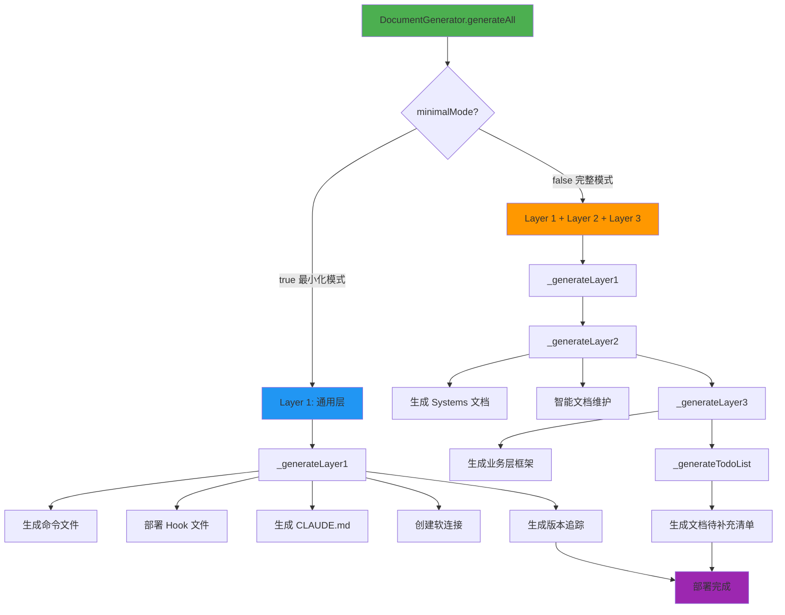
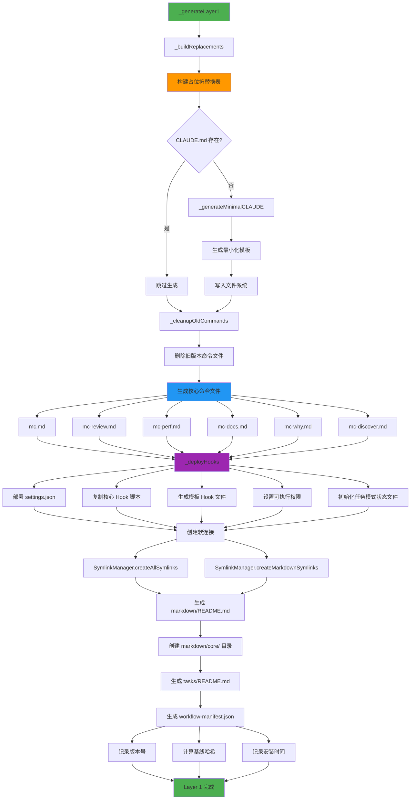
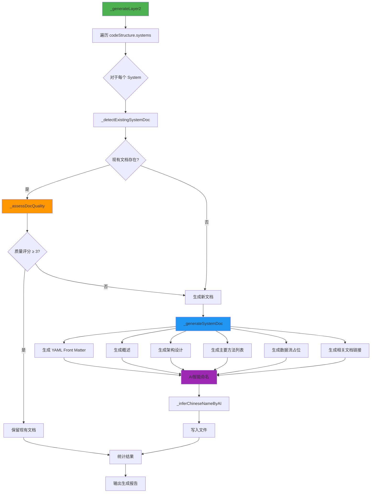
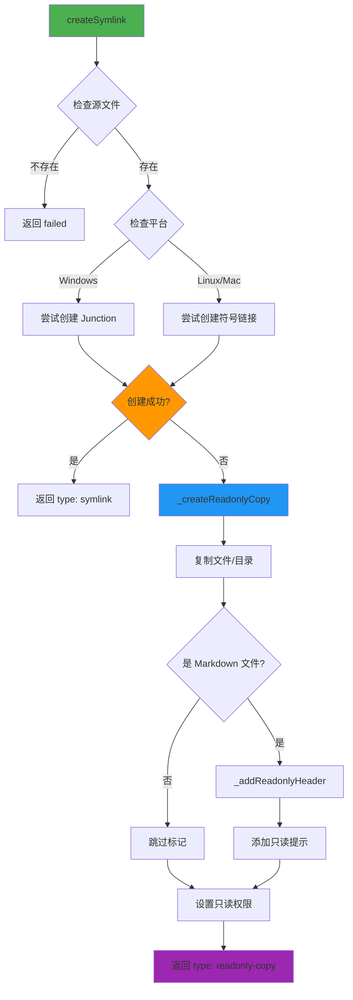

# MODSDK 工作流数据流设计文档

> **文档版本**: v1.0
> **创建日期**: 2025-11-13
> **适用版本**: v18.4.0+

---

## 📋 目录

1. [概述](#概述)
2. [核心架构](#核心架构)
3. [initmc 命令执行流程](#initmc-命令执行流程)
4. [数据转换流程](#数据转换流程)
5. [模板处理机制](#模板处理机制)
6. [文档生成流程](#文档生成流程)
7. [软连接管理机制](#软连接管理机制)
8. [数据模型定义](#数据模型定义)

---

## 概述

### 设计目标

MODSDK 工作流采用**模板驱动 + 数据转换**的架构模式，实现：

1. **零配置部署**: 用户执行 `initmc` 即可完成工作流部署
2. **智能分析**: 自动分析项目结构，推断项目类型和架构特征
3. **模板复用**: 通过占位符替换机制实现模板定制化
4. **双层文档架构**: 上游基线文档 + 项目覆盖层，支持零风险升级
5. **软连接管理**: 跨平台软连接机制，优雅降级为只读副本

### 核心组件

| 组件 | 文件路径 | 职责 |
|-----|---------|-----|
| **入口脚本** | `scripts/initmc.js` | CLI 命令入口，项目检测与部署流程编排 |
| **工作流初始化器** | `lib/init-workflow.js` | 核心业务逻辑，协调各模块执行工作流初始化 |
| **项目分析器** | `lib/analyzer.js` | 扫描代码结构，推断项目类型和复杂度 |
| **文档生成器** | `lib/generator.js` | 基于分析报告和模板生成定制化文档 |
| **软连接管理器** | `lib/symlink-manager.js` | 创建和管理上游文档到下游项目的引用 |
| **配置管理器** | `lib/config.js` | 全局配置、常量定义、路径解析 |

---

## 核心架构

### 三层架构模式



---

## initmc 命令执行流程

### 完整执行序列图



### 关键数据流转

#### 输入数据

| 数据源 | 数据类型 | 示例 |
|-------|---------|-----|
| **命令行参数** | `args[]` | `['--sync', '--auto-migrate=1']` |
| **当前工作目录** | `process.cwd()` | `D:/MyProject` |
| **环境变量** | `process.env` | `CLAUDE_AUTO_MIGRATE=1` |

#### 中间数据

| 数据结构 | 生成阶段 | 用途 |
|---------|---------|-----|
| **AnalysisReport** | 项目分析 | 传递给文档生成器 |
| **Replacements** | 占位符构建 | 模板变量替换 |
| **CoreFilesList** | 软连接管理 | 确定需要引用的文档 |

#### 输出数据

| 产物 | 路径 | 说明 |
|-----|------|-----|
| **命令文件** | `.claude/commands/*.md` | 6个核心命令 |
| **Hook 文件** | `.claude/hooks/*.py` | 任务隔离机制 |
| **软连接** | `.claude/core-docs/` | 上游文档引用 |
| **配置文件** | `.claude/settings.json` | Claude Code 配置 |
| **版本追踪** | `.claude/workflow-manifest.json` | 版本号、安装时间、基线哈希 |

---

## 数据转换流程

### 项目特征 → 分析报告



#### 复杂度评分算法

```javascript
// lib/analyzer.js: SystemInfo._calculateComplexity()

let score = 0;

// 因素1: 代码行数 (最高3分)
if (linesOfCode > 500) score += 3;
else if (linesOfCode > 200) score += 2;
else score += 1;

// 因素2: 方法数量 (最高2分)
if (methodCount > 15) score += 2;
else if (methodCount > 5) score += 1;

// 因素3: 事件监听数 (最高1分)
if (eventListeners > 5) score += 1;

// 因素4: 核心关键词 (最高2分)
const coreKeywords = ['core', 'manager', 'game', 'state', 'main'];
if (coreKeywords.some(k => name.toLowerCase().includes(k))) score += 2;

// 因素5: 依赖关系 (最高2分)
if (importCount > 5) score += 2;
else if (importCount > 2) score += 1;

return score; // 范围：1-10
```

### 分析报告 → 占位符替换表



#### 占位符生成逻辑

| 占位符 | 生成逻辑 | 示例值 |
|-------|---------|-------|
| `{{PROJECT_PATH}}` | `normalizePathForMarkdown(targetPath)` | `D:/MyProject` |
| `{{PROJECT_NAME}}` | `metadata.projectName` | `NetEaseMapECBedWars` |
| `{{CURRENT_DATE}}` | `getCurrentDate()` | `2025-11-13` |
| `{{VERSION}}` | `config.VERSION` | `18.4.0` |
| `{{EXAMPLE_TASKS}}` | `_generateExampleTasks()` | 根据 `businessType` 生成 |
| `{{CRITICAL_RULES}}` | `_generateCriticalRulesSection()` | 根据 `usesApollo`, `usesEcpreset` 生成 |
| `{{ARCHITECTURE_DOCS_SECTION}}` | `_generateArchitectureDocs()` | 根据 `usesApollo` 生成 |
| `{{BUSINESS_DOCS_SECTION}}` | `_generateBusinessDocs()` | 根据 `businessType` 生成 |

---

## 模板处理机制

### 模板引擎工作流程



### 模板文件结构

```
templates/
├── .claude/
│   ├── commands/
│   │   ├── mc.md.template                    # 主命令模板
│   │   ├── mc-review.md.template             # 方案审查模板
│   │   ├── mc-perf.md.template               # 性能分析模板
│   │   ├── mc-docs.md.template               # 文档审计模板
│   │   ├── mc-why.md.template                # 代码追溯模板
│   │   └── mc-discover.md.template           # 项目发现模板
│   ├── hooks/
│   │   ├── user-prompt-submit-hook.py        # 用户提交拦截
│   │   ├── enforce-step2.py                  # 步骤2强制执行
│   │   ├── track-doc-reading.py              # 文档阅读追踪
│   │   ├── enforce-cleanup.py                # 清理强制执行
│   │   ├── stop-hook.py                      # 停止钩子
│   │   └── README.md                         # Hook 说明文档
│   └── settings.json.template                # Claude Code 配置模板
├── markdown/
│   ├── README.md.template                    # 文档导航模板
│   ├── 索引.md.template                      # 项目索引模板
│   └── 项目状态.md.template                  # 项目状态模板
├── CLAUDE.md.template                        # AI 工作流总览模板
└── README.md.template                        # 项目 README 模板
```

### 占位符替换引擎

#### 核心实现（lib/utils.js）

```javascript
function replacePlaceholders(content, replacements) {
  let result = content;

  for (const [placeholder, value] of Object.entries(replacements)) {
    // 全局替换，支持多次出现
    const regex = new RegExp(escapeRegExp(placeholder), 'g');
    result = result.replace(regex, value);
  }

  return result;
}

function escapeRegExp(string) {
  return string.replace(/[.*+?^${}()|[\]\\]/g, '\\$&');
}
```

#### 条件渲染示例

```markdown
<!-- templates/.claude/commands/mc.md.template -->

## 任务执行示例

{{EXAMPLE_TASKS}}

{{#if usesApollo}}
## Apollo 架构注意事项
{{ARCHITECTURE_DOCS_SECTION}}
{{/if}}

{{#if businessType === 'RPG'}}
## NBT 兼容性检查
{{NBT_CHECK_SECTION}}
{{/if}}
```

生成器会根据项目特征动态生成对应的内容：

```javascript
// lib/generator.js
_buildReplacements(targetPath) {
  const replacements = {
    '{{EXAMPLE_TASKS}}': this._generateExampleTasks(),
    '{{ARCHITECTURE_DOCS_SECTION}}': this._generateArchitectureDocs(),
    '{{NBT_CHECK_SECTION}}': this.metadata.businessType === 'RPG'
      ? this._generateNBTSection()
      : ''
  };
  return replacements;
}
```

---

## 文档生成流程

### 三层文档架构



### Layer 1: 通用层生成流程图



### Layer 2: 架构层生成详解

#### Systems 文档生成流程



#### 文档质量评估算法

```javascript
// lib/generator.js: _assessDocQuality()

function assessDocQuality(content) {
  let score = 0;

  // 因素1: 有代码块示例 (+1)
  if (/```/.test(content)) score += 1;

  // 因素2: 有图表 (+1)
  if (/mermaid|graph|flowchart/.test(content)) score += 1;

  // 因素3: 有示例说明 (+1)
  if (/示例|Example|案例|使用方法/.test(content)) score += 1;

  // 因素4: 内容丰富 (>500字符) (+1)
  if (content.length > 500) score += 1;

  // 因素5: 不是"待补充"模板 (+1)
  if (!/⚠️\s*\*\*待补充\*\*/.test(content)) score += 1;

  return score; // 范围：0-5
}
```

---

## 软连接管理机制

### 跨平台软连接策略



### 软连接类型

| 类型 | 平台 | 特点 | 降级方案 |
|-----|------|-----|---------|
| **符号链接** | Linux/Mac | 标准软连接，自动同步 | 只读副本 |
| **Junction** | Windows | 目录级别，不需要管理员权限 | 只读副本 |
| **File Symlink** | Windows | 文件级别，需要管理员权限 | 只读副本 |
| **只读副本** | 跨平台 | 完整复制 + 只读标记 | 无 |

### 只读标记机制

#### 标记内容

```markdown
<!--
⚠️ **只读文档**

此文档来自上游工作流，请勿直接编辑。

如需定制：
1. 复制到 markdown/core/开发规范.md
2. 编辑项目副本
3. AI会自动优先读取项目定制版本

执行 `initmc --sync` 可更新此文档。
-->

# 原文档内容开始...
```

#### 优先级规则

当同时存在上游文档和项目定制文档时，AI 读取顺序：

1. **项目定制版本**: `markdown/core/开发规范.md`（最高优先级）
2. **项目软连接**: `markdown/开发规范.md` → `.claude/core-docs/开发规范.md`
3. **上游文档**: `.claude/core-docs/开发规范.md` → `上游工作流/markdown/开发规范.md`

---

## 数据模型定义

### AnalysisReport 数据结构

```javascript
// lib/analyzer.js
class AnalysisReport {
  constructor(metadata, codeStructure, docCoverage) {
    this.metadata = {
      isModsdk: boolean,
      projectName: string,
      modMainPath: string,
      usesApollo: boolean,
      usesEcpreset: boolean,
      businessType: 'RPG' | 'BedWars' | 'PVP' | 'General',
      scale: 'small' | 'medium' | 'large'
    };

    this.codeStructure = {
      systems: {
        [systemName: string]: SystemInfo
      },
      presets: {
        [presetName: string]: PresetInfo
      },
      dependencies: {
        [systemName: string]: string[]
      },
      discoveredComponents: DiscoveredStructure // v2.0+
    };

    this.docCoverage = {
      existingDocs: string[],
      missingDocs: string[],
      lowQualityDocs: string[]
    };
  }

  toMarkdown(): string;
}
```

### SystemInfo 数据结构

```javascript
class SystemInfo {
  name: string;              // 如 "ShopServerSystem"
  filePath: string;          // 绝对路径
  type: 'ServerSystem' | 'ClientSystem';
  content: string;           // 完整源代码

  // 代码度量
  linesOfCode: number;       // 代码行数
  methodCount: number;       // 方法数量
  eventListeners: number;    // 事件监听数量

  // 复杂度分析
  complexityScore: number;   // 0-10

  // 方法
  getDetailLevel(): 'simple' | 'medium' | 'detailed';
}
```

### Replacements 占位符表

```javascript
// lib/generator.js: _buildReplacements()
const replacements = {
  // 项目基本信息
  '{{PROJECT_PATH}}': string,          // 项目路径（规范化）
  '{{PROJECT_NAME}}': string,          // 项目名称
  '{{CURRENT_DATE}}': string,          // 当前日期 YYYY-MM-DD
  '{{VERSION}}': string,               // 工作流版本号

  // 动态内容
  '{{EXAMPLE_TASKS}}': string,         // 示例任务列表
  '{{LOG_FILES}}': string,             // 日志文件列表
  '{{ARCHITECTURE_DOCS_SECTION}}': string,
  '{{BUSINESS_DOCS_SECTION}}': string,
  '{{CRITICAL_RULES}}': string,        // CRITICAL 规范
  '{{CRITICAL_RULES_EXTRA}}': string,

  // 路径配置
  '{{SDK_DOC_PATH}}': string,          // SDK 文档路径
  '{{GLOBAL_DOCS_PATH}}': string,      // 全局文档路径
  '{{CORE_PATHS}}': string,            // 核心路径列表

  // 项目描述
  '{{PROJECT_DESCRIPTION}}': string,
  '{{PROJECT_STATUS}}': string,
  '{{EXTRA_DOCS}}': string,
  '{{QUICK_INDEX_EXTRA}}': string,
  '{{NBT_CHECK_SECTION}}': string,     // NBT 检查部分
  '{{PRESETS_DOCS_SECTION}}': string   // Presets 文档部分
};
```

### WorkflowManifest 版本追踪

```javascript
// .claude/workflow-manifest.json
{
  "version": "18.4.0",
  "installedAt": "2025-11-13T10:30:00.000Z",
  "lastUpdatedAt": "2025-11-13T10:30:00.000Z",
  "baselineHashes": {
    "核心工作流文档/开发规范.md": "sha256:abc123...",
    "核心工作流文档/问题排查.md": "sha256:def456...",
    // ...更多文档哈希
  },
  "changes": [
    {
      "version": "18.4.0",
      "date": "2025-11-13",
      "description": "多层 Hook 执行力系统",
      "previousVersion": "18.3.0"
    },
    // ...历史变更记录（最多保留10条）
  ]
}
```

---

## 附录

### 关键配置常量

```javascript
// lib/config.js

// 版本号
const VERSION = '18.4.0';

// 复杂度评分阈值
const COMPLEXITY_THRESHOLDS = {
  detailed: 8,   // score ≥ 8 → detailed
  medium: 5      // score ≥ 5 → medium, < 5 → simple
};

// 项目规模阈值
const SCALE_THRESHOLDS = {
  small: 10,     // ≤10 Systems
  medium: 30     // 11-30 Systems, >30 → large
};

// 文档质量评估阈值
const QUALITY_THRESHOLDS = {
  high: 80,      // ≥80分 → 保留
  medium: 50     // 50-79分 → 重写, <50分 → 重新生成
};
```

### 文件大小验证阈值

```javascript
// scripts/initmc.js: copyFileWithValidation()

const minSizeMap = {
  'mc.md': 10000,                  // 10KB
  'mc-review.md': 7000,            // 7KB
  'mc-perf.md': 5000,              // 5KB
  'mc-docs.md': 5000,              // 5KB
  'mc-why.md': 5000,               // 5KB
  'mc-discover.md': 5000,          // 5KB
  'CLAUDE.md': 10000,              // 10KB
  '开发规范.md': 10000,            // 10KB
  '问题排查.md': 5000,             // 5KB
  '快速开始.md': 3000              // 3KB
};
```

---

## 维护说明

### 扩展新占位符

1. 在 `lib/config.js` 的 `PLACEHOLDERS` 对象添加定义
2. 在 `lib/generator.js` 的 `_buildReplacements()` 实现生成逻辑
3. 在模板文件中使用新占位符
4. 更新本文档的"占位符替换表"章节

### 添加新命令模板

1. 在 `templates/.claude/commands/` 创建 `新命令.md.template`
2. 在 `lib/config.js` 的 `getTemplatePath()` 添加映射
3. 在 `lib/generator.js` 的 `_generateLayer1()` 调用生成
4. 在 `scripts/initmc.js` 添加文件验证规则
5. 更新本文档的"模板文件结构"章节

### 修改文档生成逻辑

1. 编辑 `lib/generator.js` 对应的 `_generateLayerX()` 方法
2. 如果涉及新数据源，先更新 `lib/analyzer.js`
3. 运行测试确保向后兼容
4. 更新本文档的流程图和数据模型

---

## 版本历史

| 版本 | 日期 | 变更说明 |
|-----|------|---------|
| v1.0 | 2025-11-13 | 初始版本，基于 v18.4.0 工作流 |

---

**文档维护者**: Claude Code Development Team
**最后审核**: 2025-11-13