# MODSDK 工作流数据流设计文档

> **文档版本**: v3.0
> **创建日期**: 2025-11-13
> **最后更新**: 2025-11-14
> **适用版本**: v20.2.10+
>
> **⚠️ v20.2更新**: 新增任务执行数据流、三文件同步机制、会话历史持久化

---

## 📋 目录

1. [概述](#概述)
2. [核心架构](#核心架构)
3. [initmc 命令执行流程](#initmc-命令执行流程)
4. [任务执行数据流](#任务执行数据流) ⭐ **NEW**
5. [三文件状态同步机制](#三文件状态同步机制) ⭐ **NEW**
6. [会话历史持久化](#会话历史持久化) ⭐ **NEW**
7. [数据转换流程](#数据转换流程)
8. [模板处理机制](#模板处理机制)
9. [文档生成流程](#文档生成流程)
10. [软连接管理机制](#软连接管理机制)
11. [归档流程](#归档流程) ⭐ **NEW**
12. [数据模型定义](#数据模型定义)

---

## 概述

### 设计目标

MODSDK 工作流采用**模板驱动 + 数据转换**的架构模式，实现：

1. **零配置部署**: 用户执行 `initmc` 即可完成工作流部署
2. **智能分析**: 自动分析项目结构，推断项目类型和架构特征
3. **模板复用**: 通过占位符替换机制实现模板定制化
4. **双层文档架构**: 上游基线文档 + 项目覆盖层，支持零风险升级
5. **软连接管理**: 跨平台软连接机制，优雅降级为只读副本

### 核心组件

| 组件 | 文件路径 | 职责 |
|-----|---------|-----|
| **入口脚本** | `scripts/initmc.js` | CLI 命令入口，项目检测与部署流程编排 |
| **工作流初始化器** | `lib/init-workflow.js` | 核心业务逻辑，协调各模块执行工作流初始化 |
| **项目分析器** | `lib/analyzer.js` | 扫描代码结构，推断项目类型和复杂度 |
| **文档生成器** | `lib/generator.js` | 基于分析报告和模板生成定制化文档 |
| **软连接管理器** | `lib/symlink-manager.js` | 创建和管理上游文档到下游项目的引用 |
| **配置管理器** | `lib/config.js` | 全局配置、常量定义、路径解析 |

---

## 核心架构

### 三层架构模式

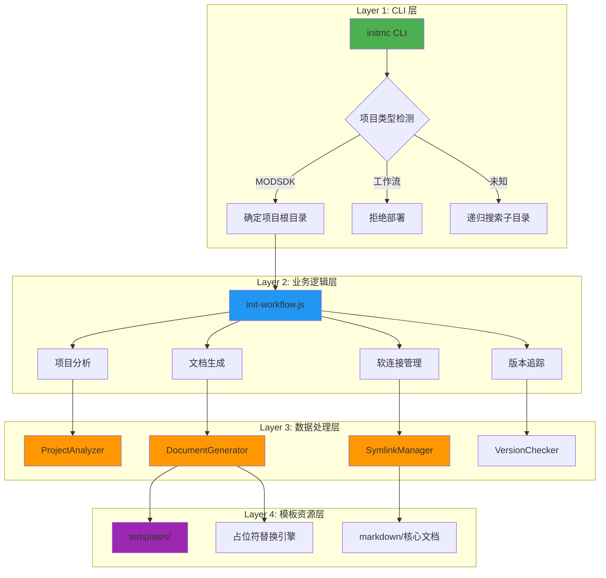

---

## initmc 命令执行流程

### 完整执行序列图

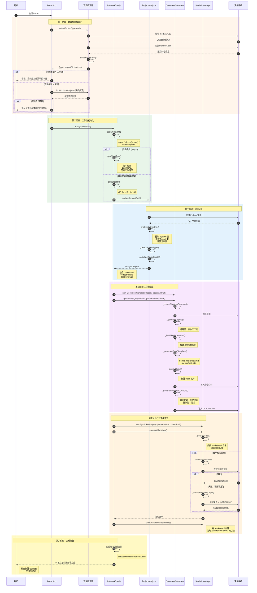

### 关键数据流转

#### 输入数据

| 数据源 | 数据类型 | 示例 |
|-------|---------|-----|
| **命令行参数** | `args[]` | `['--sync', '--auto-migrate=1']` |
| **当前工作目录** | `process.cwd()` | `D:/MyProject` |
| **环境变量** | `process.env` | `CLAUDE_AUTO_MIGRATE=1` |

#### 中间数据

| 数据结构 | 生成阶段 | 用途 |
|---------|---------|-----|
| **AnalysisReport** | 项目分析 | 传递给文档生成器 |
| **Replacements** | 占位符构建 | 模板变量替换 |
| **CoreFilesList** | 软连接管理 | 确定需要引用的文档 |

#### 输出数据

| 产物 | 路径 | 说明 |
|-----|------|-----|
| **命令文件** | `.claude/commands/*.md` | 6个核心命令 |
| **Hook 文件** | `.claude/hooks/*.py` | 任务隔离机制 |
| **软连接** | `.claude/core-docs/` | 上游文档引用 |
| **配置文件** | `.claude/settings.json` | Claude Code 配置 |
| **版本追踪** | `.claude/workflow-manifest.json` | 版本号、安装时间、基线哈希 |

---

## 数据转换流程

### 项目特征 → 分析报告

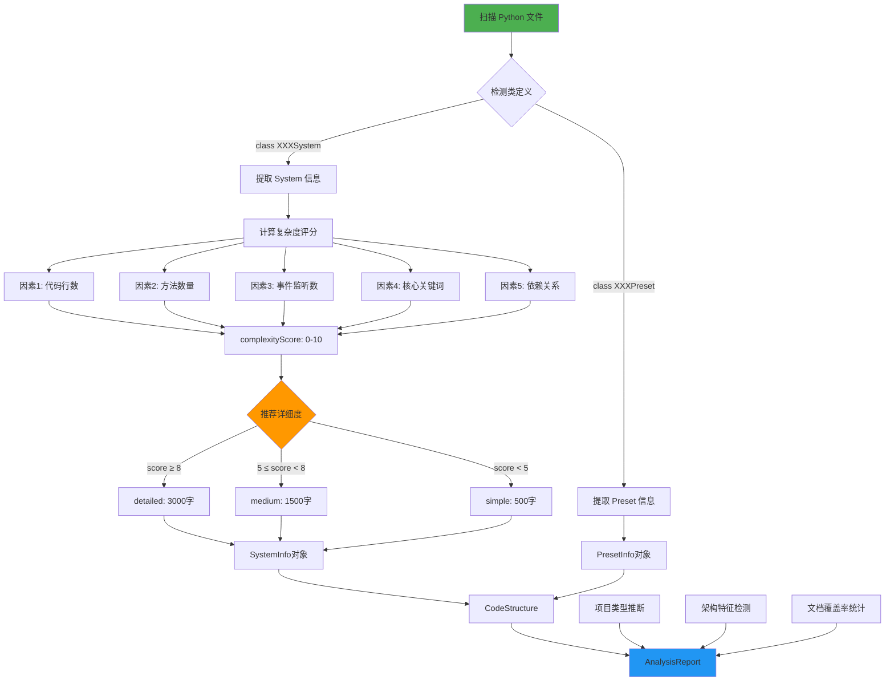

#### 复杂度评分算法

```javascript
// lib/analyzer.js: SystemInfo._calculateComplexity()

let score = 0;

// 因素1: 代码行数 (最高3分)
if (linesOfCode > 500) score += 3;
else if (linesOfCode > 200) score += 2;
else score += 1;

// 因素2: 方法数量 (最高2分)
if (methodCount > 15) score += 2;
else if (methodCount > 5) score += 1;

// 因素3: 事件监听数 (最高1分)
if (eventListeners > 5) score += 1;

// 因素4: 核心关键词 (最高2分)
const coreKeywords = ['core', 'manager', 'game', 'state', 'main'];
if (coreKeywords.some(k => name.toLowerCase().includes(k))) score += 2;

// 因素5: 依赖关系 (最高2分)
if (importCount > 5) score += 2;
else if (importCount > 2) score += 1;

return score; // 范围：1-10
```

### 分析报告 → 占位符替换表

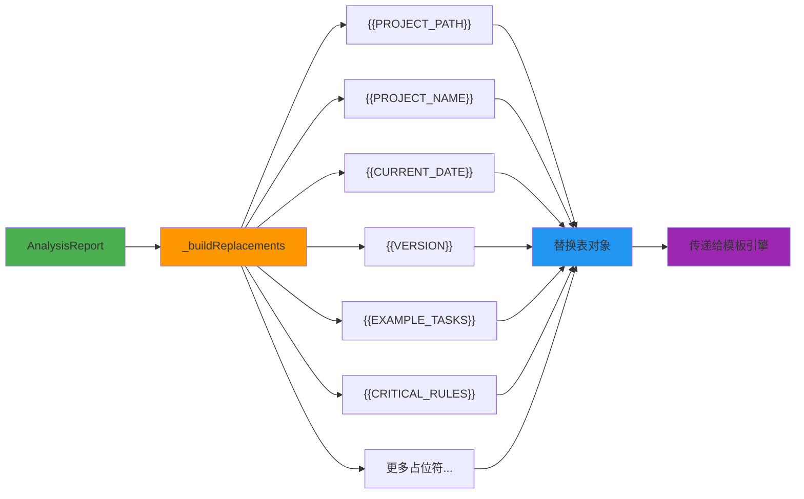

#### 占位符生成逻辑

| 占位符 | 生成逻辑 | 示例值 |
|-------|---------|-------|
| `{{PROJECT_PATH}}` | `normalizePathForMarkdown(targetPath)` | `D:/MyProject` |
| `{{PROJECT_NAME}}` | `metadata.projectName` | `NetEaseMapECBedWars` |
| `{{CURRENT_DATE}}` | `getCurrentDate()` | `2025-11-13` |
| `{{VERSION}}` | `config.VERSION` | `18.4.0` |
| `{{EXAMPLE_TASKS}}` | `_generateExampleTasks()` | 根据 `businessType` 生成 |
| `{{CRITICAL_RULES}}` | `_generateCriticalRulesSection()` | 根据 `usesApollo`, `usesEcpreset` 生成 |
| `{{ARCHITECTURE_DOCS_SECTION}}` | `_generateArchitectureDocs()` | 根据 `usesApollo` 生成 |
| `{{BUSINESS_DOCS_SECTION}}` | `_generateBusinessDocs()` | 根据 `businessType` 生成 |

---

## 模板处理机制

### 模板引擎工作流程

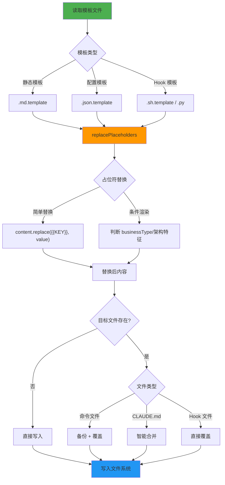

### 模板文件结构

```
templates/
├── .claude/
│   ├── commands/
│   │   ├── mc.md.template                    # 主命令模板
│   │   ├── mc-review.md.template             # 方案审查模板
│   │   ├── mc-perf.md.template               # 性能分析模板
│   │   ├── mc-docs.md.template               # 文档审计模板
│   │   ├── mc-why.md.template                # 代码追溯模板
│   │   └── mc-discover.md.template           # 项目发现模板
│   ├── hooks/
│   │   ├── user-prompt-submit-hook.py        # 用户提交拦截
│   │   ├── enforce-step2.py                  # 步骤2强制执行
│   │   ├── track-doc-reading.py              # 文档阅读追踪
│   │   ├── enforce-cleanup.py                # 清理强制执行
│   │   ├── stop-hook.py                      # 停止钩子
│   │   └── README.md                         # Hook 说明文档
│   └── settings.json.template                # Claude Code 配置模板
├── markdown/
│   ├── README.md.template                    # 文档导航模板
│   ├── 索引.md.template                      # 项目索引模板
│   └── 项目状态.md.template                  # 项目状态模板
├── CLAUDE.md.template                        # AI 工作流总览模板
└── README.md.template                        # 项目 README 模板
```

### 占位符替换引擎

#### 核心实现（lib/utils.js）

```javascript
function replacePlaceholders(content, replacements) {
  let result = content;

  for (const [placeholder, value] of Object.entries(replacements)) {
    // 全局替换，支持多次出现
    const regex = new RegExp(escapeRegExp(placeholder), 'g');
    result = result.replace(regex, value);
  }

  return result;
}

function escapeRegExp(string) {
  return string.replace(/[.*+?^${}()|[\]\\]/g, '\\$&');
}
```

#### 条件渲染示例

```markdown
<!-- templates/.claude/commands/mc.md.template -->

## 任务执行示例

{{EXAMPLE_TASKS}}

{{#if usesApollo}}
## Apollo 架构注意事项
{{ARCHITECTURE_DOCS_SECTION}}
{{/if}}

{{#if businessType === 'RPG'}}
## NBT 兼容性检查
{{NBT_CHECK_SECTION}}
{{/if}}
```

生成器会根据项目特征动态生成对应的内容：

```javascript
// lib/generator.js
_buildReplacements(targetPath) {
  const replacements = {
    '{{EXAMPLE_TASKS}}': this._generateExampleTasks(),
    '{{ARCHITECTURE_DOCS_SECTION}}': this._generateArchitectureDocs(),
    '{{NBT_CHECK_SECTION}}': this.metadata.businessType === 'RPG'
      ? this._generateNBTSection()
      : ''
  };
  return replacements;
}
```

---

## 文档生成流程

### 三层文档架构

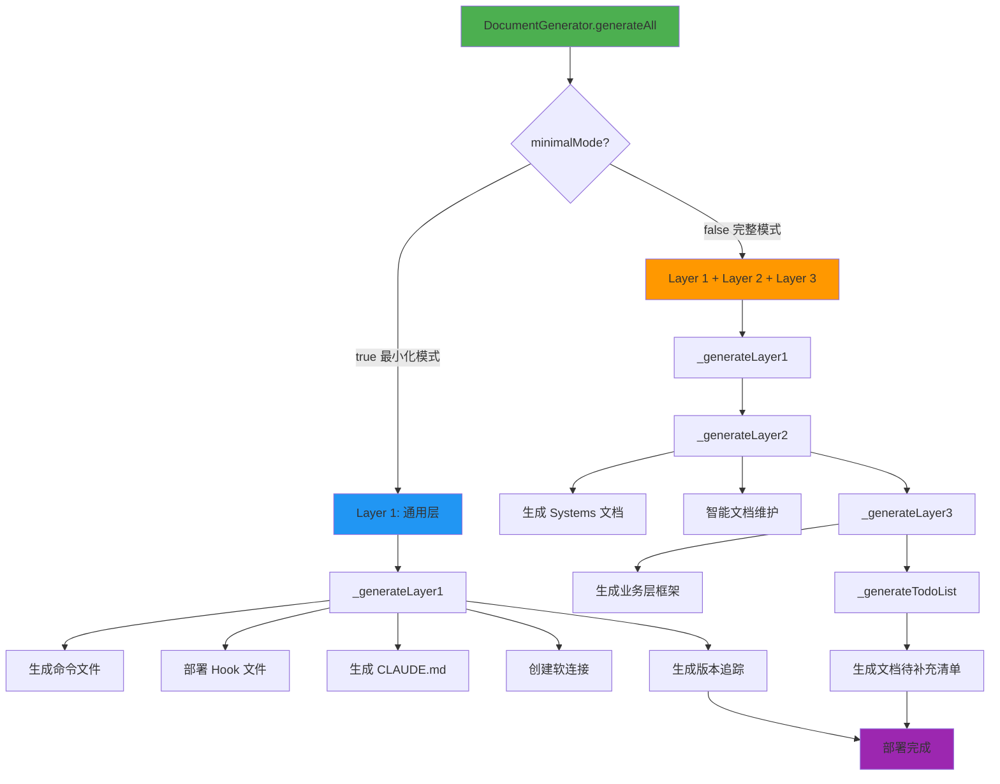

### Layer 1: 通用层生成流程图

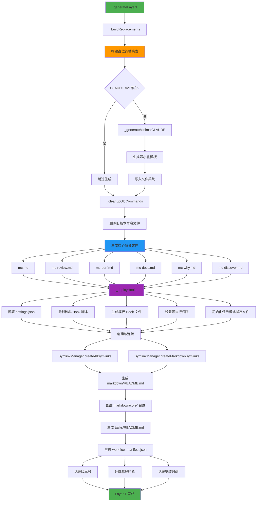

### Layer 2: 架构层生成详解

#### Systems 文档生成流程

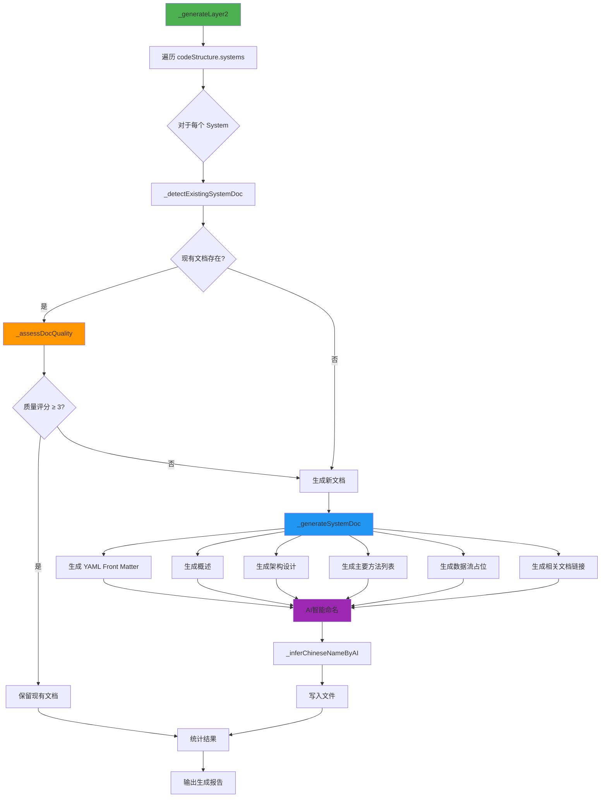

#### 文档质量评估算法

```javascript
// lib/generator.js: _assessDocQuality()

function assessDocQuality(content) {
  let score = 0;

  // 因素1: 有代码块示例 (+1)
  if (/```/.test(content)) score += 1;

  // 因素2: 有图表 (+1)
  if (/mermaid|graph|flowchart/.test(content)) score += 1;

  // 因素3: 有示例说明 (+1)
  if (/示例|Example|案例|使用方法/.test(content)) score += 1;

  // 因素4: 内容丰富 (>500字符) (+1)
  if (content.length > 500) score += 1;

  // 因素5: 不是"待补充"模板 (+1)
  if (!/⚠️\s*\*\*待补充\*\*/.test(content)) score += 1;

  return score; // 范围：0-5
}
```

---

## 软连接管理机制

### 跨平台软连接策略

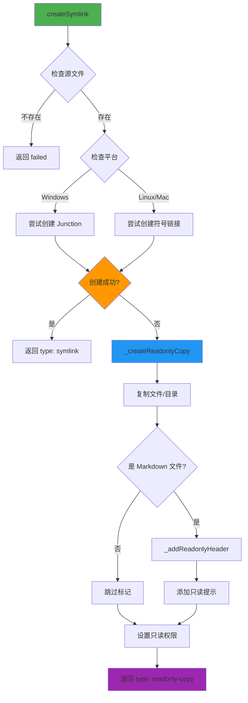

### 软连接类型

| 类型 | 平台 | 特点 | 降级方案 |
|-----|------|-----|---------|
| **符号链接** | Linux/Mac | 标准软连接，自动同步 | 只读副本 |
| **Junction** | Windows | 目录级别，不需要管理员权限 | 只读副本 |
| **File Symlink** | Windows | 文件级别，需要管理员权限 | 只读副本 |
| **只读副本** | 跨平台 | 完整复制 + 只读标记 | 无 |

### 只读标记机制

#### 标记内容

```markdown
<!--
⚠️ **只读文档**

此文档来自上游工作流，请勿直接编辑。

如需定制：
1. 复制到 markdown/core/开发规范.md
2. 编辑项目副本
3. AI会自动优先读取项目定制版本

执行 `initmc --sync` 可更新此文档。
-->

# 原文档内容开始...
```

#### 优先级规则

当同时存在上游文档和项目定制文档时，AI 读取顺序：

1. **项目定制版本**: `markdown/core/开发规范.md`（最高优先级）
2. **项目软连接**: `markdown/开发规范.md` → `.claude/core-docs/开发规范.md`
3. **上游文档**: `.claude/core-docs/开发规范.md` → `上游工作流/markdown/开发规范.md`

---

## 任务执行数据流

### 完整执行序列图 (v20.2)

```mermaid
sequenceDiagram
    autonumber

    participant User as 用户
    participant CLI as Claude Code CLI
    participant Hook1 as UserPromptSubmit Hook
    participant AI as Claude AI
    participant Hook2 as PostToolUse Hook
    participant Hook3 as PostArchive Hook
    participant FS as 文件系统

    rect rgb(255, 245, 235)
        Note over User,Hook1: 第一阶段：任务初始化 (/mc 命令)
        User->>CLI: 输入 "/mc 修复商店购买功能"
        CLI->>Hook1: UserPromptSubmit 触发

        Hook1->>Hook1: 检测 /mc 命令
        Hook1->>Hook1: 生成 task_id (任务-1114-143520-修复商店购买功能)
        Hook1->>FS: 创建 tasks/任务-1114-143520-修复商店购买功能/

        Hook1->>FS: 初始化 .task-meta.json
        Note right of Hook1: 任务元数据<br/>workflow_state<br/>metrics

        Hook1->>FS: 初始化 .conversation.jsonl
        Note right of Hook1: v20.2.7: 会话历史持久化

        Hook1->>FS: 写入 .claude/workflow-state.json
        Note right of Hook1: 全局工作流状态<br/>current_step: step3_execute

        Hook1->>FS: 写入 .claude/.task-active.json
        Note right of Hook1: 活跃任务标志<br/>快速查找当前任务

        Hook1->>Hook1: 匹配玩法知识库
        Note right of Hook1: 查找 knowledge-base.json<br/>或生成BUG修复指引

        Hook1-->>AI: 注入玩法包/BUG修复指引
        Note right of AI: 包含完整实现代码<br/>或智能诊断路径
    end

    rect rgb(232, 245, 233)
        Note over AI,Hook2: 第二阶段：任务执行 (Read/Write/Edit/Bash)

        loop 工具调用循环
            AI->>FS: Read(文档) / Edit(代码) / Bash(测试)
            FS-->>AI: 工具执行结果

            AI->>Hook2: PostToolUse 触发

            Hook2->>FS: 加载 .task-active.json
            Note right of Hook2: 快速检查是否有活跃任务

            alt 无活跃任务
                Hook2-->>AI: 跳过，继续执行
            else 有活跃任务
                Hook2->>FS: 加载 tasks/{task_id}/.task-meta.json

                Hook2->>Hook2: 工具分发处理
                Note right of Hook2: Read → 更新docs_read<br/>Write/Edit → 更新code_changes<br/>Bash → 检测失败

                Hook2->>Hook2: 检查步骤完成条件
                Note right of Hook2: step0: CLAUDE.md已读<br/>step1: 文档已阅读<br/>step3: 用户确认<br/>step4: cleanup完成

                alt 步骤完成
                    Hook2->>Hook2: 更新状态机
                    Note right of Hook2: 标记当前步骤completed<br/>推进到下一步

                    Hook2->>FS: 同步三文件状态
                    Note right of Hook2: task-meta.json<br/>→ workflow-state.json<br/>→ .task-active.json

                    Hook2-->>AI: 注入下一步指令
                    Note right of AI: 步骤4特殊处理：<br/>生成context.md/solution.md<br/>启动子代理
                else 步骤未完成
                    Hook2->>Hook2: 检查循环模式
                    Note right of Hook2: v20.2: 检测Bug修复循环<br/>2次迭代+2次负面反馈<br/>+2次同文件修改

                    alt 触发专家诊断
                        Hook2-->>AI: 注入专家分析prompt
                        Note right of AI: Meta-Expert系统<br/>战略高度分析<br/>备选方案推荐
                    else 继续执行
                        Hook2-->>AI: 继续当前步骤
                    end
                end

                Hook2->>FS: 保存更新后的 .task-meta.json
            end
        end
    end

    rect rgb(227, 242, 253)
        Note over User,AI: 第三阶段：用户确认与收尾
        User->>AI: "已修复" 或 "功能已完成"
        AI->>AI: 解析用户反馈
        Note right of AI: 检测确认关键词<br/>标记user_confirmed=true

        AI->>FS: Edit(.task-meta.json)
        Note right of AI: 更新workflow_state<br/>标记step3完成

        FS-->>Hook2: PostToolUse触发
        Hook2->>Hook2: 检测 step3_execute 完成
        Hook2->>Hook2: 推进到 step4_cleanup

        Hook2->>FS: 调用 generate-docs-from-conversation.py
        Note right of Hook2: v20.2.7: 从会话历史生成<br/>context.md + solution.md

        Hook2-->>AI: 注入子代理启动指令
        Note right of AI: 文档更新Agent<br/>自动补充markdown文档

        AI->>AI: 启动 Task Agent
        Note right of AI: 独立子代理<br/>不消耗主会话上下文

        AI->>FS: 搜索待补充文档 (Glob)
        AI->>FS: 更新相关文档 (Edit/Write)
        AI->>FS: 标记 step4_cleanup completed
    end

    rect rgb(248, 231, 253)
        Note over Hook3,FS: 第四阶段：任务归档
        FS-->>Hook3: PostToolUse触发
        Hook3->>FS: 加载最新任务的 .task-meta.json

        Hook3->>Hook3: 检测 step4_cleanup 是否完成

        alt step4 已完成且未归档
            Hook3->>Hook3: 获取归档锁
            Note right of Hook3: .archive-lock<br/>防止并发问题

            Hook3->>FS: 移动任务目录
            Note right of Hook3: tasks/任务-xxx/<br/>→ tasks/已归档/任务-xxx/

            Hook3->>FS: 标记 archived=true

            Hook3->>FS: 生成文档快照
            Note right of Hook3: .claude/.doc-snapshot.json<br/>记录归档前状态

            Hook3-->>AI: 注入文档同步任务
            Note right of AI: 启动第二个子代理<br/>分析归档任务<br/>创建/更新markdown文档

            Hook3->>Hook3: 释放归档锁
        else step4 未完成或已归档
            Hook3-->>AI: 跳过归档
        end
    end

    rect rgb(255, 249, 196)
        Note over User,AI: 第五阶段：完成报告
        AI-->>User: 任务完成总结
        Note right of User: - 代码修改摘要<br/>- 文档更新列表<br/>- 测试验证结果<br/>- 归档路径
    end
```

### 数据流关键路径

#### 路径1: 任务初始化 (/mc → UserPromptSubmit Hook)

```
用户输入 "/mc 任务描述"
  ↓
UserPromptSubmit Hook 检测
  ↓
生成 task_id (任务-时间戳-简短描述)
  ↓
创建目录结构:
  tasks/任务-xxx/
    ├─ .task-meta.json         # 任务元数据
    ├─ .conversation.jsonl      # 会话历史 (v20.2.7)
    ├─ context.md (待生成)      # 问题上下文
    └─ solution.md (待生成)     # 解决方案
  ↓
初始化三个JSON文件:
  1. tasks/任务-xxx/.task-meta.json
     - task_id, task_description
     - workflow_state (steps, current_step)
     - metrics (docs_read, code_changes, failures)

  2. .claude/workflow-state.json
     - current_step: "step3_execute"
     - steps (完整状态机)
     - bug_fix_tracking (v20.2)

  3. .claude/.task-active.json
     - task_id, task_dir
     - current_step
     - created_at
  ↓
匹配玩法知识库或生成BUG修复指引
  ↓
注入到AI对话上下文
```

#### 路径2: 工具调用处理 (Read/Write/Edit → PostToolUse Hook)

```
AI 调用工具 (Read/Write/Edit/Bash)
  ↓
工具执行完成
  ↓
PostToolUse Hook 触发
  ↓
快速检查 .task-active.json
  ├─ 不存在 → 跳过 (无活跃任务)
  └─ 存在 → 加载 .task-meta.json
  ↓
工具类型分发:
  ├─ Read  → update_docs_read()
  │          └─ metrics.docs_read.append(file_path)
  │          └─ 同步到 workflow_state.steps.step2_docs
  │
  ├─ Write/Edit → update_code_changes() 或 update_failed_operations()
  │               └─ metrics.code_changes.append(change_record)
  │               └─ 统计 same_file_edit_count
  │               └─ 同步到 bug_fix_tracking
  │
  └─ Bash → check_test_failure()
            └─ metrics.failure_count += 1
            └─ 检查是否触发专家诊断
  ↓
检查步骤完成条件:
  ├─ step0_context: "CLAUDE.md" in docs_read
  ├─ step1_understand: docs_read_count > 0
  ├─ step3_execute: user_confirmed = true
  └─ step4_cleanup: status = "completed"
  ↓
步骤完成 → 推进状态机
  ├─ 标记当前步骤 completed
  ├─ 更新 current_step 到下一步
  ├─ 三文件同步 (v20.2.7)
  └─ 注入下一步指令
  ↓
保存 .task-meta.json
```

#### 路径3: 步骤4收尾 (step4_cleanup → 文档生成 → 归档)

```
AI 编辑 .task-meta.json
  └─ workflow_state.steps.step4_cleanup.status = "completed"
  ↓
PostToolUse Hook 检测到 Edit(.task-meta.json)
  ↓
调用 generate-docs-from-conversation.py
  ├─ 读取 .conversation.jsonl
  ├─ 提取问题描述、分析过程、代码修改
  ├─ 生成 context.md
  └─ 生成 solution.md
  ↓
注入子代理启动指令
  ↓
AI 启动 Task Agent (子代理)
  ├─ 搜索 markdown/**/*.md (待补充标记)
  ├─ 更新相关文档 (Edit/Write)
  └─ 标记 step4_cleanup completed
  ↓
PostToolUse Hook 再次触发
  ↓
PostArchive Hook 检测到 step4 完成
  ├─ 获取归档锁 (.archive-lock)
  ├─ 移动 tasks/任务-xxx/ → tasks/已归档/任务-xxx/
  ├─ 标记 archived=true, archived_at
  ├─ 生成文档快照 (.doc-snapshot.json)
  └─ 注入文档同步任务 (第二个子代理)
  ↓
AI 启动文档同步 Agent
  ├─ 读取 context.md + solution.md
  ├─ 分析任务影响范围
  ├─ 创建/更新 markdown 文档
  └─ 输出完成报告
  ↓
任务完成
```

---

## 三文件状态同步机制

### 设计动机 (v20.2.7)

**问题背景**:
- 原先只有 `.task-meta.json` 包含完整状态
- AI 修改 `workflow-state.json` 后，Hook 无法感知变化
- 导致步骤推进逻辑失效（如 step4 完成后无法触发归档）

**解决方案**:
- 三文件互相同步，任何一处更新都传播到其他文件
- PostToolUse Hook 作为同步中心，确保一致性

### 三文件职责划分

| 文件路径 | 职责 | 更新时机 | 读取者 |
|---------|------|---------|--------|
| **tasks/{task_id}/.task-meta.json** | 任务完整状态（主副本） | 每次工具调用后 | unified-workflow-driver.py<br/>post-archive-hook.py |
| **.claude/workflow-state.json** | 全局工作流状态（可被AI编辑） | UserPromptSubmit初始化<br/>PostToolUse同步 | AI (可读写)<br/>unified-workflow-driver.py |
| **.claude/.task-active.json** | 活跃任务标志（快速查找） | 任务初始化<br/>步骤推进 | unified-workflow-driver.py<br/>post-archive-hook.py |

### 同步流程图

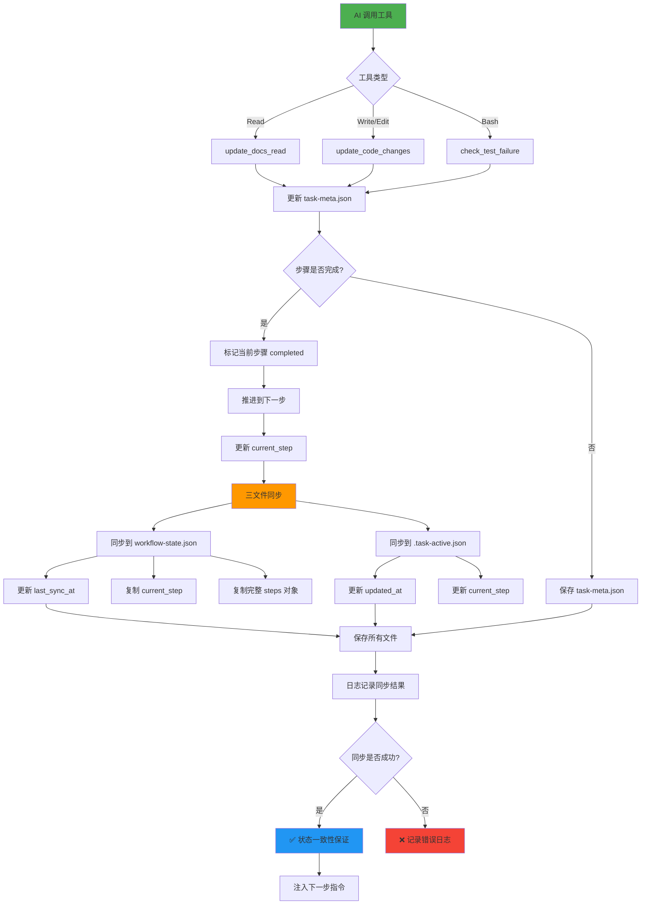

### 同步核心代码

```python
# unified-workflow-driver.py (v20.2.7)

# === 步骤3: 三文件同步 ===
# 保存主副本
save_json(meta_path, meta)

# 同步到 .task-active.json
save_json(active_flag_path, {
    **active_flag,
    "current_step": next_step,
    "updated_at": datetime.now().isoformat()
})

# v20.2.7: 同步到 workflow-state.json (P0修复)
workflow_state_path = os.path.join(cwd, '.claude', 'workflow-state.json')
workflow_state = load_json(workflow_state_path)

if workflow_state:
    # 完整同步 steps 对象（避免部分更新导致不一致）
    workflow_state['current_step'] = next_step
    workflow_state['steps'] = meta['workflow_state']['steps'].copy()
    workflow_state['last_sync_at'] = datetime.now().isoformat()

    if save_json(workflow_state_path, workflow_state):
        logger.info("✅ 已同步到workflow-state.json", {
            "current_step": next_step,
            "steps_synced": list(workflow_state['steps'].keys())
        })
    else:
        logger.error("❌ workflow-state.json同步失败")
```

### 同步触发点

| 触发场景 | 同步方向 | 示例 |
|---------|---------|------|
| **任务初始化** | meta → workflow-state<br/>meta → .task-active | UserPromptSubmit Hook 创建三个文件 |
| **工具调用后** | meta → workflow-state<br/>meta → .task-active | PostToolUse Hook 检测到步骤完成 |
| **AI 手动编辑** | workflow-state → meta | AI 直接编辑 workflow-state.json 后，下次工具调用时重新加载 |
| **步骤推进** | meta → workflow-state → .task-active | 完整的三文件同步 |

### 一致性保证机制

#### 1. 主副本原则
- `.task-meta.json` 是权威数据源（Source of Truth）
- 其他文件从主副本派生
- 发生冲突时，以 `.task-meta.json` 为准

#### 2. 原子性保证
```python
# 原子性保存：先写临时文件，再重命名
def save_json_atomic(file_path, data):
    temp_path = file_path + '.tmp'
    with open(temp_path, 'w', encoding='utf-8') as f:
        json.dump(data, f, indent=2, ensure_ascii=False)

    # 原子性重命名（Windows 上可能需要先删除目标文件）
    if os.path.exists(file_path):
        os.remove(file_path)
    os.rename(temp_path, file_path)
```

#### 3. 同步失败处理
```python
# v20.2.8: 异常隔离机制
try:
    # 同步到 workflow-state.json
    if save_json(workflow_state_path, workflow_state):
        logger.info("✅ 同步成功")
    else:
        logger.error("❌ 同步失败")
        # 记录错误但不中断流程
except Exception as sync_err:
    logger.error("同步异常", sync_err)
    # 异常隔离：同步失败不影响主流程
```

---

## 会话历史持久化

### 设计动机 (v20.2.7)

**核心问题**:
- ❌ Claude Code 会话历史未持久化，压缩会话/跨会话后信息丢失
- ❌ `.task-meta.json` 仅保存元数据，缺少上下文细节（用户说了什么、AI 如何分析）
- ❌ AI 依赖记忆生成归档文档，质量无法保证
- ❌ 子代理无法访问主会话上下文

**解决方案**:
- 持久化完整会话历史到 `.conversation.jsonl` (JSON Lines 格式)
- 支持跨会话补充归档（从历史数据重建）
- 自动生成高质量归档文档（context.md + solution.md）

### 会话历史文件格式

#### .conversation.jsonl 结构

```jsonlines
{"timestamp": "2025-11-14T14:35:20.123Z", "role": "user", "content": "/mc 修复商店购买功能", "event_type": "task_init"}
{"timestamp": "2025-11-14T14:35:25.456Z", "role": "assistant", "content": "我将帮你修复商店购买功能。让我先查阅相关文档...", "event_type": "response"}
{"timestamp": "2025-11-14T14:35:30.789Z", "role": "tool", "tool_name": "Read", "tool_input": {"file_path": "markdown/systems/商店系统.md"}, "event_type": "tool_call"}
{"timestamp": "2025-11-14T14:35:32.012Z", "role": "tool", "tool_name": "Read", "tool_result_summary": "成功读取 150 行", "event_type": "tool_result"}
{"timestamp": "2025-11-14T14:36:10.345Z", "role": "tool", "tool_name": "Edit", "tool_input": {"file_path": "scripts/ShopServerSystem.py", "old_string": "...", "new_string": "..."}, "event_type": "tool_call"}
{"timestamp": "2025-11-14T14:36:15.678Z", "role": "user", "content": "报错了：AttributeError: 'NoneType' object has no attribute 'buy'", "event_type": "feedback", "sentiment": "negative"}
{"timestamp": "2025-11-14T14:36:20.901Z", "role": "assistant", "content": "我看到错误了，问题在于商品数据未正确加载...", "event_type": "response"}
```

#### 字段说明

| 字段 | 类型 | 必需 | 说明 | 示例 |
|-----|------|------|------|------|
| `timestamp` | ISO 8601 | ✅ | 事件时间戳 | `"2025-11-14T14:35:20.123Z"` |
| `role` | string | ✅ | 角色类型 | `"user"`, `"assistant"`, `"tool"` |
| `content` | string | ❌ | 文本内容 | 用户输入或AI回复 |
| `event_type` | string | ✅ | 事件类型 | `"task_init"`, `"feedback"`, `"tool_call"` |
| `tool_name` | string | ❌ | 工具名称 (role=tool时) | `"Read"`, `"Edit"`, `"Bash"` |
| `tool_input` | object | ❌ | 工具输入参数 | `{"file_path": "..."}` |
| `tool_result_summary` | string | ❌ | 工具执行结果摘要 | `"成功读取 150 行"` |
| `sentiment` | string | ❌ | 情感倾向 (feedback时) | `"positive"`, `"negative"`, `"neutral"` |

### 会话记录流程

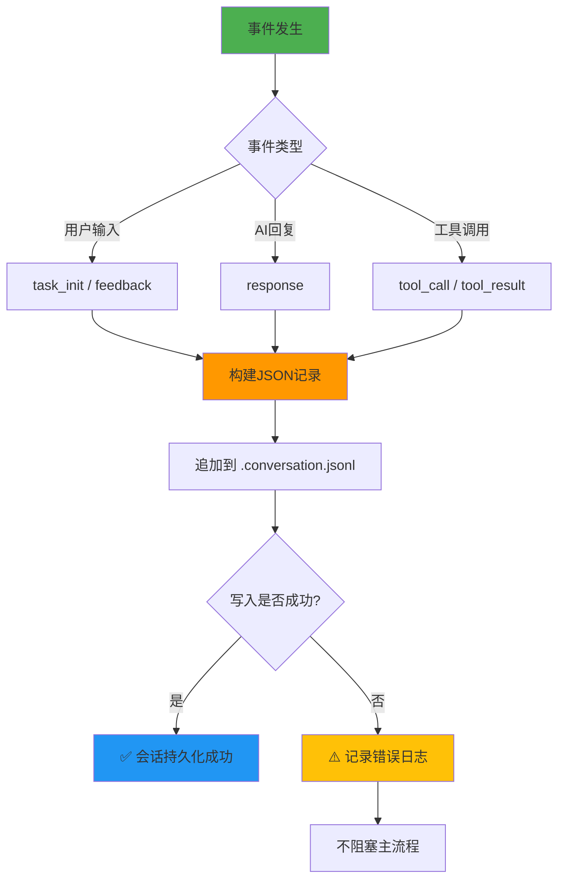

### 文档生成流程 (从会话历史)

#### generate-docs-from-conversation.py 工作原理

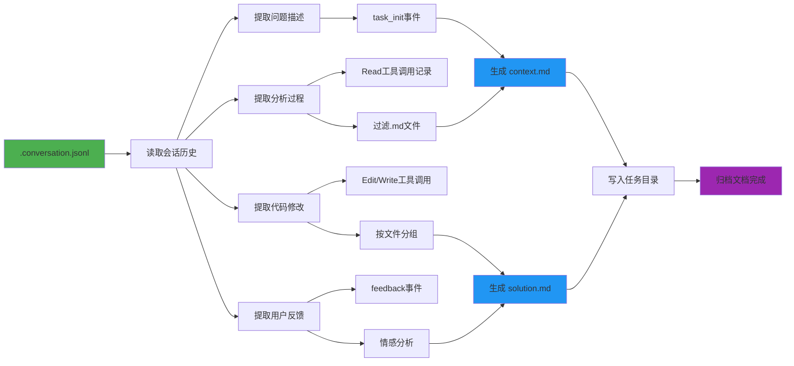

#### context.md 生成模板

```markdown
# 任务上下文

## 问题描述

{从 task_init 事件提取的原始需求}

## 分析过程

1. **开发规范.md** - 2025-11-14 14:35:30
   - 路径: `.claude/core-docs/核心工作流文档/开发规范.md`
   - 目的: 查阅文档

2. **商店系统.md** - 2025-11-14 14:36:10
   - 路径: `markdown/systems/商店系统.md`
   - 目的: 查阅文档

## 任务元数据

- **任务ID**: 任务-1114-143520-修复商店购买功能
- **创建时间**: 2025-11-14 14:35:20
- **任务类型**: bug_fix
- **文档阅读**: 2个
- **代码修改**: 3次
```

#### solution.md 生成模板

```markdown
# 解决方案

## 代码修改

### ShopServerSystem.py

**路径**: `scripts/ShopServerSystem.py`

**修改次数**: 3

**修改历史**:

1. **Edit** - 2025-11-14 14:36:10
   - 结果: 成功修改 20 行
2. **Edit** - 2025-11-14 14:38:25
   - 结果: 修复空指针检查
3. **Edit** - 2025-11-14 14:40:15
   - 结果: 添加日志输出

## 测试验证

### 用户反馈

1. ❌ **2025-11-14 14:36:15**
   - 报错了：AttributeError: 'NoneType' object has no attribute 'buy'

2. ✅ **2025-11-14 14:41:00**
   - 已修复！现在可以正常购买了

## 技术决策

1. **添加空值检查**
   - 理由: 防止商品数据为None时崩溃
   - 参考: CRITICAL规范-异常处理

2. **使用日志记录购买流程**
   - 理由: 便于后续调试和审计
```

### 会话历史用途

| 用途 | 说明 | 实现 |
|-----|------|------|
| **归档文档生成** | 自动生成 context.md + solution.md | generate-docs-from-conversation.py |
| **跨会话补充归档** | 压缩会话后仍可重建文档 | 读取 .conversation.jsonl 重新生成 |
| **审计和回溯** | 追溯任务完整执行过程 | 按时间戳查询会话历史 |
| **质量分析** | 统计文档阅读、代码修改、失败次数 | 从会话历史提取 metrics |
| **用户行为分析** | 分析用户反馈情感、确认模式 | sentiment 字段统计 |

---

## 归档流程

### 完整归档序列图 (v20.2)

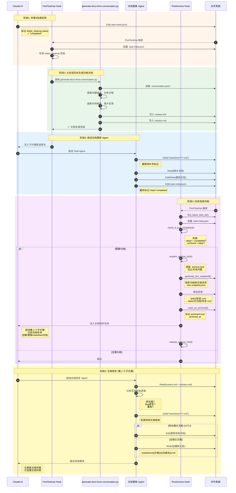

### 归档触发条件

```python
def check_if_just_completed(meta_file):
    """检查任务是否需要归档"""
    # 1. 检查是否已归档
    if meta.get("archived", False):
        return False  # 已归档，跳过

    # 2. 检查 step4 是否完成
    step4_status = meta.get("workflow_state", {}) \
                       .get("steps", {}) \
                       .get("step4_cleanup", {}) \
                       .get("status")

    if step4_status != "completed":
        return False  # 步骤4未完成，跳过

    # 3. 满足条件，需要归档
    return True, meta
```

### 归档锁机制

**设计目的**: 防止并发归档导致文件冲突

```python
def acquire_archive_lock(task_dir):
    """获取归档锁"""
    lock_file = Path(task_dir) / ".archive-lock"

    if lock_file.exists():
        # 检查锁是否过期 (超过1分钟)
        if time.time() - lock_file.stat().st_mtime > 60:
            lock_file.unlink()  # 删除过期锁
        else:
            return False  # 锁被占用

    try:
        lock_file.touch()  # 创建锁文件
        return True
    except:
        return False

def release_archive_lock(task_dir):
    """释放归档锁"""
    lock_file = Path(task_dir) / ".archive-lock"
    if lock_file.exists():
        lock_file.unlink()
```

### 归档文件结构

```
tasks/
├─ 已归档/
│  ├─ 任务-1114-143520-修复商店购买功能/
│  │  ├─ .task-meta.json          # 任务元数据 (archived=true)
│  │  ├─ .conversation.jsonl      # 完整会话历史
│  │  ├─ context.md               # 问题上下文
│  │  ├─ solution.md              # 解决方案
│  │  └─ .archive-lock (删除)     # 归档锁 (归档完成后删除)
│  │
│  └─ 任务-1115-091020-优化技能系统性能/
│     └─ ...
│
└─ 任务-1115-150230-添加新副本/ (活跃任务)
   └─ ...
```

### 文档快照机制 (v20.1.1)

**设计目的**: 记录归档前 markdown 文档状态，用于检测文档变化

```python
def generate_doc_snapshot(project_path):
    """生成归档前文档快照"""
    markdown_dir = Path(project_path) / "markdown"
    snapshot = {}

    for md_file in markdown_dir.glob("**/*.md"):
        snapshot[str(md_file)] = {
            "mtime": md_file.stat().st_mtime,  # 修改时间
            "size": md_file.stat().st_size      # 文件大小
        }

    return snapshot

def save_doc_snapshot(snapshot, project_path):
    """保存文档快照"""
    snapshot_file = Path(project_path) / ".claude" / ".doc-snapshot.json"
    with open(snapshot_file, 'w', encoding='utf-8') as f:
        json.dump(snapshot, f, indent=2, ensure_ascii=False)
```

**快照用途**:
- 检测哪些文档在任务期间被修改
- 验证文档同步 Agent 是否正确更新文档
- 审计任务对项目文档的影响

---

## 数据模型定义

### AnalysisReport 数据结构

```javascript
// lib/analyzer.js
class AnalysisReport {
  constructor(metadata, codeStructure, docCoverage) {
    this.metadata = {
      isModsdk: boolean,
      projectName: string,
      modMainPath: string,
      usesApollo: boolean,
      usesEcpreset: boolean,
      businessType: 'RPG' | 'BedWars' | 'PVP' | 'General',
      scale: 'small' | 'medium' | 'large'
    };

    this.codeStructure = {
      systems: {
        [systemName: string]: SystemInfo
      },
      presets: {
        [presetName: string]: PresetInfo
      },
      dependencies: {
        [systemName: string]: string[]
      },
      discoveredComponents: DiscoveredStructure // v2.0+
    };

    this.docCoverage = {
      existingDocs: string[],
      missingDocs: string[],
      lowQualityDocs: string[]
    };
  }

  toMarkdown(): string;
}
```

### SystemInfo 数据结构

```javascript
class SystemInfo {
  name: string;              // 如 "ShopServerSystem"
  filePath: string;          // 绝对路径
  type: 'ServerSystem' | 'ClientSystem';
  content: string;           // 完整源代码

  // 代码度量
  linesOfCode: number;       // 代码行数
  methodCount: number;       // 方法数量
  eventListeners: number;    // 事件监听数量

  // 复杂度分析
  complexityScore: number;   // 0-10

  // 方法
  getDetailLevel(): 'simple' | 'medium' | 'detailed';
}
```

### Replacements 占位符表

```javascript
// lib/generator.js: _buildReplacements()
const replacements = {
  // 项目基本信息
  '{{PROJECT_PATH}}': string,          // 项目路径（规范化）
  '{{PROJECT_NAME}}': string,          // 项目名称
  '{{CURRENT_DATE}}': string,          // 当前日期 YYYY-MM-DD
  '{{VERSION}}': string,               // 工作流版本号

  // 动态内容
  '{{EXAMPLE_TASKS}}': string,         // 示例任务列表
  '{{LOG_FILES}}': string,             // 日志文件列表
  '{{ARCHITECTURE_DOCS_SECTION}}': string,
  '{{BUSINESS_DOCS_SECTION}}': string,
  '{{CRITICAL_RULES}}': string,        // CRITICAL 规范
  '{{CRITICAL_RULES_EXTRA}}': string,

  // 路径配置
  '{{SDK_DOC_PATH}}': string,          // SDK 文档路径
  '{{GLOBAL_DOCS_PATH}}': string,      // 全局文档路径
  '{{CORE_PATHS}}': string,            // 核心路径列表

  // 项目描述
  '{{PROJECT_DESCRIPTION}}': string,
  '{{PROJECT_STATUS}}': string,
  '{{EXTRA_DOCS}}': string,
  '{{QUICK_INDEX_EXTRA}}': string,
  '{{NBT_CHECK_SECTION}}': string,     // NBT 检查部分
  '{{PRESETS_DOCS_SECTION}}': string   // Presets 文档部分
};
```

### WorkflowManifest 版本追踪

```javascript
// .claude/workflow-manifest.json
{
  "version": "20.2.10",
  "installedAt": "2025-11-13T10:30:00.000Z",
  "lastUpdatedAt": "2025-11-14T10:30:00.000Z",
  "baselineHashes": {
    "核心工作流文档/开发规范.md": "sha256:abc123...",
    "核心工作流文档/问题排查.md": "sha256:def456...",
    // ...更多文档哈希
  },
  "changes": [
    {
      "version": "20.2.10",
      "date": "2025-11-14",
      "description": "修复 unified-workflow-driver Hook 完全失效问题",
      "previousVersion": "20.2.9"
    },
    {
      "version": "20.2.9",
      "date": "2025-11-14",
      "description": "GitHub 开源发布清理",
      "previousVersion": "20.2.8"
    },
    {
      "version": "20.2.8",
      "date": "2025-11-14",
      "description": "会话历史持久化 (方案B)",
      "previousVersion": "20.2.7"
    }
    // ...历史变更记录（最多保留10条）
  ]
}
```

### TaskMeta 完整数据结构 (v20.2)

```javascript
// tasks/{task_id}/.task-meta.json
{
  "task_id": "任务-1114-143520-修复商店购买功能",
  "task_description": "修复商店购买功能",
  "task_type": "bug_fix",  // "feature" | "bug_fix" | "refactor" | "general"
  "task_complexity": "standard",  // "simple" | "standard" | "complex"
  "created_at": "2025-11-14T14:35:20.123Z",
  "updated_at": "2025-11-14T14:45:30.456Z",
  "archived": false,  // true after moved to 已归档/
  "archived_at": null,  // ISO timestamp when archived

  // v20.2.7: 完整工作流状态（主副本）
  "workflow_state": {
    "task_id": "任务-1114-143520-修复商店购买功能",
    "task_description": "修复商店购买功能",
    "task_type": "bug_fix",
    "created_at": "2025-11-14T14:35:20.123Z",
    "current_step": "step3_execute",
    "last_injection_step": "step3_execute",

    "steps": {
      "step0_context": {
        "description": "阅读项目CLAUDE.md",
        "status": "skipped",  // "pending" | "in_progress" | "completed" | "skipped"
        "prompt": "（玩法包模式：已跳过）"
      },
      "step1_understand": {
        "description": "理解任务需求",
        "status": "skipped",
        "prompt": "（玩法包模式：已跳过）"
      },
      "step3_execute": {
        "description": "执行实施",
        "status": "in_progress",
        "started_at": "2025-11-14T14:35:20.123Z",
        "user_confirmed": false,
        "last_error": null,
        "last_error_time": null,
        "last_test_reminder_at": null,  // v20.2.7: 防止频繁提醒
        "prompt": "基于玩法包代码实现功能，测试验证，直到用户确认修复完成。"
      },
      "step4_cleanup": {
        "description": "收尾归档",
        "status": "pending",
        "prompt": "清理DEBUG代码，更新文档，归档任务。"
      }
    },

    // v20.2: BUG修复追踪
    "bug_fix_tracking": {
      "enabled": true,
      "bug_description": "修复商店购买功能",
      "iterations": [
        {
          "iteration_id": 1,
          "timestamp": "2025-11-14T14:36:10.123Z",
          "user_feedback": "报错了：AttributeError",
          "feedback_sentiment": "negative",
          "changes_made": [
            {
              "file": "scripts/ShopServerSystem.py",
              "change_summary": "添加空值检查"
            }
          ]
        }
      ],
      "loop_indicators": {
        "same_file_edit_count": 3,
        "failed_test_count": 0,
        "negative_feedback_count": 1,
        "consecutive_failures": 0,  // v20.3: 连续失败计数
        "time_spent_minutes": 10
      },
      "expert_triggered": false
    },

    "gameplay_pack_matched": null,  // 玩法包ID（如果匹配）
    "gameplay_pack_name": null
  },

  // v20.2: 任务度量指标
  "metrics": {
    "docs_read": [
      ".claude/core-docs/核心工作流文档/开发规范.md",
      "markdown/systems/商店系统.md"
    ],
    "docs_read_count": 2,

    "code_changes": [
      {
        "file": "scripts/ShopServerSystem.py",
        "timestamp": "2025-11-14T14:36:10.123Z",
        "operation": "Edit",
        "status": "success"  // "success" | "failed"
      },
      {
        "file": "scripts/ShopServerSystem.py",
        "timestamp": "2025-11-14T14:38:25.456Z",
        "operation": "Edit",
        "status": "failed",
        "error": "old_string not found in file"
      }
    ],
    "code_changes_count": 2,
    "consecutive_failures": 1,  // v20.3: 连续失败次数

    "failure_count": 0,
    "failures": [],

    "expert_review_triggered": false,
    "expert_triggered_at": null,

    "critical_violation_count": 0  // CRITICAL规范违规次数
  },

  // v20.2.7: 技术决策记录（可选）
  "technical_decisions": [
    {
      "decision": "添加空值检查",
      "reason": "防止商品数据为None时崩溃",
      "reference": "CRITICAL规范-异常处理",
      "timestamp": "2025-11-14T14:36:10.123Z"
    }
  ]
}
```

### WorkflowState 全局状态 (v20.2)

```javascript
// .claude/workflow-state.json
{
  "task_id": "任务-1114-143520-修复商店购买功能",
  "task_description": "修复商店购买功能",
  "task_type": "bug_fix",
  "created_at": "2025-11-14T14:35:20.123Z",
  "current_step": "step3_execute",
  "last_injection_step": "step3_execute",
  "last_sync_at": "2025-11-14T14:45:30.456Z",  // v20.2.7: 同步时间戳

  // 完整的步骤状态（从 task-meta.json 同步）
  "steps": {
    "step0_context": { /* 同 task-meta.json */ },
    "step1_understand": { /* 同 task-meta.json */ },
    "step3_execute": { /* 同 task-meta.json */ },
    "step4_cleanup": { /* 同 task-meta.json */ }
  },

  // v20.2: BUG修复追踪（从 task-meta.json 同步）
  "bug_fix_tracking": {
    "enabled": true,
    "bug_description": "修复商店购买功能",
    "iterations": [ /* ... */ ],
    "loop_indicators": { /* ... */ },
    "expert_triggered": false
  },

  "gameplay_pack_matched": null,
  "gameplay_pack_name": null
}
```

### TaskActive 活跃标志 (v20.2)

```javascript
// .claude/.task-active.json
{
  "task_id": "任务-1114-143520-修复商店购买功能",
  "task_dir": "D:/Project/tasks/任务-1114-143520-修复商店购买功能",
  "current_step": "step3_execute",
  "created_at": "2025-11-14T14:35:20.123Z",
  "updated_at": "2025-11-14T14:45:30.456Z"
}
```

### ConversationHistory 会话历史 (v20.2.7)

```jsonlines
// tasks/{task_id}/.conversation.jsonl (JSON Lines 格式)
{"timestamp": "2025-11-14T14:35:20.123Z", "role": "user", "content": "/mc 修复商店购买功能", "event_type": "task_init"}
{"timestamp": "2025-11-14T14:35:30.789Z", "role": "tool", "tool_name": "Read", "tool_input": {"file_path": "markdown/systems/商店系统.md"}, "event_type": "tool_call"}
{"timestamp": "2025-11-14T14:36:15.678Z", "role": "user", "content": "报错了：AttributeError", "event_type": "feedback", "sentiment": "negative"}
```

**字段定义**:
```typescript
interface ConversationEntry {
  timestamp: string;           // ISO 8601 时间戳
  role: "user" | "assistant" | "tool";
  content?: string;            // 文本内容
  event_type: string;          // "task_init" | "feedback" | "tool_call" | "tool_result" | "response"
  tool_name?: string;          // 工具名称（role=tool时）
  tool_input?: object;         // 工具输入参数
  tool_result_summary?: string; // 工具执行结果摘要
  sentiment?: "positive" | "negative" | "neutral"; // 情感倾向（feedback时）
}
```

### DocSnapshot 文档快照 (v20.1.1)

```javascript
// .claude/.doc-snapshot.json
{
  "D:/Project/markdown/systems/商店系统.md": {
    "mtime": 1700000000.123,  // Unix 时间戳（浮点数）
    "size": 15360             // 字节数
  },
  "D:/Project/markdown/events/购买事件.md": {
    "mtime": 1700000100.456,
    "size": 8192
  }
  // ...更多文档快照
}
```

---

## 附录

### 关键配置常量

```javascript
// lib/config.js

// 版本号
const VERSION = '18.4.0';

// 复杂度评分阈值
const COMPLEXITY_THRESHOLDS = {
  detailed: 8,   // score ≥ 8 → detailed
  medium: 5      // score ≥ 5 → medium, < 5 → simple
};

// 项目规模阈值
const SCALE_THRESHOLDS = {
  small: 10,     // ≤10 Systems
  medium: 30     // 11-30 Systems, >30 → large
};

// 文档质量评估阈值
const QUALITY_THRESHOLDS = {
  high: 80,      // ≥80分 → 保留
  medium: 50     // 50-79分 → 重写, <50分 → 重新生成
};
```

### 文件大小验证阈值

```javascript
// scripts/initmc.js: copyFileWithValidation()

const minSizeMap = {
  'mc.md': 10000,                  // 10KB
  'mc-review.md': 7000,            // 7KB
  'mc-perf.md': 5000,              // 5KB
  'mc-docs.md': 5000,              // 5KB
  'mc-why.md': 5000,               // 5KB
  'mc-discover.md': 5000,          // 5KB
  'CLAUDE.md': 10000,              // 10KB
  '开发规范.md': 10000,            // 10KB
  '问题排查.md': 5000,             // 5KB
  '快速开始.md': 3000              // 3KB
};
```

---

## 维护说明

### 扩展新占位符

1. 在 `lib/config.js` 的 `PLACEHOLDERS` 对象添加定义
2. 在 `lib/generator.js` 的 `_buildReplacements()` 实现生成逻辑
3. 在模板文件中使用新占位符
4. 更新本文档的"占位符替换表"章节

### 添加新命令模板

1. 在 `templates/.claude/commands/` 创建 `新命令.md.template`
2. 在 `lib/config.js` 的 `getTemplatePath()` 添加映射
3. 在 `lib/generator.js` 的 `_generateLayer1()` 调用生成
4. 在 `scripts/initmc.js` 添加文件验证规则
5. 更新本文档的"模板文件结构"章节

### 修改文档生成逻辑

1. 编辑 `lib/generator.js` 对应的 `_generateLayerX()` 方法
2. 如果涉及新数据源，先更新 `lib/analyzer.js`
3. 运行测试确保向后兼容
4. 更新本文档的流程图和数据模型

---

## 版本历史

| 版本 | 日期 | 变更说明 |
|-----|------|---------|
| **v3.0** | **2025-11-14** | **重大更新：新增任务执行数据流、三文件同步机制、会话历史持久化、归档流程** |
| | | - 新增"任务执行数据流"章节（完整序列图 + 三条关键路径） |
| | | - 新增"三文件状态同步机制"章节（设计动机、同步流程图、核心代码） |
| | | - 新增"会话历史持久化"章节（.conversation.jsonl格式、文档生成流程） |
| | | - 新增"归档流程"章节（5阶段序列图、归档锁机制、文档快照） |
| | | - 更新数据模型定义（TaskMeta、WorkflowState、TaskActive、ConversationHistory） |
| | | - 适用版本：v20.2.10+ |
| v2.0 | 2025-11-13 | 新增 SessionStart Hook 数据流，任务状态机升级为 v2.0.3 格式 |
| v1.0 | 2025-11-13 | 初始版本，基于 v18.4.0 工作流 |

---

## 相关文档

- [Hook机制](./Hook机制.md) - Hook 系统详细设计
- [技术架构](./技术架构.md) - 系统整体架构
- [快速上手](./快速上手.md) - 使用指南
- [CHANGELOG.md](../../CHANGELOG.md) - 版本更新记录

---

**文档维护者**: Claude Code Development Team
**最后审核**: 2025-11-14
**适用版本**: v20.2.10+