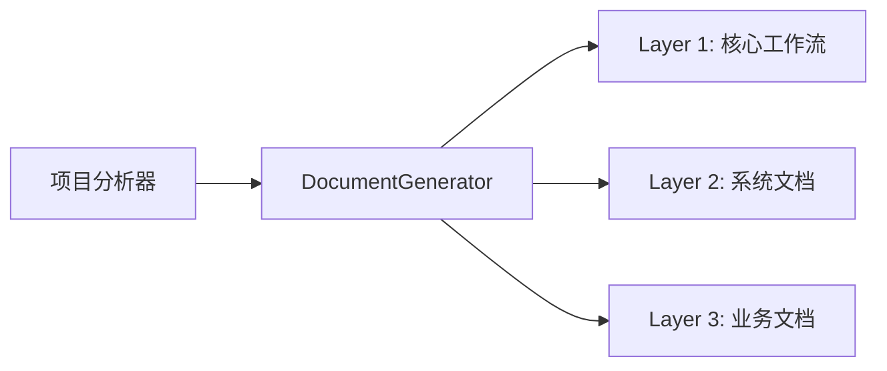
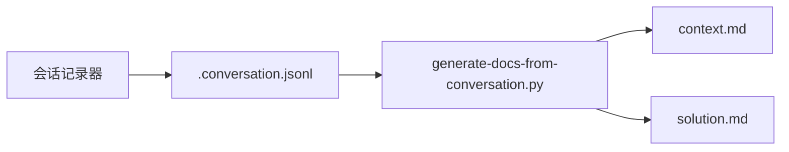
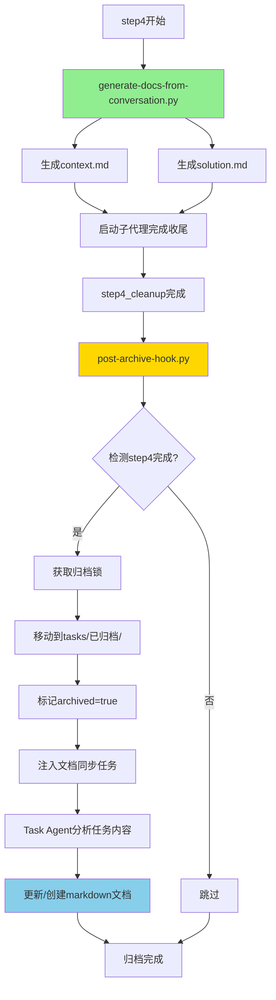
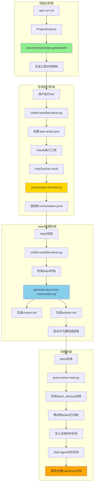

# 文档生成器 (Document Generators)

> **双层文档生成架构**
> **初始化生成器**: `lib/generator.js` (JavaScript) - 项目首次部署时生成工作流文档框架
> **任务文档生成器**: `generate-docs-from-conversation.py` (Python) - 从会话历史生成任务归档文档
> **版本**: v20.2.7
> **最后更新**: 2025-11-14

---

## 📋 架构概述

本项目采用**双层文档生成架构**，分别负责不同阶段的文档生成需求：

### 第一层：初始化文档生成器 (DocumentGenerator)

**模块**: `lib/generator.js`
**触发时机**: 项目首次部署 (`npm run init <project>`)
**职责**: 生成三层工作流文档架构



### 第二层：任务文档生成器 (v20.2.7新增)

**模块**: `generate-docs-from-conversation.py`
**触发时机**: step4_cleanup开始时
**职责**: 从会话历史生成任务归档文档



---

## 🏗️ 第一层：初始化文档生成器 (lib/generator.js)

### 核心类与方法

#### DocumentGenerator

**构造函数**
```javascript
constructor(analysisReport, upstreamPath)
```
- `analysisReport` - ProjectAnalyzer生成的分析报告
- `upstreamPath` - 上游工作流仓库路径

**主方法**
```javascript
async generateAll(targetPath, options = {})
```
- `options.minimalMode` - 最小化模式（仅部署核心工作流）

---

### Layer 1 生成 (通用层)

**生成内容**:

1. **CLAUDE.md** (v18.0改进)
   - 仅在首次部署且文件不存在时生成最小化模板
   - 已存在时跳过生成，由用户自主维护

2. **Claude命令文件** (v17.1统一命名)
   - `mc.md` - 主工作流命令
   - `mc-review.md` - 代码审查命令
   - `mc-perf.md` - 性能分析命令
   - `mc-docs.md` - 文档管理命令
   - `mc-why.md` - 架构解释命令
   - `mc-discover.md` - 组件发现命令

3. **Hook文件** (v18.1任务隔离机制)
   - `.claude/settings.json` - 配置文件
   - `.claude/hooks/` - Hook脚本目录（见下文详细说明）

4. **README.md** - 项目根README

5. **上游文档引用** (`.claude/core-docs/`)
   - 使用 `SymlinkManager` 创建软连接

6. **工作流元数据** (`.claude/workflow-manifest.json`)
   - 版本号、基线文件哈希值、安装时间

---

### Layer 2 生成 (架构层)

**生成内容**:

1. **Systems README** (`markdown/systems/README.md`)
2. **单个System文档** (智能生成)
   - 检测现有文档并评估质量（0-5分）
   - 高质量文档（≥3分）不会被覆盖
   - 使用AI智能命名

**文档质量评估标准**:
- 有代码块示例 (+1)
- 有图表（mermaid/flowchart）(+1)
- 有示例说明 (+1)
- 内容丰富（>500字符）(+1)
- 不是"待补充"模板 (+1)

---

### Layer 3 生成 (业务层)

**根据项目类型生成**:
- **RPG项目**: `markdown/NEWRPG/README.md`
- **ECPreset项目**: `markdown/presets/README.md`
- 其他项目: 创建基础框架

---

### CLAUDE.md智能合并 (v16.1+)

**四段式结构**:

```markdown
<!-- ==================== 项目配置区 START ==================== -->
(用户自定义内容)
<!-- ==================== 项目配置区 END ==================== -->

<!-- ==================== 工作流内容 START v16.1 ==================== -->
(工作流自动生成内容，升级时精确替换)
<!-- ==================== 工作流内容 END v16.1 ==================== -->

<!-- ==================== 项目扩展区 START ==================== -->
(用户添加项目特定规范)
<!-- ==================== 项目扩展区 END ==================== -->

<!-- ==================== 文档元数据区 START ==================== -->
(版本信息、生成时间)
<!-- ==================== 文档元数据区 END ==================== -->
```

**合并逻辑**:
- 保留用户编辑的项目配置区和项目扩展区
- 更新工作流内容区和元数据区

---

## 📝 第二层：任务文档生成器 (v20.2.7)

### 会话历史持久化机制

#### conversation-recorder.py

**触发时机**: PostToolUse (所有工具)
**职责**: 记录每次工具调用到 `.conversation.jsonl`

**记录格式**:
```json
{
  "timestamp": "2025-11-14T10:30:00",
  "role": "tool",
  "tool_name": "Read",
  "tool_input": {"file_path": "markdown/systems/商店系统.md"},
  "tool_result_summary": "文件内容摘要（限200字符）"
}
```

**数据流**:
```
用户输入 → Claude执行工具 → PostToolUse Hook
                             ↓
                   conversation-recorder.py
                             ↓
                   tasks/<task-id>/.conversation.jsonl
```

**关键设计**:
- 自动过滤大输出（摘要限制200字符）
- 只记录关键字段（file_path, command, pattern等）
- 检测活跃任务标志（.task-active.json）

---

### generate-docs-from-conversation.py

**触发时机**: step4_cleanup开始时（unified-workflow-driver.py第630-658行）
**职责**: 从会话历史生成归档文档

**调用流程**:
```python
# unified-workflow-driver.py (line 630-658)
def inject_next_step_prompt(next_step, meta, cwd=None):
    if next_step == "step4_cleanup" and cwd:
        # 先从会话历史生成context.md和solution.md
        task_id = meta.get("task_id")
        task_dir = os.path.join(cwd, 'tasks', task_id)
        conversation_file = os.path.join(task_dir, '.conversation.jsonl')

        if os.path.exists(conversation_file):
            subprocess.run([
                sys.executable,
                '.claude/hooks/generate-docs-from-conversation.py',
                task_dir
            ])
```

---

### 生成的文档内容

#### 1. context.md (任务上下文)

**提取内容**:
- **问题描述**: 从task_init事件提取用户初始输入
- **分析过程**: 从Read工具调用提取文档阅读记录
- **任务元数据**: 任务ID、创建时间、任务类型、统计数据

**生成逻辑**:
```python
def extract_problem_description(conversation):
    for entry in conversation:
        if entry.get('role') == 'user' and entry.get('event_type') == 'task_init':
            return entry.get('content', '').replace('/mc ', '').strip()
    return "未记录"

def extract_analysis_process(conversation):
    analysis = []
    for entry in conversation:
        if entry.get('role') == 'tool' and entry.get('tool_name') == 'Read':
            tool_input = entry.get('tool_input', {})
            file_path = tool_input.get('file_path', '')
            # 只记录文档阅读（.md文件）
            if file_path.endswith('.md'):
                analysis.append({
                    'timestamp': entry.get('timestamp'),
                    'file': file_path,
                    'purpose': "查阅文档"
                })
    return analysis
```

#### 2. solution.md (解决方案)

**提取内容**:
- **代码修改**: 从Edit/Write工具调用提取
  - 按文件分组
  - 记录修改次数和时间戳
- **测试验证**: 从user_feedback事件提取
- **技术决策**: 从task-meta.json提取

**生成逻辑**:
```python
def extract_code_changes(conversation):
    changes = []
    for entry in conversation:
        tool_name = entry.get('tool_name')
        if entry.get('role') == 'tool' and tool_name in ['Edit', 'Write']:
            tool_input = entry.get('tool_input', {})
            file_path = tool_input.get('file_path', '')
            if file_path:
                changes.append({
                    'timestamp': entry.get('timestamp'),
                    'operation': tool_name,
                    'file': file_path,
                    'result_summary': entry.get('tool_result_summary', '')
                })
    return changes
```

---

### 文档生成示例

**输入**: `.conversation.jsonl`
```json
{"timestamp": "2025-11-14T10:30:00", "role": "tool", "tool_name": "Read", "tool_input": {"file_path": "markdown/systems/商店系统.md"}, "tool_result_summary": "文档内容..."}
{"timestamp": "2025-11-14T10:35:00", "role": "tool", "tool_name": "Edit", "tool_input": {"file_path": "scripts/shop/server.py"}, "tool_result_summary": "已修改"}
```

**输出**: `context.md`
```markdown
# 任务上下文

## 问题描述

优化商店系统的性能

## 分析过程

1. **商店系统.md** - 2025-11-14 10:30:00
   - 路径: `markdown/systems/商店系统.md`
   - 目的: 查阅文档

## 任务元数据

- **任务ID**: task-1114-103000
- **创建时间**: 2025-11-14 10:30:00
- **任务类型**: feature
- **文档阅读**: 1个
- **代码修改**: 1次
```

**输出**: `solution.md`
```markdown
# 解决方案

## 代码修改

### server.py

**路径**: `scripts/shop/server.py`

**修改次数**: 1

**修改历史**:

1. **Edit** - 2025-11-14 10:35:00
   - 结果: 已修改

## 测试验证

_（无用户反馈记录）_

## 技术决策

_（无技术决策记录）_
```

---

## 🔄 归档流程集成

### post-archive-hook.py

**触发时机**: step4_cleanup完成后
**职责**: 移动任务目录到 `tasks/已归档/`

**完整流程**:


**关键代码** (post-archive-hook.py line 440-455):
```python
# 0. Generate doc snapshot before archive (v20.1.1)
snapshot = generate_doc_snapshot(project_path)
save_doc_snapshot(snapshot, project_path)

# 1. 移动到归档目录
archived_path = move_to_archive(task_dir, project_path)

# 2. 标记为已归档
mark_as_archived(archived_path)

# 3. 注入文档同步任务
injection = inject_doc_sync_task(meta, archived_path)
output = {
    "continue": True,
    "injectedContext": injection
}
```

---

## 💡 使用示例

### 示例1: 初始化项目文档

```bash
# 首次部署工作流到项目
npm run init /path/to/modsdk-project

# 最小化模式（仅核心工作流）
npm run init /path/to/modsdk-project -- --minimal
```

**生成结果**:
```
/path/to/modsdk-project/
├── .claude/
│   ├── commands/
│   │   ├── mc.md
│   │   ├── mc-review.md
│   │   └── ...
│   ├── hooks/
│   │   ├── unified-workflow-driver.py
│   │   ├── conversation-recorder.py
│   │   ├── generate-docs-from-conversation.py
│   │   └── ...
│   └── workflow-manifest.json
├── markdown/
│   ├── systems/
│   ├── AI策略文档/
│   └── README.md
└── CLAUDE.md
```

---

### 示例2: 任务会话记录

```javascript
// 用户执行 /mc 优化商店系统性能

// Claude执行工具:
Read("markdown/systems/商店系统.md")
Edit("scripts/shop/server.py", ...)
Bash("pytest tests/shop/")

// 后台自动记录:
// tasks/task-1114-103000/.conversation.jsonl:
{"timestamp": "...", "role": "tool", "tool_name": "Read", ...}
{"timestamp": "...", "role": "tool", "tool_name": "Edit", ...}
{"timestamp": "...", "role": "tool", "tool_name": "Bash", ...}
```

---

### 示例3: step4自动生成文档

```python
# step4_cleanup开始时自动触发
# unified-workflow-driver.py调用:

subprocess.run([
    'python',
    '.claude/hooks/generate-docs-from-conversation.py',
    'tasks/task-1114-103000'
])

# 生成结果:
# tasks/task-1114-103000/context.md
# tasks/task-1114-103000/solution.md
```

---

### 示例4: 归档后文档同步

```python
# post-archive-hook.py完成归档后注入:

"""
📦 任务归档完成 - 正在启动文档同步
━━━━━━━━━━━━━━━━━━━━━━━━━━━━━━━━━━━━━━

**任务已归档到**: `tasks/已归档/task-1114-103000`

**下一步**: 我将启动Task Agent分析任务内容并更新相关文档。

━━━━━━━━━━━━━━━━━━━━━━━━━━━━━━━━━━━━━━

# 任务归档文档同步 (v20.1.1 强制文档创建)

**归档任务ID**: task-1114-103000
**任务描述**: 优化商店系统性能
**归档路径**: tasks/已归档/task-1114-103000

## 📋 你的任务 (CRITICAL: 必须创建/更新文档)

分析这个已完成任务的内容,更新或创建下游项目的相关文档。

### 步骤1: 分析任务内容
阅读以下文件:
- `context.md` (任务上下文)
- `solution.md` (解决方案)

### 步骤2: 识别影响范围
确定这个任务涉及了哪些方面...
"""
```

**Task Agent执行**:
```bash
# 1. 扫描markdown目录
Glob("markdown/**/*.md")

# 2. 更新相关文档
Edit("markdown/systems/商店系统.md", ...)

# 3. 或创建新文档（如果不存在）
Write("markdown/systems/性能优化.md", ...)
```

---

## 📊 完整数据流图



---

## 🎯 最佳实践

### 初始化文档生成器

1. **分步生成**: 先生成 Layer 1，测试无误后再生成 Layer 2/3
2. **保护用户内容**: 使用文档质量评估避免覆盖高质量文档
3. **智能命名**: 使用 `IntelligentDocMaintenance._inferChineseNameByAI` 生成中文文档名
4. **版本追踪**: 始终写入 `workflow-manifest.json` 记录版本信息
5. **最小化部署**: 对于新项目，优先使用 `minimalMode` 避免生成过多待补充文档

### 任务文档生成器

1. **会话记录优化**: 自动过滤大输出，只记录关键信息
2. **文档生成时机**: 在step4开始时立即生成，确保数据完整性
3. **幂等性设计**: 多次调用generate-docs-from-conversation.py不会重复生成
4. **归档锁机制**: 使用.archive-lock防止并发归档问题
5. **文档同步策略**: 最多创建/更新2个文档，避免过度创建

---

## 📚 依赖模块

### 初始化生成器依赖

- `fs-extra` - 增强文件系统操作
- `path` - 路径处理
- `./utils` - 工具函数
- `./config` - 配置常量
- `./doc-mapping-inference` - 文档映射推断
- `./intelligent-doc-maintenance` - 智能文档维护
- `./symlink-manager` - 软连接管理
- `./version-checker` - 版本检测

### 任务文档生成器依赖

- `sys` - 系统接口
- `json` - JSON处理
- `os` - 文件系统操作
- `datetime` - 时间戳处理
- `io` - Windows编码修复

---

## 🔄 版本历史

- **v20.2.7** (2025-11-14): 新增任务文档生成器，从会话历史生成context.md和solution.md
- **v20.2.0**: 归档机制重构，双触发点保证（PostToolUse + Stop Hook）
- **v18.1**: Hook文件部署，任务隔离机制
- **v18.0**: CLAUDE.md用户自主维护，最小化模板
- **v17.1**: 统一命令命名（/mc前缀），清理旧命令
- **v16.1**: CLAUDE.md智能合并，四段式结构
- **v16.0**: 双层文档架构，上游文档软连接
- **v2.0**: 集成自适应文档维护机制
- **v1.0**: 基础文档生成功能

---

## 🔗 相关文档

- [项目分析器.md](./项目分析器.md) - 分析报告生成
- [智能文档维护.md](./智能文档维护.md) - 自适应文档维护
- [Hook机制.md](./Hook机制.md) - 工作流Hook系统
- [数据流设计.md](./数据流设计.md) - 工作流执行流程
- [版本管理.md](./版本管理.md) - 迁移与同步机制

---

**文档元数据**:
- 作者: MODSDK工作流团队
- 最后更新: 2025-11-14
- 版本: v20.2.7
