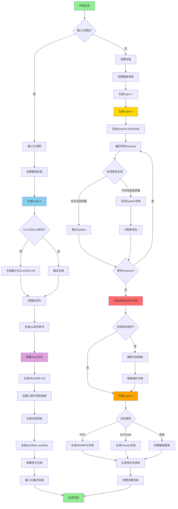
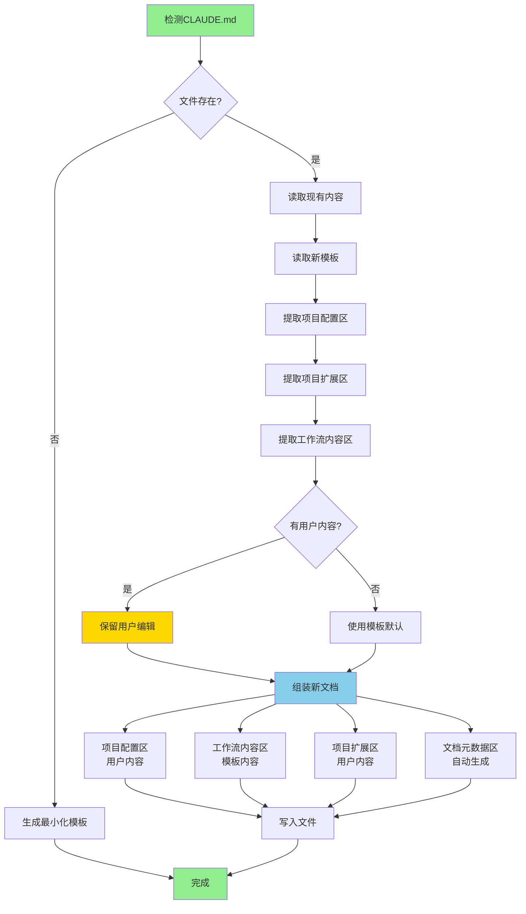
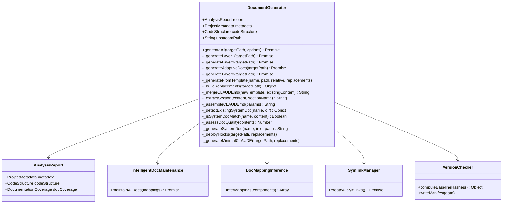

# 文档生成器 (DocumentGenerator)

> 模块路径: `lib/generator.js`
> 版本: v2.0 (集成自适应文档维护机制)
> 最后更新: 2025-11-13

---

## 📋 模块概述

`DocumentGenerator` 是 MODSDK 开发工作流的核心文档生成引擎，负责根据 `ProjectAnalyzer` 生成的分析报告，创建完整的三层文档架构（Layer 1通用层、Layer 2架构层、Layer 3业务层）。v2.0 版本集成了自适应文档维护机制，能够智能处理任意类型的项目组件。

### 主要职责

1. **三层文档生成**: Layer 1（核心工作流）、Layer 2（系统文档）、Layer 3（业务文档）
2. **模板渲染**: 从模板文件生成实际文档，替换占位符
3. **智能文档维护**: 检测现有文档质量，避免覆盖高质量文档
4. **自适应组件文档**: 为自定义组件自动生成文档（v2.0）
5. **版本管理**: 生成 workflow-manifest.json 用于版本追踪
6. **Hook部署**: 部署任务隔离与上下文恢复的Hook文件（v18.1）

---

## 🏗️ 核心类与方法

### DocumentGenerator (主生成器)

#### 构造函数
```javascript
constructor(analysisReport, upstreamPath)
```
- **参数**:
  - `analysisReport` - ProjectAnalyzer生成的分析报告
  - `upstreamPath` - 上游工作流仓库路径
- **初始化**:
  - `this.report` - 完整分析报告
  - `this.metadata` - 项目元数据
  - `this.codeStructure` - 代码结构
  - `this.upstreamPath` - 上游路径

---

### 主要生成方法

#### generateAll(targetPath, options) - 生成所有文档
```javascript
async generateAll(targetPath, options = {})
```
- **参数**:
  - `targetPath` - 目标项目路径
  - `options.minimalMode` - 最小化模式（仅部署核心工作流）
- **生成流程**:
  1. 创建基础目录结构
  2. 生成 Layer 1（通用层）
  3. 部署官方文档（最小化模式）
  4. 生成 Layer 2（架构层）- 非最小化模式
  5. 生成自适应组件文档（v2.0）- 非最小化模式
  6. 生成 Layer 3（业务层）- 非最小化模式
  7. 生成文档待补充清单 - 非最小化模式

---

### Layer 1 生成 (通用层 - v18.0架构)

#### _generateLayer1(targetPath) - 核心工作流文档
```javascript
async _generateLayer1(targetPath)
```

**生成内容**:

1. **CLAUDE.md** (v18.0改进):
   - 仅在首次部署且文件不存在时生成最小化模板
   - 已存在时跳过生成，由用户自主维护
   - 使用 `_generateMinimalCLAUDE()` 生成约30行的简洁模板

2. **Claude命令文件** (v17.1统一命名):
   - `mc.md` - 主工作流命令
   - `mc-review.md` - 代码审查命令
   - `mc-perf.md` - 性能分析命令
   - `mc-docs.md` - 文档管理命令
   - `mc-why.md` - 架构解释命令
   - `mc-discover.md` - 组件发现命令
   - 自动清理旧命令：`_cleanupOldCommands()`

3. **Hook文件** (v18.1任务隔离机制):
   - `.claude/settings.json` - 配置文件
   - `.claude/hooks/` - Hook脚本目录
     - `check-critical-rules.py` - 规范检查
     - `log-changes.py` - 变更日志
     - `user-prompt-submit-hook.py` - 提示提交Hook
     - `enforce-step2.py` - 步骤2强制执行
     - `track-doc-reading.py` - 文档阅读追踪
     - `enforce-cleanup.py` - 清理强制执行
     - `pre-compact-reminder.py` - Compact提醒
     - `stop-hook.py` - 停止Hook
     - `subagent-stop-hook.py` - 子Agent停止Hook

4. **README.md** - 项目根README

5. **上游文档引用** (`.claude/core-docs/`):
   - 使用 `SymlinkManager` 创建软连接
   - 指向上游工作流的核心文档

6. **文档导航** (`markdown/README.md`):
   - 文档索引和导航

7. **任务目录** (`tasks/README.md`):
   - 任务存储说明

8. **工作流元数据** (`.claude/workflow-manifest.json`):
   - 版本号
   - 基线文件哈希值
   - 安装时间

---

### Layer 2 生成 (架构层)

#### _generateLayer2(targetPath) - 系统文档
```javascript
async _generateLayer2(targetPath)
```

**生成内容**:

1. **Systems README** (`markdown/systems/README.md`):
   - Systems索引列表

2. **单个System文档** (智能生成):
   ```javascript
   // 检测现有文档
   const existingDoc = _detectExistingSystemDoc(systemName, systemsDir);

   // 质量评估
   if (existingDoc && existingDoc.quality >= 3) {
     // 保留高质量文档
     continue;
   }

   // 生成新文档
   const docContent = _generateSystemDoc(systemName, systemInfo, targetPath);

   // AI智能命名（v2.0）
   const chineseFileName = maintenance._inferChineseNameByAI(
     systemFilePath, systemName, { type: 'system', subtype: 'system' }
   );
   ```

**文档质量评估** (0-5分):
- 有代码块示例 (+1)
- 有图表（mermaid/flowchart）(+1)
- 有示例说明 (+1)
- 内容丰富（>500字符）(+1)
- 不是"待补充"模板 (+1)

---

### 自适应组件文档 (v2.0)

#### _generateAdaptiveDocs(targetPath) - 智能组件文档
```javascript
async _generateAdaptiveDocs(targetPath)
```

**执行流程**:
1. 检查是否有发现的组件 (`discoveredComponents`)
2. 推断文档映射关系 (`DocMappingInference`)
3. 智能维护文档 (`IntelligentDocMaintenance`)

**适用场景**:
- 自定义组件目录（states/, handlers/, managers/）
- 配置文件目录（configs/, data/）
- 任何非标准System/Preset的组件

---

### Layer 3 生成 (业务层)

#### _generateLayer3(targetPath) - 业务框架
```javascript
async _generateLayer3(targetPath)
```

**根据项目类型生成**:
- **RPG项目**: `markdown/NEWRPG/README.md`
- **ECPreset项目**: `markdown/presets/README.md`
- 其他项目: 创建基础框架

---

### 模板处理方法

#### _generateFromTemplate(templateName, targetPath, relativePath, replacements)
```javascript
_generateFromTemplate(templateName, targetPath, relativePath, replacements)
```
- **功能**: 从模板生成文件，替换占位符
- **特殊处理**:
  - CLAUDE.md: 智能合并，保护用户编辑区域
  - 其他文件: 直接覆盖

#### _buildReplacements(targetPath) - 构建占位符映射
```javascript
_buildReplacements(targetPath)
```

**占位符列表**:
```javascript
{
  '{{PROJECT_PATH}}': normalizedPath,
  '{{PROJECT_NAME}}': this.metadata.projectName,
  '{{CURRENT_DATE}}': getCurrentDate(),
  '{{PROJECT_STATUS}}': '生产就绪 (Production Ready)',
  '{{VERSION}}': VERSION,
  '{{EXAMPLE_TASKS}}': this._generateExampleTasks(),
  '{{LOG_FILES}}': this._generateLogFiles(targetPath),
  '{{ARCHITECTURE_DOCS_SECTION}}': this._generateArchitectureDocs(),
  '{{BUSINESS_DOCS_SECTION}}': this._generateBusinessDocs(),
  '{{PRESETS_DOCS_SECTION}}': this._generatePresetsDocs(),
  '{{NBT_CHECK_SECTION}}': this._generateNBTSection(),
  '{{CRITICAL_RULES}}': this._generateCriticalRulesSection(),
  '{{CRITICAL_RULES_EXTRA}}': this._generateCriticalRules(),
  '{{PROJECT_DESCRIPTION}}': `${this.metadata.businessType}类型MODSDK项目`,
  '{{EXTRA_DOCS}}': this._generateExtraDocs(),
  '{{SDK_DOC_PATH}}': 'D:\\EcWork\\netease-modsdk-wiki',
  '{{GLOBAL_DOCS_PATH}}': normalizedGlobalDocsPath,
  '{{CORE_PATHS}}': this._generateCorePaths(normalizedPath)
}
```

---

### CLAUDE.md智能合并 (v16.1+)

#### _mergeCLAUDEmd(newTemplate, existingContent)
```javascript
_mergeCLAUDEmd(newTemplate, existingContent)
```

**四段式结构**:
1. **项目配置区** (用户可编辑):
   ```
   <!-- ==================== 项目配置区 START ==================== -->
   (用户自定义内容)
   <!-- ==================== 项目配置区 END ==================== -->
   ```

2. **工作流内容区** (自动管理):
   ```
   <!-- ==================== 工作流内容 START v16.1 ==================== -->
   (工作流自动生成内容，升级时精确替换)
   <!-- ==================== 工作流内容 END v16.1 ==================== -->
   ```

3. **项目扩展区** (用户可编辑):
   ```
   <!-- ==================== 项目扩展区 START ==================== -->
   (用户添加项目特定规范)
   <!-- ==================== 项目扩展区 END ==================== -->
   ```

4. **文档元数据区** (自动管理):
   ```
   <!-- ==================== 文档元数据区 START ==================== -->
   (版本信息、生成时间)
   <!-- ==================== 文档元数据区 END ==================== -->
   ```

**合并逻辑**:
- 使用 `_extractSection()` 提取标记区域
- 保留用户编辑的项目配置区和项目扩展区
- 更新工作流内容区和元数据区
- 使用 `_assembleCLAUDEmd()` 组装最终文档

---

### 文档检测与质量评估

#### _detectExistingSystemDoc(systemName, systemsDir)
```javascript
_detectExistingSystemDoc(systemName, systemsDir)
```
- **返回值**: `{ fileName, filePath, quality, matchType }` 或 `null`
- **匹配策略**:
  1. **精确文件名匹配**: `ShopServerSystem.md`
  2. **内容智能匹配**: 标题/类定义中包含系统名
  3. **核心名称匹配**: `ShopServerSystem` → `Shop`（去掉后缀）

#### _isSystemDocMatch(systemName, content)
```javascript
_isSystemDocMatch(systemName, content)
```
- **匹配策略**:
  - 标题包含系统名: `^#\s+.*${systemName}`
  - Front Matter声明: `---\nsystem: ${systemName}\n---`
  - 类定义引用: `class\s+${systemName}`
  - 核心名称匹配: 标题包含去掉System后缀的关键词

#### _assessDocQuality(content)
```javascript
_assessDocQuality(content)
```
- **评分标准** (0-5分):
  - 有代码块 (+1)
  - 有图表 (+1)
  - 有示例 (+1)
  - 内容丰富 (+1)
  - 非待补充模板 (+1)

---

### 单个System文档生成

#### _generateSystemDoc(systemName, systemInfo, targetPath)
```javascript
_generateSystemDoc(systemName, systemInfo, targetPath)
```

**文档结构**:
```markdown
# ${systemName}

---
type: ${systemInfo.type}
complexity: ${systemInfo.complexityScore}
detail_level: ${systemInfo.getDetailLevel()}
lines_of_code: ${systemInfo.linesOfCode}
---

> **类型**: ${systemInfo.type}
> **文件路径**: `${relativePath}`
> **代码行数**: ${systemInfo.linesOfCode}
> **复杂度**: ${systemInfo.complexityScore}/10
> **推荐详细度**: ${systemInfo.getDetailLevel()}

---

## 📋 概述
(待补充)

---

## 🏗️ 架构设计
### 类结构
```python
class ${systemName}(${systemInfo.type}):
    # 主要方法
    def method1(...)
    def method2(...)
```

---

## 🔧 主要方法
- `method1()` - 待补充说明
- `method2()` - 待补充说明

---

## 📊 数据流
(待补充)

---

## ❓ 常见问题
(待补充)

---

## 📚 相关文档
- [开发规范](../开发规范.md)
- [问题排查](../问题排查.md)

---

_最后更新: ${getCurrentDate()} | 自动生成_
```

---

## 💡 使用示例

### 示例1: 基础文档生成
```javascript
const { ProjectAnalyzer } = require('./lib/analyzer');
const { DocumentGenerator } = require('./lib/generator');

// 1. 分析项目
const analyzer = new ProjectAnalyzer(projectPath);
const report = analyzer.analyze();

// 2. 创建生成器
const generator = new DocumentGenerator(report, upstreamPath);

// 3. 生成所有文档
await generator.generateAll(projectPath, {
  minimalMode: false
});

console.log('✅ 文档生成完成！');
```

### 示例2: 最小化模式部署
```javascript
// 仅部署核心工作流，不生成业务文档
await generator.generateAll(projectPath, {
  minimalMode: true
});

console.log('✅ 核心工作流部署完成！');
console.log('💡 使用 /mc-docs 命令发现并规范化项目组件文档');
```

### 示例3: 自定义占位符
```javascript
// 访问内部方法（仅用于测试或扩展）
const replacements = generator._buildReplacements(projectPath);

// 添加自定义占位符
replacements['{{CUSTOM_INFO}}'] = 'My Custom Info';

// 生成单个模板
generator._generateFromTemplate(
  'custom-template.md',
  projectPath,
  'output/custom.md',
  replacements
);
```

---

## 📊 生成流程图

### 完整生成流程



### CLAUDE.md智能合并流程



---

## 🔗 类关系图



---

## ⚙️ 配置与常量

### 目录结构
```javascript
const dirs = [
  '.claude/commands',      // Claude命令文件
  'markdown/AI策略文档',    // AI策略文档
  'markdown/systems',      // Systems文档
  'tasks'                  // 任务目录
];
```

### Hook文件列表 (v18.1)
```javascript
const coreHooks = [
  'check-critical-rules.py',
  'check-critical-rules.sh',
  'log-changes.py',
  'README.md',
  'user-prompt-submit-hook.py',
  'enforce-step2.py',
  'track-doc-reading.py',
  'enforce-cleanup.py',
  'pre-compact-reminder.py',
  'stop-hook.py',
  'subagent-stop-hook.py'
];
```

### 旧命令清理列表 (v17.0+)
```javascript
const oldCommands = [
  'cc.md',
  'review-design.md',
  'analyze-performance.md',
  'validate-docs.md',
  'enhance-docs.md',
  'explain-why.md',
  'discover.md',
  'validate-architecture.md',
  'generate-diagram.md'
];
```

---

## 🎯 最佳实践

1. **分步生成**: 先生成 Layer 1，测试无误后再生成 Layer 2/3
2. **保护用户内容**: 使用 `_detectExistingSystemDoc` 避免覆盖高质量文档
3. **智能命名**: 使用 `IntelligentDocMaintenance._inferChineseNameByAI` 生成中文文档名
4. **版本追踪**: 始终写入 `workflow-manifest.json` 记录版本信息
5. **最小化部署**: 对于新项目，优先使用 `minimalMode` 避免生成过多待补充文档

---

## 📚 依赖模块

- `fs-extra` - 增强文件系统操作
- `path` - 路径处理
- `./utils` - 工具函数
- `./config` - 配置常量
- `./doc-mapping-inference` - 文档映射推断
- `./intelligent-doc-maintenance` - 智能文档维护
- `./symlink-manager` - 软连接管理
- `./version-checker` - 版本检测

---

## 🔄 版本历史

- **v18.1** (当前): Hook文件部署，任务隔离机制
- **v18.0**: CLAUDE.md用户自主维护，最小化模板
- **v17.1**: 统一命令命名（/mc前缀），清理旧命令
- **v16.1**: CLAUDE.md智能合并，四段式结构
- **v16.0**: 双层文档架构，上游文档软连接
- **v2.0**: 集成自适应文档维护机制
- **v1.0**: 基础文档生成功能

---

**文档元数据**:
- 作者: MODSDK工作流团队
- 最后更新: 2025-11-13
- 相关文档: [项目分析器.md](./项目分析器.md), [智能文档维护.md](./智能文档维护.md), [版本管理.md](./版本管理.md)
