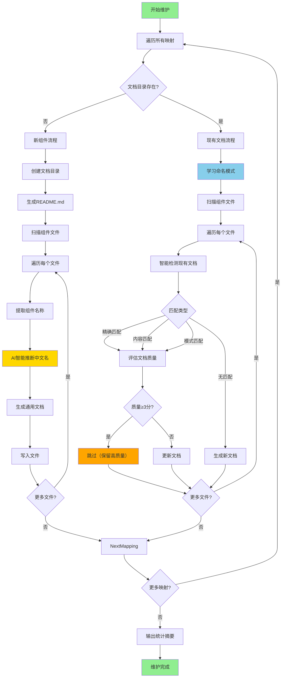
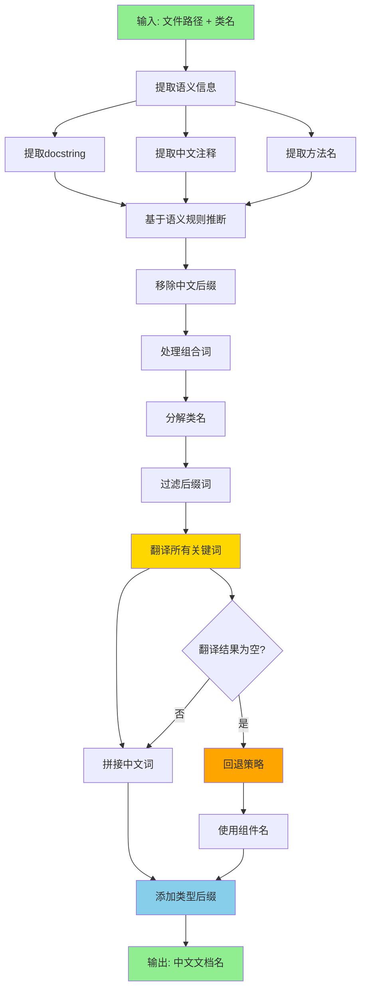
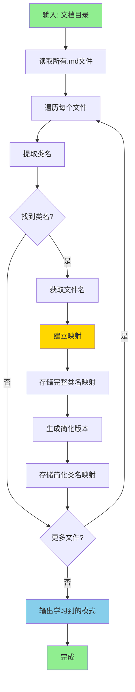
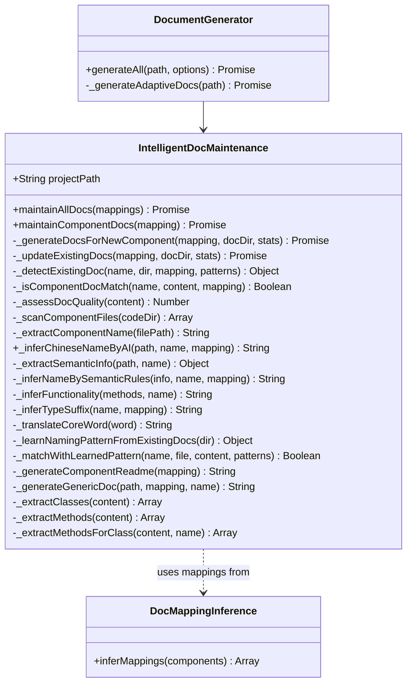

# 智能文档维护 (IntelligentDocMaintenance)

> 模块路径: `lib/intelligent-doc-maintenance.js`
> 版本: v2.0 (自适应任意组件类型)
> 最后更新: 2025-11-13

---

## 📋 模块概述

`IntelligentDocMaintenance` 是 MODSDK 开发工作流的智能文档维护引擎，能够为任意类型的项目组件自动生成和维护文档。该模块的核心亮点是 **AI智能命名系统**，可以自动推断组件的中文名称，生成符合人类习惯的文档文件名。

### 主要职责

1. **智能文档生成**: 为任意类型的组件生成通用文档
2. **文档质量评估**: 自动评估现有文档质量（0-5分），避免覆盖高质量文档
3. **AI智能命名**: 基于代码语义自动推断中文文档名称
4. **模式学习**: 从现有文档学习命名模式，保持命名一致性
5. **增量维护**: 智能检测文档缺失，只生成必要的新文档

---

## 🏗️ 核心类与方法

### IntelligentDocMaintenance (主维护器)

#### 构造函数
```javascript
constructor(projectPath)
```
- **参数**: `projectPath` - 项目根目录路径

---

### 主要维护方法

#### maintainAllDocs(mappings) - 维护所有组件文档
```javascript
async maintainAllDocs(mappings)
```
- **参数**: `mappings` - 文档映射关系数组（来自 `DocMappingInference`）
- **返回值**: 无（控制台输出统计信息）
- **统计指标**:
  - `generatedCount` - 新生成文档数
  - `skippedCount` - 跳过的高质量文档数
  - `updatedCount` - 更新的文档数

**示例输出**:
```
[维护器] ✅ 文档维护完成：
  - 新生成: 8 个文档
  - 已跳过: 3 个高质量文档
  - 已更新: 2 个文档
```

---

#### maintainComponentDocs(mapping) - 维护单个组件文档
```javascript
async maintainComponentDocs(mapping)
```
- **参数**: `mapping` - 单个组件映射对象
  ```javascript
  {
    codeDir: 'behavior_packs/mymod/states',
    docDir: 'markdown/states',
    type: 'custom',
    subtype: 'state',
    exists: false
  }
  ```
- **返回值**: `{ generated, skipped, updated }` - 统计结果

**执行逻辑**:
1. 检查文档目录是否存在
2. 如果不存在 → 调用 `_generateDocsForNewComponent()`
3. 如果存在 → 调用 `_updateExistingDocs()`

---

### 新组件文档生成

#### _generateDocsForNewComponent(mapping, docDir, stats)
```javascript
async _generateDocsForNewComponent(mapping, docDir, stats)
```

**执行步骤**:
1. 创建文档目录
2. 生成 `README.md` 索引文件
3. 扫描组件文件 (`_scanComponentFiles`)
4. 为每个文件生成文档:
   - 提取组件名称 (`_extractComponentName`)
   - AI智能推断中文文件名 (`_inferChineseNameByAI`) ⭐
   - 生成通用文档 (`_generateGenericDoc`)
   - 写入文件

---

### 现有文档更新

#### _updateExistingDocs(mapping, docDir, stats)
```javascript
async _updateExistingDocs(mapping, docDir, stats)
```

**执行步骤**:
1. 扫描组件文件
2. 学习现有文档命名模式 (`_learnNamingPatternFromExistingDocs`) ⭐
3. 遍历每个组件文件:
   - 智能检测现有文档 (`_detectExistingDoc`)
   - 评估文档质量 (`_assessDocQuality`)
   - 如果高质量（≥3分）→ 跳过
   - 如果低质量或不存在 → 生成/更新文档

---

### 文档检测与匹配

#### _detectExistingDoc(componentName, docDir, mapping, learnedPatterns)
```javascript
_detectExistingDoc(componentName, docDir, mapping, learnedPatterns)
```
- **返回值**: `{ fileName, filePath, quality, matchType }` 或 `null`
- **匹配策略**:
  1. **精确文件名匹配**: `ShopPresetDefServer.md`
  2. **内容智能匹配**: 调用 `_isComponentDocMatch()`
  3. **模式学习匹配**: 使用 `_matchWithLearnedPattern()`

**选择逻辑**:
- 如果有多个候选，按质量降序排序
- 质量相同时，内容匹配 > 精确匹配（因为内容匹配可能是更详细的中文文档）

---

#### _isComponentDocMatch(componentName, content, mapping)
```javascript
_isComponentDocMatch(componentName, content, mapping)
```
- **返回值**: `Boolean` - 是否匹配
- **匹配策略**:
  1. 标题包含组件名: `^#\s+.*${componentName}`
  2. 类定义引用: `class\s+${componentName}`
  3. 去掉后缀的关键词匹配:
     ```javascript
     // 示例: ShopPresetDefServer → Shop
     const coreNamePatterns = [
       componentName.replace(/(Def)?(Server|Client)$/i, ''),
       componentName.replace(/(Preset|System|Manager|Handler)(Def)?(Server|Client)?$/i, ''),
       componentName.replace(/System$/i, '')
     ];
     ```

---

### 文档质量评估

#### _assessDocQuality(content)
```javascript
_assessDocQuality(content)
```
- **返回值**: `Number` - 质量评分（0-5分）
- **评分标准**:
  | 因素 | 检测正则 | 得分 |
  |------|---------|------|
  | 有代码块 | `/```/` | +1 |
  | 有图表 | `/mermaid\|graph\|flowchart\|```diagram/` | +1 |
  | 有示例 | `/示例\|Example\|案例\|使用方法\|Usage/` | +1 |
  | 内容丰富 | `content.length > 500` | +1 |
  | 非待补充模板 | `!/⚠️\s*\*\*待补充\*\*/` | +1 |

**应用场景**:
```javascript
if (existingDoc && existingDoc.quality >= 3) {
  // 保留高质量文档
  console.log(`✓ 保留高质量文档: ${existingDoc.fileName} (${existingDoc.quality}/5)`);
  continue;
}
```

---

## ⭐ AI智能命名系统

### 核心方法

#### _inferChineseNameByAI(filePath, componentName, mapping)
```javascript
_inferChineseNameByAI(filePath, componentName, mapping)
```
- **参数**:
  - `filePath` - Python文件路径
  - `componentName` - 类名（如 `ShopServerSystem`）
  - `mapping` - 组件映射信息
- **返回值**: 中文文档名（如 `"商店系统.md"`）

**执行流程**:
1. 提取语义信息 (`_extractSemanticInfo`)
2. 基于语义规则推断名称 (`_inferNameBySemanticRules`)

---

### 语义信息提取

#### _extractSemanticInfo(filePath, className)
```javascript
_extractSemanticInfo(filePath, className)
```
- **返回值**: 语义信息对象
  ```javascript
  {
    className: 'ShopServerSystem',
    docstring: '商店系统，处理商品购买和出售',  // 类的docstring
    comments: ['处理金币交易', '管理商店UI'],    // 中文注释
    methodNames: ['buyItem', 'sellItem', 'openShop'],  // 公开方法名
    fileContent: '...'  // 完整文件内容
  }
  ```

**提取规则**:
1. **Docstring提取**:
   ```javascript
   const classDocPattern = new RegExp(
     `class\\s+${className}[^:]*:\\s*[\\r\\n]+\\s*"""([\\s\\S]*?)"""`,
     'm'
   );
   ```

2. **注释提取**:
   ```javascript
   const commentPattern = /#\s*(.+)/g;
   // 只保留包含中文或长度>5的注释
   if (/[\u4e00-\u9fa5]/.test(comment) || comment.length > 5) {
     info.comments.push(comment);
   }
   ```

3. **方法名提取**:
   ```javascript
   const methodPattern = /def\s+([a-zA-Z_][a-zA-Z0-9_]*)\s*\(/g;
   // 只取公开方法（不以_开头）
   if (!methodMatch[1].startsWith('_')) {
     info.methodNames.push(methodMatch[1]);
   }
   ```

---

### 语义规则推断

#### _inferNameBySemanticRules(info, componentName, mapping)
```javascript
_inferNameBySemanticRules(info, componentName, mapping)
```

**推断策略**（按优先级）:

**策略1和2已禁用** ⚠️
- **原因**: 提取开发者注释容易导致混乱命名
- **示例**: 注释"标记地图恢复是否已开始" → 不适合作为文档名

**策略3（当前主要策略）**: 完整翻译类名关键词

**步骤1: 移除已存在的中文后缀**
```javascript
let baseName = componentName.replace(/(系统|状态|预设|管理器|处理器|控制器)$/,'');
```

**步骤2: 处理组合词**
```javascript
const combinedWords = {
  'BedWars': '起床战争',
  'IronGolem': '铁傀儡',
  'ServerForm': '服务端表单',
  'ClientForm': '客户端表单'
};
```

**步骤3: 分解类名（驼峰命名 → 单词数组）**
```javascript
// ShopServerSystem → ['Shop', 'Server', 'System']
const classWords = processedName
  .replace(/([A-Z])/g, ' $1')
  .trim()
  .split(/\s+/)
  .filter(w => !['Server', 'Client', 'Def', 'System', 'Preset', 'Manager'].includes(w));
```

**步骤4: 翻译所有关键词**
```javascript
const translatedWords = classWords
  .map(word => this._translateCoreWord(word))
  .filter(w => w && w !== '');

// ['Shop'] → ['商店']
const chineseName = translatedWords.join('');
// '商店'
```

**步骤5: 添加类型后缀**
```javascript
const typeSuffix = this._inferTypeSuffix(baseName, mapping);
// '系统'

return `${chineseName}${typeSuffix}`;
// '商店系统'
```

**策略4（回退）**: 使用组件名 + 类型后缀

---

### 核心词翻译字典

#### _translateCoreWord(coreWord)
```javascript
_translateCoreWord(coreWord)
```

**字典规模**: 60+ 关键词

**分类示例**:

**游戏核心**:
```javascript
{
  Shop: '商店', Team: '队伍', Game: '游戏', Player: '玩家',
  Spawn: '生成', Trap: '陷阱', Upgrade: '升级', Bed: '床位'
}
```

**物品相关**:
```javascript
{
  Item: '物品', Weapon: '武器', Armor: '护甲', Tool: '工具'
}
```

**战斗相关**:
```javascript
{
  Skill: '技能', Buff: '增益', Damage: '伤害', Attack: '攻击'
}
```

**UI相关**:
```javascript
{
  Chat: '聊天', Menu: '菜单', Button: '按钮', Panel: '面板'
}
```

**游戏状态**:
```javascript
{
  State: '状态', Phase: '阶段', Round: '回合', Lobby: '大厅'
}
```

**起床战争特定**:
```javascript
{
  BedWars: '起床战争', Iron: '铁', Gold: '金', Diamond: '钻石'
}
```

---

### 类型后缀推断

#### _inferTypeSuffix(className, mapping)
```javascript
_inferTypeSuffix(className, mapping)
```

**推断规则**:
1. **基于类名后缀**:
   ```javascript
   if (/System$/i.test(className)) return '系统';
   if (/Manager$/i.test(className)) return '管理器';
   if (/Handler$/i.test(className)) return '处理器';
   if (/Preset$/i.test(className)) return '预设';
   if (/State$/i.test(className)) return '状态';
   ```

2. **基于mapping类型**:
   ```javascript
   const type = mapping.subtype || mapping.type;
   if (type === 'system') return '系统';
   if (type === 'preset') return '预设';
   ```

---

### 命名模式学习

#### _learnNamingPatternFromExistingDocs(docDir)
```javascript
_learnNamingPatternFromExistingDocs(docDir)
```
- **功能**: 从现有文档中学习类名→中文名的映射关系
- **返回值**: `{ [className]: chineseName }` 映射对象

**学习逻辑**:
1. 读取所有 `.md` 文件
2. 提取文档中的类名（通过正则 `class\s+(\w+)\s*\(`）
3. 建立映射: `{ 'ShopServerSystem': '商店系统' }`
4. 同时记录简化版本: `{ 'Shop': '商店系统' }`

**应用场景**:
```javascript
const learnedPatterns = this._learnNamingPatternFromExistingDocs(docDir);
// { 'ShopServerSystem': '商店系统', 'Shop': '商店系统' }

// 后续文档生成时，优先使用学习到的模式
if (learnedPatterns[componentName]) {
  return learnedPatterns[componentName] + '.md';
}
```

**控制台输出**:
```
[文档学习] 学习到 12 个命名模式
```

---

## 💡 使用示例

### 示例1: 基础文档维护
```javascript
const { IntelligentDocMaintenance } = require('./lib/intelligent-doc-maintenance');

// 创建维护器
const maintenance = new IntelligentDocMaintenance(projectPath);

// 文档映射关系（由DocMappingInference生成）
const mappings = [
  {
    codeDir: 'behavior_packs/mymod/states',
    docDir: 'markdown/states',
    type: 'custom',
    subtype: 'state',
    exists: false
  },
  {
    codeDir: 'behavior_packs/mymod/handlers',
    docDir: 'markdown/handlers',
    type: 'custom',
    subtype: 'handler',
    exists: true
  }
];

// 执行维护
await maintenance.maintainAllDocs(mappings);
```

**输出示例**:
```
[维护器] 开始维护文档...

[维护器] 📝 新组件类型: states
   发现 5 个组件文件
   [AI命名] 类名分析: Gaming + State → 游戏状态
   ✓ 生成文档: 游戏状态.md
   [AI命名] 类名分析: Waiting + State → 等待状态
   ✓ 生成文档: 等待状态.md
   [AI命名] 类名分析: Ending + State → 结束状态
   ✓ 生成文档: 结束状态.md

[维护器] 🔍 检查已有文档: handlers
   [文档学习] 学习到 8 个命名模式
   ✓ 保留高质量文档: 商店处理器.md (4/5)
   ✓ 保留高质量文档: 队伍处理器.md (5/5)
   ✓ 更新文档: 生成器处理器.md

[维护器] ✅ 文档维护完成：
  - 新生成: 5 个文档
  - 已跳过: 2 个高质量文档
  - 已更新: 1 个文档
```

---

### 示例2: 单独使用AI智能命名
```javascript
const maintenance = new IntelligentDocMaintenance(projectPath);

// 测试AI命名
const testCases = [
  { file: 'ShopServerSystem.py', name: 'ShopServerSystem' },
  { file: 'BedWarsGameState.py', name: 'BedWarsGameState' },
  { file: 'IronGolemSpawnHandler.py', name: 'IronGolemSpawnHandler' }
];

for (const test of testCases) {
  const chineseName = maintenance._inferChineseNameByAI(
    `behavior_packs/mymod/${test.file}`,
    test.name,
    { type: 'custom', subtype: 'system' }
  );
  console.log(`${test.name} → ${chineseName}`);
}
```

**输出**:
```
[AI命名] 类名分析: Shop → 商店
ShopServerSystem → 商店系统.md

[AI命名] 类名分析: Bed + Wars + Game → 起床战争游戏
BedWarsGameState → 起床战争游戏状态.md

[AI命名] 类名分析: Iron + Golem + Spawn → 铁傀儡生成
IronGolemSpawnHandler → 铁傀儡生成处理器.md
```

---

### 示例3: 文档质量评估
```javascript
const maintenance = new IntelligentDocMaintenance(projectPath);

const docContent = readFile('markdown/systems/商店系统.md');
const quality = maintenance._assessDocQuality(docContent);

console.log(`文档质量: ${quality}/5分`);

if (quality >= 3) {
  console.log('✅ 高质量文档，保留');
} else {
  console.log('⚠️ 低质量文档，建议重新生成');
}
```

---

## 📊 工作流程图

### 完整维护流程



### AI智能命名流程



### 命名模式学习流程



---

## 🔗 类关系图



---

## ⚙️ 配置与常量

### 文件扫描配置
```javascript
// 扫描范围
const fileExtension = '.py';
const excludeFiles = ['__init__.py'];
const maxDepth = 1; // 递归扫描深度（仅一层）
```

### 质量评估阈值
```javascript
const QUALITY_THRESHOLD = {
  HIGH: 3,  // ≥3分: 高质量，保留
  LOW: 2    // <3分: 低质量，可覆盖
};
```

### 注释过滤规则
```javascript
// 保留的注释条件
const shouldKeepComment = (comment) => {
  return /[\u4e00-\u9fa5]/.test(comment) || comment.length > 5;
};
```

---

## 🎯 最佳实践

1. **命名一致性**: 使用 `_learnNamingPatternFromExistingDocs` 学习现有模式
2. **质量保护**: 始终检查文档质量，避免覆盖高质量文档
3. **语义提取**: 鼓励开发者编写有意义的docstring和注释
4. **字典扩展**: 根据项目特点扩展 `_translateCoreWord` 字典
5. **回退机制**: 确保AI命名失败时有合理的回退方案

---

## 📚 依赖模块

- `fs` - 文件系统操作
- `path` - 路径处理
- `./utils` - 工具函数（ensureDir, readFile, writeFile）
- `./config` - 配置常量（getCurrentDate）

---

## 🔄 版本历史

- **v2.0** (当前): 自适应任意组件类型，AI智能命名
- **v1.0**: 基础文档维护功能

---

**文档元数据**:
- 作者: MODSDK工作流团队
- 最后更新: 2025-11-13
- 相关文档: [项目分析器.md](./项目分析器.md), [文档生成器.md](./文档生成器.md), [版本管理.md](./版本管理.md)
