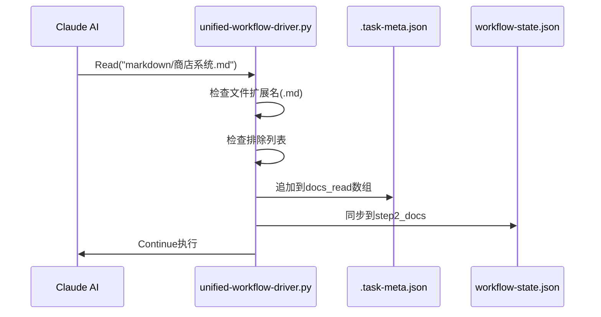
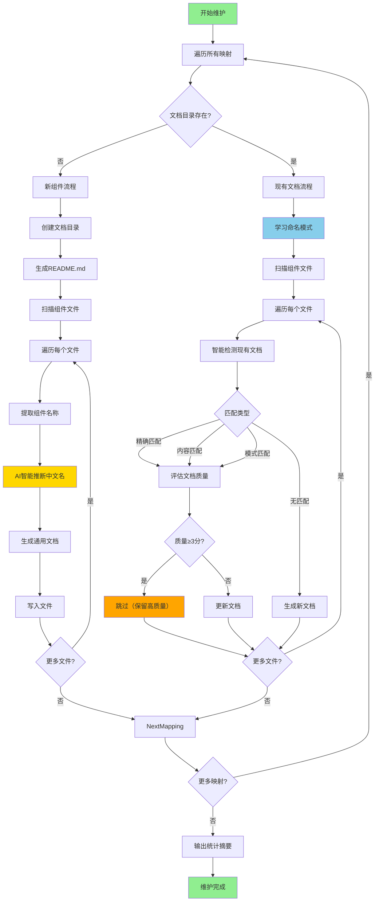
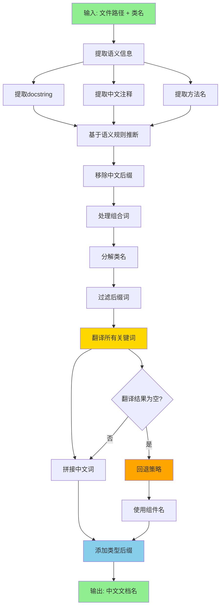
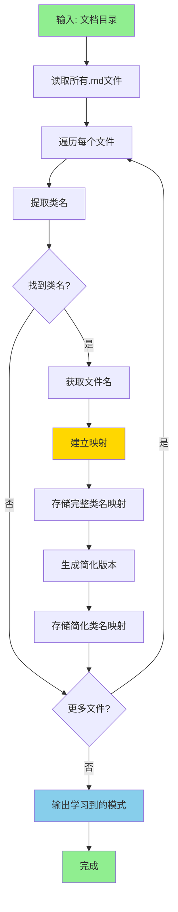
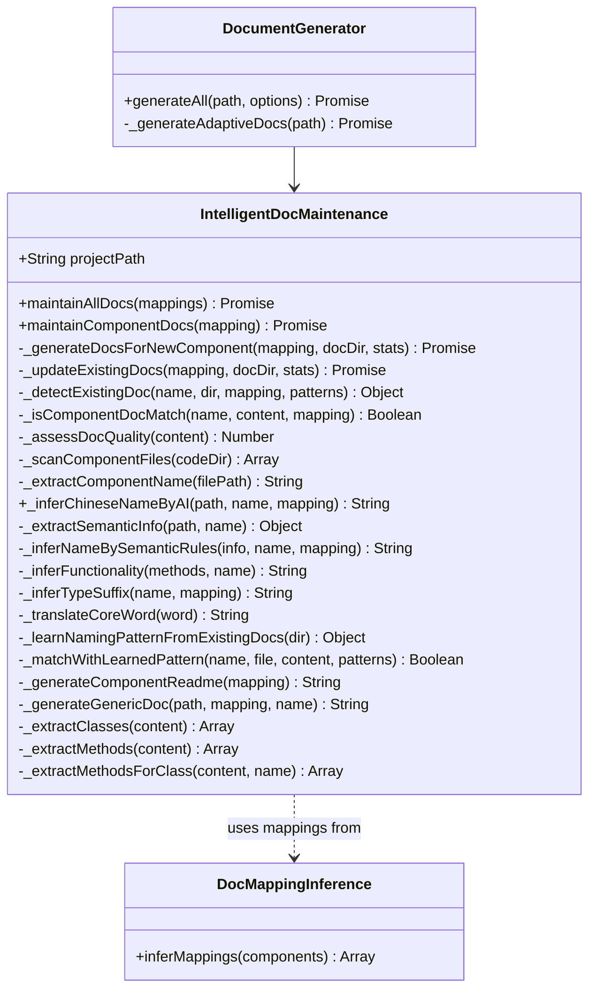

# 智能文档维护系统

> **模块路径**: `lib/intelligent-doc-maintenance.js`
> **版本**: v21.1.2
> **最后更新**: 2025-11-15

---

## 📋 系统概述

智能文档维护系统由 **两大核心机制** 组成：

### 1. 静态维护 - IntelligentDocMaintenance 模块

**模块路径**: `lib/intelligent-doc-maintenance.js`
**触发时机**: 工作流初始化时(`/mc`命令调用)
**职责**:
- **智能文档生成**: 为任意类型的组件自动生成通用文档
- **文档质量评估**: 评估现有文档质量（0-5分），避免覆盖高质量文档
- **AI智能命名**: 基于代码语义自动推断中文文档名称
- **模式学习**: 从现有文档学习命名模式，保持命名一致性
- **增量维护**: 智能检测文档缺失，只生成必要的新文档

### 2. 动态维护 - Hook驱动的文档追踪系统

**Hook路径**: `templates/.claude/hooks/core/task_meta_manager.py`
**触发时机**: PostToolUse (Read工具调用后)
**职责**:
- **文档阅读追踪**: 记录AI阅读过的markdown文档路径
- **自动补充触发**: 在步骤4收尾阶段，搜索"待补充"标记并更新
- **子代理协调**: 启动独立的文档更新子代理完成批量更新任务

---

## 🔄 双机制协同工作流

```mermaid
graph TB
    Start[工作流启动] --> Init[/mc 命令初始化]
    Init --> Static[静态维护: IntelligentDocMaintenance]

    Static --> GenDocs[生成缺失的组件文档]
    GenDocs --> Quality[评估并保留高质量文档]

    Quality --> Runtime[运行时阶段]
    Runtime --> ReadHook[Hook监听Read工具]

    ReadHook --> Track{是否为.md文件?}
    Track -->|是| Record[记录到docs_read数组]
    Track -->|否| Continue[继续]

    Record --> Step4{到达步骤4?}
    Step4 -->|是| SubAgent[启动文档更新子代理]
    Step4 -->|否| Continue

    SubAgent --> Search[搜索待补充标记]
    Search --> Update[批量更新文档]

    style Static fill:#90EE90
    style ReadHook fill:#87CEEB
    style SubAgent fill:#FFD700
```

---

## 🔍 机制一: Hook驱动的文档追踪系统

### 核心实现: update_docs_read 函数

**文件**: `templates/.claude/hooks/core/task_meta_manager.py`

```python
def update_docs_read(meta, file_path):
    """更新文档阅读记录"""
    if not file_path.endswith('.md'):
        return False

    # 排除不计入的文档
    excluded = ['README.md', 'CHANGELOG.md', '索引.md', '项目状态.md', '文档待补充清单.md']
    if any(pattern in file_path for pattern in excluded):
        return False

    docs_read = meta.get("metrics", {}).get("docs_read", [])
    if file_path not in docs_read:
        docs_read.append(file_path)
        meta["metrics"]["docs_read"] = docs_read
        meta["metrics"]["docs_read_count"] = len(docs_read)

        # 同步到step2_docs
        if "step2_docs" in meta["workflow_state"]["steps"]:
            meta["workflow_state"]["steps"]["step2_docs"]["docs_read"] = docs_read

        return True
    return False
```

### 文档追踪流程



### 步骤4触发子代理

**触发函数**: `trigger_doc_update_agent(meta, cwd)`
**行数**: 491-622

**执行流程**:
1. 构建子代理任务描述（包含已阅读文档列表）
2. 生成详细的执行步骤指令
3. 写入临时任务文件 `.claude/.agent-doc-update.txt`
4. 注入子代理调用提示到AI对话上下文

**子代理任务示例**:
```
Step 1: 搜索待补充标记
Grep("待补充|TODO", path="markdown/", output_mode="files_with_matches", -i=True)

Step 2: 分析相关性（判断是否与主任务相关）

Step 3: 执行更新
- 如果≤2个相关文档：使用Edit更新
- 如果>2个相关文档：追加到 markdown/文档待补充清单.md

Step 4: DEBUG清理检查
Grep("DEBUG|print.*debug|console.log.*test", ...)

Step 5: 标记步骤4完成（触发归档Hook）
```

---

## 🏗️ 机制二: IntelligentDocMaintenance 模块

### 类定义

#### 构造函数
```javascript
constructor(projectPath)
```
- **参数**: `projectPath` - 项目根目录路径

---

### 核心维护方法

#### maintainAllDocs(mappings) - 维护所有组件文档
```javascript
async maintainAllDocs(mappings)
```
- **参数**: `mappings` - 文档映射关系数组（来自 `DocMappingInference`）
- **返回值**: 无（控制台输出统计信息）
- **统计指标**:
  - `generatedCount` - 新生成文档数
  - `skippedCount` - 跳过的高质量文档数
  - `updatedCount` - 更新的文档数

**示例输出**:
```
[维护器] ✅ 文档维护完成：
  - 新生成: 8 个文档
  - 已跳过: 3 个高质量文档
  - 已更新: 2 个文档
```

---

#### maintainComponentDocs(mapping) - 维护单个组件文档
```javascript
async maintainComponentDocs(mapping)
```
- **参数**: `mapping` - 单个组件映射对象
  ```javascript
  {
    codeDir: 'behavior_packs/mymod/states',
    docDir: 'markdown/states',
    type: 'custom',
    subtype: 'state',
    exists: false
  }
  ```
- **返回值**: `{ generated, skipped, updated }` - 统计结果

**执行逻辑**:
1. 检查文档目录是否存在
2. 如果不存在 → 调用 `_generateDocsForNewComponent()`
3. 如果存在 → 调用 `_updateExistingDocs()`

---

### 新组件文档生成

#### _generateDocsForNewComponent(mapping, docDir, stats)
```javascript
async _generateDocsForNewComponent(mapping, docDir, stats)
```

**执行步骤**:
1. 创建文档目录
2. 生成 `README.md` 索引文件
3. 扫描组件文件 (`_scanComponentFiles`)
4. 为每个文件生成文档:
   - 提取组件名称 (`_extractComponentName`)
   - AI智能推断中文文件名 (`_inferChineseNameByAI`) ⭐
   - 生成通用文档 (`_generateGenericDoc`)
   - 写入文件

---

### 现有文档更新

#### _updateExistingDocs(mapping, docDir, stats)
```javascript
async _updateExistingDocs(mapping, docDir, stats)
```

**执行步骤**:
1. 扫描组件文件
2. 学习现有文档命名模式 (`_learnNamingPatternFromExistingDocs`) ⭐
3. 遍历每个组件文件:
   - 智能检测现有文档 (`_detectExistingDoc`)
   - 评估文档质量 (`_assessDocQuality`)
   - 如果高质量（≥3分）→ 跳过
   - 如果低质量或不存在 → 生成/更新文档

---

### 文档检测与匹配

#### _detectExistingDoc(componentName, docDir, mapping, learnedPatterns)
```javascript
_detectExistingDoc(componentName, docDir, mapping, learnedPatterns)
```
- **返回值**: `{ fileName, filePath, quality, matchType }` 或 `null`
- **匹配策略**:
  1. **精确文件名匹配**: `ShopPresetDefServer.md`
  2. **内容智能匹配**: 调用 `_isComponentDocMatch()`
  3. **模式学习匹配**: 使用 `_matchWithLearnedPattern()`

**选择逻辑**:
- 如果有多个候选，按质量降序排序
- 质量相同时，内容匹配 > 精确匹配（因为内容匹配可能是更详细的中文文档）

---

#### _isComponentDocMatch(componentName, content, mapping)
```javascript
_isComponentDocMatch(componentName, content, mapping)
```
- **返回值**: `Boolean` - 是否匹配
- **匹配策略**:
  1. 标题包含组件名: `^#\s+.*${componentName}`
  2. 类定义引用: `class\s+${componentName}`
  3. 去掉后缀的关键词匹配:
     ```javascript
     // 示例: ShopPresetDefServer → Shop
     const coreNamePatterns = [
       componentName.replace(/(Def)?(Server|Client)$/i, ''),
       componentName.replace(/(Preset|System|Manager|Handler)(Def)?(Server|Client)?$/i, ''),
       componentName.replace(/System$/i, '')
     ];
     ```

---

### 文档质量评估

#### _assessDocQuality(content)
```javascript
_assessDocQuality(content)
```
- **返回值**: `Number` - 质量评分（0-5分）
- **评分标准**:
  | 因素 | 检测正则 | 得分 |
  |------|---------|------|
  | 有代码块 | `/```/` | +1 |
  | 有图表 | `/mermaid\|graph\|flowchart\|```diagram/` | +1 |
  | 有示例 | `/示例\|Example\|案例\|使用方法\|Usage/` | +1 |
  | 内容丰富 | `content.length > 500` | +1 |
  | 非待补充模板 | `!/⚠️\s*\*\*待补充\*\*/` | +1 |

**应用场景**:
```javascript
if (existingDoc && existingDoc.quality >= 3) {
  // 保留高质量文档
  console.log(`✓ 保留高质量文档: ${existingDoc.fileName} (${existingDoc.quality}/5)`);
  continue;
}
```

---

## ⭐ AI智能命名系统

### 核心方法

#### _inferChineseNameByAI(filePath, componentName, mapping)
```javascript
_inferChineseNameByAI(filePath, componentName, mapping)
```
- **参数**:
  - `filePath` - Python文件路径
  - `componentName` - 类名（如 `ShopServerSystem`）
  - `mapping` - 组件映射信息
- **返回值**: 中文文档名（如 `"商店系统.md"`）

**执行流程**:
1. 提取语义信息 (`_extractSemanticInfo`)
2. 基于语义规则推断名称 (`_inferNameBySemanticRules`)

---

### 语义信息提取

#### _extractSemanticInfo(filePath, className)
```javascript
_extractSemanticInfo(filePath, className)
```
- **返回值**: 语义信息对象
  ```javascript
  {
    className: 'ShopServerSystem',
    docstring: '商店系统，处理商品购买和出售',  // 类的docstring
    comments: ['处理金币交易', '管理商店UI'],    // 中文注释
    methodNames: ['buyItem', 'sellItem', 'openShop'],  // 公开方法名
    fileContent: '...'  // 完整文件内容
  }
  ```

**提取规则**:
1. **Docstring提取**:
   ```javascript
   const classDocPattern = new RegExp(
     `class\\s+${className}[^:]*:\\s*[\\r\\n]+\\s*"""([\\s\\S]*?)"""`,
     'm'
   );
   ```

2. **注释提取**:
   ```javascript
   const commentPattern = /#\s*(.+)/g;
   // 只保留包含中文或长度>5的注释
   if (/[\u4e00-\u9fa5]/.test(comment) || comment.length > 5) {
     info.comments.push(comment);
   }
   ```

3. **方法名提取**:
   ```javascript
   const methodPattern = /def\s+([a-zA-Z_][a-zA-Z0-9_]*)\s*\(/g;
   // 只取公开方法（不以_开头）
   if (!methodMatch[1].startsWith('_')) {
     info.methodNames.push(methodMatch[1]);
   }
   ```

---

### 语义规则推断

#### _inferNameBySemanticRules(info, componentName, mapping)
```javascript
_inferNameBySemanticRules(info, componentName, mapping)
```

**推断策略**（按优先级）:

**策略1和2已禁用** ⚠️
- **原因**: 提取开发者注释容易导致混乱命名
- **示例**: 注释"标记地图恢复是否已开始" → 不适合作为文档名

**策略3（当前主要策略）**: 完整翻译类名关键词

**步骤1: 移除已存在的中文后缀**
```javascript
let baseName = componentName.replace(/(系统|状态|预设|管理器|处理器|控制器)$/,'');
```

**步骤2: 处理组合词**
```javascript
const combinedWords = {
  'BedWars': '起床战争',
  'IronGolem': '铁傀儡',
  'ServerForm': '服务端表单',
  'ClientForm': '客户端表单'
};
```

**步骤3: 分解类名（驼峰命名 → 单词数组）**
```javascript
// ShopServerSystem → ['Shop', 'Server', 'System']
const classWords = processedName
  .replace(/([A-Z])/g, ' $1')
  .trim()
  .split(/\s+/)
  .filter(w => !['Server', 'Client', 'Def', 'System', 'Preset', 'Manager'].includes(w));
```

**步骤4: 翻译所有关键词**
```javascript
const translatedWords = classWords
  .map(word => this._translateCoreWord(word))
  .filter(w => w && w !== '');

// ['Shop'] → ['商店']
const chineseName = translatedWords.join('');
// '商店'
```

**步骤5: 添加类型后缀**
```javascript
const typeSuffix = this._inferTypeSuffix(baseName, mapping);
// '系统'

return `${chineseName}${typeSuffix}`;
// '商店系统'
```

**策略4（回退）**: 使用组件名 + 类型后缀

---

### 核心词翻译字典

#### _translateCoreWord(coreWord)
```javascript
_translateCoreWord(coreWord)
```

**字典规模**: 60+ 关键词

**分类示例**:

**游戏核心**:
```javascript
{
  Shop: '商店', Team: '队伍', Game: '游戏', Player: '玩家',
  Spawn: '生成', Trap: '陷阱', Upgrade: '升级', Bed: '床位'
}
```

**物品相关**:
```javascript
{
  Item: '物品', Weapon: '武器', Armor: '护甲', Tool: '工具'
}
```

**战斗相关**:
```javascript
{
  Skill: '技能', Buff: '增益', Damage: '伤害', Attack: '攻击'
}
```

**UI相关**:
```javascript
{
  Chat: '聊天', Menu: '菜单', Button: '按钮', Panel: '面板'
}
```

**游戏状态**:
```javascript
{
  State: '状态', Phase: '阶段', Round: '回合', Lobby: '大厅'
}
```

**起床战争特定**:
```javascript
{
  BedWars: '起床战争', Iron: '铁', Gold: '金', Diamond: '钻石'
}
```

---

### 类型后缀推断

#### _inferTypeSuffix(className, mapping)
```javascript
_inferTypeSuffix(className, mapping)
```

**推断规则**:
1. **基于类名后缀**:
   ```javascript
   if (/System$/i.test(className)) return '系统';
   if (/Manager$/i.test(className)) return '管理器';
   if (/Handler$/i.test(className)) return '处理器';
   if (/Preset$/i.test(className)) return '预设';
   if (/State$/i.test(className)) return '状态';
   ```

2. **基于mapping类型**:
   ```javascript
   const type = mapping.subtype || mapping.type;
   if (type === 'system') return '系统';
   if (type === 'preset') return '预设';
   ```

---

### 命名模式学习

#### _learnNamingPatternFromExistingDocs(docDir)
```javascript
_learnNamingPatternFromExistingDocs(docDir)
```
- **功能**: 从现有文档中学习类名→中文名的映射关系
- **返回值**: `{ [className]: chineseName }` 映射对象

**学习逻辑**:
1. 读取所有 `.md` 文件
2. 提取文档中的类名（通过正则 `class\s+(\w+)\s*\(`）
3. 建立映射: `{ 'ShopServerSystem': '商店系统' }`
4. 同时记录简化版本: `{ 'Shop': '商店系统' }`

**应用场景**:
```javascript
const learnedPatterns = this._learnNamingPatternFromExistingDocs(docDir);
// { 'ShopServerSystem': '商店系统', 'Shop': '商店系统' }

// 后续文档生成时，优先使用学习到的模式
if (learnedPatterns[componentName]) {
  return learnedPatterns[componentName] + '.md';
}
```

**控制台输出**:
```
[文档学习] 学习到 12 个命名模式
```

---

## 💡 实战案例

### 案例1: 完整工作流演示（双机制协同）

**场景**: 用户提交BUG修复任务，系统自动维护文档

#### 阶段1: 工作流初始化（静态维护）

```bash
用户输入: /mc 修复商店购买物品后金币未扣除的问题
```

**系统执行**:
```javascript
// 1. DocumentGenerator 调用 IntelligentDocMaintenance
const maintenance = new IntelligentDocMaintenance(projectPath);
const mappings = [
  {
    codeDir: 'behavior_packs/bedwars/systems',
    docDir: 'markdown/systems',
    type: 'custom',
    subtype: 'system',
    exists: true
  }
];

await maintenance.maintainAllDocs(mappings);
```

**输出**:
```
[维护器] 🔍 检查已有文档: systems
   [文档学习] 学习到 12 个命名模式
   ✓ 保留高质量文档: 商店系统.md (4/5)
   ✓ 保留高质量文档: 队伍系统.md (5/5)
   ✓ 更新文档: 金币管理.md (质量: 2/5)

[维护器] ✅ 文档维护完成：
  - 新生成: 0 个文档
  - 已跳过: 2 个高质量文档
  - 已更新: 1 个文档
```

#### 阶段2: 运行时追踪（动态监听）

**AI执行任务**:
```python
# AI读取相关文档
Read("markdown/systems/商店系统.md")
Read("markdown/systems/金币管理.md")
Read("markdown/开发规范.md")
```

**Hook自动记录**:
```python
# unified-workflow-driver.py 自动执行
update_docs_read(meta, "markdown/systems/商店系统.md")  # ✅ 已记录
update_docs_read(meta, "markdown/systems/金币管理.md")  # ✅ 已记录
update_docs_read(meta, "markdown/开发规范.md")         # ❌ 跳过（排除列表）
```

**状态更新**:
```json
{
  "metrics": {
    "docs_read": [
      "markdown/systems/商店系统.md",
      "markdown/systems/金币管理.md"
    ],
    "docs_read_count": 2
  }
}
```

#### 阶段3: 步骤4收尾（子代理触发）

**系统检测**:
```python
if next_step == "step4_cleanup":
    agent_message = trigger_doc_update_agent(meta, cwd)
```

**子代理任务文件** (`.claude/.agent-doc-update.txt`):
```
🤖 子代理任务：自动文档更新与收尾工作

**任务上下文**:
- 主任务: 修复商店购买物品后金币未扣除的问题
- 已阅读文档: 2个
- 代码修改: 3处

**你的职责**:
1. 搜索 markdown/ 目录下所有包含"待补充"或"TODO"标记的文档
2. 分析标记的上下文，判断是否与本次任务相关
3. 如果相关文档≤2个，使用Edit工具更新这些文档的内容
4. 如果相关文档>2个，将列表追加到 markdown/文档待补充清单.md
```

**子代理执行**:
```bash
Step 1: Grep("待补充|TODO", path="markdown/", -i=True)
# 发现3个待补充文档：
# - markdown/systems/金币管理.md (相关)
# - markdown/systems/交易系统.md (不相关)
# - markdown/states/游戏状态.md (不相关)

Step 2: 分析相关性
# 只有 "金币管理.md" 与本次BUG修复相关

Step 3: 更新文档
Edit("markdown/systems/金币管理.md",
  old_string="⚠️ **待补充**: 请补充扣除逻辑说明",
  new_string="""
## 金币扣除逻辑

在 `buyItem()` 方法中，系统会：
1. 检查玩家金币余额
2. 扣除对应金币数量
3. 触发购买成功事件

**关键实现**:
```python
player.money -= item.price
self._trigger_purchase_event(player, item)
```
""")

Step 4: 标记完成
# 更新 .task-meta.json 中的 step4_cleanup.status = "completed"
```

**最终输出**:
```
==============================================
Cleanup Work Completion Report
==============================================

Docs updated: markdown/systems/金币管理.md
DEBUG cleanup: 0 found
Task archive: tasks/task-1114-153045-修复商店BUG/
  - context.md: OK
  - solution.md: OK
Step4 marked: COMPLETED (archive hook will trigger)
==============================================
```

---

### 案例2: AI智能命名演示

**场景**: 测试AI命名系统对不同组件的智能推断

```javascript
const maintenance = new IntelligentDocMaintenance(projectPath);

// 测试用例
const testCases = [
  { file: 'ShopServerSystem.py', name: 'ShopServerSystem' },
  { file: 'BedWarsGameState.py', name: 'BedWarsGameState' },
  { file: 'IronGolemSpawnHandler.py', name: 'IronGolemSpawnHandler' }
];

for (const test of testCases) {
  const chineseName = maintenance._inferChineseNameByAI(
    `behavior_packs/mymod/${test.file}`,
    test.name,
    { type: 'custom', subtype: 'system' }
  );
  console.log(`${test.name} → ${chineseName}`);
}
```

**输出**:
```
[AI命名] 类名分析: Shop → 商店
ShopServerSystem → 商店系统.md

[AI命名] 类名分析: Bed + Wars + Game → 起床战争游戏
BedWarsGameState → 起床战争游戏状态.md

[AI命名] 类名分析: Iron + Golem + Spawn → 铁傀儡生成
IronGolemSpawnHandler → 铁傀儡生成处理器.md
```

---

### 案例3: 文档质量评估机制

**场景**: 判断文档是否应该被更新

```javascript
const maintenance = new IntelligentDocMaintenance(projectPath);

const docContent = readFile('markdown/systems/商店系统.md');
const quality = maintenance._assessDocQuality(docContent);

console.log(`文档质量: ${quality}/5分`);

if (quality >= 3) {
  console.log('✅ 高质量文档，保留');
} else {
  console.log('⚠️ 低质量文档，建议重新生成');
}
```

**评分标准**:
- ✅ 有代码块 (`\`\`\``) → +1分
- ✅ 有图表 (mermaid/flowchart) → +1分
- ✅ 有示例 (示例/Example/使用方法) → +1分
- ✅ 内容丰富 (>500字符) → +1分
- ✅ 非待补充模板 → +1分

---

## 📊 工作流程图

### 完整维护流程



### AI智能命名流程



### 命名模式学习流程



---

## 🔗 类关系图



---

## ⚙️ 配置与常量

### 文件扫描配置
```javascript
// 扫描范围
const fileExtension = '.py';
const excludeFiles = ['__init__.py'];
const maxDepth = 1; // 递归扫描深度（仅一层）
```

### 质量评估阈值
```javascript
const QUALITY_THRESHOLD = {
  HIGH: 3,  // ≥3分: 高质量，保留
  LOW: 2    // <3分: 低质量，可覆盖
};
```

### 注释过滤规则
```javascript
// 保留的注释条件
const shouldKeepComment = (comment) => {
  return /[\u4e00-\u9fa5]/.test(comment) || comment.length > 5;
};
```

---

## 🎯 最佳实践

1. **命名一致性**: 使用 `_learnNamingPatternFromExistingDocs` 学习现有模式
2. **质量保护**: 始终检查文档质量，避免覆盖高质量文档
3. **语义提取**: 鼓励开发者编写有意义的docstring和注释
4. **字典扩展**: 根据项目特点扩展 `_translateCoreWord` 字典
5. **回退机制**: 确保AI命名失败时有合理的回退方案

---

## 📚 依赖模块

- `fs` - 文件系统操作
- `path` - 路径处理
- `./utils` - 工具函数（ensureDir, readFile, writeFile）
- `./config` - 配置常量（getCurrentDate）

---

## 🔑 双机制对比总结

| 维度 | 静态维护（IntelligentDocMaintenance） | 动态维护（Hook驱动） |
|------|-------------------------------------|---------------------|
| **触发时机** | 工作流初始化（`/mc`命令） | 运行时（PostToolUse Hook） |
| **作用对象** | 组件文档（.py → .md） | 任务相关文档（待补充标记） |
| **维护策略** | 批量生成缺失文档 | 增量更新相关文档 |
| **智能程度** | AI命名 + 质量评估 + 模式学习 | 任务相关性判断 + 子代理自主决策 |
| **执行主体** | Node.js同步执行 | Python Hook + 子代理 |
| **典型场景** | 新项目首次部署、新增组件类型 | 任务执行中补充文档细节 |
| **数据来源** | 代码结构分析 | 会话历史 + AI阅读记录 |
| **更新范围** | 所有组件文档 | ≤2个相关文档（或生成清单） |

---

## 🎯 最佳实践

### 静态维护最佳实践

1. **命名一致性**: 使用 `_learnNamingPatternFromExistingDocs` 学习现有模式
2. **质量保护**: 始终检查文档质量，避免覆盖高质量文档
3. **语义提取**: 鼓励开发者编写有意义的docstring和注释
4. **字典扩展**: 根据项目特点扩展 `_translateCoreWord` 字典
5. **回退机制**: 确保AI命名失败时有合理的回退方案

### 动态维护最佳实践

1. **精准排除**: 在 `update_docs_read` 中排除不应追踪的文档（README、CHANGELOG等）
2. **子代理职责清晰**: 明确区分主任务和子代理任务，避免上下文污染
3. **相关性判断**: 子代理需准确判断"待补充"标记与主任务的相关性
4. **批量处理策略**: >2个待补充文档时，生成清单而非全部更新（避免过度自动化）
5. **状态同步**: 确保 task-meta.json、workflow-state.json、.task-active.json 三文件同步

---

## 🔄 版本历史

- **v2.0** (2025-11-14): 双机制协同架构，Hook驱动的动态维护
- **v1.0**: 基础文档维护功能（仅静态维护）

---

## 📚 相关文档

- [文档生成器.md](./文档生成器.md) - DocumentGenerator调用IntelligentDocMaintenance的完整流程
- [Hook机制.md](./Hook机制.md) - unified-workflow-driver.py的Hook系统架构
- [项目分析器.md](./项目分析器.md) - 组件发现与映射推断
- [数据流设计.md](./数据流设计.md) - 状态机与三文件同步机制

---

**文档元数据**:
- 作者: MODSDK工作流团队
- 最后更新: 2025-11-14
- 文档类型: 系统架构 + API参考
