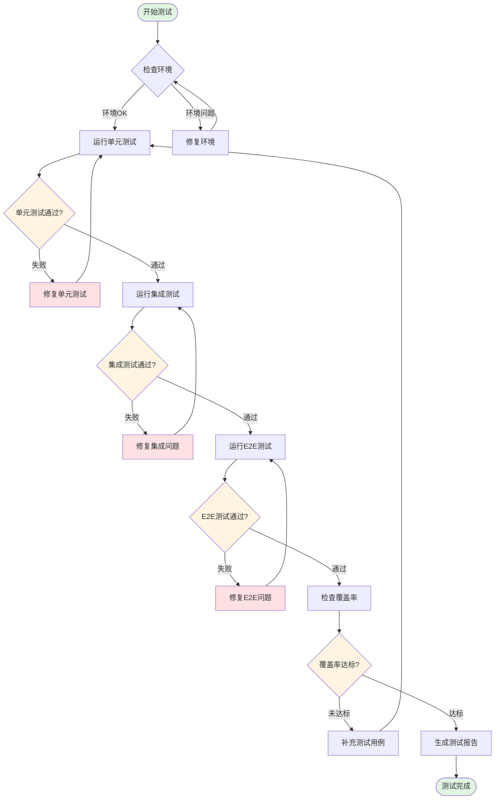
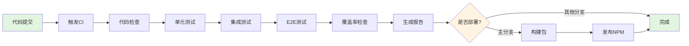

# NeteaseMod-Claude 测试指南

> **版本**: v1.0.0
> **最后更新**: 2025-11-13
> **适用版本**: v18.4.0+

---

## 📋 目录

1. [测试策略概述](#测试策略概述)
2. [测试环境搭建](#测试环境搭建)
3. [单元测试](#单元测试)
4. [集成测试](#集成测试)
5. [端到端测试](#端到端测试)
6. [测试用例设计](#测试用例设计)
7. [测试覆盖率要求](#测试覆盖率要求)
8. [测试流程图](#测试流程图)
9. [常见测试场景](#常见测试场景)
10. [调试技巧](#调试技巧)
11. [持续集成](#持续集成)

---

## 测试策略概述

### 测试金字塔

本项目采用标准的测试金字塔策略：

```
         /\
        /  \  E2E测试 (10%)
       /    \  - 完整工作流测试
      /------\
     /        \ 集成测试 (30%)
    /          \ - 模块间协作测试
   /------------\
  /              \ 单元测试 (60%)
 /                \ - 核心函数测试
/------------------\
```

### 测试分层

| 测试层级 | 占比 | 执行速度 | 覆盖范围 | 维护成本 |
|---------|------|---------|---------|---------|
| 单元测试 | 60% | 快速 (<1s) | 单个函数/方法 | 低 |
| 集成测试 | 30% | 中等 (1-5s) | 模块间交互 | 中 |
| 端到端测试 | 10% | 慢 (5-30s) | 完整用户流程 | 高 |

### 核心测试目标

1. **功能正确性**: 确保所有功能按预期工作
2. **向后兼容性**: 保证版本升级不破坏现有项目
3. **性能要求**: 关键操作在合理时间内完成
4. **错误处理**: 优雅处理异常情况
5. **文档一致性**: 生成的文档符合规范

---

## 测试环境搭建

### 环境要求

```json
{
  "node": ">=12.0.0",
  "npm": ">=6.0.0",
  "os": ["Windows", "Linux", "macOS"]
}
```

### 安装测试依赖

```bash
# 安装核心依赖
npm install

# 安装测试框架和工具
npm install --save-dev jest
npm install --save-dev @jest/globals
npm install --save-dev jest-environment-node

# 安装代码覆盖率工具
npm install --save-dev nyc

# 安装Linter和格式化工具
npm install --save-dev eslint
npm install --save-dev prettier
```

### 配置 Jest

创建 `jest.config.js`:

```javascript
module.exports = {
  testEnvironment: 'node',
  coverageDirectory: 'coverage',
  collectCoverageFrom: [
    'lib/**/*.js',
    'scripts/**/*.js',
    'bin/**/*.js',
    '!**/node_modules/**',
    '!**/templates/**'
  ],
  coverageThreshold: {
    global: {
      branches: 70,
      functions: 75,
      lines: 80,
      statements: 80
    }
  },
  testMatch: [
    '**/tests/**/*.test.js',
    '**/tests/**/*.spec.js'
  ],
  testTimeout: 30000,
  verbose: true
};
```

### 配置 package.json 测试脚本

```json
{
  "scripts": {
    "test": "jest",
    "test:unit": "jest tests/unit",
    "test:integration": "jest tests/integration",
    "test:e2e": "jest tests/e2e",
    "test:watch": "jest --watch",
    "test:coverage": "jest --coverage",
    "test:ci": "jest --ci --coverage --maxWorkers=2"
  }
}
```

### 创建测试目录结构

```bash
tests/
├── unit/                    # 单元测试
│   ├── analyzer.test.js
│   ├── generator.test.js
│   ├── config.test.js
│   └── utils.test.js
├── integration/             # 集成测试
│   ├── workflow.test.js
│   ├── version-checker.test.js
│   └── symlink-manager.test.js
├── e2e/                     # 端到端测试
│   ├── initmc.test.js
│   └── full-workflow.test.js
├── fixtures/                # 测试数据
│   ├── sample-project/
│   └── expected-output/
└── helpers/                 # 测试辅助工具
    ├── mock-fs.js
    └── test-utils.js
```

---

## 单元测试

### 测试核心函数

#### 示例: 测试 ProjectAnalyzer

创建 `tests/unit/analyzer.test.js`:

```javascript
const { ProjectAnalyzer } = require('../../lib/analyzer');
const path = require('path');
const fs = require('fs-extra');

describe('ProjectAnalyzer', () => {
  let testProjectPath;

  beforeEach(() => {
    // 创建临时测试项目
    testProjectPath = path.join(__dirname, '../fixtures/test-project');
    fs.ensureDirSync(testProjectPath);

    // 创建测试文件
    fs.writeFileSync(
      path.join(testProjectPath, 'modMain.py'),
      'class MyServerSystem: pass'
    );
  });

  afterEach(() => {
    // 清理测试文件
    fs.removeSync(testProjectPath);
  });

  test('应该正确识别项目类型', () => {
    const analyzer = new ProjectAnalyzer(testProjectPath);
    const report = analyzer.analyze();

    expect(report.metadata.projectName).toBeDefined();
    expect(report.metadata.businessType).toBeDefined();
  });

  test('应该检测System文件', () => {
    // 创建System文件
    const systemPath = path.join(testProjectPath, 'server', 'ShopSystem.py');
    fs.ensureDirSync(path.dirname(systemPath));
    fs.writeFileSync(systemPath, `
class ShopServerSystem:
    def __init__(self):
        self.Create()

    def Create(self):
        pass
`);

    const analyzer = new ProjectAnalyzer(testProjectPath);
    const report = analyzer.analyze();

    expect(report.codeStructure.systems).toBeDefined();
    expect(Object.keys(report.codeStructure.systems).length).toBeGreaterThan(0);
  });

  test('应该正确计算复杂度评分', () => {
    const systemPath = path.join(testProjectPath, 'server', 'ComplexSystem.py');
    fs.ensureDirSync(path.dirname(systemPath));

    // 创建一个复杂的System
    const complexCode = Array(50).fill('def method(): pass').join('\n');
    fs.writeFileSync(systemPath, `
class ComplexSystem:
    ${complexCode}
`);

    const analyzer = new ProjectAnalyzer(testProjectPath);
    const report = analyzer.analyze();

    const systemInfo = report.codeStructure.systems['ComplexSystem'];
    expect(systemInfo.complexityScore).toBeGreaterThan(5);
  });
});
```

#### 示例: 测试 DocumentGenerator

创建 `tests/unit/generator.test.js`:

```javascript
const { DocumentGenerator } = require('../../lib/generator');
const path = require('path');
const fs = require('fs-extra');

describe('DocumentGenerator', () => {
  let generator;
  let mockReport;
  let testOutputPath;

  beforeEach(() => {
    testOutputPath = path.join(__dirname, '../fixtures/output');
    fs.ensureDirSync(testOutputPath);

    // 模拟分析报告
    mockReport = {
      metadata: {
        projectName: 'TestProject',
        businessType: 'RPG',
        usesApollo: false,
        usesEcpreset: false
      },
      codeStructure: {
        systems: {
          'TestSystem': {
            type: 'ServerSystem',
            filePath: '/test/TestSystem.py',
            linesOfCode: 100,
            complexityScore: 5,
            getDetailLevel: () => 'medium',
            content: 'class TestSystem: pass'
          }
        }
      }
    };

    generator = new DocumentGenerator(mockReport, process.cwd());
  });

  afterEach(() => {
    fs.removeSync(testOutputPath);
  });

  test('应该生成目录结构', async () => {
    await generator.generateAll(testOutputPath, { minimalMode: true });

    expect(fs.existsSync(path.join(testOutputPath, '.claude/commands'))).toBe(true);
    expect(fs.existsSync(path.join(testOutputPath, 'markdown'))).toBe(true);
    expect(fs.existsSync(path.join(testOutputPath, 'tasks'))).toBe(true);
  });

  test('应该生成命令文件', async () => {
    await generator.generateAll(testOutputPath, { minimalMode: true });

    const mcCommand = path.join(testOutputPath, '.claude/commands/mc.md');
    expect(fs.existsSync(mcCommand)).toBe(true);

    const content = fs.readFileSync(mcCommand, 'utf-8');
    expect(content.length).toBeGreaterThan(1000);
    expect(content).toContain('TestProject');
  });

  test('应该正确替换占位符', async () => {
    await generator.generateAll(testOutputPath, { minimalMode: true });

    const readmePath = path.join(testOutputPath, 'README.md');
    if (fs.existsSync(readmePath)) {
      const content = fs.readFileSync(readmePath, 'utf-8');
      expect(content).not.toContain('{{PROJECT_NAME}}');
      expect(content).toContain('TestProject');
    }
  });
});
```

#### 示例: 测试工具函数

创建 `tests/unit/utils.test.js`:

```javascript
const {
  replacePlaceholders,
  normalizePathForMarkdown
} = require('../../lib/utils');

describe('Utils', () => {
  describe('replacePlaceholders', () => {
    test('应该替换所有占位符', () => {
      const template = 'Hello {{NAME}}, version {{VERSION}}';
      const replacements = {
        '{{NAME}}': 'World',
        '{{VERSION}}': '1.0.0'
      };

      const result = replacePlaceholders(template, replacements);
      expect(result).toBe('Hello World, version 1.0.0');
    });

    test('应该处理未找到的占位符', () => {
      const template = 'Hello {{NAME}}, {{MISSING}}';
      const replacements = {
        '{{NAME}}': 'World'
      };

      const result = replacePlaceholders(template, replacements);
      expect(result).toContain('{{MISSING}}');
    });
  });

  describe('normalizePathForMarkdown', () => {
    test('应该将反斜杠转换为正斜杠', () => {
      const windowsPath = 'C:\\Users\\Test\\Project';
      const result = normalizePathForMarkdown(windowsPath);

      expect(result).toBe('C:/Users/Test/Project');
      expect(result).not.toContain('\\');
    });

    test('应该保持Unix路径不变', () => {
      const unixPath = '/home/user/project';
      const result = normalizePathForMarkdown(unixPath);

      expect(result).toBe('/home/user/project');
    });
  });
});
```

---

## 集成测试

### 测试模块间协作

#### 示例: 测试工作流完整流程

创建 `tests/integration/workflow.test.js`:

```javascript
const { ProjectAnalyzer } = require('../../lib/analyzer');
const { DocumentGenerator } = require('../../lib/generator');
const path = require('path');
const fs = require('fs-extra');

describe('Workflow Integration', () => {
  let testProjectPath;

  beforeEach(() => {
    testProjectPath = path.join(__dirname, '../fixtures/integration-test');
    fs.ensureDirSync(testProjectPath);

    // 创建模拟MODSDK项目结构
    fs.writeFileSync(
      path.join(testProjectPath, 'modMain.py'),
      'def main(): pass'
    );

    const serverDir = path.join(testProjectPath, 'server');
    fs.ensureDirSync(serverDir);
    fs.writeFileSync(
      path.join(serverDir, 'ShopSystem.py'),
      `
class ShopServerSystem:
    def __init__(self):
        self.Create()

    def OnPlayerBuy(self, item):
        pass
`
    );
  });

  afterEach(() => {
    fs.removeSync(testProjectPath);
  });

  test('应该完成从分析到生成的完整流程', async () => {
    // 步骤1: 分析项目
    const analyzer = new ProjectAnalyzer(testProjectPath);
    const report = analyzer.analyze();

    expect(report.metadata).toBeDefined();
    expect(report.codeStructure.systems).toBeDefined();

    // 步骤2: 生成文档
    const generator = new DocumentGenerator(report, process.cwd());
    await generator.generateAll(testProjectPath, { minimalMode: true });

    // 验证生成的文件
    expect(fs.existsSync(path.join(testProjectPath, '.claude/commands/mc.md'))).toBe(true);
    expect(fs.existsSync(path.join(testProjectPath, 'tasks/README.md'))).toBe(true);
  });

  test('应该正确处理不同项目类型', async () => {
    // 测试RPG项目
    const rpgPath = path.join(testProjectPath, 'rpg-test');
    fs.ensureDirSync(rpgPath);
    fs.writeFileSync(path.join(rpgPath, 'modMain.py'), '');

    // 创建RPG特征文件
    const newrpgDir = path.join(rpgPath, 'NEWRPG');
    fs.ensureDirSync(newrpgDir);
    fs.writeFileSync(path.join(newrpgDir, 'item.py'), 'class Item: pass');

    const analyzer = new ProjectAnalyzer(rpgPath);
    const report = analyzer.analyze();

    expect(report.metadata.businessType).toBe('RPG');

    // 清理
    fs.removeSync(rpgPath);
  });
});
```

#### 示例: 测试版本检查和升级

创建 `tests/integration/version-checker.test.js`:

```javascript
const { VersionChecker } = require('../../lib/version-checker');
const path = require('path');
const fs = require('fs-extra');

describe('VersionChecker Integration', () => {
  let upstreamPath;
  let projectPath;

  beforeEach(() => {
    upstreamPath = path.join(__dirname, '../fixtures/upstream');
    projectPath = path.join(__dirname, '../fixtures/project');

    fs.ensureDirSync(upstreamPath);
    fs.ensureDirSync(projectPath);

    // 创建上游版本文件
    fs.writeJsonSync(path.join(upstreamPath, 'package.json'), {
      version: '18.4.0'
    });

    // 创建项目manifest
    fs.ensureDirSync(path.join(projectPath, '.claude'));
    fs.writeJsonSync(path.join(projectPath, '.claude/workflow-manifest.json'), {
      version: '18.3.0'
    });
  });

  afterEach(() => {
    fs.removeSync(upstreamPath);
    fs.removeSync(projectPath);
  });

  test('应该检测到版本差异', () => {
    const checker = new VersionChecker(upstreamPath, projectPath);
    const check = checker.checkVersion();

    expect(check.needsUpdate).toBe(true);
    expect(check.local).toBe('18.3.0');
    expect(check.upstream).toBe('18.4.0');
  });

  test('应该生成变更日志', () => {
    const checker = new VersionChecker(upstreamPath, projectPath);
    const check = checker.checkVersion();

    expect(check.changelog).toBeDefined();
    expect(check.changelog.length).toBeGreaterThan(0);
  });
});
```

---

## 端到端测试

### 完整用户流程测试

#### 示例: 测试 initmc 命令

创建 `tests/e2e/initmc.test.js`:

```javascript
const { exec } = require('child_process');
const { promisify } = require('util');
const path = require('path');
const fs = require('fs-extra');

const execAsync = promisify(exec);

describe('initmc E2E Test', () => {
  let testProjectPath;
  let originalCwd;

  beforeEach(() => {
    originalCwd = process.cwd();
    testProjectPath = path.join(__dirname, '../fixtures/e2e-project');

    // 创建完整的MODSDK项目结构
    fs.ensureDirSync(testProjectPath);
    fs.writeFileSync(path.join(testProjectPath, 'modMain.py'), `
# -*- coding: utf-8 -*-
def main():
    pass
`);

    // 创建server和client目录
    fs.ensureDirSync(path.join(testProjectPath, 'server'));
    fs.ensureDirSync(path.join(testProjectPath, 'client'));
  });

  afterEach(() => {
    process.chdir(originalCwd);
    fs.removeSync(testProjectPath);
  });

  test('应该成功部署工作流', async () => {
    process.chdir(testProjectPath);

    // 执行initmc命令
    try {
      const { stdout, stderr } = await execAsync('node ../../bin/initmc.js');

      // 验证输出
      expect(stdout).toContain('核心工作流部署完成');

      // 验证生成的文件
      expect(fs.existsSync(path.join(testProjectPath, '.claude/commands/mc.md'))).toBe(true);
      expect(fs.existsSync(path.join(testProjectPath, '.claude/commands/mc-review.md'))).toBe(true);
      expect(fs.existsSync(path.join(testProjectPath, '.claude/settings.json'))).toBe(true);
      expect(fs.existsSync(path.join(testProjectPath, '.claude/hooks'))).toBe(true);

    } catch (error) {
      console.error('执行失败:', error);
      throw error;
    }
  }, 60000); // 增加超时时间

  test('应该正确处理已存在的工作流', async () => {
    process.chdir(testProjectPath);

    // 首次部署
    await execAsync('node ../../bin/initmc.js');

    // 再次部署（应该升级）
    const { stdout } = await execAsync('node ../../bin/initmc.js');

    expect(stdout).toContain('检测到新版本') || expect(stdout).toContain('已是最新版本');
  }, 60000);
});
```

#### 示例: 测试完整开发工作流

创建 `tests/e2e/full-workflow.test.js`:

```javascript
const { exec } = require('child_process');
const { promisify } = require('util');
const path = require('path');
const fs = require('fs-extra');

const execAsync = promisify(exec);

describe('Full Development Workflow E2E', () => {
  let testProjectPath;

  beforeEach(async () => {
    testProjectPath = path.join(__dirname, '../fixtures/workflow-test');
    fs.ensureDirSync(testProjectPath);

    // 创建完整项目
    fs.writeFileSync(path.join(testProjectPath, 'modMain.py'), 'def main(): pass');

    // 部署工作流
    process.chdir(testProjectPath);
    await execAsync('node ../../bin/initmc.js');
  });

  afterEach(() => {
    fs.removeSync(testProjectPath);
  });

  test('工作流生命周期测试', async () => {
    // 1. 验证初始部署
    expect(fs.existsSync(path.join(testProjectPath, '.claude/workflow-manifest.json'))).toBe(true);

    // 2. 读取manifest
    const manifest = fs.readJsonSync(path.join(testProjectPath, '.claude/workflow-manifest.json'));
    expect(manifest.version).toBeDefined();

    // 3. 创建一些代码文件
    const systemPath = path.join(testProjectPath, 'server', 'TestSystem.py');
    fs.ensureDirSync(path.dirname(systemPath));
    fs.writeFileSync(systemPath, `
class TestServerSystem:
    def __init__(self):
        self.Create()
`);

    // 4. 验证文档结构
    const docsDir = path.join(testProjectPath, 'markdown');
    expect(fs.existsSync(docsDir)).toBe(true);

    // 5. 验证命令文件
    const commandsDir = path.join(testProjectPath, '.claude/commands');
    const commands = fs.readdirSync(commandsDir);
    expect(commands).toContain('mc.md');
    expect(commands).toContain('mc-review.md');
    expect(commands).toContain('mc-perf.md');
  }, 90000);
});
```

---

## 测试用例设计

### 测试用例模板

```javascript
/**
 * 测试用例: [功能描述]
 *
 * 前置条件:
 * - 条件1
 * - 条件2
 *
 * 测试步骤:
 * 1. 步骤1
 * 2. 步骤2
 * 3. 步骤3
 *
 * 预期结果:
 * - 结果1
 * - 结果2
 *
 * 后置处理:
 * - 清理操作
 */
test('测试用例名称', async () => {
  // Arrange (准备)
  const input = setupTestInput();

  // Act (执行)
  const result = await functionUnderTest(input);

  // Assert (断言)
  expect(result).toMatchExpectedOutput();

  // Cleanup (清理)
  cleanupTestData();
});
```

### 边界值测试

```javascript
describe('边界值测试', () => {
  test('应该处理空输入', () => {
    expect(() => processInput('')).not.toThrow();
  });

  test('应该处理null值', () => {
    expect(() => processInput(null)).not.toThrow();
  });

  test('应该处理超大输入', () => {
    const largeInput = 'x'.repeat(10000);
    expect(() => processInput(largeInput)).not.toThrow();
  });

  test('应该处理特殊字符', () => {
    const specialChars = '!@#$%^&*()[]{}|\\';
    expect(() => processInput(specialChars)).not.toThrow();
  });
});
```

### 错误处理测试

```javascript
describe('错误处理', () => {
  test('应该抛出适当的错误', () => {
    expect(() => {
      processInvalidInput('invalid');
    }).toThrow('Invalid input format');
  });

  test('应该记录错误信息', () => {
    const consoleSpy = jest.spyOn(console, 'error');

    try {
      functionThatMightFail();
    } catch (e) {
      // 预期的错误
    }

    expect(consoleSpy).toHaveBeenCalled();
    consoleSpy.mockRestore();
  });

  test('应该优雅降级', async () => {
    // 模拟网络失败
    jest.spyOn(global, 'fetch').mockRejectedValue(new Error('Network error'));

    const result = await fetchWithFallback();

    expect(result).toBeDefined();
    expect(result.source).toBe('fallback');
  });
});
```

---

## 测试覆盖率要求

### 覆盖率目标

| 模块 | 行覆盖率 | 分支覆盖率 | 函数覆盖率 | 语句覆盖率 |
|-----|---------|-----------|-----------|-----------|
| lib/analyzer.js | ≥85% | ≥80% | ≥90% | ≥85% |
| lib/generator.js | ≥80% | ≥75% | ≥85% | ≥80% |
| lib/version-checker.js | ≥85% | ≥80% | ≥90% | ≥85% |
| lib/utils.js | ≥90% | ≥85% | ≥95% | ≥90% |
| scripts/*.js | ≥70% | ≥65% | ≥75% | ≥70% |
| **整体目标** | **≥80%** | **≥75%** | **≥85%** | **≥80%** |

### 查看覆盖率报告

```bash
# 生成覆盖率报告
npm run test:coverage

# 在浏览器中查看详细报告
open coverage/lcov-report/index.html

# 输出简洁报告
npm test -- --coverage --coverageReporters=text
```

### 覆盖率报告示例

```
--------------------------|---------|----------|---------|---------|-------------------
File                      | % Stmts | % Branch | % Funcs | % Lines | Uncovered Line #s
--------------------------|---------|----------|---------|---------|-------------------
All files                 |   82.45 |    76.32 |   87.12 |   82.45 |
 lib                      |   85.23 |    78.94 |   89.47 |   85.23 |
  analyzer.js             |   88.75 |    82.35 |   92.31 |   88.75 | 145-152,234
  generator.js            |   84.56 |    77.89 |   88.89 |   84.56 | 567-589,1024-1031
  config.js               |   91.67 |    85.71 |   95.00 |   91.67 | 78
  utils.js                |   93.42 |    88.24 |   96.77 |   93.42 | 234-236
 scripts                  |   72.34 |    68.75 |   78.26 |   72.34 |
  initmc.js               |   74.52 |    70.83 |   80.00 |   74.52 | 456-478,589-612
 bin                      |   68.91 |    65.22 |   73.91 |   68.91 |
  initmc.js               |   68.91 |    65.22 |   73.91 |   68.91 | 234-267,345-389
--------------------------|---------|----------|---------|---------|-------------------
```

---

## 测试流程图

### 完整测试流程



### CI/CD 测试流水线



---

## 常见测试场景

### 场景1: 首次部署工作流

```javascript
describe('场景: 首次部署工作流', () => {
  test('在空MODSDK项目中部署', async () => {
    // 1. 创建空项目
    const projectPath = createEmptyModsdkProject();

    // 2. 执行部署
    await deployWorkflow(projectPath);

    // 3. 验证关键文件
    expect(fs.existsSync(path.join(projectPath, 'CLAUDE.md'))).toBe(true);
    expect(fs.existsSync(path.join(projectPath, '.claude/commands/mc.md'))).toBe(true);
    expect(fs.existsSync(path.join(projectPath, '.claude/hooks'))).toBe(true);

    // 4. 验证文件内容
    const claudeContent = fs.readFileSync(path.join(projectPath, 'CLAUDE.md'), 'utf-8');
    expect(claudeContent).toContain('项目路径');
    expect(claudeContent).not.toContain('{{PROJECT_PATH}}');
  });
});
```

### 场景2: 版本升级

```javascript
describe('场景: 版本升级', () => {
  test('从v18.3.0升级到v18.4.0', async () => {
    // 1. 创建旧版本项目
    const projectPath = createProjectWithVersion('18.3.0');

    // 2. 记录原有配置
    const originalConfig = readUserConfig(projectPath);

    // 3. 执行升级
    await upgradeWorkflow(projectPath);

    // 4. 验证版本号
    const manifest = fs.readJsonSync(path.join(projectPath, '.claude/workflow-manifest.json'));
    expect(manifest.version).toBe('18.4.0');

    // 5. 验证用户配置保留
    const newConfig = readUserConfig(projectPath);
    expect(newConfig).toEqual(originalConfig);
  });
});
```

### 场景3: 多项目类型支持

```javascript
describe('场景: 多项目类型支持', () => {
  test.each([
    ['RPG', { hasNEWRPG: true }],
    ['BedWars', { hasEcpreset: true }],
    ['General', { hasNEWRPG: false, hasEcpreset: false }]
  ])('应该正确识别%s类型项目', async (projectType, features) => {
    // 创建对应类型的项目
    const projectPath = createProjectWithType(projectType, features);

    // 分析项目
    const analyzer = new ProjectAnalyzer(projectPath);
    const report = analyzer.analyze();

    // 验证识别结果
    expect(report.metadata.businessType).toBe(projectType);

    // 部署工作流
    await deployWorkflow(projectPath);

    // 验证特定类型的文件
    if (projectType === 'RPG') {
      expect(fs.existsSync(path.join(projectPath, 'markdown/NEWRPG'))).toBe(true);
    }
  });
});
```

### 场景4: 错误恢复

```javascript
describe('场景: 错误恢复', () => {
  test('文件权限错误时的处理', async () => {
    const projectPath = createTestProject();

    // 模拟权限错误
    const targetFile = path.join(projectPath, '.claude/commands/mc.md');
    fs.ensureDirSync(path.dirname(targetFile));
    fs.writeFileSync(targetFile, 'locked');
    fs.chmodSync(targetFile, 0o444); // 只读

    // 尝试部署（应该有友好的错误提示）
    try {
      await deployWorkflow(projectPath);
    } catch (error) {
      expect(error.message).toContain('权限');
    }

    // 恢复权限
    fs.chmodSync(targetFile, 0o644);
  });

  test('磁盘空间不足时的处理', async () => {
    // 模拟磁盘空间检查
    jest.spyOn(fs, 'writeFileSync').mockImplementation(() => {
      throw new Error('ENOSPC: no space left on device');
    });

    const projectPath = createTestProject();

    await expect(deployWorkflow(projectPath)).rejects.toThrow('磁盘空间');

    jest.restoreAllMocks();
  });
});
```

### 场景5: 迁移兼容性

```javascript
describe('场景: 迁移兼容性', () => {
  test('从v15.x迁移到v18.x', async () => {
    // 创建v15.x格式的项目
    const projectPath = createLegacyProject('15.2');

    // 记录原有内容
    const oldClaude = fs.readFileSync(path.join(projectPath, 'CLAUDE.md'), 'utf-8');

    // 执行迁移
    const migration = new MigrationV18(upstreamPath, projectPath);
    const result = await migration.migrate({ autoConfirm: true });

    // 验证迁移结果
    expect(result.success).toBe(true);

    // 验证备份文件
    const backupFiles = fs.readdirSync(projectPath).filter(f => f.includes('backup'));
    expect(backupFiles.length).toBeGreaterThan(0);

    // 验证新格式
    const newClaude = fs.readFileSync(path.join(projectPath, 'CLAUDE.md'), 'utf-8');
    expect(newClaude).toContain('工作流内容 START v18');
  });
});
```

---

## 调试技巧

### 1. 使用Jest调试模式

```bash
# 调试单个测试文件
node --inspect-brk node_modules/.bin/jest tests/unit/analyzer.test.js --runInBand

# 在VSCode中设置断点后运行
# launch.json 配置:
{
  "type": "node",
  "request": "launch",
  "name": "Jest Debug",
  "program": "${workspaceFolder}/node_modules/.bin/jest",
  "args": ["--runInBand", "--no-cache"],
  "console": "integratedTerminal",
  "internalConsoleOptions": "neverOpen"
}
```

### 2. 输出详细日志

```javascript
// 在测试中启用详细日志
process.env.DEBUG = 'true';
process.env.LOG_LEVEL = 'verbose';

test('调试测试', () => {
  console.log('当前测试状态:', getCurrentState());
  console.log('变量值:', JSON.stringify(testData, null, 2));

  // 执行测试
  const result = functionUnderTest();

  console.log('测试结果:', result);
});
```

### 3. 快照测试

```javascript
describe('快照测试', () => {
  test('生成的文档应该匹配快照', () => {
    const report = analyzeProject(testProjectPath);
    const generator = new DocumentGenerator(report);
    const output = generator.generateSystemDoc('TestSystem');

    // 首次运行会创建快照
    // 后续运行会对比快照
    expect(output).toMatchSnapshot();
  });

  test('更新快照', () => {
    // 使用 -u 参数更新快照
    // npm test -- -u
    const output = generateDocument();
    expect(output).toMatchSnapshot();
  });
});
```

### 4. Mock外部依赖

```javascript
describe('Mock测试', () => {
  beforeEach(() => {
    // Mock文件系统
    jest.spyOn(fs, 'existsSync').mockReturnValue(true);
    jest.spyOn(fs, 'readFileSync').mockReturnValue('mock content');
  });

  afterEach(() => {
    jest.restoreAllMocks();
  });

  test('使用mock的测试', () => {
    const result = processFile('test.txt');
    expect(fs.existsSync).toHaveBeenCalledWith('test.txt');
  });
});
```

### 5. 隔离测试环境

```javascript
// 使用临时目录
const os = require('os');
const path = require('path');

describe('隔离测试', () => {
  let tempDir;

  beforeEach(() => {
    // 创建唯一的临时目录
    tempDir = fs.mkdtempSync(path.join(os.tmpdir(), 'test-'));
  });

  afterEach(() => {
    // 清理临时目录
    fs.removeSync(tempDir);
  });

  test('在隔离环境中测试', () => {
    // 所有文件操作都在tempDir中
    const testFile = path.join(tempDir, 'test.txt');
    fs.writeFileSync(testFile, 'content');
    // ...测试逻辑
  });
});
```

### 6. 性能分析

```javascript
describe('性能测试', () => {
  test('应该在合理时间内完成', async () => {
    const startTime = Date.now();

    await performExpensiveOperation();

    const duration = Date.now() - startTime;
    expect(duration).toBeLessThan(5000); // 5秒
  });

  test('内存使用情况', () => {
    const before = process.memoryUsage().heapUsed;

    performOperation();

    const after = process.memoryUsage().heapUsed;
    const delta = (after - before) / 1024 / 1024; // MB

    console.log(`内存增长: ${delta.toFixed(2)} MB`);
    expect(delta).toBeLessThan(100); // 不超过100MB
  });
});
```

---

## 持续集成

### GitHub Actions 配置

创建 `.github/workflows/test.yml`:

```yaml
name: Tests

on:
  push:
    branches: [ main, develop ]
  pull_request:
    branches: [ main, develop ]

jobs:
  test:
    runs-on: ${{ matrix.os }}

    strategy:
      matrix:
        os: [ubuntu-latest, windows-latest, macos-latest]
        node-version: [12.x, 14.x, 16.x, 18.x]

    steps:
    - name: Checkout code
      uses: actions/checkout@v3
      with:
        submodules: recursive

    - name: Setup Node.js ${{ matrix.node-version }}
      uses: actions/setup-node@v3
      with:
        node-version: ${{ matrix.node-version }}

    - name: Install dependencies
      run: npm ci

    - name: Run linter
      run: npm run lint

    - name: Run unit tests
      run: npm run test:unit

    - name: Run integration tests
      run: npm run test:integration

    - name: Run E2E tests
      run: npm run test:e2e

    - name: Generate coverage report
      run: npm run test:coverage

    - name: Upload coverage to Codecov
      uses: codecov/codecov-action@v3
      with:
        file: ./coverage/lcov.info
        flags: unittests
        name: codecov-${{ matrix.os }}-node-${{ matrix.node-version }}

    - name: Archive test results
      if: always()
      uses: actions/upload-artifact@v3
      with:
        name: test-results-${{ matrix.os }}-${{ matrix.node-version }}
        path: |
          coverage/
          test-results/
```

### 预提交钩子

创建 `.husky/pre-commit`:

```bash
#!/bin/sh
. "$(dirname "$0")/_/husky.sh"

# 运行快速测试
npm run test:unit -- --bail --findRelatedTests

# 代码格式检查
npm run lint

# 类型检查（如果使用TypeScript）
# npm run type-check
```

### 测试报告生成

```javascript
// jest.config.js
module.exports = {
  // ...其他配置
  reporters: [
    'default',
    [
      'jest-html-reporter',
      {
        pageTitle: 'Test Report',
        outputPath: 'test-results/index.html',
        includeFailureMsg: true,
        includeConsoleLog: true,
        theme: 'darkTheme',
        sort: 'status'
      }
    ],
    [
      'jest-junit',
      {
        outputDirectory: 'test-results',
        outputName: 'junit.xml',
        classNameTemplate: '{classname}',
        titleTemplate: '{title}',
        ancestorSeparator: ' › ',
        usePathForSuiteName: true
      }
    ]
  ]
};
```

---

## 最佳实践

### 1. 测试命名规范

```javascript
// ✅ 好的命名
test('应该在项目路径不存在时抛出错误', () => {});
test('当版本号相同时返回false', () => {});

// ❌ 不好的命名
test('test1', () => {});
test('should work', () => {});
```

### 2. 测试独立性

```javascript
// ✅ 每个测试独立
describe('独立测试', () => {
  test('测试A', () => {
    const data = setupTestData();
    expect(processData(data)).toBe(expected);
  });

  test('测试B', () => {
    const data = setupTestData(); // 重新创建
    expect(processData(data)).toBe(expected);
  });
});

// ❌ 测试相互依赖
let sharedData;
test('测试A', () => {
  sharedData = setupTestData(); // 污染全局状态
});
test('测试B', () => {
  expect(sharedData).toBeDefined(); // 依赖测试A
});
```

### 3. 使用辅助函数

```javascript
// tests/helpers/test-utils.js
function createTestProject(options = {}) {
  const projectPath = path.join(__dirname, '../fixtures/temp-project');
  fs.ensureDirSync(projectPath);

  // 创建基础文件
  fs.writeFileSync(path.join(projectPath, 'modMain.py'), 'def main(): pass');

  if (options.withSystems) {
    createSystemFiles(projectPath);
  }

  return projectPath;
}

// 在测试中使用
test('测试项目创建', () => {
  const projectPath = createTestProject({ withSystems: true });
  // 测试逻辑
});
```

### 4. 异步测试处理

```javascript
// ✅ 正确处理异步
test('异步测试', async () => {
  const result = await asyncFunction();
  expect(result).toBeDefined();
});

// ✅ 使用done回调
test('回调测试', (done) => {
  callbackFunction((result) => {
    expect(result).toBe(true);
    done();
  });
});

// ❌ 忘记await
test('错误的异步测试', () => {
  asyncFunction(); // 测试会在异步完成前结束
  expect(result).toBeDefined(); // result未定义
});
```

### 5. 测试数据管理

```javascript
// tests/fixtures/test-data.js
module.exports = {
  validProject: {
    name: 'TestProject',
    type: 'RPG',
    systems: ['ShopSystem', 'CombatSystem']
  },

  invalidProject: {
    name: '',
    type: 'Unknown'
  },

  mockManifest: {
    version: '18.4.0',
    installedAt: '2025-01-01T00:00:00.000Z'
  }
};

// 在测试中使用
const { validProject } = require('./fixtures/test-data');
test('使用测试数据', () => {
  const result = analyzeProject(validProject);
  expect(result.valid).toBe(true);
});
```

---

## 附录

### A. 常用Jest匹配器

```javascript
// 相等性
expect(value).toBe(expected);          // ===
expect(value).toEqual(expected);       // 深度相等
expect(value).toStrictEqual(expected); // 严格相等

// 真值
expect(value).toBeTruthy();
expect(value).toBeFalsy();
expect(value).toBeNull();
expect(value).toBeUndefined();
expect(value).toBeDefined();

// 数字
expect(value).toBeGreaterThan(3);
expect(value).toBeGreaterThanOrEqual(3);
expect(value).toBeLessThan(5);
expect(value).toBeLessThanOrEqual(5);
expect(value).toBeCloseTo(0.3, 1); // 浮点数比较

// 字符串
expect(string).toMatch(/pattern/);
expect(string).toContain('substring');

// 数组
expect(array).toContain(item);
expect(array).toHaveLength(3);

// 对象
expect(object).toHaveProperty('key');
expect(object).toMatchObject({ key: 'value' });

// 异常
expect(() => func()).toThrow();
expect(() => func()).toThrow('error message');

// 异步
await expect(promise).resolves.toBe(value);
await expect(promise).rejects.toThrow();
```

### B. 测试覆盖率配置

```javascript
// jest.config.js
module.exports = {
  collectCoverageFrom: [
    'lib/**/*.js',
    'scripts/**/*.js',
    '!**/node_modules/**',
    '!**/coverage/**',
    '!**/tests/**'
  ],
  coverageThreshold: {
    global: {
      branches: 75,
      functions: 80,
      lines: 80,
      statements: 80
    },
    './lib/': {
      branches: 80,
      functions: 85,
      lines: 85,
      statements: 85
    }
  }
};
```

### C. 测试快速参考

```bash
# 运行所有测试
npm test

# 运行特定文件
npm test analyzer.test.js

# 运行特定测试
npm test -- -t "测试名称"

# 监听模式
npm test -- --watch

# 覆盖率
npm test -- --coverage

# 详细输出
npm test -- --verbose

# 只运行失败的测试
npm test -- --onlyFailures

# 更新快照
npm test -- -u
```

---

## 总结

本测试指南提供了完整的测试策略、环境搭建、测试用例编写和调试技巧。通过遵循这些最佳实践，可以确保项目的质量和稳定性。

### 关键要点

1. **测试金字塔**: 60%单元测试 + 30%集成测试 + 10%端到端测试
2. **覆盖率目标**: 整体≥80%，核心模块≥85%
3. **独立性**: 每个测试应该独立运行，不依赖其他测试
4. **可维护性**: 使用辅助函数和测试数据管理
5. **持续集成**: 在CI/CD流水线中自动运行测试

### 下一步

- 设置本地测试环境
- 编写第一个单元测试
- 配置CI/CD流水线
- 定期审查测试覆盖率
- 持续优化测试用例

---

**相关文档**:
- [项目架构](./技术架构.md)
- [开发规范](../../markdown/开发规范.md)
- [调试指南](./调试指南.md)

**最后更新**: 2025-11-13 | **维护者**: NeteaseMod-Claude Contributors
