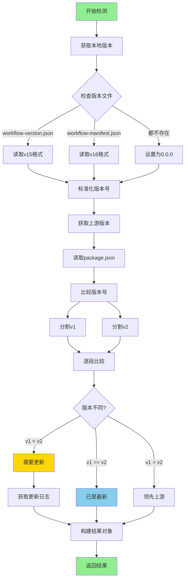
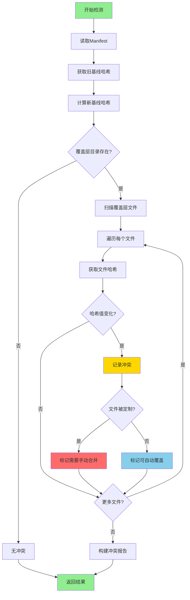
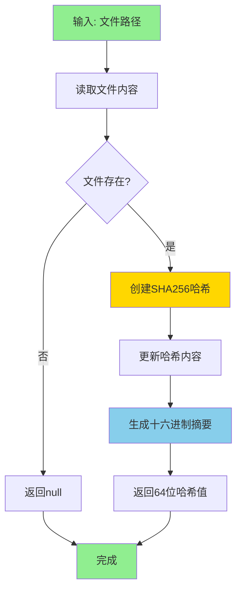
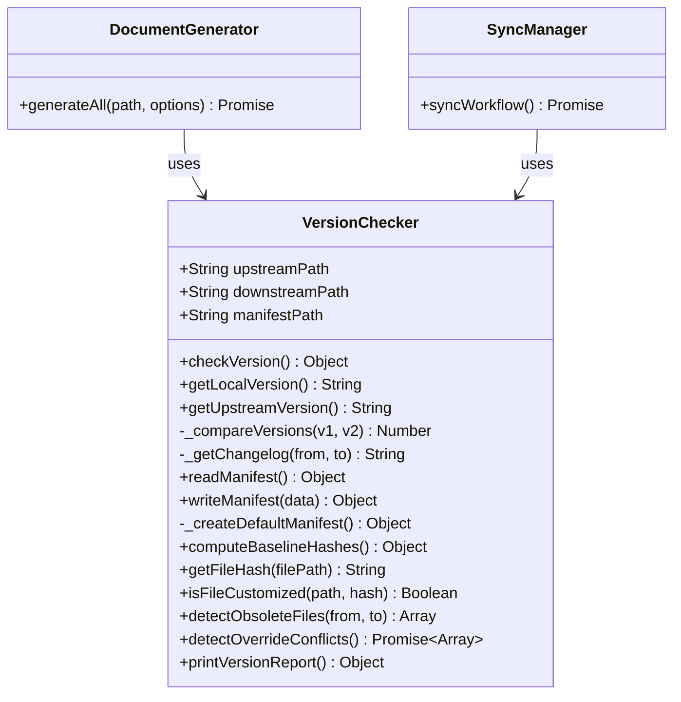

# 版本管理

> 核心模块: `lib/version-checker.js`, `bin/initmc.js`, `bin/uninstallmc.js`
> 当前版本: v21.1.2
> 最后更新: 2025-11-15

---

## 📋 概述

NeteaseMod-Claude 工作流的版本管理系统基于 **npm + initmc 命令** 实现，通过 `package.json` 管理版本号，使用 `CHANGELOG.md` 记录详细更新日志，并提供 `initmc` 部署命令和 `uninstallmc` 卸载命令。

### 核心机制

1. **版本号管理**: `package.json` 中的 `version` 字段（遵循语义化版本规范）
2. **更新日志**: `CHANGELOG.md` 详细记录每个版本的变更内容
3. **部署命令**: `initmc` 从 `templates/` 目录复制文件到下游 MODSDK 项目
4. **卸载命令**: `uninstallmc` 清理所有由 initmc 部署的文件
5. **同步更新**: `initmc --sync` 同步上游更新并处理废弃文件
6. **版本检测**: `VersionChecker` 类比较本地与上游版本，检测覆盖层冲突

---

## 🏗️ 版本管理架构

### 1. 版本号体系

版本号位于 `package.json`:
```json
{
  "name": "netease-mod-claude",
  "version": "20.2.10",
  "description": "v20.2.10: BUG修复 - unified-workflow-driver异常隔离..."
}
```

**版本格式**: 遵循 [语义化版本 2.0.0](https://semver.org/lang/zh-CN/)
- **主版本号 (20)**: 重大架构变更或破坏性更新
- **次版本号 (2)**: 新增功能，向后兼容
- **修订号 (10)**: BUG修复，不影响API

### 2. 更新日志体系

`CHANGELOG.md` 采用 [Keep a Changelog](https://keepachangelog.com/zh-CN/1.0.0/) 格式:

```markdown
## [20.2.10] - 2025-11-14

### 🔧 关键BUG修复 - unified-workflow-driver Hook完全失效问题

**P0修复 - datetime变量作用域错误**:
- 🔴 **根本原因**: Line 878存在重复的`from datetime import datetime`导入
- ❌ **影响**: 当`should_remind = False`时抛出`UnboundLocalError`
- ✅ **修复**: 删除Line 878的重复导入
```

### 3. 部署机制 (initmc)

`initmc` 命令负责将工作流部署到 MODSDK 项目：

**核心流程**:
1. 从全局安装目录 (`~/.claude-modsdk-workflow`) 读取工作流模板
2. 通过 `DocumentGenerator` 从 `templates/` 复制文件到目标项目
3. 使用模板替换机制填充项目特定信息
4. 创建软连接引用上游文档（`/.claude/core-docs/`）
5. 写入版本元数据到 `.claude/workflow-manifest.json`

**部署的文件**:
- `CLAUDE.md` - AI工作流总览
- `.claude/commands/` - 6个斜杠命令（/mc, /mc-review, /mc-perf等）
- `.claude/hooks/` - 7个Hook脚本（任务隔离、会话恢复）
- `.claude/settings.json` - Claude Code配置
- `.claude/core-docs/` - 上游文档软连接
- `markdown/README.md` - 文档导航

### 4. 卸载机制 (uninstallmc)

`uninstallmc` 命令从项目中移除所有工作流文件：

**卸载范围**:
- `.claude/commands/` - 所有斜杠命令
- `.claude/hooks/` - 所有Hook脚本
- `.claude/core-docs/` - 上游文档引用
- `.claude/workflow-manifest.json` - 版本元数据
- `tasks/` - 任务目录（可选）
- `CLAUDE.md` - 工作流总览（需 `--remove-claude-md` 参数）

**使用示例**:
```bash
cd <MODSDK项目目录>
uninstallmc                    # 卸载工作流
uninstallmc --dry-run          # 预览模式（不实际删除）
uninstallmc --remove-claude-md # 同时删除CLAUDE.md
```

---

## 🔍 VersionChecker 类详解

`VersionChecker` 是版本检测引擎，负责版本比较、更新检查、文件哈希计算和覆盖层冲突检测。

### 主要职责

1. **版本检测**: 比较本地工作流版本与上游版本
2. **更新检查**: 判断是否需要更新，提供更新日志
3. **文件哈希计算**: 计算上游基线文件的SHA256哈希值
4. **覆盖层冲突检测**: 检测用户修改的覆盖层文件与上游更新的冲突
5. **废弃文件检测**: 识别版本升级后不再需要的文件
6. **Manifest管理**: 读写 `workflow-manifest.json` 元数据文件

---

## 🔄 完整工作流程

### 初次部署

```bash
# 1. 全局安装工作流（在NeteaseMod-Claude项目目录）
cd D:\EcWork\基于Claude的MODSDK开发工作流
npm run install-global

# 2. 部署到MODSDK项目
cd D:\MyProject\my-modsdk-game
initmc
```

**执行流程**:
1. 检测是否在开发环境（防止误操作）
2. 分析项目结构（`ProjectAnalyzer`）
3. 部署核心工作流文档（`DocumentGenerator`）
4. 创建上游文档引用（`SymlinkManager`）
5. 写入版本元数据（`workflow-manifest.json`）

### 同步更新

```bash
# 1. 更新全局工作流
cd D:\EcWork\基于Claude的MODSDK开发工作流
git pull
npm run install-global

# 2. 同步下游项目
cd D:\MyProject\my-modsdk-game
initmc --sync
```

**执行流程**:
1. 版本检测（`VersionChecker.checkVersion()`）
2. 显示更新日志
3. 更新软连接（`SymlinkManager.updateSymlinks()`）
4. 更新Hook文件（从 `templates/.claude/hooks/` 复制）
5. 更新命令文件（从 `templates/.claude/commands/` 生成）
6. 检测废弃文件（`ObsoleteFileDetector`）
7. 检测覆盖层冲突（`VersionChecker.detectOverrideConflicts()`）
8. 更新版本元数据

### 卸载工作流

```bash
cd D:\MyProject\my-modsdk-game
uninstallmc                    # 标准卸载
uninstallmc --dry-run          # 预览模式
uninstallmc --remove-claude-md # 完全卸载（包括CLAUDE.md）
```

**执行流程**:
1. 读取 `workflow-manifest.json` 获取部署的文件列表
2. 删除 `.claude/commands/`、`.claude/hooks/` 等目录
3. 删除上游文档引用 `.claude/core-docs/`
4. 可选删除 `CLAUDE.md`
5. 删除版本元数据文件

---

## 🏗️ 核心类与方法

### VersionChecker (主检测器)

#### 构造函数
```javascript
constructor(upstreamPath, downstreamPath)
```
- **参数**:
  - `upstreamPath` - 上游工作流仓库路径（如 `D:/EcWork/基于Claude的MODSDK开发工作流`）
  - `downstreamPath` - 下游项目路径（如 `D:/MyProject`）
- **初始化**:
  - `this.upstreamPath` - 上游路径
  - `this.downstreamPath` - 下游路径
  - `this.manifestPath` - Manifest文件路径（`.claude/workflow-manifest.json`）

---

### 版本检测方法

#### checkVersion() - 检查是否需要更新
```javascript
checkVersion()
```
- **返回值**:
  ```javascript
  {
    needsUpdate: Boolean,    // 是否需要更新
    local: String,           // 本地版本号（如 '15.1.0'）
    upstream: String,        // 上游版本号（如 '18.2.0'）
    changelog: String|null   // 更新日志（如果需要更新）
  }
  ```

**示例**:
```javascript
const checker = new VersionChecker(upstreamPath, projectPath);
const check = checker.checkVersion();

if (check.needsUpdate) {
  console.log(`检测到新版本: v${check.upstream}`);
  console.log(check.changelog);
  console.log('执行 initmc --sync 更新');
} else {
  console.log('已是最新版本');
}
```

---

#### getLocalVersion() - 获取本地版本
```javascript
getLocalVersion()
```
- **返回值**: `String` - 版本号（如 `'18.2.0'`）
- **检测逻辑**:
  1. 优先检查 `.claude/workflow-version.json`（v15.x的版本文件）
  2. 降级检查 `.claude/workflow-manifest.json`（v16.0+的版本文件）
  3. 如果都不存在，返回 `'0.0.0'`（全新项目）

**版本格式标准化**:
```javascript
// v15.x使用 "15.0" 格式，需要标准化为 "15.0.0"
if (version && !version.includes('.', version.indexOf('.') + 1)) {
  return version + '.0';
}
```

---

#### getUpstreamVersion() - 获取上游版本
```javascript
getUpstreamVersion()
```
- **返回值**: `String` - 版本号（如 `'18.2.0'`）
- **读取位置**: 上游 `package.json` 的 `version` 字段

---

#### _compareVersions(v1, v2) - 比较版本号
```javascript
_compareVersions(v1, v2)
```
- **参数**:
  - `v1` - 版本1（如 `'15.1.0'`）
  - `v2` - 版本2（如 `'18.2.0'`）
- **返回值**:
  - `-1` - v1 < v2（需要更新）
  - `0` - v1 == v2（相同版本）
  - `1` - v1 > v2（v1更新）

**比较逻辑**:
```javascript
// 按点号分割版本号，逐段比较
const parts1 = v1.split('.').map(Number);  // [15, 1, 0]
const parts2 = v2.split('.').map(Number);  // [18, 2, 0]

for (let i = 0; i < Math.max(parts1.length, parts2.length); i++) {
  const p1 = parts1[i] || 0;
  const p2 = parts2[i] || 0;

  if (p1 < p2) return -1;
  if (p1 > p2) return 1;
}

return 0;
```

---

#### _getChangelog(fromVersion, toVersion) - 获取更新日志
```javascript
_getChangelog(fromVersion, toVersion)
```
- **返回值**: `String` - Markdown格式的更新日志

**示例**:
```javascript
const changelog = checker._getChangelog('15.1.0', '16.0.0');

// 返回:
// 📋 v16.0.0 更新内容:
//
// ✨ **核心特性**:
// - 双层文档架构: 上游基线 + 项目覆盖层
// - 自动同步: initmc --sync 一键更新
// ...
```

---

### Manifest管理

#### readManifest() - 读取Manifest
```javascript
readManifest()
```
- **返回值**: Manifest对象
  ```javascript
  {
    version: '18.2.0',
    installedAt: '2025-11-13T10:30:00.000Z',
    updatedAt: '2025-11-13T10:30:00.000Z',
    baselineHashes: {
      '开发规范.md': 'abc123...',
      '问题排查.md': 'def456...'
    },
    obsoleteFiles: []
  }
  ```

---

#### writeManifest(data) - 写入Manifest
```javascript
writeManifest(data)
```
- **参数**: `data` - 要写入的数据（会合并到现有Manifest）
- **返回值**: 更新后的完整Manifest对象

**使用示例**:
```javascript
const checker = new VersionChecker(upstreamPath, projectPath);

// 写入版本信息
checker.writeManifest({
  version: '18.2.0',
  baselineHashes: checker.computeBaselineHashes(),
  installedAt: new Date().toISOString()
});
```

---

#### _createDefaultManifest() - 创建默认Manifest
```javascript
_createDefaultManifest()
```
- **返回值**: 默认Manifest对象
  ```javascript
  {
    version: '15.1.0',
    createdAt: '2025-11-13T10:30:00.000Z',
    baselineHashes: {},
    obsoleteFiles: []
  }
  ```

---

### 文件哈希计算

#### computeBaselineHashes() - 计算基线文件哈希
```javascript
computeBaselineHashes()
```
- **返回值**: 哈希值映射对象 `{ filename: hash }`
- **计算范围**: 上游核心文档文件

**核心文件列表**:
```javascript
const coreFiles = [
  '开发规范.md',
  '问题排查.md',
  '快速开始.md',
  'MODSDK核心概念.md',
  'API速查.md',
  '官方文档查询指南.md',
  '迁移指南-v15.0.md'
];
```

**返回示例**:
```javascript
{
  '开发规范.md': 'abc123def456...',
  '问题排查.md': 'def456abc123...',
  '快速开始.md': 'ghi789jkl012...'
}
```

---

#### getFileHash(filePath) - 计算单个文件哈希
```javascript
getFileHash(filePath)
```
- **参数**: `filePath` - 文件绝对路径
- **返回值**: `String` - SHA256哈希值（64位十六进制）

**实现**:
```javascript
const content = fs.readFileSync(filePath);
return crypto.createHash('sha256').update(content).digest('hex');
```

---

#### isFileCustomized(filePath, baselineHash) - 检测文件是否被定制
```javascript
isFileCustomized(filePath, baselineHash)
```
- **参数**:
  - `filePath` - 文件绝对路径
  - `baselineHash` - 基线哈希值（从Manifest读取）
- **返回值**:
  - `true` - 文件已被用户定制
  - `false` - 文件未修改或不存在

**使用场景**:
```javascript
const manifest = checker.readManifest();
const baselineHash = manifest.baselineHashes['开发规范.md'];
const filePath = path.join(projectPath, 'markdown/core/开发规范.md');

if (checker.isFileCustomized(filePath, baselineHash)) {
  console.log('⚠️ 文件已被定制，需要手动合并');
} else {
  console.log('✅ 文件未修改，可以安全覆盖');
}
```

---

### 废弃文件检测

#### detectObsoleteFiles(fromVersion, toVersion) - 检测废弃文件
```javascript
detectObsoleteFiles(fromVersion, toVersion)
```
- **参数**:
  - `fromVersion` - 起始版本（如 `'15.1.0'`）
  - `toVersion` - 目标版本（如 `'16.0.0'`）
- **返回值**: `Array<String>` - 废弃文件路径列表

**检测规则**（按版本）:

**v16.0 废弃文件**:
```javascript
// 从 v15.x 升级到 v16.0 时，以下文件被废弃
const v16CoreFiles = [
  'markdown/开发规范.md',
  'markdown/问题排查.md',
  'markdown/快速开始.md',
  'markdown/MODSDK核心概念.md',
  'markdown/API速查.md',
  'markdown/官方文档查询指南.md',
  'markdown/迁移指南-v15.0.md',
  'markdown/AI策略文档'  // 目录
];
```

**使用示例**:
```javascript
const obsolete = checker.detectObsoleteFiles('15.1.0', '16.0.0');

console.log('以下文件已废弃，需要清理:');
obsolete.forEach(file => console.log(`  - ${file}`));
```

---

### 覆盖层冲突检测

#### detectOverrideConflicts() - 检测覆盖层文件冲突
```javascript
async detectOverrideConflicts()
```
- **返回值**: `Array<Object>` - 冲突列表
  ```javascript
  [
    {
      file: '开发规范.md',
      overridePath: 'D:/MyProject/markdown/core/开发规范.md',
      upstreamPath: 'D:/Upstream/markdown/开发规范.md',
      oldBaselineHash: 'abc123...',
      newBaselineHash: 'def456...',
      description: '上游文档有更新，建议审查并合并'
    }
  ]
  ```

**检测逻辑**:
1. 读取Manifest中的基线哈希值（旧版本）
2. 计算当前上游文件哈希值（新版本）
3. 遍历覆盖层文件（`markdown/core/`）
4. 如果上游文件有变化（`oldHash !== newHash`），记录为冲突

**使用示例**:
```javascript
const conflicts = await checker.detectOverrideConflicts();

if (conflicts.length > 0) {
  console.log('⚠️ 检测到覆盖层冲突:');
  conflicts.forEach(conflict => {
    console.log(`  - ${conflict.file}`);
    console.log(`    覆盖层: ${conflict.overridePath}`);
    console.log(`    上游: ${conflict.upstreamPath}`);
    console.log(`    说明: ${conflict.description}`);
  });
} else {
  console.log('✅ 无覆盖层冲突');
}
```

---

### 版本报告

#### printVersionReport() - 打印版本检测报告
```javascript
printVersionReport()
```
- **功能**: 在控制台输出美化的版本报告
- **返回值**: 版本检查结果对象

**输出示例**:
```
━━━━━━━━━━━━━━━━━━━━━━━━━━━━━━━━━━━━━━
📊 工作流版本检测
━━━━━━━━━━━━━━━━━━━━━━━━━━━━━━━━━━━━━━

本地版本: v15.1.0
上游版本: v18.2.0

⚠️ 检测到新版本！

📋 v16.0.0 更新内容:

✨ **核心特性**:
- 双层文档架构: 上游基线 + 项目覆盖层
- 自动同步: initmc --sync 一键更新
- 智能清理: 自动检测并清理废弃文件
- 覆盖层支持: markdown/core/ 实现项目定制

🔧 **架构变更**:
- 上游文档移至 .claude/core-docs/ (软连接)
- 支持非MODSDK项目定制化
- 完全职责隔离 (多项目互不影响)

📚 **文档改进**:
- 新增 markdown/README.md 导航文档
- AI智能文档路由 (覆盖层优先)
- 自动迁移v15.x项目

⚠️ **破坏性变更**:
- markdown/ 目录结构调整
- 需要执行迁移脚本 (自动)

💡 执行 `initmc --sync` 更新到最新版本

━━━━━━━━━━━━━━━━━━━━━━━━━━━━━━━━━━━━━━
```

---

## 💡 使用示例

### 示例1: 版本检测
```javascript
const { VersionChecker } = require('./lib/version-checker');

const upstreamPath = 'D:/EcWork/基于Claude的MODSDK开发工作流';
const projectPath = 'D:/MyProject';

const checker = new VersionChecker(upstreamPath, projectPath);

// 检查版本
const check = checker.checkVersion();

if (check.needsUpdate) {
  console.log(`🎉 发现新版本: v${check.upstream} (当前: v${check.local})`);
  console.log('\n更新内容:');
  console.log(check.changelog);
  console.log('\n💡 执行 initmc --sync 更新');
} else {
  console.log('✅ 已是最新版本');
}
```

---

### 示例2: 基线哈希计算
```javascript
const checker = new VersionChecker(upstreamPath, projectPath);

// 计算上游基线文件哈希
const baselineHashes = checker.computeBaselineHashes();

console.log('上游基线文件哈希:');
Object.entries(baselineHashes).forEach(([file, hash]) => {
  console.log(`  ${file}: ${hash.substring(0, 8)}...`);
});

// 写入Manifest
checker.writeManifest({
  version: '18.2.0',
  baselineHashes: baselineHashes,
  installedAt: new Date().toISOString()
});
```

---

### 示例3: 覆盖层冲突检测
```javascript
const checker = new VersionChecker(upstreamPath, projectPath);

// 检测覆盖层冲突
const conflicts = await checker.detectOverrideConflicts();

if (conflicts.length > 0) {
  console.log('⚠️ 检测到覆盖层冲突，需要手动合并:');
  conflicts.forEach(conflict => {
    console.log(`\n文件: ${conflict.file}`);
    console.log(`覆盖层: ${conflict.overridePath}`);
    console.log(`上游: ${conflict.upstreamPath}`);

    // 检查文件是否被定制
    const isCustomized = checker.isFileCustomized(
      conflict.overridePath,
      conflict.oldBaselineHash
    );

    if (isCustomized) {
      console.log('状态: 已定制（需要手动合并）');
    } else {
      console.log('状态: 未定制（可以安全覆盖）');
    }
  });
} else {
  console.log('✅ 无覆盖层冲突');
}
```

---

### 示例4: 废弃文件清理
```javascript
const checker = new VersionChecker(upstreamPath, projectPath);

const localVersion = checker.getLocalVersion();
const upstreamVersion = checker.getUpstreamVersion();

// 检测废弃文件
const obsolete = checker.detectObsoleteFiles(localVersion, upstreamVersion);

if (obsolete.length > 0) {
  console.log('🧹 检测到废弃文件:');
  obsolete.forEach(file => console.log(`  - ${file}`));

  // 询问用户是否清理
  console.log('\n⚠️ 这些文件在新版本中已被废弃，建议清理');
  console.log('执行: initmc --sync --clean');
} else {
  console.log('✅ 无废弃文件');
}
```

---

### 示例5: 集成到initmc命令
```javascript
// scripts/initmc.js

const checker = new VersionChecker(upstreamPath, projectPath);

// 打印版本报告
const check = checker.printVersionReport();

if (check.needsUpdate) {
  // 询问用户是否更新
  const shouldUpdate = await askUser('是否更新到最新版本? (y/n)');

  if (shouldUpdate) {
    // 检测覆盖层冲突
    const conflicts = await checker.detectOverrideConflicts();

    if (conflicts.length > 0) {
      console.log('⚠️ 检测到覆盖层冲突:');
      conflicts.forEach(conflict => {
        console.log(`  - ${conflict.file}`);
      });

      const shouldContinue = await askUser('是否继续更新? (y/n)');
      if (!shouldContinue) {
        console.log('❌ 取消更新');
        return;
      }
    }

    // 执行更新
    await updateWorkflow();

    // 更新Manifest
    checker.writeManifest({
      version: check.upstream,
      baselineHashes: checker.computeBaselineHashes(),
      updatedAt: new Date().toISOString()
    });

    console.log('✅ 更新完成！');
  }
}
```

---

## 📊 工作流程图

### 版本检测流程



### 覆盖层冲突检测流程



### 文件哈希计算流程



---

## 🔗 类关系图



---

## ⚙️ 配置与常量

### 核心文件列表
```javascript
const CORE_FILES = [
  '开发规范.md',
  '问题排查.md',
  '快速开始.md',
  'MODSDK核心概念.md',
  'API速查.md',
  '官方文档查询指南.md',
  '迁移指南-v15.0.md'
];
```

### Manifest文件结构
```javascript
{
  version: String,              // 工作流版本号
  installedAt: String,          // 安装时间（ISO格式）
  updatedAt: String,            // 更新时间（ISO格式）
  baselineHashes: {             // 基线文件哈希值
    [filename: String]: String  // SHA256哈希
  },
  obsoleteFiles: Array<String>  // 废弃文件列表
}
```

### 哈希算法
```javascript
const HASH_ALGORITHM = 'sha256';
const HASH_ENCODING = 'hex';
const HASH_LENGTH = 64;  // 十六进制字符数
```

---

## 🎯 最佳实践

### 版本发布流程（开发者）

1. **更新版本号**: 修改 `package.json` 中的 `version` 字段
2. **编写更新日志**: 在 `CHANGELOG.md` 添加新版本记录
3. **测试部署**: 在测试项目中执行 `initmc` 和 `initmc --sync` 验证
4. **提交代码**: Git commit 并推送到远程仓库
5. **全局安装**: 运行 `npm run install-global` 更新全局工作流
6. **通知下游**: 告知用户执行 `initmc --sync` 更新

### 版本更新流程（用户）

1. **更新上游**: `cd` 到工作流项目，执行 `git pull`
2. **全局安装**: 运行 `npm run install-global`
3. **同步项目**: 在 MODSDK 项目中执行 `initmc --sync`
4. **检查冲突**: 处理覆盖层冲突（如果有）
5. **清理废弃**: 确认并删除废弃文件（如果有）

### 开发建议

1. **定期检查**: `initmc` 命令会自动检查版本并提示更新
2. **保护用户修改**: 使用哈希值检测文件是否被定制，避免覆盖用户的自定义内容
3. **增量更新**: 只更新有变化的文件，提升效率
4. **冲突提示**: 检测到覆盖层冲突时，提示用户手动合并
5. **废弃文件清理**: 升级后自动检测并清理废弃文件
6. **Manifest备份**: 更新前备份旧Manifest（`.claude/workflow-manifest.json`）

### initmc 命令参数

```bash
initmc                      # 首次部署或重新部署
initmc --sync               # 同步上游更新
initmc --force              # 强制重新初始化（清除缓存）
initmc --reset              # 同 --force（别名）
initmc --clean              # 清理旧版本文件后全新部署
initmc --auto-migrate       # 自动迁移模式（跨大版本升级）
initmc --auto-migrate=2     # 指定迁移选项编号
```

---

## 📚 依赖模块

- `fs-extra` - 增强文件系统操作
- `path` - 路径处理
- `crypto` - 哈希计算

---

## 🔄 版本历史

- **v20.x** (当前): 完整的版本管理系统，基于 npm + initmc/uninstallmc 命令
- **v18.x**: 引入 `initmc --sync` 同步更新机制
- **v16.x**: 双层文档架构，引入 `VersionChecker` 类
- **v15.x**: 初始版本，使用 `workflow-version.json`

---

## 🚨 注意事项

### 版本管理

1. **语义化版本**: 严格遵循 [SemVer 2.0.0](https://semver.org/lang/zh-CN/) 规范
2. **版本号标准化**: v15.x 使用 "15.0" 格式，会自动转换为 "15.0.0"
3. **更新日志规范**: 遵循 [Keep a Changelog](https://keepachangelog.com/zh-CN/1.0.0/) 格式
4. **破坏性变更**: 主版本号变化时，必须在 CHANGELOG 中明确标注

### 文件哈希

1. **哈希值不匹配≠冲突**: 需要进一步检查上游文件是否有更新
2. **文件编码**: 确保文件以 UTF-8 编码读取，避免哈希值错误
3. **空文件处理**: 空文件的哈希值为有效值（不是 null）
4. **路径分隔符**: Windows 使用反斜杠，需要统一处理

### 部署与卸载

1. **环境检测**: `initmc` 会自动检测开发环境，防止在工作流项目中误执行
2. **全局安装**: 必须先运行 `npm run install-global` 才能使用 `initmc` 命令
3. **卸载清理**: `uninstallmc` 默认不删除 `CLAUDE.md`，需要 `--remove-claude-md` 参数
4. **软连接处理**: `.claude/core-docs/` 是软连接，卸载时会正确删除

### Windows 中文路径问题

参考 [CLAUDE.md](../../CLAUDE.md#windows-中文路径问题-v2025) 中的详细说明：
- Python 3.6+ 完全支持 Windows 中文目录创建
- 乱码问题通常由 stdin 编码错误导致，而非文件系统问题
- 解决方案：修复 Hook 脚本的编码设置

---

## 📚 相关文档

- [项目分析器.md](./项目分析器.md) - 项目结构分析与元数据提取
- [文档生成器.md](./文档生成器.md) - 文档生成与模板替换机制
- [智能文档维护.md](./智能文档维护.md) - 自适应文档维护系统
- [安装指南.md](./安装指南.md) - 全局安装与项目部署步骤
- [快速上手.md](./快速上手.md) - initmc 命令使用示例

---

**文档元数据**:
- 作者: NeteaseMod-Claude Contributors
- 当前版本: v20.2.10
- 最后更新: 2025-11-14
- GitHub: [jju666/NeteaseMod-Claude](https://github.com/jju666/NeteaseMod-Claude)
