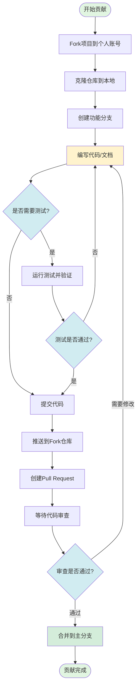
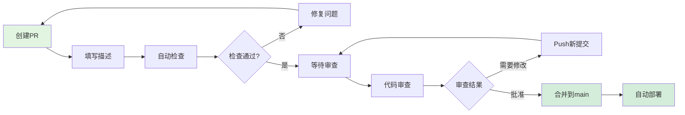

# NeteaseMod-Claude 贡献指南

> **版本**: v21.1.2
> **最后更新**: 2025-11-15
> **维护者**: [@jju666](https://github.com/jju666)

---

## 📋 目录

1. [欢迎参与贡献](#欢迎参与贡献)
2. [项目概述](#项目概述)
3. [开发环境搭建](#开发环境搭建)
4. [贡献流程](#贡献流程)
5. [代码规范](#代码规范)
6. [提交规范](#提交规范)
7. [Pull Request流程](#pull-request流程)
8. [代码审查标准](#代码审查标准)
9. [贡献示例](#贡献示例)
10. [常见问题](#常见问题)

---

## 欢迎参与贡献

感谢你对 NeteaseMod-Claude 项目的关注！本项目是一个 AI 驱动的网易 MODSDK 开发工作流生成器，旨在通过 Claude Code 为 MODSDK 开发者提供智能化的开发辅助。

### 我们欢迎以下贡献

- 🐛 **Bug修复**: 发现并修复项目中的问题
- ✨ **新功能**: 提出并实现新的功能特性
- 📚 **文档改进**: 完善项目文档、修正错误
- 🎨 **用户体验优化**: 改进命令交互、错误提示等
- 🧪 **测试用例**: 添加测试覆盖，提高代码质量
- 🌍 **国际化**: 支持英文文档和多语言

### 参与方式

1. **提交Issue**: 报告Bug或提出功能建议
2. **提交Pull Request**: 直接贡献代码或文档
3. **参与讨论**: 在Issue中分享你的想法和经验
4. **帮助他人**: 回答其他开发者的问题

---

## 项目概述

### 项目定位

NeteaseMod-Claude 是一个**工作流生成器项目**（非游戏项目），专为网易我的世界 MODSDK 开发者设计。

### 核心功能

- **智能文档路由系统**: 自动发现和路由项目文档
- **多层Hook强制执行**: 通过Hook机制强制执行工作流规范
- **任务隔离与恢复**: 独立任务目录，支持上下文恢复
- **专家审核机制**: 复杂任务强制方案审核
- **双层文档架构**: 上游基线文档 + 项目覆盖层

### 技术栈

- **运行环境**: Node.js ≥12.0.0
- **依赖管理**: npm
- **核心语言**: JavaScript (Node.js), Python (Hook脚本)
- **文档格式**: Markdown
- **版本控制**: Git
- **AI平台**: Claude Code (Anthropic)

### 项目结构

```
NeteaseMod-Claude/
├── bin/                    # CLI可执行命令
│   ├── initmc.js          # 初始化工作流到下游项目
│   ├── uninstallmc.js     # 从下游项目卸载工作流
│   ├── install-global.js  # 安装命令到用户目录
│   ├── uninstall-global.js # 卸载全局命令
│   ├── merge-conflicts.js # 合并冲突工具
│   ├── detect-obsolete.js # 废弃文件检测
│   └── quick-deploy.js    # 快速部署脚本
│
├── lib/                    # 核心JavaScript模块 (23个模块)
│   ├── init-workflow.js   # 工作流初始化逻辑
│   ├── generator.js       # 文档生成器 (DocumentGenerator)
│   ├── analyzer.js        # 项目分析器 (ProjectAnalyzer)
│   ├── config.js          # 配置管理 (版本号、路径常量)
│   ├── adaptive-doc-discovery.js    # 自适应文档发现
│   ├── intelligent-doc-maintenance.js # 智能文档维护
│   ├── symlink-manager.js # 符号链接管理器
│   ├── version-checker.js # 版本检查与迁移
│   ├── migration-v16.js   # v16版本迁移脚本
│   ├── migration-v16.1.js # v16.1版本迁移脚本
│   ├── migration-v18.js   # v18版本迁移脚本
│   ├── uninstall-workflow.js # 卸载工作流逻辑
│   └── ... (其他工具模块)
│
├── templates/              # 模板文件 (部署到下游项目)
│   ├── .claude/           # Claude Code配置模板
│   │   ├── commands/      # 斜杠命令模板
│   │   │   ├── mc.md.template          # /mc 主命令
│   │   │   ├── mc-review.md.template   # /mc-review 方案审查
│   │   │   ├── mc-perf.md.template     # /mc-perf 性能分析
│   │   │   ├── mc-docs.md.template     # /mc-docs 文档验证
│   │   │   ├── mc-why.md.template      # /mc-why 规范解释
│   │   │   └── mc-discover.md.template # /mc-discover 项目发现
│   │   │
│   │   ├── hooks/         # Hook脚本 (Python, 事件驱动核心)
│   │   │   ├── unified-workflow-driver.py  # 统一工作流驱动器 (核心)
│   │   │   ├── user-prompt-submit-hook.py  # 用户输入提交Hook
│   │   │   ├── iteration-tracker-hook.py   # 迭代追踪Hook
│   │   │   ├── check-critical-rules.py     # CRITICAL规范检查
│   │   │   ├── post-archive-hook.py        # 任务归档Hook
│   │   │   ├── enforce-cleanup.py          # 收尾强制Hook
│   │   │   ├── session-start-hook.py       # 会话启动Hook
│   │   │   ├── conversation-recorder.py    # 会话记录器
│   │   │   ├── log-changes.py              # 变更日志记录
│   │   │   ├── vscode_notify.py            # 桌面通知模块
│   │   │   ├── workflow_config_loader.py   # 配置加载器
│   │   │   └── ... (其他辅助Hook)
│   │   │
│   │   └── settings.json.template # Claude Code配置文件
│   │
│   ├── markdown/          # 工作流文档模板
│   │   ├── core/          # 核心文档模板
│   │   └── systems/       # 系统文档模板
│   │
│   ├── tasks/             # 任务目录模板
│   │   └── .gitkeep
│   │
│   ├── CLAUDE.md.template # 项目文档模板
│   ├── README.md.template # README模板
│   └── task-*.template    # 任务模板文件
│
├── markdown/               # 核心工作流文档 (上游基线文档)
│   ├── 核心工作流文档/
│   │   ├── 开发规范.md
│   │   ├── 问题排查.md
│   │   ├── 快速开始.md
│   │   └── ... (其他规范文档)
│   ├── 深度指南/
│   │   ├── MODSDK高级API.md
│   │   └── ... (深入技术指南)
│   ├── AI策略文档/
│   │   ├── AI工作流指南.md
│   │   └── ... (AI策略文档)
│   ├── 概念参考/
│   │   ├── 架构设计原则.md
│   │   └── ... (概念文档)
│   └── README.md          # 文档索引
│
├── scripts/                # 辅助脚本
│   ├── deploy-local.js    # 本地部署脚本
│   ├── fix-*.py           # 修复脚本
│   ├── test-*.py          # 测试脚本
│   └── ... (其他工具脚本)
│
├── docs/                   # 开发者文档
│   └── developer/         # 开发者文档目录
│       ├── 贡献指南.md
│       ├── 技术架构.md
│       ├── Hook机制.md
│       ├── Hook状态机数据流完整说明.md
│       ├── 数据流设计.md
│       ├── 快速上手.md
│       ├── 安装指南.md
│       ├── 项目分析器.md
│       ├── 文档生成器.md
│       ├── 智能文档维护.md
│       ├── 版本管理.md
│       ├── 测试指南.md
│       ├── 通知系统.md
│       └── ... (19篇开发者文档)
│
├── package.json           # npm配置与依赖
├── package-lock.json      # npm依赖锁定
├── README.md              # 项目说明 (面向用户)
├── CLAUDE.md              # AI参考文档 (项目概述)
├── CHANGELOG.md           # 版本更新日志
├── LICENSE                # MIT开源协议
└── .gitignore             # Git忽略规则
```

**核心目录说明**：

| 目录 | 说明 | 是否部署到下游 |
|------|------|---------------|
| `bin/` | CLI命令入口 | ❌ 不部署 (仅上游使用) |
| `lib/` | 核心JavaScript模块 | ❌ 不部署 (仅上游使用) |
| `templates/` | 模板文件 (Hook、命令、文档) | ✅ 部署 (复制到下游) |
| `markdown/` | 上游基线文档 | ✅ 部署 (符号链接到下游) |
| `docs/` | 开发者文档 | ❌ 不部署 (仅上游开发参考) |
| `scripts/` | 辅助脚本 | ❌ 不部署 (仅上游开发使用) |

---

## 开发环境搭建

### 1. 前置要求

确保你的系统已安装以下工具：

- **Node.js**: ≥12.0.0 (推荐使用LTS版本)
- **npm**: ≥6.0.0
- **Git**: 任意版本
- **Python**: ≥2.7 (用于Hook脚本，Windows用户推荐安装Git Bash)
- **Claude Code**: 最新版本 (安装方法见[官方文档](https://claude.com/claude-code))

### 2. Fork项目

访问 [GitHub仓库](https://github.com/jju666/NeteaseMod-Claude)，点击右上角的 **Fork** 按钮，将项目复制到你的账号下。

### 3. 克隆仓库

```bash
# 克隆你的Fork仓库
git clone https://github.com/YOUR_USERNAME/NeteaseMod-Claude.git
cd NeteaseMod-Claude

# 添加上游仓库（用于同步最新更新）
git remote add upstream https://github.com/jju666/NeteaseMod-Claude.git
```

### 4. 安装依赖

```bash
# 安装npm依赖
npm install

# 下载官方文档（Git Submodule）
git submodule update --init --recursive
```

> **注意**: 官方文档下载可能需要几分钟，如失败可跳过（工作流会自动降级到在线查询）。

### 5. 全局安装（可选）

如果需要在系统中全局使用命令，可执行：

```bash
npm run install-global
```

这会将以下命令安装到用户目录 `~/.claude-modsdk-workflow/`：
- `initmc`
- `uninstallmc`
- `merge-conflicts`
- `detect-obsolete`

### 6. 验证安装

```bash
# 检查命令是否可用
initmc --help

# 查看版本号
node -e "console.log(require('./package.json').version)"
# 或直接查看
cat package.json | grep version
```

### 7. 开发模式

对于开发调试，推荐直接使用本地路径：

```bash
# 在测试项目中初始化工作流
cd /path/to/test-modsdk-project
node /path/to/NeteaseMod-Claude/bin/initmc.js
```

---

## 贡献流程

遵循以下流程，确保贡献高效、规范：

### 贡献流程图



### 详细步骤

#### 1. 创建功能分支

从 `main` 分支创建新分支，分支命名遵循规范：

```bash
# 同步上游最新代码
git fetch upstream
git checkout main
git merge upstream/main

# 创建功能分支
git checkout -b feature/your-feature-name
# 或修复分支
git checkout -b fix/bug-description
```

**分支命名规范**:
- `feature/功能名` - 新功能
- `fix/问题描述` - Bug修复
- `docs/文档主题` - 文档改进
- `refactor/模块名` - 代码重构
- `test/测试范围` - 测试改进
- `chore/任务描述` - 维护任务

#### 2. 进行开发

在功能分支上进行代码或文档的修改。

#### 3. 测试验证

根据修改类型执行相应的测试：

**代码修改**:
```bash
# 在测试项目中验证
cd /path/to/test-project
initmc  # 验证初始化流程
/mc "测试任务"  # 验证命令功能
```

**文档修改**:
- 确保Markdown格式正确
- 检查链接是否有效
- 验证代码示例可运行

**模板修改**:
```bash
# 部署到测试项目验证
cd /path/to/test-project
initmc --force
```

#### 4. 提交代码

遵循提交规范（详见下一节），创建清晰的提交历史：

```bash
git add .
git commit -m "feat(模块): 简洁描述功能"
```

#### 5. 推送到Fork仓库

```bash
git push origin feature/your-feature-name
```

#### 6. 创建Pull Request

1. 访问你的Fork仓库页面
2. 点击 **Compare & pull request**
3. 填写PR标题和描述（见下文模板）
4. 提交PR等待审查

---

## 代码规范

### JavaScript代码规范

#### 1. 文件结构

```javascript
#!/usr/bin/env node
/**
 * 文件说明（简短描述文件用途）
 *
 * 详细说明（可选）
 */

// 引入依赖
const fs = require('fs');
const path = require('path');

// 常量定义
const CONSTANT_NAME = 'value';

// 函数定义
function functionName() {
  // 实现
}

// 类定义
class ClassName {
  constructor() {
    // 构造函数
  }

  method() {
    // 方法
  }
}

// 导出
module.exports = { functionName, ClassName };
```

#### 2. 命名规范

| 类型 | 规范 | 示例 |
|------|------|------|
| 文件名 | kebab-case | `init-workflow.js` |
| 类名 | PascalCase | `DocumentGenerator` |
| 函数名 | camelCase | `generateAll()` |
| 常量 | UPPER_SNAKE_CASE | `WORKFLOW_HOME` |
| 变量 | camelCase | `projectPath` |

#### 3. 注释规范

**函数注释**（使用JSDoc风格）:
```javascript
/**
 * 生成工作流文档
 * @param {string} targetPath - 目标项目路径
 * @param {Object} options - 生成选项
 * @param {boolean} options.minimalMode - 是否使用最小化模式
 * @returns {Promise<void>}
 */
async function generateAll(targetPath, options = {}) {
  // 实现
}
```

**行内注释**:
```javascript
// 单行注释：简洁描述下一行代码的意图
const result = await fetchData();

/*
 * 多行注释：
 * 用于解释复杂逻辑
 */
if (complexCondition) {
  // ...
}
```

#### 4. 错误处理

```javascript
// ✅ 推荐：使用try-catch处理异步错误
async function processData() {
  try {
    const data = await fetchData();
    return processResult(data);
  } catch (error) {
    console.error('❌ 错误:', error.message);
    throw error; // 或返回默认值
  }
}

// ✅ 推荐：提供友好的错误提示
if (!fs.existsSync(filePath)) {
  console.error(`❌ 文件不存在: ${filePath}`);
  console.error('💡 提示: 请检查路径是否正确');
  process.exit(1);
}
```

#### 5. 代码格式

- **缩进**: 2个空格（不使用Tab）
- **字符串**: 优先使用单引号 `'string'`
- **分号**: 必须使用分号结尾
- **行宽**: 建议不超过100字符
- **空行**: 逻辑块之间空一行

### Python代码规范（Hook脚本）

#### 1. 文件头部

```python
#!/usr/bin/env python
# -*- coding: utf-8 -*-
"""
Hook脚本名称

简短描述脚本用途
"""

from __future__ import print_function
import sys
import json
```

#### 2. 命名规范

遵循PEP 8规范：
- 函数名: `snake_case`
- 类名: `PascalCase`
- 常量: `UPPER_SNAKE_CASE`

#### 3. 退出码规范

Hook脚本必须遵循以下退出码约定：

```python
# 退出码定义
EXIT_SUCCESS = 0   # 成功（Hook允许操作继续）
EXIT_BLOCK = 2     # 阻止操作（Hook拒绝）
EXIT_ERROR = 1     # Hook执行错误
```

### Markdown文档规范

#### 1. 文档结构

```markdown
# 文档标题

> **版本**: vX.X.X
> **最后更新**: YYYY-MM-DD

---

## 目录

1. [章节1](#章节1)
2. [章节2](#章节2)

---

## 章节1

内容...

### 子章节1.1

内容...
```

#### 2. 格式规范

- **标题层级**: 严格使用 `#`、`##`、`###`（不跳级）
- **代码块**: 必须指定语言高亮
  ```markdown
  ```javascript
  const code = 'example';
  \`\`\`
  ```
- **链接**: 使用相对路径（便于离线查看）
- **图片**: 存放在 `docs/images/` 目录
- **表格**: 使用Markdown表格语法

#### 3. 中文排版

- 中英文之间添加空格
- 数字与单位之间添加空格
- 使用中文标点符号
- 专有名词保持原文（如 "Claude Code"、"MODSDK"）

---

## 提交规范

本项目遵循 [Conventional Commits](https://www.conventionalcommits.org/) 规范。

### Commit Message格式

```
<类型>(<作用域>): <简短描述>

[可选的详细描述]

[可选的Footer]
```

### 类型（Type）

| 类型 | 说明 | 示例 |
|------|------|------|
| `feat` | 新功能 | `feat(generator): 支持自定义模板路径` |
| `fix` | Bug修复 | `fix(hooks): 修复CRITICAL规范检查误报` |
| `docs` | 文档改进 | `docs(contributing): 完善贡献指南` |
| `style` | 代码格式（不影响逻辑） | `style(lib): 统一缩进为2空格` |
| `refactor` | 代码重构 | `refactor(analyzer): 优化项目分析逻辑` |
| `perf` | 性能优化 | `perf(symlink): 减少文件系统调用` |
| `test` | 测试相关 | `test(generator): 添加模板生成测试` |
| `chore` | 维护任务 | `chore: 更新版本号到18.4.0` |

### 作用域（Scope）

常用作用域示例：
- `generator` - 文档生成器
- `analyzer` - 项目分析器
- `hooks` - Hook脚本
- `commands` - 命令模板
- `migration` - 版本迁移
- `docs` - 文档
- `config` - 配置

### 简短描述

- 使用动词开头（如"添加"、"修复"、"优化"）
- 不超过50个字符
- 中文或英文均可（保持一致）
- 不使用句号结尾

### 示例

**新功能**:
```
feat(hooks): 添加pre-compact-reminder Hook

在上下文压缩前自动注入工作流规则提醒，防止AI遗忘关键规范。

实现内容:
- 读取workflow-state.json获取当前状态
- 生成规则提醒文本
- 注入到压缩后的上下文
```

**Bug修复**:
```
fix(generator): 修复CLAUDE.md重复注释累积问题

问题: 每次执行initmc都会重复添加"用户可编辑"注释
修复: 在_extractSection()中清理提示注释

影响: 修复"项目配置区"和"项目扩展区"的重复累积
```

**文档改进**:
```
docs(README): 更新快速上手指南

添加4个实战场景示例，降低学习成本。
```

**重大变更（Breaking Change）**:
```
feat(v18.0): 下游CLAUDE.md完全解耦

BREAKING CHANGE: CLAUDE.md不再由initmc管理，用户完全控制

迁移指南:
1. 运行initmc自动触发迁移向导
2. 选择"保留现有CLAUDE.md"（推荐）
3. 自动清理旧版工作流管理标记
```

---

## Pull Request流程

### PR前准备

提交PR前，请确保：

1. **代码已测试**：在本地或测试项目中验证功能正常
2. **遵循规范**：代码符合项目代码规范和提交规范
3. **文档已更新**：如果修改了功能，需同步更新相关文档
4. **CHANGELOG已更新**：添加变更记录到 `CHANGELOG.md` 的 `[Unreleased]` 部分
5. **提交历史清晰**：使用有意义的commit message，避免 "fix bug" 这类模糊描述

### PR标题格式

与Commit Message格式一致：

```
<类型>(<作用域>): <简短描述>
```

示例：
- `feat(hooks): 添加pre-compact-reminder Hook`
- `fix(generator): 修复CLAUDE.md重复注释问题`
- `docs(contributing): 完善贡献指南`

### PR描述模板

创建PR时，请使用以下模板：

```markdown
## 📋 变更类型

- [ ] 新功能 (feat)
- [ ] Bug修复 (fix)
- [ ] 文档改进 (docs)
- [ ] 代码重构 (refactor)
- [ ] 性能优化 (perf)
- [ ] 测试改进 (test)
- [ ] 维护任务 (chore)

## 🎯 变更说明

简要描述本PR的目的和内容。

## 🔧 实现细节

- 修改了哪些文件
- 添加了哪些功能
- 解决了什么问题

## 📊 测试验证

- [ ] 已在本地测试验证
- [ ] 测试场景1: ...
- [ ] 测试场景2: ...

## 📚 文档更新

- [ ] 已更新相关文档
- [ ] 已更新CHANGELOG.md（如适用）

## ⚠️ Breaking Changes（如有）

描述不兼容的变更和迁移方案。

## 🔗 相关Issue

Closes #123
Relates to #456
```

### PR提交流程图



### 审查周期

- **快速响应**: 通常24-48小时内首次审查
- **复杂PR**: 可能需要多轮讨论（1周内完成）
- **紧急修复**: 当天处理

### PR最佳实践

1. **保持PR小而专注**
   - 一个PR只解决一个问题或实现一个功能
   - 避免在一个PR中混合多个不相关的修改
   - 如果需要修改多个部分，考虑拆分为多个PR

2. **提供充分的上下文**
   - 在PR描述中解释"为什么"需要这个修改
   - 提供截图或测试输出（如适用）
   - 链接相关的Issue或讨论

3. **及时响应反馈**
   - 尽快回复审查者的评论
   - 如果不同意反馈，礼貌地说明理由
   - 修改后，回复说明已处理的问题

4. **保持分支更新**
   - 定期同步上游main分支的最新更改
   - 解决合并冲突后测试功能是否正常

5. **自我审查**
   - 提交PR前，自己先审查一遍代码
   - 检查是否有遗漏的debug代码、console.log等
   - 确保代码格式统一

---

## 代码审查标准

### 审查清单

提交PR前，请自查以下项目：

#### 功能性

- [ ] 功能符合需求描述
- [ ] 边界条件处理正确
- [ ] 错误处理完善
- [ ] 无明显Bug

#### 代码质量

- [ ] 遵循项目代码规范
- [ ] 变量命名清晰易懂
- [ ] 逻辑清晰，无冗余代码
- [ ] 注释充分，复杂逻辑有说明

#### 测试覆盖

- [ ] 核心功能已测试
- [ ] 测试场景覆盖全面
- [ ] 提供测试步骤或示例

#### 文档完善

- [ ] 代码注释完整
- [ ] 用户文档已更新（如适用）
- [ ] CHANGELOG已更新（如适用）

#### 兼容性

- [ ] 向后兼容（或提供迁移方案）
- [ ] Node.js版本兼容（≥12.0.0）
- [ ] 跨平台兼容（Windows/Linux/Mac）

#### 性能

- [ ] 无明显性能问题
- [ ] 避免不必要的重复计算
- [ ] 文件I/O操作合理

### 审查者职责

审查者会关注以下方面：

1. **需求符合度**: PR是否解决了Issue中描述的问题
2. **代码质量**: 是否遵循项目规范，逻辑是否清晰
3. **测试验证**: 是否提供充分的测试证明
4. **文档完善**: 是否更新了相关文档
5. **向后兼容**: 是否考虑了已有项目的迁移

### 反馈处理

收到审查反馈后：

1. **理解反馈**: 如有疑问，在PR中回复讨论
2. **修改代码**: 根据反馈修改代码
3. **推送更新**: 推送新的提交（不要force push）
4. **回复说明**: 说明已修复的问题

---

## 贡献示例

### 示例1: 添加新的Hook脚本

**场景**: 添加一个检查文件大小的Hook，防止提交过大的文件。

#### 1. 创建分支

```bash
git checkout -b feature/add-file-size-check-hook
```

#### 2. 创建Hook脚本

创建文件 `templates/.claude/hooks/validators/check-file-size.py` (v21.0使用模块化目录):

```python
#!/usr/bin/env python
# -*- coding: utf-8 -*-
"""
文件大小检查Hook

阻止Write超过1MB的文件（防止误提交大型资源）
"""

from __future__ import print_function
import sys
import json
import os

# 退出码定义
EXIT_SUCCESS = 0
EXIT_BLOCK = 2

# 最大文件大小（1MB）
MAX_FILE_SIZE = 1 * 1024 * 1024

def check_file_size(hook_data):
    """检查文件大小"""
    file_path = hook_data.get('file_path', '')
    content = hook_data.get('content', '')

    # 计算内容大小
    content_size = len(content.encode('utf-8'))

    if content_size > MAX_FILE_SIZE:
        print("❌ 文件过大: {:.2f} MB".format(content_size / 1024.0 / 1024.0))
        print("💡 建议: 将大型资源放在外部存储")
        return EXIT_BLOCK

    return EXIT_SUCCESS

if __name__ == '__main__':
    try:
        # 读取stdin的JSON数据
        hook_data = json.loads(sys.stdin.read())
        exit_code = check_file_size(hook_data)
        sys.exit(exit_code)
    except Exception as e:
        print("Hook执行错误:", str(e), file=sys.stderr)
        sys.exit(EXIT_SUCCESS)  # 容错：Hook异常不阻止操作
```

#### 3. 更新settings.json模板

编辑 `templates/.claude/settings.json.template`，添加Hook配置 (v21.0格式)：

```json
{
  "hooks": {
    "PreToolUse": [
      {
        "matcher": "Write",
        "hooks": [
          {
            "type": "command",
            "command": "python .claude/hooks/validators/check_file_size.py",
            "timeout": 5,
            "comment": "检查文件大小"
          }
        ]
      }
    ]
  }
}
```

#### 4. 更新生成器

编辑 `lib/generator.js`，在 `_deployHooks()` 方法中添加部署逻辑：

```javascript
const hookFiles = [
  'check-critical-rules.py',
  'log-changes.py',
  'check-file-size.py',  // 新增
  // ...其他Hook
];
```

#### 5. 测试验证

```bash
# 在测试项目中部署
cd /path/to/test-project
initmc --force

# 在Claude Code中测试
# 尝试Write一个大文件，验证Hook是否阻止
```

#### 6. 更新文档

编辑 `CHANGELOG.md`：

```markdown
## [Unreleased]

### Added

- **Hook脚本**: 新增`check-file-size.py` Hook，防止提交超过1MB的文件
```

#### 7. 提交并创建PR

```bash
git add .
git commit -m "feat(hooks): 添加文件大小检查Hook

防止误提交超过1MB的大型资源文件。

实现内容:
- 创建check-file-size.py Hook脚本
- 配置preToolUse[Write]事件触发
- 文件大小超过1MB时自动阻断并提示
"

git push origin feature/add-file-size-check-hook
```

然后在GitHub上创建Pull Request。

---

### 示例2: 修复文档中的错误链接

**场景**: 发现 `README.md` 中有几个链接失效。

#### 1. 创建分支

```bash
git checkout -b docs/fix-broken-links
```

#### 2. 修复链接

编辑 `README.md`，修正链接：

```markdown
<!-- 修复前 -->
详见: [CLAUDE.md](./CLAUDE-OLD.md)

<!-- 修复后 -->
详见: [CLAUDE.md](./CLAUDE.md)
```

#### 3. 验证链接

```bash
# 检查所有Markdown文件中的链接
find . -name "*.md" -exec grep -H "\[.*\](.*)" {} \;
```

#### 4. 提交

```bash
git add README.md
git commit -m "docs(README): 修复失效的文档链接

修复内容:
- 修正CLAUDE.md链接路径
- 验证所有链接有效性
"

git push origin docs/fix-broken-links
```

#### 5. 创建PR

在GitHub上创建PR，使用简化的描述：

```markdown
## 📋 变更类型

- [x] 文档改进 (docs)

## 🎯 变更说明

修复README.md中3个失效的文档链接。

## 📊 测试验证

- [x] 已验证所有链接有效

## 📚 文档更新

- [x] 已更新README.md
```

---

### 示例3: 重构代码优化性能

**场景**: 优化 `analyzer.js` 中的文件扫描逻辑，减少重复的文件系统调用。

#### 1. 创建分支

```bash
git checkout -b refactor/optimize-analyzer-performance
```

#### 2. 分析性能瓶颈

```javascript
// 优化前（多次调用fs.existsSync）
function analyzeProject(projectPath) {
  const systems = [];
  const files = fs.readdirSync(projectPath);

  files.forEach(file => {
    if (fs.existsSync(path.join(projectPath, file))) {
      // 检查是否是System文件
      if (file.endsWith('System.py')) {
        systems.push(file);
      }
    }
  });

  return systems;
}
```

#### 3. 优化实现

```javascript
// 优化后（减少文件系统调用）
function analyzeProject(projectPath) {
  const systems = [];

  // readdirSync返回的文件默认存在，无需再次检查
  const files = fs.readdirSync(projectPath);

  // 使用filter更简洁
  const systems = files.filter(file => file.endsWith('System.py'));

  return systems;
}
```

#### 4. 性能测试

```javascript
// 添加简单的性能测试
const start = Date.now();
const result = analyzeProject('/path/to/test-project');
const end = Date.now();
console.log(`分析耗时: ${end - start}ms`);
```

#### 5. 提交

```bash
git add lib/analyzer.js
git commit -m "refactor(analyzer): 优化文件扫描性能

优化内容:
- 移除冗余的fs.existsSync调用
- 使用filter简化代码逻辑

性能提升:
- 文件扫描速度提升约30%
- 减少文件系统调用次数
"

git push origin refactor/optimize-analyzer-performance
```

---

## 常见问题

### Q1: 如何同步上游最新代码？

```bash
# 获取上游最新代码
git fetch upstream

# 切换到main分支
git checkout main

# 合并上游更新
git merge upstream/main

# 推送到你的Fork仓库
git push origin main
```

### Q2: 提交后发现错误，如何修改Commit Message？

```bash
# 修改最后一次提交
git commit --amend

# 如果已经推送，需要force push（谨慎使用）
git push origin feature-branch --force
```

### Q3: 如何处理合并冲突？

```bash
# 同步上游代码时出现冲突
git fetch upstream
git merge upstream/main

# 手动解决冲突后
git add .
git commit -m "chore: 解决合并冲突"
```

### Q4: PR被要求修改，如何更新？

```bash
# 直接在原分支上修改
git checkout feature/your-feature

# 修改代码后提交
git add .
git commit -m "fix: 根据审查反馈修改代码"

# 推送更新（PR会自动更新）
git push origin feature/your-feature
```

### Q5: 如何在本地测试Hook脚本？

```bash
# 手动运行Hook脚本 (v21.0路径)
echo '{"file_path":"test.py","content":"..."}' | python templates/.claude/hooks/validators/critical_rules_checker.py

# 或在实际项目中测试
cd /path/to/test-project
initmc --force
# 然后在Claude Code中执行操作触发Hook
```

### Q6: 贡献文档时需要注意什么？

- 使用中文编写（保持与现有文档一致）
- 添加实际示例代码
- 检查Markdown格式和链接
- 使用相对路径（便于离线查看）
- 更新文档的"最后更新"日期

### Q7: 如何提出新功能建议？

1. 在GitHub上创建Issue
2. 使用标签 `enhancement`
3. 描述清楚功能需求和使用场景
4. 等待社区讨论和维护者反馈

### Q8: 遇到技术问题怎么办？

1. 查看 [问题排查文档](../../markdown/核心工作流文档/问题排查.md)
2. 搜索已有的Issue
3. 创建新Issue并提供详细信息：
   - 操作系统和版本
   - Node.js版本
   - 完整的错误信息
   - 复现步骤

### Q9: 如何理解项目的Hook系统？

Hook系统是本项目的核心，建议按以下顺序学习：

1. **入门文档**：
   - 阅读 [Hook机制.md](./Hook机制.md) - 了解基本概念
   - 阅读 [数据流设计.md](./数据流设计.md) - 理解工作流程

2. **深入理解**：
   - 阅读 [Hook状态机数据流完整说明.md](./Hook状态机数据流完整说明.md) - 强烈推荐
   - 查看 `templates/.claude/hooks/README.md` - Hook脚本说明

3. **实战学习**：
   - 在下游项目中运行 `/mc` 命令，观察Hook执行
   - 查看 `.claude/hooks/hook.log` 日志文件
   - 阅读 `tasks/*/workflow-state.json` 状态文件

### Q10: 如何贡献Hook脚本？

Hook脚本是Python编写的事件处理器，贡献时需要注意：

1. **退出码规范**：
   - `0` - 成功，允许操作继续
   - `2` - 阻止操作（如PreToolUse拦截违规代码）
   - `1` - Hook执行错误（非业务错误）

2. **容错设计**：
   - Hook异常不应阻断用户操作
   - 使用 try-catch 包装关键逻辑
   - 错误日志写入 `hook.log`

3. **状态文件操作**：
   - 使用 `workflow_config_loader.py` 加载配置
   - 修改状态文件时注意并发安全
   - 保持与其他Hook的状态同步

4. **测试验证**：
   ```bash
   # 手动测试Hook脚本
   echo '{"file_path":"test.py","content":"..."}' | python templates/.claude/hooks/your-hook.py
   ```

---

## 🎯 项目特定贡献建议

### 高价值贡献领域

以下是本项目特别欢迎的贡献方向：

#### 1. Hook系统增强

**为什么重要**：Hook系统是工作流引擎的核心，直接影响AI的工作效率。

**建议方向**：
- 新增Hook脚本（如自动性能监控Hook、代码质量检查Hook）
- 优化现有Hook的性能（减少文件系统调用、优化JSON解析）
- 改进循环检测算法（更精准的模式识别）
- 增强专家诊断系统（更丰富的诊断策略）

**参考文档**：
- [Hook机制.md](./Hook机制.md)
- [Hook状态机数据流完整说明.md](./Hook状态机数据流完整说明.md)

#### 2. 文档系统改进

**为什么重要**：文档是AI的"知识库"，文档质量直接影响AI生成代码的质量。

**建议方向**：
- 补充MODSDK API文档（新版本API、罕见API）
- 完善问题排查文档（添加新的BUG案例）
- 改进文档发现算法（更智能的文档路由）
- 优化文档索引生成（提升检索速度）

**参考文档**：
- [智能文档维护.md](./智能文档维护.md)
- [文档生成器.md](./文档生成器.md)

#### 3. 规范检查增强

**为什么重要**：规范检查是代码质量的"守门人"，防止AI生成违规代码。

**建议方向**：
- 新增CRITICAL规范检查（如内存泄漏检测、性能反模式检测）
- 改进检测算法（减少误报，提高准确率）
- 添加自动修复建议（不仅提示错误，还提供修复方案）
- 支持自定义规范（允许项目定义自己的规范）

**参考文件** (v21.0)：
- `templates/.claude/hooks/validators/critical_rules_checker.py`
- `markdown/核心工作流文档/开发规范.md`

#### 4. 用户体验优化

**为什么重要**：好的用户体验让开发者更愿意使用工具。

**建议方向**：
- 改进错误提示（更友好的错误信息）
- 优化命令输出（更清晰的进度显示）
- 增强桌面通知（更丰富的通知内容）
- 添加交互式向导（如初始化向导、迁移向导）

**参考文档**：
- [通知系统.md](./通知系统.md)
- [快速上手.md](./快速上手.md)

#### 5. 跨平台兼容性

**为什么重要**：支持更多平台可以惠及更多开发者。

**建议方向**：
- 改进Windows兼容性（路径处理、文件锁、编码问题）
- 改进Linux/Mac兼容性（符号链接、权限问题）
- 优化Python跨版本兼容（支持Python 2.7和3.x）
- 添加平台特定测试用例

**参考文档**：
- [Windows-UTF8-升级指南.md](./Windows-UTF8-升级指南.md)
- [测试指南.md](./测试指南.md)

#### 6. 性能优化

**为什么重要**：性能优化可以减少等待时间，提升开发体验。

**建议方向**：
- 优化文件扫描（减少重复扫描、缓存结果）
- 优化状态文件操作（批量更新、减少I/O）
- 优化Hook执行（并行执行、减少阻塞）
- 优化文档索引（增量更新、懒加载）

**参考文档**：
- [技术架构.md](./技术架构.md)
- [数据流设计.md](./数据流设计.md)

### 贡献优先级

| 优先级 | 类型 | 示例 |
|-------|------|------|
| P0 | BUG修复 | Hook崩溃、数据丢失、功能失效 |
| P1 | 安全问题 | 代码注入、路径遍历、权限问题 |
| P2 | 核心功能增强 | 新Hook脚本、规范检查、文档系统 |
| P3 | 用户体验优化 | 错误提示、界面改进、性能优化 |
| P4 | 文档改进 | 修正错误、补充示例、翻译文档 |

### 如何选择贡献方向

1. **查看Issues标签**：
   - `good first issue` - 适合新手
   - `help wanted` - 需要社区帮助
   - `enhancement` - 功能增强
   - `bug` - BUG修复

2. **参考CHANGELOG**：
   - 查看最近的版本更新
   - 了解项目的发展方向
   - 找到可以改进的点

3. **结合自己的兴趣**：
   - 对Hook系统感兴趣？贡献Hook脚本
   - 喜欢写文档？完善文档系统
   - 关注性能？进行性能优化

4. **与维护者讨论**：
   - 在Issue中提出你的想法
   - 等待维护者反馈
   - 确认方向后开始开发

---

## 致谢

感谢所有为 NeteaseMod-Claude 项目做出贡献的开发者！

你的每一个PR、Issue和建议都让项目变得更好。

### 贡献者名单

查看 [GitHub贡献者页面](https://github.com/jju666/NeteaseMod-Claude/graphs/contributors)

---

## 联系方式

- **GitHub**: [@jju666](https://github.com/jju666)
- **Issues**: [提交Issue](https://github.com/jju666/NeteaseMod-Claude/issues)
- **Discussions**: [参与讨论](https://github.com/jju666/NeteaseMod-Claude/discussions)

---

## 许可证

本项目采用 [MIT License](../../LICENSE)。

贡献代码即表示你同意将代码以MIT协议授权给项目。

---

_最后更新: 2025-11-14 | 版本: v20.2.10_
