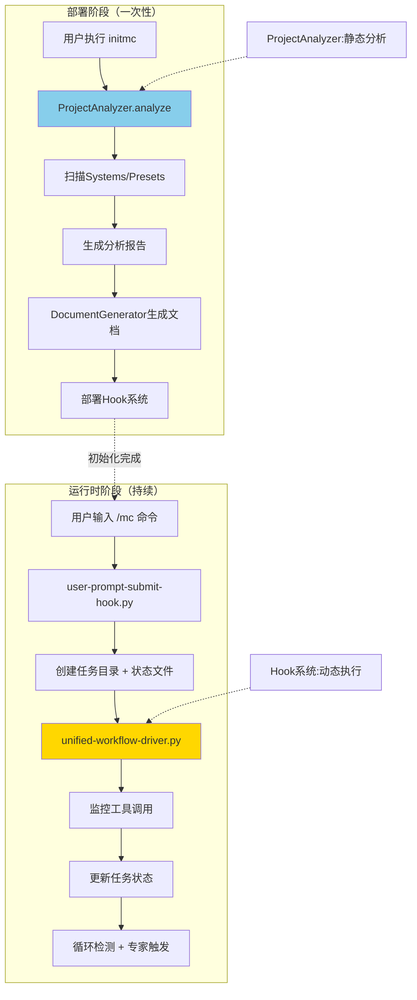

# 项目分析器 (ProjectAnalyzer)

> 模块路径: `lib/analyzer.js`
> 版本: v2.0 (集成自适应项目结构发现)
> 最后更新: 2025-11-14

---

## 📋 模块概述

`ProjectAnalyzer` 是 MODSDK 工作流部署阶段的核心分析引擎，负责扫描和分析项目代码结构，提取关键信息，生成完整的项目分析报告。

### 使用场景

**重要说明**：ProjectAnalyzer仅在**工作流部署阶段**（执行`initmc`命令时）使用，不参与运行时的Hook驱动流程。

- **部署阶段** (`initmc`命令)：
  - 扫描MODSDK项目结构（Systems、Presets）
  - 生成项目分析报告
  - 辅助文档生成器创建初始文档
  - 计算项目规模和复杂度

- **运行时** (v20.x Hook系统)：
  - 不使用ProjectAnalyzer
  - 由`unified-workflow-driver.py`等Python Hook驱动
  - 动态任务追踪由`.task-meta.json`等状态文件管理

### 主要职责

1. **项目类型检测**: 自动识别项目是否为 MODSDK 项目，检测架构特征（Apollo、ECPreset）
2. **代码结构扫描**: 扫描所有 Python 文件，提取 System、Preset 等组件信息
3. **自适应结构发现**: 智能发现自定义组件目录和配置文件
4. **文档覆盖率分析**: 检查现有文档，评估文档完整性
5. **项目规模计算**: 根据 System 数量评估项目规模（small/medium/large）
6. **业务类型推断**: 基于命名模式推断项目类型（RPG、BedWars、General等）

---

## 🏗️ 核心类与方法

### 1. ProjectAnalyzer (主分析器)

#### 构造函数
```javascript
constructor(projectPath)
```
- **参数**: `projectPath` - 项目根目录路径
- **初始化**:
  - `this.metadata` - 项目元数据对象
  - `this.codeStructure` - 代码结构对象
  - `this.docCoverage` - 文档覆盖率对象

#### analyze() - 执行完整分析
```javascript
analyze()
```
- **返回值**: `AnalysisReport` - 完整的分析报告对象
- **执行步骤**:
  1. 检测项目类型 (`_detectProjectType`)
  2. 扫描代码结构 (`_scanCodeStructure`)
  3. 自适应项目结构发现 (`_discoverProjectStructure`) ⭐ v2.0新增
  4. 检查现有文档 (`_checkDocumentation`)
  5. 计算项目规模 (`_calculateProjectScale`)

#### _detectProjectType() - 检测项目类型
```javascript
_detectProjectType()
```
- **检测方式**:
  - 方式1: 查找 `modMain.py` 文件
  - 方式2: 检测 `behavior_packs/` 目录（网易地图）
  - 方式3: 检测 `deploy.json` 文件（Apollo架构）
  - 方式4: 检测 `.mcs/` 目录（网易开发工具）
- **设置属性**:
  - `metadata.projectName` - 项目名称
  - `metadata.usesApollo` - 是否使用Apollo架构
  - `metadata.usesEcpreset` - 是否使用ECPreset框架
  - `metadata.businessType` - 业务类型

#### _scanCodeStructure() - 扫描代码结构
```javascript
_scanCodeStructure()
```
- **扫描目标**:
  - 所有 `.py` 文件
  - System 类（ServerSystem、ClientSystem）
  - Preset 类（ECPresetDefinition）
- **正则模式**:
  ```javascript
  // System类检测
  /class\s+(\w+)\s*\(\s*(ServerSystem|ClientSystem)\s*\)/g

  // Preset类检测
  /class\s+(\w+)\s*\(\s*ECPresetDefinition\s*\)/g
  ```

#### _discoverProjectStructure() - 自适应结构发现 ⭐ v2.0
```javascript
_discoverProjectStructure()
```
- **功能**: 使用 `ProjectDiscovery` 模块智能发现项目中的自定义组件
- **发现内容**:
  - 自定义组件目录（如 `states/`, `handlers/`, `managers/`）
  - 配置文件目录（如 `configs/`, `data/`）
- **存储位置**: `codeStructure.discoveredComponents`

#### _analyzePythonFile(filePath) - 分析单个文件
```javascript
_analyzePythonFile(filePath)
```
- **参数**: `filePath` - Python文件路径
- **功能**: 解析文件内容，提取类定义和方法信息

#### _inferBusinessType() - 推断业务类型
```javascript
_inferBusinessType()
```
- **返回值**: 业务类型字符串（`'RPG' | 'BedWars' | 'SkyWars' | 'General'`）
- **推断依据**: 基于 System 命名中的关键词匹配
- **关键词映射** (来自 `config.js`):
  ```javascript
  PROJECT_TYPE_KEYWORDS = {
    'RPG': ['item', 'equipment', 'skill', 'npc', 'quest', 'attribute'],
    'BedWars': ['bed', 'team', 'generator', 'shop', 'trap'],
    'SkyWars': ['sky', 'chest', 'cage', 'kit'],
    // ...
  }
  ```

---

### 2. ProjectMetadata (项目元数据)

```javascript
class ProjectMetadata {
  isModsdk: boolean      // 是否为MODSDK项目
  projectName: string    // 项目名称
  modMainPath: string    // modMain.py路径
  usesApollo: boolean    // 是否使用Apollo
  usesEcpreset: boolean  // 是否使用ECPreset
  businessType: string   // 业务类型
  scale: string         // 项目规模 (small/medium/large)
}
```

---

### 3. CodeStructure (代码结构)

```javascript
class CodeStructure {
  systems: Object       // {systemName: SystemInfo}
  presets: Object       // {presetName: PresetInfo}
  dependencies: Object  // {systemName: [依赖的system]}
  discoveredComponents: Object  // v2.0新增: 自适应发现的组件
}
```

**方法**:
- `addSystem(name, filePath, type, content)` - 添加System信息
- `addPreset(name, filePath, content)` - 添加Preset信息

---

### 4. SystemInfo (System详细信息)

```javascript
class SystemInfo {
  name: string          // System名称
  filePath: string      // 文件路径
  type: string         // ServerSystem / ClientSystem
  content: string      // 文件内容
  linesOfCode: number  // 代码行数
  methodCount: number  // 方法数量
  eventListeners: number  // 事件监听数量
  complexityScore: number  // 复杂度分数 (0-10+)
}
```

#### _calculateComplexity() - 计算复杂度
```javascript
_calculateComplexity()
```
- **评分因素**:
  1. **代码行数**: >500行 (+3分), >200行 (+2分), 其他 (+1分)
  2. **方法数量**: >15个 (+2分), >5个 (+1分)
  3. **事件监听**: >5个 (+1分)
  4. **核心System判断**: 包含 `core/manager/game/state/main` 关键词 (+2分)
  5. **依赖关系**: >5个import (+2分), >2个import (+1分)

#### getDetailLevel() - 获取推荐文档详细度
```javascript
getDetailLevel()
```
- **返回值**: `'detailed' | 'medium' | 'simple'`
- **阈值** (来自 `config.js`):
  ```javascript
  COMPLEXITY_THRESHOLDS = {
    detailed: 7,  // ≥7分: 详细文档
    medium: 4     // ≥4分: 中等文档, <4分: 简单文档
  }
  ```

---

### 5. AnalysisReport (分析报告)

```javascript
class AnalysisReport {
  metadata: ProjectMetadata
  codeStructure: CodeStructure
  docCoverage: DocumentationCoverage
}
```

#### toMarkdown() - 生成Markdown报告
```javascript
toMarkdown()
```
- **返回值**: Markdown格式的分析报告
- **报告内容**:
  1. 项目概况（名称、类型、规模、架构特征）
  2. 代码结构（Systems/Presets数量）
  3. Systems清单（按复杂度排序，前10个）
  4. 文档覆盖率
  5. 预计生成文档（Layer 1/2/3）
  6. 预估消耗（Token、执行时间）

---

## 💡 使用示例

**注意**：以下示例展示的是ProjectAnalyzer的编程API用法，主要用于工作流开发者。普通用户只需执行`initmc`命令即可，无需直接调用这些API。

### 示例1: 基础项目分析（initmc内部调用）
```javascript
const { ProjectAnalyzer } = require('./lib/analyzer');

// 创建分析器实例
const analyzer = new ProjectAnalyzer('D:/MyProject');

// 执行分析
const report = analyzer.analyze();

// 输出Markdown报告
console.log(report.toMarkdown());
```

**输出示例**:
```
[分析器] 开始分析项目...
[分析器] 项目路径: D:/MyProject
[分析器] 检测项目类型...
[分析器] 检测到modMain.py: D:/MyProject/behavior_packs/mymod/modMain.py
[分析器] 项目: MyProject
[分析器] 检测到ECPreset框架
[分析器] 项目类型: BedWars
[分析器] 扫描代码结构...
[分析器] 发现 25 个Python文件
[分析器] 发现 12 个Systems
[分析器] 发现 5 个Presets
[分析器] 执行自适应结构发现...
[分析器] 发现 3 个自定义组件目录
[分析器] 发现 2 个配置文件目录
[分析器] 检查现有文档...
[分析器] 发现 8 个现有文档
[分析器] 项目规模: medium (12 Systems)
[分析器] 分析完成
```

### 示例2: 访问分析结果
```javascript
const report = analyzer.analyze();

// 访问元数据
console.log(`项目名称: ${report.metadata.projectName}`);
console.log(`业务类型: ${report.metadata.businessType}`);
console.log(`项目规模: ${report.metadata.scale}`);

// 访问代码结构
const systems = Object.values(report.codeStructure.systems);
console.log(`System总数: ${systems.length}`);

// 找出高复杂度的Systems
const complexSystems = systems.filter(s => s.complexityScore >= 7);
console.log(`高复杂度Systems: ${complexSystems.length}个`);

// 按复杂度排序
const sortedSystems = systems.sort((a, b) => b.complexityScore - a.complexityScore);
console.log('最复杂的System:', sortedSystems[0].name);
console.log('复杂度分数:', sortedSystems[0].complexityScore);
console.log('推荐详细度:', sortedSystems[0].getDetailLevel());

// 访问发现的组件 (v2.0)
const discovered = report.codeStructure.discoveredComponents;
if (discovered) {
  console.log('自定义组件:', Object.keys(discovered.customComponents));
  console.log('配置文件:', Object.keys(discovered.configFiles));
}
```

### 示例3: 集成到工作流（init-workflow.js实际代码）
```javascript
const { ProjectAnalyzer } = require('./lib/analyzer');
const { DocumentGenerator } = require('./lib/generator');

// 1. 分析项目（在initmc命令中执行）
const analyzer = new ProjectAnalyzer(projectPath);
const report = analyzer.analyze();

// 2. 根据分析结果生成文档
const generator = new DocumentGenerator(report, upstreamPath);
await generator.generateAll(projectPath, {
  minimalMode: false
});

// 3. 输出统计信息
console.log(`✅ 已为 ${Object.keys(report.codeStructure.systems).length} 个Systems生成文档`);
console.log(`✅ 已为 ${Object.keys(report.codeStructure.presets).length} 个Presets生成文档`);
```

**重要说明**：
- 上述流程仅在**首次部署**（`initmc`）时执行一次
- 后续AI对话中，由**Hook系统**（unified-workflow-driver.py等）接管
- Hook系统不依赖ProjectAnalyzer，而是读取`.task-meta.json`等状态文件

---

## 🏛️ 架构定位说明

### ProjectAnalyzer在工作流生命周期中的位置



**关键区别**：
- **ProjectAnalyzer**：属于**部署时静态分析**，生成初始文档结构
- **Hook系统**：属于**运行时动态执行**，响应AI对话过程中的操作

---

## 📊 分析流程图

### ProjectAnalyzer内部执行流程 (Mermaid)


### 复杂度计算逻辑


---

## 🔗 相关类图


---

## ⚙️ 配置常量 (来自 config.js)

```javascript
// 项目规模阈值
SCALE_THRESHOLDS = {
  small: 5,   // ≤5个Systems: 小型项目
  medium: 15  // ≤15个Systems: 中型项目, >15: 大型项目
}

// 复杂度阈值
COMPLEXITY_THRESHOLDS = {
  detailed: 7,  // ≥7分: 详细文档
  medium: 4     // ≥4分: 中等文档
}

// 项目类型关键词
PROJECT_TYPE_KEYWORDS = {
  'RPG': ['item', 'equipment', 'skill', 'npc', 'quest', 'attribute'],
  'BedWars': ['bed', 'team', 'generator', 'shop', 'trap'],
  'SkyWars': ['sky', 'chest', 'cage', 'kit'],
  'SurvivalGames': ['supply', 'feast', 'deathmatch'],
  'Parkour': ['checkpoint', 'timer', 'record']
}
```

---

## 🎯 最佳实践

1. **分析前准备**: 确保项目路径正确，且包含 Python 源代码文件
2. **错误处理**: 使用 try-catch 捕获文件读取失败的情况
3. **性能优化**: 对于大型项目（>100个文件），考虑使用缓存机制
4. **扩展性**: 可通过修改正则表达式支持更多组件类型
5. **日志输出**: 保留控制台日志，便于调试和追踪分析过程

---

## 📚 依赖模块

- `fs` - 文件系统操作
- `path` - 路径处理
- `./utils` - 工具函数（walkDir, findFile, readFile）
- `./config` - 配置常量
- `./project-discovery` - 项目结构发现（v2.0）

---

## 🔄 版本历史

- **v2.0** (当前): 集成自适应项目结构发现
- **v1.0**: 基础分析功能

---

## 🔗 相关模块

### 部署阶段模块
- **init-workflow.js**: 调用ProjectAnalyzer执行项目分析
- **generator.js**: 基于分析报告生成文档
- **project-discovery.js**: 自适应结构发现（v2.0）

### 运行时Hook系统（v20.x）
- **unified-workflow-driver.py**: 统一工作流驱动器
- **user-prompt-submit-hook.py**: 任务初始化与玩法包匹配
- **.task-meta.json**: 运行时任务状态追踪

**区别说明**：
- ProjectAnalyzer属于**静态分析**模块，在部署时一次性执行
- Hook系统属于**动态执行**模块，在AI对话过程中实时响应

---

**文档元数据**:
- 作者: MODSDK工作流团队
- 最后更新: 2025-11-14 (v20.2.10)
- 相关文档: [文档生成器.md](./文档生成器.md), [智能文档维护.md](./智能文档维护.md), [Hook机制.md](./Hook机制.md)
