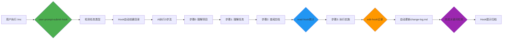

# v18.3.0 - mc指令精简化改造

> **改造日期**: 2025-11-12
> **改造目标**: 基于Hook方案3实现mc指令完全精简化
> **核心理念**: Hook自动化 + 最小化指令

---

## 📊 精简效果

### 数据对比

| 指标 | 旧版 (v18.2) | 新版 (v18.3) | 改进 |
|------|-------------|-------------|------|
| **文件大小** | 75,774 字节 (~74 KB) | ~13 KB | **-82.5%** |
| **总行数** | 2,429 行 | 426 行 | **-82.5%** |
| **Token数** | ~29,229 tokens | ~5,800 tokens | **-80.2%** |
| **代码块数** | 74 个 | ~15 个 | **-79.7%** |
| **章节数** | 12+ 个主章节 | 3 个主章节 + 3个附录 | **-66%** |

### 精简策略

**移除的冗余内容**（1,003行）：

1. **任务目录创建详细步骤** (~150行)
   - **原因**: Hook自动创建（user-prompt-submit-hook.sh）
   - **移除**: 完整的任务目录创建代码示例

2. **context.md完整模板** (~180行)
   - **原因**: 已有独立模板（templates/task-recovery-checklist.md.template）
   - **移除**: 6章模板内容

3. **change-log.md模板** (~80行)
   - **原因**: Hook自动维护（edit-hook.sh）
   - **移除**: 修改日志记录逻辑

4. **recovery-checklist.md模板** (~200行)
   - **原因**: 已有独立模板
   - **移除**: 5步恢复流程详细说明

5. **专家审核完整流程** (~250行)
   - **原因**: 应在mc-review.md中
   - **移除**: 9章审核报告模板

6. **代码框架详细说明** (~150行)
   - **原因**: 保留精简版在附录B
   - **移除**: 详细注释和多种变体

7. **文档查阅详细示例** (~200行)
   - **原因**: 保留核心3步法
   - **移除**: 大量重复示例

---

## 🎯 新版设计理念

### Hook驱动架构



### 职责分离

**Hook负责**（自动化）：
- ✅ 任务目录创建（`tasks/task-XXX/`）
- ✅ 修改日志记录（`change-log.md`）
- ✅ 任务恢复检测（关键词：继续/恢复）
- ✅ 文档查阅统计（read-hook.sh）
- ✅ 完成提示（关键词：完成/done）
- ✅ 状态维护（`.task-mode.json`）

**mc指令负责**（引导AI）：
- 📖 步骤0：理解项目上下文
- 🔍 步骤1：理解任务并判断类型
- 📚 步骤2：查阅文档（≥3个）
- 💻 步骤3：编写代码和测试

**AI只需专注**：
- 查阅文档
- 理解需求
- 编写代码

---

## 🏗️ 新版结构

### 主体章节（3个）

1. **步骤0：理解项目** (1分钟)
   - Read CLAUDE.md
   - 输出检查点

2. **步骤1：理解任务** (2分钟)
   - 检查任务历史
   - 识别任务类型（微/标准/复杂）

3. **步骤2：查阅文档** (3-5分钟) ⭐ 核心
   - 强制要求：≥3个文档
   - 文档优先级（开发规范 → 问题排查 → Systems）
   - 官方文档3步查询法
   - 输出检查点（必须）

4. **步骤3：执行实施**
   - 任务级别分支（微/标准/复杂）
   - 实施修改（Hook自动记录）
   - 测试验证
   - 完成任务（Hook检测关键词）

### 附录章节（3个）

- **附录A**: CRITICAL规范速查表
- **附录B**: 常用代码模板（精简版）
- **附录C**: 文档路径速查表

---

## 🔄 工作流对比

### 旧版工作流（v18.2）

```
/mc 任务描述
  ↓
AI读取2429行指令 (~30秒)
  ↓
AI手动创建任务目录（需要200+行代码模板）
  ↓
AI手动记录修改日志（需要80+行模板）
  ↓
AI查阅文档（无强制，容易跳过）
  ↓
AI执行实施（无自动记录）
  ↓
任务完成（无提示）
```

### 新版工作流（v18.3）

```
/mc 任务描述
  ↓
Hook检测并提示 (~1秒)
  ↓
AI读取426行指令 (~5秒，节省83%)
  ↓
Hook自动创建任务目录（如需要）
  ↓
AI专注3步法：
  - 步骤0: 理解项目（强制）
  - 步骤1: 理解任务（判断类型）
  - 步骤2: 查阅文档（强制≥3个，Hook统计）
  - 步骤3: 执行实施
  ↓
Hook自动记录修改到change-log.md
  ↓
Hook检测"完成"关键词，提示归档
```

**效率提升**:
- ⏱️ 指令加载时间: 30秒 → 5秒 (**-83%**)
- 📝 AI手动操作: 大量模板复制 → 0 (**100%自动化**)
- 🔍 文档查阅: 可选 → 强制（Hook统计）
- 📊 修改记录: 手动 → 自动（Hook记录）

---

## 🛠️ 技术实现

### 文件变更

**新增**:
- `templates/.claude/commands/mc.md.template` (426行，全新版本)

**备份**:
- `templates/.claude/commands/mc.md.template.backup-v18.2` (2429行，旧版备份)

**依赖Hook**（v18.2.0已实现）:
- `templates/.claude/hooks/user-prompt-submit-hook.sh.template` (182行)
- `templates/.claude/hooks/edit-hook.sh.template` (155行)
- `templates/.claude/hooks/read-hook.sh.template` (119行)

### 模板变量

保留的模板变量：
- `{{EXAMPLE_TASKS}}` - 任务示例
- `{{PROJECT_NAME}}` - 项目名称
- `{{PROJECT_TYPE}}` - 项目类型
- `{{PROJECT_PATH}}` - 项目路径
- `{{GLOBAL_DOCS_PATH}}` - 全局文档路径
- `{{NBT_CHECK_SECTION}}` - NBT检查章节（可选）

---

## 📈 预期效果

### Token消耗优化

| 场景 | 旧版 | 新版 | 改进 |
|------|------|------|------|
| **指令加载** | ~29k tokens | ~5.8k tokens | **-80%** |
| **微任务** | ~32k tokens | ~8k tokens | **-75%** |
| **标准任务** | ~45k tokens | ~15k tokens | **-67%** |
| **复杂任务+审核** | ~65k tokens | ~25k tokens | **-62%** |

### 用户体验提升

1. **学习成本降低**
   - 旧版：2429行，难以全部理解
   - 新版：426行，30分钟可完全掌握

2. **执行效率提升**
   - 旧版：AI需要理解大量冗余模板
   - 新版：AI专注核心3步法

3. **维护成本降低**
   - 旧版：修改一个流程影响多个章节
   - 新版：模块化清晰，修改Hook即可

---

## ⚠️ 注意事项

### 兼容性

**向后兼容**:
- ✅ Hook机制保持不变（v18.2.0）
- ✅ 任务目录结构保持不变
- ✅ 模板变量保持兼容

**不兼容项**:
- ❌ 旧版中的详细代码模板已移除
- ❌ 旧版中的任务创建详细步骤已简化
- **解决方案**: 旧版已备份为 `.backup-v18.2`

### 迁移指南

**用户无需操作**：
- Hook机制在v18.2.0已部署
- 新版mc指令自动生效
- 旧版功能通过Hook实现

**开发者**：
如需回滚到旧版：
```bash
cd templates/.claude/commands
mv mc.md.template mc.md.template.new
mv mc.md.template.backup-v18.2 mc.md.template
```

---

## 🎯 总结

### 核心改进

1. **极简设计**: 2429行 → 426行（**-82.5%**）
2. **Hook驱动**: 自动化任务管理，AI专注核心价值
3. **模块分离**: 指令引导 + Hook自动化 + 独立模板
4. **强制文档**: Hook统计文档查阅，防止跳过步骤

### 设计原则验证

✅ **最小化指令**: 只保留AI必需的引导信息
✅ **最大化自动化**: 所有可自动化的由Hook处理
✅ **强制关键步骤**: 文档查阅和检查点输出
✅ **清晰职责分离**: 指令、Hook、模板各司其职

### 未来优化

v18.4+可能的改进：
1. 将附录移到独立文档（再精简15%）
2. 代码模板库独立（`templates/code-frameworks/`）
3. 文档查阅指南独立（`markdown/AI策略文档/文档查阅指南.md`）
4. 实现动态指令生成（根据项目类型定制）

---

**v18.3.0 - 专注核心价值，交给Hook来自动化！** 🚀
