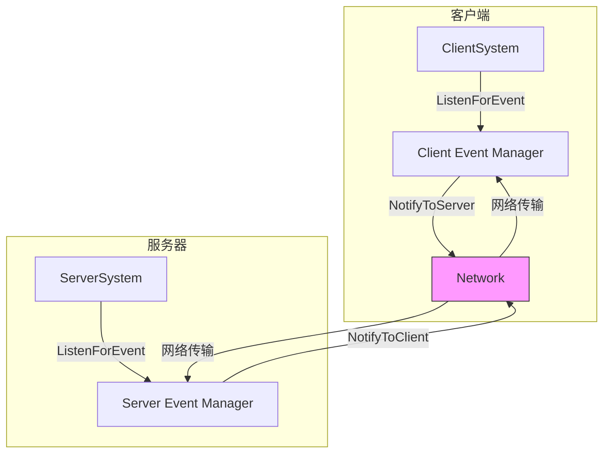

# 事件系统完整参考

> 📡 **深入理解MODSDK事件驱动架构**
>
> 本文档详细讲解MODSDK事件系统的工作原理、最佳实践和性能优化策略
>
> **版本**: v1.0
> **最后更新**: 2025-11-11

---

## 目录

1. [事件系统概述](#一事件系统概述)
2. [事件类型分类](#二事件类型分类)
3. [事件监听与通知](#三事件监听与通知)
4. [事件优先级机制](#四事件优先级机制)
5. [事件数据规范](#五事件数据规范)
6. [网络事件优化](#六网络事件优化)
7. [性能优化建议](#七性能优化建议)
8. [常见错误与陷阱](#八常见错误与陷阱)
9. [最佳实践清单](#九最佳实践清单)

---

## 一、事件系统概述

### 1.1 什么是事件系统?

MODSDK采用**事件驱动架构**（Event-Driven Architecture），通过发布-订阅模式实现模块间的松耦合通信。

**核心组件**:
```
┌─────────────┐     ListenForEvent      ┌──────────────┐
│   System A  │ ───────────────────────> │ Event Manager│
│  (订阅者)   │                          │  (事件管理器) │
└─────────────┘                          └──────────────┘
                                              │ 分发事件
      ┌───────────────────────────────────────┘
      │
      v
┌─────────────┐     NotifyToServer      ┌──────────────┐
│   System B  │ <────────────────────── │ Event Manager│
│  (处理器)   │                          │              │
└─────────────┘                          └──────────────┘
```

**为什么使用事件系统?**

1. **解耦模块**: System之间不需要直接引用,通过事件通信
2. **扩展性**: 添加新监听器无需修改发送方代码
3. **跨端通信**: 通过`NotifyToServer`/`NotifyToClient`实现双端交互
4. **异步处理**: 事件处理不阻塞游戏主循环

---

### 1.2 事件系统架构



---

## 二、事件类型分类

### 2.1 引擎事件

**定义**: 由Minecraft引擎自动触发的事件（不需要手动NotifyToServer）

**特点**:
- ✅ 自动触发,无需手动通知
- ✅ 性能开销低（引擎级优化）
- ⚠️ 部分事件仅在特定条件下触发

**常见引擎事件**:

| 事件名称 | 触发时机 | 端 | 常见用途 |
|---------|---------|-----|---------|
| `ServerPlayerTryDestroyBlockEvent` | 玩家尝试破坏方块 | 服务器 | 领地保护 |
| `AddPlayerCreatedEvent` | 玩家加入服务器 | 服务器 | 初始化玩家数据 |
| `OnScriptTickServer` | 每游戏Tick | 服务器 | 定时任务 |
| `ClientItemUseAfterEvent` | 物品使用后 | 客户端 | UI交互 |
| `DamageEvent` | 实体受伤 | 服务器 | 伤害计算 |

**使用示例**:
```python
def __init__(self):
    # 监听引擎事件 - 无需priorityLevel参数
    self.ListenForEvent(
        serverApi.GetEngineNamespace(),  # 引擎命名空间
        serverApi.GetEngineSystemName(), # 引擎系统名
        'AddPlayerCreatedEvent',         # 事件名
        self,                            # 监听者
        self.OnPlayerJoin                # 回调函数
    )

def OnPlayerJoin(self, args):
    playerId = args['playerId']
    print "Player joined:", playerId
```

---

### 2.2 自定义事件

**定义**: 开发者在System之间手动定义和触发的事件

**特点**:
- ⚠️ 需要手动NotifyToServer/NotifyToClient
- ⚠️ 性能开销取决于事件频率和数据大小
- ✅ 灵活性高,可自定义事件结构

**命名规范**:
```
{功能模块}_{操作}Event

✅ 正确示例:
- Shop_BuyItemEvent          # 商店购买物品
- VIP_LevelUpEvent           # VIP升级
- Quest_CompleteEvent        # 任务完成

❌ 错误示例:
- buyItem                    # 缺少模块前缀
- SHOP_BUY_ITEM_EVENT        # 全大写（不符合Python规范）
- shop:buy                   # 使用特殊字符
```

**使用示例**:
```python
# 服务器端 - 监听自定义事件
def __init__(self):
    self.ListenForEvent(
        'MyMod',               # 你的Mod命名空间
        'ShopSystem',          # 发送方System名
        'Shop_BuyItemEvent',   # 自定义事件名
        self,
        self.OnShopBuy
    )

def OnShopBuy(self, args):
    playerId = args['playerId']
    itemId = args['itemId']
    # 处理购买逻辑

# 发送方 - 触发自定义事件
def BuyItem(self, playerId, itemId):
    self.NotifyToServer('Shop_BuyItemEvent', {
        'playerId': playerId,
        'itemId': itemId,
        'price': 100
    })
```

---

### 2.3 双端通信事件

**定义**: 用于客户端-服务器通信的特殊事件类型

**核心API**:

| API | 方向 | 用途 |
|-----|------|------|
| `NotifyToServer(eventName, data)` | 客户端→服务器 | 发送客户端输入、UI操作 |
| `NotifyToClient(playerId, eventName, data)` | 服务器→客户端 | 推送游戏状态、更新UI |
| `BroadcastToAllClient(eventName, data)` | 服务器→所有客户端 | 全局广播（如世界事件）|

**使用场景**:

```python
# 场景1: 客户端发送操作到服务器
class ShopClientSystem(ClientSystem):
    def OnClickBuyButton(self, itemId):
        # 客户端只负责UI交互,不处理业务逻辑
        self.NotifyToServer('Shop_RequestBuyEvent', {
            'itemId': itemId
        })

# 场景2: 服务器验证后通知客户端
class ShopServerSystem(ServerSystem):
    def __init__(self):
        self.ListenForEvent('MyMod', 'ShopClientSystem', 'Shop_RequestBuyEvent', self, self.OnBuyRequest)

    def OnBuyRequest(self, args):
        playerId = args['playerId']  # 自动附加的发送者ID
        itemId = args['itemId']

        # 服务器验证逻辑
        if self.CheckMoney(playerId, itemId):
            self.DeductMoney(playerId, itemId)
            self.GiveItem(playerId, itemId)

            # 通知客户端购买成功
            self.NotifyToClient(playerId, 'Shop_BuySuccessEvent', {
                'itemId': itemId,
                'newBalance': self.GetMoney(playerId)
            })
        else:
            # 通知客户端余额不足
            self.NotifyToClient(playerId, 'Shop_BuyFailedEvent', {
                'reason': 'insufficient_balance'
            })

# 场景3: 广播全局事件
class WorldEventServerSystem(ServerSystem):
    def OnBossKilled(self, bossId):
        # 广播给所有在线玩家
        self.BroadcastToAllClient('World_BossKilledEvent', {
            'bossId': bossId,
            'killerName': 'Steve'
        })
```

---

## 三、事件监听与通知

### 3.1 ListenForEvent详解

**完整签名**:
```python
ListenForEvent(namespace, systemName, eventName, instance, callback, priorityLevel=0)
```

**参数说明**:

| 参数 | 类型 | 必填 | 说明 |
|------|------|------|------|
| `namespace` | str | ✅ | 事件命名空间（引擎事件用`GetEngineNamespace()`）|
| `systemName` | str | ✅ | 发送方System名（引擎事件用`GetEngineSystemName()`）|
| `eventName` | str | ✅ | 事件名称 |
| `instance` | object | ✅ | 回调函数所属实例（通常是`self`）|
| `callback` | function | ✅ | 事件处理回调函数 |
| `priorityLevel` | int | ❌ | 优先级（0-10，默认0，**仅用于自定义事件**）|

**重要提示**:
- ⚠️ 引擎事件**不支持**`priorityLevel`参数,传入会报错
- ⚠️ 自定义事件才需要优先级控制

---

### 3.2 取消监听

**何时需要取消监听?**
- System被销毁时（避免内存泄漏）
- 临时监听器（如一次性任务）
- 条件监听器（满足条件后停止）

**API**: `UnListenForEvent(namespace, systemName, eventName, instance, callback)`

**示例**:
```python
def __init__(self):
    # 监听玩家死亡事件
    self.deathCallback = self.OnPlayerDeath
    self.ListenForEvent('Minecraft', 'MyMod', 'PlayerDeathEvent', self, self.deathCallback)

def OnPlayerDeath(self, args):
    playerId = args['playerId']
    # 处理死亡逻辑

    # 只触发一次,然后取消监听
    self.UnListenForEvent('Minecraft', 'MyMod', 'PlayerDeathEvent', self, self.deathCallback)

def Destroy(self):
    # System销毁时取消所有监听
    self.UnListenAllEvents()  # 推荐使用
```

---

## 四、事件优先级机制

### 4.1 优先级规则

**优先级范围**: 0-10（数字越大,优先级越高）

**执行顺序**:
```
优先级10 (最先执行)
  ↓
优先级5
  ↓
优先级0 (默认,最后执行)
```

**使用场景**:

| 优先级 | 使用场景 | 示例 |
|--------|---------|------|
| **10** | 权限验证、反作弊 | 检查玩家是否被封禁 |
| **8-9** | 数据预处理 | 事件数据格式化 |
| **5-7** | 核心业务逻辑 | 商店购买、任务完成 |
| **3-4** | 后处理 | 日志记录、统计 |
| **0-2** | UI更新、通知 | 显示提示信息 |

---

### 4.2 优先级最佳实践

**示例: 商店购买事件**

```python
# 优先级10: 权限验证
class AntiCheatSystem(ServerSystem):
    def __init__(self):
        self.ListenForEvent('MyMod', 'ShopSystem', 'Shop_BuyItemEvent', self, self.CheckPermission, priorityLevel=10)

    def CheckPermission(self, args):
        playerId = args['playerId']
        if self.IsBanned(playerId):
            return False  # 中断事件传播
        return True

# 优先级5: 核心业务逻辑
class ShopServerSystem(ServerSystem):
    def __init__(self):
        self.ListenForEvent('MyMod', 'ShopSystem', 'Shop_BuyItemEvent', self, self.ProcessBuy, priorityLevel=5)

    def ProcessBuy(self, args):
        playerId = args['playerId']
        itemId = args['itemId']
        # 扣除金币、给予物品
        self.DeductMoney(playerId, 100)
        self.GiveItem(playerId, itemId)

# 优先级0: 日志记录
class LogSystem(ServerSystem):
    def __init__(self):
        self.ListenForEvent('MyMod', 'ShopSystem', 'Shop_BuyItemEvent', self, self.LogPurchase, priorityLevel=0)

    def LogPurchase(self, args):
        playerId = args['playerId']
        itemId = args['itemId']
        print "[Log] Player {} bought item {}".format(playerId, itemId)
```

**警告**:
- ❌ 不要所有监听器都设置高优先级（会导致执行顺序混乱）
- ❌ 不要在高优先级监听器中执行耗时操作（会阻塞后续监听器）

---

## 五、事件数据规范

### 5.1 支持的数据类型

**✅ 允许的类型**:
```python
{
    'int_value': 123,                    # 整数
    'float_value': 3.14,                 # 浮点数
    'string_value': "Hello",             # 字符串
    'bool_value': True,                  # 布尔值
    'list_value': [1, 2, 3],             # 列表
    'dict_value': {'key': 'value'},      # 字典
    'none_value': None                   # None值
}
```

**❌ 禁止的类型**:
```python
{
    'tuple_value': (1, 2, 3),            # ❌ 元组（会序列化失败）
    'set_value': {1, 2, 3},              # ❌ 集合
    'object_value': MyClass(),           # ❌ 自定义对象
    'function_value': lambda x: x+1      # ❌ 函数
}
```

---

### 5.2 数据大小限制

**网络事件数据限制**:
- 单个事件数据不超过**64KB**（建议<10KB）
- 避免传输大量玩家列表（使用分页或ID列表）
- 避免嵌套层级过深（建议≤3层）

**性能对比**:

| 数据大小 | 网络延迟 | 序列化耗时 | 建议 |
|---------|---------|-----------|------|
| <1KB | ~5ms | ~0.1ms | ✅ 推荐 |
| 1-10KB | ~15ms | ~1ms | ⚠️ 可接受 |
| 10-64KB | ~50ms | ~10ms | ❌ 避免 |
| >64KB | 失败 | 失败 | ❌ 禁止 |

**优化示例**:
```python
# ❌ 错误: 传输完整玩家列表
self.NotifyToClient(playerId, 'Leaderboard_UpdateEvent', {
    'players': [
        {'id': 'player1', 'name': 'Alice', 'score': 1000, 'level': 50, ...},
        {'id': 'player2', 'name': 'Bob', 'score': 900, 'level': 45, ...},
        # ... 100个玩家数据
    ]
})

# ✅ 正确: 只传输必要数据 + 分页
self.NotifyToClient(playerId, 'Leaderboard_UpdateEvent', {
    'top10': [
        {'id': 'player1', 'score': 1000},  # 只传ID和分数
        {'id': 'player2', 'score': 900},
        # ... 最多10条
    ],
    'page': 1,
    'total': 100
})
```

---

## 六、网络事件优化

### 6.1 事件压缩机制

**原理**: MODSDK自动将事件名压缩为短索引,减少网络流量

**工作流程**:
```
首次发送事件:
Client → Server: "MyMod:ShopSystem:Shop_BuyItemEvent" (完整字符串, ~40字节)
Server → Client: 注册索引映射 {完整名称 → 索引123}

后续发送:
Client → Server: 索引123 (整数, ~2字节)
```

**性能提升**:
- 事件名从40字节压缩到2字节（**95%流量节省**）
- 高频事件（如移动、攻击）效果显著

**开发者无需关心此机制**（引擎自动优化）

---

### 6.2 批量事件优化

**场景**: 需要向多个玩家发送相同事件

**❌ 低效写法**:
```python
def NotifyAllPlayers(self, eventData):
    for playerId in self.GetAllPlayers():
        # 每次调用都会序列化一次数据
        self.NotifyToClient(playerId, 'MyEvent', eventData)
```

**✅ 高效写法**:
```python
def NotifyAllPlayers(self, eventData):
    # 一次序列化,广播给所有客户端
    self.BroadcastToAllClient('MyEvent', eventData)
```

**性能对比** (100个玩家):
- 单独发送: 100次序列化 ≈ 100ms
- 批量广播: 1次序列化 ≈ 1ms (**100倍提升**)

---

## 七、性能优化建议

### 7.1 减少事件频率

**问题**: 高频事件（如每帧触发）会严重影响性能

**❌ 错误示例**:
```python
def Update(self):
    # 每帧（60fps）都发送玩家位置
    self.NotifyToServer('Player_PositionEvent', {
        'x': self.GetPlayerPos()[0],
        'y': self.GetPlayerPos()[1],
        'z': self.GetPlayerPos()[2]
    })
    # 结果: 60次/秒 × 40字节 = 2.4KB/秒/玩家
```

**✅ 正确示例**:
```python
def __init__(self):
    self.tick_counter = 0

def Update(self):
    self.tick_counter += 1
    # 每20帧（约0.33秒）发送一次
    if self.tick_counter % 20 == 0:
        self.NotifyToServer('Player_PositionEvent', {
            'x': self.GetPlayerPos()[0],
            'y': self.GetPlayerPos()[1],
            'z': self.GetPlayerPos()[2]
        })
    # 结果: 3次/秒 × 40字节 = 120字节/秒/玩家 (节省95%流量)
```

---

### 7.2 事件监听器数量限制

**建议**:
- 单个事件监听器数量不超过**20个**
- System总监听事件数量不超过**50个**

**检查工具**:
```python
def Destroy(self):
    # 销毁前检查监听器数量
    listener_count = len(self.GetAllListeners())
    if listener_count > 50:
        print "[Warning] Too many listeners:", listener_count
```

---

### 7.3 避免事件循环

**问题**: 事件A触发事件B,事件B又触发事件A

**❌ 危险示例**:
```python
# System A
def OnEventB(self, args):
    self.NotifyToServer('EventA', {})  # 触发EventA

# System B
def OnEventA(self, args):
    self.NotifyToServer('EventB', {})  # 触发EventB → 无限循环
```

**✅ 解决方案**:
```python
def __init__(self):
    self.is_processing = False  # 防重入标志

def OnEventB(self, args):
    if self.is_processing:
        return  # 正在处理中,跳过

    self.is_processing = True
    self.NotifyToServer('EventA', {})
    self.is_processing = False
```

---

## 八、常见错误与陷阱

### 错误1: 引擎事件使用priorityLevel参数

```python
# ❌ 错误
self.ListenForEvent(
    serverApi.GetEngineNamespace(),
    serverApi.GetEngineSystemName(),
    'AddPlayerCreatedEvent',
    self,
    self.OnPlayerJoin,
    priorityLevel=5  # ❌ 引擎事件不支持优先级
)

# ✅ 正确
self.ListenForEvent(
    serverApi.GetEngineNamespace(),
    serverApi.GetEngineSystemName(),
    'AddPlayerCreatedEvent',
    self,
    self.OnPlayerJoin
    # 不传priorityLevel参数
)
```

---

### 错误2: 忘记取消监听导致内存泄漏

```python
# ❌ 错误
class TempSystem(ServerSystem):
    def __init__(self):
        self.ListenForEvent('MyMod', 'OtherSystem', 'TempEvent', self, self.OnTemp)

    # 没有Destroy方法取消监听

# ✅ 正确
class TempSystem(ServerSystem):
    def __init__(self):
        self.ListenForEvent('MyMod', 'OtherSystem', 'TempEvent', self, self.OnTemp)

    def Destroy(self):
        self.UnListenAllEvents()  # 取消所有监听
```

---

### 错误3: 事件回调中抛出异常

```python
# ❌ 错误
def OnPlayerJoin(self, args):
    playerId = args['playerId']
    # 如果args中没有'extraData'会抛异常,导致后续监听器无法执行
    extraData = args['extraData']['key']

# ✅ 正确
def OnPlayerJoin(self, args):
    playerId = args['playerId']
    try:
        extraData = args.get('extraData', {}).get('key', None)
        if extraData is None:
            print "[Warning] Missing extraData"
            return
    except Exception as e:
        print "[Error]", e
        return
```

---

## 九、最佳实践清单

### ✅ 监听事件

- [ ] 使用明确的命名空间（避免与其他Mod冲突）
- [ ] 引擎事件不传`priorityLevel`参数
- [ ] 自定义事件按业务重要性设置优先级（0-10）
- [ ] 在`Destroy()`中取消所有监听

### ✅ 通知事件

- [ ] 事件数据大小<10KB
- [ ] 避免传输元组、集合、自定义对象
- [ ] 高频事件使用节流（throttle）减少调用次数
- [ ] 批量通知使用`BroadcastToAllClient`

### ✅ 双端通信

- [ ] 客户端只负责UI交互,不处理业务逻辑
- [ ] 服务器验证所有客户端请求（防作弊）
- [ ] 使用明确的事件名区分客户端/服务器事件
- [ ] 网络事件数据包含必要的上下文（如playerId）

### ✅ 性能优化

- [ ] 高频事件（>10次/秒）使用节流
- [ ] 单个事件监听器数量<20个
- [ ] 避免事件循环（A触发B, B触发A）
- [ ] 使用事件压缩机制（引擎自动）

---

## 十、参考资源

### 官方文档
- **MODSDK事件API**: 参考`.claude/docs/modsdk-wiki/`（本地离线文档）
- **基岩版WIKI**: 参考`.claude/docs/bedrock-wiki/`

### 相关工作流文档
- **开发规范.md**: 双端隔离、System设计规范
- **问题排查.md**: 事件相关常见问题
- **深入理解ECS架构.md**: ECS与事件系统的关系

---

**文档版本**: v1.0
**最后更新**: 2025-11-11
**维护者**: NeteaseMod-Claude工作流
