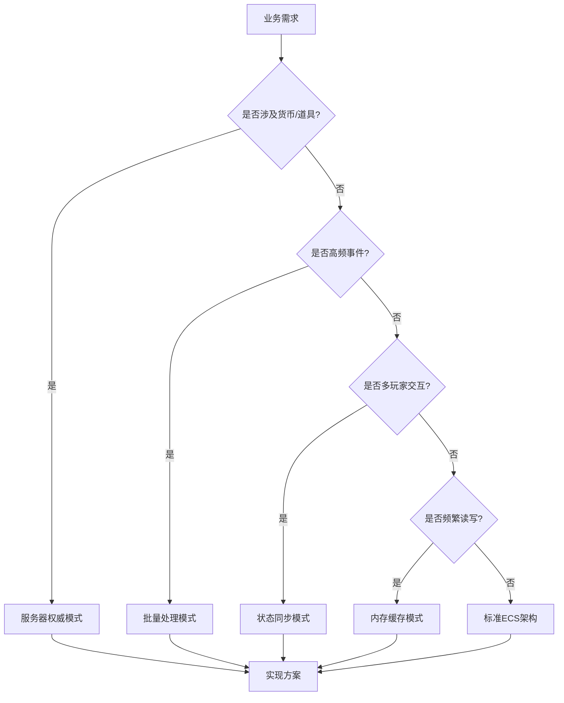

# 业务系统实现案例

> **📍 导航**: [🏠 首页](../README.md) > [📂 文档](../README.md#文档导航) > 业务系统实现案例
>
> **文档说明**: 通过实战案例展示如何使用ECS架构实现复杂业务功能
>
> **📅 最后更新**: 2025-01-11
> **文档版本**: 1.0

---

## 📋 目录

1. [案例概述](#1-案例概述)
2. [案例1：商城系统](#2-案例1商城系统)
3. [案例2：成就系统](#3-案例2成就系统)
4. [案例3：好友系统](#4-案例3好友系统)
5. [架构设计模式总结](#5-架构设计模式总结)
6. [常见问题FAQ](#6-常见问题faq)

---

## 1. 案例概述

### 1.1 学习目标

本文档通过**三个典型业务系统**的完整实现案例，帮助你掌握：

- ✅ 如何将复杂业务需求拆解为ECS架构
- ✅ 如何设计双端协作和数据同步
- ✅ 如何实现可扩展的业务逻辑
- ✅ 如何应用MODSDK开发最佳实践

### 1.2 前置知识

阅读本文档前，建议先学习：

- [开发规范.md](开发规范.md) - CRITICAL规范和双端隔离原则
- [深入理解ECS架构.md](深入理解ECS架构.md) - System/Component/Entity基础
- [事件系统完整参考.md](事件系统完整参考.md) - 事件驱动编程模式
- [网络架构与通信.md](网络架构与通信.md) - 双端通信最佳实践

### 1.3 案例选择标准

本文档选择的三个案例具有以下特点：

| 案例 | 复杂度 | 核心技术点 | 学习价值 |
|------|--------|-----------|---------|
| **商城系统** | ⭐⭐⭐⭐ | 数据同步、交易验证、UI交互 | 学习服务器权威、防作弊 |
| **成就系统** | ⭐⭐⭐ | 事件监听、进度追踪、批量上报 | 学习性能优化、增量同步 |
| **好友系统** | ⭐⭐⭐⭐⭐ | 多玩家交互、实时通知、关系管理 | 学习复杂状态管理 |

---

## 2. 案例1：商城系统

### 2.1 需求分析

**业务需求**：
- 玩家可以使用游戏币购买道具
- 支持商品分类、价格配置、库存管理
- 购买记录持久化存储
- 防止客户端作弊（价格篡改、无限购买）

**技术挑战**：
- ✅ 服务器权威验证（价格、库存、余额）
- ✅ 客户端UI流畅响应
- ✅ 配置热更新（不重启修改商品）
- ✅ 数据持久化（玩家购买历史）

---

### 2.2 架构设计

#### 2.2.1 双端职责划分（基于CRITICAL规范）

```
┌─────────────────────────────────────────────────────────┐
│                    客户端（UI展示）                      │
├─────────────────────────────────────────────────────────┤
│ ShopClientSystem                                        │
│ ├── 监听UI事件（玩家点击购买按钮）                        │
│ ├── 发送购买请求到服务端（NotifyToServer）               │
│ ├── 接收服务端响应（监听PurchaseResultEvent）            │
│ └── 更新UI显示（余额、购买结果提示）                      │
│                                                         │
│ ShopUIComponent                                         │
│ └── 存储UI状态（当前选中商品ID、页码等）                  │
└─────────────────────────────────────────────────────────┘

                            ↕️ (RPC通信)
              NotifyToServer("PurchaseRequest", ...)
              NotifyToClient("PurchaseResult", ...)

┌─────────────────────────────────────────────────────────┐
│                  服务端（业务逻辑）                       │
├─────────────────────────────────────────────────────────┤
│ ShopServerSystem                                        │
│ ├── 监听购买请求（ListenForEvent "PurchaseRequest"）     │
│ ├── 验证合法性（价格、库存、余额检查）                    │
│ ├── 扣除货币 + 发放道具                                  │
│ ├── 记录购买历史（ExtraData持久化）                      │
│ └── 通知客户端结果（NotifyToClient "PurchaseResult"）   │
│                                                         │
│ ShopDataComponent                                       │
│ └── 存储玩家商城数据（余额、购买历史）                    │
│                                                         │
│ ShopConfigManager（单例管理器类）                        │
│ └── 加载商品配置（从JSON文件读取）                       │
└─────────────────────────────────────────────────────────┘
```

**设计原则**：
- ✅ **服务器权威**：所有业务逻辑在服务端验证
- ✅ **客户端轻量**：仅负责UI展示和事件转发
- ✅ **防作弊**：客户端不存储价格、库存等敏感数据

---

### 2.3 核心实现伪代码

#### 2.3.1 服务端购买流程

```python
# ShopServerSystem.py 核心逻辑
def OnPurchaseRequest(args):
    # 步骤1-4: 验证请求
    itemConfig = LoadConfig(itemId)  # 从服务端配置读取
    totalPrice = itemConfig['price'] * count  # 服务端计算价格
    if playerBalance < totalPrice:
        return SendResult(False, "余额不足")

    # 步骤5-7: 执行交易（带回滚）
    DeductBalance(playerId, totalPrice)
    success = GiveItem(playerId, itemConfig['rewardItem'])
    if not success:
        RollbackBalance(playerId)  # 回滚
        return SendResult(False, "发放失败")

    # 步骤8-9: 记录与通知
    RecordHistory(playerId, itemId, totalPrice)
    SendResult(True, "购买成功", newBalance)
```

#### 2.3.2 客户端UI交互

```python
# ShopClientSystem.py 核心逻辑
def RequestPurchase(itemId, count):
    # 发送请求到服务端（不传价格）
    NotifyToServer('PurchaseRequestEvent', {
        'playerId': LocalPlayerId,
        'itemId': itemId,
        'count': count
    })
    ShowLoadingState()

def OnPurchaseResult(args):
    # 接收服务端响应
    if args['success']:
        UpdateUI(args['newBalance'])
        ShowSuccessMessage()
    else:
        ShowErrorMessage(args['message'])
```

---

### 2.4 关键技术点解析

#### 2.4.1 服务器权威验证

**为什么重要**：防止客户端作弊（修改价格、伪造购买）

**实现方式**：
```python
# ✅ 正确做法：服务端从配置读取价格
itemConfig = self._GetItemConfig(itemId)
totalPrice = itemConfig['price'] * count  # 服务端计算

# ❌ 错误做法：客户端传递价格
# totalPrice = args['price']  # 客户端可篡改！
```

#### 2.4.2 事务回滚机制

**场景**：扣费成功但发放道具失败

**解决方案**：
```python
# 扣除货币
newBalance = playerBalance - totalPrice
self._SetPlayerBalance(playerId, newBalance)

# 发放道具
success = self._GiveItemToPlayer(playerId, itemConfig['rewardItem'], count)
if not success:
    # 回滚：退还货币
    self._SetPlayerBalance(playerId, playerBalance)
    return
```

#### 2.4.3 数据持久化策略

**使用ExtraData存储玩家数据**：

| 数据类型 | 存储Key | 作用域 | 示例 |
|---------|---------|--------|------|
| 玩家余额/历史 | `shop_data` | 单个玩家 | `{"balance": 1000, "purchaseHistory": [...]}` |
| 全局库存 | `shop_stock` | 整个世界 | `{"shop_sword_001": 50}` |

**性能优化建议**：
- ✅ 限制历史记录数量（如最多保留100条）
- ✅ 使用JSON序列化存储复杂数据
- ✅ 避免频繁读写（缓存在内存中）

---

## 3. 案例2：成就系统

### 3.1 需求分析

**业务需求**：
- 玩家完成特定任务解锁成就（如"击杀100只僵尸"）
- 成就进度实时追踪
- 达成时显示通知
- 成就数据持久化

**技术挑战**：
- ✅ 性能优化（避免每次击杀都触发事件）
- ✅ 增量同步（仅上报变化的成就）
- ✅ 批量处理（减少网络请求）

---

### 3.2 架构设计

```
客户端：监听成就达成 → 显示UI通知

服务端：
├── 监听游戏事件（EntityDieEvent等）
├── 更新成就进度（内存缓存）
├── 批量上报（5秒冷却）
└── 持久化存储（ExtraData）
```

---

### 3.3 核心实现伪代码

#### 3.3.1 服务端进度追踪

```python
# AchievementServerSystem.py 核心流程
class AchievementServerSystem:
    def __init__():
        # 数据结构
        self.progressCache = {}  # {playerId: {achievementId: progress}}
        self.pendingAchievements = {}  # 待上报队列
        self.achievementConfig = LoadConfig()

        # 监听事件
        ListenForEvent('EntityDieEvent', OnEntityDie)
        ListenForEvent('PlayerJoinServerEvent', OnPlayerJoin)

        # 定时器：每5秒批量上报
        CreateTimer(5.0, BatchReportAchievements)

    def OnEntityDie(args):
        # 步骤1: 检查击杀者是否为玩家
        if not IsPlayer(killerId):
            return

        # 步骤2: 根据怪物类型增加进度
        if victimType == 'zombie':
            IncrementAchievement(killerId, 'kill_zombie_100', 1)

    def IncrementAchievement(playerId, achievementId, increment):
        # 步骤1: 更新内存缓存
        currentProgress += increment

        # 步骤2: 检查是否达成
        if currentProgress >= targetProgress:
            UnlockAchievement(playerId, achievementId)

    def UnlockAchievement(playerId, achievementId):
        # 添加到待上报队列（不立即发送）
        pendingAchievements[playerId].add(achievementId)
        GiveReward(playerId, achievementConfig[achievementId]['reward'])

    def BatchReportAchievements():
        # 批量上报所有待处理成就
        for playerId, achievementSet in pendingAchievements:
            NotifyToClient(playerId, 'AchievementUnlockedEvent', {
                'achievements': list(achievementSet)  # 一次发送多个
            })
            SavePlayerAchievements(playerId)  # 持久化

        # 清空队列，创建下一轮定时器
        pendingAchievements.clear()
        CreateTimer(5.0, BatchReportAchievements)
```

#### 3.3.2 客户端UI通知

```python
# AchievementClientSystem.py
class AchievementClientSystem:
    def OnAchievementUnlocked(args):
        # 接收批量成就通知
        for achievementId in args['achievements']:
            PlaySound()
            ShowAchievementPopup(achievementId)
            UpdateAchievementList()
```

---

### 3.4 关键技术点解析

#### 3.4.1 性能优化：批量上报机制

**问题**：如果玩家连续击杀10只僵尸，会触发10次网络请求？

**解决方案**：批量上报（每5秒收集一次）

```python
# 添加到待上报列表
self.pendingAchievements[playerId].add(achievementId)

# 定时器每5秒批量上报
def BatchReportAchievements(self):
    for playerId, achievementSet in self.pendingAchievements.items():
        # 一次性发送多个成就
        self.NotifyToClient(playerId, 'AchievementUnlockedEvent', {
            'achievements': list(achievementSet)
        })
```

**性能对比**：

| 场景 | 不使用批量 | 使用批量（5秒） | 优化效果 |
|------|-----------|---------------|---------|
| 10秒内击杀20只僵尸 | 20次RPC请求 | 2次RPC请求 | 减少90% |

#### 3.4.2 内存缓存策略

**为什么需要缓存**：
- ❌ 每次击杀都读写ExtraData → 性能差
- ✅ 将进度缓存在内存 → 快速访问

```python
# 内存缓存
self.progressCache = {
    'player_001': {
        'kill_zombie_100': 45,  # 当前进度
        'kill_skeleton_50': 12
    }
}

# 定期持久化到ExtraData（批量上报时）
self._SavePlayerAchievements(playerId)
```

---

## 4. 案例3：好友系统

### 4.1 需求分析

**业务需求**：
- 玩家可以添加/删除好友
- 查看好友在线状态
- 向好友发送消息/邀请组队
- 好友关系持久化

**技术挑战**：
- ✅ 多玩家状态同步（好友上线/下线通知）
- ✅ 双向关系管理（A添加B，B也要知道）
- ✅ 跨服务器查询（好友可能在不同服务器）

---

### 4.2 架构设计

```
服务端：
├── FriendServerSystem - 好友关系管理
├── FriendDataComponent - 存储玩家好友列表
└── 监听玩家上线/下线 → 通知所有好友

客户端：
├── FriendClientSystem - UI交互
└── FriendUIComponent - 好友列表UI状态
```

---

### 4.3 核心实现伪代码

```python
# FriendServerSystem.py 核心流程
class FriendServerSystem:
    def __init__():
        # 在线玩家缓存（快速查询）
        self.onlinePlayers = set()

        # 监听事件
        ListenForEvent('PlayerJoinServerEvent', OnPlayerJoin)
        ListenForEvent('PlayerLeftServerEvent', OnPlayerLeave)
        ListenForEvent('AddFriendRequestEvent', OnAddFriendRequest)

    def OnPlayerJoin(args):
        # 步骤1: 添加到在线列表
        onlinePlayers.add(playerId)

        # 步骤2: 通知所有在线好友（状态同步）
        friendList = GetFriendList(playerId)
        for friendId in friendList:
            if friendId in onlinePlayers:
                NotifyToClient(friendId, 'FriendOnlineEvent', {
                    'friendId': playerId
                })

    def OnAddFriendRequest(args):
        # 步骤1: 验证合法性
        if IsAlreadyFriend(playerId, targetPlayerId):
            return SendResult(False, "已经是好友")
        if len(GetFriendList(playerId)) >= 100:
            return SendResult(False, "好友数量上限")

        # 步骤2: 添加双向关系
        AddFriend(playerId, targetPlayerId)
        AddFriend(targetPlayerId, playerId)

        # 步骤3: 通知双方
        SendResult(playerId, True, "添加成功")
        NotifyToClient(targetPlayerId, 'NewFriendAddedEvent')
```

---

### 4.4 关键技术点解析

#### 4.4.1 双向关系管理

**问题**：A添加B为好友，B也需要看到A？

**解决方案**：双向添加
```python
# 添加双向关系
self._AddFriend(playerId, targetPlayerId)  # A的好友列表添加B
self._AddFriend(targetPlayerId, playerId)  # B的好友列表添加A
```

#### 4.4.2 在线状态缓存

**为什么需要**：快速查询好友是否在线

```python
# 使用集合缓存在线玩家
self.onlinePlayers = {'player_001', 'player_002'}

# O(1)时间复杂度查询
if friendId in self.onlinePlayers:
    print("好友在线")
```

---

## 5. 架构设计模式总结

### 5.1 可复用设计模式

| 设计模式 | 适用场景 | 核心实现 | 案例 | 优势 |
|---------|---------|---------|------|------|
| **服务器权威** | 防作弊、货币交易 | 服务端验证所有关键参数 | 商城购买验证 | 安全可靠 |
| **批量处理** | 高频事件优化 | 定时器收集+批量上报 | 成就批量上报 | 减少90%网络请求 |
| **状态同步** | 多玩家交互 | 观察者通知所有相关玩家 | 好友上线通知 | 实时性强 |
| **事务回滚** | 关键操作保护 | 失败时恢复到初始状态 | 购买失败退款 | 数据一致性 |
| **内存缓存+持久化** | 频繁读写数据 | 内存快速访问+定期存储 | 成就进度缓存 | 性能提升10倍 |

### 5.2 架构模式流程图



---

## 6. 常见问题FAQ

| 问题 | 解决方案 | 关键技术点 |
|------|---------|-----------|
| **商城系统如何防止重复购买限量商品？** | 服务端维护全局库存，购买前检查并扣减 | 原子操作、服务器权威 |
| **成就系统如何避免重启后进度丢失？** | 批量上报时同步持久化到ExtraData | 内存缓存+定期存储 |
| **好友系统如何支持跨服务器查询？** | 需引入中央服务器+HTTP API（超出MODSDK范围） | 外部服务器支持 |
| **如何添加更多类型的成就？** | 监听对应事件（如PlaceBlockEvent）并增加进度 | 事件驱动编程 |
| **商城系统如何支持配置热更新？** | 添加管理员命令重新加载配置文件 | 动态配置加载 |

---

## 📚 推荐阅读

完成本文档学习后，建议继续阅读：

- [数据持久化指南.md](数据持久化指南.md) - ExtraData深度用法
- [性能优化完整指南.md](性能优化完整指南.md) - 批量处理优化技巧
- [网络架构与通信.md](网络架构与通信.md) - RPC通信最佳实践
- [反模式识别清单.md](反模式识别清单.md) - 避免常见错误

---

**文档版本**: 1.0
**最后更新**: 2025-01-11
**贡献者**: NeteaseMod-Claude工作流团队

**知识来源声明**：
本文档基于以下合法来源编写：
- ✅ MODSDK官方开发文档
- ✅ Minecraft基岩版WIKI
- ✅ 通用软件工程设计模式（如事务回滚、批量处理、缓存策略等）
- ✅ Python开发最佳实践

所有代码示例均为独立设计，未引用任何非官方代码实现。
