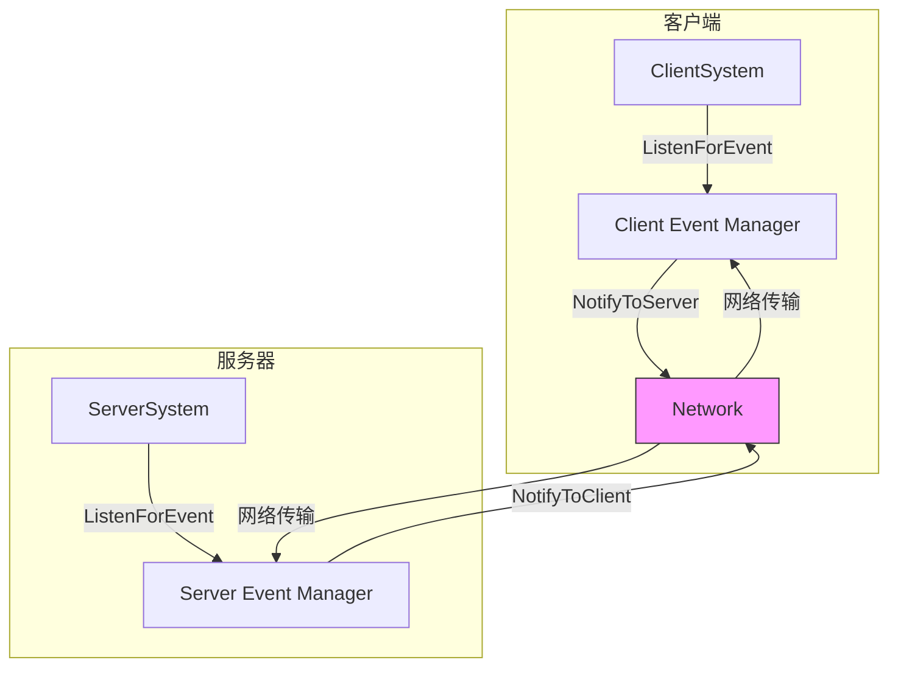

# 事件系统完整参考

> 📡 **深入理解MODSDK事件驱动架构**
>
> 本文档详细讲解MODSDK事件系统的工作原理、最佳实践和性能优化策略
>
> **版本**: v1.0
> **最后更新**: 2025-11-11

---

## 目录

1. [事件系统概述](#一事件系统概述)
2. [事件类型分类](#二事件类型分类)
3. [事件监听与通知](#三事件监听与通知)
4. [事件优先级机制](#四事件优先级机制)
5. [事件数据规范](#五事件数据规范)
6. [网络事件优化](#六网络事件优化)
7. [性能优化建议](#七性能优化建议)
8. [常见错误与陷阱](#八常见错误与陷阱)
9. [最佳实践清单](#九最佳实践清单)

---

## 一、事件系统概述

### 1.1 什么是事件系统?

MODSDK采用**事件驱动架构**（Event-Driven Architecture），通过发布-订阅模式实现模块间的松耦合通信。

**核心组件**:
```
┌─────────────┐     ListenForEvent      ┌──────────────┐
│   System A  │ ───────────────────────> │ Event Manager│
│  (订阅者)   │                          │  (事件管理器) │
└─────────────┘                          └──────────────┘
                                              │ 分发事件
      ┌───────────────────────────────────────┘
      │
      v
┌─────────────┐     NotifyToServer      ┌──────────────┐
│   System B  │ <────────────────────── │ Event Manager│
│  (处理器)   │                          │              │
└─────────────┘                          └──────────────┘
```

**为什么使用事件系统?**

1. **解耦模块**: System之间不需要直接引用,通过事件通信
2. **扩展性**: 添加新监听器无需修改发送方代码
3. **跨端通信**: 通过`NotifyToServer`/`NotifyToClient`实现双端交互
4. **异步处理**: 事件处理不阻塞游戏主循环

---

### 1.2 事件系统架构



---

## 二、事件类型分类

### 2.1 三大事件类型

| 类型 | 触发方式 | 性能 | 常见场景 |
|------|---------|------|---------|
| **引擎事件** | 自动触发 | 高效 | `AddPlayerCreatedEvent`, `DamageEvent` |
| **自定义事件** | 手动Notify | 中等 | `Shop_BuyItemEvent`, `Quest_CompleteEvent` |
| **双端通信事件** | NotifyToServer/Client | 网络开销 | 客户端→服务器请求 |

### 2.2 事件命名规范

```
{模块}_{操作}Event

✅ 正确: Shop_BuyItemEvent, VIP_LevelUpEvent
❌ 错误: buyItem (缺少模块), shop:buy (特殊字符)
```

### 2.3 双端通信API

| API | 方向 | 用途 |
|-----|------|------|
| `NotifyToServer(event, data)` | 客户端→服务器 | 发送UI操作 |
| `NotifyToClient(playerId, event, data)` | 服务器→客户端 | 更新玩家UI |
| `BroadcastToAllClient(event, data)` | 服务器→所有客户端 | 全局广播 |

**伪代码流程**:
```python
# 客户端
OnClickBuy(itemId):
    NotifyToServer('Shop_RequestBuyEvent', {itemId})

# 服务器
OnBuyRequest(args):
    if CheckMoney(playerId, itemId):
        DeductMoney(); GiveItem()
        NotifyToClient(playerId, 'Shop_BuySuccessEvent', {})
    else:
        NotifyToClient(playerId, 'Shop_BuyFailedEvent', {reason})
```

---

## 三、事件监听与通知

### 3.1 ListenForEvent API

```python
ListenForEvent(namespace, systemName, eventName, self, callback, priorityLevel=0)
```

| 参数 | 说明 | 注意事项 |
|------|------|---------|
| `namespace` | 命名空间 | 引擎事件用`GetEngineNamespace()` |
| `priorityLevel` | 优先级(0-10) | ⚠️ **引擎事件不支持此参数** |

**取消监听**:
```python
def Destroy(self):
    self.UnListenAllEvents()  # 推荐使用
```

---

## 四、事件优先级机制

**优先级范围**: 0-10 (数字越大,优先级越高)

| 优先级 | 使用场景 | 执行顺序 |
|--------|---------|---------|
| **10** | 权限验证、反作弊 | 最先执行 |
| **5-7** | 核心业务逻辑 | 中间执行 |
| **0-2** | 日志、UI更新 | 最后执行 |

**伪代码示例**:
```python
# 优先级10: 权限验证
ListenForEvent(..., CheckPermission, priorityLevel=10)

# 优先级5: 业务逻辑
ListenForEvent(..., ProcessBuy, priorityLevel=5)

# 优先级0: 日志记录
ListenForEvent(..., LogPurchase, priorityLevel=0)
```

---

## 五、事件数据规范

### 5.1 数据类型要求

| 类型 | 支持 | 说明 |
|------|------|------|
| `int`, `float`, `bool`, `str`, `None` | ✅ | 基础类型 |
| `list`, `dict` | ✅ | 容器类型 |
| `tuple`, `set` | ❌ | 序列化失败 |
| 自定义对象/函数 | ❌ | 无法序列化 |

---

### 5.2 数据大小与性能

**限制**: 单个事件<64KB（推荐<10KB）

| 数据大小 | 网络延迟 | 建议 |
|---------|---------|------|
| <1KB | ~5ms | ✅ 推荐 |
| 1-10KB | ~15ms | ⚠️ 可接受 |
| >10KB | >50ms | ❌ 避免 |

**优化原则**: 只传必要数据 + 分页

```python
# ❌ 错误: 传100个完整玩家对象
eventData = {'players': [完整对象 × 100]}

# ✅ 正确: Top10 + 只传ID和分数
eventData = {'top10': [{'id': xxx, 'score': xxx}], 'page': 1}
```

---

## 六、网络事件优化

### 6.1 事件压缩（引擎自动）

MODSDK自动将事件名压缩为索引（40字节 → 2字节，**95%流量节省**），开发者无需关心。

---

### 6.2 批量广播优化

| 方式 | 性能（100玩家） | 推荐 |
|------|----------------|------|
| `for playerId: NotifyToClient()` | 100次序列化 ≈ 100ms | ❌ |
| `BroadcastToAllClient()` | 1次序列化 ≈ 1ms | ✅ |

```python
# ✅ 推荐: 使用广播API
self.BroadcastToAllClient('MyEvent', eventData)
```

---

## 七、性能优化技巧

| 优化点 | 问题 | 解决方案 | 效果 |
|-------|------|---------|------|
| **事件频率** | 高频事件（60fps） | 节流（每20帧发1次） | 节省95%流量 |
| **监听器数量** | 过多监听器 | 单事件<20个，System总数<50个 | 提升响应速度 |
| **事件循环** | A触发B，B触发A | 防重入标志 `is_processing` | 避免死循环 |
| **批量通知** | 逐个发送 | 使用 `BroadcastToAllClient` | 100倍性能提升 |

**节流伪代码**:
```python
# 每20帧（约0.33秒）发送一次
if self.tick_counter % 20 == 0:
    self.NotifyToServer('PositionEvent', data)
```

---

## 八、常见错误速查表

| 错误 | 后果 | 正确做法 |
|------|------|---------|
| 引擎事件传 `priorityLevel` | 参数无效 | 引擎事件不传 `priorityLevel` 参数 |
| 忘记取消监听 | 内存泄漏 | `Destroy()` 中调用 `UnListenAllEvents()` |
| 回调中抛异常 | 后续监听器中断 | 使用 `try-except` + `args.get()` 安全获取数据 |
| EventData使用tuple | 序列化失败 | 使用 `list` 代替 `tuple` |
| 高频事件未节流 | 网络拥塞 | 使用 `tick_counter % N` 节流 |

---

## 九、最佳实践清单

**✅ 监听规范**:
- [ ] 使用明确的命名空间（避免冲突）
- [ ] 引擎事件不传 `priorityLevel`
- [ ] `Destroy()` 中取消所有监听

**✅ 通知规范**:
- [ ] 事件数据<10KB
- [ ] 避免传输 `tuple`/`set`/自定义对象
- [ ] 批量通知使用 `BroadcastToAllClient`

**✅ 双端隔离**:
- [ ] 客户端只负责UI，业务逻辑在服务器
- [ ] 服务器验证所有客户端请求（防作弊）

**✅ 性能优化**:
- [ ] 高频事件（>10次/秒）使用节流
- [ ] 单事件监听器<20个，System总数<50个
- [ ] 避免事件循环（防重入标志）

---

## 十、参考资源

### 官方文档
- **MODSDK事件API**: 参考`.claude/docs/modsdk-wiki/`（本地离线文档）
- **基岩版WIKI**: 参考`.claude/docs/bedrock-wiki/`

### 相关工作流文档
- **开发规范.md**: 双端隔离、System设计规范
- **问题排查.md**: 事件相关常见问题
- **深入理解ECS架构.md**: ECS与事件系统的关系

---

**文档版本**: v1.0
**最后更新**: 2025-11-11
**维护者**: NeteaseMod-Claude工作流
