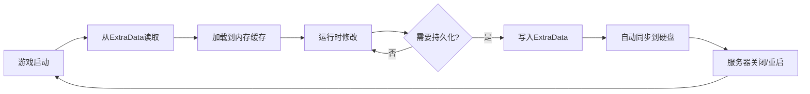
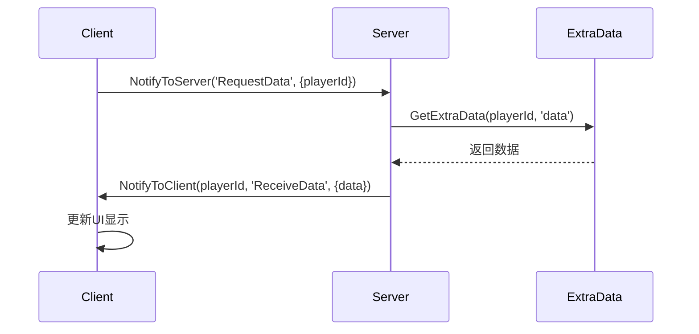
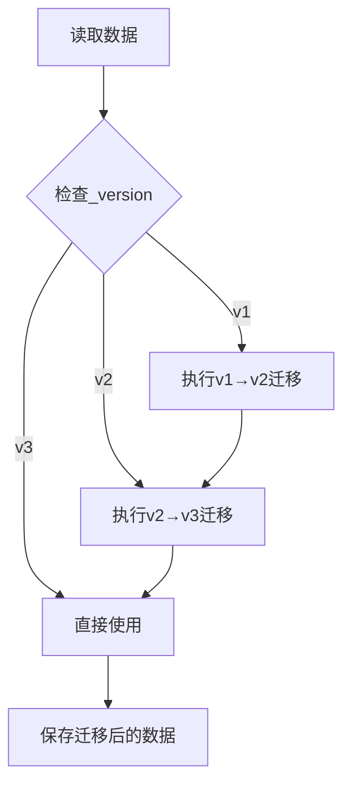

# 数据持久化指南

> **📍 导航**: [🏠 首页](../README.md) > [📂 文档](../README.md#文档导航) > 数据持久化指南
>
> **文档说明**: 深入讲解MODSDK的数据持久化机制和最佳实践
>
> **📅 最后更新**: 2025-01-11
> **文档版本**: 2.0（精简版）

---

## 📋 目录

1. [持久化概述](#1-持久化概述)
2. [ExtraData组件详解](#2-extradata组件详解)
3. [本地文件存储](#3-本地文件存储)
4. [数据结构设计](#4-数据结构设计)
5. [版本控制与迁移](#5-版本控制与迁移)
6. [性能优化策略](#6-性能优化策略)
7. [常见问题FAQ](#7-常见问题faq)

---

## 1. 持久化概述

### 1.1 MODSDK持久化方案对比

| 方案 | 适用场景 | 存储位置 | 跨服务器 | API复杂度 |
|------|---------|---------|---------|----------|
| **ExtraData组件** | 玩家/实体/世界级别数据 | 世界存档目录 | ❌ | ⭐ 简单 |
| **本地文件** | 全局配置、日志 | `behavior_packs/YourMod/` | ❌ | ⭐⭐ 中等 |
| **数据库（第三方）** | 大规模数据、跨服务器 | 外部MySQL/Redis | ✅ | ⭐⭐⭐ 复杂 |

**推荐方案**: 🥇 ExtraData（官方推荐） → 🥈 本地文件（配置日志） → 🥉 数据库（超出MODSDK范围）

---

### 1.2 数据持久化生命周期



---

## 2. ExtraData组件详解

### 2.1 核心概念

**ExtraData**: 网易引擎提供的键值对存储系统，支持三种作用域：

| 作用域 | API标识 | 生命周期 | 典型场景 |
|-------|--------|---------|---------|
| **玩家级** | `playerId` | 玩家离线后保留 | 等级、背包、成就 |
| **实体级** | `entityId` | 实体销毁时清理 | NPC对话进度、怪物状态 |
| **世界级** | `levelId` | 世界存档生命周期 | 全局配置、商品库存 |

**⚠️ 关键限制**:
- ✅ 仅服务端可用
- ✅ 只支持字符串类型
- ❌ 客户端需通过RPC请求

---

### 2.2 基础API与数据类型

#### 创建组件（服务端）

```python
# System.__init__方法中
levelId = serverApi.GetLevelId()
self.extraDataComp = serverApi.GetEngineCompFactory().CreateExtraData(levelId)
```

#### 数据类型转换表

| 原始类型 | 存储方式 | 读取方式 |
|---------|---------|---------|
| 字符串 | 直接存储 | 直接读取 |
| 整数/浮点 | `str(value)` | `int()`/`float()` |
| 列表/字典 | `json.dumps()` | `json.loads()` |
| 布尔值 | `"True"`/`"False"` | `value == "True"` |

#### 基础操作伪代码

```python
# 写入（伪代码）
SetExtraData(entityId, key, str(value))

# 读取（伪代码）
valueStr = GetExtraData(entityId, key)
if valueStr:
    value = json.loads(valueStr)  # 复杂类型
else:
    value = defaultValue
```

---

### 2.3 三种作用域实战示例

#### 玩家级：等级系统

```python
def SavePlayerLevel(self, playerId, level):
    self.extraDataComp.SetExtraData(playerId, 'player_level', str(level))

def LoadPlayerLevel(self, playerId):
    levelStr = self.extraDataComp.GetExtraData(playerId, 'player_level')
    return int(levelStr) if levelStr else 1
```

#### 世界级：全局商品库存

```python
def UpdateGlobalStock(self, itemId, stock):
    levelId = serverApi.GetLevelId()
    stockDataStr = self.extraDataComp.GetExtraData(levelId, 'global_stock')
    stockDict = json.loads(stockDataStr) if stockDataStr else {}
    stockDict[itemId] = stock
    self.extraDataComp.SetExtraData(levelId, 'global_stock', json.dumps(stockDict))
```

---

### 2.4 复杂数据结构：玩家背包示例

**数据结构设计**:

```python
inventoryData = {
    'items': [
        {'slot': 0, 'itemName': 'minecraft:diamond', 'count': 64},
        {'slot': 1, 'itemName': 'minecraft:iron_sword', 'count': 1}
    ],
    'money': 1000
}
```

**存储与加载**:

```python
def SaveInventory(self, playerId, inventoryData):
    jsonStr = json.dumps(inventoryData)
    self.extraDataComp.SetExtraData(playerId, 'inventory', jsonStr)

def LoadInventory(self, playerId):
    jsonStr = self.extraDataComp.GetExtraData(playerId, 'inventory')
    return json.loads(jsonStr) if jsonStr else {'items': [], 'money': 0}
```

---

### 2.5 核心限制与解决方案

#### 限制1：存储容量限制

| 问题 | 建议限制 | 解决方案 |
|------|---------|---------|
| 单个Key最大长度 | ~1MB | 分块存储（见下） |
| 总数据量 | 无明确限制 | 监控+优化 |

**分块存储伪代码**:

```python
# 写入：拆分为多个chunk
chunkSize = 100
for i in range(0, len(largeList), chunkSize):
    chunk = largeList[i:i+chunkSize]
    SetExtraData(playerId, f'data_chunk_{i//chunkSize}', json.dumps(chunk))
SetExtraData(playerId, 'chunk_count', str(len(largeList)//chunkSize + 1))

# 读取：合并所有chunk
chunkCount = int(GetExtraData(playerId, 'chunk_count') or "0")
allData = []
for i in range(chunkCount):
    chunkStr = GetExtraData(playerId, f'data_chunk_{i}')
    allData.extend(json.loads(chunkStr))
```

---

#### 限制2：写入性能限制

**性能对比**:

| 策略 | 写入频率 | TPS影响 | 数据丢失风险 |
|------|---------|---------|-------------|
| 立即写入 | 每次修改 | -10~20% | 无 |
| 10秒缓存 | 每10秒 | <1% | 10秒内数据 |
| 下线保存 | 仅下线时 | 极低 | 崩溃全丢失 |

**推荐方案**：10秒定时保存 + 玩家下线时保存

**实现伪代码**:

```python
# 内存缓存
self.playerDataCache = {}

def UpdatePlayerData(self, playerId, key, value):
    if playerId not in self.playerDataCache:
        self.playerDataCache[playerId] = {}
    self.playerDataCache[playerId][key] = value
    # 不立即写入ExtraData

def AutoSaveAllPlayers(self):
    """定时器：每10秒调用"""
    for playerId, data in self.playerDataCache.items():
        jsonStr = json.dumps(data)
        self.extraDataComp.SetExtraData(playerId, 'player_data', jsonStr)
```

---

#### 限制3：客户端访问限制

**RPC通信流程**:



**实现伪代码**:

```python
# 客户端
def RequestData(self):
    playerId = clientApi.GetLocalPlayerId()
    self.NotifyToServer('RequestDataEvent', {'playerId': playerId})

def OnReceiveData(self, args):
    data = args['data']
    # 更新UI

# 服务端
def OnRequestData(self, args):
    playerId = args['playerId']
    dataStr = self.extraDataComp.GetExtraData(playerId, 'player_data')
    data = json.loads(dataStr) if dataStr else {}
    self.NotifyToClient(playerId, 'ReceiveDataEvent', {'data': data})
```

---

## 3. 本地文件存储

### 3.1 使用场景与限制

**适用**：
- ✅ 全局配置（商品价格、活动时间）
- ✅ 日志文件（调试、错误记录）
- ✅ 大型静态数据（地图数据、NPC对话）

**不适用**：
- ❌ 玩家数据（用ExtraData）
- ❌ 实体数据（用ExtraData）

---

### 3.2 文件路径与读写规范

#### 推荐目录结构

```
behavior_packs/YourMod/
├── config/              # 配置文件
│   ├── shop_items.json
│   └── settings.json
├── logs/                # 日志文件
│   └── debug.log
└── data/                # 数据文件
    └── npc_dialogues.json
```

#### 读取配置文件伪代码

```python
import json, os

def LoadConfig(self, filename):
    modPath = os.path.dirname(__file__)
    configPath = os.path.join(modPath, 'config', filename)

    try:
        with open(configPath, 'r', encoding='utf-8') as f:
            return json.load(f)
    except (IOError, ValueError) as e:
        print(f"[Config] 加载失败: {e}")
        return {}
```

#### 日志写入伪代码

```python
import time

def Log(self, level, message):
    timestamp = time.strftime('%Y-%m-%d %H:%M:%S')
    logLine = f'[{timestamp}] [{level}] {message}\n'

    try:
        with open(self.logFilePath, 'a', encoding='utf-8') as f:
            f.write(logLine)
    except IOError as e:
        print(f"[Log] 写入失败: {e}")
```

---

### 3.3 文件操作注意事项

| 问题 | 解决方案 |
|------|---------|
| 中文乱码 | 始终使用`encoding='utf-8'` |
| 文件不存在 | 使用`try-except`捕获`IOError` |
| 路径分隔符 | 使用`os.path.join()`跨平台兼容 |
| JSON格式错误 | 捕获`ValueError`异常 |

---

## 4. 数据结构设计

### 4.1 设计原则

| 原则 | 反例 | 正例 |
|------|------|------|
| **扁平化结构** | `{'attributes': {'combat': {'strength': 10}}}` | `{'combat_strength': 10}` |
| **版本控制** | `{'level': 10}` | `{'_version': 2, 'level': 10}` |
| **字段命名** | `{'a': 1, 'b': 2}` | `{'player_level': 1, 'player_exp': 2}` |

---

### 4.2 常见数据结构模板

#### 玩家属性

```python
{
    '_version': 1,
    'level': 10,
    'exp': 5000,
    'money': 1000,
    'vip_level': 2,
    'last_login': '2025-01-11 10:00:00'
}
```

#### 成就进度

```python
{
    '_version': 1,
    'kill_zombie_100': 45,  # 进度：45/100
    'place_block_1000': 567
}
```

#### 商城购买历史

```python
{
    '_version': 1,
    'records': [
        {'itemId': 'sword_001', 'count': 1, 'price': 100, 'timestamp': 1704960000}
    ],
    'total_spent': 600
}
```

---

## 5. 版本控制与迁移

### 5.1 数据迁移策略

**向后兼容流程**:



---

### 5.2 迁移实现伪代码

```python
def LoadPlayerData(self, playerId):
    dataStr = self.extraDataComp.GetExtraData(playerId, 'player_data')

    if not dataStr:
        # 新玩家：返回最新版本默认值
        return {'_version': 3, 'level': 1, 'coins': 1000, 'vip_level': 0}

    data = json.loads(dataStr)
    version = data.get('_version', 1)

    # 逐步迁移
    if version == 1:
        data = self._MigrateV1ToV2(data)
        version = 2
    if version == 2:
        data = self._MigrateV2ToV3(data)
        version = 3

    # 保存迁移后的数据
    self.SavePlayerData(playerId, data)
    return data

def _MigrateV1ToV2(self, data):
    """v1→v2: 添加vip_level字段"""
    data['vip_level'] = 0
    data['_version'] = 2
    return data

def _MigrateV2ToV3(self, data):
    """v2→v3: 重命名money为coins"""
    data['coins'] = data.pop('money', 0)
    data['_version'] = 3
    return data
```

---

## 6. 性能优化策略

### 6.1 优化策略矩阵

| 策略 | 性能提升 | 实现难度 | 适用场景 | 推荐度 |
|------|---------|---------|---------|-------|
| **内存缓存** | 100倍（1k→100k TPS） | ⭐ | 所有项目 | 🥇 强烈推荐 |
| **定时批量保存** | 10倍 | ⭐ | 所有项目 | 🥇 强烈推荐 |
| **增量同步** | 3-5倍 | ⭐⭐ | 频繁变更的大数据 | 🥈 推荐 |
| **分块存储** | 2-3倍 | ⭐⭐ | >100KB数据 | 🥈 大数据必选 |
| **压缩存储** | 节省70%空间 | ⭐⭐⭐ | >100KB数据 | 🥉 可选 |

---

### 6.2 增量同步伪代码

```python
# 记录上次保存的快照
self.lastSavedSnapshot = {}

def SaveIncremental(self, playerId):
    currentData = self.playerDataCache.get(playerId, {})
    lastData = self.lastSavedSnapshot.get(playerId, {})

    # 计算差异
    changedKeys = {k: v for k, v in currentData.items()
                   if k not in lastData or lastData[k] != v}

    if not changedKeys:
        return  # 无变化，跳过

    # 仅保存变化的字段
    for key, value in changedKeys.items():
        fieldKey = f'player_{playerId}_{key}'
        self.extraDataComp.SetExtraData(playerId, fieldKey, str(value))

    # 更新快照
    self.lastSavedSnapshot[playerId] = currentData.copy()
```

---

### 6.3 压缩存储（高级）

**压缩效果**: 100KB → 30KB（减少70%）

**实现伪代码**:

```python
import zlib, base64

def CompressData(self, data):
    jsonStr = json.dumps(data)
    compressed = zlib.compress(jsonStr.encode('utf-8'))
    return base64.b64encode(compressed).decode('ascii')

def DecompressData(self, encoded):
    compressed = base64.b64decode(encoded.encode('ascii'))
    jsonStr = zlib.decompress(compressed).decode('utf-8')
    return json.loads(jsonStr)
```

---

## 7. 常见问题FAQ

### Q1: ExtraData数据什么时候会丢失？

| 场景 | 数据是否丢失 | 原因 |
|------|------------|------|
| 正常关闭服务器 | ✅ 不丢失 | 自动保存 |
| 服务器崩溃 | ⚠️ 未保存的缓存丢失 | 来不及写入硬盘 |
| 玩家下线 | ✅ 不丢失 | 自动保存 |

**建议**: 10秒定时保存 + 玩家下线时保存 + 关键操作立即保存

---

### Q2: 如何调试ExtraData存储失败？

**检查清单**:

```python
# 1. 检查返回值
success = self.extraDataComp.SetExtraData(playerId, key, value)
if not success:
    print(f"[Error] 保存失败: {playerId} {key}")

# 2. 检查数据大小
jsonStr = json.dumps(data)
print(f"数据大小: {len(jsonStr)} 字节")
if len(jsonStr) > 1024*1024:  # 1MB
    print("[Warning] 数据过大，建议分块")

# 3. 检查JSON格式
try:
    json.dumps(data)
except (TypeError, ValueError) as e:
    print(f"[Error] JSON序列化失败: {e}")
```

---

### Q3: ExtraData能存储玩家离线后的数据吗？

**答案**: ✅ 可以！

ExtraData绑定到玩家ID，即使玩家离线，数据仍保留在世界存档中，下次登录可读取。

---

### Q4: 如何备份ExtraData数据？

**备份方案**:

| 方法 | 路径 | 优点 | 缺点 |
|------|------|------|------|
| **世界存档备份** | `worlds/<世界名>/db/` | 完整备份 | 体积大 |
| **导出到JSON** | 自定义路径 | 可读性强 | 需手动实现 |

**推荐**: 定期备份整个世界存档

---

### Q5: 如何实现跨服务器数据同步？

**答案**: ExtraData不支持跨服务器。

**解决方案**:
- 使用外部数据库（MySQL/Redis）
- 实现HTTP API服务器中转
- 使用云存储（如阿里云OSS）

**⚠️ 超出MODSDK范围，需自行实现。**

---

## 📚 推荐阅读

完成本文档学习后，建议继续阅读：

- [业务系统实现案例.md](业务系统实现案例.md) - ExtraData在实战中的应用
- [性能优化完整指南.md](性能优化完整指南.md) - 数据存储性能优化
- [开发规范.md](../核心工作流文档/开发规范.md) - 数据持久化开发规范

---

**文档版本**: 2.0（精简版）
**最后更新**: 2025-01-11
**贡献者**: NeteaseMod-Claude工作流团队

**知识来源声明**：
本文档基于以下合法来源编写：
- ✅ MODSDK官方开发文档（ExtraData Component API）
- ✅ Python 2.7文件操作标准库文档
- ✅ 通用软件工程数据持久化最佳实践（如缓存策略、版本控制等）

所有代码示例均为独立设计，未引用任何非官方代码实现。
