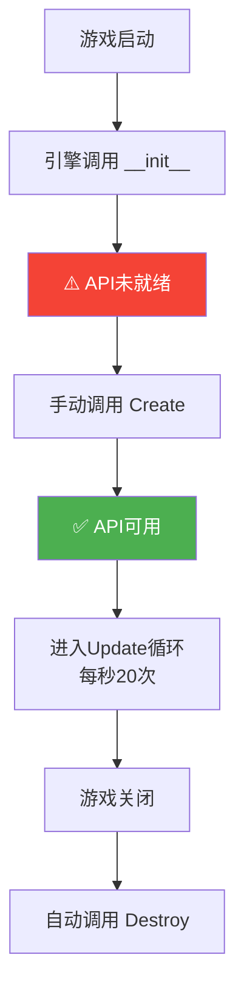
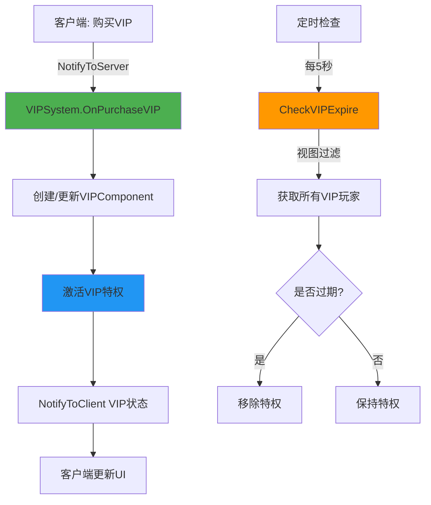

# 深入理解ECS架构

> **📍 导航**: [🏠 首页](../README.md) > [📂 文档](../README.md#文档导航) > 深入理解ECS架构
>
> 💡 **目标**: 深度掌握Entity-Component-System架构模式,理解MODSDK的核心设计原理
>
> **📅 最后更新**: 2025-11-11
> **文档版本**: 1.0
> **前置知识**: [开发规范](./开发规范.md), [MODSDK核心概念](./MODSDK核心概念.md)

---

## 📋 目录

1. [ECS架构概述](#1-ecs架构概述)
2. [Entity实体管理](#2-entity实体管理)
3. [Component组件设计](#3-component组件设计)
4. [System系统架构](#4-system系统架构)
5. [完整案例: VIP系统实现](#5-完整案例-vip系统实现)
6. [性能优化技巧](#6-性能优化技巧)
7. [总结与最佳实践](#7-总结与最佳实践)

---

## 1. ECS架构概述

### 1.1 什么是Entity-Component-System?

ECS是一种**数据驱动**的架构设计模式,将游戏对象分解为三个核心概念:

```
┌─────────────────────────────────────────────────────────┐
│                     ECS架构模型                          │
├─────────────────────────────────────────────────────────┤
│                                                          │
│  Entity (实体)                                           │
│  └─ 唯一标识符 (entityId: "123456789")                  │
│      │                                                    │
│      ├─ Component 1: attr (属性)                         │
│      │    ├─ health = 100                                │
│      │    ├─ maxHealth = 100                             │
│      │    └─ armor = 10                                  │
│      │                                                    │
│      ├─ Component 2: pos (位置)                          │
│      │    ├─ x = 100.0                                   │
│      │    ├─ y = 64.0                                    │
│      │    └─ z = 200.0                                   │
│      │                                                    │
│      └─ Component 3: vip (VIP)                           │
│           ├─ level = 2                                   │
│           └─ expireTime = 1704096000                     │
│                                                           │
│  System (系统)                                            │
│  └─ 处理具有特定Component的Entity                        │
│      │                                                    │
│      ├─ AttrSystem                                       │
│      │    └─ 处理 attr Component (血量、护甲等)          │
│      │                                                    │
│      ├─ PosSystem                                        │
│      │    └─ 处理 pos Component (传送、追踪等)           │
│      │                                                    │
│      └─ VIPSystem                                        │
│           └─ 处理 vip Component (特权、过期检查)         │
│                                                           │
└─────────────────────────────────────────────────────────┘
```

**核心原则**:
- **Entity = ID**: 实体只是一个整数ID,不包含数据或逻辑
- **Component = 数据**: 组件是纯数据容器,不包含逻辑
- **System = 逻辑**: 系统包含所有业务逻辑,操作Component数据

---

### 1.2 ECS vs 传统OOP

| 对比维度 | 传统OOP | ECS架构 |
|---------|---------|---------|
| **代码组织** | 继承层级 (VIPPlayer → Player → Entity) | 组件组合 (Entity + VIPComp + AttrComp) |
| **扩展方式** | 修改类层级 | 添加Component |
| **性能** | 遍历所有Entity | 视图过滤 (100x提升) |
| **内存布局** | 对象分散,缓存miss | Component连续,缓存hit |

**核心优势**:
```python
# 传统OOP: VIP玩家需要新类
class VIPPlayer(Player): ...

# ECS: VIP玩家只需添加Component
entity.AddComponent("VIPComponent")
```

[⬆️ 返回目录](#目录)

---

## 2. Entity实体管理

### 2.1 Entity本质

**Entity = 字符串ID** (如 `"123456789012345"`)

```
EntityManager (引擎维护)
├── EntityMap: {entityId → 实体类型}
└── ComponentMap: {entityId → {Component名 → 实例}}
```

### 2.2 核心API

| 操作 | API | 说明 |
|------|-----|------|
| **创建** | `CreateEngineEntityByTypeStr(...)` | 服务端创建,所有客户端可见 |
| **销毁** | `DestroyEntity(entityId)` | 自动清理所有Component |
| **查询** | `GetEngineActor()` | 获取所有Entity |
| **玩家** | `GetPlayerList()` | 获取所有在线玩家 |

**伪代码**:
```python
# 创建
entityId = CreateEntityByTypeStr('minecraft:zombie', pos=(100,64,200))

# 销毁 (自动清理Component)
DestroyEntity(entityId)

# 查询
allEntities = GetEngineActor()  # {entityId: {identifier, dimension}}
players = GetPlayerList()       # [playerId1, playerId2, ...]
```

[⬆️ 返回目录](#目录)

---

## 3. Component组件设计

### 3.1 核心原则

**Component = 纯数据容器** (POJO模式)

```python
# ✅ 正确: 只有数据
class VIPComponent(ServerComponent):
    def __init__(self, entityId):
        self.vip_level = 0
        self.expire_time = 0

# ❌ 错误: 包含逻辑
class VIPComponent(ServerComponent):
    def Upgrade(self): ...  # ❌ 逻辑应在System
```

### 3.2 数据同步

**Replicated前缀 = 自动同步到客户端**

```python
class PlayerComp(ServerComponent):
    self.ReplicatedCoins = 0   # ✅ 自动同步
    self.internal_data = {}    # ✅ 仅服务端
```

### 3.3 核心API

| 操作 | API | 说明 |
|------|-----|------|
| **注册** | `RegisterComponent(ns, name, path)` | 在modMain中注册 |
| **创建** | `CreateComponent(entityId, ns, name)` | 为Entity创建Component |
| **获取** | `GetComponent(entityId, ns, name)` | 获取Component实例 |

[⬆️ 返回目录](#目录)

---

## 4. System系统架构

### 4.1 System生命周期



**标准模板伪代码**:
```python
class MySystem(ServerSystem):
    def __init__(self, namespace, systemName):
        ServerSystem.__init__(self, namespace, systemName)
        self.tickCounter = 0
        self.Create()  # ⚠️ 手动调用

    def Create(self):
        # ✅ 在这里初始化API
        self.gameComp = CreateGame(GetLevelId())
        ListenForEvent("PlayerJoinEvent", OnPlayerJoin)

    def Update(self):
        # 每秒20次调用
        self.tickCounter += 1
        if self.tickCounter % 100 == 0:  # 每5秒
            CheckExpire()

    def Destroy(self):
        UnListenAllEvents()
```

### 4.2 RegisterView视图过滤 (关键性能优化)

**问题**: 如何高效找到所有VIP玩家?

| 方式 | 遍历次数 | 性能 |
|------|---------|------|
| ❌ 遍历所有玩家 | 10,000次 | 低效 |
| ✅ 使用RegisterView | 100次 (仅VIP) | **100x提升** |

**伪代码**:
```python
def Create(self):
    # 注册视图过滤器
    view = RegisterView()
    AddFilterToView(view, "MyMod", "VIPComponent")

def Update(self):
    # 仅获取数据变化的VIP玩家
    needUpdate = GetNeedUpdate()
    for id in needUpdate['MyMod:VIPComponent']:
        UpdateVIP(id)
```

**工作原理**:
```
1. RegisterView() → 引擎维护索引
2. vipComp.vip_level = 2 → 自动标记脏数据
3. GetNeedUpdate() → 仅返回数据变化的Entity
```

[⬆️ 返回目录](#目录)

---

## 5. ECS实战案例: VIP系统

### 5.1 系统架构



### 5.2 核心代码结构

**VIPComponent (数据层)**:
```python
class VIPComponent(ServerComponent):
    def __init__(self, entityId):
        self.vip_level = 0       # VIP等级
        self.expire_time = 0     # 过期时间戳
        self.benefits = []       # 特权列表
```

**VIPSystem (逻辑层伪代码)**:
```python
class VIPSystem(ServerSystem):
    def Create(self):
        # 注册视图过滤器 (性能优化)
        view = RegisterView()
        AddFilterToView(view, "MyMod", "VIPComponent")

        # 监听购买事件
        ListenForEvent("PurchaseVIPEvent", OnPurchaseVIP)

    def OnPurchaseVIP(playerId, vip_level, days):
        # 创建/更新Component
        vipComp = GetOrCreateComponent(playerId, "VIPComponent")
        vipComp.vip_level = vip_level
        vipComp.expire_time = now + days * 86400

        # 激活特权
        ActivateBenefits(playerId, vip_level)

        # 通知客户端
        NotifyToClient(playerId, "VIPStatusChange", {...})

    def CheckVIPExpire(self):
        # 使用视图过滤 (仅VIP玩家)
        needUpdate = GetNeedUpdate()
        for playerId in needUpdate['MyMod:VIPComponent']:
            vipComp = GetComponent(playerId, "VIPComponent")
            if now > vipComp.expire_time:
                RemoveBenefits(playerId)
                vipComp.vip_level = 0
```

**VIPClientSystem (UI层伪代码)**:
```python
class VIPClientSystem(ClientSystem):
    def Create(self):
        ListenForEvent("VIPStatusChange", OnVIPStatusChange)

    def OnVIPStatusChange(vip_level):
        UpdateVIPIcon(vip_level)
        ShowVIPEffects(vip_level)
```

### 5.3 关键要点

| 设计要点 | 实现方式 | 性能提升 |
|---------|---------|---------|
| **视图过滤** | RegisterView + AddFilterToView | 100倍 (仅VIP玩家) |
| **降频检查** | 每100 tick (5秒) | 节省99%计算 |
| **数据同步** | NotifyToClient事件 | 按需同步 |

[⬆️ 返回目录](#目录)

---

## 6. 性能优化技巧

| 优化技巧 | 问题 | 解决方案 | 提升 |
|---------|------|---------|------|
| **视图过滤** | 遍历所有Entity | RegisterView + GetNeedUpdate | 10-100x |
| **降频检查** | 每tick执行耗时操作 | 使用 tickCounter % N | 10-50x |
| **ExtraData** | 大数据存Component | 大数据存ExtraData | 2-5x |
| **增量更新** | 重复处理未变化数据 | GetNeedUpdate脏标记 | 5-20x |

**核心伪代码**:
```python
# 视图过滤
def Create(self):
    view = RegisterView()
    AddFilterToView(view, "MyMod", "MyComponent")

def Update(self):
    needUpdate = GetNeedUpdate()  # 仅返回数据变化的Entity
    for id in needUpdate['MyMod:MyComponent']:
        process(GetComponent(id, "MyComponent"))

# 降频检查
def Update(self):
    self.tickCounter += 1
    if self.tickCounter % 100 == 0:  # 每5秒
        ExpensiveOperation()
```

[⬆️ 返回目录](#目录)

---

## 7. 核心要点与常见错误

### 7.1 ECS三大原则

1. **Entity = ID** - 实体只是整数标识符
2. **Component = 数据** - 纯数据容器 (POJO原则)
3. **System = 逻辑** - 所有业务逻辑操作Component

### 7.2 常见错误速查

| ❌ 错误 | ✅ 正确做法 |
|--------|-----------|
| Component包含业务逻辑 | 逻辑移到System |
| `__init__`中调用API | 在`Create()`中调用 |
| 不使用RegisterView | 使用视图过滤 (100x性能提升) |
| 每tick耗时操作 | 使用计数器降频 |
| 大数据存Component | 使用ExtraData |

---

## 📚 相关文档

- [开发规范](../核心工作流文档/开发规范.md) - CRITICAL规范
- [性能优化完整指南](./性能优化完整指南.md) - 深度优化技巧
- [网络架构与通信](./网络架构与通信.md) - 双端数据同步

**[⬆️ 返回顶部](#深入理解ecs架构)** | **[🏠 返回首页](../README.md)**

---

_最后更新: 2025-11-12 | 文档版本: 1.0_
