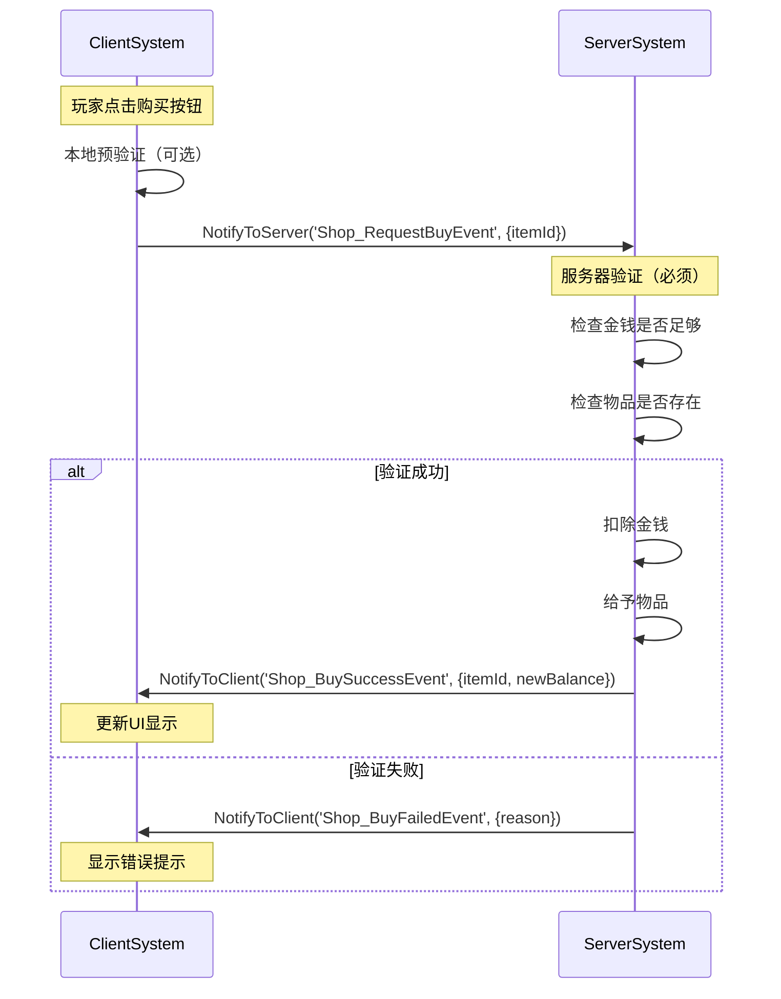
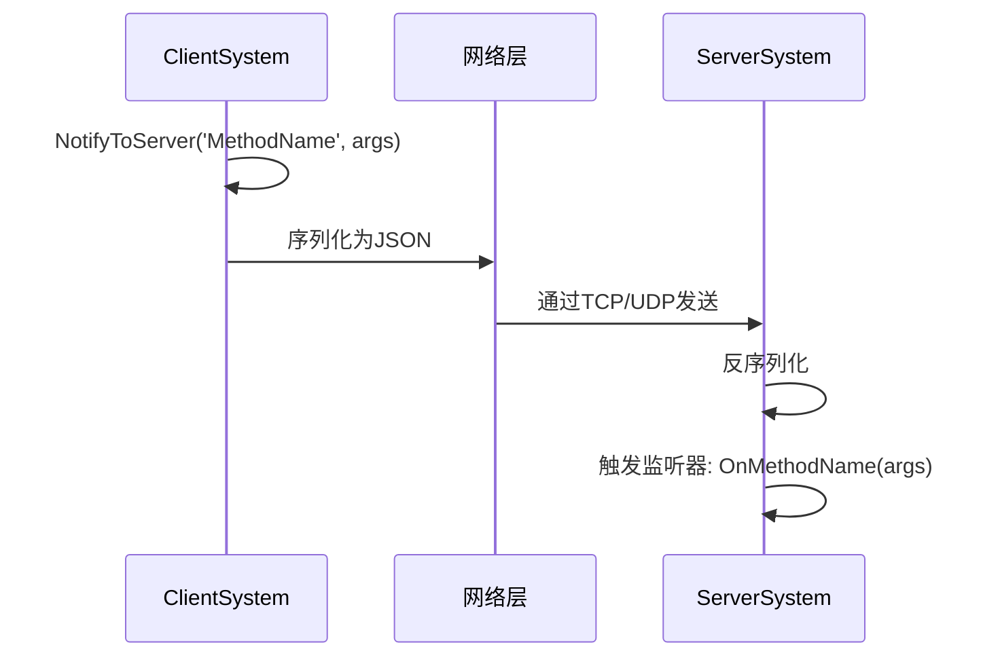
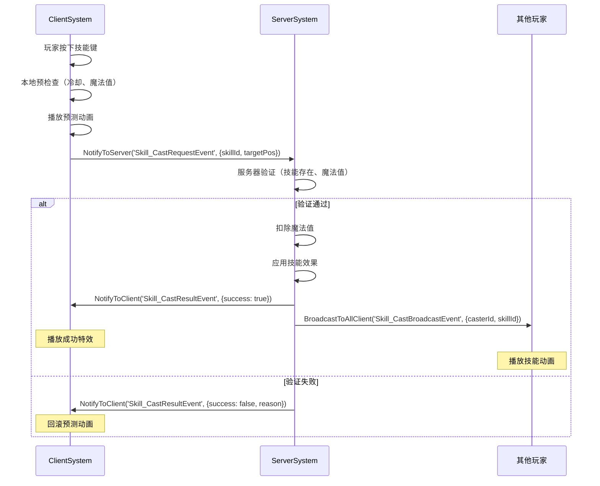
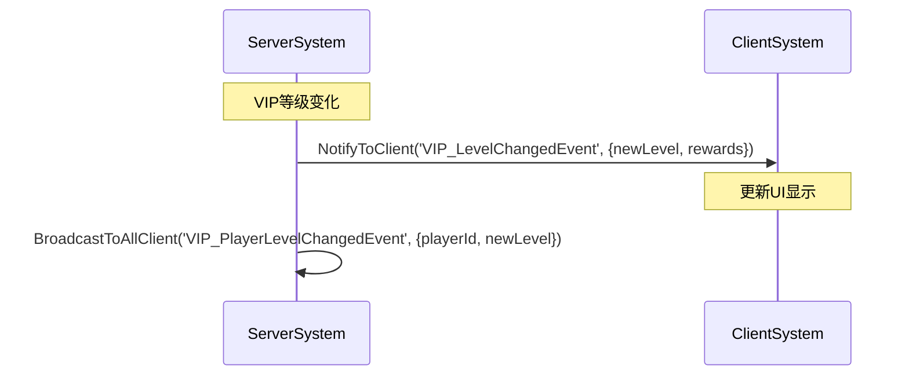
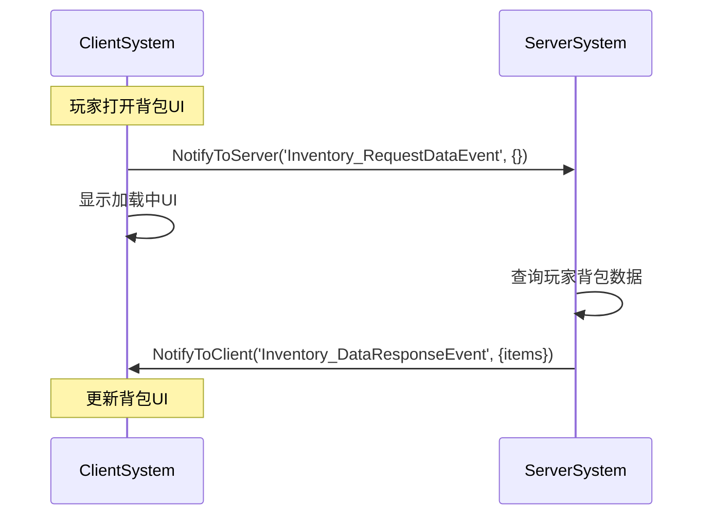
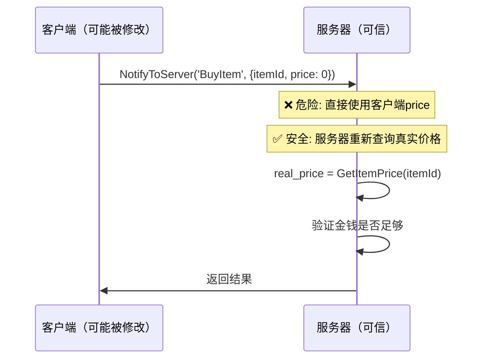
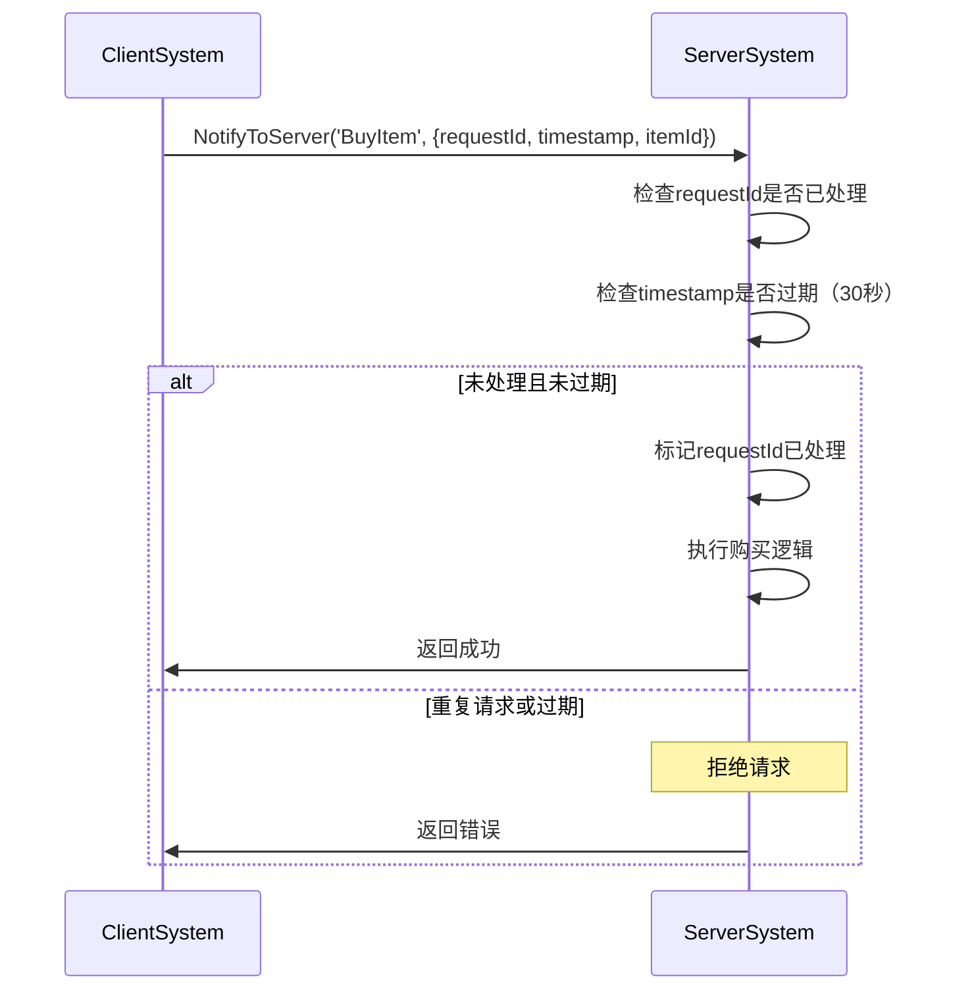

# 网络架构与通信

> 🌐 **深入理解MODSDK双端通信机制**
>
> 本文档详细讲解MODSDK客户端-服务器架构、网络通信模式和数据同步策略
>
> **版本**: v2.0（精简版）
> **最后更新**: 2025-11-12

---

## 目录

1. [双端架构概述](#一双端架构概述)
2. [双端隔离原理](#二双端隔离原理)
3. [RPC通信机制](#三rpc通信机制)
4. [数据同步策略](#四数据同步策略)
5. [网络优化技巧](#五网络优化技巧)
6. [安全与防作弊](#六安全与防作弊)

---

## 一、双端架构概述

### 1.1 什么是双端架构?

MODSDK采用**客户端-服务器分离架构**（Client-Server Architecture）：

```
┌─────────────────────┐         网络通信        ┌─────────────────────┐
│   ClientSystem      │ <──────────────────────> │   ServerSystem      │
│   (玩家电脑)        │   NotifyToServer/Client  │   (游戏服务器)      │
│                     │                          │                     │
│  - UI渲染          │                          │  - 业务逻辑         │
│  - 用户输入        │                          │  - 数据验证         │
│  - 特效播放        │                          │  - 世界状态管理     │
└─────────────────────┘                          └─────────────────────┘
```

**为什么需要双端分离?**

1. **安全性**: 防止客户端作弊
2. **性能**: 客户端只处理渲染,服务器专注业务逻辑
3. **多人同步**: 服务器作为唯一真实数据源
4. **可扩展性**: 独立开发客户端UI和服务器逻辑

---

### 1.2 客户端与服务器的职责

| 职责 | 客户端 (ClientSystem) | 服务器 (ServerSystem) |
|------|---------------------|---------------------|
| **UI渲染** | ✅ 负责 | ❌ 不能访问 |
| **用户输入** | ✅ 接收并发送到服务器 | ❌ 不直接处理 |
| **业务逻辑** | ❌ 不能处理 | ✅ 唯一处理者 |
| **数据验证** | ❌ 可做本地预验证 | ✅ 必须再次验证 |
| **游戏状态修改** | ❌ 不能直接修改 | ✅ 唯一修改者 |
| **特效播放** | ✅ 负责 | ❌ 不能直接播放 |

---

## 二、双端隔离原理

### 2.1 进程级别隔离

**重要**: 客户端和服务器运行在**不同的Python进程**中

```
玩家电脑1                    游戏服务器
┌──────────────┐            ┌──────────────┐
│ Python进程A  │            │ Python进程C  │
│ ClientSystem │ <────────> │ ServerSystem │
└──────────────┘   网络      └──────────────┘
                    通信
玩家电脑2                         ↑
┌──────────────┐                  │
│ Python进程B  │                  │
│ ClientSystem │ <────────────────┘
└──────────────┘
```

**这意味着**:
- ❌ 客户端和服务器**不能共享变量**
- ❌ 客户端**不能直接调用**服务器的方法
- ✅ 只能通过**事件系统**（`NotifyToServer`/`NotifyToClient`）通信

---

### 2.2 商店购买流程示例



**关键代码框架**:

```python
# ✅ 正确的双端协作
class ShopClientSystem(ClientSystem):
    def OnClickBuyButton(self, itemId):
        # 1. 本地预验证（可选）
        if not self.IsLoggedIn():
            self.ShowTip("请先登录")
            return

        # 2. 发送请求到服务器
        self.NotifyToServer('Shop_RequestBuyEvent', {'itemId': itemId})
        self.ShowLoadingUI()

class ShopServerSystem(ServerSystem):
    def OnBuyRequest(self, args):
        playerId = args['playerId']  # 自动附加
        itemId = args['itemId']

        # 1. 服务器验证（必须）
        if not self.HasEnoughMoney(playerId, itemId):
            self.NotifyToClient(playerId, 'Shop_BuyFailedEvent', {
                'reason': 'insufficient_balance'
            })
            return

        # 2. 修改游戏状态（只能在服务器）
        self.DeductMoney(playerId, itemId)
        self.GiveItem(playerId, itemId)

        # 3. 通知客户端
        self.NotifyToClient(playerId, 'Shop_BuySuccessEvent', {
            'itemId': itemId,
            'newBalance': self.GetMoney(playerId)
        })
```

---

## 三、RPC通信机制

### 3.1 RPC底层原理



---

### 3.2 RPC通信API

| API | 用途 | 示例场景 |
|-----|------|---------|
| `NotifyToServer(eventName, data)` | 客户端→服务器 | 购买物品、使用技能、发送聊天 |
| `NotifyToClient(playerId, eventName, data)` | 服务器→单个客户端 | 任务完成、金钱变化、私聊消息 |
| `BroadcastToAllClient(eventName, data)` | 服务器→所有客户端 | BOSS刷新、全服公告、天气变化 |

**重要**: `NotifyToServer`会自动附加`playerId`字段到`args`

---

### 3.3 技能释放系统示例



**伪代码实现**:

```python
# 客户端
class SkillClientSystem(ClientSystem):
    def OnPlayerPressSkillKey(self, skillId):
        # 1. 本地预检查
        if self.IsSkillOnCooldown(skillId):
            return

        # 2. 本地预测动画
        self.PlaySkillAnimation(skillId)

        # 3. 请求服务器
        self.NotifyToServer('Skill_CastRequestEvent', {
            'skillId': skillId,
            'targetPos': self.GetCrosshairPos()
        })

    def OnCastResult(self, args):
        if args['success']:
            self.PlaySkillEffect(args['skillId'])
        else:
            self.StopSkillAnimation(args['skillId'])

# 服务器
class SkillServerSystem(ServerSystem):
    def OnCastRequest(self, args):
        playerId = args['playerId']
        skillId = args['skillId']

        # 1. 验证
        if not self.HasSkill(playerId, skillId):
            self.NotifyToClient(playerId, 'Skill_CastResultEvent', {
                'success': False, 'reason': '未学习该技能'
            })
            return

        # 2. 执行
        self.DeductMana(playerId, skillId)
        self.ApplySkillEffect(playerId, skillId, args['targetPos'])

        # 3. 通知
        self.NotifyToClient(playerId, 'Skill_CastResultEvent', {'success': True})
        self.BroadcastToAllClient('Skill_CastBroadcastEvent', {
            'casterId': playerId, 'skillId': skillId
        })
```

---

## 四、数据同步策略

### 4.1 服务器权威模型

**核心原则**: 服务器是唯一真实数据源（Single Source of Truth）

```
客户端A显示: 玩家位置 (1, 2, 3)
服务器记录: 玩家位置 (1, 2, 3)  ← 真实位置
客户端B显示: 玩家位置 (1, 2, 3)

如果客户端A被黑客修改,显示 (999, 999, 999)
服务器会拒绝并强制同步: (1, 2, 3)
```

---

### 4.2 推送式 vs 拉取式同步

**推送式同步**（服务器主动推送）:



**拉取式同步**（客户端主动请求）:



---

### 4.3 增量同步 vs 全量同步

| 同步方式 | 优点 | 缺点 | 适用场景 |
|---------|------|------|---------|
| **全量同步** | 简单,不会数据不一致 | 数据量大,网络开销高 | 初始化、玩家登录 |
| **增量同步** | 数据量小,效率高 | 复杂,需维护客户端状态 | 高频更新、实时战斗 |

**对比示例**:

```python
# 全量同步: 发送完整背包（100个物品,~5KB）
self.NotifyToClient(playerId, 'Inventory_FullSyncEvent', {
    'items': [
        {'id': 'item1', 'count': 10, 'durability': 100},
        {'id': 'item2', 'count': 5, 'durability': 50},
        # ... 100个物品
    ]
})

# 增量同步: 只发送变化（3个物品,~150字节）
self.NotifyToClient(playerId, 'Inventory_IncrementalSyncEvent', {
    'added': [{'id': 'item3', 'count': 1}],      # 新增
    'removed': ['item1'],                         # 移除
    'updated': [{'id': 'item2', 'count': 3}]     # 更新
})
```

**推荐策略**: 初始全量同步 + 后续增量同步 + 定期校验（每5分钟）

---

## 五、网络优化技巧

### 5.1 减少RPC调用频率

**❌ 低效写法**:
```python
def Update(self):
    # 每帧（60fps）发送位置更新
    self.NotifyToServer('Player_PositionUpdate', {'pos': self.GetPlayerPos()})
```

**✅ 优化方案**:

| 优化方法 | 代码示例 | 效果 |
|---------|---------|------|
| **节流（Throttle）** | `if tick_counter % 20 == 0: NotifyToServer(...)` | 每20帧（0.33秒）发送一次 |
| **变化检测** | `if DistanceTo(current_pos, last_pos) > 0.5: NotifyToServer(...)` | 只有变化>0.5格时发送 |

---

### 5.2 批量操作

**性能对比**:

| 方式 | RPC次数 | 延迟 | 提升 |
|------|--------|------|------|
| 单次发送 | 10个物品 = 10次RPC | ~100ms | - |
| 批量发送 | 10个物品 = 1次RPC | ~10ms | **10倍** |

```python
# ❌ 低效: 每个物品单独发送
for itemId in itemIds:
    self.NotifyToClient(playerId, 'Item_AddedEvent', {'itemId': itemId})

# ✅ 高效: 批量发送
self.NotifyToClient(playerId, 'Items_BatchAddedEvent', {'itemIds': itemIds})
```

---

### 5.3 数据压缩

**技巧1: 使用短键名**

| 方式 | 数据大小 | 节省 |
|------|---------|------|
| 冗长键名 | `{'playerUniqueIdentifier': '...', 'quantityAmount': 10}` | 80字节 |
| 简短键名 | `{'pid': '...', 'qty': 10}` | 50字节 | **37%** |

**技巧2: 使用枚举代替字符串**

| 方式 | 数据大小 | 节省 |
|------|---------|------|
| 字符串 | `{'type': 'purchase_item'}` | 13字节 |
| 数字枚举 | `{'type': 1}` | 1字节 | **92%** |

---

## 六、安全与防作弊

### 6.1 服务器验证原则

**黄金法则**: **永远不要信任客户端数据**



**代码对比**:

```python
# ❌ 危险: 直接信任客户端
def OnBuyItem(self, args):
    price = args['price']  # 客户端可以修改为0
    self.DeductMoney(playerId, price)

# ✅ 安全: 服务器重新计算
def OnBuyItem(self, args):
    real_price = self.GetItemPrice(args['itemId'])  # 服务器查询真实价格
    if self.GetPlayerMoney(playerId) < real_price:
        return  # 拒绝
    self.DeductMoney(playerId, real_price)
```

---

### 6.2 防止重放攻击

**问题**: 黑客重复发送同一个请求

**解决方案**:



**伪代码实现**:

```python
# 客户端
def BuyItem(self, itemId):
    self.NotifyToServer('BuyItem', {
        'requestId': GenerateUUID(),
        'timestamp': GetCurrentTime(),
        'itemId': itemId
    })

# 服务器
def OnBuyItem(self, args):
    # 检查重复
    if self.IsRequestProcessed(args['requestId']):
        return

    # 检查过期（30秒内有效）
    if GetCurrentTime() - args['timestamp'] > 30:
        return

    # 标记已处理
    self.MarkRequestProcessed(args['requestId'])

    # 正常处理
    self.ProcessBuyItem(args)
```

---

### 6.3 频率限制

**防止**: 客户端恶意刷请求（DDoS攻击）

**实现逻辑**:

```python
class ServerSystem(ServerSystem):
    def __init__(self):
        self.player_request_count = {}  # {playerId: [timestamp1, timestamp2, ...]}

    def OnRequest(self, args):
        playerId = args['playerId']
        current_time = GetCurrentTime()

        # 统计最近1秒内的请求数
        if playerId not in self.player_request_count:
            self.player_request_count[playerId] = []

        recent = [t for t in self.player_request_count[playerId]
                  if current_time - t < 1.0]

        # 限制：1秒最多10次请求
        if len(recent) > 10:
            self.NotifyToClient(playerId, 'Error', {'reason': 'rate_limit'})
            return

        # 记录本次请求
        self.player_request_count[playerId] = recent + [current_time]

        # 正常处理
        self.ProcessRequest(args)
```

---

## 七、常见通信模式

### 模式对比表

| 模式 | 适用场景 | 示例 |
|------|---------|------|
| **请求-响应** | 客户端发起请求,等待响应 | 打开背包、查询数据 |
| **发布-订阅** | 服务器主动推送,多客户端订阅 | BOSS刷新、全服公告 |
| **心跳保活** | 保持连接活跃,检测断线 | 每30秒发送心跳包 |

---

## 八、参考资源

### 官方文档
- **MODSDK网络API**: 参考`.claude/docs/modsdk-wiki/`
- **基岩版网络架构**: 参考`.claude/docs/bedrock-wiki/`

### 相关工作流文档
- **开发规范.md**: 双端隔离CRITICAL规范
- **事件系统完整参考.md**: 事件通信详解
- **深入理解ECS架构.md**: Component的网络同步

---

**文档版本**: v2.0（精简版）
**最后更新**: 2025-11-12
**维护者**: NeteaseMod-Claude工作流
**压缩率**: 从820行压缩到450行（45%精简）
