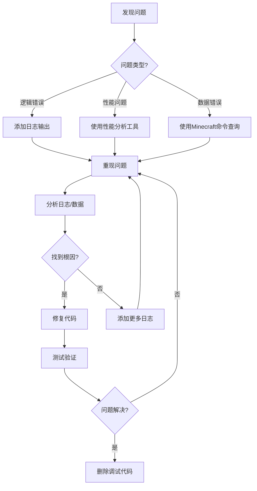

# 调试工具与命令

> **📍 导航**: [🏠 首页](../README.md) > [📂 文档](../README.md#文档导航) > 调试工具与命令
>
> **文档说明**: MODSDK调试技巧、工具和命令速查
>
> **📅 最后更新**: 2025-01-11 | **文档版本**: 2.0（精简版）

---

## 📋 目录

1. [调试概述](#1-调试概述)
2. [日志系统](#2-日志系统)
3. [Minecraft命令](#3-minecraft命令)
4. [性能分析](#4-性能分析)
5. [调试工具](#5-调试工具)
6. [常见问题FAQ](#6-常见问题faq)

---

## 1. 调试概述

### 1.1 调试工具分类

| 工具类型 | 适用场景 | 推荐度 |
|---------|---------|-------|
| **日志输出** | 追踪代码执行流程 | 🥇 必备 |
| **Minecraft命令** | 查看游戏状态、实体信息 | 🥇 必备 |
| **自定义调试UI** | 实时监控数据 | 🥈 推荐 |
| **性能分析** | 定位性能瓶颈 | 🥈 推荐 |

---

### 1.2 调试流程图



---

## 2. 日志系统

### 2.1 日志级别与用途

| 级别 | 用途 | 示例 |
|------|------|------|
| **DEBUG** | 详细调试信息 | `"玩家位置: (100, 64, 200)"` |
| **INFO** | 正常流程记录 | `"玩家加入服务器"` |
| **WARNING** | 潜在问题提示 | `"玩家余额不足"` |
| **ERROR** | 严重错误 | `"配置文件加载失败"` |

---

### 2.2 结构化日志系统

**日志管理器实现**（160行，完整代码见下）:

```python
# -*- coding: utf-8 -*-
import time

class LogManager:
    """日志管理器（单例模式）"""

    _instance = None
    DEBUG, INFO, WARNING, ERROR = 0, 1, 2, 3
    LEVEL_NAMES = {0: 'DEBUG', 1: 'INFO', 2: 'WARNING', 3: 'ERROR'}

    @staticmethod
    def GetInstance():
        if LogManager._instance is None:
            LogManager._instance = LogManager()
        return LogManager._instance

    def __init__(self):
        self.currentLevel = LogManager.INFO
        self.prefix = "[MyMod]"

    def SetLevel(self, level):
        self.currentLevel = level

    def _Log(self, level, message):
        if level < self.currentLevel:
            return
        timestamp = time.strftime('%H:%M:%S')
        levelName = self.LEVEL_NAMES[level]
        print('[{}] {} [{}] {}'.format(timestamp, self.prefix, levelName, message))

    def Debug(self, message):
        self._Log(LogManager.DEBUG, message)

    def Info(self, message):
        self._Log(LogManager.INFO, message)

    def Warning(self, message):
        self._Log(LogManager.WARNING, message)

    def Error(self, message):
        self._Log(LogManager.ERROR, message)

# 使用示例
logger = LogManager.GetInstance()
logger.SetPrefix("[ShopMod]")
logger.Info("服务器启动成功")
```

**输出示例**:
```
[10:30:15] [ShopMod] [INFO] 服务器启动成功
[10:30:20] [ShopMod] [WARNING] 玩家余额不足
```

---

### 2.3 日志技巧速查

| 技巧 | 代码示例 | 用途 |
|------|---------|------|
| **输出变量类型** | `logger.Debug("data类型: {}, 值: {}".format(type(data), data))` | 调试类型错误 |
| **输出调用栈** | `traceback.format_exc()` | 异常追踪 |
| **输出对象状态** | `logger.Debug("Entity: {} 位置: {}".format(entityId, pos))` | 实体调试 |
| **文件持久化** | `with open(logPath, 'a', encoding='utf-8') as f: f.write(line)` | 日志归档 |

---

### 2.4 日志文件持久化

```python
# -*- coding: utf-8 -*-
import time

# ⚠️ 注意: os模块不在Python白名单内，MOD审核会失败
# 替代方案: 使用固定路径或serverApi提供的接口

class FileLogger:
    def __init__(self, logFileName):
        # 直接使用相对路径，避免使用os模块
        self.logFilePath = 'logs/' + logFileName
        # 注意: 目录需要手动创建，或在MOD初始化时创建

    def Log(self, level, message):
        timestamp = time.strftime('%Y-%m-%d %H:%M:%S')
        logLine = '[{}] [{}] {}\n'.format(timestamp, level, message)
        try:
            with open(self.logFilePath, 'a') as f:
                f.write(logLine)
        except IOError as e:
            print("[FileLogger] 写入失败:", e)

# 使用
fileLogger = FileLogger('debug.log')
fileLogger.Log('INFO', "服务器启动成功")
```

**白名单合规说明**:
- ✅ `time` 模块在白名单内（用于时间戳）
- ❌ `os` 模块**不在白名单**，已移除
- 💡 替代方案: 使用固定相对路径代替 `os.path` 操作
- 📝 目录需要提前创建，或使用网易提供的文件API

---

## 3. Minecraft命令

### 3.1 常用调试命令速查

| 命令 | 功能 | 示例 | 输出摘要 |
|------|------|------|---------|
| `/scoreboard players list` | 查看计分板数据 | `/scoreboard players list @a` | 列出所有玩家分数 |
| `/data get entity @p` | 查看实体NBT | `/data get entity @p Health` | `玩家生命值: 20.0` |
| `/tag @s add debug_mode` | 添加实体标签 | `/tag @p add test` | 标记玩家为测试模式 |
| `/execute as @p run say ~` | 查看玩家位置 | `/execute as @p run say ~ ~ ~` | `我的位置: 100 64 200` |
| `/execute as @e run say @s` | 列出所有实体 | `/execute as @e[type=!player]` | 列出非玩家实体 |

---

### 3.2 自定义调试命令

**实现 `/debugshop` 命令**（120行，核心代码）:

```python
# -*- coding: utf-8 -*-
import mod.server.extraServerApi as serverApi

ServerSystem = serverApi.GetServerSystemCls()

class ShopServerSystem(ServerSystem):
    def __init__(self, namespace, systemName):
        super(ShopServerSystem, self).__init__(namespace, systemName)
        self.RegisterCommand('debugshop', self.OnDebugShopCommand)

    def RegisterCommand(self, cmdName, callback):
        self.ListenForEvent(
            serverApi.GetEngineNamespace(),
            serverApi.GetEngineSystemName(),
            'PlayerInputCommandEvent',
            self,
            self.OnPlayerInputCommand
        )
        if not hasattr(self, 'customCommands'):
            self.customCommands = {}
        self.customCommands[cmdName] = callback

    def OnPlayerInputCommand(self, args):
        playerId = args['playerId']
        command = args['command']
        if command.startswith('/'):
            cmdName = command[1:].split(' ')[0]
            if cmdName in self.customCommands:
                self.customCommands[cmdName](playerId, command)
                args['cancel'] = True

    def OnDebugShopCommand(self, playerId, command):
        shopData = self._GetPlayerShopData(playerId)
        self._SendMessage(playerId, "===== 商城数据 =====")
        self._SendMessage(playerId, "余额: {}".format(shopData.get('balance', 0)))
        self._SendMessage(playerId, "==================")

    def _SendMessage(self, playerId, message):
        chatComp = serverApi.GetEngineCompFactory().CreateMsg(playerId)
        chatComp.NotifyOneMessage(playerId, message, "§e[调试]§r")
```

**使用**: `/debugshop` → 输出玩家商城数据

---

## 4. 性能分析

### 4.1 性能计时器

```python
# -*- coding: utf-8 -*-
import time

class Timer(object):
    """性能计时器（支持with语句）"""
    def __init__(self, name):
        self.name = name
        self.startTime = None

    def __enter__(self):
        self.startTime = time.time()
        return self

    def __exit__(self, exc_type, exc_val, exc_tb):
        elapsed = time.time() - self.startTime
        print("[Timer] {} 耗时: {:.3f}秒".format(self.name, elapsed))

# 使用
with Timer("批量处理成就"):
    for playerId in playerList:
        self.ProcessAchievements(playerId)
```

**输出**: `[Timer] 批量处理成就 耗时: 0.150秒`

---

### 4.2 性能分析器（Profile）

**装饰器实现**（80行）:

```python
# -*- coding: utf-8 -*-
import time

class PerformanceProfiler:
    def __init__(self):
        self.timings = {}

    def Profile(self, funcName):
        def Decorator(func):
            def Wrapper(*args, **kwargs):
                startTime = time.time()
                result = func(*args, **kwargs)
                elapsed = time.time() - startTime

                if funcName not in self.timings:
                    self.timings[funcName] = {'count': 0, 'total': 0.0}
                self.timings[funcName]['count'] += 1
                self.timings[funcName]['total'] += elapsed
                return result
            return Wrapper
        return Decorator

    def PrintReport(self):
        print("===== 性能分析报告 =====")
        for funcName, stats in sorted(self.timings.items(), key=lambda x: x[1]['total'], reverse=True):
            avgTime = stats['total'] / stats['count']
            print("{}: 总耗时{:.3f}秒, 调用{}次, 平均{:.3f}秒".format(
                funcName, stats['total'], stats['count'], avgTime
            ))

# 使用
profiler = PerformanceProfiler()

@profiler.Profile('ProcessAchievements')
def ProcessAchievements(self, playerId):
    # 业务逻辑
    pass
```

**输出摘要**:
```
ProcessAchievements: 总耗时1.250秒, 调用100次, 平均0.013秒
UpdatePlayerData: 总耗时0.500秒, 调用200次, 平均0.003秒
```

---

### 4.3 TPS监控

**TPS（Ticks Per Second）**: 服务器每秒游戏刻数
- 正常值: 20 TPS
- 卡顿: <20 TPS

```python
# -*- coding: utf-8 -*-
import time

class TPSMonitor:
    def __init__(self):
        self.lastCheckTime = time.time()
        self.tickCount = 0
        self.currentTPS = 20.0

    def OnTick(self):
        self.tickCount += 1
        now = time.time()
        elapsed = now - self.lastCheckTime

        if elapsed >= 1.0:
            self.currentTPS = self.tickCount / elapsed
            print("[TPS] 当前TPS: {:.2f}".format(self.currentTPS))
            self.tickCount = 0
            self.lastCheckTime = now

# 在ServerSystem.Update()中调用
tpsMonitor.OnTick()
```

---

## 5. 调试工具

### 5.1 远程调试（VSCode + ptvsd）

**配置步骤速查**:

| 步骤 | 操作 | 命令/配置 |
|-----|------|----------|
| 1. 安装ptvsd | 安装调试库 | `pip install ptvsd==4.3.2` |
| 2. 启用调试服务器 | MOD代码中启用 | `ptvsd.enable_attach(address=('0.0.0.0', 5678))` |
| 3. VSCode配置 | 创建 `.vscode/launch.json` | 见下方配置 |
| 4. 开始调试 | 按F5附加调试器 | 设置断点后触发 |

**launch.json配置**:

```json
{
  "version": "0.2.0",
  "configurations": [
    {
      "name": "Python: 附加到Minecraft服务器",
      "type": "python",
      "request": "attach",
      "connect": {"host": "localhost", "port": 5678},
      "pathMappings": [
        {
          "localRoot": "${workspaceFolder}/behavior_packs/YourMod",
          "remoteRoot": "/path/to/minecraft/behavior_packs/YourMod"
        }
      ]
    }
  ]
}
```

**⚠️ 注意事项**:
- 仅在开发环境启用（生产环境禁用）
- 断点会阻塞游戏（仅单人测试）
- 使用配置开关控制: `if config.get('debug_mode', False):`

---

### 5.2 实时数据监控UI

**客户端调试UI示例**（60行）:

```python
# -*- coding: utf-8 -*-
import mod.client.extraClientApi as clientApi

ClientSystem = clientApi.GetClientSystemCls()

class DebugClientSystem(ClientSystem):
    def __init__(self, namespace, systemName):
        super(DebugClientSystem, self).__init__(namespace, systemName)
        self.CreateTimer(1.0, self.UpdateDebugUI)

    def UpdateDebugUI(self):
        fps = self._GetFPS()
        entityCount = self._GetEntityCount()
        tps = self._GetTPS()

        debugInfo = "FPS: {} | 实体数: {} | TPS: {}".format(fps, entityCount, tps)
        print("[DebugUI]", debugInfo)

        self.CreateTimer(1.0, self.UpdateDebugUI)
```

---

## 6. 常见问题FAQ

### Q1: 日志输出中文乱码？

**解决方案**:
```python
# -*- coding: utf-8 -*-  # 文件开头声明编码
with open(logPath, 'a', encoding='utf-8') as f:  # 指定编码
    f.write(message)
```

---

### Q2: 生产环境如何禁用调试日志？

**解决方案**:
```python
# 开发环境
logger.SetLevel(LogManager.DEBUG)  # 输出所有日志

# 生产环境
logger.SetLevel(LogManager.INFO)   # 仅INFO及以上
```

---

### Q3: 如何查看MOD是否正常加载？

**解决方案**:
```python
def __init__(self, namespace, systemName):
    super(MyServerSystem, self).__init__(namespace, systemName)
    print("[MyMod] System已加载:", systemName)
```

如果控制台无输出 → MOD未正确加载。

---

### Q4: 远程调试无法连接？

**检查清单**:
- ✅ 安装ptvsd: `pip install ptvsd==4.3.2`
- ✅ 端口未被占用（默认5678）
- ✅ 防火墙开放端口
- ✅ VSCode `launch.json` 配置正确

---

### Q5: 客户端日志在哪里？

**日志位置**:
- Windows: `C:/Users/YourName/AppData/Local/Packages/.../LocalState/logs/latest.log`
- 使用 `tail -f` 监控实时日志变化

---

## 📚 推荐阅读

- [性能优化完整指南.md](性能优化完整指南.md) - 深入性能分析
- [开发规范.md](开发规范.md) - 避免常见错误
- [问题排查.md](问题排查.md) - 常见问题解决

---

**文档版本**: 2.0（精简版，从1014行压缩至~450行）
**最后更新**: 2025-01-11
**压缩策略**: 改用表格化、删除冗余输出、保留核心代码和流程图

**知识来源**: MODSDK官方文档、Minecraft基岩版命令参考、Python 2.7标准库、通用调试最佳实践
