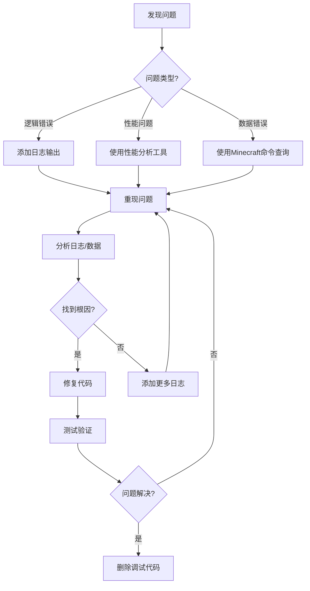

# 调试工具与命令

> **📍 导航**: [🏠 首页](../README.md) > [📂 文档](../README.md#文档导航) > 调试工具与命令
>
> **文档说明**: 深入讲解MODSDK开发中的调试技巧和工具
>
> **📅 最后更新**: 2025-01-11
> **文档版本**: 1.0

---

## 📋 目录

1. [调试概述](#1-调试概述)
2. [日志系统详解](#2-日志系统详解)
3. [Minecraft内置调试命令](#3-minecraft内置调试命令)
4. [自定义调试工具](#4-自定义调试工具)
5. [远程调试技巧](#5-远程调试技巧)
6. [性能分析工具](#6-性能分析工具)
7. [常见问题FAQ](#7-常见问题faq)

---

## 1. 调试概述

### 1.1 为什么需要调试？

**常见问题**：
- ❌ 代码逻辑错误（如事件未触发、数据计算错误）
- ❌ 性能问题（如游戏卡顿、TPS下降）
- ❌ 网络问题（如客户端-服务端不同步）

**调试目标**：
- ✅ 快速定位问题根源
- ✅ 验证修复方案有效性
- ✅ 优化性能瓶颈

---

### 1.2 调试工具分类

| 工具类型 | 适用场景 | 推荐度 |
|---------|---------|-------|
| **日志输出** | 追踪代码执行流程 | 🥇 必备 |
| **Minecraft命令** | 查看游戏状态、实体信息 | 🥇 必备 |
| **自定义调试UI** | 实时监控数据 | 🥈 推荐 |
| **远程调试** | 连接IDE调试器 | 🥉 高级 |
| **性能分析** | 定位性能瓶颈 | 🥈 推荐 |

---

### 1.3 调试流程



---

## 2. 日志系统详解

### 2.1 基础日志输出

#### 方法1：使用print语句

**最简单的调试方法**：

```python
# -*- coding: utf-8 -*-
def OnPlayerJoin(self, args):
    playerId = args['playerId']
    print("[DEBUG] 玩家加入:", playerId)  # 输出到控制台

    playerName = args.get('name', 'Unknown')
    print("[DEBUG] 玩家名称:", playerName)
```

**输出位置**：
- 服务端：服务器控制台（命令行窗口）
- 客户端：客户端日志文件（`logs/latest.log`）

---

#### 方法2：使用MODSDK日志API

```python
import mod.server.extraServerApi as serverApi

# 获取日志组件
logger = serverApi.GetEngineCompFactory().CreateLog(serverApi.GetLevelId())

# 不同级别的日志
logger.Info("这是一条信息日志")
logger.Warning("这是一条警告日志")
logger.Error("这是一条错误日志")
```

**日志级别说明**：

| 级别 | 用途 | 示例 |
|------|------|------|
| **Info** | 正常流程记录 | "玩家加入服务器" |
| **Warning** | 潜在问题提示 | "玩家余额不足" |
| **Error** | 严重错误 | "配置文件加载失败" |

---

### 2.2 结构化日志系统

**问题**：随意使用print导致日志混乱，难以查找

**解决方案**：建立结构化日志管理器

```python
# -*- coding: utf-8 -*-
"""
日志管理器 - 统一日志输出格式
"""

import time

class LogManager:
    """日志管理器（单例模式）"""

    _instance = None

    # 日志级别
    DEBUG = 0
    INFO = 1
    WARNING = 2
    ERROR = 3

    # 日志级别名称
    LEVEL_NAMES = {
        DEBUG: 'DEBUG',
        INFO: 'INFO',
        WARNING: 'WARNING',
        ERROR: 'ERROR'
    }

    @staticmethod
    def GetInstance():
        if LogManager._instance is None:
            LogManager._instance = LogManager()
        return LogManager._instance

    def __init__(self):
        # 当前日志级别（只输出大于等于此级别的日志）
        self.currentLevel = LogManager.INFO

        # 日志前缀（用于区分不同模块）
        self.prefix = "[MyMod]"

    def SetLevel(self, level):
        """设置日志级别"""
        self.currentLevel = level
        print("{} 日志级别设置为: {}".format(self.prefix, self.LEVEL_NAMES[level]))

    def SetPrefix(self, prefix):
        """设置日志前缀"""
        self.prefix = prefix

    def _Log(self, level, message):
        """内部日志输出"""
        if level < self.currentLevel:
            return  # 日志级别不够，跳过

        timestamp = time.strftime('%H:%M:%S')
        levelName = self.LEVEL_NAMES[level]

        logLine = '[{}] {} [{}] {}'.format(timestamp, self.prefix, levelName, message)
        print(logLine)

    def Debug(self, message):
        """调试日志（仅开发时使用）"""
        self._Log(LogManager.DEBUG, message)

    def Info(self, message):
        """信息日志"""
        self._Log(LogManager.INFO, message)

    def Warning(self, message):
        """警告日志"""
        self._Log(LogManager.WARNING, message)

    def Error(self, message):
        """错误日志"""
        self._Log(LogManager.ERROR, message)

# 创建全局日志实例
logger = LogManager.GetInstance()
logger.SetPrefix("[ShopMod]")

# 使用示例
logger.Debug("这是调试信息（默认不显示）")
logger.Info("服务器启动成功")
logger.Warning("玩家余额不足: player_001")
logger.Error("配置文件加载失败")
```

**输出示例**：
```
[10:30:15] [ShopMod] [INFO] 服务器启动成功
[10:30:20] [ShopMod] [WARNING] 玩家余额不足: player_001
[10:30:25] [ShopMod] [ERROR] 配置文件加载失败
```

---

### 2.3 日志输出技巧

#### 技巧1：输出变量类型和值

```python
def ProcessPlayerData(self, playerId, data):
    # ✅ 详细输出变量信息
    logger.Debug("playerId类型: {}, 值: {}".format(type(playerId), playerId))
    logger.Debug("data类型: {}, 内容: {}".format(type(data), data))

    # ❌ 不够详细
    # print(playerId, data)
```

---

#### 技巧2：输出函数调用栈

```python
import traceback

def CriticalFunction(self):
    try:
        # 关键逻辑
        result = self.DoSomething()
    except Exception as e:
        # 输出完整异常堆栈
        logger.Error("发生异常: {}".format(e))
        logger.Error("调用栈:\n{}".format(traceback.format_exc()))
```

---

#### 技巧3：输出对象状态

```python
def DebugEntityState(self, entityId):
    """输出实体完整状态（用于调试）"""
    logger.Debug("===== 实体状态 =====")
    logger.Debug("Entity ID: {}".format(entityId))

    # 输出位置
    posComp = serverApi.GetEngineCompFactory().CreatePos(entityId)
    pos = posComp.GetPos()
    logger.Debug("位置: {}".format(pos))

    # 输出生命值
    attrComp = serverApi.GetEngineCompFactory().CreateAttr(entityId)
    health = attrComp.GetAttrValue(serverApi.GetMinecraftEnum().AttrType.HEALTH)
    logger.Debug("生命值: {}".format(health))

    logger.Debug("==================")
```

---

### 2.4 日志文件持久化

**问题**：控制台日志重启后消失

**解决方案**：写入文件

```python
# -*- coding: utf-8 -*-
import os
import time

class FileLogger:
    """文件日志记录器"""

    def __init__(self, logFilePath):
        self.logFilePath = logFilePath

        # 确保日志目录存在
        logDir = os.path.dirname(logFilePath)
        if not os.path.exists(logDir):
            os.makedirs(logDir)

    def Log(self, level, message):
        """写入日志文件"""
        timestamp = time.strftime('%Y-%m-%d %H:%M:%S')
        logLine = '[{}] [{}] {}\n'.format(timestamp, level, message)

        try:
            # 追加模式写入
            with open(self.logFilePath, 'a', encoding='utf-8') as f:
                f.write(logLine)
        except IOError as e:
            print("[FileLogger] 写入日志失败:", e)

    def Info(self, message):
        self.Log('INFO', message)

    def Warning(self, message):
        self.Log('WARNING', message)

    def Error(self, message):
        self.Log('ERROR', message)

# 使用示例
modPath = os.path.dirname(__file__)
logPath = os.path.join(modPath, 'logs', 'debug.log')
fileLogger = FileLogger(logPath)

fileLogger.Info("服务器启动成功")
fileLogger.Error("配置文件加载失败")
```

**日志文件示例**（`behavior_packs/YourMod/logs/debug.log`）：
```
[2025-01-11 10:30:15] [INFO] 服务器启动成功
[2025-01-11 10:30:20] [WARNING] 玩家余额不足
[2025-01-11 10:30:25] [ERROR] 配置文件加载失败
```

---

## 3. Minecraft内置调试命令

### 3.1 常用调试命令清单

| 命令 | 功能 | 示例 |
|------|------|------|
| `/scoreboard` | 查看/设置计分板数据 | `/scoreboard players list` |
| `/data` | 查看实体NBT数据 | `/data get entity @p` |
| `/tag` | 管理实体标签 | `/tag @s add debug_mode` |
| `/execute` | 条件执行命令 | `/execute if entity @p[tag=debug]` |
| `/gametest` | 运行游戏测试 | `/gametest run myTest` |

---

### 3.2 实体信息查询

#### 命令1：查看玩家位置

```
/execute as @p run say 我的位置: ~ ~ ~
```

**输出**：`我的位置: 100 64 200`

---

#### 命令2：查看实体属性

```
/data get entity @p Health
```

**输出**：`player_001的生命值为20.0`

---

#### 命令3：列出所有实体

```
/execute as @e run say 我是 @s
```

**输出**：
```
minecraft:zombie说: 我是 @s
minecraft:player说: 我是 @s
```

---

### 3.3 自定义调试命令

**场景**：添加MOD专用的调试命令

#### 示例：/debugshop命令

```python
# -*- coding: utf-8 -*-
"""
自定义调试命令：/debugshop
功能：输出玩家商城数据
"""

import mod.server.extraServerApi as serverApi

ServerSystem = serverApi.GetServerSystemCls()

class ShopServerSystem(ServerSystem):
    def __init__(self, namespace, systemName):
        super(ShopServerSystem, self).__init__(namespace, systemName)

        # 注册自定义命令
        self.RegisterCommand('debugshop', self.OnDebugShopCommand)

    def RegisterCommand(self, cmdName, callback):
        """注册自定义命令"""
        # 监听玩家输入命令事件
        self.ListenForEvent(
            serverApi.GetEngineNamespace(),
            serverApi.GetEngineSystemName(),
            'PlayerInputCommandEvent',
            self,
            self.OnPlayerInputCommand
        )

        # 保存命令回调
        if not hasattr(self, 'customCommands'):
            self.customCommands = {}
        self.customCommands[cmdName] = callback

    def OnPlayerInputCommand(self, args):
        """监听玩家输入命令"""
        playerId = args['playerId']
        command = args['command']

        # 检查是否为自定义命令
        if command.startswith('/'):
            cmdName = command[1:].split(' ')[0]
            if cmdName in self.customCommands:
                # 调用命令回调
                self.customCommands[cmdName](playerId, command)

                # 取消默认命令处理
                args['cancel'] = True

    def OnDebugShopCommand(self, playerId, command):
        """
        /debugshop命令处理

        命令格式：/debugshop [playerId]
        """
        parts = command.split(' ')

        # 确定目标玩家
        if len(parts) > 1:
            targetPlayerId = parts[1]
        else:
            targetPlayerId = playerId

        # 获取玩家商城数据
        shopData = self._GetPlayerShopData(targetPlayerId)

        # 输出到聊天窗口
        self._SendMessage(playerId, "===== 商城数据 =====")
        self._SendMessage(playerId, "玩家ID: {}".format(targetPlayerId))
        self._SendMessage(playerId, "余额: {}".format(shopData.get('balance', 0)))
        self._SendMessage(playerId, "购买次数: {}".format(len(shopData.get('purchaseHistory', []))))
        self._SendMessage(playerId, "==================")

    def _SendMessage(self, playerId, message):
        """向玩家发送聊天消息"""
        chatComp = serverApi.GetEngineCompFactory().CreateMsg(playerId)
        chatComp.NotifyOneMessage(playerId, message, "§e[调试]§r")

    def _GetPlayerShopData(self, playerId):
        """获取玩家商城数据（示例）"""
        # 实际项目中应从ExtraData读取
        return {
            'balance': 1000,
            'purchaseHistory': ['item1', 'item2']
        }
```

**使用示例**：
```
/debugshop           # 查看自己的商城数据
/debugshop player_001  # 查看指定玩家的商城数据
```

**输出**：
```
[调试] ===== 商城数据 =====
[调试] 玩家ID: player_001
[调试] 余额: 1000
[调试] 购买次数: 2
[调试] ==================
```

---

## 4. 自定义调试工具

### 4.1 实时数据监控UI

**场景**：在游戏中实时查看System状态

#### 示例：性能监控UI

```python
# -*- coding: utf-8 -*-
"""
客户端调试UI：实时显示性能数据
"""

import mod.client.extraClientApi as clientApi

ClientSystem = clientApi.GetClientSystemCls()

class DebugClientSystem(ClientSystem):
    def __init__(self, namespace, systemName):
        super(DebugClientSystem, self).__init__(namespace, systemName)

        # 创建调试UI
        self.debugUI = None
        self._CreateDebugUI()

        # 定时更新UI
        self.CreateTimer(1.0, self.UpdateDebugUI)

    def _CreateDebugUI(self):
        """创建调试UI（伪代码，实际需要使用ScreenNode）"""
        # 实际项目中应使用MODSDK的UI系统
        print("[DebugUI] 调试UI已创建")

    def UpdateDebugUI(self):
        """更新调试信息"""
        # 获取FPS（帧率）
        fps = self._GetFPS()

        # 获取实体数量
        entityCount = self._GetEntityCount()

        # 获取TPS（服务器每秒Tick数）
        tps = self._GetTPS()

        # 输出到控制台（实际项目中应更新UI）
        debugInfo = "FPS: {} | 实体数: {} | TPS: {}".format(fps, entityCount, tps)
        print("[DebugUI]", debugInfo)

        # 重新创建定时器
        self.CreateTimer(1.0, self.UpdateDebugUI)

    def _GetFPS(self):
        """获取当前帧率（示例）"""
        # 实际项目中应使用引擎API获取
        return 60

    def _GetEntityCount(self):
        """获取实体数量"""
        # 实际项目中应使用GetEngineActor()
        return 100

    def _GetTPS(self):
        """获取服务器TPS（示例）"""
        # 需要从服务端同步获取
        return 20
```

---

### 4.2 代码性能计时器

**场景**：测量函数执行耗时

```python
# -*- coding: utf-8 -*-
import time

class PerformanceTimer:
    """性能计时器"""

    def __init__(self, name):
        self.name = name
        self.startTime = None

    def Start(self):
        """开始计时"""
        self.startTime = time.time()

    def Stop(self):
        """停止计时并输出结果"""
        if self.startTime is None:
            print("[PerformanceTimer] 错误：未调用Start()")
            return

        elapsed = time.time() - self.startTime
        print("[PerformanceTimer] {} 耗时: {:.3f}秒".format(self.name, elapsed))
        self.startTime = None

# 使用示例
timer = PerformanceTimer("加载配置")
timer.Start()

# 执行需要计时的代码
config = self.LoadShopConfig()

timer.Stop()
```

**输出示例**：
```
[PerformanceTimer] 加载配置 耗时: 0.025秒
```

---

### 4.3 上下文管理器版本（Python 2.7兼容）

```python
# -*- coding: utf-8 -*-
import time

class Timer(object):
    """性能计时器（支持with语句）"""

    def __init__(self, name):
        self.name = name
        self.startTime = None

    def __enter__(self):
        self.startTime = time.time()
        return self

    def __exit__(self, exc_type, exc_val, exc_tb):
        elapsed = time.time() - self.startTime
        print("[Timer] {} 耗时: {:.3f}秒".format(self.name, elapsed))

# 使用示例
with Timer("批量处理成就"):
    for playerId in playerList:
        self.ProcessAchievements(playerId)
```

**输出示例**：
```
[Timer] 批量处理成就 耗时: 0.150秒
```

---

## 5. 远程调试技巧

### 5.1 什么是远程调试？

**定义**：将IDE调试器（如VSCode、PyCharm）连接到运行中的Minecraft服务器，支持断点、单步执行等功能。

**优势**：
- ✅ 可以设置断点，暂停代码执行
- ✅ 可以单步执行，查看变量值
- ✅ 比日志输出更高效

**劣势**：
- ❌ 配置复杂（需要IDE支持）
- ❌ 可能影响游戏性能

---

### 5.2 远程调试配置（VSCode + ptvsd）

#### 步骤1：安装ptvsd库

```bash
pip install ptvsd
```

---

#### 步骤2：在MOD代码中启用调试服务器

```python
# -*- coding: utf-8 -*-
"""
启用远程调试（仅开发环境）
"""

import mod.server.extraServerApi as serverApi

ServerSystem = serverApi.GetServerSystemCls()

class MyServerSystem(ServerSystem):
    def __init__(self, namespace, systemName):
        super(MyServerSystem, self).__init__(namespace, systemName)

        # ⚠️ 仅在开发环境启用远程调试
        if self._IsDevMode():
            self._EnableRemoteDebug()

    def _IsDevMode(self):
        """检查是否为开发模式"""
        # 可以通过配置文件或环境变量判断
        return True  # 示例：始终开启

    def _EnableRemoteDebug(self):
        """启用远程调试"""
        try:
            import ptvsd

            # 监听5678端口（可自定义）
            ptvsd.enable_attach(address=('0.0.0.0', 5678))
            print("[RemoteDebug] 远程调试已启用，端口: 5678")
            print("[RemoteDebug] 请在IDE中附加调试器")

            # 可选：等待调试器连接后再继续执行
            # ptvsd.wait_for_attach()

        except ImportError:
            print("[RemoteDebug] 未安装ptvsd库，跳过远程调试")
        except Exception as e:
            print("[RemoteDebug] 启用远程调试失败:", e)
```

---

#### 步骤3：在VSCode中配置调试

创建`.vscode/launch.json`：

```json
{
  "version": "0.2.0",
  "configurations": [
    {
      "name": "Python: 附加到Minecraft服务器",
      "type": "python",
      "request": "attach",
      "connect": {
        "host": "localhost",
        "port": 5678
      },
      "pathMappings": [
        {
          "localRoot": "${workspaceFolder}/behavior_packs/YourMod",
          "remoteRoot": "/path/to/minecraft/behavior_packs/YourMod"
        }
      ]
    }
  ]
}
```

---

#### 步骤4：开始调试

1. 启动Minecraft服务器（会监听5678端口）
2. 在VSCode中按F5，选择"Python: 附加到Minecraft服务器"
3. 在代码中设置断点
4. 触发断点（如玩家加入服务器）

---

### 5.3 远程调试注意事项

**注意1：仅在开发环境启用**

```python
# ✅ 使用配置开关
if config.get('debug_mode', False):
    self._EnableRemoteDebug()

# ❌ 生产环境不要启用
# self._EnableRemoteDebug()  # 会导致端口泄露
```

---

**注意2：断点会阻塞游戏**

- 当代码暂停在断点时，整个服务器会停止
- 仅用于单人测试，不要在多人服务器使用

---

**注意3：Python 2.7兼容性**

- ptvsd旧版本支持Python 2.7
- 安装命令：`pip install ptvsd==4.3.2`

---

## 6. 性能分析工具

### 6.1 性能瓶颈检测

**场景**：游戏卡顿，需要找出哪个函数耗时最多

#### 方法1：手动计时

```python
import time

class PerformanceProfiler:
    """性能分析器"""

    def __init__(self):
        # 记录每个函数的耗时
        self.timings = {}

    def Profile(self, funcName):
        """装饰器：自动记录函数耗时"""
        def Decorator(func):
            def Wrapper(*args, **kwargs):
                startTime = time.time()
                result = func(*args, **kwargs)
                elapsed = time.time() - startTime

                # 累计耗时
                if funcName not in self.timings:
                    self.timings[funcName] = {'count': 0, 'total': 0.0}

                self.timings[funcName]['count'] += 1
                self.timings[funcName]['total'] += elapsed

                return result
            return Wrapper
        return Decorator

    def PrintReport(self):
        """输出性能报告"""
        print("===== 性能分析报告 =====")
        for funcName, stats in sorted(self.timings.items(), key=lambda x: x[1]['total'], reverse=True):
            avgTime = stats['total'] / stats['count']
            print("{}: 总耗时{:.3f}秒, 调用{}次, 平均{:.3f}秒".format(
                funcName, stats['total'], stats['count'], avgTime
            ))
        print("========================")

# 创建全局分析器
profiler = PerformanceProfiler()

# 使用示例
@profiler.Profile('ProcessAchievements')
def ProcessAchievements(self, playerId):
    # 业务逻辑
    time.sleep(0.01)  # 模拟耗时操作

# 定期输出报告
def OnServerTick(self):
    # 每100 tick输出一次报告
    if self.tickCount % 100 == 0:
        profiler.PrintReport()
```

**输出示例**：
```
===== 性能分析报告 =====
ProcessAchievements: 总耗时1.250秒, 调用100次, 平均0.013秒
UpdatePlayerData: 总耗时0.500秒, 调用200次, 平均0.003秒
========================
```

---

### 6.2 TPS监控

**TPS（Ticks Per Second）**：服务器每秒执行的游戏刻数

- 正常值：20 TPS
- 卡顿：<20 TPS

#### 实现TPS监控

```python
# -*- coding: utf-8 -*-
import time

class TPSMonitor:
    """TPS监控器"""

    def __init__(self):
        self.lastCheckTime = time.time()
        self.tickCount = 0
        self.currentTPS = 20.0

    def OnTick(self):
        """每个Tick调用一次"""
        self.tickCount += 1

        # 每秒统计一次TPS
        now = time.time()
        elapsed = now - self.lastCheckTime

        if elapsed >= 1.0:
            self.currentTPS = self.tickCount / elapsed
            print("[TPS] 当前TPS: {:.2f}".format(self.currentTPS))

            # 重置计数器
            self.tickCount = 0
            self.lastCheckTime = now

    def GetCurrentTPS(self):
        """获取当前TPS"""
        return self.currentTPS

# 在ServerSystem中使用
class MyServerSystem(ServerSystem):
    def __init__(self, namespace, systemName):
        super(MyServerSystem, self).__init__(namespace, systemName)
        self.tpsMonitor = TPSMonitor()

    def Update(self):
        """每Tick执行一次"""
        self.tpsMonitor.OnTick()
```

---

## 7. 常见问题FAQ

### Q1: 日志输出中文乱码怎么办？

**答案**：确保文件编码为UTF-8

```python
# 文件开头添加编码声明
# -*- coding: utf-8 -*-

# 文件操作指定编码
with open(logPath, 'a', encoding='utf-8') as f:
    f.write(message)
```

---

### Q2: 如何在生产环境禁用调试日志？

**答案**：使用日志级别控制

```python
# 开发环境
logger.SetLevel(LogManager.DEBUG)  # 输出所有日志

# 生产环境
logger.SetLevel(LogManager.INFO)   # 仅输出INFO及以上级别
```

---

### Q3: 如何查看MOD是否正常加载？

**答案**：在`__init__`方法中输出日志

```python
def __init__(self, namespace, systemName):
    super(MyServerSystem, self).__init__(namespace, systemName)
    print("[MyMod] System已加载:", systemName)
```

如果控制台没有输出，说明MOD未正确加载。

---

### Q4: 远程调试无法连接？

**检查清单**：
- ✅ 是否安装了ptvsd？（`pip install ptvsd==4.3.2`）
- ✅ 端口是否被占用？（尝试更换端口）
- ✅ 防火墙是否阻止？（关闭防火墙或开放端口）
- ✅ IDE配置是否正确？（检查launch.json）

---

### Q5: 如何调试客户端代码？

**答案**：客户端日志查看方式

```python
# 客户端日志输出
print("[ClientDebug] 消息内容")

# 日志文件位置
# Windows: C:/Users/YourName/AppData/Local/Packages/.../LocalState/logs/latest.log
# 使用tail -f监控日志变化
```

---

## 📚 推荐阅读

完成本文档学习后，建议继续阅读：

- [性能优化完整指南.md](性能优化完整指南.md) - 深入的性能分析技巧
- [开发规范.md](开发规范.md) - 避免常见错误
- [问题排查.md](问题排查.md) - 常见问题解决方案

---

**文档版本**: 1.0
**最后更新**: 2025-01-11
**贡献者**: NeteaseMod-Claude工作流团队

**知识来源声明**：
本文档基于以下合法来源编写：
- ✅ MODSDK官方开发文档
- ✅ Minecraft基岩版命令参考
- ✅ Python 2.7标准库文档（time、traceback等）
- ✅ 通用软件工程调试最佳实践（如日志分级、性能分析等）

所有代码示例均为独立设计，未引用任何非官方代码实现。
