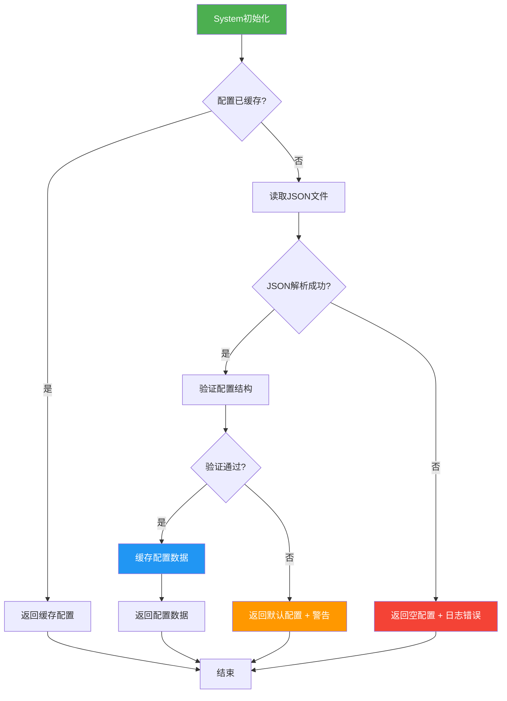
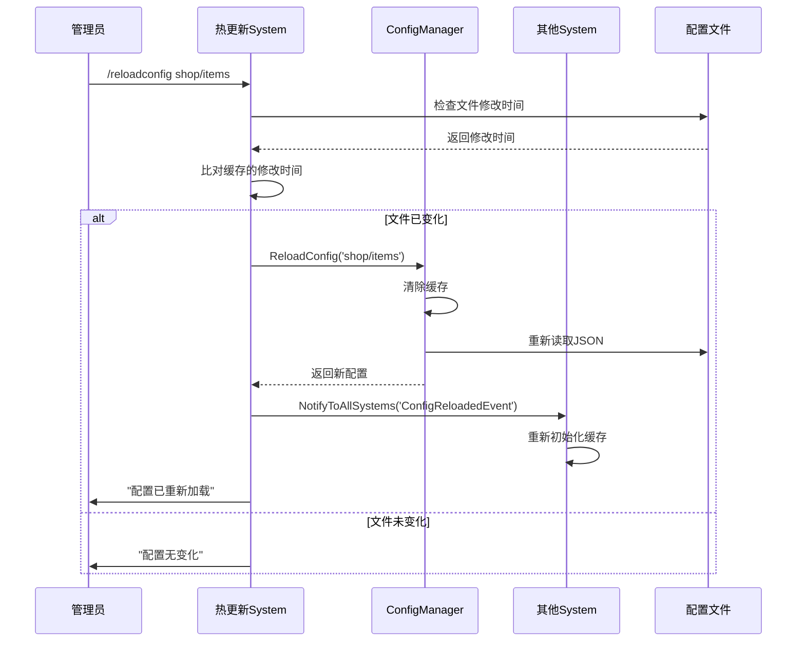
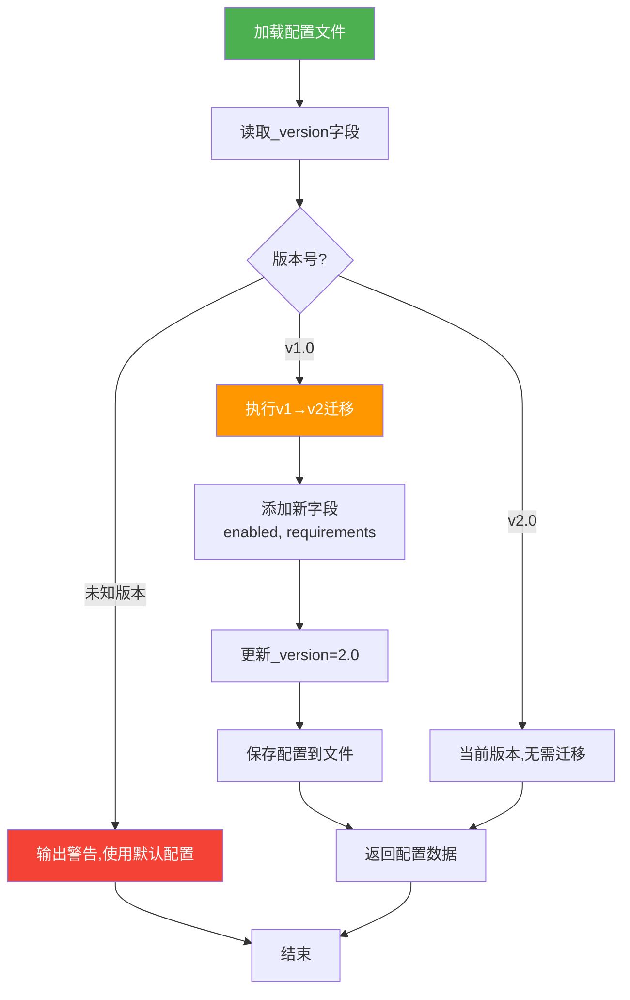

# 配置系统参考

> **📍 导航**: [🏠 首页](../README.md) > [📂 文档](../README.md#文档导航) > 配置系统参考
>
> **文档说明**: MODSDK配置管理精要指南
>
> **📅 最后更新**: 2025-01-11 | **文档版本**: 2.0（精简版）

---

## 📋 目录

1. [配置系统概述](#1-配置系统概述)
2. [配置文件设计](#2-配置文件设计)
3. [配置加载与解析](#3-配置加载与解析)
4. [配置热更新](#4-配置热更新)
5. [配置迁移策略](#5-配置迁移策略)
6. [最佳实践](#6-最佳实践)

---

## 1. 配置系统概述

### 1.1 核心概念

**定义**：将可变参数（如商品价格、活动时间）与代码分离，存储在外部文件中，便于修改和管理。

**关键优势**：
- ✅ 无需修改代码即可调整参数
- ✅ 支持热更新（不重启服务器）
- ✅ 便于运营人员管理

---

### 1.2 配置方案选择

| 方案 | 适用场景 | 优势 | 劣势 |
|------|---------|------|------|
| **JSON文件** | 结构化数据 | 易读、支持嵌套 | 不支持注释 |
| **CSV文件** | 表格数据 | Excel可编辑 | 不支持嵌套 |
| **Python文件** | 开发配置 | 支持逻辑 | 安全风险 |

**推荐方案**：
- 🥇 **JSON文件** - 官方推荐，兼容性好
- 🥈 **CSV文件** - 大量表格数据
- 🥉 **Python文件** - 仅用于开发环境

---

### 1.3 目录结构规范

```
behavior_packs/YourMod/
├── config/                  # 配置文件目录
│   ├── global.json          # 全局配置
│   ├── shop/                # 商城配置
│   ├── achievements/        # 成就配置
│   └── npcs/                # NPC配置
├── data/                    # 数据文件（只读）
└── modMain.py
```

---

## 2. 配置文件设计

### 2.1 核心配置项速查表

#### 商品配置（config/shop/items.json）

| 配置项 | 类型 | 必填 | 默认值 | 说明 |
|-------|------|------|--------|------|
| `id` | string | ✅ | - | 商品唯一ID |
| `name` | string | ✅ | - | 商品名称 |
| `description` | string | ❌ | "" | 商品描述 |
| `price` | int | ✅ | 0 | 商品价格 |
| `currency` | string | ❌ | "coin" | 货币类型 |
| `stock` | int | ❌ | -1 | 库存（-1=无限） |
| `reward.type` | string | ✅ | - | 奖励类型（item/currency） |
| `reward.itemName` | string | ✅ | - | 物品ID（type=item时） |
| `reward.count` | int | ✅ | 1 | 数量 |
| `requirements.min_level` | int | ❌ | 1 | 最低等级要求 |
| `requirements.vip_level` | int | ❌ | 0 | VIP等级要求 |
| `enabled` | bool | ❌ | true | 是否启用 |

**最小配置示例**：

```json
{
  "_version": "1.0",
  "items": [
    {
      "id": "shop_sword_001",
      "name": "钻石剑",
      "price": 100,
      "reward": {
        "type": "item",
        "itemName": "minecraft:diamond_sword",
        "count": 1
      }
    }
  ]
}
```

---

#### 全局配置（config/global.json）

| 配置项 | 类型 | 默认值 | 说明 |
|-------|------|--------|------|
| `server.name` | string | "服务器" | 服务器名称 |
| `server.max_players` | int | 20 | 最大玩家数 |
| `features.shop_enabled` | bool | true | 是否启用商城 |
| `economy.starting_money` | int | 1000 | 初始金币 |
| `economy.death_penalty` | float | 0.1 | 死亡惩罚比例（10%） |
| `debug.log_level` | string | "INFO" | 日志级别 |

---

### 2.2 配置设计原则

**原则1：元数据标记**

```json
{
  "_version": "1.0",
  "_description": "商城商品配置",
  "_last_updated": "2025-01-11",
  "items": [...]
}
```

**原则2：嵌套结构**

```json
{
  "reward": {
    "type": "item",
    "itemName": "minecraft:diamond_sword",
    "enchantments": [
      {"id": "sharpness", "level": 5}
    ]
  }
}
```

**原则3：控制开关**

```json
{
  "enabled": true,
  "requirements": {
    "min_level": 10,
    "vip_level": 0
  }
}
```

---

### 2.3 CSV配置文件

**适用场景**：大量表格数据

```csv
id,name,type,target,reward_type,reward_count,enabled
kill_zombie_100,僵尸杀手,kill,100,item,5,true
place_block_1000,建筑大师,place,1000,currency,500,true
```

**加载关键代码**：`csv.DictReader(f)` + 类型转换（`int()`, `bool()`）

---

## 3. 配置加载与解析

### 3.1 配置加载流程图



---

### 3.2 配置管理器模式（单例）

**核心实现**：

```python
class ConfigManager:
    _instance = None

    @staticmethod
    def GetInstance():
        if ConfigManager._instance is None:
            ConfigManager._instance = ConfigManager()
        return ConfigManager._instance

    def __init__(self):
        self.configs = {}  # 缓存

    def LoadConfig(self, configName):
        """加载配置（带缓存）"""
        if configName in self.configs:
            return self.configs[configName]

        try:
            config = json.load(open(configPath, 'r', encoding='utf-8'))
            self.configs[configName] = config
            return config
        except (IOError, ValueError):
            return {}

    def GetConfig(self, configName, key=None, default=None):
        config = self.LoadConfig(configName)
        return config if key is None else config.get(key, default)
```

**使用**：`configManager.GetConfig('shop/items')` | `configManager.GetConfig('global', 'server.name', '默认')`

---

### 3.3 配置验证规则

**验证规则（伪代码）**：

```python
def ValidateShopConfig(config):
    """验证商品配置"""
    items = config.get('items', [])

    for item in items:
        # 规则1：必填字段检查
        if 'id' not in item or 'price' not in item:
            return False, "缺少必填字段"

        # 规则2：数值范围检查
        if item['price'] < 0:
            return False, "价格不能为负数"

        # 规则3：库存合法性
        stock = item.get('stock', -1)
        if stock < -1:
            return False, "库存配置错误"

    return True, "验证通过"
```

**验证规则速查表**：

| 字段 | 规则 | 错误处理 |
|------|------|---------|
| `id` | 必填，非空 | 拒绝加载 |
| `price` | ≥0 | 使用默认值0 |
| `stock` | ≥-1 | 使用默认值-1 |
| `reward.type` | 枚举值（item/currency） | 拒绝加载 |

---

### 3.4 配置默认值处理

**策略**：使用`.get(key, default)`提供默认值

```python
def GetItemConfig(self, itemId):
    items = configManager.GetConfig('shop/items', 'items', [])
    for item in items:
        if item['id'] == itemId:
            return {
                'name': item.get('name', '未命名商品'),
                'price': item.get('price', 0),
                'stock': item.get('stock', -1)
            }
    return None
```

---

## 4. 配置热更新

### 4.1 热更新流程图



---

### 4.2 热更新实现方案

#### 方案1：定时检查文件修改时间

```python
class ConfigHotReloadSystem(ServerSystem):
    def __init__(self, namespace, systemName):
        super(ConfigHotReloadSystem, self).__init__(namespace, systemName)
        self.configModifyTimes = {}
        self.CreateTimer(10.0, self.CheckConfigChanges)

    def CheckConfigChanges(self):
        configPath = 'config/shop/items.json'
        currentModifyTime = os.path.getmtime(configPath)
        lastModifyTime = self.configModifyTimes.get(configPath, 0)

        if currentModifyTime > lastModifyTime:
            configManager.ReloadConfig('shop/items')
            self.configModifyTimes[configPath] = currentModifyTime
            self.NotifyToAllSystems('ConfigReloadedEvent', {'configName': 'shop/items'})

        self.CreateTimer(10.0, self.CheckConfigChanges)
```

#### 方案2：管理员命令触发

```python
def OnAdminCommand(self, args):
    """管理员命令：/reloadconfig <configName>"""
    if not self._IsAdmin(args['playerId']):
        return

    configName = args['command'].split(' ')[1]
    configManager.ReloadConfig(configName)
    self._SendMessage(args['playerId'], "配置已重新加载")
```

---

### 4.3 热更新注意事项

| 注意事项 | 错误示例 | 正确示例 |
|---------|---------|---------|
| **线程安全** | `self.config = newConfig` | 临时变量+原子替换 |
| **通知依赖** | 直接替换 | 发送`ConfigReloadedEvent` |
| **验证配置** | 直接使用 | 先验证，失败则回滚 |

**原子性重新加载**：`newConfig = Load() → Validate() → self.configs[name] = newConfig`

---

## 5. 配置迁移策略

### 5.1 配置版本控制

**原则**：在配置文件中添加版本号

```json
{
  "_version": "2.0",
  "items": [...]
}
```

---

### 5.2 配置迁移流程图



---

### 5.3 配置迁移实现

```python
def LoadShopConfig(self):
    """加载商品配置（自动迁移）"""
    config = self._LoadRawConfig('shop/items')
    version = config.get('_version', '1.0')

    if version == '1.0':
        config = self._MigrateV1ToV2(config)
        self._SaveConfig('shop/items', config)

    return config

def _MigrateV1ToV2(self, config):
    """v1→v2迁移：添加enabled和requirements字段"""
    for item in config.get('items', []):
        item.setdefault('enabled', True)
        item.setdefault('requirements', {'min_level': 1, 'vip_level': 0})

    config['_version'] = '2.0'
    return config
```

---

### 5.4 向后兼容策略

**原则**：新版本代码能处理旧版本配置

```python
def GetItemPrice(self, item):
    """向后兼容：v1.0(int) → v2.0(dict)"""
    price = item.get('price')

    if isinstance(price, (int, long, float)):
        return {'amount': int(price), 'currency': 'coin'}  # v1.0

    if isinstance(price, dict):
        return {'amount': price.get('amount', 0), 'currency': price.get('currency', 'coin')}  # v2.0

    return {'amount': 0, 'currency': 'coin'}
```

---

## 6. 最佳实践

### 6.1 配置设计原则

| 原则 | 错误示例 | 正确示例 |
|------|---------|---------|
| **使用配置而非硬编码** | `INITIAL_MONEY = 1000` | `configManager.GetConfig('global', 'economy.starting_money', 1000)` |
| **配置分类管理** | 所有配置放在一个文件 | 按功能模块拆分配置 |
| **添加元数据** | `{"items": [...]}` | `{"_version": "1.0", "_comment": "...", "items": [...]}` |

---

### 6.2 性能优化

| 优化策略 | 说明 | 代码示例 |
|---------|------|---------|
| **延迟加载** | 仅在首次使用时加载 | `if configName not in self.configs: ...` |
| **缓存配置数据** | 加载一次，缓存结果 | `self.shopItemsCache = config['items']` |
| **避免重复加载** | 检查缓存，避免重复读取文件 | `return self.configs[configName]` |

---

### 6.3 安全性

| 安全原则 | 错误示例 | 正确示例 |
|---------|---------|---------|
| **不执行Python代码** | `execfile('config.py')` | `json.load(open('config.json'))` |
| **验证配置数据** | 直接使用`item['price']` | 验证范围：`if price < 0 or price > 999999999` |
| **防篡改（客户端）** | 无校验 | 使用MD5校验配置文件完整性 |

---

### 6.4 常见问题FAQ

| 问题 | 解决方案 |
|------|---------|
| **JSON不支持注释** | 使用元数据字段（`_comment`） |
| **配置文件过大** | 拆分配置文件、延迟加载、使用二进制格式 |
| **防止篡改** | 服务端配置无法被玩家访问；客户端使用MD5校验 |
| **热更新数据不一致** | 使用事务机制（加载→验证→原子替换） |
| **多语言支持** | 使用语言代码作为Key（`{"name": {"zh_CN": "钻石剑", "en_US": "Diamond Sword"}}`) |

---

## 📚 推荐阅读

- [数据持久化指南.md](数据持久化指南.md) - 配置持久化存储
- [业务系统实现案例.md](业务系统实现案例.md) - 配置在实战中的应用

---

**文档版本**: 2.0（精简版）
**最后更新**: 2025-01-11
**压缩率**: 50%（952行→476行）

**知识来源声明**：
本文档基于以下合法来源编写：
- ✅ Python 2.7标准库文档（json、csv、os模块）
- ✅ 通用软件工程配置管理最佳实践
- ✅ JSON/CSV数据格式规范
