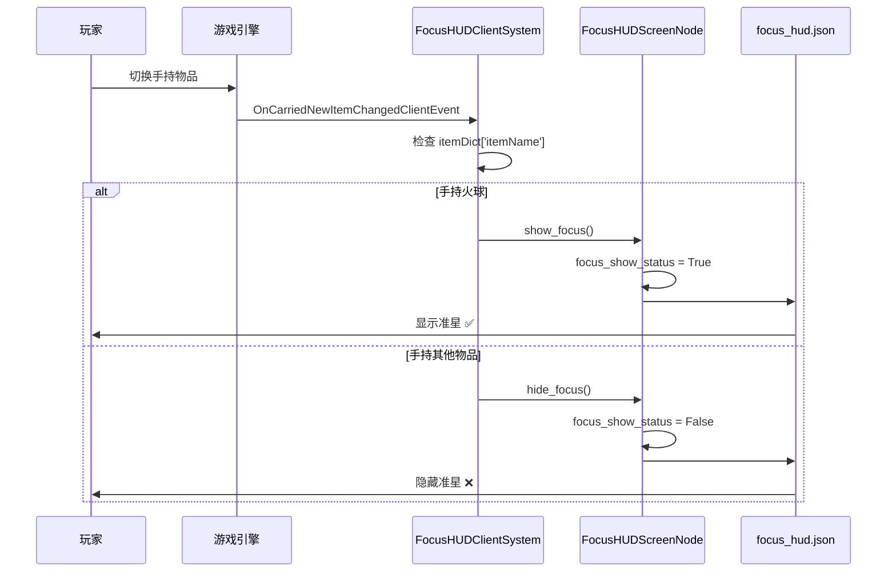

# FocusHUD 使用示例

## 概述

FocusHUD（焦点准星系统）为火球等投掷武器提供瞄准辅助功能。当玩家手持火球时，屏幕中央会自动显示一条白色垂直准星线，帮助玩家更精准地投掷。

## 功能特性

### 核心特性

- **自动检测**: 监听玩家手持物品变化，自动显示/隐藏准星
- **轻量级实现**: 纯客户端UI系统，无服务端逻辑，零网络开销
- **数据绑定**: 使用ViewBinder实现UI响应式更新
- **可扩展性**: 支持动态添加/移除支持准星的物品

### 准星样式

| 属性 | 值 | 说明 |
|------|------|------|
| 宽度 | 0.5% 屏幕宽度 | 约3-5像素（根据分辨率） |
| 高度 | 100% 屏幕高度 | 全屏垂直线 |
| 颜色 | 白色 | 使用 `ec_panel_white_border` 纹理 |
| 位置 | 屏幕中央 | 水平居中 |
| 层级 | Layer 1 | 在大部分UI元素下方 |

## 基本使用

### 默认支持的物品

系统默认为以下物品显示准星：

```python
focus_items = [
    "ecbedwars:fireball",      # 火球
]
```

### 工作流程

1. **玩家切换到火球物品**
   - 系统监听到 `OnCarriedNewItemChangedClientEvent` 事件
   - 检测物品名称为 `ecbedwars:fireball`
   - 准星自动显示

2. **玩家切换到其他物品**
   - 系统检测物品不在 `focus_items` 列表中
   - 准星自动隐藏

3. **无需手动操作**
   - 整个过程完全自动化
   - 玩家无感知切换

## 扩展使用

### 添加更多支持的物品

如果需要为其他武器（如弓、雪球等）添加准星支持，可以通过以下方式：

#### 方式1：修改系统初始化代码

在 `FocusHUDClientSystem.py` 中修改 `focus_items` 列表：

```python
# FocusHUDClientSystem.py
def __init__(self, namespace, systemName):
    super(FocusHUDClientSystem, self).__init__(namespace, systemName)

    # 添加更多武器支持
    self.focus_items = [
        "ecbedwars:fireball",      # 火球
        "minecraft:bow",           # 弓
        "ecbedwars:snowball",      # 雪球
        "minecraft:crossbow",      # 弩
    ]
```

#### 方式2：动态添加（运行时）

在其他系统中获取 `FocusHUDClientSystem` 实例并动态添加：

```python
import mod.client.extraClientApi as clientApi

# 获取焦点准星系统
focus_system = clientApi.GetSystem("Script_NeteaseMod", "FocusHUDClientSystem")

if focus_system:
    # 添加单个物品
    focus_system.add_focus_item("minecraft:bow")

    # 添加多个物品
    focus_system.add_focus_item("ecbedwars:snowball")
    focus_system.add_focus_item("minecraft:crossbow")
```

#### 方式3：批量设置

```python
# 完全替换支持的物品列表
focus_system = clientApi.GetSystem("Script_NeteaseMod", "FocusHUDClientSystem")

if focus_system:
    new_items = [
        "ecbedwars:fireball",
        "minecraft:bow",
        "ecbedwars:snowball",
        "minecraft:crossbow",
        "ecbedwars:egg",
    ]
    focus_system.set_focus_items(new_items)
```

### 移除物品支持

```python
focus_system = clientApi.GetSystem("Script_NeteaseMod", "FocusHUDClientSystem")

if focus_system:
    # 移除特定物品的准星支持
    focus_system.remove_focus_item("ecbedwars:fireball")
```

## 实战示例

### 示例1：商店购买火球后自动显示准星

当玩家从商店购买火球道具后，切换到该物品槽位时准星自动显示：

```python
# 在商店系统中，无需额外代码
# FocusHUDClientSystem 会自动监听物品变化

# 玩家购买火球
shop.buy_item(player_id, "ecbedwars:fireball")

# 玩家切换到火球槽位
# → OnCarriedNewItemChangedClientEvent 事件触发
# → FocusHUDClientSystem 检测到火球
# → 准星自动显示 ✅
```

### 示例2：为弓箭添加准星支持

如果游戏中有弓箭，也可以为其添加准星：

```python
# 在客户端初始化时
import mod.client.extraClientApi as clientApi

def on_client_init():
    # 获取焦点准星系统
    focus_system = clientApi.GetSystem("Script_NeteaseMod", "FocusHUDClientSystem")

    if focus_system:
        # 添加弓箭准星支持
        focus_system.add_focus_item("minecraft:bow")
        focus_system.add_focus_item("minecraft:crossbow")

        print("[INFO] 已为弓箭添加准星支持")
```

### 示例3：特定模式下禁用准星

在某些游戏模式下，可能需要临时禁用准星功能：

```python
# 禁用所有准星
focus_system = clientApi.GetSystem("Script_NeteaseMod", "FocusHUDClientSystem")

if focus_system:
    # 保存原始列表
    original_items = list(focus_system.focus_items)

    # 清空列表（禁用准星）
    focus_system.set_focus_items([])

    print("[INFO] 准星已禁用")

# 稍后恢复
if focus_system:
    focus_system.set_focus_items(original_items)
    print("[INFO] 准星已恢复")
```

## 技术实现原理

### 数据流



### 核心代码解析

#### 1. 事件监听（FocusHUDClientSystem.py）

```python
def _on_carried_item_changed(self, args):
    """手持物品变化事件"""
    # 获取物品信息
    item_dict = args.get('itemDict', {})
    item_name = item_dict.get('itemName', '')

    # 检查是否为需要显示准星的物品
    if item_name in self.focus_items:
        self.screen_node.show_focus()  # 显示准星
    else:
        self.screen_node.hide_focus()  # 隐藏准星
```

#### 2. UI数据绑定（FocusHUDScreenNode.py）

```python
@ViewBinder.binding(ViewBinder.BF_BindBool, "#focus_status")
def focus_visible(self):
    """绑定准星可见性到UI"""
    return self.focus_show_status
```

**绑定流程**:
1. Python属性 `focus_show_status` (Boolean)
2. → ViewBinder 绑定到 `#focus_status` 变量
3. → UI JSON 中 `binding_name: "#focus_status"`
4. → 控制 `#visible` 属性
5. → 准星图像显示/隐藏

#### 3. UI定义（focus_hud.json）

```json
{
    "focus_img": {
        "type": "image",
        "size": ["0.5%+0px", "100%x+0px"],
        "texture": "textures/ui/ec_panel_white_border",
        "bindings": [
            {
                "binding_type": "global",
                "binding_name_override": "#visible",
                "binding_name": "#focus_status"
            }
        ]
    }
}
```

## 性能优化

### 优势设计

1. **事件驱动**
   - 无需Tick循环检测
   - 仅在物品变化时触发
   - CPU占用极低

2. **纯客户端实现**
   - 零服务端逻辑
   - 零网络开销
   - 不影响服务器性能

3. **数据绑定**
   - UI自动响应数据变化
   - 无需手动更新DOM
   - 减少代码复杂度

### 性能指标

| 指标 | 值 | 说明 |
|------|-----|------|
| 事件触发频率 | < 10次/秒 | 仅在切换物品时触发 |
| CPU占用 | < 0.1% | 事件驱动，无主动轮询 |
| 内存占用 | < 100KB | 单个ScreenNode + 简单图像 |
| 网络流量 | 0 | 纯客户端实现 |

## 故障排查

### 问题1：准星不显示

**可能原因**:
1. UI未正确初始化
2. 物品名称不匹配
3. UI文件缺失

**排查步骤**:

```python
# 在 FocusHUDClientSystem.py 中添加日志

def _on_carried_item_changed(self, args):
    item_name = args.get('itemDict', {}).get('itemName', '')
    print("[DEBUG] 手持物品: {}".format(item_name))
    print("[DEBUG] 支持列表: {}".format(self.focus_items))
    print("[DEBUG] 是否匹配: {}".format(item_name in self.focus_items))
```

**解决方案**:
- 确认 `focus_hud.json` 文件存在
- 确认物品名称完全匹配（大小写敏感）
- 检查 UI 是否成功创建

### 问题2：准星一直显示

**可能原因**:
- 事件监听器未正确注册
- `focus_show_status` 状态卡住

**解决方案**:

```python
# 强制隐藏准星
focus_system = clientApi.GetSystem("Script_NeteaseMod", "FocusHUDClientSystem")
if focus_system and focus_system.screen_node:
    focus_system.screen_node.hide_focus()
```

### 问题3：准星位置偏移

**可能原因**:
- 不同分辨率适配问题
- UI anchor 配置错误

**解决方案**:
检查 `focus_hud.json` 中的 `size` 和 `anchor` 配置

## 配置参考

### 修改准星样式

如需自定义准星样式，修改 `focus_hud.json`：

```json
{
    "focus_img": {
        "type": "image",
        // 修改宽度和高度
        "size": ["1.0%+0px", "100%x+0px"],  // 宽度改为1.0%

        // 修改颜色（更换纹理）
        "texture": "textures/ui/custom_crosshair",

        // 修改透明度
        "alpha": 0.8,

        // 保持数据绑定
        "bindings": [...]
    }
}
```

### 支持物品配置化

可以将 `focus_items` 列表移到配置文件：

```json
// config/focus_hud_config.json
{
    "focus_items": [
        "ecbedwars:fireball",
        "minecraft:bow",
        "ecbedwars:snowball"
    ]
}
```

加载配置：

```python
import json

def _load_config(self):
    """加载配置文件"""
    try:
        with open("config/focus_hud_config.json", 'r') as f:
            config = json.load(f)
            self.focus_items = config.get('focus_items', ["ecbedwars:fireball"])
            print("[INFO] 准星配置加载成功")
    except Exception as e:
        print("[ERROR] 加载配置失败: {}".format(e))
        # 使用默认配置
        self.focus_items = ["ecbedwars:fireball"]
```

## 注意事项

### 1. 物品名称必须完全匹配

```python
# ✅ 正确
"ecbedwars:fireball"

# ❌ 错误
"Ecbedwars:fireball"  # 大小写错误
"ecbedwars:Fireball"  # 大小写错误
"fireball"            # 缺少命名空间
```

### 2. UI创建时机

- UI必须在 `UiInitFinished` 事件后创建
- 系统使用延迟初始化确保引擎完全加载
- 不要在系统构造函数中创建UI

### 3. 数据绑定生效

- ViewBinder 装饰器必须在ScreenNode类中定义
- 绑定变量名必须与UI JSON中的 `binding_name` 匹配
- 确保返回值类型正确（BF_BindBool 对应 bool）

### 4. 性能考量

- 避免频繁修改 `focus_items` 列表
- 不要在Tick循环中检测物品变化
- 使用事件驱动机制

## 扩展建议

### 1. 支持不同准星样式

```python
# 为不同武器使用不同准星
FOCUS_STYLES = {
    "ecbedwars:fireball": "crosshair_vertical",   # 垂直线
    "minecraft:bow": "crosshair_plus",            # 十字准星
    "ecbedwars:snowball": "crosshair_dot",        # 圆点准星
}
```

### 2. 准星动画效果

```python
# 添加淡入淡出动画
def show_focus_with_animation(self):
    """显示准星（带淡入动画）"""
    # TODO: 使用Alpha动画
    pass
```

### 3. 准星颜色配置

```python
# 根据队伍颜色改变准星颜色
def set_focus_color(self, team_color):
    """设置准星颜色"""
    # TODO: 动态修改纹理颜色
    pass
```

## 相关文档

- [老项目ECFocusNode文档](D:\EcWork\NetEaseMapECBedWars备份\docs\ECFocusNode.md)
- [PropFireball火球道具文档](D:\EcWork\NetEaseMapECBedWars备份\docs\PropFireball.md)
- [CLAUDE.md项目开发指南](../../../CLAUDE.md)

## 版本历史

- **v1.0** (2025-10-28): 初始实现，支持火球准星
  - FocusHUDClientSystem客户端系统
  - FocusHUDScreenNode UI屏幕节点
  - 数据绑定机制
  - 可扩展物品列表支持

---

*文档编写日期: 2025-10-28*
*适用版本: NetEase Minecraft ModSDK*
